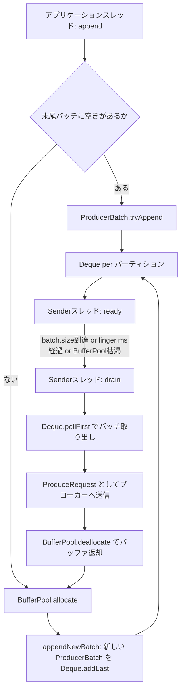

# 第5章 RecordAccumulator と BufferPool によるバッチング

> **本章で読むソース**
>
> - [`clients/src/main/java/org/apache/kafka/clients/producer/internals/RecordAccumulator.java`](https://github.com/apache/kafka/blob/4.3.1/clients/src/main/java/org/apache/kafka/clients/producer/internals/RecordAccumulator.java)
> - [`clients/src/main/java/org/apache/kafka/clients/producer/internals/BufferPool.java`](https://github.com/apache/kafka/blob/4.3.1/clients/src/main/java/org/apache/kafka/clients/producer/internals/BufferPool.java)
> - [`clients/src/main/java/org/apache/kafka/clients/producer/internals/ProducerBatch.java`](https://github.com/apache/kafka/blob/4.3.1/clients/src/main/java/org/apache/kafka/clients/producer/internals/ProducerBatch.java)
> - [`clients/src/main/java/org/apache/kafka/clients/producer/internals/BuiltInPartitioner.java`](https://github.com/apache/kafka/blob/4.3.1/clients/src/main/java/org/apache/kafka/clients/producer/internals/BuiltInPartitioner.java)

## この章の狙い

プロデューサーの `send()` はアプリケーションスレッドから呼ばれるが、ブローカーへの実際の送信は別スレッド（Sender）が担う。
両者の間を仲介するのが `RecordAccumulator` である。

本章では、レコードがパーティションごとの `Deque<ProducerBatch>` に貯まっていく仕組み、`BufferPool` によるメモリ管理、`batch.size` と `linger.ms` が送信タイミングをどう決めるかを、実装に沿って説明する。

## 前提

プロデューサーの `send()` がネットワークスレッドとは別にレコードを受け付けること、Kafka のメッセージはトピックとパーティションに紐づくことを前提とする。
`Callback` や `RecordMetadata` などプロデューサー API の型は既知として扱う。

## パーティションごとのバッチキュー

`RecordAccumulator` は、トピックごとの情報を `TopicInfo` にまとめ、パーティション番号から `Deque<ProducerBatch>` を引く構造を持つ。

[`clients/src/main/java/org/apache/kafka/clients/producer/internals/RecordAccumulator.java L1283-L1290`](https://github.com/apache/kafka/blob/4.3.1/clients/src/main/java/org/apache/kafka/clients/producer/internals/RecordAccumulator.java#L1283-L1290)

```java
    private static class TopicInfo {
        public final ConcurrentMap<Integer /*partition*/, Deque<ProducerBatch>> batches = new CopyOnWriteMap<>();
        public final BuiltInPartitioner builtInPartitioner;

        public TopicInfo(BuiltInPartitioner builtInPartitioner) {
            this.builtInPartitioner = builtInPartitioner;
        }
    }
```

`batches` は `TopicInfo` の中の1フィールドであり、キーはパーティション番号、値はそのパーティション宛てのバッチを並べた `Deque` である。
`append()` はこの `Deque` の末尾（`addLast`）に新しいバッチを積み、`Sender` は先頭（`pollFirst`）から取り出す。
新しいレコードほど末尾に近く、古いレコードほど先に送信される、先入れ先出しの列になる。

## append の2段構え

`append()` は、まず既存の末尾バッチへの追記を試み、失敗したら新しいバッチを確保するという2段階の処理を取る。

[`clients/src/main/java/org/apache/kafka/clients/producer/internals/RecordAccumulator.java L312-L353`](https://github.com/apache/kafka/blob/4.3.1/clients/src/main/java/org/apache/kafka/clients/producer/internals/RecordAccumulator.java#L312-L353)

```java
                // check if we have an in-progress batch
                Deque<ProducerBatch> dq = topicInfo.batches.computeIfAbsent(effectivePartition, k -> new ArrayDeque<>());
                synchronized (dq) {
                    // After taking the lock, validate that the partition hasn't changed and retry.
                    if (partitionChanged(topic, topicInfo, partitionInfo, dq, nowMs, cluster))
                        continue;

                    RecordAppendResult appendResult = tryAppend(timestamp, key, value, headers, callbacks, dq, nowMs);
                    if (appendResult != null) {
                        // If queue has incomplete batches we disable switch (see comments in updatePartitionInfo).
                        boolean enableSwitch = allBatchesFull(dq);
                        topicInfo.builtInPartitioner.updatePartitionInfo(partitionInfo, appendResult.appendedBytes, cluster, enableSwitch);
                        return appendResult;
                    }
                }

                if (buffer == null) {
                    int size = Math.max(this.batchSize, AbstractRecords.estimateSizeInBytesUpperBound(
                            RecordBatch.CURRENT_MAGIC_VALUE, compression.type(), key, value, headers));
                    log.trace("Allocating a new {} byte message buffer for topic {} partition {} with remaining timeout {}ms", size, topic, effectivePartition, maxTimeToBlock);
                    // This call may block if we exhausted buffer space.
                    buffer = free.allocate(size, maxTimeToBlock);
                    // Update the current time in case the buffer allocation blocked above.
                    // NOTE: getting time may be expensive, so calling it under a lock
                    // should be avoided.
                    nowMs = time.milliseconds();
                }

                synchronized (dq) {
                    // After taking the lock, validate that the partition hasn't changed and retry.
                    if (partitionChanged(topic, topicInfo, partitionInfo, dq, nowMs, cluster))
                        continue;

                    RecordAppendResult appendResult = appendNewBatch(topic, effectivePartition, dq, timestamp, key, value, headers, callbacks, buffer, nowMs);
                    // Set buffer to null, so that deallocate doesn't return it back to free pool, since it's used in the batch.
                    if (appendResult.newBatchCreated)
                        buffer = null;
                    // If queue has incomplete batches we disable switch (see comments in updatePartitionInfo).
                    boolean enableSwitch = allBatchesFull(dq);
                    topicInfo.builtInPartitioner.updatePartitionInfo(partitionInfo, appendResult.appendedBytes, cluster, enableSwitch);
                    return appendResult;
                }
```

1回目の `synchronized (dq)` ブロックで `tryAppend()` を呼び、末尾バッチに空きがあればそのまま追記して返る。
末尾バッチが `null` か満杯なら `tryAppend()` は `null` を返すので、続けて `BufferPool.allocate()` でバッファを確保し、2回目の `synchronized (dq)` ブロックで `appendNewBatch()` によって新しいバッチを作る。

バッファ確保はロックの外で行われる点に注意がいる。
`free.allocate()` はメモリが枯渇していればブロックする可能性があり、その間ほかのスレッドが同じ `Deque` へ追記できないと、送信を待つスレッドが連鎖的に滞留してしまう。
ロックの外で確保することで、あるパーティションのバッファ待ちが、別のパーティションへの追記や、同じパーティションでの既存バッチへの追記をブロックしない。

`tryAppend()` 自体は次のとおりである。

[`clients/src/main/java/org/apache/kafka/clients/producer/internals/RecordAccumulator.java L425-L441`](https://github.com/apache/kafka/blob/4.3.1/clients/src/main/java/org/apache/kafka/clients/producer/internals/RecordAccumulator.java#L425-L441)

```java
    private RecordAppendResult tryAppend(long timestamp, byte[] key, byte[] value, Header[] headers,
                                         Callback callback, Deque<ProducerBatch> deque, long nowMs) {
        if (closed)
            throw new KafkaException("Producer closed while send in progress");
        ProducerBatch last = deque.peekLast();
        if (last != null) {
            int initialBytes = last.estimatedSizeInBytes();
            FutureRecordMetadata future = last.tryAppend(timestamp, key, value, headers, callback, nowMs);
            if (future == null) {
                last.closeForRecordAppends();
            } else {
                int appendedBytes = last.estimatedSizeInBytes() - initialBytes;
                return new RecordAppendResult(future, deque.size() > 1 || last.isFull(), false, appendedBytes);
            }
        }
        return null;
    }
```

末尾バッチ `last` への `tryAppend()` が `null` を返す、つまり空きがない場合は `last.closeForRecordAppends()` でそのバッチへの追記を締め切る。
これにより、同じバッチへ二重に書き込もうとする競合を避け、以後の追記は必ず新しいバッチへ回る。

`ProducerBatch.tryAppend()` の実体は `MemoryRecordsBuilder.hasRoomFor()` による空き容量チェックである。

[`clients/src/main/java/org/apache/kafka/clients/producer/internals/ProducerBatch.java L147-L166`](https://github.com/apache/kafka/blob/4.3.1/clients/src/main/java/org/apache/kafka/clients/producer/internals/ProducerBatch.java#L147-L166)

```java
    public FutureRecordMetadata tryAppend(long timestamp, byte[] key, byte[] value, Header[] headers, Callback callback, long now) {
        if (!recordsBuilder.hasRoomFor(timestamp, key, value, headers)) {
            return null;
        } else {
            this.recordsBuilder.append(timestamp, key, value, headers);
            this.maxRecordSize = Math.max(this.maxRecordSize, AbstractRecords.estimateSizeInBytesUpperBound(magic(),
                    recordsBuilder.compression().type(), key, value, headers));
            this.lastAppendTime = now;
            FutureRecordMetadata future = new FutureRecordMetadata(this.produceFuture, this.recordCount,
                                                                   timestamp,
                                                                   key == null ? -1 : key.length,
                                                                   value == null ? -1 : value.length,
                                                                   Time.SYSTEM);
            // we have to keep every future returned to the users in case the batch needs to be
            // split to several new batches and resent.
            thunks.add(new Thunk(callback, future));
            this.recordCount++;
            return future;
        }
    }
```

空きがあれば `recordsBuilder` にレコードを書き込み、コールバックと `FutureRecordMetadata` の組を `thunks` に積んで、レコード送信結果を後から呼び出す準備をする。
呼び出し元にはこの `FutureRecordMetadata` が返り、アプリケーションはこれを介して送信完了を待てる。

## BufferPool によるバッファの再利用

`append()` が新しいバッチのために確保するバッファは、`BufferPool` というメモリプールから取り出される。
`BufferPool` は `batch.size` と同じサイズ（`poolableSize`）のバッファだけを専用の空きリストで使い回し、それ以外のサイズは通し番号としての残量だけを管理する。

[`clients/src/main/java/org/apache/kafka/clients/producer/internals/BufferPool.java L107-L134`](https://github.com/apache/kafka/blob/4.3.1/clients/src/main/java/org/apache/kafka/clients/producer/internals/BufferPool.java#L107-L134)

```java
    public ByteBuffer allocate(int size, long maxTimeToBlockMs) throws InterruptedException {
        if (size > this.totalMemory)
            throw new IllegalArgumentException("Attempt to allocate " + size
                                               + " bytes, but there is a hard limit of "
                                               + this.totalMemory
                                               + " on memory allocations.");

        ByteBuffer buffer = null;
        this.lock.lock();

        if (this.closed) {
            this.lock.unlock();
            throw new KafkaException("Producer closed while allocating memory");
        }

        try {
            // check if we have a free buffer of the right size pooled
            if (size == poolableSize && !this.free.isEmpty())
                return this.free.pollFirst();

            // now check if the request is immediately satisfiable with the
            // memory on hand or if we need to block
            int freeListSize = freeSize() * this.poolableSize;
            if (this.nonPooledAvailableMemory + freeListSize >= size) {
                // we have enough unallocated or pooled memory to immediately
                // satisfy the request, but need to allocate the buffer
                freeUp(size);
                this.nonPooledAvailableMemory -= size;
            } else {
```

要求サイズが `poolableSize`（`batch.size` の設定値）と一致し、かつ空きリスト `free` に返却済みのバッファがあれば、それを `pollFirst()` でそのまま渡す。
JVM のバッファ確保とガベージコレクションを経ずに再利用できるため、大量のバッチを生成しては破棄するプロデューサーのホットパスでアロケーションの負荷を抑えられる。
これが本章で説明する最適化の要点であり、`batch.size` を固定サイズで運用する設計とあわせて効いてくる。

要求サイズがちょうど `poolableSize` でない場合や、空きリストが空の場合は、`nonPooledAvailableMemory`（プール外の残量）から必要分を切り出す。
残量が足りなければ、次のようにスレッドをブロックして待つ。

[`clients/src/main/java/org/apache/kafka/clients/producer/internals/BufferPool.java L136-L189`](https://github.com/apache/kafka/blob/4.3.1/clients/src/main/java/org/apache/kafka/clients/producer/internals/BufferPool.java#L136-L189)

```java
            } else {
                // we are out of memory and will have to block
                int accumulated = 0;
                Condition moreMemory = this.lock.newCondition();
                try {
                    long remainingTimeToBlockNs = TimeUnit.MILLISECONDS.toNanos(maxTimeToBlockMs);
                    this.waiters.addLast(moreMemory);
                    // loop over and over until we have a buffer or have reserved
                    // enough memory to allocate one
                    while (accumulated < size) {
                        long startWaitNs = time.nanoseconds();
                        long timeNs;
                        boolean waitingTimeElapsed;
                        try {
                            waitingTimeElapsed = !moreMemory.await(remainingTimeToBlockNs, TimeUnit.NANOSECONDS);
                        } finally {
                            long endWaitNs = time.nanoseconds();
                            timeNs = Math.max(0L, endWaitNs - startWaitNs);
                            recordWaitTime(timeNs);
                        }

                        if (this.closed)
                            throw new KafkaException("Producer closed while allocating memory");

                        if (waitingTimeElapsed) {
                            this.metrics.sensor("buffer-exhausted-records").record();
                            throw new BufferExhaustedException("Failed to allocate " + size + " bytes within the configured max blocking time "
                                + maxTimeToBlockMs + " ms. Total memory: " + totalMemory() + " bytes. Available memory: " + availableMemory()
                                + " bytes. Poolable size: " + poolableSize() + " bytes");
                        }

                        remainingTimeToBlockNs -= timeNs;

                        // check if we can satisfy this request from the free list,
                        // otherwise allocate memory
                        if (accumulated == 0 && size == this.poolableSize && !this.free.isEmpty()) {
                            // just grab a buffer from the free list
                            buffer = this.free.pollFirst();
                            accumulated = size;
                        } else {
                            // we'll need to allocate memory, but we may only get
                            // part of what we need on this iteration
                            freeUp(size - accumulated);
                            int got = (int) Math.min(size - accumulated, this.nonPooledAvailableMemory);
                            this.nonPooledAvailableMemory -= got;
                            accumulated += got;
                        }
                    }
                    // Don't reclaim memory on throwable since nothing was thrown
                    accumulated = 0;
                } finally {
                    // When this loop was not able to successfully terminate don't loose available memory
                    this.nonPooledAvailableMemory += accumulated;
                    this.waiters.remove(moreMemory);
                }
            }
```

待機スレッドは `Condition` を1つずつ `waiters` の末尾に積み、`moreMemory.await()` でブロックする。
メモリが解放されたときに起こされる順序は、この `waiters` の並びで決まる。

[`clients/src/main/java/org/apache/kafka/clients/producer/internals/BufferPool.java L260-L275`](https://github.com/apache/kafka/blob/4.3.1/clients/src/main/java/org/apache/kafka/clients/producer/internals/BufferPool.java#L260-L275)

```java
    public void deallocate(ByteBuffer buffer, int size) {
        lock.lock();
        try {
            if (size == this.poolableSize && size == buffer.capacity()) {
                buffer.clear();
                this.free.add(buffer);
            } else {
                this.nonPooledAvailableMemory += size;
            }
            Condition moreMem = this.waiters.peekFirst();
            if (moreMem != null)
                moreMem.signal();
        } finally {
            lock.unlock();
        }
    }
```

`deallocate()` はバッファを返却するとき、サイズが `poolableSize` と一致していれば空きリストに戻し、そうでなければ残量にだけ加算する。
その上で `waiters.peekFirst()`、つまり最も長く待っているスレッドだけを起こす。
`allocate()` 側で新しい待機者は必ず末尾に積むため、先に並んだスレッドから順にメモリを受け取れる。
一度に大きなサイズを要求したスレッドが後発の小さな要求に割り込まれて待ち続ける事態を避けられる。

## ready と drain によるバッチの選別

`Sender` は一定周期で `RecordAccumulator.ready()` を呼び、送信可能なバッチを持つブローカーの集合を得る。
可否の判定は `batchReady()` にまとまっている。

[`clients/src/main/java/org/apache/kafka/clients/producer/internals/RecordAccumulator.java L608-L632`](https://github.com/apache/kafka/blob/4.3.1/clients/src/main/java/org/apache/kafka/clients/producer/internals/RecordAccumulator.java#L608-L632)

```java
    private long batchReady(boolean exhausted, TopicPartition part, Node leader,
                            long waitedTimeMs, boolean backingOff, int backoffAttempts,
                            boolean full, long nextReadyCheckDelayMs, Set<Node> readyNodes) {
        if (!readyNodes.contains(leader) && !isMuted(part)) {
            long timeToWaitMs = backingOff ? retryBackoff.backoff(backoffAttempts > 0 ? backoffAttempts - 1 : 0) : lingerMs;
            boolean expired = waitedTimeMs >= timeToWaitMs;
            boolean transactionCompleting = transactionManager != null && transactionManager.isCompleting();
            boolean sendable = full
                    || expired
                    || exhausted
                    || closed
                    || flushInProgress()
                    || transactionCompleting;
            if (sendable && !backingOff) {
                readyNodes.add(leader);
            } else {
                long timeLeftMs = Math.max(timeToWaitMs - waitedTimeMs, 0);
                // Note that this results in a conservative estimate since an un-sendable partition may have
                // a leader that will later be found to have sendable data. However, this is good enough
                // since we'll just wake up and then sleep again for the remaining time.
                nextReadyCheckDelayMs = Math.min(timeLeftMs, nextReadyCheckDelayMs);
            }
        }
        return nextReadyCheckDelayMs;
    }
```

パーティションが送信可能とみなされるのは、次のいずれかの条件を満たすときである。

- **バッチが満杯**（`full`）：`batch.size` に達した、または `Deque` に2つ以上のバッチが並んでいる。
- **待ち時間が `linger.ms` を超えた**（`expired`）：先頭バッチの `waitedTimeMs()` が `linger.ms`（再送中は再送バックオフ時間）を超えた。
- **`BufferPool` が枯渇している**（`exhausted`）：メモリ待ちのスレッドがいる場合、すべてのパーティションを即座に送信対象にして、メモリを解放しにいく。
- **アキュムレーターが `close()` 済み、または `flush()` 中**である。

`batch.size` はバッチを閉じるサイズ上限、`linger.ms` はバッチが満杯でなくても送信を開始するまでの待機時間である。
この2つの設定がトレードオフの軸になる。
`linger.ms` を大きくすれば、より多くのレコードが1つのバッチにまとまりやすくなり、リクエスト数あたりのレコード数が増えてスループットが上がる一方、個々のレコードの送信までの待ち時間は伸びる。

`ready()` で得たブローカー集合に対し、`Sender` は `drain()` を呼んでバッチを実際に取り出す。

[`clients/src/main/java/org/apache/kafka/clients/producer/internals/RecordAccumulator.java L876-L935`](https://github.com/apache/kafka/blob/4.3.1/clients/src/main/java/org/apache/kafka/clients/producer/internals/RecordAccumulator.java#L876-L935)

```java
            final ProducerBatch batch;
            synchronized (deque) {
                // invariant: !isMuted(tp,now) && deque != null
                ProducerBatch first = deque.peekFirst();
                if (first == null)
                    continue;

                // first != null
                // Only drain the batch if it is not during backoff period.
                first.maybeUpdateLeaderEpoch(leaderEpoch);
                if (shouldBackoff(first.hasLeaderChangedForTheOngoingRetry(), first, first.waitedTimeMs(now)))
                    continue;

                if (size + first.estimatedSizeInBytes() > maxSize && !ready.isEmpty()) {
                    // there is a rare case that a single batch size is larger than the request size due to
                    // compression; in this case we will still eventually send this batch in a single request
                    break;
                } else {
                    if (shouldStopDrainBatchesForPartition(first, tp))
                        break;
                }

                batch = deque.pollFirst();
// ... (中略) ...
            }

            // the rest of the work by processing outside the lock
            // close() is particularly expensive
            batch.close();
            size += batch.records().sizeInBytes();
            ready.add(batch);

            batch.drained(now);
```

`drainBatchesForOneNode()` は、あるブローカーが受け持つ全パーティションを巡回しながら、`Deque` の先頭（もっとも古いバッチ）から `pollFirst()` で取り出す。
1回のリクエストに詰め込める合計サイズは `maxSize`（`max.request.size` などから決まる上限）で頭打ちにし、既に1つ以上バッチを積んでいれば、それを超える追加バッチは次のリクエストに回す。
バッチを閉じる `batch.close()` はコストが高いとコメントされており、ロックの外に出すことで `Deque` を握る時間を最小化している。

## append から drain までの流れ

ここまでの処理を図にまとめる。



`append()` で `Deque` に積まれたバッチは、`Sender` の `ready()`/`drain()` によって取り出され、送信完了後に `BufferPool` へバッファが返却されて次の `allocate()` に再利用される。

## sticky partitioning によるパーティション選択

パーティション未指定（`RecordMetadata.UNKNOWN_PARTITION`）でレコードを送る場合、`BuiltInPartitioner` が送り先パーティションを決める。
1レコードごとにパーティションを切り替えるのではなく、一定バイト数（`stickyBatchSize`、実装上は `batch.size` を流用する）を書き込むまで同じパーティションに固定する。

[`clients/src/main/java/org/apache/kafka/clients/producer/internals/BuiltInPartitioner.java L190-L228`](https://github.com/apache/kafka/blob/4.3.1/clients/src/main/java/org/apache/kafka/clients/producer/internals/BuiltInPartitioner.java#L190-L228)

```java
    void updatePartitionInfo(StickyPartitionInfo partitionInfo, int appendedBytes, Cluster cluster, boolean enableSwitch) {
        // partitionInfo may be null if the caller didn't use built-in partitioner.
        if (partitionInfo == null)
            return;

        assert partitionInfo == stickyPartitionInfo.get();
        int producedBytes = partitionInfo.producedBytes.addAndGet(appendedBytes);
// ... (中略) ...
        if (producedBytes >= stickyBatchSize && enableSwitch || producedBytes >= stickyBatchSize * 2) {
            // We've produced enough to this partition, switch to next.
            StickyPartitionInfo newPartitionInfo = new StickyPartitionInfo(nextPartition(cluster));
            stickyPartitionInfo.set(newPartitionInfo);
        }
    }
```

パーティションを毎回ランダムに選ぶ方式だと、複数パーティション宛てのレコードが少しずつ分散し、どのバッチも `batch.size` に到達しないまま `linger.ms` の待機時間切れで送信されやすくなる。
**sticky partitioning**（KIP-794 で導入された、同じパーティションへの書き込みを一定量まとめる方式）は、この分散を避けて1つのバッチに書き込みを集中させる。
`enableSwitch` は `RecordAccumulator.append()` 側から渡され、`Deque` に未完成のバッチが残っている間はパーティション切り替えを保留する。
これにより、切り替えの直前にできる中途半端なサイズのバッチを減らし、`batch.size` に近いバッチを安定して作れる。

## まとめ

`RecordAccumulator` は、パーティションごとの `Deque<ProducerBatch>` にレコードを積み上げるバッファ層として、アプリケーションスレッドと `Sender` スレッドの間を仲介する。
`append()` は既存バッチへの追記を優先し、失敗したときだけ `BufferPool` から新しいバッファを確保して新しいバッチを作る。
`BufferPool` は `batch.size` と同サイズのバッファを空きリストで再利用し、アロケーションとガベージコレクションの負荷を抑える。
`ready()`/`drain()` は `batch.size` と `linger.ms` の条件でバッチの送信可否を判定し、`BuiltInPartitioner` の sticky partitioning が中途半端なバッチの発生を減らす。

## 関連する章

- 取り出したバッチを実際に送受信し、冪等性を保証する仕組みは第6章（[Sender と冪等プロデューサー](06-sender-idempotence.md)）で扱う。
- バッチの中身である `MemoryRecords` のバイナリ表現は第7章（[レコードフォーマット](../part03-storage/07-record-format.md)）で扱う。
