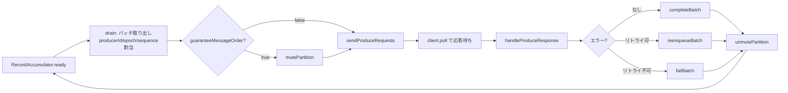

# 第6章 Sender と冪等プロデューサー

> **本章で読むソース**
>
> - [`clients/src/main/java/org/apache/kafka/clients/producer/internals/Sender.java`](https://github.com/apache/kafka/blob/4.3.1/clients/src/main/java/org/apache/kafka/clients/producer/internals/Sender.java)
> - [`clients/src/main/java/org/apache/kafka/clients/producer/internals/TransactionManager.java`](https://github.com/apache/kafka/blob/4.3.1/clients/src/main/java/org/apache/kafka/clients/producer/internals/TransactionManager.java)
> - [`clients/src/main/java/org/apache/kafka/clients/producer/internals/RecordAccumulator.java`](https://github.com/apache/kafka/blob/4.3.1/clients/src/main/java/org/apache/kafka/clients/producer/internals/RecordAccumulator.java)

## この章の狙い

第5章では、プロデューサーが送信要求を受け取ってから`RecordAccumulator`にバッチとして溜め込むところまでを追った。

本章では、その先を担う`Sender`を読む。

`Sender`は専用スレッドで動き続け、`RecordAccumulator`から送信可能になったバッチを取り出してブローカーへ送り、応答を受けてバッチを完了させるか再送させるかを判断する。

この過程で欠かせないのが**冪等プロデューサー**の仕組みである。

ネットワーク障害によるリトライは、何も対策しなければブローカー側でのレコード重複につながる。

`TransactionManager`が管理する**producerId**、**エポック**、**シーケンス番号**の3つ組が、この重複を防ぎながら送信のパイプライン化を両立させる。

## 前提

冪等性は`enable.idempotence`設定で有効化される機能であり、有効化すると`max.in.flight.requests.per.connection`（以下、in-flight 数）は5以下に制限される。

[`clients/src/main/java/org/apache/kafka/clients/producer/ProducerConfig.java L267`](https://github.com/apache/kafka/blob/4.3.1/clients/src/main/java/org/apache/kafka/clients/producer/ProducerConfig.java#L267)

```java
private static final int MAX_IN_FLIGHT_REQUESTS_PER_CONNECTION_FOR_IDEMPOTENCE = 5;
```

`KafkaProducer`は`Sender`を生成するとき、in-flight 数がちょうど1であれば`guaranteeMessageOrder`を`true`にして渡す。

[`clients/src/main/java/org/apache/kafka/clients/producer/KafkaProducer.java L522-L544`](https://github.com/apache/kafka/blob/4.3.1/clients/src/main/java/org/apache/kafka/clients/producer/KafkaProducer.java#L522-L544)

```java
    Sender newSender(LogContext logContext, KafkaClient kafkaClient, ProducerMetadata metadata) {
        int maxInflightRequests = producerConfig.getInt(ProducerConfig.MAX_IN_FLIGHT_REQUESTS_PER_CONNECTION);
        int requestTimeoutMs = producerConfig.getInt(ProducerConfig.REQUEST_TIMEOUT_MS_CONFIG);
        ProducerMetrics metricsRegistry = new ProducerMetrics(this.metrics);
        Sensor throttleTimeSensor = Sender.throttleTimeSensor(metricsRegistry.senderMetrics);
        KafkaClient client = kafkaClient != null ? kafkaClient : ClientUtils.createNetworkClient(producerConfig,
                this.metrics,
                "producer",
                logContext,
                apiVersions,
                time,
                maxInflightRequests,
                metadata,
                throttleTimeSensor,
                clientTelemetryReporter.map(ClientTelemetryReporter::telemetrySender).orElse(null));

        short acks = Short.parseShort(producerConfig.getString(ProducerConfig.ACKS_CONFIG));
        return new Sender(logContext,
                client,
                metadata,
                this.accumulator,
                maxInflightRequests == 1,
```

つまり in-flight 数が1のときだけ、`Sender`はパーティション単位で送信順序を厳密に守る特別扱いをする。

冪等プロデューサーが2から5の in-flight 数を許すのは、この特別扱いなしでも順序と重複排除をシーケンス番号だけで保証できるからである。

その仕組みを本章で読み解く。

producerId とエポックの実体は`ProducerIdAndEpoch`であり、`TransactionManager`が保持する。

[`clients/src/main/java/org/apache/kafka/common/utils/ProducerIdAndEpoch.java L20-L28`](https://github.com/apache/kafka/blob/4.3.1/clients/src/main/java/org/apache/kafka/common/utils/ProducerIdAndEpoch.java#L20-L28)

```java
public class ProducerIdAndEpoch {
    public static final ProducerIdAndEpoch NONE = new ProducerIdAndEpoch(RecordBatch.NO_PRODUCER_ID, RecordBatch.NO_PRODUCER_EPOCH);

    public final long producerId;
    public final short epoch;

    public ProducerIdAndEpoch(long producerId, short epoch) {
        this.producerId = producerId;
        this.epoch = epoch;
    }
```

producerId はブローカーが`InitProducerId`要求に対して払い出す識別子であり、プロデューサーのプロセスごとに一意に定まる。

エポックは同じ producerId を使い回す世代の番号であり、シーケンス番号をリセットするたびに1つずつ増える。

この2つに、パーティションごとに0から始まる**シーケンス番号**を組み合わせた3つ組が、ブローカー側で1件のレコードを一意に識別する鍵になる。

## Sender の1周を追う

`Sender`は`Runnable`を実装したクラスであり、専用スレッドの`run`メソッドが`running`フラグが立っている間`runOnce`を呼び続ける。

[`clients/src/main/java/org/apache/kafka/clients/producer/internals/Sender.java L241-L251`](https://github.com/apache/kafka/blob/4.3.1/clients/src/main/java/org/apache/kafka/clients/producer/internals/Sender.java#L241-L251)

```java
    public void run() {
        log.debug("Starting Kafka producer I/O thread.");

        // main loop, runs until close is called
        while (running) {
            try {
                runOnce();
            } catch (Exception e) {
                log.error("Uncaught error in kafka producer I/O thread: ", e);
            }
        }
```

`runOnce`は、トランザクション関連の要求を処理してから、通常の Produce 要求の送受信を行う。

[`clients/src/main/java/org/apache/kafka/clients/producer/internals/Sender.java L310-L346`](https://github.com/apache/kafka/blob/4.3.1/clients/src/main/java/org/apache/kafka/clients/producer/internals/Sender.java#L310-L346)

```java
    void runOnce() {
        if (transactionManager != null) {
            try {
                transactionManager.maybeResolveSequences();

                RuntimeException lastError = transactionManager.lastError();

                // do not continue sending if the transaction manager is in a failed state
                if (transactionManager.hasFatalError()) {
                    if (lastError != null)
                        maybeAbortBatches(lastError);
                    client.poll(retryBackoffMs, time.milliseconds());
                    return;
                }

                if (transactionManager.hasAbortableError() && shouldHandleAuthorizationError(lastError)) {
                    return;
                }

                // Check whether we need a new producerId. If so, we will enqueue an InitProducerId
                // request which will be sent below
                transactionManager.bumpIdempotentEpochAndResetIdIfNeeded();

                if (maybeSendAndPollTransactionalRequest()) {
                    return;
                }
            } catch (AuthenticationException e) {
                // This is already logged as error, but propagated here to perform any clean ups.
                log.trace("Authentication exception while processing transactional request", e);
                transactionManager.authenticationFailed(e);
            }
        }

        long currentTimeMs = time.milliseconds();
        long pollTimeout = sendProducerData(currentTimeMs);
        client.poll(pollTimeout, currentTimeMs);
    }
```

`transactionManager`はトランザクションを使わない冪等プロデューサーでも`null`にはならない。

冪等性だけを有効にした場合、`TransactionManager`はトランザクション用の状態遷移を素通りし、producerId・エポック・シーケンス番号の管理だけを担う。

`maybeSendAndPollTransactionalRequest`がトランザクション用の要求（`InitProducerId`など）を処理し終えると、`runOnce`は本題の`sendProducerData`に進む。

`sendProducerData`は`RecordAccumulator`から送信可能なバッチを取り出し、ブローカーごとにまとめて Produce 要求を組み立てる中心的なメソッドである。

[`clients/src/main/java/org/apache/kafka/clients/producer/internals/Sender.java L380-L419`](https://github.com/apache/kafka/blob/4.3.1/clients/src/main/java/org/apache/kafka/clients/producer/internals/Sender.java#L380-L419)

```java
    private long sendProducerData(long now) {
        MetadataSnapshot metadataSnapshot = metadata.fetchMetadataSnapshot();
        // get the list of partitions with data ready to send
        RecordAccumulator.ReadyCheckResult result = this.accumulator.ready(metadataSnapshot, now);

        // if there are any partitions whose leaders are not known yet, force metadata update
        if (!result.unknownLeaderTopics.isEmpty()) {
            // The set of topics with unknown leader contains topics with leader election pending as well as
            // topics which may have expired. Add the topic again to metadata to ensure it is included
            // and request metadata update, since there are messages to send to the topic.
            for (String topic : result.unknownLeaderTopics)
                this.metadata.add(topic, now);

            log.debug("Requesting metadata update due to unknown leader topics from the batched records: {}",
                result.unknownLeaderTopics);
            this.metadata.requestUpdate(false);
        }

        // remove any nodes we aren't ready to send to
        Iterator<Node> iter = result.readyNodes.iterator();
        long notReadyTimeout = Long.MAX_VALUE;
        while (iter.hasNext()) {
            Node node = iter.next();
            if (!this.client.ready(node, now)) {
                // Update just the readyTimeMs of the latency stats, so that it moves forward
                // every time the batch is ready (then the difference between readyTimeMs and
                // drainTimeMs would represent how long data is waiting for the node).
                this.accumulator.updateNodeLatencyStats(node.id(), now, false);
                iter.remove();
                notReadyTimeout = Math.min(notReadyTimeout, this.client.pollDelayMs(node, now));
            } else {
                // Update both readyTimeMs and drainTimeMs, this would "reset" the node
                // latency.
                this.accumulator.updateNodeLatencyStats(node.id(), now, true);
            }
        }

        // create produce requests
        Map<Integer, List<ProducerBatch>> batches = this.accumulator.drain(metadataSnapshot, result.readyNodes, this.maxRequestSize, now);
        addToInflightBatches(batches);
        if (guaranteeMessageOrder) {
            // Mute all the partitions drained
            for (List<ProducerBatch> batchList : batches.values()) {
                for (ProducerBatch batch : batchList)
                    this.accumulator.mutePartition(batch.topicPartition);
            }
        }
```

`accumulator.drain`が呼ばれた時点で、各バッチには producerId・エポック・シーケンス番号が割り当てられる。

これは`RecordAccumulator`側の処理であり、`transactionManager.sequenceNumber`でパーティションの次のシーケンス番号を取得してバッチに書き込む。

[`clients/src/main/java/org/apache/kafka/clients/producer/internals/RecordAccumulator.java L917-L923`](https://github.com/apache/kafka/blob/4.3.1/clients/src/main/java/org/apache/kafka/clients/producer/internals/RecordAccumulator.java#L917-L923)

```java
                    batch.setProducerState(producerIdAndEpoch, transactionManager.sequenceNumber(batch.topicPartition), isTransactional);
                    transactionManager.incrementSequenceNumber(batch.topicPartition, batch.recordCount);
                    log.debug("Assigned producerId {} and producerEpoch {} to batch with base sequence " +
                            "{} being sent to partition {}", producerIdAndEpoch.producerId,
                        producerIdAndEpoch.epoch, batch.baseSequence(), tp);

                    transactionManager.addInFlightBatch(batch);
```

シーケンス番号がバッチ生成時ではなく`drain`のタイミングで割り当てられる点が重要である。

`RecordAccumulator`にバッチが溜まっている間はまだシーケンス番号が確定しておらず、実際に送信対象として選び出された順にシーケンス番号が振られる。

これにより、パーティションへの書き込み順序は「送信された順」と一致する。

`in-flight 数が1のときだけ`accumulator.mutePartition`でパーティションをミュートし、応答が返るまで同じパーティション宛ての次のバッチを送らせない。

これが`guaranteeMessageOrder`の実体であり、`Sender`は応答完了時に`unmutePartition`でミュートを解除する（後述）。

`sendProducerData`の終盤で、`sendProduceRequests`が実際の Produce 要求送信を行う。

[`clients/src/main/java/org/apache/kafka/clients/producer/internals/Sender.java L453-L454`](https://github.com/apache/kafka/blob/4.3.1/clients/src/main/java/org/apache/kafka/clients/producer/internals/Sender.java#L453-L454)

```java
        sendProduceRequests(batches, now);
        return pollTimeout;
```

以上の1周を図にすると次のようになる。



## 応答の処理とバッチの完了

Produce 要求の応答を受け取ると、`NetworkClient`からのコールバック経由で`handleProduceResponse`が呼ばれる。

`handleProduceResponse`はタイムアウトや切断、バージョン不一致といった通信レベルの異常もエラー応答に変換したうえで、パーティションごとの応答を`completeBatch`に渡す。

[`clients/src/main/java/org/apache/kafka/clients/producer/internals/Sender.java L580-L599`](https://github.com/apache/kafka/blob/4.3.1/clients/src/main/java/org/apache/kafka/clients/producer/internals/Sender.java#L580-L599)

```java
    private void handleProduceResponse(ClientResponse response, Map<TopicPartition, ProducerBatch> batches, Map<Uuid, String> topicNames, long now) {
        RequestHeader requestHeader = response.requestHeader();
        int correlationId = requestHeader.correlationId();
        if (response.wasTimedOut()) {
            log.trace("Cancelled request with header {} due to the last request to node {} timed out",
                requestHeader, response.destination());
            for (ProducerBatch batch : batches.values())
                completeBatch(batch, new ProduceResponse.PartitionResponse(Errors.REQUEST_TIMED_OUT, String.format("Disconnected from node %s due to timeout", response.destination())),
                        correlationId, now, null);
        } else if (response.wasDisconnected()) {
            log.trace("Cancelled request with header {} due to node {} being disconnected",
                requestHeader, response.destination());
            for (ProducerBatch batch : batches.values())
                completeBatch(batch, new ProduceResponse.PartitionResponse(Errors.NETWORK_EXCEPTION, String.format("Disconnected from node %s", response.destination())),
                        correlationId, now, null);
```

パーティションごとの応答を受け取る`completeBatch`（引数4つの版）が、実際の成功・リトライ・失敗の判断を行う本体である。

[`clients/src/main/java/org/apache/kafka/clients/producer/internals/Sender.java L671-L712`](https://github.com/apache/kafka/blob/4.3.1/clients/src/main/java/org/apache/kafka/clients/producer/internals/Sender.java#L671-L712)

```java
    private void completeBatch(ProducerBatch batch, ProduceResponse.PartitionResponse response, long correlationId,
                               long now, Map<TopicPartition, Metadata.LeaderIdAndEpoch> partitionsWithUpdatedLeaderInfo) {
        batch.setInflight(false);
        Errors error = response.error;

        if (error == Errors.MESSAGE_TOO_LARGE && batch.recordCount > 1 && !batch.isDone() &&
                (batch.magic() >= RecordBatch.MAGIC_VALUE_V2 || batch.isCompressed())) {
            // If the batch is too large, we split the batch and send the split batches again. We do not decrement
            // the retry attempts in this case.
            log.warn(
                "Got error produce response in correlation id {} on topic-partition {}, splitting and retrying ({} attempts left). Error: {}",
                correlationId,
                batch.topicPartition,
                this.retries - batch.attempts(),
                formatErrMsg(response));
            if (transactionManager != null)
                transactionManager.removeInFlightBatch(batch);
            this.accumulator.splitAndReenqueue(batch);
            maybeRemoveAndDeallocateBatch(batch);
            this.sensors.recordBatchSplit();
        } else if (error != Errors.NONE) {
            if (canRetry(batch, response, now)) {
                log.warn(
                    "Got error produce response with correlation id {} on topic-partition {}, retrying ({} attempts left). Error: {}",
                    correlationId,
                    batch.topicPartition,
                    this.retries - batch.attempts() - 1,
                    formatErrMsg(response));
                reenqueueBatch(batch, now);
            } else if (error == Errors.DUPLICATE_SEQUENCE_NUMBER) {
                // If we have received a duplicate sequence error, it means that the sequence number has advanced beyond
                // the sequence of the current batch, and we haven't retained batch metadata on the broker to return
                // the correct offset and timestamp.
                //
                // The only thing we can do is to return success to the user and not return a valid offset and timestamp.
                completeBatch(batch, response);
            } else {
                // tell the user the result of their request. We only adjust sequence numbers if the batch didn't exhaust
                // its retries -- if it did, we don't know whether the sequence number was accepted or not, and
                // thus it is not safe to reassign the sequence.
                failBatch(batch, response, batch.attempts() < this.retries, true);
            }
```

ここで`Errors.DUPLICATE_SEQUENCE_NUMBER`の扱いに注目する。

このエラーは、ブローカーが過去に同じシーケンス番号のバッチをすでに受理済みであることを示す。

つまりリトライしたバッチが実は初回の送信で成功しており、応答だけが失われていたケースである。

コード中のコメントが述べるとおり、ブローカーは重複と判定したバッチのオフセットを保持していないため、正確なオフセットは返せない。

それでもレコード自体は既に書き込まれているので、`Sender`はエラーとして扱わずに`completeBatch`（引数2つの版）へ委譲し、呼び出し元には成功を返す。

これがシーケンス番号による重複排除の直接の現れである。

`canRetry`はリトライ可否を判定する。

[`clients/src/main/java/org/apache/kafka/clients/producer/internals/Sender.java L876-L883`](https://github.com/apache/kafka/blob/4.3.1/clients/src/main/java/org/apache/kafka/clients/producer/internals/Sender.java#L876-L883)

```java
    private boolean canRetry(ProducerBatch batch, ProduceResponse.PartitionResponse response, long now) {
        return !batch.hasReachedDeliveryTimeout(accumulator.getDeliveryTimeoutMs(), now) &&
            batch.attempts() < this.retries &&
            !batch.isDone() &&
            (transactionManager == null ?
                    response.error.exception() instanceof RetriableException :
                    transactionManager.canRetry(response, batch));
    }
```

配送タイムアウトに達しておらず、リトライ回数の上限に達しておらず、まだ完了していないバッチについて、冪等プロデューサーが有効なら`TransactionManager.canRetry`にエラー種別ごとの判断を委ねる。

## シーケンス番号による重複排除と順序保証

`TransactionManager.canRetry`は`OUT_OF_ORDER_SEQUENCE_NUMBER`と`UNKNOWN_PRODUCER_ID`という、シーケンス番号がらみのエラーを特別扱いする。

[`clients/src/main/java/org/apache/kafka/clients/producer/internals/TransactionManager.java L1079-L1099`](https://github.com/apache/kafka/blob/4.3.1/clients/src/main/java/org/apache/kafka/clients/producer/internals/TransactionManager.java#L1079-L1099)

```java
        } else if (error == Errors.OUT_OF_ORDER_SEQUENCE_NUMBER) {
            if (!hasUnresolvedSequence(batch.topicPartition) &&
                    (batch.sequenceHasBeenReset() || !isNextSequence(batch.topicPartition, batch.baseSequence()))) {
                // We should retry the OutOfOrderSequenceException if the batch is _not_ the next batch, ie. its base
                // sequence isn't the lastAckedSequence + 1.
                return true;
            } else if (!isTransactional()) {
                // For the idempotent producer, retry all OUT_OF_ORDER_SEQUENCE_NUMBER errors. If there are no
                // unresolved sequences, or this batch is the one immediately following an unresolved sequence, we know
                // there is actually a gap in the sequences, and we bump the epoch. Otherwise, retry without bumping
                // and wait to see if the sequence resolves
                if (!hasUnresolvedSequence(batch.topicPartition) ||
                        isNextSequenceForUnresolvedPartition(batch.topicPartition, batch.baseSequence())) {
                    requestIdempotentEpochBumpForPartition(batch.topicPartition);
                }
                return true;
            }
        }

        // If neither of the above cases are true, retry if the exception is retriable
        return error.exception() instanceof RetriableException;
    }
```

`isNextSequence`は「このバッチのシーケンス番号が、直近で確認応答済みのシーケンス番号のちょうど次であるか」を調べる。

[`clients/src/main/java/org/apache/kafka/clients/producer/internals/TransactionManager.java L903-L905`](https://github.com/apache/kafka/blob/4.3.1/clients/src/main/java/org/apache/kafka/clients/producer/internals/TransactionManager.java#L903-L905)

```java
    private boolean isNextSequence(TopicPartition topicPartition, int sequence) {
        return sequence - lastAckedSequence(topicPartition).orElse(TxnPartitionEntry.NO_LAST_ACKED_SEQUENCE_NUMBER) == 1;
    }
```

in-flight 数が2以上のとき、同じパーティション宛てに複数のバッチが同時に送信中でありうる。

このとき応答は送信順とは限らない順序で返ってくる可能性があるので、あるバッチが失敗しても、それが本当に「穴」なのか、それとも単に他のバッチの応答をまだ受け取っていないだけなのかを区別する必要がある。

`isNextSequence`が偽を返す、つまりこのバッチより前にまだ確認応答されていないバッチが存在する場合は、単純にリトライするだけでよい。

先行するバッチの応答が届けば、シーケンスの連続性はいずれ回復するからである。

一方、`isNextSequence`が真、つまりこのバッチが本当に「次に来るべきバッチ」であるにもかかわらずエラーが返った場合は、ブローカー側のログに実際の欠落が生じたことを意味する。

この場合、冪等プロデューサーは`requestIdempotentEpochBumpForPartition`でエポックの繰り上げを要求し、次回の送信でシーケンス番号を0から振り直す。

エポックを上げることで、古いエポックに紐づくシーケンス番号との衝突を避けながら送信を再開できる。

まとめると、シーケンス番号による重複排除の機構は次の3点で成り立つ。

- ブローカーは producerId・エポック・パーティションごとに最後に受理したシーケンス番号を記録し、同じ番号のバッチが再度届いても書き込まずに`DUPLICATE_SEQUENCE_NUMBER`を返す。
- パイプライン化のために複数バッチを同時に送っても、シーケンス番号は`drain`時点でパーティション単位の単調増加として払い出されるため、ブローカー側で受理順を並べ替えられる。
- 順序に本当の欠落が生じたときだけエポックを繰り上げてシーケンスをリセットし、それ以外の見かけ上の順序前後はリトライで吸収する。

この設計により、`max.in.flight.requests.per.connection`を1に固定して1本ずつ律儀に送るのではなく、複数バッチを並行して送りながらも重複と順序の保証を両立できる。

これが本章で扱う最適化である。

acks=all で待ち時間が長いブローカーに対しても、in-flight 数を増やすことでスループットを稼げる一方、シーケンス番号がその代償（重複や順序の取り違え）を吸収する。

## リトライとバッチの再投入

リトライ可能と判定されたバッチは`reenqueueBatch`によって`RecordAccumulator`へ戻される。

[`clients/src/main/java/org/apache/kafka/clients/producer/internals/Sender.java L751-L755`](https://github.com/apache/kafka/blob/4.3.1/clients/src/main/java/org/apache/kafka/clients/producer/internals/Sender.java#L751-L755)

```java
    private void reenqueueBatch(ProducerBatch batch, long currentTimeMs) {
        this.accumulator.reenqueue(batch, currentTimeMs);
        maybeRemoveFromInflightBatches(batch);
        this.sensors.recordRetries(batch.topicPartition.topic(), batch.recordCount);
    }
```

このときバッチはすでに割り当て済みのシーケンス番号を保持したまま再投入される。

シーケンス番号を送信のたびに振り直すと、旧シーケンスで受理されていた場合に新シーケンスの書き込みが別レコードとして扱われ、重複が生じてしまう。

割り当てを維持したままの再送だからこそ、ブローカー側の重複検出が機能する。

リトライができないと判定されたバッチは`failBatch`で失敗として確定する。

[`clients/src/main/java/org/apache/kafka/clients/producer/internals/Sender.java L826-L833`](https://github.com/apache/kafka/blob/4.3.1/clients/src/main/java/org/apache/kafka/clients/producer/internals/Sender.java#L826-L833)

```java
    private void failBatch(
        ProducerBatch batch,
        RuntimeException topLevelException,
        boolean adjustSequenceNumbers,
        boolean deallocateBatch
    ) {
        failBatch(batch, topLevelException, batchIndex -> topLevelException, adjustSequenceNumbers, deallocateBatch);
    }
```

`failBatch`は内部で`transactionManager.handleFailedBatch`を呼び、リトライ回数を使い果たしたバッチの後始末をする。

[`clients/src/main/java/org/apache/kafka/clients/producer/internals/TransactionManager.java L806-L823`](https://github.com/apache/kafka/blob/4.3.1/clients/src/main/java/org/apache/kafka/clients/producer/internals/TransactionManager.java#L806-L823)

```java
    synchronized void handleFailedBatch(ProducerBatch batch, RuntimeException exception, boolean adjustSequenceNumbers) {
        maybeTransitionToErrorState(exception);
        removeInFlightBatch(batch);

        if (hasFatalError()) {
            log.debug("Ignoring batch {} with producer id {}, epoch {}, and sequence number {} " +
                            "since the producer is already in fatal error state", batch, batch.producerId(),
                    batch.producerEpoch(), batch.baseSequence(), exception);
            return;
        }

        if (exception instanceof OutOfOrderSequenceException && !isTransactional()) {
            log.error("The broker returned {} for topic-partition {} with producerId {}, epoch {}, and sequence number {}",
                    exception, batch.topicPartition, batch.producerId(), batch.producerEpoch(), batch.baseSequence());

            // If we fail with an OutOfOrderSequenceException, we have a gap in the log. Bump the epoch for this
            // partition, which will reset the sequence number to 0 and allow us to continue
            requestIdempotentEpochBumpForPartition(batch.topicPartition);
        } else if (exception instanceof UnknownProducerIdException) {
```

バッチが完全に失敗として確定した後にログの欠落が判明した場合も、結局はエポックの繰り上げによってシーケンス番号を安全にリセットする点は変わらない。

最後に、`guaranteeMessageOrder`が有効なときにミュートしていたパーティションは、成功・リトライ・失敗のいずれの経路でも`completeBatch`（引数5つの版）の末尾で解除される。

[`clients/src/main/java/org/apache/kafka/clients/producer/internals/Sender.java L736-L738`](https://github.com/apache/kafka/blob/4.3.1/clients/src/main/java/org/apache/kafka/clients/producer/internals/Sender.java#L736-L738)

```java
        // Unmute the completed partition.
        if (guaranteeMessageOrder)
            this.accumulator.unmutePartition(batch.topicPartition);
```

## まとめ

`Sender`は専用スレッドの`runOnce`ループで、`RecordAccumulator`から送信可能なバッチを取り出し、ブローカーごとに束ねて送信し、応答を受けて完了・リトライ・失敗のいずれかに振り分ける。

冪等プロデューサーは、producerId・エポック・パーティションごとのシーケンス番号という3つ組をバッチに刻み込むことで、ブローカー側での重複検出を可能にする。

シーケンス番号は送信順に単調増加するため、`max.in.flight.requests.per.connection`を5まで許して複数バッチを並行して送っても、応答の前後を`isNextSequence`で見分けながら重複と順序を保証できる。

本当の欠落が生じたときだけエポックを繰り上げてシーケンスをリセットする設計が、通常時のパイプライン化と、まれな障害時の整合性回復とを両立させている。

## 関連する章

- 第5章 [05-record-accumulator.md](05-record-accumulator.md)（バッチの生成と蓄積）
- 第12章 [../part03-storage/12-producer-state.md](../part03-storage/12-producer-state.md)（ブローカー側の producerId・シーケンス番号の永続化）
- 第23章 [../part07-txn-share/23-transaction-coordinator.md](../part07-txn-share/23-transaction-coordinator.md)（トランザクションの本体）
