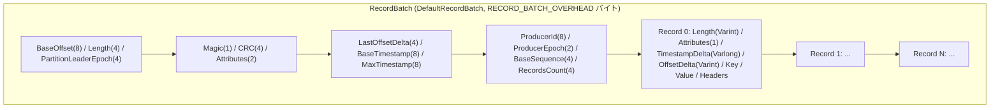

# 第7章 レコードフォーマットと MemoryRecords / FileRecords

> **本章で読むソース**
>
> - [`clients/src/main/java/org/apache/kafka/common/record/internal/DefaultRecordBatch.java`](https://github.com/apache/kafka/blob/4.3.1/clients/src/main/java/org/apache/kafka/common/record/internal/DefaultRecordBatch.java)
> - [`clients/src/main/java/org/apache/kafka/common/record/internal/DefaultRecord.java`](https://github.com/apache/kafka/blob/4.3.1/clients/src/main/java/org/apache/kafka/common/record/internal/DefaultRecord.java)
> - [`clients/src/main/java/org/apache/kafka/common/record/internal/MemoryRecords.java`](https://github.com/apache/kafka/blob/4.3.1/clients/src/main/java/org/apache/kafka/common/record/internal/MemoryRecords.java)
> - [`clients/src/main/java/org/apache/kafka/common/record/internal/FileRecords.java`](https://github.com/apache/kafka/blob/4.3.1/clients/src/main/java/org/apache/kafka/common/record/internal/FileRecords.java)

## この章の狙い

プロデューサーが組み立てたバッチは、ネットワークを経由してブローカーに届き、そのままログセグメントへ書き込まれる。
届いたバイト列を都度オブジェクトへ展開していては、ブローカーがさばけるスループットは頭打ちになる。
Kafka はこの問題を、ネットワーク上でもディスク上でも同一のバイナリレイアウトを保つ**レコードバッチ**形式で解決している。

本章では、v2 レコードバッチのバイナリ構造と、そのバッチをメモリ上で扱う`MemoryRecords`、ファイル上で扱う`FileRecords`の役割分担を読む。
バッチ単位のデルタエンコードとファイルの直接転送という、2つの異なる層の最適化がどう組み合わさっているかを見ていく。

## 前提

第5章（[../part02-producer/05-record-accumulator.md](../part02-producer/05-record-accumulator.md)）で見た`RecordAccumulator`は、レコードをバッチへ積み込む際に`MemoryRecordsBuilder`を使って、後述する v2 フォーマットのバイト列を直接組み立てる。
本章は、そのバイト列自体の構造と、届いた後の扱いを対象にする。
ログセグメントへの書き込み側は第8章（[08-logsegment-index.md](08-logsegment-index.md)）で扱う。

## バッチヘッダのバイナリレイアウト

Kafka の v2 メッセージフォーマットは、複数のレコードを1つの**バッチ**にまとめ、バッチ単位でヘッダを持つ。
`DefaultRecordBatch`のクラスコメントに、そのスキーマが記載されている。

[`clients/src/main/java/org/apache/kafka/common/record/internal/DefaultRecordBatch.java L46-L62`](https://github.com/apache/kafka/blob/4.3.1/clients/src/main/java/org/apache/kafka/common/record/internal/DefaultRecordBatch.java#L46-L62)

```java
/**
 * RecordBatch implementation for magic 2 and above. The schema is given below:
 *
 * RecordBatch =>
 *  BaseOffset => Int64
 *  Length => Int32
 *  PartitionLeaderEpoch => Int32
 *  Magic => Int8
 *  CRC => Uint32
 *  Attributes => Int16
 *  LastOffsetDelta => Int32 // also serves as LastSequenceDelta
 *  BaseTimestamp => Int64
 *  MaxTimestamp => Int64
 *  ProducerId => Int64
 *  ProducerEpoch => Int16
 *  BaseSequence => Int32
 *  RecordsCount => Int32
 *  Records => [Record]
```

この各フィールドのバイトオフセットは、フィールド長を足し込む形でコード上に定数として直書きされている。

[`clients/src/main/java/org/apache/kafka/common/record/internal/DefaultRecordBatch.java L104-L131`](https://github.com/apache/kafka/blob/4.3.1/clients/src/main/java/org/apache/kafka/common/record/internal/DefaultRecordBatch.java#L104-L131)

```java
    static final int BASE_OFFSET_OFFSET = 0;
    static final int BASE_OFFSET_LENGTH = 8;
    static final int LENGTH_OFFSET = BASE_OFFSET_OFFSET + BASE_OFFSET_LENGTH;
    static final int LENGTH_LENGTH = 4;
    static final int PARTITION_LEADER_EPOCH_OFFSET = LENGTH_OFFSET + LENGTH_LENGTH;
    static final int PARTITION_LEADER_EPOCH_LENGTH = 4;
    static final int MAGIC_OFFSET = PARTITION_LEADER_EPOCH_OFFSET + PARTITION_LEADER_EPOCH_LENGTH;
    static final int MAGIC_LENGTH = 1;
    public static final int CRC_OFFSET = MAGIC_OFFSET + MAGIC_LENGTH;
    static final int CRC_LENGTH = 4;
    static final int ATTRIBUTES_OFFSET = CRC_OFFSET + CRC_LENGTH;
    static final int ATTRIBUTE_LENGTH = 2;
    public static final int LAST_OFFSET_DELTA_OFFSET = ATTRIBUTES_OFFSET + ATTRIBUTE_LENGTH;
    static final int LAST_OFFSET_DELTA_LENGTH = 4;
    static final int BASE_TIMESTAMP_OFFSET = LAST_OFFSET_DELTA_OFFSET + LAST_OFFSET_DELTA_LENGTH;
    static final int BASE_TIMESTAMP_LENGTH = 8;
    static final int MAX_TIMESTAMP_OFFSET = BASE_TIMESTAMP_OFFSET + BASE_TIMESTAMP_LENGTH;
    static final int MAX_TIMESTAMP_LENGTH = 8;
    static final int PRODUCER_ID_OFFSET = MAX_TIMESTAMP_OFFSET + MAX_TIMESTAMP_LENGTH;
    static final int PRODUCER_ID_LENGTH = 8;
    static final int PRODUCER_EPOCH_OFFSET = PRODUCER_ID_OFFSET + PRODUCER_ID_LENGTH;
    static final int PRODUCER_EPOCH_LENGTH = 2;
    static final int BASE_SEQUENCE_OFFSET = PRODUCER_EPOCH_OFFSET + PRODUCER_EPOCH_LENGTH;
    static final int BASE_SEQUENCE_LENGTH = 4;
    public static final int RECORDS_COUNT_OFFSET = BASE_SEQUENCE_OFFSET + BASE_SEQUENCE_LENGTH;
    static final int RECORDS_COUNT_LENGTH = 4;
    static final int RECORDS_OFFSET = RECORDS_COUNT_OFFSET + RECORDS_COUNT_LENGTH;
    public static final int RECORD_BATCH_OVERHEAD = RECORDS_OFFSET;
```

`DefaultRecordBatch`はこのオフセット定数を使い、`ByteBuffer`から都度フィールドを読み出す薄いビューとして実装されている。
`baseOffset()`や`producerId()`は、フィールドをオブジェクトへ展開せず`buffer.getLong(...)`で直接読む。

[`clients/src/main/java/org/apache/kafka/common/record/internal/DefaultRecordBatch.java L180-L198`](https://github.com/apache/kafka/blob/4.3.1/clients/src/main/java/org/apache/kafka/common/record/internal/DefaultRecordBatch.java#L180-L198)

```java
    @Override
    public long baseOffset() {
        return buffer.getLong(BASE_OFFSET_OFFSET);
    }

    @Override
    public long lastOffset() {
        return baseOffset() + lastOffsetDelta();
    }

    @Override
    public long producerId() {
        return buffer.getLong(PRODUCER_ID_OFFSET);
    }

    @Override
    public short producerEpoch() {
        return buffer.getShort(PRODUCER_EPOCH_OFFSET);
    }

    @Override
    public int baseSequence() {
        return buffer.getInt(BASE_SEQUENCE_OFFSET);
    }
```

`lastOffset()`はバッチ末尾のオフセットを保持するのではなく、`baseOffset`に`LastOffsetDelta`を足して都度計算する。
バッチ内の個々のレコードも、後述のとおり`baseOffset`と`baseTimestamp`からの差分（デルタ）で表現される。
バッチヘッダに基準値を1つだけ持たせ、レコード側は差分だけを持つという構成が、このフォーマット全体を貫く設計である。

`isValid()`は、CRC を検証してバッチが壊れていないかを確認する。
CRC は`ATTRIBUTES_OFFSET`から末尾までの範囲を対象にしており、`PartitionLeaderEpoch`は対象外になっている。

[`clients/src/main/java/org/apache/kafka/common/record/internal/DefaultRecordBatch.java L395-L401`](https://github.com/apache/kafka/blob/4.3.1/clients/src/main/java/org/apache/kafka/common/record/internal/DefaultRecordBatch.java#L395-L401)

```java
    public boolean isValid() {
        return sizeInBytes() >= RECORD_BATCH_OVERHEAD && checksum() == computeChecksum();
    }

    private long computeChecksum() {
        return Crc32C.compute(buffer, ATTRIBUTES_OFFSET, buffer.limit() - ATTRIBUTES_OFFSET);
    }
```

クラスコメントには、この除外の理由も書かれている。
`PartitionLeaderEpoch`はブローカーがバッチを受信するたびに書き換えるフィールドであり、これを CRC の対象に含めると、書き換えのたびに CRC の再計算が必要になる。
対象から外すことで、ブローカーはペイロード本体を検証し直すことなく、このフィールドだけを上書きできる。

[`clients/src/main/java/org/apache/kafka/common/record/internal/DefaultRecordBatch.java L67-L71`](https://github.com/apache/kafka/blob/4.3.1/clients/src/main/java/org/apache/kafka/common/record/internal/DefaultRecordBatch.java#L67-L71)

```java
 * The CRC covers the data from the attributes to the end of the batch (i.e. all the bytes that follow the CRC). It is
 * located after the magic byte, which means that clients must parse the magic byte before deciding how to interpret
 * the bytes between the batch length and the magic byte. The partition leader epoch field is not included in the CRC
 * computation to avoid the need to recompute the CRC when this field is assigned for every batch that is received by
 * the broker. The CRC-32C (Castagnoli) polynomial is used for the computation.
```

## レコード本体のデルタエンコードと可変長整数

バッチヘッダの内側に並ぶ個々のレコードは、固定長ではなく**可変長整数**（Varint、Varlong）で表現される。

[`clients/src/main/java/org/apache/kafka/common/record/internal/DefaultRecord.java L40-L58`](https://github.com/apache/kafka/blob/4.3.1/clients/src/main/java/org/apache/kafka/common/record/internal/DefaultRecord.java#L40-L58)

```java
 * Record =>
 *   Length => Varint
 *   Attributes => Int8
 *   TimestampDelta => Varlong
 *   OffsetDelta => Varint
 *   KeyLength => Varint
 *   Key => Bytes
 *   ValueLength => Varint
 *   Value => Bytes
 *   HeadersCount => Varint
 *   Headers => [HeaderKey HeaderValue]
 *     HeaderKeyLength => Varint
 *     HeaderKey => String
 *     HeaderValueLength => Varint
 *     HeaderValue => Bytes
```

`TimestampDelta`と`OffsetDelta`は、レコード自身の値ではなく、バッチヘッダの`BaseTimestamp`と`BaseOffset`との差分である。
`readFrom`はこの差分を読み、基準値へ足し戻すことで元の値を復元する。

[`clients/src/main/java/org/apache/kafka/common/record/internal/DefaultRecord.java L316-L328`](https://github.com/apache/kafka/blob/4.3.1/clients/src/main/java/org/apache/kafka/common/record/internal/DefaultRecord.java#L316-L328)

```java
        try {
            int recordStart = buffer.position();
            byte attributes = buffer.get();
            long timestampDelta = ByteUtils.readVarlong(buffer);
            long timestamp = baseTimestamp + timestampDelta;
            if (logAppendTime != null)
                timestamp = logAppendTime;

            int offsetDelta = ByteUtils.readVarint(buffer);
            long offset = baseOffset + offsetDelta;
            int sequence = baseSequence >= 0 ?
                    DefaultRecordBatch.incrementSequence(baseSequence, offsetDelta) :
                    RecordBatch.NO_SEQUENCE;
```

デルタを可変長整数で符号化すると、値が小さいほど符号化後のバイト数も小さくなる。
同一バッチ内のオフセットやタイムスタンプは近い値に集中しやすいため、差分は絶対値そのものより小さくなりやすい。
1バッチが千件のレコードを含む場合でも、オフセットとタイムスタンプは1バッチにつき1組の基準値を持てば足り、残りのレコードは1バイトから数バイトのデルタで済む。
これが、バッチという単位を導入したことで得られる圧縮効果である。

キーと値のサイズも同じ理由で可変長整数を使う。
値が存在しない場合は、長さフィールドに`-1`を書き込むことで区別する。

[`clients/src/main/java/org/apache/kafka/common/record/internal/DefaultRecord.java L183-L197`](https://github.com/apache/kafka/blob/4.3.1/clients/src/main/java/org/apache/kafka/common/record/internal/DefaultRecord.java#L183-L197)

```java
        if (key == null) {
            ByteUtils.writeVarint(-1, out);
        } else {
            int keySize = key.remaining();
            ByteUtils.writeVarint(keySize, out);
            Utils.writeTo(out, key, keySize);
        }

        if (value == null) {
            ByteUtils.writeVarint(-1, out);
        } else {
            int valueSize = value.remaining();
            ByteUtils.writeVarint(valueSize, out);
            Utils.writeTo(out, value, valueSize);
        }
```

## バッチとレコードのレイアウト

ここまでのバッチヘッダとレコードの関係を図にまとめる。



バッチヘッダは固定長でオフセットが定数として決まる一方、レコード本体は可変長整数と可変長のキー/値からなり、レコードごとに長さが変わる。
`DefaultRecordBatch`のイテレータは、この可変長のレコード列を`RecordsCount`が示す件数まで順に読み進める。

## MemoryRecords と FileRecords の役割分担

`MemoryRecords`は、`ByteBuffer`上に置かれたレコードバッチ集合を表す。

[`clients/src/main/java/org/apache/kafka/common/record/internal/MemoryRecords.java L49-L67`](https://github.com/apache/kafka/blob/4.3.1/clients/src/main/java/org/apache/kafka/common/record/internal/MemoryRecords.java#L49-L67)

```java
public class MemoryRecords extends AbstractRecords {
    public static final MemoryRecords EMPTY = MemoryRecords.readableRecords(ByteBuffer.allocate(0));

    private final ByteBuffer buffer;

    private final Iterable<MutableRecordBatch> batches = this::batchIterator;

    private int validBytes = -1;

    // Construct a writable memory records
    private MemoryRecords(ByteBuffer buffer) {
        Objects.requireNonNull(buffer, "buffer should not be null");
        this.buffer = buffer;
    }

    @Override
    public int sizeInBytes() {
        return buffer.limit();
    }
```

`FileRecords`は同じレコードバッチ集合をファイル上に置いたものであり、ログセグメントの実体になる。

[`clients/src/main/java/org/apache/kafka/common/record/internal/FileRecords.java L41-L50`](https://github.com/apache/kafka/blob/4.3.1/clients/src/main/java/org/apache/kafka/common/record/internal/FileRecords.java#L41-L50)

```java
public class FileRecords extends AbstractRecords implements Closeable {
    private final boolean isSlice;
    private final int start;
    private final int end;

    private final Iterable<FileLogInputStream.FileChannelRecordBatch> batches;

    // mutable state
    private final AtomicInteger size;
    private final FileChannel channel;
```

両者はいずれもバイナリレイアウトを直接扱う点で共通しており、レコードをオブジェクトへ展開しなくても、バッチ単位のサイズやオフセット境界を判定できる。
違いは裏側の記憶領域だけである。
`MemoryRecords`はネットワークから受信した直後や、送信直前のバッファなど、短命な用途に使われる。
`FileRecords`はログセグメントとしてディスク上に永続化された長命なデータを表し、`append`でファイルへの追記を、`slice`でオフセット境界に沿った範囲切り出しを提供する。

[`clients/src/main/java/org/apache/kafka/common/record/internal/FileRecords.java L142-L148`](https://github.com/apache/kafka/blob/4.3.1/clients/src/main/java/org/apache/kafka/common/record/internal/FileRecords.java#L142-L148)

```java
    @Override
    public FileRecords slice(int position, int size) {
        int availableBytes = availableBytes(position, size);
        int startPosition = this.start + position;

        return new FileRecords(file, channel, startPosition, startPosition + availableBytes);
    }
```

`slice`は新しいバイト列を複製せず、同じ`FileChannel`と開始/終了位置だけを持つ別の`FileRecords`を作る。
コンシューマーへのフェッチ応答を組み立てる際、ログセグメントの一部だけを切り出す処理は、この`slice`の呼び出しに帰着する。

## FileRecords.writeTo による zero-copy 送出

コンシューマーへレコードを送信する経路では、`FileRecords`の`writeTo`がブローカーとカーネルの間のデータコピーを避ける役割を担う。

[`clients/src/main/java/org/apache/kafka/common/record/internal/FileRecords.java L290-L303`](https://github.com/apache/kafka/blob/4.3.1/clients/src/main/java/org/apache/kafka/common/record/internal/FileRecords.java#L290-L303)

```java
    @Override
    public int writeTo(TransferableChannel destChannel, int offset, int length) throws IOException {
        long newSize = Math.min(channel.size(), end) - start;
        int oldSize = sizeInBytes();
        if (newSize < oldSize)
            throw new KafkaException(String.format(
                    "Size of FileRecords %s has been truncated during write: old size %d, new size %d",
                    file.getAbsolutePath(), oldSize, newSize));

        long position = start + offset;
        int count = Math.min(length, oldSize - offset);
        // safe to cast to int since `count` is an int
        return (int) destChannel.transferFrom(channel, position, count);
    }
```

`destChannel.transferFrom`は`TransferableChannel`のメソッドであり、その実装は`FileChannel#transferTo`へ委譲すると宣言されている。

[`clients/src/main/java/org/apache/kafka/common/network/TransferableChannel.java L36-L50`](https://github.com/apache/kafka/blob/4.3.1/clients/src/main/java/org/apache/kafka/common/network/TransferableChannel.java#L36-L50)

```java
    /**
     * Transfers bytes from `fileChannel` to this `TransferableChannel`.
     *
     * This method will delegate to {@link FileChannel#transferTo(long, long, java.nio.channels.WritableByteChannel)},
     * but it will unwrap the destination channel, if possible, in order to benefit from zero copy. This is required
     * because the fast path of `transferTo` is only executed if the destination buffer inherits from an internal JDK
     * class.
     *
     * @param fileChannel The source channel
     * @param position The position within the file at which the transfer is to begin; must be non-negative
     * @param count The maximum number of bytes to be transferred; must be non-negative
     * @return The number of bytes, possibly zero, that were actually transferred
     * @see FileChannel#transferTo(long, long, java.nio.channels.WritableByteChannel)
     */
    long transferFrom(FileChannel fileChannel, long position, long count) throws IOException;
```

平文（非 TLS）接続を扱う`PlaintextTransportLayer`は、このメソッドをそのまま`FileChannel.transferTo`へ橋渡しする実装を持つ。

[`clients/src/main/java/org/apache/kafka/common/network/PlaintextTransportLayer.java L212-L215`](https://github.com/apache/kafka/blob/4.3.1/clients/src/main/java/org/apache/kafka/common/network/PlaintextTransportLayer.java#L212-L215)

```java
    @Override
    public long transferFrom(FileChannel fileChannel, long position, long count) throws IOException {
        return fileChannel.transferTo(position, count, socketChannel);
    }
```

`FileChannel.transferTo`は、対応する OS では`sendfile`システムコールに対応する。
ディスク上のページキャッシュからソケットバッファへ、カーネル空間内でデータを転送でき、ブローカーのプロセスメモリへ一度も読み込まずに送信を終える。
コンシューマーへの応答は、ほとんどの場合ログセグメントの内容をそのまま返すだけであり、ブローカー側でレコードを再構築する必要がない。
`FileRecords`がバッチのバイナリレイアウトを保ったままファイルとして永続化されているからこそ、この転送が成立する。

## まとめ

v2 レコードバッチは、バッチヘッダに基準となるオフセットとタイムスタンプを1組だけ持ち、個々のレコードはそこからの差分を可変長整数で表現する。
この構成により、同一バッチ内の多数のレコードを数バイトずつのデルタで表現でき、バッチ単位でのサイズ削減につながる。
`MemoryRecords`と`FileRecords`は同じバイナリレイアウトを異なる記憶領域（メモリとファイル）の上で扱うクラスであり、`FileRecords.writeTo`は`FileChannel.transferTo`を経由してログセグメントの内容をカーネル内でソケットへ転送する。
レコードをオブジェクトへ展開せず、届いたバイト列のレイアウトを保ったまま次の宛先へ渡すという方針が、バッチのバイナリ形式と zero-copy 送出の両方を貫いている。

## 関連する章

- [../part02-producer/05-record-accumulator.md](../part02-producer/05-record-accumulator.md) プロデューサー側で`MemoryRecordsBuilder`がバッチを組み立てる処理
- [08-logsegment-index.md](08-logsegment-index.md) `FileRecords`を保持するログセグメントの構造
