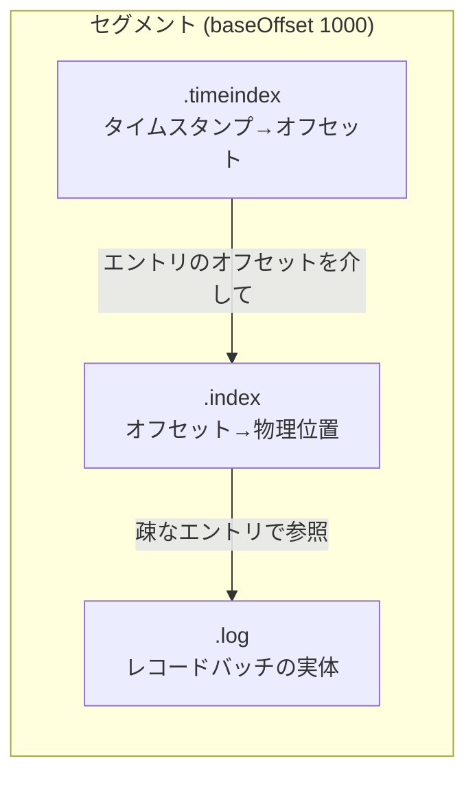
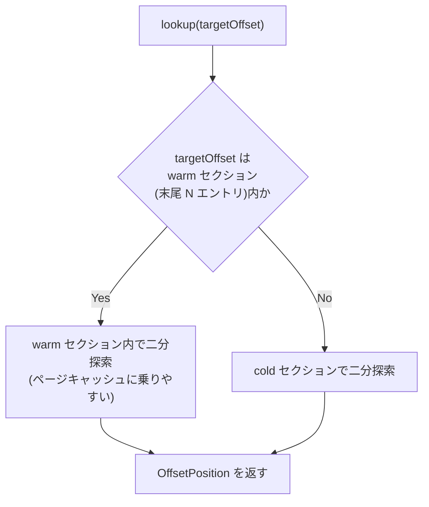

# 第8章 LogSegment とインデックス

> **本章で読むソース**
>
> - [`storage/src/main/java/org/apache/kafka/storage/internals/log/LogSegment.java`](https://github.com/apache/kafka/blob/4.3.1/storage/src/main/java/org/apache/kafka/storage/internals/log/LogSegment.java)
> - [`storage/src/main/java/org/apache/kafka/storage/internals/log/OffsetIndex.java`](https://github.com/apache/kafka/blob/4.3.1/storage/src/main/java/org/apache/kafka/storage/internals/log/OffsetIndex.java)
> - [`storage/src/main/java/org/apache/kafka/storage/internals/log/TimeIndex.java`](https://github.com/apache/kafka/blob/4.3.1/storage/src/main/java/org/apache/kafka/storage/internals/log/TimeIndex.java)
> - [`storage/src/main/java/org/apache/kafka/storage/internals/log/AbstractIndex.java`](https://github.com/apache/kafka/blob/4.3.1/storage/src/main/java/org/apache/kafka/storage/internals/log/AbstractIndex.java)

## この章の狙い

パーティションのログは、1本の巨大なファイルではなく、複数の**セグメント**に分割されて保存される。
本章では、1つのセグメントが `.log`、`.index`、`.timeindex` という3つのファイルの組で構成されることを確認し、任意のオフセットやタイムスタンプから対応するレコードの物理位置をどう求めるかを追う。
索引ファイルは全レコードを記録しない疎な構造を取っており、この疎さと mmap を組み合わせた探索の工夫が、大量のレコードを持つセグメントでも読み出しを高速に保つ。

## 前提

前章（第7章 `07-record-format.md`）で扱ったレコードバッチは、ディスク上では `FileRecords` としてバイト列のまま追記される。
本章はその1段上の層にあたり、レコードバッチの集まりをどうファイルに割り当て、どう検索可能にするかを扱う。
セグメント群をまとめてパーティション単位のログとして扱う層は、第9章 `09-unifiedlog.md` の対象である。

## セグメントの構成

`LogSegment` のクラス javadoc は、セグメントの構成を次のように述べている。

[`storage/src/main/java/org/apache/kafka/storage/internals/log/LogSegment.java L55-64`](https://github.com/apache/kafka/blob/4.3.1/storage/src/main/java/org/apache/kafka/storage/internals/log/LogSegment.java#L55-L64)

```java
/**
 * A segment of the log. Each segment has two components: a log and an index. The log is a FileRecords containing
 * the actual messages. The index is an OffsetIndex that maps from logical offsets to physical file positions. Each
 * segment has a base offset which is an offset <= the least offset of any message in this segment and > any offset in
 * any previous segment.
 *
 * A segment with a base offset of [base_offset] would be stored in two files, a [base_offset].index and a [base_offset].log file.
 *
 * This class is not thread-safe.
 */
```

1つのセグメントは、実データを保持する `.log` ファイルと、オフセットから物理位置を引く `.index` ファイル、タイムスタンプから物理位置を引く `.timeindex` ファイルの3点で構成される。
ファイル名はいずれもセグメントの**ベースオフセット**（そのセグメントに含まれる最小のオフセット）を使って揃えられる。
`LogSegment` はこの3ファイルへの参照をまとめて保持するだけの薄い層であり、レコードの実体は `FileRecords` である `log` フィールドに委ねている。

[`storage/src/main/java/org/apache/kafka/storage/internals/log/LogSegment.java L79-84`](https://github.com/apache/kafka/blob/4.3.1/storage/src/main/java/org/apache/kafka/storage/internals/log/LogSegment.java#L79-L84)

```java
    private final FileRecords log;
    private final LazyIndex<OffsetIndex> lazyOffsetIndex;
    private final LazyIndex<TimeIndex> lazyTimeIndex;
    private final TransactionIndex txnIndex;
    private final long baseOffset;
    private final int indexIntervalBytes;
```

`indexIntervalBytes` は設定値 `index.interval.bytes` に対応するフィールドであり、索引エントリをどれだけの間隔で作るかを決める。
この間隔が、次に述べる疎インデックスの粒度そのものになる。



## OffsetIndex による疎な位置マッピング

`append` メソッドは、レコードバッチをセグメントに追記するときの処理を示す。

[`storage/src/main/java/org/apache/kafka/storage/internals/log/LogSegment.java L250-280`](https://github.com/apache/kafka/blob/4.3.1/storage/src/main/java/org/apache/kafka/storage/internals/log/LogSegment.java#L250-L280)

```java
    public void append(long largestOffset,
                       MemoryRecords records) throws IOException {
        if (records.sizeInBytes() > 0) {
            LOGGER.trace("Inserting {} bytes at end offset {} at position {}",
                records.sizeInBytes(), largestOffset, log.sizeInBytes());
            int physicalPosition = log.sizeInBytes();

            ensureOffsetInRange(largestOffset);

            // append the messages
            long appendedBytes = log.append(records);
            LOGGER.trace("Appended {} to {} at end offset {}", appendedBytes, log.file(), largestOffset);

            for (RecordBatch batch : records.batches()) {
                long batchMaxTimestamp = batch.maxTimestamp();
                long batchLastOffset = batch.lastOffset();
                if (batchMaxTimestamp > maxTimestampSoFar()) {
                    maxTimestampAndOffsetSoFar = new TimestampOffset(batchMaxTimestamp, batchLastOffset);
                }

                if (bytesSinceLastIndexEntry > indexIntervalBytes) {
                    offsetIndex().append(batchLastOffset, physicalPosition);
                    timeIndex().maybeAppend(maxTimestampSoFar(), shallowOffsetOfMaxTimestampSoFar());
                    bytesSinceLastIndexEntry = 0;
                }
                var sizeInBytes = batch.sizeInBytes();
                physicalPosition += sizeInBytes;
                bytesSinceLastIndexEntry += sizeInBytes;
            }
        }
    }
```

この処理の要は、`bytesSinceLastIndexEntry > indexIntervalBytes` という条件である。
バッチが追記されるたびに索引を更新するのではなく、前回の索引エントリから `indexIntervalBytes` バイト以上進んだときだけ、そのバッチの最終オフセットと物理位置を `OffsetIndex` に登録する。
つまり `OffsetIndex` は全レコードのオフセットを保持せず、一定バイト間隔で間引いたエントリだけを持つ**疎な索引**である。

`OffsetIndex` のクラス javadoc は、このファイル形式を説明している。

[`storage/src/main/java/org/apache/kafka/storage/internals/log/OffsetIndex.java L44-49`](https://github.com/apache/kafka/blob/4.3.1/storage/src/main/java/org/apache/kafka/storage/internals/log/OffsetIndex.java#L44-L49)

```java
 * <p>The file format is a series of entries. The physical format is a 4 byte "relative" offset and a 4 byte file location for the
 * message with that offset. The offset stored is relative to the base offset of the index file. So, for example,
 * if the base offset was 50, then the offset 55 would be stored as 5. Using relative offsets in this way let's us use
 * only 4 bytes for the offset.
 *
 * <p>The frequency of entries is up to the user of this class.
```

1エントリは4バイトの相対オフセットと4バイトの物理位置、合わせて8バイトに固定されている。
オフセットをセグメントのベースオフセットからの相対値で持つことで、絶対オフセットなら8バイト必要なところを4バイトに切り詰めている。
`append` はこのフォーマットで `mmap` に直接書き込む。

[`storage/src/main/java/org/apache/kafka/storage/internals/log/OffsetIndex.java L143-160`](https://github.com/apache/kafka/blob/4.3.1/storage/src/main/java/org/apache/kafka/storage/internals/log/OffsetIndex.java#L143-L160)

```java
    public void append(long offset, int position) {
        inLock(() -> {
            if (isFull())
                throw new IllegalArgumentException("Attempt to append to a full index (size = " + entries() + ").");

            if (entries() == 0 || offset > lastOffset) {
                log.trace("Adding index entry {} => {} to {}", offset, position, file().getAbsolutePath());
                mmap().putInt(relativeOffset(offset));
                mmap().putInt(position);
                incrementEntries();
                lastOffset = offset;
                if (entries() * ENTRY_SIZE != mmap().position())
                    throw new IllegalStateException(entries() + " entries but file position in index is " + mmap().position());
            } else
                throw new InvalidOffsetException("Attempt to append an offset " + offset + " to position " + entries() +
                    " no larger than the last offset appended (" + lastOffset + ") to " + file().getAbsolutePath());
        });
    }
```

任意のオフセットからレコードを読むときは、この疎な索引から「目的のオフセット以下で最大のエントリ」を引き、そのエントリが指す物理位置からファイルを線形に走査してレコードバッチを探す。
`lookup` はその入り口である。

[`storage/src/main/java/org/apache/kafka/storage/internals/log/OffsetIndex.java L97-106`](https://github.com/apache/kafka/blob/4.3.1/storage/src/main/java/org/apache/kafka/storage/internals/log/OffsetIndex.java#L97-L106)

```java
    public OffsetPosition lookup(long targetOffset) {
        return inRemapReadLock(() -> {
            ByteBuffer idx = mmap().duplicate();
            int slot = largestLowerBoundSlotFor(idx, targetOffset, IndexSearchType.KEY);
            if (slot == -1)
                return new OffsetPosition(baseOffset(), 0);
            else
                return parseEntry(idx, slot);
        });
    }
```

`LogSegment.translateOffset` は、この `lookup` の結果を `FileRecords` 側の走査と組み合わせ、オフセットから実際のレコードバッチの位置を確定させる。

[`storage/src/main/java/org/apache/kafka/storage/internals/log/LogSegment.java L394-397`](https://github.com/apache/kafka/blob/4.3.1/storage/src/main/java/org/apache/kafka/storage/internals/log/LogSegment.java#L394-L397)

```java
    LogOffsetPosition translateOffset(long offset, int startingFilePosition) throws IOException {
        OffsetPosition mapping = offsetIndex().lookup(offset);
        return log.searchForOffsetFromPosition(offset, Math.max(mapping.position(), startingFilePosition));
    }
```

索引で大まかな位置まで絞り込み、そこから先だけをファイル上で線形走査する。
索引を全レコードぶん持たなくても、この2段構えで任意のオフセットに到達できる。

## mmap と二分探索、warm セクションによる局所性最適化

`OffsetIndex` と `TimeIndex` は、いずれも共通の親クラス `AbstractIndex` を継承する。
`AbstractIndex` は索引ファイルを `MappedByteBuffer` として開き、以後の読み書きをすべてこの mmap 越しに行う。

[`storage/src/main/java/org/apache/kafka/storage/internals/log/AbstractIndex.java L326-328`](https://github.com/apache/kafka/blob/4.3.1/storage/src/main/java/org/apache/kafka/storage/internals/log/AbstractIndex.java#L326-L328)

```java
    protected final MappedByteBuffer mmap() {
        return mmap;
    }
```

索引ファイルを mmap で扱うことで、読み出しはシステムコールを介さず OS のページキャッシュに委ねられる。
索引エントリへのアクセスは、このページキャッシュへのメモリアクセスとして完結する。

索引内でオフセットを探す `lookup` は、単純な二分探索ではなく、`indexSlotRangeFor` という一段階のフィルタを経由する。

[`storage/src/main/java/org/apache/kafka/storage/internals/log/AbstractIndex.java L495-517`](https://github.com/apache/kafka/blob/4.3.1/storage/src/main/java/org/apache/kafka/storage/internals/log/AbstractIndex.java#L495-L517)

```java
    private int indexSlotRangeFor(ByteBuffer idx, long target, IndexSearchType searchEntity,
                                  SearchResultType searchResultType) {
        // check if the index is empty
        if (entries == 0)
            return -1;

        int firstHotEntry = Math.max(0, entries - 1 - warmEntries());
        // check if the target offset is in the warm section of the index
        if (compareIndexEntry(parseEntry(idx, firstHotEntry), target, searchEntity) < 0) {
            return binarySearch(idx, target, searchEntity,
                searchResultType, firstHotEntry, entries - 1);
        }

        // check if the target offset is smaller than the least offset
        if (compareIndexEntry(parseEntry(idx, 0), target, searchEntity) > 0) {
            return switch (searchResultType) {
                case LARGEST_LOWER_BOUND -> -1;
                case SMALLEST_UPPER_BOUND -> 0;
            };
        }

        return binarySearch(idx, target, searchEntity, searchResultType, 0, firstHotEntry);
    }
```

このコードの直前には、なぜこの分岐が必要かを説明する長いコメントが置かれている。

[`storage/src/main/java/org/apache/kafka/storage/internals/log/AbstractIndex.java L339-386`](https://github.com/apache/kafka/blob/4.3.1/storage/src/main/java/org/apache/kafka/storage/internals/log/AbstractIndex.java#L339-L386)

```java
     * However, when looking up index, the standard binary search algorithm is not cache friendly, and can cause unnecessary
     * page faults (the thread is blocked to wait for reading some index entries from hard disk, as those entries are not
     * cached in the page cache).
     *
     * For example, in an index with 13 pages, to lookup an entry in the last page (page #12), the standard binary search
     * algorithm will read index entries in page #0, 6, 9, 11, and 12.
     * page number: |0|1|2|3|4|5|6|7|8|9|10|11|12 |
     * steps:       |1| | | | | |3| | |4|  |5 |2/6|
     * In each page, there are hundreds of log entries, corresponding to hundreds to thousands of kafka messages. When the
     * index gradually grows from the 1st entry in page #12 to the last entry in page #12, all the write (append)
     * operations are in page #12, and all the in-sync follower / consumer lookups read page #0,6,9,11,12. As these pages
     * are always used in each in-sync lookup, we can assume these pages are fairly recently used, and are very likely to be
     * in the page cache. When the index grows to page #13, the pages needed in a in-sync lookup change to #0, 7, 10, 12,
     * and 13:
     * page number: |0|1|2|3|4|5|6|7|8|9|10|11|12|13 |
     * steps:       |1| | | | | | |3| | | 4|5 | 6|2/7|
     * Page #7 and page #10 have not been used for a very long time. They are much less likely to be in the page cache, than
     * the other pages. The 1st lookup, after the 1st index entry in page #13 is appended, is likely to have to read page #7
     * and page #10 from disk (page fault), which can take up to more than a second. In our test, this can cause the
     * at-least-once produce latency to jump to about 1 second from a few ms.
     *
     * Here, we use a more cache-friendly lookup algorithm:
     * if (target > indexEntry[end - N]) // if the target is in the last N entries of the index
     *    binarySearch(end - N, end)
     * else
     *    binarySearch(begin, end - N)
     *
     * If possible, we only look up in the last N entries of the index. By choosing a proper constant N, all the in-sync
     * lookups should go to the 1st branch. We call the last N entries the "warm" section. As we frequently look up in this
     * relatively small section, the pages containing this section are more likely to be in the page cache.
```

普通の二分探索は、探索範囲を毎回半分に絞る過程でインデックス全体に飛び飛びにアクセスする。
索引がページ単位で mmap されている以上、この飛び飛びのアクセスは「最近アクセスされていないページ」を何度も踏むことを意味し、そのページがページキャッシュから追い出されていれば、読み出しのたびにディスクI/Oでブロックされる（ページフォルト）。
Kafka の書き込みは追記のみであり、フォロワーやコンシューマーの読み出しも大半は最新オフセット付近に集中する。
そこでコメントが示す最適化は、索引の末尾から一定エントリ数だけを「**warm セクション**」として切り出し、探索対象がそこに収まるかを先に1回の比較で判定してから、warm セクション内だけで二分探索するというものである。
探索対象が warm セクションに収まらないときだけ、残りの範囲（呼び方として cold セクション）で二分探索する。
末尾付近への読み出しが集中するアクセスパターンでは、warm セクションのページだけが繰り返し触れられ続けるため、ページキャッシュに乗ったまま保持されやすくなる。

warm セクションの大きさは `warmEntries()` で決まる。

[`storage/src/main/java/org/apache/kafka/storage/internals/log/AbstractIndex.java L387-389`](https://github.com/apache/kafka/blob/4.3.1/storage/src/main/java/org/apache/kafka/storage/internals/log/AbstractIndex.java#L387-L389)

```java
    protected final int warmEntries() {
        return 8192 / entrySize();
    }
```

8192バイトという値は、コメントによれば2つの条件を両立させるよう選ばれている。
warm セクションの探索で必ず触れる3エントリ（末尾、末尾から N 個手前、その中間）が、4096バイトという当時最小のページサイズを基準にしてもたかだか3ページに収まり、warm セクション全体が確実に「温まる」こと。
そして、デフォルト設定なら8KBの索引が数MB分のログメッセージに対応するため、実運用のオフセット参照の大半がこの範囲に収まることである。



## TimeIndex によるタイムスタンプ検索

`TimeIndex` は `OffsetIndex` と対になる索引で、タイムスタンプから対応するオフセットを引く。
1エントリは8バイトのタイムスタンプと4バイトの相対オフセットの合わせて12バイトであり、`OffsetIndex` より4バイト大きい。

[`storage/src/main/java/org/apache/kafka/storage/internals/log/TimeIndex.java L34-37`](https://github.com/apache/kafka/blob/4.3.1/storage/src/main/java/org/apache/kafka/storage/internals/log/TimeIndex.java#L34-L37)

```java
 * The index is stored in a file that is preallocated to hold a fixed maximum amount of 12-byte time index entries.
 * The file format is a series of time index entries. The physical format is a 8 bytes timestamp and a 4 bytes "relative"
 * offset used in the [[OffsetIndex]]. A time index entry (TIMESTAMP, OFFSET) means that the biggest timestamp seen
 * before OFFSET is TIMESTAMP. i.e. Any message whose timestamp is greater than TIMESTAMP must come after OFFSET.
```

`maybeAppend` は、`LogSegment.append` の中で `OffsetIndex.append` と対にして呼ばれる。

[`storage/src/main/java/org/apache/kafka/storage/internals/log/TimeIndex.java L182-214`](https://github.com/apache/kafka/blob/4.3.1/storage/src/main/java/org/apache/kafka/storage/internals/log/TimeIndex.java#L182-L214)

```java
    public void maybeAppend(long timestamp, long offset, boolean skipFullCheck) {
        inLock(() -> {
            if (!skipFullCheck && isFull())
                throw new IllegalArgumentException("Attempt to append to a full time index (size = " + entries() + ").");

            // We do not throw exception when the offset equals to the offset of last entry. That means we are trying
            // to insert the same time index entry as the last entry.
            // If the timestamp index entry to be inserted is the same as the last entry, we simply ignore the insertion
            // because that could happen in the following two scenarios:
            // 1. A log segment is closed.
            // 2. LogSegment.onBecomeInactiveSegment() is called when an active log segment is rolled.
            if (entries() != 0 && offset < lastEntry.offset())
                throw new InvalidOffsetException("Attempt to append an offset (" + offset + ") to slot " + entries()
                    + " no larger than the last offset appended (" + lastEntry.offset() + ") to " + file().getAbsolutePath());
            if (entries() != 0 && timestamp < lastEntry.timestamp())
                throw new IllegalStateException("Attempt to append a timestamp (" + timestamp + ") to slot " + entries()
                    + " no larger than the last timestamp appended (" + lastEntry.timestamp() + ") to " + file().getAbsolutePath());

            // We only append to the time index when the timestamp is greater than the last inserted timestamp.
            // If all the messages are in message format v0, the timestamp will always be NoTimestamp. In that case, the time
            // index will be empty.
            if (timestamp > lastEntry.timestamp()) {
                log.trace("Adding index entry {} => {} to {}.", timestamp, offset, file().getAbsolutePath());
                MappedByteBuffer mmap = mmap();
                mmap.putLong(timestamp);
                mmap.putInt(relativeOffset(offset));
                incrementEntries();
                this.lastEntry = new TimestampOffset(timestamp, offset);
                if (entries() * ENTRY_SIZE != mmap.position())
                    throw new IllegalStateException(entries() + " entries but file position in index is " + mmap.position());
            }
        });
    }
```

`maybeAppend` という名前が示す通り、渡されたタイムスタンプが直前のエントリのタイムスタンプより大きい場合にだけ書き込みが行われる。
タイムスタンプの単調増加を前提にした索引であるため、同じか小さいタイムスタンプでの追記は無視され、索引のサイズは実際に増加したタイムスタンプの数だけに抑えられる。
検索側の `lookup` は `OffsetIndex.lookup` と同じ `largestLowerBoundSlotFor` を使っており、warm セクションによる最適化もそのまま適用される。

[`storage/src/main/java/org/apache/kafka/storage/internals/log/TimeIndex.java L152-161`](https://github.com/apache/kafka/blob/4.3.1/storage/src/main/java/org/apache/kafka/storage/internals/log/TimeIndex.java#L152-L161)

```java
    public TimestampOffset lookup(long targetTimestamp) {
        return inRemapReadLock(() -> {
            ByteBuffer idx = mmap().duplicate();
            int slot = largestLowerBoundSlotFor(idx, targetTimestamp, IndexSearchType.KEY);
            if (slot == -1)
                return new TimestampOffset(RecordBatch.NO_TIMESTAMP, baseOffset());
            else
                return parseEntry(idx, slot);
        });
    }
```

`lookup` が返すのはあくまでオフセットであり、そのオフセットに対応する物理位置は、あらためて `OffsetIndex.lookup` を経由して求める。
タイムスタンプ検索が2段の索引（タイムスタンプ→オフセット、オフセット→物理位置）を経由するのはこのためである。

## read と recover における索引の使われ方

`LogSegment.read` は、`translateOffset` で得た開始位置から、指定バイト数の範囲を `FileRecords.slice` で切り出すだけの薄い処理である。

[`storage/src/main/java/org/apache/kafka/storage/internals/log/LogSegment.java L431-457`](https://github.com/apache/kafka/blob/4.3.1/storage/src/main/java/org/apache/kafka/storage/internals/log/LogSegment.java#L431-L457)

```java
    public FetchDataInfo read(long startOffset, int maxSize, Optional<Long> maxPositionOpt, boolean minOneMessage) throws IOException {
        if (maxSize < 0)
            throw new IllegalArgumentException("Invalid max size " + maxSize + " for log read from segment " + log);

        LogOffsetPosition startOffsetAndSize = translateOffset(startOffset);

        // if the start position is already off the end of the log, return null
        if (startOffsetAndSize == null)
            return null;

        int startPosition = startOffsetAndSize.position;
        LogOffsetMetadata offsetMetadata = new LogOffsetMetadata(startOffsetAndSize.offset, this.baseOffset, startPosition);

        int adjustedMaxSize = maxSize;
        if (minOneMessage)
            adjustedMaxSize = Math.max(maxSize, startOffsetAndSize.size);

        // return empty records in the fetch-data-info when:
        // 1. adjustedMaxSize is 0 (or)
        // 2. maxPosition to read is unavailable
        if (adjustedMaxSize == 0 || maxPositionOpt.isEmpty())
            return new FetchDataInfo(offsetMetadata, MemoryRecords.EMPTY);

        // calculate the length of the message set to read based on whether or not they gave us a maxOffset
        int fetchSize = Math.min((int) (maxPositionOpt.get() - startPosition), adjustedMaxSize);

        return new FetchDataInfo(offsetMetadata, log.slice(startPosition, fetchSize),
            adjustedMaxSize < startOffsetAndSize.size, Optional.empty());
    }
```

一方で `recover` は、索引そのものを信頼せず、`.log` ファイルの中身から索引を作り直す経路である。

[`storage/src/main/java/org/apache/kafka/storage/internals/log/LogSegment.java L478-524`](https://github.com/apache/kafka/blob/4.3.1/storage/src/main/java/org/apache/kafka/storage/internals/log/LogSegment.java#L478-L524)

```java
    public int recover(ProducerStateManager producerStateManager, LeaderEpochFileCache leaderEpochCache) throws IOException {
        offsetIndex().reset();
        timeIndex().reset();
        txnIndex.reset();
        int validBytes = 0;
        int lastIndexEntry = 0;
        maxTimestampAndOffsetSoFar = TimestampOffset.UNKNOWN;
        try {
            for (RecordBatch batch : log.batches()) {
                batch.ensureValid();
                ensureOffsetInRange(batch.lastOffset());

                // The max timestamp is exposed at the batch level, so no need to iterate the records
                if (batch.maxTimestamp() > maxTimestampSoFar()) {
                    maxTimestampAndOffsetSoFar = new TimestampOffset(batch.maxTimestamp(), batch.lastOffset());
                }

                // Build offset index
                if (validBytes - lastIndexEntry > indexIntervalBytes) {
                    offsetIndex().append(batch.lastOffset(), validBytes);
                    timeIndex().maybeAppend(maxTimestampSoFar(), shallowOffsetOfMaxTimestampSoFar());
                    lastIndexEntry = validBytes;
                }
                validBytes += batch.sizeInBytes();

                if (batch.magic() >= RecordBatch.MAGIC_VALUE_V2) {
                    if (batch.partitionLeaderEpoch() >= 0 &&
                            (leaderEpochCache.latestEpoch().isEmpty() || batch.partitionLeaderEpoch() > leaderEpochCache.latestEpoch().get()))
                        leaderEpochCache.assign(batch.partitionLeaderEpoch(), batch.baseOffset());
                    updateProducerState(producerStateManager, batch);
                }
            }
        } catch (CorruptRecordException | InvalidRecordException e) {
            LOGGER.warn("Found invalid messages in log segment {} at byte offset {}.", log.file().getAbsolutePath(),
                validBytes, e);
        }
        int truncated = log.sizeInBytes() - validBytes;
        if (truncated > 0)
            LOGGER.debug("Truncated {} invalid bytes at the end of segment {} during recovery", truncated, log.file().getAbsolutePath());

        log.truncateTo(validBytes);
        offsetIndex().trimToValidSize();
        // A normally closed segment always appends the biggest timestamp ever seen into log segment, we do this as well.
        timeIndex().maybeAppend(maxTimestampSoFar(), shallowOffsetOfMaxTimestampSoFar(), true);
        timeIndex().trimToValidSize();
        return truncated;
    }
```

`recover` はまず両方の索引を空にリセットし、`.log` ファイルをバッチ単位で先頭から読み直す。
各バッチは `ensureValid` でチェックサムを検証され、不正なバッチに突き当たった時点でループを止めて、そこまでの `validBytes` を正しいログの末尾として扱う。
索引の再構築ロジックは `append` とほぼ同じ形をしており、`indexIntervalBytes` を超えるたびに `OffsetIndex` と `TimeIndex` へエントリを積む。
索引ファイル自体にチェックサムを持たせていない代わりに、ブローカーの異常終了後は必ずこの `recover` で `.log` から索引を再構築するという設計になっている。

## まとめ

セグメントは `.log` に実データを、`.index` と `.timeindex` にそれぞれオフセットとタイムスタンプから物理位置を引くための疎な索引を持つ。
索引は `index.interval.bytes` ごとに間引かれたエントリしか持たないため、索引自体のサイズはログ本体よりずっと小さく保たれる。
索引ファイルは mmap で開かれ、探索は末尾寄りの warm セクションを先に調べる二分探索によって、実運用でよく起きる末尾付近への読み出しがページキャッシュに収まりやすいよう作られている。
ブローカー起動時の `recover` は、この索引を信頼せず `.log` から作り直すことで、索引ファイルの破損に強くしている。

## 関連する章

- 第7章 `07-record-format.md`（セグメントに書き込まれるレコードバッチの形式）
- 第9章 `09-unifiedlog.md`（複数セグメントをまたいだログ全体の管理）
