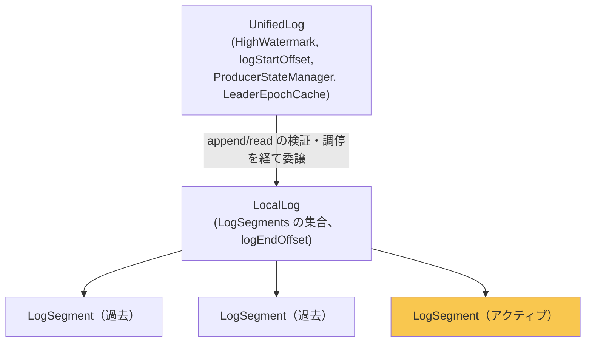
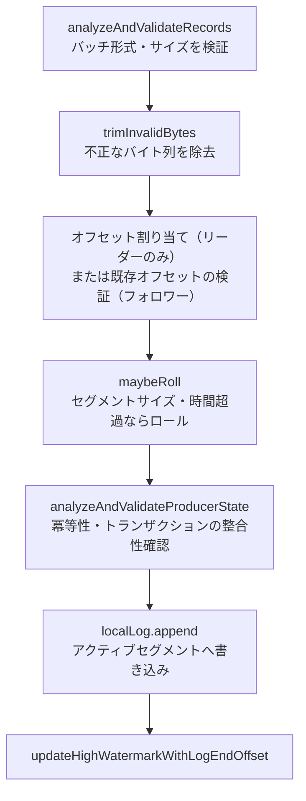

# 第9章 UnifiedLog と LocalLog の追記と読み出し

> **本章で読むソース**
>
> - [`storage/src/main/java/org/apache/kafka/storage/internals/log/UnifiedLog.java`](https://github.com/apache/kafka/blob/4.3.1/storage/src/main/java/org/apache/kafka/storage/internals/log/UnifiedLog.java)
> - [`storage/src/main/java/org/apache/kafka/storage/internals/log/LocalLog.java`](https://github.com/apache/kafka/blob/4.3.1/storage/src/main/java/org/apache/kafka/storage/internals/log/LocalLog.java)

## この章の狙い

第8章では、1本の**セグメント**が `.log` ファイルと `OffsetIndex` / `TimeIndex` の組で構成され、オフセットや時刻からファイル上の位置を引けることを見た。

本章では、そのセグメントの集合をパーティション単位の論理ログとしてまとめ上げる層を読む。**`UnifiedLog`** と **`LocalLog`** である。

両者は役割が異なる。`UnifiedLog` はレプリケーション・トランザクション・階層ストレージまで含めた「パーティションのログ」としての整合性を担う。`LocalLog` はディスク上に存在するセグメント集合そのものの管理に専念する。

この二層構造が、追記と読み出しという2つの基本操作をどう分担するかを、コードに沿って追う。

## 前提

第7章で扱った `MemoryRecords` によるレコードバッチの構造と、第8章で扱った `LogSegment` の役割（`.log` ファイル本体とインデックスの対応付け）を前提とする。

`UnifiedLog` はパーティションごとに1個生成され、`ReplicaManager`（第14章で扱う）から `appendAsLeader` や `appendAsFollower` の呼び出しを受ける。

## UnifiedLog と LocalLog の分担

`UnifiedLog` のクラスコメントは、両者の分担を次のように説明する。

[`storage/src/main/java/org/apache/kafka/storage/internals/log/UnifiedLog.java L94-L104`](https://github.com/apache/kafka/blob/4.3.1/storage/src/main/java/org/apache/kafka/storage/internals/log/UnifiedLog.java#L94-L104)

```java
/**
 * A log which presents a unified view of local and tiered log segments.
 *
 * <p>The log consists of tiered and local segments with the tiered portion of the log being optional. There could be an
 * overlap between the tiered and local segments. The active segment is always guaranteed to be local. If tiered segments
 * are present, they always appear at the beginning of the log, followed by an optional region of overlap, followed by the local
 * segments including the active segment.
 *
 * <p>NOTE: this class handles state and behavior specific to tiered segments as well as any behavior combining both tiered
 * and local segments. The state and behavior specific to local segments are handled by the encapsulated LocalLog instance.
 */
public class UnifiedLog implements AutoCloseable {
```

パーティションのログは、階層ストレージ（tiered storage）に退避された古いセグメントと、ディスク上にある新しいセグメントの両方から構成されうる。**アクティブセグメント**（末尾の書き込み対象セグメント）は常にローカルに存在する。

`UnifiedLog` はこの両方を束ねた「統一されたビュー」を提供する。一方、ローカルに存在するセグメント集合そのものの管理は、内部に保持する `LocalLog` インスタンスへ委譲する。

[`storage/src/main/java/org/apache/kafka/storage/internals/log/UnifiedLog.java L127-L128`](https://github.com/apache/kafka/blob/4.3.1/storage/src/main/java/org/apache/kafka/storage/internals/log/UnifiedLog.java#L127-L128)

```java
    // localLog The LocalLog instance containing non-empty log segments recovered from disk
    private final LocalLog localLog;
```

`LocalLog` 自身のクラスコメントは、この階層をさらに明確にする。

[`storage/src/main/java/org/apache/kafka/storage/internals/log/LocalLog.java L62-L67`](https://github.com/apache/kafka/blob/4.3.1/storage/src/main/java/org/apache/kafka/storage/internals/log/LocalLog.java#L62-L67)

```java
/**
 * An append-only log for storing messages locally. The log is a sequence of LogSegments, each with a base offset.
 * New log segments are created according to a configurable policy that controls the size in bytes or time interval
 * for a given segment.
 * NOTE: this class is not thread-safe, and it relies on the thread safety provided by the Log class.
 */
public class LocalLog {
```

`LocalLog` はスレッドセーフではない。排他制御は呼び出し元の `UnifiedLog` が担う。実際、`UnifiedLog` は追記・ロールの経路すべてで自前のロックを取ってから `LocalLog` を呼び出している。

[`storage/src/main/java/org/apache/kafka/storage/internals/log/UnifiedLog.java L122-L123`](https://github.com/apache/kafka/blob/4.3.1/storage/src/main/java/org/apache/kafka/storage/internals/log/UnifiedLog.java#L122-L123)

```java
    /* A lock that guards all modifications to the log */
    private final Object lock = new Object();
```

`UnifiedLog → LocalLog → LogSegment` という3層の階層を図にすると、次のようになる。



`UnifiedLog` はオフセットの検証、High Watermark の管理、プロデューサー状態やレプリケーションに関わる整合性を担当する。`LocalLog` はその配下で、実際にどのセグメントへ書き込み、どのセグメントから読み出すかという物理的な操作に専念する。

## リーダー追記とフォロワー追記の違い

パーティションへの追記は、リーダーとして受ける場合とフォロワーとして受ける場合で意味が異なる。`UnifiedLog` はこの違いを `appendAsLeader` と `appendAsFollower` という2つの入口に分けている。

[`storage/src/main/java/org/apache/kafka/storage/internals/log/UnifiedLog.java L1049-L1058`](https://github.com/apache/kafka/blob/4.3.1/storage/src/main/java/org/apache/kafka/storage/internals/log/UnifiedLog.java#L1049-L1058)

```java
    public LogAppendInfo appendAsLeader(MemoryRecords records,
                                        int leaderEpoch,
                                        AppendOrigin origin,
                                        RequestLocal requestLocal,
                                        VerificationGuard verificationGuard,
                                        short transactionVersion) {
        boolean validateAndAssignOffsets = origin != AppendOrigin.RAFT_LEADER;
        return append(records, origin, validateAndAssignOffsets, leaderEpoch, Optional.of(requestLocal),
            verificationGuard, false, RecordBatch.CURRENT_MAGIC_VALUE, transactionVersion);
    }
```

[`storage/src/main/java/org/apache/kafka/storage/internals/log/UnifiedLog.java L1080-L1090`](https://github.com/apache/kafka/blob/4.3.1/storage/src/main/java/org/apache/kafka/storage/internals/log/UnifiedLog.java#L1080-L1090)

```java
    public LogAppendInfo appendAsFollower(MemoryRecords records, int leaderEpoch) {
        return append(records,
                      AppendOrigin.REPLICATION,
                      false,
                      leaderEpoch,
                      Optional.empty(),
                      VerificationGuard.SENTINEL,
                      true,
                      RecordBatch.CURRENT_MAGIC_VALUE,
                      TransactionVersion.TV_UNKNOWN);
    }
```

両者はいずれも private メソッド `append` に集約されるが、渡す引数が違う。`appendAsLeader` は `validateAndAssignOffsets` を（`RAFT_LEADER` 起源でない限り）真にして呼ぶのに対し、`appendAsFollower` はこれを常に偽で呼ぶ。

この一点が、リーダー追記とフォロワー追記の本質的な違いを表している。リーダーはプロデューサーから届いたレコードにオフセットを新規に割り当てる主体であり、フォロワーはリーダーがすでに割り当てたオフセットをそのまま受け入れる主体である。

`append` メソッド内で、この差は次のように分岐する。

[`storage/src/main/java/org/apache/kafka/storage/internals/log/UnifiedLog.java L1143-L1169`](https://github.com/apache/kafka/blob/4.3.1/storage/src/main/java/org/apache/kafka/storage/internals/log/UnifiedLog.java#L1143-L1169)

```java
                            if (validateAndAssignOffsets) {
                                // assign offsets to the message set
                                PrimitiveRef.LongRef offset = PrimitiveRef.ofLong(localLog.logEndOffset());
                                appendInfo.setFirstOffset(offset.value);
                                Compression targetCompression = BrokerCompressionType.targetCompression(config().compression, appendInfo.sourceCompression());
                                LogValidator validator = new LogValidator(validRecords,
                                        topicPartition(),
                                        time(),
                                        appendInfo.sourceCompression(),
                                        targetCompression,
                                        config().compact,
                                        toMagic,
                                        config().messageTimestampType,
                                        config().messageTimestampBeforeMaxMs,
                                        config().messageTimestampAfterMaxMs,
                                        leaderEpoch,
                                        origin
                                );
                                LogValidator.ValidationResult validateAndOffsetAssignResult = validator.validateMessagesAndAssignOffsets(offset,
                                        validatorMetricsRecorder,
                                        requestLocal.orElseThrow(() -> new IllegalArgumentException(
                                                "requestLocal should be defined if assignOffsets is true")).bufferSupplier());

                                validRecords = validateAndOffsetAssignResult.validatedRecords();
                                appendInfo.setMaxTimestamp(validateAndOffsetAssignResult.maxTimestampMs());
                                appendInfo.setLastOffset(offset.value - 1);
                                appendInfo.setRecordValidationStats(validateAndOffsetAssignResult.recordValidationStats());
```

リーダー側は、現在の `logEndOffset()` を起点に `LogValidator` へオフセット割り当てを委ねる。バッチ内のレコードには連番のオフセットが振り直され、圧縮方式の変換やタイムスタンプの検証もここで行われる。

一方、フォロワー側（`validateAndAssignOffsets` が偽の分岐）では、バッチにすでに刻まれているオフセットをそのまま検証するだけで済ませる。

[`storage/src/main/java/org/apache/kafka/storage/internals/log/UnifiedLog.java L1188-L1209`](https://github.com/apache/kafka/blob/4.3.1/storage/src/main/java/org/apache/kafka/storage/internals/log/UnifiedLog.java#L1188-L1209)

```java
                            } else {
                                // we are taking the offsets we are given
                                if (appendInfo.firstOrLastOffsetOfFirstBatch() < localLog.logEndOffset()) {
                                    // we may still be able to recover if the log is empty
                                    // one example: fetching from log start offset on the leader which is not batch aligned,
                                    // which may happen as a result of AdminClient#deleteRecords()
                                    boolean hasFirstOffset = appendInfo.firstOffset() != UnifiedLog.UNKNOWN_OFFSET;
                                    long firstOffset = hasFirstOffset ? appendInfo.firstOffset() : records.batches().iterator().next().baseOffset();

                                    String firstOrLast = hasFirstOffset ? "First offset" : "Last offset of the first batch";
                                    List<String> offsets = new ArrayList<>();
                                    for (Record record : records.records()) {
                                        offsets.add(String.valueOf(record.offset()));
                                        if (offsets.size() == 10) break;
                                    }
                                    throw new UnexpectedAppendOffsetException(
                                            "Unexpected offset in append to " + topicPartition() + ". " + firstOrLast + " " +
                                                    appendInfo.firstOrLastOffsetOfFirstBatch() + " is less than the next offset " + localLog.logEndOffset() + ". " +
                                                    "First 10 offsets in append: " + String.join(", ", offsets) + ", last offset in" +
                                                    " append: " + appendInfo.lastOffset() + ". Log start offset = " + logStartOffset,
                                            firstOffset, appendInfo.lastOffset());
                                }
                            }
```

フォロワーが受け取ったバッチの先頭オフセットが、自身の `logEndOffset()` より小さければ矛盾である。フォロワーはリーダーから送られてくる連続したオフセット列をそのまま追記する立場であり、すでに書き込んだ位置より手前のオフセットを渡されることは想定されていない。この場合は `UnexpectedAppendOffsetException` を投げ、呼び出し元（`ReplicaFetcherThread`、第15章）に異常を伝える。

## 追記の全体の流れ

`append` メソッドの本体は長いが、大まかには次の順序で進む。



[`storage/src/main/java/org/apache/kafka/storage/internals/log/UnifiedLog.java L1234-L1263`](https://github.com/apache/kafka/blob/4.3.1/storage/src/main/java/org/apache/kafka/storage/internals/log/UnifiedLog.java#L1234-L1263)

```java
                            // maybe roll the log if this segment is full
                            LogSegment segment = maybeRoll(validRecords.sizeInBytes(), appendInfo);

                            LogOffsetMetadata logOffsetMetadata = new LogOffsetMetadata(
                                    appendInfo.firstOrLastOffsetOfFirstBatch(),
                                    segment.baseOffset(),
                                    segment.size());

                            // now that we have valid records, offsets assigned, and timestamps updated, we need to
                            // validate the idempotent/transactional state of the producers and collect some metadata
                            AnalyzeAndValidateProducerStateResult result = analyzeAndValidateProducerState(
                                logOffsetMetadata, validRecords, origin, verificationGuard, transactionVersion
                            );
```

ここで注目すべきは、書き込み先セグメントの決定が `analyzeAndValidateProducerState` より前に済んでいる点である。プロデューサーの冪等性やトランザクション状態の検証は、どのセグメントに書くかとは独立に行える処理であり、先にセグメントを確定させることで、以降の処理はそのセグメント1つに対して閉じて進められる。

重複バッチと判定された場合は、実際のディスク書き込みを行わずに以前の結果を返す。

[`storage/src/main/java/org/apache/kafka/storage/internals/log/UnifiedLog.java L1247-L1254`](https://github.com/apache/kafka/blob/4.3.1/storage/src/main/java/org/apache/kafka/storage/internals/log/UnifiedLog.java#L1247-L1254)

```java
                            if (result.maybeDuplicate.isPresent()) {
                                BatchMetadata duplicate = result.maybeDuplicate.get();
                                appendInfo.setFirstOffset(duplicate.firstOffset());
                                appendInfo.setLastOffset(duplicate.lastOffset());
                                appendInfo.setLogAppendTime(duplicate.timestamp());
                                appendInfo.setLogStartOffset(logStartOffset);
                                logger.trace("Duplicate batch detected, returning AppendInfo from duplicate batch with last offset: {}, first offset: {}, next offset: {}, skipped messages: {}",
                                        appendInfo.lastOffset(), appendInfo.firstOffset(), localLog.logEndOffset(), validRecords);
                            } else {
```

重複でなければ、`localLog.append` によって実際にディスクへ書き込む。

[`storage/src/main/java/org/apache/kafka/storage/internals/log/UnifiedLog.java L1256-L1263`](https://github.com/apache/kafka/blob/4.3.1/storage/src/main/java/org/apache/kafka/storage/internals/log/UnifiedLog.java#L1256-L1263)

```java
                                // Append the records, and increment the local log end offset immediately after the append because a
                                // write to the transaction index below may fail, and we want to ensure that the offsets
                                // of future appends still grow monotonically. The resulting transaction index inconsistency
                                // will be cleaned up after the log directory is recovered. Note that the end offset of the
                                // ProducerStateManager will not be updated and the last stable offset will not advance
                                // if the append to the transaction index fails.
                                localLog.append(appendInfo.lastOffset(), validRecords);
                                updateHighWatermarkWithLogEndOffset();
```

コメントが明示するとおり、`logEndOffset` の更新は本体データの書き込み直後に行う。トランザクションインデックスへの追記は、この後に別途行われる副次的な処理であり、これが失敗しても `logEndOffset` はすでにレコード本体の書き込みと整合した値へ進んでいる。オフセットが単調に増加するという不変条件を、失敗しうる副次処理より先に確定させる順序である。

`localLog.append` 自体は薄い。

[`storage/src/main/java/org/apache/kafka/storage/internals/log/LocalLog.java L526-L529`](https://github.com/apache/kafka/blob/4.3.1/storage/src/main/java/org/apache/kafka/storage/internals/log/LocalLog.java#L526-L529)

```java
    public void append(long lastOffset, MemoryRecords records) throws IOException {
        segments.activeSegment().append(lastOffset, records);
        updateLogEndOffset(lastOffset + 1);
    }
```

アクティブセグメントへの `append` と、`logEndOffset` の更新の2手順だけである。実際のバイト列の書き込みは `LogSegment.append`（第8章）に委ねられている。

## セグメントのロール

セグメントが満杯になった場合、あるいは一定時間を超えて書き込みが続いた場合には、新しいアクティブセグメントへ切り替える。これを**ロール**と呼ぶ。判定は `maybeRoll` が行う。

[`storage/src/main/java/org/apache/kafka/storage/internals/log/UnifiedLog.java L2146-L2153`](https://github.com/apache/kafka/blob/4.3.1/storage/src/main/java/org/apache/kafka/storage/internals/log/UnifiedLog.java#L2146-L2153)

```java
    private LogSegment maybeRoll(int messagesSize, LogAppendInfo appendInfo) throws IOException {
        synchronized (lock) {
            LogSegment segment = localLog.segments().activeSegment();
            long now = time().milliseconds();
            long maxTimestampInMessages = appendInfo.maxTimestamp();
            long maxOffsetInMessages = appendInfo.lastOffset();

            if (segment.shouldRoll(new RollParams(config().maxSegmentMs(), config().segmentSize(), appendInfo.maxTimestamp(), appendInfo.lastOffset(), messagesSize, now))) {
```

`shouldRoll` の判定に使う `RollParams` には、設定上の最大セグメントサイズ（`segment.bytes`）と最大経過時間（`segment.ms`）の両方が渡っている。どちらか一方の条件を満たせばロールする。

ロールが必要なとき、`UnifiedLog.roll` は新しいベースオフセットを決めて `LocalLog.roll` を呼び出す。

[`storage/src/main/java/org/apache/kafka/storage/internals/log/UnifiedLog.java L2201-L2216`](https://github.com/apache/kafka/blob/4.3.1/storage/src/main/java/org/apache/kafka/storage/internals/log/UnifiedLog.java#L2201-L2216)

```java
    public LogSegment roll(Optional<Long> expectedNextOffset) throws IOException {
        synchronized (lock) {
            long nextOffset = expectedNextOffset.orElse(0L);

            LogSegment newSegment = localLog.roll(nextOffset);
            // Take a snapshot of the producer state to facilitate recovery. It is useful to have the snapshot
            // offset align with the new segment offset since this ensures we can recover the segment by beginning
            // with the corresponding snapshot file and scanning the segment data. Because the segment base offset
            // may actually be ahead of the current producer state end offset (which corresponds to the log end offset),
            // we manually override the state offset here prior to taking the snapshot.
            producerStateManager.updateMapEndOffset(newSegment.baseOffset());
            // We avoid potentially-costly fsync call, since we acquire UnifiedLog#lock here
            // which could block subsequent produces in the meantime.
            // flush is done in the scheduler thread along with segment flushing below
            Optional<File> maybeSnapshot = producerStateManager.takeSnapshot(false);
            updateHighWatermarkWithLogEndOffset();
```

コメントにあるとおり、`fsync` を伴う可能性のあるフラッシュ処理は、ロックを握ったこの箇所では行わず、スケジューラスレッドへ委譲している。ロールは追記のたびに走りうる判定であり、ここで重い I/O を待ち合わせるとロック保持時間が延び、他の追記要求を遅らせる。

実際にファイルを切り替える処理は `LocalLog.roll` にある。

[`storage/src/main/java/org/apache/kafka/storage/internals/log/LocalLog.java L581-L587`](https://github.com/apache/kafka/blob/4.3.1/storage/src/main/java/org/apache/kafka/storage/internals/log/LocalLog.java#L581-L587)

```java
    public LogSegment roll(Long expectedNextOffset) {
        return maybeHandleIOException(
            () -> "Error while rolling log segment for " + topicPartition + " in dir " + dir.getParent(),
            () -> {
                long start = time.hiResClockMs();
                checkIfMemoryMappedBufferClosed();
                long newOffset = Math.max(expectedNextOffset, logEndOffset());
```

新しいベースオフセットは、渡された `expectedNextOffset` と現在の `logEndOffset()` の大きいほうを取る。通常は両者が一致するが、後述するように圧縮バッチの先頭オフセットを厳密に特定できない場合に備えた安全策である。

## High Watermark と logEndOffset の関係

`logEndOffset` は「次に追記されるレコードのオフセット」であり、`LocalLog` が管理する。

[`storage/src/main/java/org/apache/kafka/storage/internals/log/LocalLog.java L291-L296`](https://github.com/apache/kafka/blob/4.3.1/storage/src/main/java/org/apache/kafka/storage/internals/log/LocalLog.java#L291-L296)

```java
    /**
     * The offset of the next message that will be appended to the log
     */
    public long logEndOffset() {
        return nextOffsetMetadata.messageOffset;
    }
```

**High Watermark** は、すべての ISR（同期レプリカ集合（ISR））のレプリカが複製し終えたオフセットを指し、`UnifiedLog` が保持する。

[`storage/src/main/java/org/apache/kafka/storage/internals/log/UnifiedLog.java L506-L508`](https://github.com/apache/kafka/blob/4.3.1/storage/src/main/java/org/apache/kafka/storage/internals/log/UnifiedLog.java#L506-L508)

```java
    public long highWatermark() {
        return highWatermarkMetadata.messageOffset;
    }
```

`logEndOffset` は「ローカルに書き込み済みの末尾」、High Watermark は「クラスタ全体で複製が確認された末尾」を指し、常に `High Watermark <= logEndOffset` の関係にある。この不変条件は `updateHighWatermark` で明示的に守られている。

[`storage/src/main/java/org/apache/kafka/storage/internals/log/UnifiedLog.java L535-L552`](https://github.com/apache/kafka/blob/4.3.1/storage/src/main/java/org/apache/kafka/storage/internals/log/UnifiedLog.java#L535-L552)

```java
    /**
     * Update high watermark with offset metadata. The new high watermark will be lower-bounded by the log start offset
     * and upper-bounded by the log end offset.
     *
     * @param highWatermarkMetadata the suggested high watermark with offset metadata
     * @return the updated high watermark offset
     */
    public long updateHighWatermark(LogOffsetMetadata highWatermarkMetadata) throws IOException {
        LogOffsetMetadata endOffsetMetadata = localLog.logEndOffsetMetadata();
        LogOffsetMetadata newHighWatermarkMetadata = highWatermarkMetadata.messageOffset < logStartOffset
            ? new LogOffsetMetadata(logStartOffset)
            : highWatermarkMetadata.messageOffset >= endOffsetMetadata.messageOffset
                ? endOffsetMetadata
                : highWatermarkMetadata;

        updateHighWatermarkMetadata(newHighWatermarkMetadata);
        return newHighWatermarkMetadata.messageOffset;
    }
```

指定された値が `logStartOffset` を下回れば `logStartOffset` に、`logEndOffset` を上回れば `logEndOffset` に切り詰める。High Watermark は常に `[logStartOffset, logEndOffset]` の範囲に収まる。

追記直後にも `logEndOffset` の変化に合わせて High Watermark を追随させる処理がある。

[`storage/src/main/java/org/apache/kafka/storage/internals/log/UnifiedLog.java L798-L804`](https://github.com/apache/kafka/blob/4.3.1/storage/src/main/java/org/apache/kafka/storage/internals/log/UnifiedLog.java#L798-L804)

```java
    private void updateHighWatermarkWithLogEndOffset() throws IOException {
        // Update the high watermark in case it has gotten ahead of the log end offset following a truncation
        // or if a new segment has been rolled and the offset metadata needs to be updated.
        if (highWatermark() >= localLog.logEndOffset()) {
            updateHighWatermarkMetadata(localLog.logEndOffsetMetadata());
        }
    }
```

これは、単一パーティションのレプリカ数が1つしかない場合や、切り詰め（truncation）の直後に High Watermark が `logEndOffset` に追いついてしまっている状況で、両者のオフセットメタデータ（セグメントのベースオフセットや物理位置を含む `LogOffsetMetadata`）を整合させるための処理である。複数レプリカ間の High Watermark 更新自体は `ReplicaManager`（第14章）がフェッチ応答をもとに調停する。

## 読み出しの経路

読み出しは `UnifiedLog.read` から始まる。

[`storage/src/main/java/org/apache/kafka/storage/internals/log/UnifiedLog.java L1649-L1660`](https://github.com/apache/kafka/blob/4.3.1/storage/src/main/java/org/apache/kafka/storage/internals/log/UnifiedLog.java#L1649-L1660)

```java
    public FetchDataInfo read(long startOffset,
                              int maxLength,
                              FetchIsolation isolation,
                              boolean minOneMessage) throws IOException {
        checkLogStartOffset(startOffset);
        LogOffsetMetadata maxOffsetMetadata = switch (isolation) {
            case LOG_END -> localLog.logEndOffsetMetadata();
            case HIGH_WATERMARK -> fetchHighWatermarkMetadata();
            case TXN_COMMITTED -> fetchLastStableOffsetMetadata();
        };
        return localLog.read(startOffset, maxLength, minOneMessage, maxOffsetMetadata, isolation == FetchIsolation.TXN_COMMITTED);
    }
```

ここで `FetchIsolation` が読み出しの上限を決める役割を担う。コンシューマーからの通常のフェッチは `HIGH_WATERMARK` を指定し、High Watermark を超えるレコード（まだ全レプリカに複製されていないレコード）を読ませない。フォロワーからのフェッチは `LOG_END` を指定し、リーダーの末尾まで読める。トランザクションを考慮した read committed 読み出しは `TXN_COMMITTED` を使う。

読み出しの上限が一本化されたあと、実際のセグメント探索は `LocalLog.read` が行う。

[`storage/src/main/java/org/apache/kafka/storage/internals/log/LocalLog.java L474-L513`](https://github.com/apache/kafka/blob/4.3.1/storage/src/main/java/org/apache/kafka/storage/internals/log/LocalLog.java#L474-L513)

```java
                    LogOffsetMetadata endOffsetMetadata = nextOffsetMetadata;
                    long endOffset = endOffsetMetadata.messageOffset;
                    Optional<LogSegment> segmentOpt = segments.floorSegment(startOffset);
                    // return error on attempt to read beyond the log end offset
                    if (startOffset > endOffset || segmentOpt.isEmpty()) {
                        throw new OffsetOutOfRangeException("Received request for offset " + startOffset + " for partition " + topicPartition + ", " +
                                "but we only have log segments upto " + endOffset + ".");
                    }
                    if (startOffset == maxOffsetMetadata.messageOffset) return emptyFetchDataInfo(maxOffsetMetadata, includeAbortedTxns);
                    if (startOffset > maxOffsetMetadata.messageOffset) return emptyFetchDataInfo(convertToOffsetMetadataOrThrow(startOffset), includeAbortedTxns);

                    // Do the read on the segment with a base offset less than the target offset
                    // but if that segment doesn't contain any messages with an offset greater than that
                    // continue to read from successive segments until we get some messages or we reach the end of the log
                    FetchDataInfo fetchDataInfo = null;
                    while (fetchDataInfo == null && segmentOpt.isPresent()) {
                        LogSegment segment = segmentOpt.get();
                        long baseOffset = segment.baseOffset();

                        Optional<Long> maxPositionOpt;
                        if (segment.baseOffset() < maxOffsetMetadata.segmentBaseOffset)
                            maxPositionOpt = Optional.of((long) segment.size());
                        else if (segment.baseOffset() == maxOffsetMetadata.segmentBaseOffset && !maxOffsetMetadata.messageOffsetOnly())
                            maxPositionOpt = Optional.of((long) maxOffsetMetadata.relativePositionInSegment);
                        else
                            maxPositionOpt = Optional.empty();

                        fetchDataInfo = segment.read(startOffset, maxLength, maxPositionOpt, minOneMessage);
                        if (fetchDataInfo != null) {
                            if (includeAbortedTxns) {
                                fetchDataInfo = addAbortedTransactions(startOffset, segment, fetchDataInfo);
                            }
                        } else {
                            segmentOpt = segments.higherSegment(baseOffset);
                        }
                    }
```

まず `segments.floorSegment(startOffset)` で、開始オフセット以下の最大のベースオフセットを持つセグメントを1つ選ぶ（第8章で扱った `ConcurrentSkipListMap` による探索）。

読み出し可能な上限位置（`maxPositionOpt`）は、セグメントと `maxOffsetMetadata`（`HIGH_WATERMARK` などで決まった上限のオフセットメタデータ）の関係で3通りに分岐する。上限のセグメントより前のセグメントならセグメント全体、上限と同じセグメントならその相対位置まで、まだ上限のセグメントに達していなければ無制限、という具合である。

選んだセグメントに `startOffset` 以降のレコードが1件もなければ（セグメント境界をまたぐ場合）、`segments.higherSegment` で次のセグメントへ進む。この繰り返しにより、複数セグメントにまたがる読み出し要求も1回の `read` 呼び出しで解決する。

## 最適化の工夫：末尾への順次追記とページキャッシュ

`UnifiedLog` と `LocalLog` の構造には、Kafka のスループットを支える工夫が組み込まれている。追記は常にアクティブセグメントの末尾へのみ行われる、という制約である。

[`storage/src/main/java/org/apache/kafka/storage/internals/log/LogSegment.java L250-L261`](https://github.com/apache/kafka/blob/4.3.1/storage/src/main/java/org/apache/kafka/storage/internals/log/LogSegment.java#L250-L261)

```java
    public void append(long largestOffset,
                       MemoryRecords records) throws IOException {
        if (records.sizeInBytes() > 0) {
            LOGGER.trace("Inserting {} bytes at end offset {} at position {}",
                records.sizeInBytes(), largestOffset, log.sizeInBytes());
            int physicalPosition = log.sizeInBytes();

            ensureOffsetInRange(largestOffset);

            // append the messages
            long appendedBytes = log.append(records);
```

書き込み位置（`physicalPosition`）は常にファイルの現在サイズであり、既存データの途中を書き換える経路が存在しない。この**追記専用**（append-only）という制約により、OS のページキャッシュ上でファイル末尾のダーティページだけを追跡すればよくなり、ランダム書き込みで必要になるページの読み込みやキャッシュの追い出しを避けられる。

さらに、追記のたびにインデックスへエントリを足すわけではない。

[`storage/src/main/java/org/apache/kafka/storage/internals/log/LogSegment.java L270-L274`](https://github.com/apache/kafka/blob/4.3.1/storage/src/main/java/org/apache/kafka/storage/internals/log/LogSegment.java#L270-L274)

```java
                if (bytesSinceLastIndexEntry > indexIntervalBytes) {
                    offsetIndex().append(batchLastOffset, physicalPosition);
                    timeIndex().maybeAppend(maxTimestampSoFar(), shallowOffsetOfMaxTimestampSoFar());
                    bytesSinceLastIndexEntry = 0;
                }
```

前回のインデックス登録から `indexIntervalBytes`（設定 `index.interval.bytes`）を超えて書き込んだときだけインデックスに1エントリを追加する、疎な（sparse）インデックスである（第8章で扱った `OffsetIndex` の探索が、この間引かれたエントリを前提に成り立っている）。

読み出し側は、この順次追記という性質を逆手に取り、`segments.floorSegment` によるセグメント単位のO(log n)探索と、セグメント内の疎インデックスによる絞り込みを組み合わせて、目的のオフセットに近い物理位置へ直接シークする。ファイル全体を先頭から走査する必要がない。

追記と読み出しの両方が「末尾に積むだけ」「末尾から辿るだけ」という単純な構造に還元されていることが、この層がロック競合や複雑な整合性制御を最小限に抑えられている理由である。

## まとめ

`UnifiedLog` はパーティションの論理ログとして、オフセットの割り当てと検証、High Watermark の管理、プロデューサー状態やトランザクションとの整合性を担う。`LocalLog` はその配下で、ローカルディスク上のセグメント集合の管理に専念する。

追記では、リーダーがオフセットを新規に割り当てるのに対し、フォロワーは与えられたオフセットをそのまま検証するだけという非対称性がある。`logEndOffset` はローカルの書き込み末尾、High Watermark はクラスタ全体で複製済みの末尾を指し、常に前者が後者以上になるという不変条件が随所で保たれている。

読み出しは `FetchIsolation` によって見える範囲の上限が決まり、`LocalLog` がセグメントをまたいで探索する。追記が常に末尾へのシーケンシャル書き込みに限定されていることが、ページキャッシュの活用と疎インデックスによる高速な位置特定の両方を支えている。

## 関連する章

- 第8章 [`08-logsegment-index.md`](08-logsegment-index.md)：`LogSegment` 単体の構造と `OffsetIndex` / `TimeIndex` の探索
- 第10章 [`10-logmanager.md`](10-logmanager.md)：`UnifiedLog` を複数パーティション分まとめて管理する層
- 第13章 [`../part04-replication/13-partition-isr.md`](../part04-replication/13-partition-isr.md)：High Watermark を ISR 間でどう調停するか
