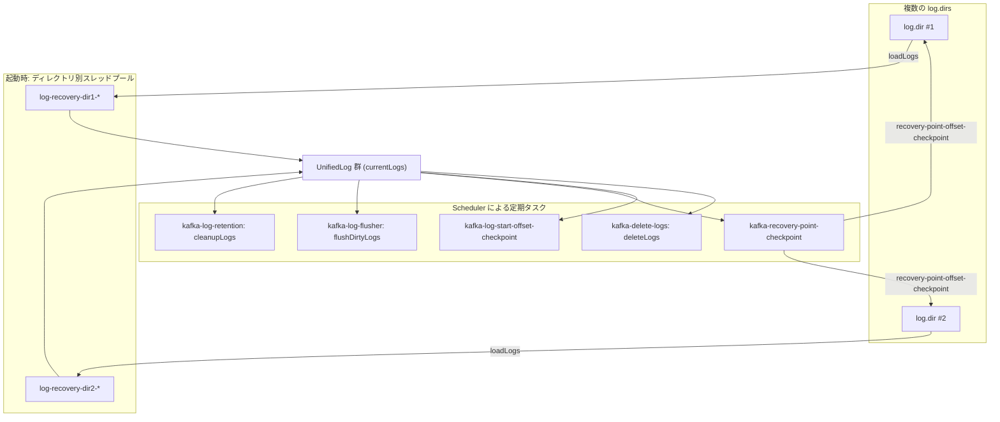

# 第10章 LogManager とログのライフサイクル

> **本章で読むソース**
>
> - [`core/src/main/scala/kafka/log/LogManager.scala`](https://github.com/apache/kafka/blob/4.3.1/core/src/main/scala/kafka/log/LogManager.scala)

## この章の狙い

第9章では、パーティション1つ分のログを表す`UnifiedLog`が、セグメントの追記や切り出しをどう扱うかを見た。

本章では、その`UnifiedLog`を複数の`log.dirs`にまたがって束ね、起動と停止、保持期間の管理、障害への対応までを担う`LogManager`を読む。

`LogManager`という名前のクラスは`core`（Scala）と`storage`（Java）の両モジュールに存在するが、ライフサイクル管理の本体は`core/src/main/scala/kafka/log/LogManager.scala`の`class LogManager`である。

storage モジュールの`LogManager`は、チェックポイントファイル名などの定数と静的ユーティリティを提供する補助クラスにとどまる。

## 前提

ブローカーは`log.dirs`設定で複数のディスクディレクトリを指定できる。

`LogManager`は、これら複数ディレクトリの生死を管理し、各ディレクトリの直下に置かれた「トピック名-パーティション番号」形式のサブディレクトリを1つの`UnifiedLog`として読み込む。

コンストラクタで受け取る`logDirs`がコンフィグ上のディレクトリ一覧であり、実際に読み書き可能なディレクトリの集合は`_liveLogDirs`というキューで別管理する。

[`core/src/main/scala/kafka/log/LogManager.scala L102-L105`](https://github.com/apache/kafka/blob/4.3.1/core/src/main/scala/kafka/log/LogManager.scala#L102-L105)

```scala
  private val _liveLogDirs: ConcurrentLinkedQueue[File] = createAndValidateLogDirs(logDirs, initialOfflineDirs)
  @volatile private var _cordonedLogDirs: Set[String] = Set()
  @volatile private var _currentDefaultConfig = initialDefaultConfig
  @volatile private var numRecoveryThreadsPerDataDir = recoveryThreadsPerDataDir
```

`logDirs`と`_liveLogDirs`を分けているのは、ディスク障害が起きたディレクトリを構成から外しつつ、元々の構成一覧（オフラインディレクトリ数などのメトリクス計算に使う）を保持し続けるためである。

`liveLogDirs`が全ディレクトリを含む間はコンフィグ上のリストをそのまま返し、1つでも外れると`_liveLogDirs`から作り直す。

[`core/src/main/scala/kafka/log/LogManager.scala L120-L125`](https://github.com/apache/kafka/blob/4.3.1/core/src/main/scala/kafka/log/LogManager.scala#L120-L125)

```scala
  def liveLogDirs: Seq[File] = {
    if (_liveLogDirs.size == logDirs.size)
      logDirs
    else
      _liveLogDirs.asScala.toBuffer
  }
```

## 起動時のログロードと並列復旧

ブローカー起動時、`LogManager`は各`log.dirs`配下のディレクトリを走査し、既存のログをすべて`UnifiedLog`として復元する。

この処理を担うのが`loadLogs`である。

[`core/src/main/scala/kafka/log/LogManager.scala L424-L456`](https://github.com/apache/kafka/blob/4.3.1/core/src/main/scala/kafka/log/LogManager.scala#L424-L456)

```scala
  private[log] def loadLogs(defaultConfig: LogConfig, topicConfigOverrides: Map[String, LogConfig], isStray: UnifiedLog => Boolean): Unit = {
    info(s"Loading logs from log dirs $liveLogDirs")
    val startMs = time.hiResClockMs()
    val threadPools = ArrayBuffer.empty[ExecutorService]
    val offlineDirs = mutable.Set.empty[(String, IOException)]
    val jobs = ArrayBuffer.empty[Seq[Future[_]]]
    var numTotalLogs = 0
    // log dir path -> number of Remaining logs map for remainingLogsToRecover metric
    val numRemainingLogs: ConcurrentMap[String, Int] = new ConcurrentHashMap[String, Int]
    // log recovery thread name -> number of remaining segments map for remainingSegmentsToRecover metric
    val numRemainingSegments: ConcurrentMap[String, Integer] = new ConcurrentHashMap[String, Integer]

    def handleIOException(logDirAbsolutePath: String, e: IOException): Unit = {
      offlineDirs.add((logDirAbsolutePath, e))
      error(s"Error while loading log dir $logDirAbsolutePath", e)
    }

    val uncleanLogDirs = mutable.Buffer.empty[String]
    for (dir <- liveLogDirs) {
      val logDirAbsolutePath = dir.getAbsolutePath
      var hadCleanShutdown: Boolean = false
      try {
        val pool = Executors.newFixedThreadPool(numRecoveryThreadsPerDataDir,
          new LogRecoveryThreadFactory(logDirAbsolutePath))
        threadPools.append(pool)
```

この処理では、ディレクトリごとに独立した`ExecutorService`を1つずつ生成している。

前のディレクトリのループで`clean shutdown`マーカーの有無や recovery-point チェックポイントを読み終えたあと、そのディレクトリ配下の各パーティションディレクトリに対して`loadLog`をジョブとしてスレッドプールへ投入する。

[`core/src/main/scala/kafka/log/LogManager.scala L477-L532`](https://github.com/apache/kafka/blob/4.3.1/core/src/main/scala/kafka/log/LogManager.scala#L477-L532)

```scala
        val logsToLoad = Option(dir.listFiles).getOrElse(Array.empty).filter(logDir =>
          logDir.isDirectory &&
            // Ignore remote-log-index-cache directory as that is index cache maintained by tiered storage subsystem
            // but not any topic-partition dir.
            !logDir.getName.equals(RemoteIndexCache.DIR_NAME) &&
            UnifiedLog.parseTopicPartitionName(logDir).topic != KafkaRaftServer.MetadataTopic)
        numTotalLogs += logsToLoad.length
        numRemainingLogs.put(logDirAbsolutePath, logsToLoad.length)
        loadLogsCompletedFlags.put(logDirAbsolutePath, logsToLoad.isEmpty)

        if (logsToLoad.isEmpty) {
          info(s"No logs found to be loaded in $logDirAbsolutePath")
        } else if (hadCleanShutdown) {
          info(s"Skipping recovery of ${logsToLoad.length} logs from $logDirAbsolutePath since " +
            "clean shutdown file was found")
        } else {
          info(s"Recovering ${logsToLoad.length} logs from $logDirAbsolutePath since no " +
            "clean shutdown file was found")
          uncleanLogDirs.append(logDirAbsolutePath)
        }

        val jobsForDir = logsToLoad.map { logDir =>
          val runnable: Runnable = () => {
            debug(s"Loading log $logDir")
            var log = None: Option[UnifiedLog]
            val logLoadStartMs = time.hiResClockMs()
            try {
              log = Some(loadLog(logDir, hadCleanShutdown, recoveryPoints, logStartOffsets,
                defaultConfig, topicConfigOverrides, numRemainingSegments, isStray))
            } catch {
              case e: IOException =>
                handleIOException(logDirAbsolutePath, e)
              case e: KafkaStorageException if e.getCause.isInstanceOf[IOException] =>
                // KafkaStorageException might be thrown, ex: during writing LeaderEpochFileCache
                // And while converting IOException to KafkaStorageException, we've already handled the exception. So we can ignore it here.
            } finally {
              val logLoadDurationMs = time.hiResClockMs() - logLoadStartMs
              val remainingLogs = decNumRemainingLogs(numRemainingLogs, logDirAbsolutePath)
              val currentNumLoaded = logsToLoad.length - remainingLogs
              log match {
                case Some(loadedLog) => info(s"Completed load of $loadedLog with ${loadedLog.numberOfSegments} segments, " +
                  s"local-log-start-offset ${loadedLog.localLogStartOffset()} and log-end-offset ${loadedLog.logEndOffset} in ${logLoadDurationMs}ms " +
                  s"($currentNumLoaded/${logsToLoad.length} completed in $logDirAbsolutePath)")
                case None => info(s"Error while loading logs in $logDir in ${logLoadDurationMs}ms ($currentNumLoaded/${logsToLoad.length} completed in $logDirAbsolutePath)")
              }

              if (remainingLogs == 0) {
                // loadLog is completed for all logs under the logDir, mark it.
                loadLogsCompletedFlags.put(logDirAbsolutePath, true)
              }
            }
          }
          runnable
        }

        jobs += jobsForDir.map(pool.submit)
```

各ディレクトリのジョブ一覧をまとめたあと、全ジョブの完了を`Future#get`で待ち合わせる。

[`core/src/main/scala/kafka/log/LogManager.scala L539-L555`](https://github.com/apache/kafka/blob/4.3.1/core/src/main/scala/kafka/log/LogManager.scala#L539-L555)

```scala
    try {
      addLogRecoveryMetrics(numRemainingLogs, numRemainingSegments)
      for (dirJobs <- jobs) {
        dirJobs.foreach(_.get)
      }

      offlineDirs.foreach { case (dir, e) =>
        logDirFailureChannel.maybeAddOfflineLogDir(dir, s"Error while loading log dir $dir", e)
      }
    } catch {
      case e: ExecutionException =>
        error(s"There was an error in one of the threads during logs loading: ${e.getCause}")
        throw e.getCause
    } finally {
      removeLogRecoveryMetrics()
      threadPools.foreach(_.shutdown())
    }
```

`hadCleanShutdown`が真であれば`UnifiedLog.create`はセグメントの整合性検査を簡略化でき、偽であれば各セグメントのインデックス再構築や末尾レコードの検証を伴う本格的なリカバリが走る。

パーティション数が数千に達するブローカーでは、この復旧処理がディレクトリ単位で直列に行われると起動に長い時間がかかる。

そこで`LogManager`は、ディレクトリごとにスレッドプールを分け、さらにディレクトリ内の各パーティションの復旧を`numRecoveryThreadsPerDataDir`（設定`num.recovery.threads.per.data.dir`）本のスレッドへ分散させて並列に復旧を進める。

1ディレクトリ1プールという構成により、あるディレクトリの復旧が遅れても他のディレクトリの復旧が待たされることがなく、ディスクごとの I/O 帯域を個別に使い切れる。

## getOrCreateLog によるパーティションの新規配置

新しいパーティションが割り当てられたとき、`ReplicaManager`は`getOrCreateLog`を呼び出して`UnifiedLog`を確保する。

[`core/src/main/scala/kafka/log/LogManager.scala L1028-L1057`](https://github.com/apache/kafka/blob/4.3.1/core/src/main/scala/kafka/log/LogManager.scala#L1028-L1057)

```scala
  def getOrCreateLog(topicPartition: TopicPartition, isNew: Boolean = false, isFuture: Boolean = false,
                     topicId: Optional[Uuid], targetLogDirectoryId: Option[Uuid] = Option.empty): UnifiedLog = {
    logCreationOrDeletionLock synchronized {
      val log = getLog(topicPartition, isFuture).getOrElse {
        // create the log if it has not already been created in another thread
        if (!isNew && offlineLogDirs.nonEmpty)
          throw new KafkaStorageException(s"Can not create log for $topicPartition because log directories ${offlineLogDirs.mkString(",")} are offline")

        val logDirs: List[File] = {
          val preferredLogDir = targetLogDirectoryId.filterNot(Seq(DirectoryId.UNASSIGNED,DirectoryId.LOST).contains) match {
            case Some(targetId) if !preferredLogDirs.containsKey(topicPartition) =>
              // If partition is configured with both targetLogDirectoryId and preferredLogDirs, then
              // preferredLogDirs will be respected, otherwise targetLogDirectoryId will be respected
              directoryIds.find(_._2 == targetId).map(_._1).orNull
            case _ =>
              preferredLogDirs.get(topicPartition)
          }

          if (isFuture) {
            if (preferredLogDir == null)
              throw new IllegalStateException(s"Can not create the future log for $topicPartition without having a preferred log directory")
            else if (getLog(topicPartition).get.parentDir == preferredLogDir)
              throw new IllegalStateException(s"Can not create the future log for $topicPartition in the current log directory of this partition")
          }

          if (preferredLogDir != null)
            List(new File(preferredLogDir))
          else
            nextLogDirs()
        }
```

配置先ディレクトリの候補が`preferredLogDir`（レプリカ移動先として指定済みのディレクトリ）で決まらない場合、`nextLogDirs`が候補一覧を返す。

[`core/src/main/scala/kafka/log/LogManager.scala L1385-L1404`](https://github.com/apache/kafka/blob/4.3.1/core/src/main/scala/kafka/log/LogManager.scala#L1385-L1404)

```scala
  def nextLogDirs(): List[File] = {
    if (_liveLogDirs.size == 1) {
      List(_liveLogDirs.peek())
    } else {
      // count the number of logs in each parent directory (including 0 for empty directories
      val logCounts = allLogs.groupBy(_.parentDir).map { case (parent, logs) => parent -> logs.size }
      val zeros = _liveLogDirs.asScala.map(dir => (dir.getPath, 0)).toMap
      val dirCounts = (zeros ++ logCounts).filter(d => !cordonedLogDirs().contains(d._1)).toBuffer

      if (dirCounts.isEmpty) {
        // all log directories are cordoned, choose the first live directory
        List(_liveLogDirs.peek())
      } else {
        // choose the directory with the least logs in it
        dirCounts.sortBy(_._2).map {
          case (path: String, _: Int) => new File(path)
        }.toList
      }
    }
  }
```

`nextLogDirs`は、現在保持しているパーティション数が最も少ないディレクトリから順に候補を並べる。

このため`getOrCreateLog`は、候補を先頭から順に`createLogDirectory`へ渡し、ディレクトリの作成に成功した最初の1件を採用する。

複数の`log.dirs`間でパーティション数を均等に近づけることで、特定のディスクだけに書き込みが集中する事態を避けている。

## 定期タスクによる保持期間管理とチェックポイント

`startup`が呼ばれると、`loadLogs`によるログロードのあと、`Scheduler`へ4種類の定期タスクと1種類の単発タスクを登録する。

[`core/src/main/scala/kafka/log/LogManager.scala L617-L649`](https://github.com/apache/kafka/blob/4.3.1/core/src/main/scala/kafka/log/LogManager.scala#L617-L649)

```scala
  private[log] def startupWithConfigOverrides(
    defaultConfig: LogConfig,
    topicConfigOverrides: Map[String, LogConfig],
    isStray: UnifiedLog => Boolean): Unit = {
    loadLogs(defaultConfig, topicConfigOverrides, isStray) // this could take a while if shutdown was not clean

    /* Schedule the cleanup task to delete old logs */
    if (scheduler != null) {
      info("Starting log cleanup with a period of %d ms.".format(retentionCheckMs))
      scheduler.schedule("kafka-log-retention",
                         () => cleanupLogs(),
                         initialTaskDelayMs,
                         retentionCheckMs)
      info("Starting log flusher with a default period of %d ms.".format(flushCheckMs))
      scheduler.schedule("kafka-log-flusher",
                         () => flushDirtyLogs(),
                         initialTaskDelayMs,
                         flushCheckMs)
      scheduler.schedule("kafka-recovery-point-checkpoint",
                         () => checkpointLogRecoveryOffsets(),
                         initialTaskDelayMs,
                         flushRecoveryOffsetCheckpointMs)
      scheduler.schedule("kafka-log-start-offset-checkpoint",
                         () => checkpointLogStartOffsets(),
                         initialTaskDelayMs,
                         flushStartOffsetCheckpointMs)
      scheduler.scheduleOnce("kafka-delete-logs", // will be rescheduled after each delete logs with a dynamic period
                         () => deleteLogs(),
                         initialTaskDelayMs)
    }
    if (cleanerConfig.enableCleaner) {
      _cleaner = cleanerFactory(cleanerConfig, liveLogDirs.asJava, currentLogs, logDirFailureChannel, time)
      _cleaner.startup()
```

`kafka-log-retention`が呼ぶ`cleanupLogs`は、保持期間またはサイズ上限を超えた古いセグメントの削除を、コンパクション対象でないパーティションに限って行う。

[`core/src/main/scala/kafka/log/LogManager.scala L1410-L1451`](https://github.com/apache/kafka/blob/4.3.1/core/src/main/scala/kafka/log/LogManager.scala#L1410-L1451)

```scala
  private def cleanupLogs(): Unit = {
    debug("Beginning log cleanup...")
    var total = 0
    val startMs = time.milliseconds

    // clean current logs.
    val deletableLogs: util.Map[TopicPartition, UnifiedLog] = {
      if (cleaner != null) {
        // prevent cleaner from working on same partitions when changing cleanup policy
        cleaner.pauseCleaningForNonCompactedPartitions()
      } else {
        currentLogs.entrySet().stream()
          .filter(e => !e.getValue.config.compact)
          .collect(Collectors.toMap(
            (e: util.Map.Entry[TopicPartition, UnifiedLog]) => e.getKey,
            (e: util.Map.Entry[TopicPartition, UnifiedLog]) => e.getValue
          ))
      }
    }

    try {
      deletableLogs.forEach {
        case (topicPartition, log) =>
          debug(s"Garbage collecting '${log.name}'")
          total += log.deleteOldSegments()

          val futureLog = futureLogs.get(topicPartition)
          if (futureLog != null) {
            // clean future logs
            debug(s"Garbage collecting future log '${futureLog.name}'")
            total += futureLog.deleteOldSegments()
          }
      }
    } finally {
      if (cleaner != null) {
        cleaner.resumeCleaning(deletableLogs.keySet())
      }
    }

    debug(s"Log cleanup completed. $total files deleted in " +
                  (time.milliseconds - startMs) / 1000 + " seconds")
  }
```

実際の削除条件の判定と削除自体は`UnifiedLog.deleteOldSegments`に委譲されており、`LogManager`側はパーティション一覧を集めて回すだけである。

コンパクション対象のパーティションは、削除対象の選定中に`LogCleaner`が並行してセグメントを書き換えないよう、`pauseCleaningForNonCompactedPartitions`で一時的に除外してから処理する（`LogCleaner`は第11章で扱う）。

`kafka-log-flusher`が呼ぶ`flushDirtyLogs`は、各ログの`flushMs`（設定`log.flush.interval.ms`）で決まるフラッシュ間隔を超えたログだけを`fsync`する。

[`core/src/main/scala/kafka/log/LogManager.scala L1501-L1510`](https://github.com/apache/kafka/blob/4.3.1/core/src/main/scala/kafka/log/LogManager.scala#L1501-L1510)

```scala
  private def flushDirtyLogs(): Unit = {
    debug("Checking for dirty logs to flush...")

    for ((topicPartition, log) <- currentLogs.asScala.toList ++ futureLogs.asScala.toList) {
      try {
        val timeSinceLastFlush = time.milliseconds - log.lastFlushTime
        debug(s"Checking if flush is needed on ${topicPartition.topic} flush interval ${log.config.flushMs}" +
              s" last flushed ${log.lastFlushTime} time since last flush: $timeSinceLastFlush")
        if (timeSinceLastFlush >= log.config.flushMs)
```

## recovery-point チェックポイントによる復旧範囲の縮小

`kafka-recovery-point-checkpoint`が呼ぶ`checkpointLogRecoveryOffsets`は、`liveLogDirs`ごとに、そのディレクトリに属するログの`recoveryPoint`（フラッシュ済みのオフセット）を1つのチェックポイントファイル`recovery-point-offset-checkpoint`へまとめて書き出す。

[`core/src/main/scala/kafka/log/LogManager.scala L806-L816`](https://github.com/apache/kafka/blob/4.3.1/core/src/main/scala/kafka/log/LogManager.scala#L806-L816)

```scala
  /**
   * Write out the current recovery point for all logs to a text file in the log directory
   * to avoid recovering the whole log on startup.
   */
  def checkpointLogRecoveryOffsets(): Unit = {
    val logsByDirCached = logsByDir
    liveLogDirs.foreach { logDir =>
      val logsToCheckpoint = logsInDir(logsByDirCached, logDir)
      checkpointRecoveryOffsetsInDir(logDir, logsToCheckpoint)
    }
  }
```

このチェックポイントファイルが、`loadLogs`が起動時に読み込む`recoveryPoints`の実体である。

クラッシュ後の再起動時、`UnifiedLog.create`は`recoveryPoint`より前のオフセットについては検証済みとみなし、それ以降のセグメントだけを走査する。

コメントにある通り、このチェックポイントの目的は「ログ全体を毎回リカバリせずに済ませる」ことにある。

`checkpointLogStartOffsets`も同様の構造で、`DeleteRecordsRequest`によって切り詰められた先頭オフセットを`log-start-offset-checkpoint`へ書き出す。

## ログディレクトリ障害への対応

いずれかのディレクトリで I/O エラーが発生すると、`logDirFailureChannel`を通じて`handleLogDirFailure`が呼ばれる。

[`core/src/main/scala/kafka/log/LogManager.scala L235-L271`](https://github.com/apache/kafka/blob/4.3.1/core/src/main/scala/kafka/log/LogManager.scala#L235-L271)

```scala
  def handleLogDirFailure(dir: String): Unit = {
    warn(s"Stopping serving logs in dir $dir")
    logCreationOrDeletionLock synchronized {
      _liveLogDirs.remove(new File(dir))
      directoryIds.remove(dir)
      if (_liveLogDirs.isEmpty) {
        fatal(s"Shutdown broker because all log dirs in ${logDirs.mkString(", ")} have failed")
        Exit.halt(1)
      }

      recoveryPointCheckpoints = recoveryPointCheckpoints.filter { case (file, _) => file.getAbsolutePath != dir }
      logStartOffsetCheckpoints = logStartOffsetCheckpoints.filter { case (file, _) => file.getAbsolutePath != dir }
      if (cleaner != null)
        cleaner.handleLogDirFailure(dir)

      def removeOfflineLogs(logs: util.concurrent.ConcurrentMap[TopicPartition, UnifiedLog]): Iterable[TopicPartition] = {
        val offlineTopicPartitions: Iterable[TopicPartition] = logs.asScala.collect {
          case (tp, log) if log.parentDir == dir => tp
        }
        offlineTopicPartitions.foreach { topicPartition => {
          val removedLog = removeLogAndMetrics(logs, topicPartition)
          removedLog.foreach {
            log => log.closeHandlers()
          }
        }}

        offlineTopicPartitions
      }

      val offlineCurrentTopicPartitions = removeOfflineLogs(currentLogs)
      val offlineFutureTopicPartitions = removeOfflineLogs(futureLogs)

      warn(s"Logs for partitions ${offlineCurrentTopicPartitions.mkString(",")} are offline and " +
           s"logs for future partitions ${offlineFutureTopicPartitions.mkString(",")} are offline due to failure on log directory $dir")
      dirLocks.filter(_.file.getParent == dir).foreach(dir => Utils.swallow(this.logger.underlying, () => dir.destroy()))
    }
  }
```

処理は、対象ディレクトリを`_liveLogDirs`から外し、そのディレクトリに属するチェックポイントとファイルロックを解放し、そのディレクトリの`UnifiedLog`を`currentLogs`と`futureLogs`の双方から除去するという順に進む。

全ディレクトリが失敗した場合はブローカー自体を停止するが、一部だけが失敗した場合は残りの生存ディレクトリで運用を継続する。

これにより、1本のディスク障害が即座にブローカー全体の停止につながることを避けている。

## 停止処理と recovery-point の最終書き込み

`shutdown`は、`loadLogs`と対になる形で、ディレクトリごとにスレッドプールを作ってログのフラッシュとクローズを並列に行う。

[`core/src/main/scala/kafka/log/LogManager.scala L677-L697`](https://github.com/apache/kafka/blob/4.3.1/core/src/main/scala/kafka/log/LogManager.scala#L677-L697)

```scala
    // close logs in each dir
    for (dir <- liveLogDirs) {
      debug(s"Flushing and closing logs at $dir")

      val pool = Executors.newFixedThreadPool(numRecoveryThreadsPerDataDir,
        KafkaThread.nonDaemon(s"log-closing-${dir.getAbsolutePath}", _))
      threadPools.append(pool)

      val logs = logsInDir(localLogsByDir, dir).values

      val jobsForDir = logs.map { log =>
        val runnable: Runnable = () => {
          // flush the log to ensure latest possible recovery point
          log.flush(true)
          log.close()
        }
        runnable
      }

      jobs(dir) = jobsForDir.map(pool.submit).toSeq
    }
```

各ディレクトリのクローズが完了すると、そのディレクトリの recovery-point と log-start-offset を最終値でチェックポイントに書き込み、正常停止であったことを示すマーカーファイルを作成する。

[`core/src/main/scala/kafka/log/LogManager.scala L699-L722`](https://github.com/apache/kafka/blob/4.3.1/core/src/main/scala/kafka/log/LogManager.scala#L699-L722)

```scala
    try {
      jobs.foreachEntry { (dir, dirJobs) =>
        if (JLogManager.waitForAllToComplete(dirJobs.toList.asJava,
          e => warn(s"There was an error in one of the threads during LogManager shutdown: ${e.getCause}"))) {
          val logs = logsInDir(localLogsByDir, dir)

          // update the last flush point
          debug(s"Updating recovery points at $dir")
          checkpointRecoveryOffsetsInDir(dir, logs)

          debug(s"Updating log start offsets at $dir")
          checkpointLogStartOffsetsInDir(dir, logs)

          // mark that the shutdown was clean by creating marker file for log dirs that:
          //  1. had clean shutdown marker file; or
          //  2. had no clean shutdown marker file, but all logs under it have been recovered at startup time
          val logDirAbsolutePath = dir.getAbsolutePath
          if (hadCleanShutdownFlags.getOrDefault(logDirAbsolutePath, false) ||
              loadLogsCompletedFlags.getOrDefault(logDirAbsolutePath, false)) {
            val cleanShutdownFileHandler = new CleanShutdownFileHandler(dir.getPath)
            debug(s"Writing clean shutdown marker at $dir with broker epoch=$brokerEpoch")
            Utils.swallow(this.logger.underlying, () => cleanShutdownFileHandler.write(brokerEpoch))
          }
        }
      }
    } finally {
      threadPools.foreach(_.shutdown())
      // regardless of whether the close succeeded, we need to unlock the data directories
      dirLocks.foreach(_.destroy())
    }
```

このマーカーファイルの有無が、次回起動時の`loadLogs`で見た`hadCleanShutdown`の判定材料になる。

正常停止のマーカーがあれば、そのディレクトリの全ログについてリカバリを省略できる。

## Mermaid によるライフサイクル構成

`LogManager`が複数の`log.dirs`と定期タスク群をどう束ねているかを図にする。



## まとめ

`LogManager`は、複数の`log.dirs`にまたがる全パーティションの`UnifiedLog`を生成して保持し、そのライフサイクル全体を管理する。

起動時は`loadLogs`がディレクトリごとに独立したスレッドプールを立て、`num.recovery.threads.per.data.dir`本のスレッドで各パーティションの復旧を並列に進めることで、ディスク台数が増えても起動時間が線形に伸びないようにしている。

起動後は`Scheduler`に登録された定期タスクが、保持期間を超えたセグメントの削除（`cleanupLogs`）、未フラッシュデータの書き出し（`flushDirtyLogs`）、recovery-point と log-start-offset のチェックポイント書き込みを回し続ける。

チェックポイントは、次回起動時のリカバリ範囲をフラッシュ済みオフセット以降だけに絞り込むための情報であり、`handleLogDirFailure`によるディレクトリ単位の切り離しと合わせて、一部ディスクの障害や再起動のたびに全データを再検証する事態を避けている。

## 関連する章

- 第9章 [UnifiedLog によるセグメント管理](09-unifiedlog.md)
- 第11章 [LogCleaner によるコンパクション](11-logcleaner.md)
