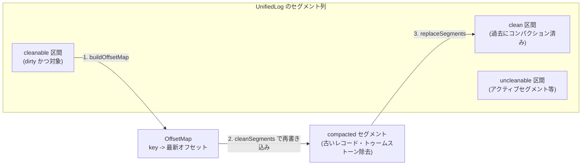
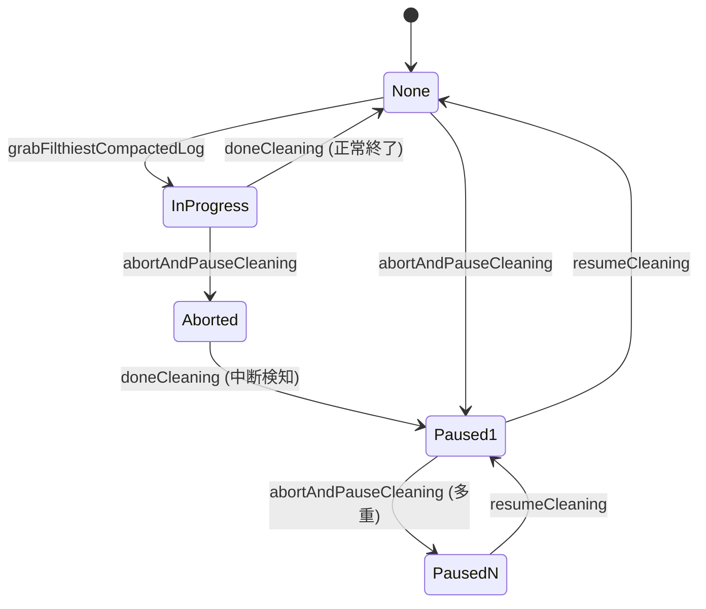

# 第11章 LogCleaner によるコンパクション

> **本章で読むソース**
>
> - [`storage/src/main/java/org/apache/kafka/storage/internals/log/LogCleaner.java`](https://github.com/apache/kafka/blob/4.3.1/storage/src/main/java/org/apache/kafka/storage/internals/log/LogCleaner.java)
> - [`storage/src/main/java/org/apache/kafka/storage/internals/log/Cleaner.java`](https://github.com/apache/kafka/blob/4.3.1/storage/src/main/java/org/apache/kafka/storage/internals/log/Cleaner.java)
> - [`storage/src/main/java/org/apache/kafka/storage/internals/log/OffsetMap.java`](https://github.com/apache/kafka/blob/4.3.1/storage/src/main/java/org/apache/kafka/storage/internals/log/OffsetMap.java)
> - [`storage/src/main/java/org/apache/kafka/storage/internals/log/SkimpyOffsetMap.java`](https://github.com/apache/kafka/blob/4.3.1/storage/src/main/java/org/apache/kafka/storage/internals/log/SkimpyOffsetMap.java)
> - [`storage/src/main/java/org/apache/kafka/storage/internals/log/LogCleanerManager.java`](https://github.com/apache/kafka/blob/4.3.1/storage/src/main/java/org/apache/kafka/storage/internals/log/LogCleanerManager.java)
> - [`storage/src/main/java/org/apache/kafka/storage/internals/log/LogToClean.java`](https://github.com/apache/kafka/blob/4.3.1/storage/src/main/java/org/apache/kafka/storage/internals/log/LogToClean.java)

## この章の狙い

第9章と第10章では、セグメント単位で追記されていくログと、それを保持期間に応じて丸ごと削除する仕組みを見た。
しかし `__consumer_offsets` のようなトピックでは、キーごとの最新値だけを残し、古い値は捨てたい。
本章では、この**コンパクション**（log compaction）を担う `LogCleaner` を読み、キーごとの最新オフセットをどう判定し、セグメントをどう再構成するかを説明する。

## 前提

**コンパクション**は、トピックの `cleanup.policy=compact` が設定されたパーティションに対して働く。
削除（delete）retention がオフセットや経過時間でセグメントを丸ごと消すのに対し、コンパクションはレコードの**キー**単位で「同じキーの中で一番新しいオフセットだけを残す」処理である。
値が `null` のレコードは**トゥームストーン**（削除マーカー）として扱われ、キーの削除を表す。

ログは論理的に2つの区間に分かれる。
過去にコンパクション済みの**clean 区間**と、まだコンパクションしていない**dirty 区間**である。
dirty 区間はさらに、今回のコンパクション対象である**cleanable 区間**と、対象外の**uncleanable 区間**に分かれる。
アクティブセグメント（書き込み中のセグメント）は常に uncleanable であり、`min.compaction.lag.ms` を設定していれば、その猶予期間内のセグメントも uncleanable になる。



## コンパクションを回すスレッド

コンパクションは `LogCleaner` が起動する複数のバックグラウンドスレッド `CleanerThread` によって実行される。
`LogCleaner` はブローカーごとに1つ存在し、`config.numThreads` 本の `CleanerThread` を保持する。
各スレッドはそれぞれ専用の `Cleaner`（実際のクリーニングロジック）と `SkimpyOffsetMap`（キー→オフセットの索引）を持つ。

[`storage/.../LogCleaner.java L475-492`](https://github.com/apache/kafka/blob/4.3.1/storage/src/main/java/org/apache/kafka/storage/internals/log/LogCleaner.java#L475-L492)

```java
public CleanerThread(int threadId) throws NoSuchAlgorithmException {
    super("kafka-log-cleaner-thread-" + threadId, false);

    cleaner = new Cleaner(
            threadId,
            new SkimpyOffsetMap((int) Math.min(config.dedupeBufferSize / config.numThreads, Integer.MAX_VALUE), config.hashAlgorithm()),
            config.ioBufferSize / config.numThreads / 2,
            config.maxMessageSize,
            config.dedupeBufferLoadFactor,
            throttler,
            time,
            this::checkDone
    );

    if (config.dedupeBufferSize / config.numThreads > Integer.MAX_VALUE) {
        logger.warn("Cannot use more than 2G of cleaner buffer space per cleaner thread, ignoring excess buffer space...");
    }
}
```

`config.dedupeBufferSize`（`log.cleaner.dedupe.buffer.size`）で指定された総メモリ量をスレッド数で割り、各スレッドの `SkimpyOffsetMap` に割り当てる。
つまりコンパクション用メモリはスレッドをまたいで固定量に抑えられており、パーティション数やキー数がいくら増えても、この上限を超えて確保されることはない。

各スレッドのメインループは単純である。

[`storage/.../LogCleaner.java L511-523`](https://github.com/apache/kafka/blob/4.3.1/storage/src/main/java/org/apache/kafka/storage/internals/log/LogCleaner.java#L511-L523)

```java
@Override
public void doWork() {
    boolean cleaned = tryCleanFilthiestLog();
    if (!cleaned) {
        try {
            pause(config.backoffMs, TimeUnit.MILLISECONDS);
        } catch (InterruptedException e) {
            throw new RuntimeException(e);
        }
    }

    cleanerManager.maintainUncleanablePartitions();
}
```

`tryCleanFilthiestLog` が1回のコンパクション対象を選び、クリーニングできなければ `config.backoffMs`（`log.cleaner.backoff.ms`）だけスリープする。
`tryCleanFilthiestLog` は内部で `cleanFilthiestLog` を呼び、失敗時には対象パーティションを**uncleanable**（クリーニング対象外）としてマークし、次回以降のスキャンから除外する。

[`storage/.../LogCleaner.java L553-590`](https://github.com/apache/kafka/blob/4.3.1/storage/src/main/java/org/apache/kafka/storage/internals/log/LogCleaner.java#L553-L590)

```java
private boolean cleanFilthiestLog() throws LogCleaningException {
    PreCleanStats preCleanStats = new PreCleanStats();
    Optional<LogToClean> ltc = cleanerManager.grabFilthiestCompactedLog(time, preCleanStats);
    boolean cleaned;

    if (ltc.isEmpty()) {
        cleaned = false;
    } else {
        // there's a log, clean it
        this.lastPreCleanStats = preCleanStats;
        LogToClean cleanable = ltc.get();
        try {
            cleanLog(cleanable);
            cleaned = true;
        } catch (ThreadShutdownException e) {
            throw e;
        } catch (Exception e) {
            throw new LogCleaningException(cleanable.log(), e.getMessage(), e);
        }
    }

    Map<TopicPartition, UnifiedLog> deletable = cleanerManager.deletableLogs();
    try {
        deletable.forEach((topicPartition, log) -> {
            try {
                log.deleteOldSegments();
            } catch (ThreadShutdownException e) {
                throw e;
            } catch (Exception e) {
                throw new LogCleaningException(log, e.getMessage(), e);
            }
        });
    } finally {
        cleanerManager.doneDeleting(deletable.keySet().stream().toList());
    }

    return cleaned;
}
```

`cleanFilthiestLog` は1回の呼び出しでコンパクション対象を1つ選ぶだけでなく、削除対象になった保持期限切れセグメントの削除もあわせて行う。
コンパクションと削除は別々の設定軸だが、同じスレッドループでまとめて処理される。

## dirtiest ログの選定

`grabFilthiestCompactedLog` は、`cleanup.policy=compact` を持つすべてのパーティションから、コンパクションを最も必要としている1件を選ぶ。

[`storage/.../LogCleanerManager.java L240-298`](https://github.com/apache/kafka/blob/4.3.1/storage/src/main/java/org/apache/kafka/storage/internals/log/LogCleanerManager.java#L240-L298)

```java
public Optional<LogToClean> grabFilthiestCompactedLog(Time time, PreCleanStats preCleanStats) {
    return inLock(lock, () -> {
        long now = time.milliseconds();
        timeOfLastRun = now;
        Map<TopicPartition, Long> lastClean = allCleanerCheckpoints();

        List<LogToClean> dirtyLogs = logs.entrySet().stream()
                .filter(entry -> entry.getValue().config().compact &&
                        !inProgress.containsKey(entry.getKey()) &&
                        !isUncleanablePartition(entry.getValue(), entry.getKey())
                )
                .map(entry -> {
                            // create a LogToClean instance for each
                            TopicPartition topicPartition = entry.getKey();
                            UnifiedLog log = entry.getValue();
                            try {
                                Long lastCleanOffset = lastClean.get(topicPartition);
                                OffsetsToClean offsetsToClean = cleanableOffsets(log, Optional.ofNullable(lastCleanOffset), now);
                                // update checkpoint for logs with invalid checkpointed offsets
                                if (offsetsToClean.forceUpdateCheckpoint) {
                                    updateCheckpoints(log.parentDirFile(), Optional.of(Map.entry(topicPartition, offsetsToClean.firstDirtyOffset)), Optional.empty());
                                }
                                long compactionDelayMs = maxCompactionDelay(log, offsetsToClean.firstDirtyOffset, now);
                                preCleanStats.updateMaxCompactionDelay(compactionDelayMs);

                                return new LogToClean(log, offsetsToClean.firstDirtyOffset,
                                        offsetsToClean.firstUncleanableDirtyOffset, compactionDelayMs > 0);
                            } catch (Throwable e) {
                                throw new LogCleaningException(log, "Failed to calculate log cleaning stats for partition " + topicPartition, e);
                            }
                        }
                )
                .filter(ltc -> ltc.totalBytes() > 0) // skip any empty logs
                .toList();

        dirtiestLogCleanableRatio = dirtyLogs.isEmpty()
                ? 0
                : dirtyLogs.stream()
                    .mapToDouble(LogToClean::cleanableRatio)
                    .max()
                    .orElse(0.0);
        // and must meet the minimum threshold for dirty byte ratio or have some bytes required to be compacted
        List<LogToClean> cleanableLogs = dirtyLogs.stream()
                .filter(ltc -> (ltc.needCompactionNow() && ltc.cleanableBytes() > 0) || ltc.cleanableRatio() > ltc.log().config().minCleanableRatio)
                .toList();

        if (cleanableLogs.isEmpty()) {
            return Optional.empty();
        } else {
            preCleanStats.recordCleanablePartitions(cleanableLogs.size());
            LogToClean filthiest = cleanableLogs.stream()
                    .max(Comparator.comparingDouble(LogToClean::cleanableRatio))
                    .orElseThrow(() -> new IllegalStateException("No filthiest log found"));

            inProgress.put(filthiest.topicPartition(), LogCleaningState.LOG_CLEANING_IN_PROGRESS);
            return Optional.of(filthiest);
        }
    });
}
```

`LogToClean` の `cleanableRatio` は「dirty 区間の cleanable バイト数 ÷ ログの総バイト数」であり、`config.minCleanableRatio`（`min.cleanable.dirty.ratio`）を超えたログだけが候補になる。
そのうえで候補の中から `cleanableRatio` が最大の1件、つまり最も dirty な（filthiest な）パーティションを選ぶ。

このスケジューリングは、ブローカー内の複数パーティションを平等に順番へ回すのではなく、**汚れが最もたまっているパーティションを優先**する。
コンパクション未実施のまま放置されるパーティションが、圧縮率や領域回収の面で最も損をしているパーティションであるため、そこから先に手当てすることで、限られたクリーナースレッド数のもとでも全体のディスク使用量とキー数の増大を抑えやすい。
選ばれたパーティションは `inProgress` に `LOG_CLEANING_IN_PROGRESS` として登録され、他のスレッドが同時に同じパーティションを掴まないようにする。

## SkimpyOffsetMap によるキー索引の構築

コンパクションの核心は、dirty 区間から「キーごとの最新オフセット」を求める `OffsetMap` の構築である。
`OffsetMap` はインターフェースであり、実装は `SkimpyOffsetMap` の1つだけである。

[`storage/.../OffsetMap.java L22-33`](https://github.com/apache/kafka/blob/4.3.1/storage/src/main/java/org/apache/kafka/storage/internals/log/OffsetMap.java#L22-L33)

```java
public interface OffsetMap {
    int slots();
    void put(ByteBuffer key, long offset) throws DigestException;
    long get(ByteBuffer key) throws DigestException;
    void updateLatestOffset(long offset);
    void clear();
    int size();
    long latestOffset();
    default double utilization() {
        return size() / (double) slots();
    }
}
```

`SkimpyOffsetMap` は、キーそのものではなく**キーのハッシュ値**をエントリとして保持する。

[`storage/.../SkimpyOffsetMap.java L28-37`](https://github.com/apache/kafka/blob/4.3.1/storage/src/main/java/org/apache/kafka/storage/internals/log/SkimpyOffsetMap.java#L28-L37)

```java
/**
 * A hash table used for de-duplicating the log. This hash table uses a cryptographically secure hash of the key as a proxy for the key
 * for comparisons and to save space on object overhead. Collisions are resolved by probing. This hash table does not support deletes.
 */
public class SkimpyOffsetMap implements OffsetMap {

    /**
     * The number of bytes of space each entry uses (the number of bytes in the hash plus an 8 byte offset)
     */
    public final int bytesPerEntry;
```

コンストラクタは、与えられたメモリ量 `memory` を1エントリあたりのバイト数（ハッシュ値のバイト数 + オフセット8バイト）で割り、格納できるスロット数 `slots` を決める。

[`storage/.../SkimpyOffsetMap.java L77-88`](https://github.com/apache/kafka/blob/4.3.1/storage/src/main/java/org/apache/kafka/storage/internals/log/SkimpyOffsetMap.java#L77-L88)

```java
public SkimpyOffsetMap(int memory, String hashAlgorithm) throws NoSuchAlgorithmException {
    this.bytes = ByteBuffer.allocate(memory);

    this.digest = MessageDigest.getInstance(hashAlgorithm);

    this.hashSize = digest.getDigestLength();
    this.bytesPerEntry = hashSize + 8;
    this.slots = memory / bytesPerEntry;

    this.hash1 = new byte[hashSize];
    this.hash2 = new byte[hashSize];
}
```

キーを丸ごと保持するハッシュマップと異なり、`SkimpyOffsetMap` はキーの実体（可変長のバイト列）をエントリに持たない。
固定長のハッシュ値と8バイトのオフセットだけを並べた `ByteBuffer` 一枚で全エントリを表現するため、キー長やキー数がどれだけ増えても1エントリのサイズは変わらず、必要なメモリ量を `slots × bytesPerEntry` として事前に見積もれる。
これが本章で扱う**最適化**であり、コンパクション対象が数百万キーに及ぶトピックでも、`log.cleaner.dedupe.buffer.size` で指定した固定サイズのバッファだけでキー索引を構築できる理由である。

ハッシュ値の衝突は**オープンアドレス法**（probing）で解決する。

[`storage/.../SkimpyOffsetMap.java L126-156`](https://github.com/apache/kafka/blob/4.3.1/storage/src/main/java/org/apache/kafka/storage/internals/log/SkimpyOffsetMap.java#L126-L156)

```java
@Override
public void put(ByteBuffer key, long offset) throws DigestException {
    if (entries >= slots)
        throw new IllegalArgumentException("Attempted to add a new entry to a full offset map, "
            + "entries: " + entries + ", slots: " + slots);

    hashInto(key, hash1);

    // probe until we find the first empty slot
    int attempt = 0;
    int pos = positionOf(hash1, attempt);
    while (!isEmpty(pos)) {
        bytes.position(pos);
        bytes.get(hash2);
        if (Arrays.equals(hash1, hash2)) {
            // we found an existing entry, overwrite it and return (size does not change)
            bytes.putLong(offset);
            lastOffset = offset;
            return;
        }
        ++attempt;
        pos = positionOf(hash1, attempt);
    }

    // found an empty slot, update it - size grows by 1
    bytes.position(pos);
    bytes.put(hash1);
    bytes.putLong(offset);
    lastOffset = offset;
    ++entries;
}
```

同じキー（同じハッシュ値）が既にあれば、そのスロットのオフセットを新しい値で上書きするだけでよい。
dirty 区間を先頭から順に読みながら `put` を呼んでいけば、同じキーが複数回現れても、最後に呼ばれた `put` のオフセットだけが残る。
つまり `SkimpyOffsetMap` に読み終えた時点で、各キーには dirty 区間内で最も大きいオフセット（最新の書き込み）だけが記録されている。

`get` も同じ探索順序でスロットを辿り、ハッシュ値が一致するスロットのオフセットを返す。

[`storage/.../SkimpyOffsetMap.java L100-119`](https://github.com/apache/kafka/blob/4.3.1/storage/src/main/java/org/apache/kafka/storage/internals/log/SkimpyOffsetMap.java#L100-L119)

```java
@Override
public long get(ByteBuffer key) throws DigestException {
    hashInto(key, hash1);
    // search for the hash of this key by repeated probing until we find the hash we are looking for or we find an empty slot
    int attempt = 0;
    //we need to guard against attempt integer overflow if the map is full
    //limit attempt to number of slots once positionOf(..) enters linear search mode
    int maxAttempts = slots + hashSize - 4;
    do {
        if (attempt >= maxAttempts)
            return -1L;
        int pos = positionOf(hash1, attempt);
        bytes.position(pos);
        if (isEmpty(pos))
            return -1L;
        bytes.get(hash2);
        ++attempt;
    } while (!Arrays.equals(hash1, hash2));
    return bytes.getLong();
}
```

ハッシュ値を鍵の代理として使う以上、異なるキーが同じハッシュ値に写る**衝突**は原理的に起こりうる。
衝突したキーは互いを別キーとして区別できず、片方の更新がもう片方の削除判定に影響しかねない。
これを実用上無視できる確率に抑えるため、`SkimpyOffsetMap` はデフォルトで MD5 のような暗号学的ハッシュ関数を使う。

## dirty 区間の走査と索引構築

`Cleaner.buildOffsetMap` は、対象パーティションの dirty 区間に含まれるセグメントを順に読み、`OffsetMap` へキーを詰めていく。

[`storage/.../Cleaner.java L635-681`](https://github.com/apache/kafka/blob/4.3.1/storage/src/main/java/org/apache/kafka/storage/internals/log/Cleaner.java#L635-L681)

```java
public void buildOffsetMap(UnifiedLog log,
                           long start,
                           long end,
                           OffsetMap map,
                           CleanerStats stats) throws IOException, DigestException {
    map.clear();
    List<LogSegment> dirty = log.logSegments(start, end);
    List<Long> nextSegmentStartOffsets = new ArrayList<>();
    if (!dirty.isEmpty()) {
        for (int i = 1; i < dirty.size(); i++) {
            nextSegmentStartOffsets.add(dirty.get(i).baseOffset());
        }
        nextSegmentStartOffsets.add(end);
    }
    logger.info("Building offset map for log {} for {} segments in offset range [{}, {}).", log.name(), dirty.size(), start, end);

    CleanedTransactionMetadata transactionMetadata = new CleanedTransactionMetadata();
    List<AbortedTxn> abortedTransactions = log.collectAbortedTransactions(start, end);
    transactionMetadata.addAbortedTransactions(abortedTransactions);

    // Add all the cleanable dirty segments. We must take at least map.slots * load_factor,
    // but we may be able to fit more (if there is lots of duplication in the dirty section of the log)
    boolean full = false;
    for (int i = 0; i < dirty.size() && !full; i++) {
        LogSegment segment = dirty.get(i);
        long nextSegmentStartOffset = nextSegmentStartOffsets.get(i);

        checkDone.accept(log.topicPartition());

        full = buildOffsetMapForSegment(
                log.topicPartition(),
                segment,
                map,
                start,
                nextSegmentStartOffset,
                log.config().maxMessageSize(),
                transactionMetadata,
                stats
        );
        if (full) {
            logger.debug("Offset map is full, {} segments fully mapped, segment with base offset {} is partially mapped",
                    dirty.indexOf(segment), segment.baseOffset());
        }
    }

    logger.info("Offset map for log {} complete.", log.name());
}
```

`start` は前回のコンパクションで到達済みの `firstDirtyOffset`、`end` はアクティブセグメントなどを除いた `firstUncleanableOffset` である。
`SkimpyOffsetMap` の容量には上限があるため、dirty 区間のキー数が容量（`slots × dupBufferLoadFactor`）を超えると、そこで索引構築を打ち切り、`full` を返して以降のセグメントを次回以降のコンパクションに回す。

実際にキーをマップへ入れる処理は `buildOffsetMapForSegment` にある。

[`storage/.../Cleaner.java L730-748`](https://github.com/apache/kafka/blob/4.3.1/storage/src/main/java/org/apache/kafka/storage/internals/log/Cleaner.java#L730-L748)

```java
try (CloseableIterator<Record> recordsIterator = batch.streamingIterator(decompressionBufferSupplier)) {
    for (Record record : (Iterable<Record>) () -> recordsIterator) {
        if (record.hasKey() && record.offset() >= startOffset) {
            if (map.size() < maxDesiredMapSize) {
                map.put(record.key(), record.offset());
            } else {
                return true;
            }
        }
        stats.indexMessagesRead(1);
    }
}

if (batch.lastOffset() >= startOffset)
    map.updateLatestOffset(batch.lastOffset());
```

セグメントをオフセット順に読み進めるので、同じキーに対する `put` は必ずオフセットの小さい順に呼ばれる。
`SkimpyOffsetMap.put` は既存エントリを新しい値で上書きするだけだったから、この走査順序こそが「最後に上書きされた値、つまり最新オフセットだけが残る」という結果を成立させている。

## セグメントの再書き込み

索引が完成すると、`Cleaner.doClean` はグループ化したセグメントを1つずつ `cleanSegments` へ渡し、新しいセグメントへレコードを再書き込みする。

[`storage/.../Cleaner.java L138-189`](https://github.com/apache/kafka/blob/4.3.1/storage/src/main/java/org/apache/kafka/storage/internals/log/Cleaner.java#L138-L189)

```java
public Map.Entry<Long, CleanerStats> doClean(LogToClean cleanable, long currentTime) throws IOException, DigestException {
    UnifiedLog log = cleanable.log();

    logger.info("Beginning cleaning of log {}", log.name());

    // figure out the timestamp below which it is safe to remove delete tombstones
    // this position is defined to be a configurable time beneath the last modified time of the last clean segment
    // this timestamp is only used on the older message formats older than MAGIC_VALUE_V2
    List<LogSegment> segments = log.logSegments(0, cleanable.firstDirtyOffset());
    long legacyDeleteHorizonMs = segments.isEmpty()
            ? 0L
            : segments.get(segments.size() - 1).lastModified() - log.config().deleteRetentionMs;

    CleanerStats stats = new CleanerStats(Time.SYSTEM);

    // build the offset map
    logger.info("Building offset map for {}...", log.name());
    long upperBoundOffset = cleanable.firstUncleanableOffset();
    buildOffsetMap(log, cleanable.firstDirtyOffset(), upperBoundOffset, offsetMap, stats);
    long endOffset = offsetMap.latestOffset() + 1;
    stats.indexDone();

    // determine the timestamp up to which the log will be cleaned
    // this is the lower of the last active segment and the compaction lag
    segments = log.logSegments(0, cleanable.firstUncleanableOffset());
    long cleanableHorizonMs = segments.isEmpty()
            ? 0L
            : segments.get(segments.size() - 1).lastModified();

    // group the segments and clean the groups
    logger.info("Cleaning log {} (cleaning prior to {}, discarding tombstones prior to upper bound deletion horizon {})...",
            log.name(), new Date(cleanableHorizonMs), new Date(legacyDeleteHorizonMs));
    CleanedTransactionMetadata transactionMetadata = new CleanedTransactionMetadata();

    List<List<LogSegment>> groupedSegments = groupSegmentsBySize(
            log.logSegments(0, endOffset),
            log.config().segmentSize(),
            log.config().maxIndexSize,
            cleanable.firstUncleanableOffset()
    );

    for (List<LogSegment> group : groupedSegments) {
        cleanSegments(log, group, offsetMap, currentTime, stats, transactionMetadata, legacyDeleteHorizonMs, upperBoundOffset);
    }

    // record buffer utilization
    stats.bufferUtilization = offsetMap.utilization();

    stats.allDone();

    return Map.entry(endOffset, stats);
}
```

`groupSegmentsBySize` は複数の小さなセグメントを1つの出力セグメントにまとめる。
コンパクションのたびに古いレコードが除去されて各セグメントが小さくなっていくと、セグメント数だけが際限なく増えてしまう。
出力先のログサイズとインデックスサイズが元の上限に収まる範囲でセグメントを束ねることで、この「セグメントの縮小と増殖」を防いでいる。

各レコードを残すかどうかは `shouldRetainRecord` が判定する。

[`storage/.../Cleaner.java L492-527`](https://github.com/apache/kafka/blob/4.3.1/storage/src/main/java/org/apache/kafka/storage/internals/log/Cleaner.java#L492-L527)

```java
private boolean shouldRetainRecord(OffsetMap map,
                                   boolean retainDeletesForLegacyRecords,
                                   RecordBatch batch,
                                   Record record,
                                   CleanerStats stats,
                                   long currentTime) throws DigestException {
    boolean pastLatestOffset = record.offset() > map.latestOffset();
    if (pastLatestOffset) {
        return true;
    }

    if (record.hasKey()) {
        ByteBuffer key = record.key();
        long foundOffset = map.get(key);
        /* First,the message must have the latest offset for the key
         * then there are two cases in which we can retain a message:
         *   1) The message has value
         *   2) The message doesn't have value but it can't be deleted now.
         */
        boolean latestOffsetForKey = record.offset() >= foundOffset;
        boolean legacyRecord = batch.magic() < RecordBatch.MAGIC_VALUE_V2;

        boolean shouldRetainDeletes;
        if (!legacyRecord) {
            shouldRetainDeletes = batch.deleteHorizonMs().isEmpty() || currentTime < batch.deleteHorizonMs().getAsLong();
        } else {
            shouldRetainDeletes = retainDeletesForLegacyRecords;
        }

        boolean isRetainedValue = record.hasValue() || shouldRetainDeletes;
        return latestOffsetForKey && isRetainedValue;
    } else {
        stats.invalidMessage();
        return false;
    }
}
```

`map.get(key)` で得た「そのキーの dirty 区間内での最新オフセット」より小さいオフセットのレコードは古い値であり破棄される。
`record.offset() >= foundOffset` を満たすレコード、つまり索引に記録された最新オフセットそのものだけが生き残る。
トゥームストーン（値が `null` のレコード）であっても、削除猶予時間（`deleteHorizonMs`）を過ぎるまでは残され、猶予後に破棄される。
これは、コンシューマーが削除より前のオフセットからログを読んでいる場合に、削除の事実そのものを取りこぼさないための猶予である。

再書き込みが終わった新セグメントは、`UnifiedLog.replaceSegments` によって元のセグメント群と入れ替わる（[`Cleaner.java L275-277`](https://github.com/apache/kafka/blob/4.3.1/storage/src/main/java/org/apache/kafka/storage/internals/log/Cleaner.java#L275-L277)）。
この入れ替えが完了するまで、読み取り側は元のセグメントを参照し続けるため、コンパクション中もパーティションへの読み書きは止まらない。

## 状態管理とチェックポイント

コンパクションの完了状況は、ログディレクトリごとに置かれる **`cleaner-offset-checkpoint`** ファイルへパーティション単位で記録される。

[`storage/.../LogCleanerManager.java L66-67`](https://github.com/apache/kafka/blob/4.3.1/storage/src/main/java/org/apache/kafka/storage/internals/log/LogCleanerManager.java#L66-L67)

```java
public class LogCleanerManager {
    public static final String OFFSET_CHECKPOINT_FILE = "cleaner-offset-checkpoint";
```

クリーニングが正常に終わると `doneCleaning` が呼ばれ、到達したオフセットをチェックポイントに書き込んだうえで、パーティションを進行中集合から外す。

[`storage/.../LogCleanerManager.java L573-591`](https://github.com/apache/kafka/blob/4.3.1/storage/src/main/java/org/apache/kafka/storage/internals/log/LogCleanerManager.java#L573-L591)

```java
public void doneCleaning(TopicPartition topicPartition, File dataDir, long endOffset) {
    inLock(lock, () -> {
        LogCleaningState state = inProgress.get(topicPartition);

        if (state == null) {
            throw new IllegalStateException("State for partition " + topicPartition + " should exist.");
        } else if (state == LogCleaningState.LOG_CLEANING_IN_PROGRESS) {
            updateCheckpoints(dataDir, Optional.of(Map.entry(topicPartition, endOffset)), Optional.empty());
            inProgress.remove(topicPartition);
        } else if (state == LogCleaningState.LOG_CLEANING_ABORTED) {
            inProgress.put(topicPartition, LogCleaningState.logCleaningPaused(1));
            pausedCleaningCond.signalAll();
        } else {
            throw new IllegalStateException("In-progress partition " + topicPartition + " cannot be in " + state + " state.");
        }

        return null;
    });
}
```

チェックポイントに記録されたオフセットは、次回の `grabFilthiestCompactedLog` で `firstDirtyOffset` の起点として使われる（`allCleanerCheckpoints` で読み出す）。
ブローカーが再起動しても、このファイルがある限り、コンパクション済みの範囲を最初からやり直す必要はない。

各パーティションは `LogCleaningState` によって、未処理（状態なし）、進行中（`LOG_CLEANING_IN_PROGRESS`）、中断要求中（`LOG_CLEANING_ABORTED`）、一時停止中（`LogCleaningPaused`）のいずれかの状態を持つ。
`abortAndPauseCleaning` は進行中のクリーニングに中断を要求し、クリーナースレッドが `checkCleaningAborted` でその状態を検知して例外を投げるまで待つ。
セグメント入れ替えの直前に別スレッドがパーティションを削除・移動しようとしても、この状態遷移によって「クリーニング中のセグメントをいきなり消す」事故を避けられる。



クリーニング中に予期しない例外が発生した場合は、`markPartitionUncleanable` によってそのパーティションが恒久的にクリーニング対象から除外される。
これにより、1パーティションの異常が他パーティションのコンパクション進行を止めることはない。

## まとめ

`LogCleaner` は、`cleanup.policy=compact` なパーティションのうち最も dirty な1件を優先して選び、`CleanerThread` に割り当てる。
`Cleaner` は dirty 区間を走査して `SkimpyOffsetMap` にキー→最新オフセットの索引を作り、その索引をもとにセグメントを再書き込みして古いレコードとトゥームストーンを除く。
`SkimpyOffsetMap` はキーそのものではなくハッシュ値だけを固定長で保持するため、コンパクション用メモリの上限を保ったまま大量のキーを索引できる。
コンパクションの進捗は `cleaner-offset-checkpoint` に記録され、`LogCleanerManager` の状態遷移がクリーニング中のセグメント操作と他の操作（削除・ディレクトリ移動）の競合を防ぐ。

## 関連する章

- [第9章 UnifiedLog](09-unifiedlog.md)：セグメント列とログの読み書きの基盤。
- [第10章 LogManager](10-logmanager.md)：セグメントの保持期間による削除と、コンパクションとの役割分担。
- [第21章 GroupCoordinator](../part06-consumer/21-group-coordinator.md)：`__consumer_offsets` トピックがコンパクションによってキー（グループとパーティションの組）ごとの最新オフセットだけを保持する例。
