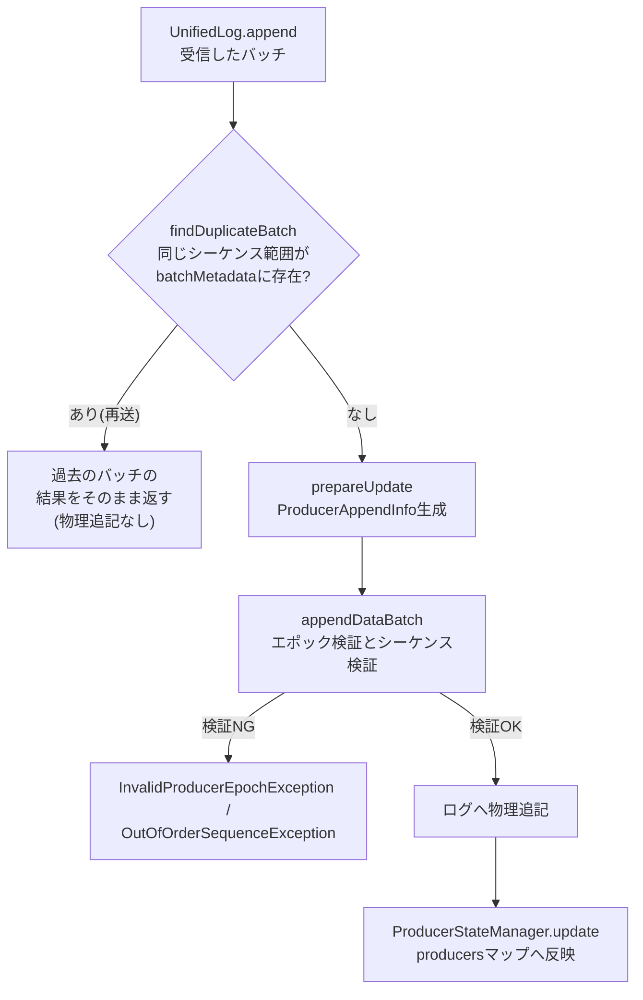

# 第12章 ProducerStateManager と冪等プロデューサーのトランザクション状態

> **本章で読むソース**
>
> - [`storage/src/main/java/org/apache/kafka/storage/internals/log/ProducerStateManager.java`](https://github.com/apache/kafka/blob/4.3.1/storage/src/main/java/org/apache/kafka/storage/internals/log/ProducerStateManager.java)
> - [`storage/src/main/java/org/apache/kafka/storage/internals/log/ProducerStateEntry.java`](https://github.com/apache/kafka/blob/4.3.1/storage/src/main/java/org/apache/kafka/storage/internals/log/ProducerStateEntry.java)
> - [`storage/src/main/java/org/apache/kafka/storage/internals/log/ProducerAppendInfo.java`](https://github.com/apache/kafka/blob/4.3.1/storage/src/main/java/org/apache/kafka/storage/internals/log/ProducerAppendInfo.java)
> - [`storage/src/main/java/org/apache/kafka/storage/internals/log/UnifiedLog.java`](https://github.com/apache/kafka/blob/4.3.1/storage/src/main/java/org/apache/kafka/storage/internals/log/UnifiedLog.java)

## この章の狙い

第6章では、プロデューサー側が`TransactionManager`でproducerIdとシーケンス番号を採番し、送信するバッチに埋め込むところまでを見た。
プロデューサーが同じバッチを再送しても、ブローカーが重複を検出できなければ**冪等プロデューサー**は成立しない。
本章では、ブローカー側でその検証を担う`ProducerStateManager`を読み、producerIdごとの状態がどう保持され、追記のたびにどう検証されるかを追う。

## 前提

冪等プロデューサーは、送信するバッチに`producerId`と`producerEpoch`、そしてバッチ先頭の**シーケンス番号**を付与する。
ブローカーは、あるproducerIdについて直前に受理したシーケンス番号を覚えておき、次に届いたバッチの先頭シーケンス番号がその続きになっているかを照合する。
連続していれば新規の書き込みとして受理し、直前と同じ範囲であれば再送とみなして重複を退ける。
この検証を1パーティションあたりで担うのが`ProducerStateManager`であり、`UnifiedLog`はパーティションごとに1つのインスタンスを保持する。

トランザクションを使う場合は、これに加えて未確定のオフセット範囲を追跡する必要がある。
トランザクションの開始から`COMMIT`または`ABORT`のマーカーが書き込まれるまでの区間は、コンシューマーに読ませてはならない。
`ProducerStateManager`は、この未確定区間の先頭オフセットも同じ状態の一部として管理する。

## producers マップとProducerStateEntry

`ProducerStateManager`は、producerIdをキーに`ProducerStateEntry`を保持するマップを中心的なデータ構造として持つ。

[`storage/src/main/java/org/apache/kafka/storage/internals/log/ProducerStateManager.java L85-L107`](https://github.com/apache/kafka/blob/4.3.1/storage/src/main/java/org/apache/kafka/storage/internals/log/ProducerStateManager.java#L85-L107)

```java
    private final Map<Long, ProducerStateEntry> producers = new HashMap<>();

    private final Map<Long, VerificationStateEntry> verificationStates = new HashMap<>();

    // ongoing transactions sorted by the first offset of the transaction
    private final TreeMap<Long, TxnMetadata> ongoingTxns = new TreeMap<>();

    // completed transactions whose markers are at offsets above the high watermark
    private final TreeMap<Long, TxnMetadata> unreplicatedTxns = new TreeMap<>();

    private volatile File logDir;

    // The same as producers.size, but for lock-free access.
    private volatile int producerIdCount = 0;

    // Keep track of the last timestamp from the oldest transaction. This is used
    // to detect (approximately) when a transaction has been left hanging on a partition.
    // We make the field volatile so that it can be safely accessed without a lock.
    private volatile long oldestTxnLastTimestamp = -1L;
```

`producers`が本体であり、`ongoingTxns`は開始済みでまだ完了していないトランザクション、`unreplicatedTxns`は完了はしたがマーカーがまだHigh Watermarkより先にあるトランザクションを、それぞれ開始オフセット順の`TreeMap`で持つ。
コメントのとおり`producerIdCount`と`oldestTxnLastTimestamp`は`volatile`であり、ロックなしで読める形にしてある。
これらはメトリクス収集など、状態変更と厳密に同期しなくてもよい経路から参照される値である。

`ProducerStateEntry`は1つのproducerIdについて、直近のエポックと、直近数バッチ分のメタデータを保持する。

[`storage/src/main/java/org/apache/kafka/storage/internals/log/ProducerStateEntry.java L34-L37`](https://github.com/apache/kafka/blob/4.3.1/storage/src/main/java/org/apache/kafka/storage/internals/log/ProducerStateEntry.java#L34-L37)

```java
public class ProducerStateEntry {
    public static final int NUM_BATCHES_TO_RETAIN = 5;
    private final long producerId;
    private final Deque<BatchMetadata> batchMetadata = new ArrayDeque<>();
```

`batchMetadata`は先頭シーケンスが最も低いバッチが先頭に、最も高いバッチが末尾になるように並んだ`Deque`である。
`NUM_BATCHES_TO_RETAIN`（5件）を超えると先頭から捨てられる。

[`storage/src/main/java/org/apache/kafka/storage/internals/log/ProducerStateEntry.java L101-L104`](https://github.com/apache/kafka/blob/4.3.1/storage/src/main/java/org/apache/kafka/storage/internals/log/ProducerStateEntry.java#L101-L104)

```java
    private void addBatchMetadata(BatchMetadata batch) {
        if (batchMetadata.size() == ProducerStateEntry.NUM_BATCHES_TO_RETAIN) batchMetadata.removeFirst();
        batchMetadata.add(batch);
    }
```

直近1バッチだけでなく複数バッチを保持するのは、再送がネットワーク遅延によって数バッチ分さかのぼって届く場合があるためであり、`findDuplicateBatch`（後述）で過去のバッチとの照合に使われる。
保持件数を固定5件にしていることで、producerIdが有効である限りメモリ使用量が一定に収まる。

## prepareUpdate から append までの検証フロー

追記の検証は、`ProducerStateManager`が直接行うのではなく、`prepareUpdate`が返す`ProducerAppendInfo`という一時オブジェクトに委譲される。

[`storage/src/main/java/org/apache/kafka/storage/internals/log/ProducerStateManager.java L376-L379`](https://github.com/apache/kafka/blob/4.3.1/storage/src/main/java/org/apache/kafka/storage/internals/log/ProducerStateManager.java#L376-L379)

```java
    public ProducerAppendInfo prepareUpdate(long producerId, AppendOrigin origin) {
        ProducerStateEntry currentEntry = lastEntry(producerId).orElse(ProducerStateEntry.empty(producerId));
        return new ProducerAppendInfo(topicPartition, producerId, currentEntry, origin, verificationStateEntry(producerId));
    }
```

`currentEntry`は、そのproducerIdについて現在確定している状態であり、初めて見るproducerIdであれば空の`ProducerStateEntry`が渡される。
`ProducerAppendInfo`は、この`currentEntry`をコピーした`updatedEntry`を内部に持ち、以降の検証と更新はすべて`updatedEntry`に対して行う。

[`storage/src/main/java/org/apache/kafka/storage/internals/log/ProducerAppendInfo.java L73-L85`](https://github.com/apache/kafka/blob/4.3.1/storage/src/main/java/org/apache/kafka/storage/internals/log/ProducerAppendInfo.java#L73-L85)

```java
    public ProducerAppendInfo(TopicPartition topicPartition,
                              long producerId,
                              ProducerStateEntry currentEntry,
                              AppendOrigin origin,
                              VerificationStateEntry verificationStateEntry) {
        this.topicPartition = topicPartition;
        this.producerId = producerId;
        this.currentEntry = currentEntry;
        this.origin = origin;
        this.verificationStateEntry = verificationStateEntry;

        updatedEntry = currentEntry.withProducerId(producerId);
    }
```

`currentEntry`を書き換えずに`updatedEntry`という別インスタンスへコピーしてから検証するのは、追記が途中で失敗した場合に元の状態を壊さないためである。
1つのログセグメントへの追記では複数バッチを続けて`append`することがあり、途中のバッチで例外が起きれば、`ProducerStateManager.update`が呼ばれる前の`currentEntry`はそのまま保たれる。

データバッチの検証は`appendDataBatch`が担う。

[`storage/src/main/java/org/apache/kafka/storage/internals/log/ProducerAppendInfo.java L223-L244`](https://github.com/apache/kafka/blob/4.3.1/storage/src/main/java/org/apache/kafka/storage/internals/log/ProducerAppendInfo.java#L223-L244)

```java
    public void appendDataBatch(short epoch,
                                int firstSeq,
                                int lastSeq,
                                long lastTimestamp,
                                LogOffsetMetadata firstOffsetMetadata,
                                long lastOffset,
                                boolean isTransactional) {
        long firstOffset = firstOffsetMetadata.messageOffset;
        maybeValidateDataBatch(epoch, firstSeq, firstOffset);
        updatedEntry.addBatch(epoch, lastSeq, lastOffset, (int) (lastOffset - firstOffset), lastTimestamp);

        OptionalLong currentTxnFirstOffset = updatedEntry.currentTxnFirstOffset();
        if (currentTxnFirstOffset.isPresent() && !isTransactional) {
            // Received a non-transactional message while a transaction is active
            throw new InvalidTxnStateException("Expected transactional write from producer " + producerId + " at " +
                    "offset " + firstOffsetMetadata + " in partition " + topicPartition);
        } else if (currentTxnFirstOffset.isEmpty() && isTransactional) {
            // Began a new transaction
            updatedEntry.setCurrentTxnFirstOffset(firstOffset);
            transactions.add(new TxnMetadata(producerId, firstOffsetMetadata));
        }
    }
```

`maybeValidateDataBatch`はエポックとシーケンス番号を検証したあとに`updatedEntry.addBatch`でバッチを反映する。
続く`if`文は、トランザクション状態と実際のバッチの整合性を見る部分である。
トランザクションが進行中なのに非トランザクションのメッセージが来れば`InvalidTxnStateException`、逆に進行中でないところへトランザクションのメッセージが来れば、それを新しいトランザクションの開始として`transactions`リストへ積む。

シーケンス番号の検証は`checkSequence`が行う。

[`storage/src/main/java/org/apache/kafka/storage/internals/log/ProducerAppendInfo.java L177-L193`](https://github.com/apache/kafka/blob/4.3.1/storage/src/main/java/org/apache/kafka/storage/internals/log/ProducerAppendInfo.java#L177-L193)

```java
            int currentLastSeq;
            if (!updatedEntry.isEmpty())
                currentLastSeq = updatedEntry.lastSeq();
            else if (producerEpoch == currentEntry.producerEpoch())
                currentLastSeq = currentEntry.lastSeq();
            else
                currentLastSeq = RecordBatch.NO_SEQUENCE;

            // If there is no current producer epoch (possibly because all producer records have been deleted due to
            // retention or the DeleteRecords API) accept writes with any sequence number
            if (!(currentEntry.producerEpoch() == RecordBatch.NO_PRODUCER_EPOCH || inSequence(currentLastSeq, appendFirstSeq))) {
                throw new OutOfOrderSequenceException("Out of order sequence number for producer " + producerId + " at " +
                        "offset " + appendFirstSeq + " (incoming seq. number), " + currentLastSeq + " (current end sequence number)");
            }
```

`inSequence`は、次のシーケンス番号が直前の続き（+1、あるいはオーバーフローして0に戻る場合）であることだけを見る単純な判定である。

[`storage/src/main/java/org/apache/kafka/storage/internals/log/ProducerAppendInfo.java L196-L198`](https://github.com/apache/kafka/blob/4.3.1/storage/src/main/java/org/apache/kafka/storage/internals/log/ProducerAppendInfo.java#L196-L198)

```java
    private boolean inSequence(int lastSeq, int nextSeq) {
        return nextSeq == lastSeq + 1L || (nextSeq == 0 && lastSeq == Integer.MAX_VALUE);
    }
```

続きになっていなければ`OutOfOrderSequenceException`を投げる。
プロデューサー側はこの例外を受けてリトライを打ち切り、あるいは呼び出し元にエラーを返す。

再送そのものの検出は、この`checkSequence`より手前、`UnifiedLog`が追記処理の中で`findDuplicateBatch`を呼ぶ経路で行われる。

[`storage/src/main/java/org/apache/kafka/storage/internals/log/ProducerStateEntry.java L128-L137`](https://github.com/apache/kafka/blob/4.3.1/storage/src/main/java/org/apache/kafka/storage/internals/log/ProducerStateEntry.java#L128-L137)

```java
    Optional<BatchMetadata> findDuplicateBatch(RecordBatch batch) {
        return batch.producerEpoch() != producerEpoch ? Optional.empty() : batchWithSequenceRange(batch.baseSequence(), batch.lastSequence());
    }

    // Return the batch metadata of the cached batch having the exact sequence range, if any.
    private Optional<BatchMetadata> batchWithSequenceRange(int firstSeq, int lastSeq) {
        return batchMetadata.stream()
            .filter(metadata -> firstSeq == metadata.firstSeq() && lastSeq == metadata.lastSeq())
            .findFirst();
    }
```

`batchMetadata`の保持件数を5件にしていた理由がここに表れる。
同じシーケンス範囲のバッチがすでに`batchMetadata`にあれば、それは新規の追記ではなく過去に成功した書き込みの再送であり、`UnifiedLog`はログへの物理的な追記を行わずに、その過去のバッチのオフセットを含む応答を組み立てて返す。
検証と重複排除の関係を図にすると次のようになる。



## トランザクションの進行とfirstUnstableOffset

トランザクションの終端は制御バッチとして書き込まれる`EndTransactionMarker`で表される。
`appendEndTxnMarker`はこのマーカーを検証し、対応する`CompletedTxn`を組み立てる。

[`storage/src/main/java/org/apache/kafka/storage/internals/log/ProducerAppendInfo.java L281-L290`](https://github.com/apache/kafka/blob/4.3.1/storage/src/main/java/org/apache/kafka/storage/internals/log/ProducerAppendInfo.java#L281-L290)

```java
        // Only emit the `CompletedTxn` for non-empty transactions. A transaction marker
        // without any associated data will not have any impact on the last stable offset
        // and would not need to be reflected in the transaction index.
        Optional<CompletedTxn> completedTxn = updatedEntry.currentTxnFirstOffset().isPresent() ?
                Optional.of(new CompletedTxn(producerId, updatedEntry.currentTxnFirstOffset().getAsLong(), offset,
                        endTxnMarker.controlType() == ControlRecordType.ABORT))
                : Optional.empty();
        updatedEntry.update(producerEpoch, endTxnMarker.coordinatorEpoch(), timestamp);
        return completedTxn;
```

`CompletedTxn`が生成されると、`UnifiedLog`は`ProducerStateManager.completeTxn`を呼ぶ。

[`storage/src/main/java/org/apache/kafka/storage/internals/log/ProducerStateManager.java L545-L554`](https://github.com/apache/kafka/blob/4.3.1/storage/src/main/java/org/apache/kafka/storage/internals/log/ProducerStateManager.java#L545-L554)

```java
    public void completeTxn(CompletedTxn completedTxn) {
        TxnMetadata txnMetadata = ongoingTxns.remove(completedTxn.firstOffset());
        if (txnMetadata == null)
            throw new IllegalArgumentException("Attempted to complete transaction " + completedTxn + " on partition "
                    + topicPartition + " which was not started");

        txnMetadata.lastOffset = OptionalLong.of(completedTxn.lastOffset());
        unreplicatedTxns.put(completedTxn.firstOffset(), txnMetadata);
        updateOldestTxnTimestamp();
    }
```

トランザクションは`ongoingTxns`から即座に消えるのではなく、`unreplicatedTxns`へ移される。
マーカー自体はまだ書き込まれたばかりで、フォロワーへのレプリケーションが完了し、High Watermarkがそのオフセットを超えるまでは、コンシューマーにとって安全に読める状態とは言えないからである。

この2段階の未確定状態は、`firstUnstableOffset`が両方の`TreeMap`を突き合わせて計算する。

[`storage/src/main/java/org/apache/kafka/storage/internals/log/ProducerStateManager.java L246-L258`](https://github.com/apache/kafka/blob/4.3.1/storage/src/main/java/org/apache/kafka/storage/internals/log/ProducerStateManager.java#L246-L258)

```java
    public Optional<LogOffsetMetadata> firstUnstableOffset() {
        Optional<LogOffsetMetadata> unreplicatedFirstOffset = Optional.ofNullable(unreplicatedTxns.firstEntry()).map(e -> e.getValue().firstOffset);
        Optional<LogOffsetMetadata> undecidedFirstOffset = Optional.ofNullable(ongoingTxns.firstEntry()).map(e -> e.getValue().firstOffset);

        if (unreplicatedFirstOffset.isEmpty())
            return undecidedFirstOffset;
        else if (undecidedFirstOffset.isEmpty())
            return unreplicatedFirstOffset;
        else if (undecidedFirstOffset.get().messageOffset < unreplicatedFirstOffset.get().messageOffset)
            return undecidedFirstOffset;
        else
            return unreplicatedFirstOffset;
    }
```

`ongoingTxns`はまだ`COMMIT`か`ABORT`かの決着がついていないトランザクション、`unreplicatedTxns`は決着済みだがレプリケーション未完了のトランザクションであり、両者のうち先頭オフセットが小さいほうがLast Stable Offset（LSO）となる。
`unreplicatedTxns`は`onHighWatermarkUpdated`経由でHigh Watermarkの更新のたびに刈り込まれる。

[`storage/src/main/java/org/apache/kafka/storage/internals/log/ProducerStateManager.java L497-L504`](https://github.com/apache/kafka/blob/4.3.1/storage/src/main/java/org/apache/kafka/storage/internals/log/ProducerStateManager.java#L497-L504)

```java
    private void removeUnreplicatedTransactions(long offset) {
        Iterator<Map.Entry<Long, TxnMetadata>> iterator = unreplicatedTxns.entrySet().iterator();
        while (iterator.hasNext()) {
            Map.Entry<Long, TxnMetadata> txnEntry = iterator.next();
            OptionalLong lastOffset = txnEntry.getValue().lastOffset;
            if (lastOffset.isPresent() && lastOffset.getAsLong() < offset) iterator.remove();
        }
    }
```

トランザクションの完了マーカーがHigh Watermarkより手前まで複製されて初めて、そのトランザクションは`unreplicatedTxns`から除かれ、LSOがそのぶん前進する。

## スナップショットと復旧時のログ再生

`producers`マップはプロセスが再起動すれば失われるが、ログそのものは永続化されている。
最も単純な復旧方法は、パーティションの先頭からログを読み直し、すべてのバッチについて`ProducerAppendInfo`の検証と同じ手順を再実行して`producers`マップを再構築することである。
しかし、パーティションが長期間稼働していれば、これはブローカー再起動のたびにログ全体を読み直す高コストな処理になる。

`ProducerStateManager`はこの再構築コストを避けるため、`producers`マップの内容を定期的にファイルへ書き出す。
これが**スナップショット**（`.snapshot`ファイル）である。

[`storage/src/main/java/org/apache/kafka/storage/internals/log/ProducerStateManager.java L435-L452`](https://github.com/apache/kafka/blob/4.3.1/storage/src/main/java/org/apache/kafka/storage/internals/log/ProducerStateManager.java#L435-L452)

```java
    public Optional<File> takeSnapshot(boolean sync) throws IOException {
        // If not a new offset, then it is not worth taking another snapshot
        if (lastMapOffset > lastSnapOffset) {
            SnapshotFile snapshotFile = new SnapshotFile(LogFileUtils.producerSnapshotFile(logDir, lastMapOffset));
            long start = time.hiResClockMs();
            writeSnapshot(snapshotFile.file(), producers, sync);
            log.info("Wrote producer snapshot at offset {} with {} producer ids in {} ms.", lastMapOffset,
                    producers.size(), time.hiResClockMs() - start);

            snapshots.put(snapshotFile.offset, snapshotFile);

            // Update the last snap offset according to the serialized map
            lastSnapOffset = lastMapOffset;

            return Optional.of(snapshotFile.file());
        }
        return Optional.empty();
    }
```

スナップショットのファイル名にはそのスナップショットが対応するオフセット（`lastMapOffset`）が刻まれ、`snapshots`という`ConcurrentSkipListMap`でオフセット順に管理される。
`UnifiedLog`は新しいセグメントをロールするタイミングなどでこの`takeSnapshot`を呼び、スナップショットをログセグメントの区切りに合わせて増やしていく。

復旧時の再構築は`UnifiedLog.rebuildProducerState`が担う。

[`storage/src/main/java/org/apache/kafka/storage/internals/log/UnifiedLog.java L2570-L2609`](https://github.com/apache/kafka/blob/4.3.1/storage/src/main/java/org/apache/kafka/storage/internals/log/UnifiedLog.java#L2570-L2609)

```java
            LOG.info("{}Reloading from producer snapshot and rebuilding producer state from offset {}", logPrefix, lastOffset);
            boolean isEmptyBeforeTruncation = producerStateManager.isEmpty() && producerStateManager.mapEndOffset() >= lastOffset;
            long producerStateLoadStart = time.milliseconds();
            producerStateManager.truncateAndReload(logStartOffset, lastOffset, time.milliseconds());
            long segmentRecoveryStart = time.milliseconds();

            // Only do the potentially expensive reloading if the last snapshot offset is lower than the log end
            // offset (which would be the case on first startup) and there were active producers prior to truncation
            // (which could be the case if truncating after initial loading). If there weren't, then truncating
            // shouldn't change that fact (although it could cause a producerId to expire earlier than expected),
            // and we can skip the loading. This is an optimization for users which are not yet using
            // idempotent/transactional features yet.
            if (lastOffset > producerStateManager.mapEndOffset() && !isEmptyBeforeTruncation) {
                Optional<LogSegment> segmentOfLastOffset = segments.floorSegment(lastOffset);

                for (LogSegment segment : segments.values(producerStateManager.mapEndOffset(), lastOffset)) {
                    long startOffset = Utils.max(segment.baseOffset(), producerStateManager.mapEndOffset(), logStartOffset);
                    producerStateManager.updateMapEndOffset(startOffset);

                    if (offsetsToSnapshot.contains(segment.baseOffset())) {
                        producerStateManager.takeSnapshot();
                    }
                    int maxPosition = segment.size();
                    if (segmentOfLastOffset.isPresent() && segmentOfLastOffset.get() == segment) {
                        FileRecords.LogOffsetPosition lop = segment.translateOffset(lastOffset);
                        maxPosition = lop != null ? lop.position : segment.size();
                    }

                    FetchDataInfo fetchDataInfo = segment.read(startOffset, Integer.MAX_VALUE, maxPosition);
                    if (fetchDataInfo != null) {
                        loadProducersFromRecords(producerStateManager, fetchDataInfo.records);
                    }
                }
            }
```

`truncateAndReload`は、直近の`.snapshot`ファイルを1つ読み込んで`producers`マップを復元する。

[`storage/src/main/java/org/apache/kafka/storage/internals/log/ProducerStateManager.java L354-L374`](https://github.com/apache/kafka/blob/4.3.1/storage/src/main/java/org/apache/kafka/storage/internals/log/ProducerStateManager.java#L354-L374)

```java
    public void truncateAndReload(long logStartOffset, long logEndOffset, long currentTimeMs) throws IOException {
        // remove all out of range snapshots
        for (SnapshotFile snapshot : snapshots.values()) {
            if (snapshot.offset > logEndOffset || snapshot.offset <= logStartOffset) {
                removeAndDeleteSnapshot(snapshot.offset);
            }
        }

        if (logEndOffset != mapEndOffset()) {
            clearProducerIds();
            ongoingTxns.clear();
            updateOldestTxnTimestamp();

            // since we assume that the offset is less than or equal to the high watermark, it is
            // safe to clear the unreplicated transactions
            unreplicatedTxns.clear();
            loadFromSnapshot(logStartOffset, currentTimeMs);
        } else {
            onLogStartOffsetIncremented(logStartOffset);
        }
    }
```

この`loadFromSnapshot`が復元するのは、あくまでスナップショットを取得した時点（`lastMapOffset`）までの状態である。
`rebuildProducerState`は続けて、`segments.values(producerStateManager.mapEndOffset(), lastOffset)`によって、そのスナップショットのオフセットから復旧対象の末尾オフセットまでのセグメントだけを取り出し、そこに含まれるバッチだけを`loadProducersFromRecords`で読み進める。

## 最適化の工夫

この章で最も重要な最適化は、`producers`マップをスナップショット化し、復旧時のログ再生をスナップショット以降の末尾セグメントに限定している点にある。

スナップショットがなければ、`producers`マップを正しく再構築するにはパーティションの先頭からすべてのバッチを読み、`ProducerAppendInfo`の検証と同じ手順を踏む必要がある。
これはセグメントが多数溜まった長寿命のパーティションほど再起動時間を押し上げる。
`takeSnapshot`によって`producers`マップの状態を定期的にファイルへ固定しておけば、復旧時にはそのスナップショットを1つ読み込むだけで大部分の状態が揃い、残るスナップショット以降の区間だけをログから読み直せばよい。
再生範囲をスナップショットの取得間隔（セグメントのロール頻度に対応する）に縛ることで、再起動時間はパーティションの総データ量ではなく直近のセグメント数に比例するようになる。

## まとめ

`ProducerStateManager`は、パーティションごとにproducerIdをキーとした`producers`マップを持ち、直近のエポックと直近数バッチのシーケンス番号を`ProducerStateEntry`として保持する。
追記のたびに`ProducerAppendInfo`がエポックとシーケンス番号を検証し、`findDuplicateBatch`による重複排除と`checkSequence`による順序検証の両方を通過したバッチだけがログへ書き込まれる。
トランザクションの進行中オフセットは`ongoingTxns`と`unreplicatedTxns`の2段階で追跡され、`firstUnstableOffset`が両者からLSOを計算する。
この状態はスナップショットとしてファイルに永続化され、復旧時はスナップショットの読み込みとその後の末尾セグメントの再生だけで済むようになっている。

## 関連する章

- [第6章 Senderと冪等性](../part02-producer/06-sender-idempotence.md)
- [第9章 UnifiedLog](09-unifiedlog.md)
- [第23章 Transaction Coordinator](../part07-txn-share/23-transaction-coordinator.md)
