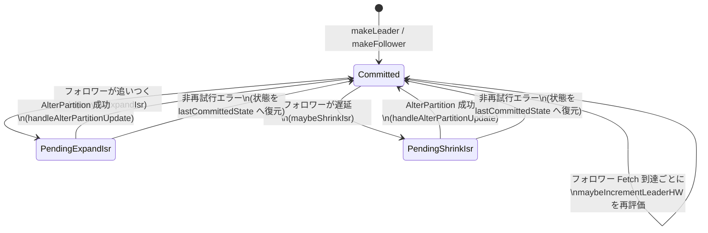

# 第13章 Partition と ISR、High Watermark

> **本章で読むソース**
>
> - [`core/src/main/scala/kafka/cluster/Partition.scala`](https://github.com/apache/kafka/blob/4.3.1/core/src/main/scala/kafka/cluster/Partition.scala)
> - [`server/src/main/java/org/apache/kafka/server/replica/Replica.java`](https://github.com/apache/kafka/blob/4.3.1/server/src/main/java/org/apache/kafka/server/replica/Replica.java)
> - [`server/src/main/java/org/apache/kafka/server/replica/ReplicaState.java`](https://github.com/apache/kafka/blob/4.3.1/server/src/main/java/org/apache/kafka/server/replica/ReplicaState.java)
> - [`server/src/main/java/org/apache/kafka/server/partition/PartitionState.java`](https://github.com/apache/kafka/blob/4.3.1/server/src/main/java/org/apache/kafka/server/partition/PartitionState.java)
> - [`server/src/main/java/org/apache/kafka/server/partition/CommittedPartitionState.java`](https://github.com/apache/kafka/blob/4.3.1/server/src/main/java/org/apache/kafka/server/partition/CommittedPartitionState.java)

## この章の狙い

プロデューサーが`acks=all`でレコードを送っても、リーダーレプリカへの書き込みだけでは安全ではない。
リーダーを持つブローカーが直後にクラッシュすれば、そのレコードはどこにも複製されないまま失われる。
Kafka はこの問題を、リーダーの書き込みを一定数のフォロワーに複製し終えた地点だけを「コミット済み」と呼ぶことで解決している。

その地点を指す位置が**High Watermark**であり、複製の追随状況を追跡する集合が**同期レプリカ集合（ISR）**である。
本章では、`Partition`クラスがリーダーとしてどのようにフォロワーの複製状況を追跡し、ISR を伸縮させ、High Watermark を前進させるかを読む。
フォロワー側の複製処理自体は第15章で扱い、本章はリーダー側の状態管理に絞る。

## 前提

第9章（[../part03-storage/09-unifiedlog.md](../part03-storage/09-unifiedlog.md)）で見た`UnifiedLog`は、1つのブローカー上のログの書き込みとオフセット管理を担う。
`Partition`はその`UnifiedLog`を1つ抱え、さらに同じパーティションを持つ他ブローカーのレプリカを`Replica`オブジェクトとして保持する。
リーダーである`Partition`だけが ISR の管理と High Watermark の計算を行う。
リーダーとフォロワーの切り替え自体は第14章（[14-replicamanager.md](14-replicamanager.md)）の`ReplicaManager`が`makeLeader`/`makeFollower`を呼び出すことで駆動する。

## フォロワーの複製状況をどう表すか

リーダーは、ISR に含まれるかどうかを判断するために、フォロワーの複製状況を`Replica`ごとに記録している。
記録する値は`ReplicaState`という不変レコードにまとめられている。

[`server/src/main/java/org/apache/kafka/server/replica/ReplicaState.java L32-L67`](https://github.com/apache/kafka/blob/4.3.1/server/src/main/java/org/apache/kafka/server/replica/ReplicaState.java#L32-L67)

```java
public record ReplicaState(
    long logStartOffset,
    LogOffsetMetadata logEndOffsetMetadata,
    long lastFetchLeaderLogEndOffset,
    long lastFetchTimeMs,
    long lastCaughtUpTimeMs,
    Optional<Long> brokerEpoch
) {
    public static final ReplicaState EMPTY = new ReplicaState(
        UnifiedLog.UNKNOWN_OFFSET,
        LogOffsetMetadata.UNKNOWN_OFFSET_METADATA,
        0L,
        0L,
        0L,
        Optional.empty()
    );

    /**
     * Returns the current log end offset of the replica.
     */
    public long logEndOffset() {
        return logEndOffsetMetadata.messageOffset;
    }

    /**
     * Returns true when the replica is considered as "caught-up". A replica is
     * considered "caught-up" when its log end offset is equals to the log end
     * offset of the leader OR when its last caught up time minus the current
     * time is smaller than the max replica lag.
     */
    public boolean isCaughtUp(
        long leaderEndOffset,
        long currentTimeMs,
        long replicaMaxLagMs) {
        return leaderEndOffset == logEndOffset() || currentTimeMs - lastCaughtUpTimeMs <= replicaMaxLagMs;
    }
}
```

`isCaughtUp`が判定に使う`lastCaughtUpTimeMs`は「フェッチしたオフセットがリーダーの LEO（logEndOffset）以上だった、最後の時刻」である。
フォロワーの`logEndOffset`が常にリーダーよりわずかに遅れていても、その遅れが`replicaLagTimeMaxMs`（設定`replica.lag.time.max.ms`）を超えていなければ「追いついている」とみなされる。
小さいプロデュースリクエストが高頻度で届く場合、フォロワーのオフセットが一度も完全一致しないことがあり得るため、時刻ベースの判定が必要になる。

この状態は、リーダーが各フォロワーからの Fetch リクエストを処理するたびに更新される。

[`core/src/main/scala/kafka/cluster/Partition.scala L767-L817`](https://github.com/apache/kafka/blob/4.3.1/core/src/main/scala/kafka/cluster/Partition.scala#L767-L817)

```scala
  def updateFollowerFetchState(
    replica: Replica,
    followerFetchOffsetMetadata: LogOffsetMetadata,
    followerStartOffset: Long,
    followerFetchTimeMs: Long,
    leaderEndOffset: Long,
    brokerEpoch: Long
  ): Unit = {
    // No need to calculate low watermark if there is no delayed DeleteRecordsRequest
    val oldLeaderLW = if (delayedOperations.numDelayedDelete > 0) lowWatermarkIfLeader else -1L
    val prevFollowerEndOffset = replica.stateSnapshot.logEndOffset

    // Apply read lock here to avoid the race between ISR updates and the fetch requests from rebooted follower. It
    // could break the broker epoch checks in the ISR expansion.
    inReadLock[Exception](leaderIsrUpdateLock, () => {
      replica.updateFetchStateOrThrow(
        followerFetchOffsetMetadata,
        followerStartOffset,
        followerFetchTimeMs,
        leaderEndOffset,
        brokerEpoch
      )
    })

    val newLeaderLW = if (delayedOperations.numDelayedDelete > 0) lowWatermarkIfLeader else -1L
    // check if the LW of the partition has incremented
    // since the replica's logStartOffset may have incremented
    val leaderLWIncremented = newLeaderLW > oldLeaderLW

    // Check if this in-sync replica needs to be added to the ISR.
    maybeExpandIsr(replica)

    // check if the HW of the partition can now be incremented
    // since the replica may already be in the ISR and its LEO has just incremented
    val leaderHWIncremented = if (prevFollowerEndOffset != replica.stateSnapshot.logEndOffset) {
      // the leader log may be updated by ReplicaAlterLogDirsThread so the following method must be in lock of
      // leaderIsrUpdateLock to prevent adding new hw to invalid log.
      inReadLock(leaderIsrUpdateLock, () => {
        leaderLogIfLocal.exists(leaderLog => maybeIncrementLeaderHW(leaderLog, followerFetchTimeMs))
      })
    } else {
      false
    }

    // some delayed operations may be unblocked after HW or LW changed
    if (leaderLWIncremented || leaderHWIncremented)
      tryCompleteDelayedRequests()
  }
```

1回の Fetch 処理で、フォロワーの状態更新、ISR 拡張の判定、High Watermark 前進の判定という3段階が連続して走る。
ISR の判定は読み取りロックの外で必要性だけをまず確認し、実際の更新が要る場合だけ書き込みロックを取り直す設計になっている（詳細は次節）。

## ISR をどう伸ばすか

リーダーは、フォロワーの LEO が一定条件を満たしたときだけ ISR へ加える。
条件の判定は`isFollowerInSync`が担う。

[`core/src/main/scala/kafka/cluster/Partition.scala L907-L912`](https://github.com/apache/kafka/blob/4.3.1/core/src/main/scala/kafka/cluster/Partition.scala#L907-L912)

```scala
  private def isFollowerInSync(followerReplica: Replica): Boolean = {
    leaderLogIfLocal.exists { leaderLog =>
      val followerEndOffset = followerReplica.stateSnapshot.logEndOffset
      followerEndOffset >= leaderLog.highWatermark && leaderEpochStartOffsetOpt.exists(followerEndOffset >= _)
    }
  }
```

フォロワーの LEO が現在の High Watermark 以上であることに加え、現在のリーダーエポックが始まったオフセット以上であることも求めている。
後者の条件がない場合、リーダー交代の直後にコミット済みデータが未反映のまま ISR に加わってしまい、そのフォロワーが次のリーダーになるとデータが失われる恐れがある。

この判定を呼び出すのが`maybeExpandIsr`である。

[`core/src/main/scala/kafka/cluster/Partition.scala L876-L894`](https://github.com/apache/kafka/blob/4.3.1/core/src/main/scala/kafka/cluster/Partition.scala#L876-L894)

```scala
  private def maybeExpandIsr(followerReplica: Replica): Unit = {
    val needsIsrUpdate = !partitionState.isInflight && canAddReplicaToIsr(followerReplica.brokerId) && inReadLock(leaderIsrUpdateLock, () => {
      needsExpandIsr(followerReplica)
    })
    if (needsIsrUpdate) {
      val alterIsrUpdateOpt = inWriteLock(leaderIsrUpdateLock, () => {
        // check if this replica needs to be added to the ISR
        partitionState match {
          case currentState: CommittedPartitionState if needsExpandIsr(followerReplica) =>
            Some(prepareIsrExpand(currentState, followerReplica.brokerId))
          case _ =>
            None
        }
      })
      // Send the AlterPartition request outside of the LeaderAndIsr lock since the completion logic
      // may increment the high watermark (and consequently complete delayed operations).
      alterIsrUpdateOpt.foreach(submitAlterPartition)
    }
  }
```

判定を読み取りロックで1度行い、条件を満たした場合だけ書き込みロックを取って同じ条件を再確認している。
ISR 拡張は Fetch のたびに起こり得るが、実際に拡張が必要になる場面はまれであるため、共通経路（毎回の Fetch）を読み取りロックだけで通し、書き込みロックは実際に更新が必要な稀な場合に限る二段構えになっている。

`prepareIsrExpand`は、ISR を実際に変えるのではなく、コントローラーへ送る**提案**として`PendingExpandIsr`状態へ遷移させる。

[`core/src/main/scala/kafka/cluster/Partition.scala L1609-L1634`](https://github.com/apache/kafka/blob/4.3.1/core/src/main/scala/kafka/cluster/Partition.scala#L1609-L1634)

```scala
  private def prepareIsrExpand(
    currentState: CommittedPartitionState,
    newInSyncReplicaId: Int
  ): PendingExpandIsr = {
    // When expanding the ISR, we assume that the new replica will make it into the ISR
    // before we receive confirmation that it has. This ensures that the HW will already
    // reflect the updated ISR even if there is a delay before we receive the confirmation.
    // Alternatively, if the update fails, no harm is done since the expanded ISR puts
    // a stricter requirement for advancement of the HW.
    val isrToSend = partitionState.isr.asScala.map(_.toInt) + newInSyncReplicaId
    val isrWithBrokerEpoch = addBrokerEpochToIsr(isrToSend.toList).asJava
    val newLeaderAndIsr = new LeaderAndIsr(
      localBrokerId,
      leaderEpoch,
      partitionState.leaderRecoveryState,
      isrWithBrokerEpoch,
      partitionEpoch
    )
    val updatedState = new PendingExpandIsr(
      newInSyncReplicaId,
      newLeaderAndIsr,
      currentState
    )
    partitionState = updatedState
    updatedState
  }
```

コメントにある通り、この実装はコントローラーへの確認が返る前に「拡張後の ISR」を先に採用してしまう。
確認が失敗しても、拡張後の ISR は元の ISR よりも条件が厳しい（フォロワー数が多い分だけ High Watermark が進みにくい）ため、コミット済みと誤認するリスクは生じない。
このように、確定した ISR より広く見積もる集合を`PartitionState.maximalIsr`と呼び、High Watermark の計算にも使われる（次節）。

## AlterPartition によるコントローラーとの調停

ISR の変更は、リーダー単独で確定できない。
`PartitionState`はコミット済み状態を`CommittedPartitionState`、コントローラーへの提案が未確定の状態を`PendingExpandIsr`/`PendingShrinkIsr`として表す。

[`server/src/main/java/org/apache/kafka/server/partition/PartitionState.java L26-L48`](https://github.com/apache/kafka/blob/4.3.1/server/src/main/java/org/apache/kafka/server/partition/PartitionState.java#L26-L48)

```java
public interface PartitionState {
    /**
     * Includes only the in-sync replicas which have been committed to Controller.
     */
    Set<Integer> isr();

    /**
     * This set may include uncommitted ISR members following an expansion. This "effective" ISR is used for advancing
     * the high watermark as well as determining which replicas are required for acks=all produce requests.*
     */
    Set<Integer> maximalIsr();

    /**
     * The leader recovery state. See the description for LeaderRecoveryState for details on the different values.
     */
    LeaderRecoveryState leaderRecoveryState();

    /**
     * Indicates if we have an AlterPartition request inflight.
     */
    boolean isInflight();

}
```

提案の送信は`submitAlterPartition`が行う。

[`core/src/main/scala/kafka/cluster/Partition.scala L1687-L1721`](https://github.com/apache/kafka/blob/4.3.1/core/src/main/scala/kafka/cluster/Partition.scala#L1687-L1721)

```scala
  private def submitAlterPartition(proposedIsrState: PendingPartitionChange): CompletableFuture[LeaderAndIsr] = {
    debug(s"Submitting ISR state change $proposedIsrState")
    val future = alterIsrManager.submit(
      new org.apache.kafka.server.common.TopicIdPartition(topicId.getOrElse(throw new IllegalStateException("Topic id not set for " + topicPartition)), topicPartition.partition),
      proposedIsrState.sentLeaderAndIsr
    )
    future.whenComplete { (leaderAndIsr, e) =>
      var hwIncremented = false
      var shouldRetry = false

      inWriteLock[Exception](leaderIsrUpdateLock, () => {
        if (partitionState != proposedIsrState) {
          // This means partitionState was updated through leader election or some other mechanism
          // before we got the AlterPartition response. We don't know what happened on the controller
          // exactly, but we do know this response is out of date so we ignore it.
          debug(s"Ignoring failed ISR update to $proposedIsrState since we have already " +
            s"updated state to $partitionState")
        } else if (leaderAndIsr != null) {
          hwIncremented = handleAlterPartitionUpdate(proposedIsrState, leaderAndIsr)
        } else {
          shouldRetry = handleAlterPartitionError(proposedIsrState, Errors.forException(e))
        }
      })

      if (hwIncremented) {
        tryCompleteDelayedRequests()
      }

      // Send the AlterPartition request outside of the LeaderAndIsr lock since the completion logic
      // may increment the high watermark (and consequently complete delayed operations).
      if (shouldRetry) {
        submitAlterPartition(proposedIsrState)
      }
    }
  }
```

送信する`LeaderAndIsr`は`AlterPartition` RPC（KIP-497）としてコントローラーへ送られる。
コントローラー側の受理処理は第18章（[../part05-kraft/18-quorum-controller.md](../part05-kraft/18-quorum-controller.md)）の`QuorumController`が扱う。
応答が成功で返ると、`handleAlterPartitionUpdate`がコミット済み状態へ遷移させる。

[`core/src/main/scala/kafka/cluster/Partition.scala L1794-L1825`](https://github.com/apache/kafka/blob/4.3.1/core/src/main/scala/kafka/cluster/Partition.scala#L1794-L1825)

```scala
  private def handleAlterPartitionUpdate(
    proposedIsrState: PendingPartitionChange,
    leaderAndIsr: LeaderAndIsr
  ): Boolean = {
    // Success from controller, still need to check a few things
    if (leaderAndIsr.leaderEpoch != leaderEpoch) {
      debug(s"Ignoring new ISR $leaderAndIsr since we have a stale leader epoch $leaderEpoch.")
      alterPartitionListener.markFailed()
      false
    } else if (leaderAndIsr.partitionEpoch < partitionEpoch) {
      debug(s"Ignoring new ISR $leaderAndIsr since we have a newer version $partitionEpoch.")
      alterPartitionListener.markFailed()
      false
    } else {
      // This is one of two states:
      //   1) leaderAndIsr.partitionEpoch > partitionEpoch: Controller updated to new version with proposedIsrState.
      //   2) leaderAndIsr.partitionEpoch == partitionEpoch: No update was performed since proposed and actual state are the same.
      // In both cases, we want to move from Pending to Committed state to ensure new updates are processed.

      partitionState = new CommittedPartitionState(leaderAndIsr.isr, leaderAndIsr.leaderRecoveryState)
      partitionEpoch = leaderAndIsr.partitionEpoch
      info(s"ISR updated to ${partitionState.isr.asScala.mkString(",")} ${if (isUnderMinIsr) "(under-min-isr)" else ""} " +
        s"and version updated to $partitionEpoch")
      proposedIsrState match {
        case _: PendingExpandIsr => alterPartitionListener.markIsrExpand()
        case _: PendingShrinkIsr => alterPartitionListener.markIsrShrink()
        case _ =>
      }
      // we may need to increment high watermark since ISR could be down to 1
      leaderLogIfLocal.exists(log => maybeIncrementLeaderHW(log))
    }
  }
```

コントローラーの応答に含まれる`partitionEpoch`が現在より新しい場合だけコミットが成立し、古いエポックの応答は無視される。
これにより、複数の`AlterPartition`が並行して発行された場合でも、最新の提案だけが状態に反映される。

## ISR をどう縮めるか

フォロワーが遅れ続けると、リーダーは自分自身でそのフォロワーを ISR から外す。
遅れているかどうかは`getOutOfSyncReplicas`が判定する。

[`core/src/main/scala/kafka/cluster/Partition.scala L1133-L1165`](https://github.com/apache/kafka/blob/4.3.1/core/src/main/scala/kafka/cluster/Partition.scala#L1133-L1165)

```scala
  private def isFollowerOutOfSync(replicaId: Int,
                                  leaderEndOffset: Long,
                                  currentTimeMs: Long,
                                  maxLagMs: Long): Boolean = {
    getReplica(replicaId).fold(true) { followerReplica =>
      !followerReplica.stateSnapshot.isCaughtUp(leaderEndOffset, currentTimeMs, maxLagMs)
    }
  }

  /**
   * If the follower already has the same leo as the leader, it will not be considered as out-of-sync,
   * otherwise there are two cases that will be handled here -
   * 1. Stuck followers: If the leo of the replica hasn't been updated for maxLagMs ms,
   *                     the follower is stuck and should be removed from the ISR
   * 2. Slow followers: If the replica has not read up to the leo within the last maxLagMs ms,
   *                    then the follower is lagging and should be removed from the ISR
   * Both these cases are handled by checking the lastCaughtUpTimeMs which represents
   * the last time when the replica was fully caught up. If either of the above conditions
   * is violated, that replica is considered to be out of sync
   *
   * If an ISR update is in-flight, we will return an empty set here
   **/
  def getOutOfSyncReplicas(maxLagMs: Long): Set[Int] = {
    val current = partitionState
    if (!current.isInflight) {
      val candidateReplicaIds = (current.isr.asScala.map(_.toInt) - localBrokerId).toSet
      val currentTimeMs = time.milliseconds()
      val leaderEndOffset = localLogOrException.logEndOffset
      candidateReplicaIds.filter(replicaId => isFollowerOutOfSync(replicaId, leaderEndOffset, currentTimeMs, maxLagMs))
    } else {
      Set.empty
    }
  }
```

判定に使う`maxLagMs`が設定`replica.lag.time.max.ms`の値であり、`isCaughtUp`（前節）の時刻条件と対をなす。
この判定は、フォロワーからの Fetch を契機に呼ばれるのではなく、`ReplicaManager`が一定周期で全パーティションに対して`maybeShrinkIsr`を呼び出すことで駆動される（第14章）。

[`core/src/main/scala/kafka/cluster/Partition.scala L1089-L1127`](https://github.com/apache/kafka/blob/4.3.1/core/src/main/scala/kafka/cluster/Partition.scala#L1089-L1127)

```scala
  def maybeShrinkIsr(): Unit = {
    def needsIsrUpdate: Boolean = {
      !partitionState.isInflight && inReadLock(leaderIsrUpdateLock, () => {
        needsShrinkIsr()
      })
    }

    if (needsIsrUpdate) {
      val alterIsrUpdateOpt = inWriteLock(leaderIsrUpdateLock, () => {
        leaderLogIfLocal.flatMap { leaderLog =>
          val outOfSyncReplicaIds = getOutOfSyncReplicas(replicaLagTimeMaxMs)
          partitionState match {
            case currentState: CommittedPartitionState if outOfSyncReplicaIds.nonEmpty =>
              val outOfSyncReplicaLog = outOfSyncReplicaIds.map { replicaId =>
                val replicaStateSnapshot = getReplica(replicaId).map(_.stateSnapshot)
                val logEndOffsetMessage = replicaStateSnapshot
                  .map(_.logEndOffset.toString)
                  .getOrElse("unknown")
                val lastCaughtUpTimeMessage = replicaStateSnapshot
                  .map(_.lastCaughtUpTimeMs.toString)
                  .getOrElse("unknown")
                s"(brokerId: $replicaId, endOffset: $logEndOffsetMessage, lastCaughtUpTimeMs: $lastCaughtUpTimeMessage)"
              }.mkString(" ")
              val newIsrLog = partitionState.isr.asScala.map(_.toInt).diff(outOfSyncReplicaIds).mkString(",")
              info(s"Shrinking ISR from ${partitionState.isr.asScala.mkString(",")} to $newIsrLog. " +
                s"Leader: (highWatermark: ${leaderLog.highWatermark}, " +
                s"endOffset: ${leaderLog.logEndOffset}). " +
                s"Out of sync replicas: $outOfSyncReplicaLog.")
              Some(prepareIsrShrink(currentState, outOfSyncReplicaIds))
            case _ =>
              None
          }
        }
      })
      // Send the AlterPartition request outside of the LeaderAndIsr lock since the completion logic
      // may increment the high watermark (and consequently complete delayed operations).
      alterIsrUpdateOpt.foreach(submitAlterPartition)
    }
  }
```

ISR 縮小の提案は、拡張とは逆に「確定するまでは縮小前の広い ISR を維持する」方針を取る。

[`core/src/main/scala/kafka/cluster/Partition.scala L1636-L1659`](https://github.com/apache/kafka/blob/4.3.1/core/src/main/scala/kafka/cluster/Partition.scala#L1636-L1659)

```scala
  private[cluster] def prepareIsrShrink(
    currentState: CommittedPartitionState,
    outOfSyncReplicaIds: Set[Int]
  ): PendingShrinkIsr = {
    // When shrinking the ISR, we cannot assume that the update will succeed as this could
    // erroneously advance the HW if the `AlterPartition` were to fail. Hence the "maximal ISR"
    // for `PendingShrinkIsr` is the current ISR.
    val isrToSend = partitionState.isr.asScala.map(_.toInt).diff(outOfSyncReplicaIds)
    val isrWithBrokerEpoch = addBrokerEpochToIsr(isrToSend.toList).asJava
    val newLeaderAndIsr = new LeaderAndIsr(
      localBrokerId,
      leaderEpoch,
      partitionState.leaderRecoveryState,
      isrWithBrokerEpoch,
      partitionEpoch
    )
    val updatedState = new PendingShrinkIsr(
      outOfSyncReplicaIds.map(Int.box).asJava,
      newLeaderAndIsr,
      currentState
    )
    partitionState = updatedState
    updatedState
  }
```

コメントが説明する通り、拡張時と縮小時で「未確定のあいだ、どちらの ISR を`maximalIsr`とみなすか」が逆になっている。
拡張の`PendingExpandIsr`は新しい（広い）ISR を`maximalIsr`とみなし、縮小の`PendingShrinkIsr`は元の（広い）ISR を`maximalIsr`とみなす。
どちらの場合も、確定前の状態では「より広い ISR」を基準にすることで、コントローラーとの調停が失敗しても High Watermark を誤って進めない側に倒している。

## High Watermark をどう前進させるか

ISR の伸縮とは独立に、リーダーは自身と各フォロワーの LEO から High Watermark を計算し直す。
その中心が`maybeIncrementLeaderHW`である。

[`core/src/main/scala/kafka/cluster/Partition.scala L1010-L1053`](https://github.com/apache/kafka/blob/4.3.1/core/src/main/scala/kafka/cluster/Partition.scala#L1010-L1053)

```scala
  private def maybeIncrementLeaderHW(leaderLog: UnifiedLog, currentTimeMs: Long = time.milliseconds): Boolean = {
    if (isUnderMinIsr) {
      trace(s"Not increasing HWM because partition is under min ISR(ISR=${partitionState.isr}")
      return false
    }
    // maybeIncrementLeaderHW is in the hot path, the following code is written to
    // avoid unnecessary collection generation
    val leaderLogEndOffset = leaderLog.logEndOffsetMetadata
    var newHighWatermark = leaderLogEndOffset
    remoteReplicasMap.forEach { (_, replica) =>
      val replicaState = replica.stateSnapshot

      def shouldWaitForReplicaToJoinIsr: Boolean = {
        replicaState.isCaughtUp(leaderLogEndOffset.messageOffset, currentTimeMs, replicaLagTimeMaxMs) &&
        isReplicaIsrEligible(replica.brokerId)
      }

      // Note here we are using the "maximal", see explanation above
      if (replicaState.logEndOffsetMetadata.messageOffset < newHighWatermark.messageOffset &&
          (partitionState.maximalIsr.contains(replica.brokerId) || shouldWaitForReplicaToJoinIsr)
      ) {
        newHighWatermark = replicaState.logEndOffsetMetadata
      }
    }

    leaderLog.maybeIncrementHighWatermark(newHighWatermark).toScala match {
      case Some(oldHighWatermark) =>
        debug(s"High watermark updated from $oldHighWatermark to $newHighWatermark")
        true

      case None =>
        false
    }
  }
```

新しい High Watermark の候補は、リーダー自身の LEO から出発し、`maximalIsr`に含まれるレプリカ、または「追いついているが ISR への加入がまだ確定していないレプリカ」の LEO のうち最小のものまで引き下げられる。
言い換えると、**ISR に含まれる全レプリカのうち最小の LEO が High Watermark になる**。
この最小値だけを追跡すればよいという設計が、本章の最適化の要点である。

ISR の実サイズがいくつであっても、High Watermark の再計算は「候補の初期値を1回更新し、あとはレプリカごとに最小値を取るだけ」の線形走査で終わる。
レプリカ数が増えても、必要な比較の回数がレプリカ数に比例して増えるだけであり、レプリカの組み合わせを都度列挙するような計算にはならない。
また`isUnderMinIsr`（`min.insync.replicas`未満）の場合は計算そのものを打ち切ることで、無駄な走査を避けている。

[`core/src/main/scala/kafka/cluster/Partition.scala L237-L248`](https://github.com/apache/kafka/blob/4.3.1/core/src/main/scala/kafka/cluster/Partition.scala#L237-L248)

```scala
  def isUnderMinIsr: Boolean = {
    leaderLogIfLocal.exists { partitionState.isr.size < effectiveMinIsr(_) } && isLeader
  }

/**
 * When setting the min ISR, there is no restriction on it. Even if the value does not make sense to be larger than
 * the replication factor. In case there are such setting, the effective min ISR of min(replication factor, min ISR)
 * is returned here.
 */
  private def effectiveMinIsr(leaderLog: UnifiedLog): Int = {
      leaderLog.config.minInSyncReplicas.min(remoteReplicasMap.size + 1)
  }
```

`maybeIncrementLeaderHW`は、ISR の変更（拡張、縮小、`AlterPartition`応答の反映）とフォロワーの LEO 更新の両方から呼ばれる。
どちらの契機であっても、計算そのものは同じ「レプリカごとの最小 LEO を求める」処理に帰着する。

## Mermaid で見る状態遷移



`Committed`は`CommittedPartitionState`、`PendingExpandIsr`/`PendingShrinkIsr`は`isInflight`が真になる中間状態を表す。
中間状態のあいだも`maximalIsr`は定義されており、High Watermark の計算は状態遷移を待たずに継続する。

## まとめ

`Partition`は、フォロワーごとの LEO と最終追随時刻を`Replica`が保持する`ReplicaState`として追跡し、`replica.lag.time.max.ms`を基準に「追いついているか」を判定する。
ISR の拡張と縮小はどちらもリーダー単独では確定せず、`AlterPartition` RPC でコントローラーに提案し、応答が返るまでは`PendingExpandIsr`/`PendingShrinkIsr`という未確定状態に留まる。
未確定のあいだどちらの ISR を基準にするか（拡張は新しい ISR、縮小は元の ISR）を使い分けることで、調停の失敗が誤ったコミット判定につながらないようにしている。
High Watermark は、`maximalIsr`に含まれるレプリカの LEO のうち最小のものとして計算される。
この最小値だけを追えばよい設計により、レプリカ数によらず一定の走査コストでコミット済みの境界を決められる。

## 関連する章

- [../part03-storage/09-unifiedlog.md](../part03-storage/09-unifiedlog.md) `UnifiedLog`が保持する`logEndOffset`と`highWatermark`
- [14-replicamanager.md](14-replicamanager.md) `makeLeader`/`makeFollower`を呼び出し、`maybeShrinkIsr`を周期実行する`ReplicaManager`
- [15-replica-fetcher.md](15-replica-fetcher.md) フォロワー側から Fetch リクエストを送る複製スレッド
- [../part05-kraft/18-quorum-controller.md](../part05-kraft/18-quorum-controller.md) `AlterPartition` RPC を受理する`QuorumController`
