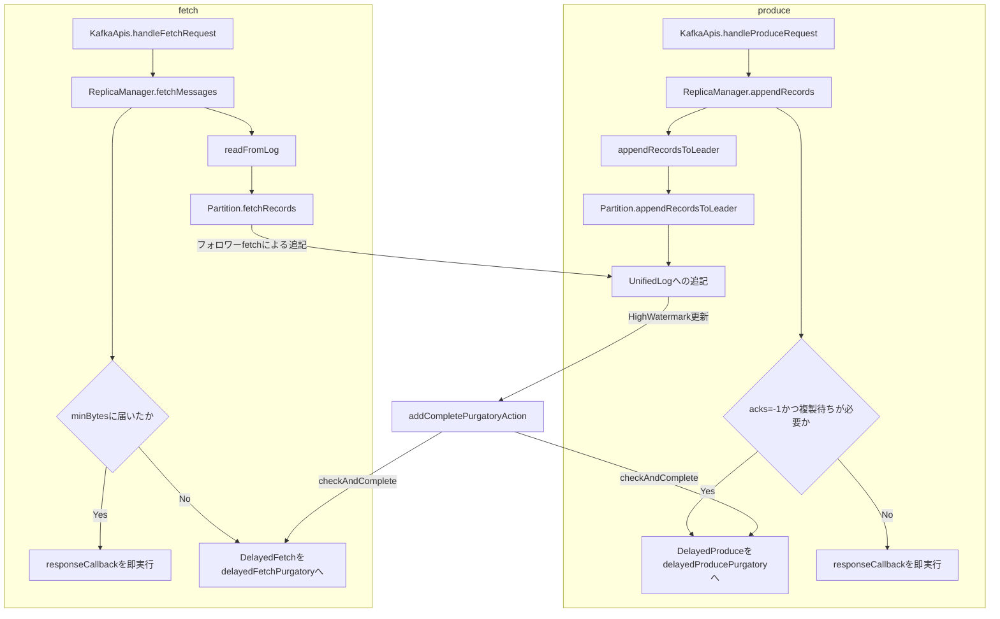

# 第14章 ReplicaManagerによるproduceとfetch

> **本章で読むソース**
>
> - [`core/src/main/scala/kafka/server/ReplicaManager.scala`](https://github.com/apache/kafka/blob/4.3.1/core/src/main/scala/kafka/server/ReplicaManager.scala)

## この章の狙い

第4章では、`KafkaApis`がProduceRequestとFetchRequestの認可とバリデーションを済ませたのち、実処理を`ReplicaManager`へ委譲していることを見た。

本章では、その委譲先である`ReplicaManager`が、ブローカー上の全パーティションのレプリカをどう束ね、produceとfetchをどう処理するかを扱う。

## 前提

`ReplicaManager`は、1つのブローカープロセスにつき1つ生成される。

コンストラクタは、ログの読み書きを担う`LogManager`、KRaftのメタデータを保持する`MetadataCache`、そしてproduceとfetchをそれぞれ保留するためのPurgatoryを受け取る。

[`ReplicaManager.scala L183-L190`](https://github.com/apache/kafka/blob/4.3.1/core/src/main/scala/kafka/server/ReplicaManager.scala#L183-L190)

```scala
  val delayedProducePurgatory = delayedProducePurgatoryParam.getOrElse(
    new DelayedOperationPurgatory[DelayedProduce](
      "Produce", config.brokerId,
      config.producerPurgatoryPurgeIntervalRequests))
  val delayedFetchPurgatory = delayedFetchPurgatoryParam.getOrElse(
    new DelayedOperationPurgatory[DelayedFetch](
      "Fetch", config.brokerId,
      config.fetchPurgatoryPurgeIntervalRequests))
```

`delayedProducePurgatory`と`delayedFetchPurgatory`は、それぞれ`DelayedProduce`と`DelayedFetch`という遅延操作を保持する。

Purgatoryそのものの仕組みは第16章で扱うので、本章ではProduceとFetchの側からPurgatoryをどう使うかに絞って読む。

## produceの経路

`appendRecords`は、ローカルログへの追記と、`acks=-1`（all）指定時のISR複製待ちの2段階からなる。

[`ReplicaManager.scala L637-L677`](https://github.com/apache/kafka/blob/4.3.1/core/src/main/scala/kafka/server/ReplicaManager.scala#L637-L677)

```scala
  def appendRecords(timeout: Long,
                    requiredAcks: Short,
                    internalTopicsAllowed: Boolean,
                    origin: AppendOrigin,
                    entriesPerPartition: Map[TopicIdPartition, MemoryRecords],
                    responseCallback: util.Map[TopicIdPartition, PartitionResponse] => Unit,
                    recordValidationStatsCallback: Map[TopicIdPartition, RecordValidationStats] => Unit = _ => (),
                    requestLocal: RequestLocal = RequestLocal.noCaching,
                    verificationGuards: Map[TopicPartition, VerificationGuard] = Map.empty,
                    transactionVersion: Short = TransactionVersion.TV_UNKNOWN): Unit = {
    if (!isValidRequiredAcks(requiredAcks)) {
      sendInvalidRequiredAcksResponse(entriesPerPartition, responseCallback)
      return
    }

    val localProduceResults = appendRecordsToLeader(
      requiredAcks,
      internalTopicsAllowed,
      origin,
      entriesPerPartition,
      requestLocal,
      defaultActionQueue,
      verificationGuards,
      transactionVersion
    )

    val produceStatus = buildProducePartitionStatus(localProduceResults)

    recordValidationStatsCallback(localProduceResults.map { case (k, v) =>
      k -> v.logAppendSummary().recordValidationStats()
    })

    maybeAddDelayedProduce(
      requiredAcks,
      timeout,
      entriesPerPartition,
      localProduceResults,
      produceStatus,
      responseCallback
    )
  }
```

`appendRecordsToLeader`は、パーティションごとのリーダーレプリカに対して`appendToLocalLog`を呼び、その後に`addCompletePurgatoryAction`をアクションキューへ積む。

`appendToLocalLog`本体は、パーティションを取得して`Partition.appendRecordsToLeader`へ委譲するだけの薄い層であり、実際のログ追記は第13章で扱う`Partition`と、その先の`UnifiedLog`が担う。

[`ReplicaManager.scala L1411-L1416`](https://github.com/apache/kafka/blob/4.3.1/core/src/main/scala/kafka/server/ReplicaManager.scala#L1411-L1416)

```scala
        try {
          val partition = getPartitionOrException(topicIdPartition)
          val info = partition.appendRecordsToLeader(records, origin, requiredAcks, requestLocal,
            verificationGuards.getOrElse(topicIdPartition.topicPartition(), VerificationGuard.SENTINEL), transactionVersion)
          val numAppendedMessages = info.numMessages
```

ローカルログへの追記自体は、リーダー1台への書き込みなので同期的にすぐ終わる。

問題は、`acks=-1`のときにここで応答してよいかどうかである。

`acks=-1`は、ISR（同期レプリカ集合）に含まれる全レプリカがそのオフセットまで複製し終えることを要求するので、ローカル追記の完了だけでは応答を返せない。

`delayedProduceRequestRequired`は、この待ちが必要かどうかを3条件で判定する。

[`ReplicaManager.scala L1360-L1366`](https://github.com/apache/kafka/blob/4.3.1/core/src/main/scala/kafka/server/ReplicaManager.scala#L1360-L1366)

```scala
  private def delayedProduceRequestRequired(requiredAcks: Short,
                                            entriesPerPartition: Map[TopicIdPartition, MemoryRecords],
                                            localProduceResults: Map[TopicIdPartition, LogAppendResult]): Boolean = {
    requiredAcks == -1 &&
    entriesPerPartition.nonEmpty &&
    localProduceResults.values.count(_.exception().isPresent) < entriesPerPartition.size
  }
```

条件を満たすときは`DelayedProduce`を生成し、Purgatoryに`tryCompleteElseWatch`で登録する。

[`ReplicaManager.scala L885-L910`](https://github.com/apache/kafka/blob/4.3.1/core/src/main/scala/kafka/server/ReplicaManager.scala#L885-L910)

```scala
    if (delayedProduceRequestRequired(requiredAcks, entriesPerPartition, initialAppendResults)) {
      // Create delayed produce operation
      //
      // This delegate is invoked by DelayedProduce to verify if the produce operation can be completed.
      // Defined here to provide access to ReplicaManager#getPartitionOrError, which is otherwise inaccessible to the caller.
      def delegate(tp: TopicPartition, requiredOffset: Long) : Result = {
        val (hasEnough, error) = getPartitionOrError(tp).fold(
            // Please refer to the documentation in `DelayedProduce#tryComplete` for a comprehensive description of these cases.
            // Case A or Case B
            err => (false, err),

            // Case B or Case C
            partition => partition.checkEnoughReplicasReachOffset(requiredOffset))

        new Result(hasEnough, error)
      }

      val delayedProduce = new DelayedProduce(timeoutMs, initialProduceStatus.asJava, delegate, responseCallback.asJava)

      // create a list of (topic, partition) pairs to use as keys for this delayed produce operation
      val producerRequestKeys = entriesPerPartition.keys.map(new TopicPartitionOperationKey(_)).toList

      // try to complete the request immediately, otherwise put it into the purgatory
      // this is because while the delayed produce operation is being created, new
      // requests may arrive and hence make this operation completable.
      delayedProducePurgatory.tryCompleteElseWatch(delayedProduce, producerRequestKeys.asJava)
    } else {
```

`delegate`関数が、`DelayedProduce`から呼び戻される完了判定の中身である。

判定自体は`Partition.checkEnoughReplicasReachOffset`に委ねており、これはISRの各レプリカのログ終端オフセットが要求オフセット以上かどうかを見る。

## ISRの複製をどう検知するか

ここで、`DelayedProduce`はどうやってISRの複製が進んだことを知るのだろうか。

答えは、ポーリングではなく通知である。

フォロワーのレプリケーションは、`ReplicaFetcherThread`がフォロワー側から発行するFetchRequestによって進む。

そのFetchRequestがローカルログへ書き込まれてHigh Watermarkが更新されると、`addCompletePurgatoryAction`が積んだアクションが実行され、同じパーティションキーを持つ`DelayedProduce`と`DelayedFetch`の両方に`checkAndComplete`がかかる。

[`ReplicaManager.scala L852-L875`](https://github.com/apache/kafka/blob/4.3.1/core/src/main/scala/kafka/server/ReplicaManager.scala#L852-L875)

```scala
  private def addCompletePurgatoryAction(
    actionQueue: ActionQueue,
    appendResults: Map[TopicIdPartition, LogAppendResult]
  ): Unit = {
    actionQueue.add {
      () => appendResults.foreach { case (topicIdPartition, result) =>
        val requestKey = new TopicPartitionOperationKey(topicIdPartition.topicPartition)
        result.logAppendSummary.leaderHwChange match {
          case LeaderHwChange.INCREASED =>
            // some delayed operations may be unblocked after HW changed
            delayedProducePurgatory.checkAndComplete(requestKey)
            delayedFetchPurgatory.checkAndComplete(requestKey)
            delayedDeleteRecordsPurgatory.checkAndComplete(requestKey)
            if (topicIdPartition.topicId != Uuid.ZERO_UUID) delayedShareFetchPurgatory.checkAndComplete(new DelayedShareFetchPartitionKey(
              topicIdPartition.topicId, topicIdPartition.partition))
          case LeaderHwChange.SAME =>
            // probably unblock some follower fetch requests since log end offset has been updated
            delayedFetchPurgatory.checkAndComplete(requestKey)
          case LeaderHwChange.NONE =>
          // nothing
        }
      }
    }
  }
```

つまり、フォロワーのfetchによるログ追記そのものが、そのパーティションを待っている`DelayedProduce`へのトリガーになっている。

produce側の複製待ちとfetch側のフォロワー追従は、同じ`TopicPartitionOperationKey`を介して結びついている。

## fetchの経路

`fetchMessages`は、コンシューマーとフォロワーの両方が使う共通の入口である。

[`ReplicaManager.scala L1664-L1670`](https://github.com/apache/kafka/blob/4.3.1/core/src/main/scala/kafka/server/ReplicaManager.scala#L1664-L1670)

```scala
  def fetchMessages(params: FetchParams,
                    fetchInfos: Seq[(TopicIdPartition, PartitionData)],
                    quota: ReplicaQuota,
                    responseCallback: Seq[(TopicIdPartition, FetchPartitionData)] => Unit): Unit = {

    // check if this fetch request can be satisfied right away
    val logReadResults = readFromLog(params, fetchInfos, quota, readFromPurgatory = false)
```

まず`readFromLog`で即座に読める分だけ読む。

読み取りの中心は、パーティションごとの`read`内部関数が呼ぶ`Partition.fetchRecords`である。

[`ReplicaManager.scala L1816-L1826`](https://github.com/apache/kafka/blob/4.3.1/core/src/main/scala/kafka/server/ReplicaManager.scala#L1816-L1826)

```scala
          log = partition.localLogWithEpochOrThrow(fetchInfo.currentLeaderEpoch, params.fetchOnlyLeader())

          // Try the read first, this tells us whether we need all of adjustedFetchSize for this partition
          val readInfo: LogReadInfo = partition.fetchRecords(
            fetchParams = params,
            fetchPartitionData = fetchInfo,
            fetchTimeMs = fetchTimeMs,
            maxBytes = adjustedMaxBytes,
            minOneMessage = minOneMessage,
            updateFetchState = !readFromPurgatory)
```

`updateFetchState`が`!readFromPurgatory`である点に注意したい。

フォロワーからのfetchでは、この呼び出し自体が「フォロワーがどこまで読んだか」を`Partition`に記録する経路になっており、その記録がHigh Watermark更新の起点になる。

読み取った結果、要求バイト数に届かず、リモートストレージからの読み取りも不要であれば、`DelayedFetch`を作ってPurgatoryへ登録する。

[`ReplicaManager.scala L1704-L1746`](https://github.com/apache/kafka/blob/4.3.1/core/src/main/scala/kafka/server/ReplicaManager.scala#L1704-L1746)

```scala
    if (remoteFetchInfos.isEmpty && (params.maxWaitMs <= 0 || fetchInfos.isEmpty || bytesReadable >= params.minBytes || errorReadingData ||
      hasDivergingEpoch || hasPreferredReadReplica)) {
      val fetchPartitionData = logReadResults.map { case (tp, result) =>
        val isReassignmentFetch = params.isFromFollower && isAddingReplica(tp.topicPartition, params.replicaId)
        tp -> result.toFetchPartitionData(isReassignmentFetch)
      }
      responseCallback(fetchPartitionData)
    } else {
      // construct the fetch results from the read results
      val fetchPartitionStatus = new util.LinkedHashMap[TopicIdPartition, FetchPartitionStatus]
      fetchInfos.foreach { case (topicIdPartition, partitionData) =>
        val logReadResult = logReadResultMap.get(topicIdPartition)
        if (logReadResult != null) {
          val logOffsetMetadata = logReadResult.info.fetchOffsetMetadata
          fetchPartitionStatus.put(topicIdPartition, new FetchPartitionStatus(logOffsetMetadata, partitionData))
        }
      }

      if (!remoteFetchInfos.isEmpty) {
        processRemoteFetches(remoteFetchInfos, params, responseCallback, logReadResultMap, fetchPartitionStatus)
      } else {
        // If there is not enough data to respond and there is no remote data, we will let the fetch request
        // wait for new data.
        val delayedFetch = new DelayedFetch(
          params = params,
          fetchPartitionStatus = fetchPartitionStatus,
          replicaManager = this,
          quota = quota,
          responseCallback = responseCallback
        )

        // create a list of (topic, partition) pairs to use as keys for this delayed fetch operation
        val delayedFetchKeys = fetchPartitionStatus.keySet()
          .stream()
          .map(new TopicPartitionOperationKey(_))
          .toList()

        // try to complete the request immediately, otherwise put it into the purgatory;
        // this is because while the delayed fetch operation is being created, new requests
        // may arrive and hence make this operation completable.
        delayedFetchPurgatory.tryCompleteElseWatch(delayedFetch, delayedFetchKeys)
      }
    }
```

即座に応答できる条件は5つある。

待ち時間の指定がない、要求するパーティションがない、`fetch.min.bytes`に届くだけのデータが既にある、読み取り中にエラーが起きた、そしてリーダーエポックの食い違いや優先レプリカの指定があった場合である。

いずれにも該当しなければ`DelayedFetch`をPurgatoryで待たせる。

コンシューマーからのfetchは新規データの到着で、フォロワーからのfetchはリーダー自身への新規書き込みで、それぞれ完了する。

## Purgatoryが担う最適化

produceとfetchの両方が、待ちをブロッキングではなくPurgatoryへの登録で実現している点が、この章の最適化の要である。

`acks=-1`の複製待ちも、`fetch.min.bytes`に届くまでの待ちも、リクエストハンドラスレッドを専有したまま待てば、スレッド数に比例してしか同時に処理できるリクエスト数が増えない。

`DelayedProduce`と`DelayedFetch`はいずれも、完了条件を満たすまで`DelayedOperationPurgatory`が保持するタイマーホイールに預けられ、リクエストハンドラスレッドはその場で次のリクエストへ戻る。

完了条件は、`addCompletePurgatoryAction`が拾うHigh Watermarkの変化のような、対象パーティションで実際に何かが起きたときにだけ`checkAndComplete`で再評価される。

このため、未完了のproduceリクエストとfetchリクエストが大量にあっても、それらを起こしているのは少数のI/Oスレッドやタイマースレッドであり、リクエストハンドラスレッドの数を増やさずに済む。

## KRaftメタデータの反映

`ReplicaManager`は、どのパーティションのリーダーが自分かをKRaftのメタデータから受け取る。

コントローラーが発行するメタデータの差分は`applyDelta`で反映される。

[`ReplicaManager.scala L2359-L2408`](https://github.com/apache/kafka/blob/4.3.1/core/src/main/scala/kafka/server/ReplicaManager.scala#L2359-L2408)

```scala
  def applyDelta(delta: TopicsDelta, newImage: MetadataImage): Unit = {
    // Before taking the lock, compute the local changes
    val localChanges = delta.localChanges(config.nodeId)
    val metadataVersion = newImage.features().metadataVersionOrThrow()

    replicaStateChangeLock.synchronized {
      // Handle deleted partitions. We need to do this first because we might subsequently
      // create new partitions with the same names as the ones we are deleting here.
      if (!localChanges.deletes.isEmpty) {
        val deletes = localChanges.deletes.asScala
          .map { tp =>
            val isCurrentLeader = Option(delta.image().getTopic(tp.topic()))
              .map(image => image.partitions().get(tp.partition()))
              .exists(partition => partition.leader == config.nodeId)
            val deleteRemoteLog = delta.topicWasDeleted(tp.topic()) && isCurrentLeader
            new StopPartition(tp, true, deleteRemoteLog, false)
          }
          .toSet
        stateChangeLogger.info(s"Deleting ${deletes.size} partition(s).")
        stopPartitions(deletes).foreachEntry { (topicPartition, e) =>
          if (e.isInstanceOf[KafkaStorageException]) {
            stateChangeLogger.error(s"Unable to delete replica $topicPartition because " +
              "the local replica for the partition is in an offline log directory")
          } else {
            stateChangeLogger.error(s"Unable to delete replica $topicPartition because " +
              s"we got an unexpected ${e.getClass.getName} exception: ${e.getMessage}")
          }
        }
      }

      // Handle partitions which we are now the leader or follower for.
      if (!localChanges.leaders.isEmpty || !localChanges.followers.isEmpty) {
        val lazyOffsetCheckpoints = new LazyOffsetCheckpoints(this.highWatermarkCheckpoints.asJava)
        val leaderChangedPartitions = new mutable.HashSet[Partition]
        val followerChangedPartitions = new mutable.HashSet[Partition]
        if (!localChanges.leaders.isEmpty) {
          applyLocalLeadersDelta(leaderChangedPartitions, delta, lazyOffsetCheckpoints, localChanges.leaders.asScala, localChanges.directoryIds.asScala)
        }
        if (!localChanges.followers.isEmpty) {
          applyLocalFollowersDelta(followerChangedPartitions, newImage, delta, lazyOffsetCheckpoints, localChanges.followers.asScala, localChanges.directoryIds.asScala)
        }

        maybeAddLogDirFetchers(leaderChangedPartitions ++ followerChangedPartitions, lazyOffsetCheckpoints,
          name => Option(newImage.topics().getTopic(name)).map(_.id()))

        replicaFetcherManager.shutdownIdleFetcherThreads()
        replicaAlterLogDirsManager.shutdownIdleFetcherThreads()

        remoteLogManager.foreach(rlm => rlm.onLeadershipChange((leaderChangedPartitions.toSet: Set[TopicPartitionLog]).asJava, (followerChangedPartitions.toSet: Set[TopicPartitionLog]).asJava, localChanges.topicIds()))
      }

      if (metadataVersion.isDirectoryAssignmentSupported) {
        // We only want to update the directoryIds if DirectoryAssignment is supported!
        localChanges.directoryIds.forEach(maybeUpdateTopicAssignment)
      }
    }
  }
```

`applyDelta`は、KRaftコントローラーからブロードキャストされるメタデータログの差分（`TopicsDelta`）1件を、そのブローカーに関係する変更だけに絞り込んで適用する。

`delta.localChanges(config.nodeId)`が、自ブローカーが関わる削除、リーダー化、フォロワー化の3種類の変更に振り分ける。

削除を最初に処理するのは、直後に同名のパーティションを作り直す場合があるためである。

リーダー化は`applyLocalLeadersDelta`が、フォロワー化は`applyLocalFollowersDelta`が担い、いずれも対象の`Partition`オブジェクトに対して`makeLeader`または`makeFollower`を呼ぶ。

フォロワー化では、リーダーエポックが変わった場合に限って`ReplicaFetcherThread`を作り直す。

[`ReplicaManager.scala L2466-L2484`](https://github.com/apache/kafka/blob/4.3.1/core/src/main/scala/kafka/server/ReplicaManager.scala#L2466-L2484)

```scala
          // We always update the follower state.
          // - This ensure that a replica with no leader can step down;
          // - This also ensures that the local replica is created even if the leader
          //   is unavailable. This is required to ensure that we include the partition's
          //   high watermark in the checkpoint file (see KAFKA-1647).
          val partitionAssignedDirectoryId = directoryIds.find(_._1.topicPartition() == tp).map(_._2)
          val isNewLeaderEpoch = partition.makeFollower(info.partition, isNew, offsetCheckpoints, Some(info.topicId), partitionAssignedDirectoryId)

          if (isInControlledShutdown && (info.partition.leader == NO_LEADER ||
              !info.partition.isr.contains(config.brokerId))) {
            // During controlled shutdown, replica with no leaders and replica
            // where this broker is not in the ISR are stopped.
            partitionsToStopFetching.put(tp, false)
          } else if (isNewLeaderEpoch) {
            // Invoke the follower transition listeners for the partition.
            partition.invokeOnBecomingFollowerListeners()
            // Otherwise, fetcher is restarted if the leader epoch has changed.
            partitionsToStartFetching.put(tp, partition)
          }
```

リーダーが変わらない差分（例えばISRの変更だけ）でも`makeFollower`自体は常に呼ぶが、フェッチャースレッドの再生成は`isNewLeaderEpoch`のときだけに絞られている。

第19章で扱う`MetadataImage`が、この`applyDelta`に渡される`TopicsDelta`と`MetadataImage`の出所である。

## 処理の全体像

produceとfetch、そしてそれぞれがPurgatoryとどう連携するかを図にまとめる。



フォロワーからのFetchRequestがログ追記とHigh Watermark更新を引き起こし、それが`DelayedProduce`と`DelayedFetch`の双方をチェックし直す、という循環がこの図の要点である。

## まとめ

`ReplicaManager`は、ブローカー上の全パーティションのレプリカをまとめて管理し、produceとfetchの両方の入口となる。

produceは、ローカルログへの追記後、`acks=-1`であればISR全体の複製完了を`DelayedProduce`として`delayedProducePurgatory`に預ける。

fetchは、要求バイト数に届かない場合に`DelayedFetch`として`delayedFetchPurgatory`に預ける。

両者は、フォロワーのfetchによるHigh Watermark更新という同じ出来事によって完了条件を再評価されるため、リクエストハンドラスレッドを専有せずに大量の未完了リクエストを扱える。

KRaftのメタデータ差分は`applyDelta`が受け取り、自ブローカーに関係するリーダー化、フォロワー化、削除だけを`Partition`単位で適用する。

## 関連する章

- [第4章 KafkaApisとリクエストの委譲](../part01-network/04-kafkaapis.md)
- [第13章 PartitionとISR](13-partition-isr.md)
- [第16章 Purgatory](16-purgatory.md)
- [第19章 MetadataImage](../part05-kraft/19-metadata-image.md)
