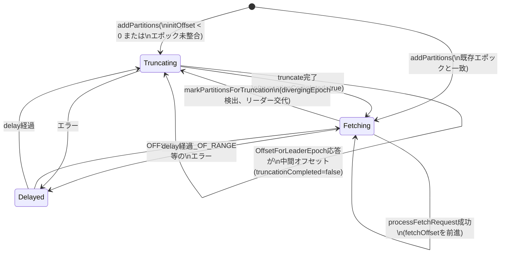

# 第15章 ReplicaFetcherThread とフォロワー複製

> **本章で読むソース**
>
> - [`core/src/main/scala/kafka/server/AbstractFetcherThread.scala`](https://github.com/apache/kafka/blob/4.3.1/core/src/main/scala/kafka/server/AbstractFetcherThread.scala)
> - [`core/src/main/scala/kafka/server/ReplicaFetcherThread.scala`](https://github.com/apache/kafka/blob/4.3.1/core/src/main/scala/kafka/server/ReplicaFetcherThread.scala)
> - [`core/src/main/scala/kafka/server/ReplicaFetcherManager.scala`](https://github.com/apache/kafka/blob/4.3.1/core/src/main/scala/kafka/server/ReplicaFetcherManager.scala)
> - [`core/src/main/scala/kafka/server/AbstractFetcherManager.scala`](https://github.com/apache/kafka/blob/4.3.1/core/src/main/scala/kafka/server/AbstractFetcherManager.scala)
> - [`core/src/main/scala/kafka/server/RemoteLeaderEndPoint.scala`](https://github.com/apache/kafka/blob/4.3.1/core/src/main/scala/kafka/server/RemoteLeaderEndPoint.scala)
> - [`server/src/main/java/org/apache/kafka/server/PartitionFetchState.java`](https://github.com/apache/kafka/blob/4.3.1/server/src/main/java/org/apache/kafka/server/PartitionFetchState.java)

## この章の狙い

第13章では**ISR**（同期レプリカ集合）に加わるための条件を、第14章では`ReplicaManager`がFetchリクエストをどう処理するかを見た。
本章はその裏側、つまりフォロワー側がどうやってリーダーにFetchリクエストを送り続けているかを見る。

フォロワーの複製処理は、専用スレッドが一定間隔でリーダーにFetchを送り、返ってきたレコードを自分のログへ追記するだけの単純なループに見える。
しかし実際には、リーダー交代のたびに発生しうるログの食い違いを解消する**truncate**（切り詰め）の手順と、多数のパーティションを少数のスレッドへ集約する割り当ての仕組みが組み合わさっている。
本章はこの2点を中心に読み解く。

## 前提

**フォロワー**は、担当するパーティションごとにリーダーの最新データを取り込み続ける必要がある。
この取り込みを担うのが`ReplicaFetcherThread`である。
`ReplicaFetcherThread`は抽象クラス`AbstractFetcherThread`を継承しており、Fetchリクエストの送信サイクルや状態遷移といった共通ロジックは`AbstractFetcherThread`に、リーダーのログへ実際にレコードを追記する処理は`ReplicaFetcherThread`に、それぞれ分離されている。

同じ抽象クラスは、ログディレクトリ間でレプリカを移動させる`ReplicaAlterLogDirsThread`（第14章で触れた将来のレプリカの移動先）でも再利用される。
truncateとfetchのサイクルという共通の骨格を持ちながら、レコードの追記先だけが異なるためである。

## fetcherスレッドのdoWorkループ

`AbstractFetcherThread`は`ShutdownableThread`のサブクラスであり、スレッドのメインループから毎周期`doWork`が呼ばれる。
`doWork`は`maybeTruncate`と`maybeFetch`の2段構成である。

[`core/src/main/scala/kafka/server/AbstractFetcherThread.scala L111-L114`](https://github.com/apache/kafka/blob/4.3.1/core/src/main/scala/kafka/server/AbstractFetcherThread.scala#L111-L114)

```scala
  override def doWork(): Unit = {
    maybeTruncate()
    maybeFetch()
  }
```

`maybeTruncate`は、担当パーティションのうち**truncate**が必要な状態にあるものだけを処理する。
truncateが不要なパーティションについては、`maybeFetch`が実際にFetchリクエストを組み立てて送信する。

[`core/src/main/scala/kafka/server/AbstractFetcherThread.scala L116-L135`](https://github.com/apache/kafka/blob/4.3.1/core/src/main/scala/kafka/server/AbstractFetcherThread.scala#L116-L135)

```scala
  private def maybeFetch(): Unit = {
    val fetchRequestOpt = LockUtils.inLock(partitionMapLock, () => {
      val result = leader.buildFetch(partitionStates.partitionStateMap)
      val fetchRequestOpt = result.result
      val partitionsWithError = result.partitionsWithError

      handlePartitionsWithErrors(partitionsWithError.asScala, "maybeFetch")

      if (fetchRequestOpt.isEmpty) {
        trace(s"There are no active partitions. Back off for $fetchBackOffMs ms before sending a fetch request")
        partitionMapCond.await(fetchBackOffMs, TimeUnit.MILLISECONDS)
      }

      fetchRequestOpt
    })

    fetchRequestOpt.ifPresent(replicaFetch =>
      processFetchRequest(replicaFetch.partitionData, replicaFetch.fetchRequest)
    )
  }
```

`leader.buildFetch`は`LeaderEndPoint`（実装は`ReplicaFetcherThread`では`RemoteLeaderEndPoint`）が担う処理で、このスレッドが担当する全パーティションの状態`PartitionFetchState`を見て、Fetchリクエストへ含めるパーティションを選ぶ。
送るべきパーティションが1つもなければ、`fetchBackOffMs`だけ`partitionMapCond`で待つ。
この待ちは、リーダー側にまだ新しいデータがないときに空振りのFetchを繰り返さないための調整であり、条件変数へのスリープによってスレッドがCPUを手放す。

Fetchリクエストが得られれば、`processFetchRequest`がリクエストを送信し、応答を各パーティションのコールバック`processPartitionData`へ振り分ける。

## PartitionFetchStateの状態機械

`AbstractFetcherThread`は、担当する各パーティションの状態を`PartitionFetchState`で管理する。
`PartitionFetchState`は`state`フィールドに`ReplicaState.TRUNCATING`か`ReplicaState.FETCHING`のいずれかを持つレコードであり、加えて`delay`（バックオフ期限）を保持する。

[`server/src/main/java/org/apache/kafka/server/PartitionFetchState.java L66-L80`](https://github.com/apache/kafka/blob/4.3.1/server/src/main/java/org/apache/kafka/server/PartitionFetchState.java#L66-L80)

```java
    public boolean isReadyForFetch() {
        return state == ReplicaState.FETCHING && !isDelayed();
    }

    public boolean isReplicaInSync() {
        return lag.isPresent() && lag.get() <= 0;
    }

    public boolean isTruncating() {
        return state == ReplicaState.TRUNCATING && !isDelayed();
    }

    public boolean isDelayed() {
        return dueMs.filter(aLong -> aLong > Time.SYSTEM.milliseconds()).isPresent();
    }
```

`isReadyForFetch`と`isTruncating`は排他であり、`delay`が設定されている間はどちらも`false`になる。
つまり1つのパーティションは、いずれか一方の作業対象にしかならず、しかもエラー発生時の一時的な**バックオフ**（`delay`）によって、どちらの作業からも外れる期間を持つ。
この3値の切り替えが、`doWork`の2段構成（truncate、fetch）とかみ合って、パーティションごとの処理順序を決めている。

以下は状態遷移の全体像である。



## truncateによる食い違いの解消

フォロワーが新しいリーダーへ追従を始めるとき、それまでのリーダーから受け取っていたログの末尾が、新しいリーダーのログと食い違っている場合がある。
**unclean leader election**（ISR外のレプリカがリーダーに選ばれる操作）が起きた直後や、リーダー交代がFetchの処理中に重なった場合である。
この食い違いを解消する処理が`truncate`であり、`maybeTruncate`から`truncateToEpochEndOffsets`または`truncateToHighWatermark`に分岐して呼ばれる。

`maybeTruncate`は、担当パーティションのうち`isTruncating`が真のものについて、フォロワー自身が保持する最新の`latestEpoch`（レプリカがログに書き込んだ最後の**エポック**）を調べる。

[`core/src/main/scala/kafka/server/AbstractFetcherThread.scala L171-L179`](https://github.com/apache/kafka/blob/4.3.1/core/src/main/scala/kafka/server/AbstractFetcherThread.scala#L171-L179)

```scala
  private def maybeTruncate(): Unit = {
    val (partitionsWithEpochs, partitionsWithoutEpochs) = fetchTruncatingPartitions()
    if (partitionsWithEpochs.nonEmpty) {
      truncateToEpochEndOffsets(partitionsWithEpochs)
    }
    if (partitionsWithoutEpochs.nonEmpty) {
      truncateToHighWatermark(partitionsWithoutEpochs)
    }
  }
```

`latestEpoch`が得られるパーティションは`truncateToEpochEndOffsets`に回る。
ここでフォロワーはリーダーへ`OffsetsForLeaderEpochRequest`を送り、「フォロワーが知っている最新エポックの終端オフセットはどこか」をリーダーに問い合わせる。
リーダーの回答を受けて、実際に切り詰めるオフセットを決めるのが`getOffsetTruncationState`である。

[`core/src/main/scala/kafka/server/AbstractFetcherThread.scala L619-L641`](https://github.com/apache/kafka/blob/4.3.1/core/src/main/scala/kafka/server/AbstractFetcherThread.scala#L619-L641)

```scala
    } else {
      val replicaEndOffset = logEndOffset(tp)

      // get (leader epoch, end offset) pair that corresponds to the largest leader epoch
      // less than or equal to the requested epoch.
      val endOffsetForEpochOpt = endOffsetForEpoch(tp, leaderEpochOffset.leaderEpoch)
      if (endOffsetForEpochOpt.isPresent) {
        val offsetAndEpoch = endOffsetForEpochOpt.get
        val followerEndOffset = offsetAndEpoch.offset
        val followerEpoch = offsetAndEpoch.epoch()
        if (followerEpoch != leaderEpochOffset.leaderEpoch) {
          // the follower does not know about the epoch that leader replied with
          // we truncate to the end offset of the largest epoch that is smaller than the
          // epoch the leader replied with, and send another offset for leader epoch request
          val intermediateOffsetToTruncateTo = min(followerEndOffset, replicaEndOffset)
          info(s"Based on replica's leader epoch, leader replied with epoch ${leaderEpochOffset.leaderEpoch} " +
            s"unknown to the replica for $tp. " +
            s"Will truncate to $intermediateOffsetToTruncateTo and send another leader epoch request to the leader.")
          OffsetTruncationState(intermediateOffsetToTruncateTo, truncationCompleted = false)
        } else {
          val offsetToTruncateTo = min(followerEndOffset, leaderEpochOffset.endOffset)
          OffsetTruncationState(min(offsetToTruncateTo, replicaEndOffset), truncationCompleted = true)
        }
      } else {
```

フォロワーが知らないエポックをリーダーが返してきた場合（`followerEpoch != leaderEpochOffset.leaderEpoch`）、フォロワーはまず自分が知っている一つ前のエポックの終端まで**中間的に**切り詰め、`truncationCompleted = false`のまま次のラウンドで再度エポック問い合わせを送る。
リーダーとフォロワーのエポック系列がずれ切っている場合、この問い合わせが1回で終わらないことがあるためである。
最終的にエポックが一致すれば、フォロワー側の終端オフセットとリーダーが返した終端オフセットの小さいほうへ切り詰め、`truncationCompleted = true`として`Fetching`状態へ戻る。

`latestEpoch`が得られないパーティション（`partitionsWithoutEpochs`）は、単純にフォロワー自身の**High Watermark**まで切り詰める`truncateToHighWatermark`に回る。
High Watermarkより後ろのレコードは、まだ全レプリカに複製されたとは限らないコミット前のデータであり、リーダー交代後に食い違いが生じても安全に捨てられる範囲だからである。

truncateはこれだけでは終わらない。
`isTruncationOnFetchSupported`が真の構成（4.3.1のデフォルト経路）では、Fetch応答そのものに**diverging epoch**（食い違いを示すエポックと終端オフセット）が含まれる場合があり、これを検出した`processFetchRequest`が`truncateOnFetchResponse`を通じて即座にtruncateへ回す。
Fetchの往復ごとに食い違いを検出できるため、専用のエポック問い合わせを待たずにtruncateへ入れる。

## processFetchRequestによるレコードの取り込み

`processFetchRequest`は、`leader.fetch`でFetchリクエストを送信し、返ってきた各パーティションの応答をエラーコードで分岐する。

[`core/src/main/scala/kafka/server/AbstractFetcherThread.scala L352-L365`](https://github.com/apache/kafka/blob/4.3.1/core/src/main/scala/kafka/server/AbstractFetcherThread.scala#L352-L365)

```scala
              Errors.forCode(partitionData.errorCode) match {
                case Errors.NONE =>
                  try {
                    if (leader.isTruncationOnFetchSupported && FetchResponse.isDivergingEpoch(partitionData)) {
                      // If a diverging epoch is present, we truncate the log of the replica
                      // but we don't process the partition data in order to not update the
                      // low/high watermarks until the truncation is actually done. Those will
                      // be updated by the next fetch.
                      divergingEndOffsets += topicPartition -> new EpochEndOffset()
                        .setPartition(topicPartition.partition)
                        .setErrorCode(Errors.NONE.code)
                        .setLeaderEpoch(partitionData.divergingEpoch.epoch)
                        .setEndOffset(partitionData.divergingEpoch.endOffset)
                    } else {
```

エラーがなく、かつdiverging epochも含まれていない通常の場合は、`processPartitionData`が呼ばれる。
`ReplicaFetcherThread`ではこのコールバックが、リーダーから届いたレコードを実際にログへ追記する処理そのものである。

[`core/src/main/scala/kafka/server/ReplicaFetcherThread.scala L112-L147`](https://github.com/apache/kafka/blob/4.3.1/core/src/main/scala/kafka/server/ReplicaFetcherThread.scala#L112-L147)

```scala
  override def processPartitionData(
    topicPartition: TopicPartition,
    fetchOffset: Long,
    partitionLeaderEpoch: Int,
    partitionData: FetchData
  ): Option[LogAppendInfo] = {
    val logTrace = isTraceEnabled
    val partition = replicaMgr.getPartitionOrException(topicPartition)
    val log = partition.localLogOrException
    val records = toMemoryRecords(FetchResponse.recordsOrFail(partitionData))

    if (fetchOffset != log.logEndOffset)
      throw new IllegalStateException("Offset mismatch for partition %s: fetched offset = %d, log end offset = %d.".format(
        topicPartition, fetchOffset, log.logEndOffset))

    if (logTrace)
      trace("Follower has replica log end offset %d for partition %s. Received %d bytes of messages and leader hw %d"
        .format(log.logEndOffset, topicPartition, records.sizeInBytes, partitionData.highWatermark))

    // Append the leader's messages to the log
    val logAppendInfo = partition.appendRecordsToFollowerOrFutureReplica(records, isFuture = false, partitionLeaderEpoch)

    if (logTrace)
      trace("Follower has replica log end offset %d after appending %d bytes of messages for partition %s"
        .format(log.logEndOffset, records.sizeInBytes, topicPartition))
    val leaderLogStartOffset = partitionData.logStartOffset

    // For the follower replica, we do not need to keep its segment base offset and physical position.
    // These values will be computed upon becoming leader or handling a preferred read replica fetch.
    var maybeUpdateHighWatermarkMessage = s"but did not update replica high watermark"
    log.maybeUpdateHighWatermark(partitionData.highWatermark).ifPresent { newHighWatermark =>
      maybeUpdateHighWatermarkMessage = s"and updated replica high watermark to $newHighWatermark"
      partitionsWithNewHighWatermark += topicPartition
    }

    log.maybeIncrementLogStartOffset(leaderLogStartOffset, LogStartOffsetIncrementReason.LeaderOffsetIncremented)
    if (logTrace)
      trace(s"Follower received high watermark ${partitionData.highWatermark} from the leader " +
        s"$maybeUpdateHighWatermarkMessage for partition $topicPartition")
```

冒頭の`fetchOffset != log.logEndOffset`のチェックは、フォロワーが要求したオフセットと自身のログの終端が一致しているかを確認する防御である。
一致していなければ、`maybeTruncate`とは別の経路でログが動いてしまったことを意味し、複製の前提が崩れているため`IllegalStateException`で処理を止める。

チェックを通れば`partition.appendRecordsToFollowerOrFutureReplica`でレコードをログへ追記し、続けてリーダーから届いた`highWatermark`で自分のHigh Watermarkを更新する。
このHigh Watermarkの更新によって、`partitionsWithNewHighWatermark`に該当パーティションが積まれる。
`ReplicaFetcherThread`は`doWork`をオーバーライドし、`super.doWork()`（truncateとfetch）の後に`completeDelayedFetchRequests`を呼んで、この配列に溜まったパーティションについて第14章で見た**Purgatory**上の`DelayedFetch`を完了させる。

[`core/src/main/scala/kafka/server/ReplicaFetcherThread.scala L106-L109`](https://github.com/apache/kafka/blob/4.3.1/core/src/main/scala/kafka/server/ReplicaFetcherThread.scala#L106-L109)

```scala
  override def doWork(): Unit = {
    super.doWork()
    completeDelayedFetchRequests()
  }
```

フォロワーへの複製が進んでHigh Watermarkが上がれば、そのオフセットを待っていたコンシューマーやacks=allのプロデューサーのリクエストを起こす必要があるため、fetchサイクルの直後に完了確認を差し込んでいる。

## fetcherスレッドへのパーティション割り当て

ここまでは1本の`ReplicaFetcherThread`の内部だけを見てきたが、実際のブローカーは数百から数千のパーティションのフォロワーを同時に担当する。
これらを1パーティションにつき1スレッドで処理すると、スレッド数が膨大になり、コンテキストスイッチとFetchリクエストの送信回数がともに増える。

Kafkaはこの負担を、ブローカーごとに固定本数の`ReplicaFetcherThread`を用意し、パーティションをハッシュでスレッドへ割り当てることで抑えている。
割り当てを決めるのが`AbstractFetcherManager.getFetcherId`である。

[`core/src/main/scala/kafka/server/AbstractFetcherManager.scala L110-L115`](https://github.com/apache/kafka/blob/4.3.1/core/src/main/scala/kafka/server/AbstractFetcherManager.scala#L110-L115)

```scala
  // Visibility for testing
  private[server] def getFetcherId(topicPartition: TopicPartition): Int = {
    lock synchronized {
      Utils.abs(31 * topicPartition.topic.hashCode() + topicPartition.partition) % numFetchersPerBroker
    }
  }
```

スレッド数`numFetchersPerBroker`は`num.replica.fetchers`で設定する固定値であり、トピック名とパーティション番号のハッシュ値をその本数で割った余りが、担当スレッドの番号になる。
同じリーダーブローカーを持つパーティション群は、この番号が一致する限り同一の`ReplicaFetcherThread`へまとめられる。

`addFetcherForPartitions`は、追加対象のパーティション群を「リーダーブローカーとfetcherId」の組でグループ化し、まだ存在しないfetcherスレッドだけを新規に立ち上げる。

[`core/src/main/scala/kafka/server/AbstractFetcherManager.scala L131-L161`](https://github.com/apache/kafka/blob/4.3.1/core/src/main/scala/kafka/server/AbstractFetcherManager.scala#L131-L161)

```scala
  def addFetcherForPartitions(partitionAndOffsets: Map[TopicPartition, InitialFetchState]): Unit = {
    lock synchronized {
      val partitionsPerFetcher = partitionAndOffsets.groupBy { case (topicPartition, brokerAndInitialFetchOffset) =>
        BrokerAndFetcherId(brokerAndInitialFetchOffset.leader, getFetcherId(topicPartition))
      }

      def addAndStartFetcherThread(brokerAndFetcherId: BrokerAndFetcherId,
                                   brokerIdAndFetcherId: BrokerIdAndFetcherId): T = {
        val fetcherThread = createFetcherThread(brokerAndFetcherId.fetcherId, brokerAndFetcherId.broker)
        fetcherThreadMap.put(brokerIdAndFetcherId, fetcherThread)
        fetcherThread.start()
        fetcherThread
      }

      for ((brokerAndFetcherId, initialFetchOffsets) <- partitionsPerFetcher) {
        val brokerIdAndFetcherId = BrokerIdAndFetcherId(brokerAndFetcherId.broker.id, brokerAndFetcherId.fetcherId)
        val fetcherThread = fetcherThreadMap.get(brokerIdAndFetcherId) match {
          case Some(currentFetcherThread) if currentFetcherThread.leader.brokerEndPoint() == brokerAndFetcherId.broker =>
            // reuse the fetcher thread
            currentFetcherThread
          case Some(f) =>
            f.shutdown()
            addAndStartFetcherThread(brokerAndFetcherId, brokerIdAndFetcherId)
          case None =>
            addAndStartFetcherThread(brokerAndFetcherId, brokerIdAndFetcherId)
        }
        // failed partitions are removed when added partitions to thread
        addPartitionsToFetcherThread(fetcherThread, initialFetchOffsets)
      }
    }
  }
```

同一の`ReplicaFetcherThread`に束ねられた複数パーティションは、`maybeFetch`の`leader.buildFetch`で1回のFetchリクエストに合流する。

[`core/src/main/scala/kafka/server/RemoteLeaderEndPoint.scala L178-L196`](https://github.com/apache/kafka/blob/4.3.1/core/src/main/scala/kafka/server/RemoteLeaderEndPoint.scala#L178-L196)

```scala
  override def buildFetch(partitions: java.util.Map[TopicPartition, PartitionFetchState]): ResultWithPartitions[java.util.Optional[ReplicaFetch]] = {
    val partitionsWithError = mutable.Set[TopicPartition]()
    val builder = fetchSessionHandler.newBuilder(partitions.size, false)
    partitions.forEach { (topicPartition, fetchState) =>
      // We will not include a replica in the fetch request if it should be throttled.
      if (fetchState.isReadyForFetch && !shouldFollowerThrottle(quota, fetchState, topicPartition)) {
        try {
          val logStartOffset = replicaManager.localLogOrException(topicPartition).logStartOffset
          val lastFetchedEpoch = if (isTruncationOnFetchSupported)
            fetchState.lastFetchedEpoch()
          else
            Optional.empty[Integer]
          builder.add(topicPartition, new FetchRequest.PartitionData(
            fetchState.topicId().orElse(Uuid.ZERO_UUID),
            fetchState.fetchOffset(),
            logStartOffset,
            fetchSize,
            Optional.of(fetchState.currentLeaderEpoch()),
            lastFetchedEpoch))
        } catch {
```

**最適化の要点**は、この2段構えにある。
パーティションを同じリーダーブローカー宛にハッシュで束ねて固定本数のスレッドへ集約し、さらに各スレッドが担当パーティション全部を1回のFetchリクエストへ`builder.add`でまとめて送る。
パーティション数が増えても、ブローカー間のTCPコネクション数とFetchリクエストの往復回数は`num.replica.fetchers`本にしか増えないため、パーティション数に比例したリクエストのオーバーヘッドを避けられる。

## まとめ

`ReplicaFetcherThread`は、`AbstractFetcherThread`が定義する「truncateしてからfetchする」というループを毎周期回し、担当パーティションを`PartitionFetchState`の`TRUNCATING`/`FETCHING`/`遅延`という状態機械で管理する。

truncateは、エポックを手がかりにリーダーとフォロワーの終端オフセットの食い違いを解消する処理であり、フォロワーの知らないエポックが返ってきた場合は複数ラウンドに分けて安全側に切り詰める。
fetchは、`processPartitionData`でリーダーのレコードをログへ追記し、High Watermarkの更新を経て、待機中のFetchリクエストを完了させる。

`AbstractFetcherManager`は、パーティションをハッシュで固定本数のfetcherスレッドへ束ね、1本のスレッドが担当パーティションをまとめて1回のFetchリクエストに乗せることで、パーティション数に対するリクエスト数の増大を防いでいる。

## 関連する章

- 第13章 [Partitionと同期レプリカ集合（ISR）](13-partition-isr.md)
- 第14章 [ReplicaManagerとFetchリクエストの処理](14-replicamanager.md)
