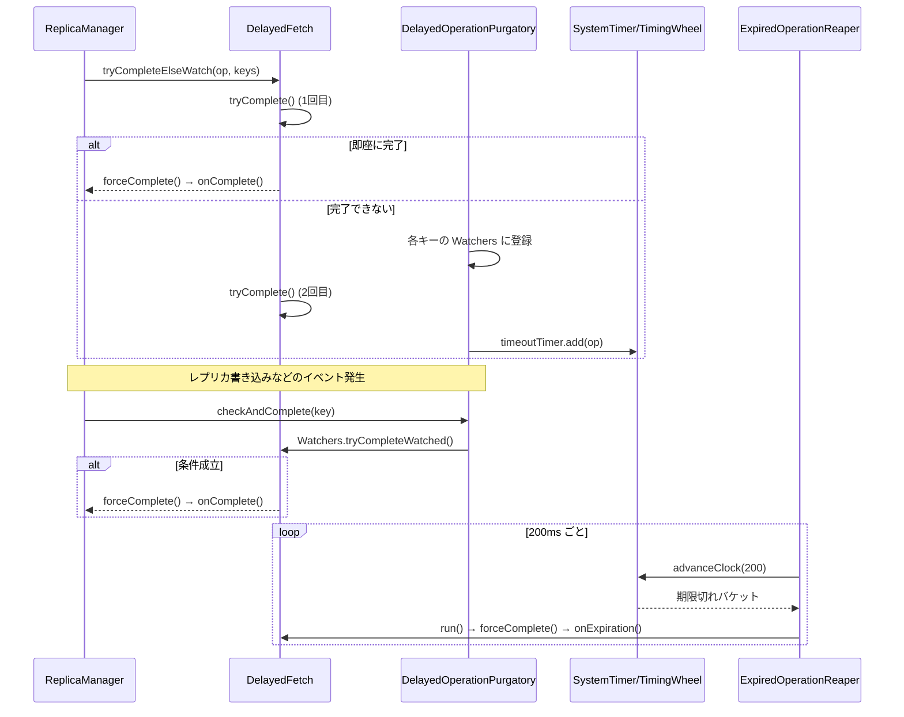

# 第16章 Purgatory と DelayedOperation

> **本章で読むソース**
>
> - [`server-common/src/main/java/org/apache/kafka/server/purgatory/DelayedOperationPurgatory.java`](https://github.com/apache/kafka/blob/4.3.1/server-common/src/main/java/org/apache/kafka/server/purgatory/DelayedOperationPurgatory.java)
> - [`server-common/src/main/java/org/apache/kafka/server/purgatory/DelayedOperation.java`](https://github.com/apache/kafka/blob/4.3.1/server-common/src/main/java/org/apache/kafka/server/purgatory/DelayedOperation.java)
> - [`core/src/main/scala/kafka/server/DelayedFetch.scala`](https://github.com/apache/kafka/blob/4.3.1/core/src/main/scala/kafka/server/DelayedFetch.scala)
> - [`server-common/src/main/java/org/apache/kafka/server/util/timer/TimingWheel.java`](https://github.com/apache/kafka/blob/4.3.1/server-common/src/main/java/org/apache/kafka/server/util/timer/TimingWheel.java)
> - [`server-common/src/main/java/org/apache/kafka/server/util/timer/SystemTimer.java`](https://github.com/apache/kafka/blob/4.3.1/server-common/src/main/java/org/apache/kafka/server/util/timer/SystemTimer.java)

## この章の狙い

`acks=all` の produce 要求は、ISR 全員が書き込みを終えるまで応答を返せない。
fetch 要求も `min.bytes` を指定すれば、その量が溜まるまで応答を保留する。

こうした「条件が揃うまで完了できない処理」を、リクエストを処理したスレッドがブロックして待つ実装にすると、I/O スレッドの数だけしか同時に待てなくなる。
Kafka はこの種の処理を**DelayedOperation**として切り出し、**Purgatory**と呼ばれる監視機構に登録する設計でこの制約を避けている。

本章では、`DelayedOperationPurgatory` と `DelayedOperation` が提供する登録、完了判定、期限切れの仕組みを読み、`DelayedFetch` を具体例として、これらがどう組み合わさるかを追う。

## 前提

Purgatory に登録される処理は、`DelayedOperation` を継承したクラスとして表現される。

第14章で扱う `ReplicaManager` は、produce 要求を `DelayedProduce` として、fetch 要求を `DelayedFetch` としてラップし、それぞれ対応する Purgatory に投げ込む。
本章はこのラップ先である `DelayedOperation` と、それを預かる `DelayedOperationPurgatory` の内部を扱う。

## DelayedOperation の状態機械

`DelayedOperation` は完了条件の判定処理と完了時処理を抽象メソッドとして持つ。

[`server-common/.../purgatory/DelayedOperation.java L91-108`](https://github.com/apache/kafka/blob/4.3.1/server-common/src/main/java/org/apache/kafka/server/purgatory/DelayedOperation.java#L91-L108)

```java
    /**
     * Call-back to execute when a delayed operation gets expired and hence forced to complete.
     */
    public abstract void onExpiration();

    /**
     * Process for completing an operation; This function needs to be defined
     * in subclasses and will be called exactly once in forceComplete()
     */
    public abstract void onComplete();

    /**
     * Try to complete the delayed operation by first checking if the operation
     * can be completed by now. If yes execute the completion logic by calling
     * forceComplete() and return true iff forceComplete returns true; otherwise return false
     * <br/>
     * This function needs to be defined in subclasses
     */
    public abstract boolean tryComplete();
```

サブクラスは、条件が揃っているかを判定する `tryComplete()` と、揃ったときに実際に応答を返す `onComplete()`、そして期限切れ時に呼ぶ `onExpiration()` を実装する。
呼び出す側が直接 `onComplete()` を呼ぶことはない。
完了処理の一本化は `forceComplete()` が担う。

[`server-common/.../purgatory/DelayedOperation.java L60-81`](https://github.com/apache/kafka/blob/4.3.1/server-common/src/main/java/org/apache/kafka/server/purgatory/DelayedOperation.java#L60-L81)

```java
    public boolean forceComplete() {
        // Do not proceed if the operation is already completed.
        if (completed) {
            return false;
        }
        // Attain lock prior completing the request.
        lock.lock();
        try {
            // Re-check, if the operation is already completed by some other thread.
            if (!completed) {
                completed = true;
                // cancel the timeout timer
                cancel();
                onComplete();
                return true;
            } else {
                return false;
            }
        } finally {
            lock.unlock();
        }
    }
```

`completed` フラグをロックの内外で二度確認する構成は、複数スレッドが同時に完了を試みても `onComplete()` がちょうど1回しか実行されないことを保証するためにある。
ロック外の1回目の確認は、既に完了済みの操作についてロック取得自体を避ける早期リターンであり、ロック取得後の2回目の確認が実際の排他制御になる。

完了判定を外部から安全に呼び出す入口が `safeTryComplete()` と `safeTryCompleteOrElse()` である。

[`server-common/.../purgatory/DelayedOperation.java L115-140`](https://github.com/apache/kafka/blob/4.3.1/server-common/src/main/java/org/apache/kafka/server/purgatory/DelayedOperation.java#L115-L140)

```java
    boolean safeTryCompleteOrElse(Action action) {
        lock.lock();
        try {
            if (tryComplete()) return true;
            else {
                action.apply();
                // last completion check
                return tryComplete();
            }
        } finally {
            lock.unlock();
        }
    }

    /**
     * Thread-safe variant of tryComplete()
     */
    boolean safeTryComplete() {
        lock.lock();
        try {
            if (isCompleted()) return false;
            else return tryComplete();
        } finally {
            lock.unlock();
        }
    }
```

`safeTryCompleteOrElse()` は、`tryComplete()` が偽を返したときに限って引数の `action` を実行し、その直後にもう一度 `tryComplete()` を呼ぶ。
この二段構えの意味は次節の `tryCompleteElseWatch()` で明らかになる。

期限切れは `TimerTask` の `run()` が担う。

[`server-common/.../purgatory/DelayedOperation.java L145-149`](https://github.com/apache/kafka/blob/4.3.1/server-common/src/main/java/org/apache/kafka/server/purgatory/DelayedOperation.java#L145-L149)

```java
    @Override
    public void run() {
        if (forceComplete())
            onExpiration();
    }
```

`DelayedOperation` は `TimerTask` を継承しており、指定した遅延時間が経過するとタイマー側からこの `run()` が呼ばれる。
`forceComplete()` が真を返した場合、つまりまだ誰も完了させていなかった場合にのみ `onExpiration()` を呼ぶ。
これにより、条件成立による正常完了と、タイムアウトによる強制完了の両方が同じ `completed` フラグを介して排他される。

## tryCompleteElseWatch によるレース回避

`DelayedOperationPurgatory` に処理を持ち込む唯一の入口が `tryCompleteElseWatch()` である。

[`server-common/.../purgatory/DelayedOperationPurgatory.java L122-176`](https://github.com/apache/kafka/blob/4.3.1/server-common/src/main/java/org/apache/kafka/server/purgatory/DelayedOperationPurgatory.java#L122-L176)

```java
    public <K extends DelayedOperationKey> boolean tryCompleteElseWatch(T operation, List<K> watchKeys) {
        if (watchKeys.isEmpty()) {
            throw new IllegalArgumentException("The watch key list can't be empty");
        }

        // The cost of tryComplete() is typically proportional to the number of keys. Calling tryComplete() for each key is
        // going to be expensive if there are many keys. Instead, we do the check in the following way through safeTryCompleteOrElse().
        // If the operation is not completed, we just add the operation to all keys. Then we call tryComplete() again. At
        // this time, if the operation is still not completed, we are guaranteed that it won't miss any future triggering
        // event since the operation is already on the watcher list for all keys.
        //
        // ==============[story about lock]==============
        // Through safeTryCompleteOrElse(), we hold the operation's lock while adding the operation to watch list and doing
        // the tryComplete() check. This is to avoid a potential deadlock between the callers to tryCompleteElseWatch() and
        // checkAndComplete(). For example, the following deadlock can happen if the lock is only held for the final tryComplete()
        // ... (中略、デッドロックの具体例) ...
        if (operation.safeTryCompleteOrElse(() -> {
            watchKeys.forEach(key -> {
                if (!operation.isCompleted())
                    watchForOperation(key, operation);
            });
            if (!watchKeys.isEmpty())
                estimatedTotalOperations.incrementAndGet();
        })) {
            return true;
        }

        // if it cannot be completed by now and hence is watched, add to the timeout queue also
        if (!operation.isCompleted()) {
            if (timerEnabled)
                timeoutTimer.add(operation);
            if (operation.isCompleted()) {
                // cancel the timer task
                operation.cancel();
            }
        }
        return false;
    }
```

呼び出し側はまず、操作を完了させうるキー（トピックパーティションなど）の一覧 `watchKeys` を渡す。
`safeTryCompleteOrElse()` の1回目の `tryComplete()` で即座に条件が揃えばそのまま完了し、監視リストには一切登録しない。
これは、produce や fetch の大半が待つことなく完了する通常運転を想定した近道である。

1回目で完了しなかった場合、`action` として渡されたラムダ式が実行され、全キーの監視リストに操作を登録してから、もう一度 `tryComplete()` を呼ぶ。
この2回目の呼び出しがないと、1回目の判定と監視登録のあいだの短い時間に条件が成立しても、誰もそれに気づかないまま操作が取り残される。
監視登録後の2回目の判定によって、条件成立イベントを取りこぼす窓を塞いでいる。

コード中のコメントが示すとおり、この一連の処理全体を `operation` のロックの下で行っている理由はデッドロック回避にある。
監視登録だけをロックの外で行い、最終判定だけをロックの内側で行う実装だと、`tryCompleteElseWatch()` を呼ぶスレッドと `checkAndComplete()` を呼ぶスレッドが互いのロックを待ち合う経路が生まれる。
`tryCompleteElseWatch()` 側の一連の処理を単一のロック区間にまとめることで、この経路を断っている。

## Watchers とキー単位の監視

監視リストは、パーティションなどの `DelayedOperationKey` ごとに `Watchers` として保持される。

[`server-common/.../purgatory/DelayedOperationPurgatory.java L309-352`](https://github.com/apache/kafka/blob/4.3.1/server-common/src/main/java/org/apache/kafka/server/purgatory/DelayedOperationPurgatory.java#L309-L352)

```java
    private class Watchers {

        private final ConcurrentLinkedQueue<T> operations = new ConcurrentLinkedQueue<>();

        private final DelayedOperationKey key;
        Watchers(DelayedOperationKey key) {
            this.key = key;
        }

        // count the current number of watched operations. This is O(n), so use isEmpty() if possible
        int countWatched() {
            return operations.size();
        }

        boolean isEmpty() {
            return operations.isEmpty();
        }

        // add the element to watch
        void watch(T t) {
            operations.add(t);
        }

        // traverse the list and try to complete some watched elements
        int tryCompleteWatched() {
            int completed = 0;

            Iterator<T> iter = operations.iterator();
            while (iter.hasNext()) {
                T curr = iter.next();
                if (curr.isCompleted()) {
                    // another thread has completed this operation, just remove it
                    iter.remove();
                } else if (curr.safeTryComplete()) {
                    iter.remove();
                    completed += 1;
                }
            }

            if (operations.isEmpty())
                removeKeyIfEmpty(key, this);

            return completed;
        }
```

ある操作は複数のキーで同時に監視されうる。
例えば `DelayedFetch` は、要求に含まれる全パーティションのキーで監視される。
1つのパーティションで条件が成立して `forceComplete()` が呼ばれても、他のキーの監視リストからその操作を能動的に取り除く処理は行わない。

代わりに、`tryCompleteWatched()` が監視リストを走査するたびに、既に完了済みの操作を見つけ次第取り除く。
`isCompleted()` が真であれば `safeTryComplete()` すら呼ばずに `iter.remove()` する分岐が、この掃除にあたる。
削除を都度追跡する代わりに次の走査時にまとめて掃除する設計であり、キー数に比例したコストを完了時ではなく巡回時に払う形になっている。

外部イベントによって特定のキーの条件が変化したときに呼ばれるのが `checkAndComplete()` である。

[`server-common/.../purgatory/DelayedOperationPurgatory.java L184-199`](https://github.com/apache/kafka/blob/4.3.1/server-common/src/main/java/org/apache/kafka/server/purgatory/DelayedOperationPurgatory.java#L184-L199)

```java
    public <K extends DelayedOperationKey> int checkAndComplete(K key) {
        WatcherList wl = watcherList(key);
        Watchers watchers;
        wl.watchersLock.lock();
        try {
            watchers = wl.watchersByKey.get(key);
        } finally {
            wl.watchersLock.unlock();
        }
        int numCompleted = watchers == null ? 0 : watchers.tryCompleteWatched();

        if (numCompleted > 0) {
            LOG.debug("Request key {} unblocked {} {} operations", key, numCompleted, purgatoryName);
        }
        return numCompleted;
    }
```

`ReplicaManager` は、レプリカの書き込みや ISR の更新が起きるたびに、該当するパーティションのキーで `checkAndComplete()` を呼ぶ。
このイベント駆動の呼び出しにより、条件が成立してから完了までの遅延を、ポーリング間隔ではなくイベント到着までの時間に近づけている。

キーごとの `Watchers` は、ロック競合を減らすため512個の `WatcherList` にシャーディングされている。

[`server-common/.../purgatory/DelayedOperationPurgatory.java L41`](https://github.com/apache/kafka/blob/4.3.1/server-common/src/main/java/org/apache/kafka/server/purgatory/DelayedOperationPurgatory.java#L41)

```java
    private static final int SHARDS = 512; // Shard the watcher list to reduce lock contention
```

キーのハッシュ値を512で割った余りでどの `WatcherList` に属するかを決める。

[`server-common/.../purgatory/DelayedOperationPurgatory.java L105-107`](https://github.com/apache/kafka/blob/4.3.1/server-common/src/main/java/org/apache/kafka/server/purgatory/DelayedOperationPurgatory.java#L105-L107)

```java
    private WatcherList watcherList(DelayedOperationKey key) {
        return watcherLists.get(Math.abs(key.hashCode() % watcherLists.size()));
    }
```

パーティション数の多いクラスタでは、異なるパーティションへの `checkAndComplete()` が同一のロックを奪い合う場面が起きうる。
キーをシャードに分散させることで、そうした呼び出し同士が異なる `WatcherList` のロックを取り、互いをブロックしない構成になっている。

## タイムアウトと TimingWheel による期限管理

条件が成立しないまま時間切れになった操作は、`ExpiredOperationReaper` という背景スレッドが定期的に検出して強制完了させる。

[`server-common/.../purgatory/DelayedOperationPurgatory.java L386-422`](https://github.com/apache/kafka/blob/4.3.1/server-common/src/main/java/org/apache/kafka/server/purgatory/DelayedOperationPurgatory.java#L386-L422)

```java
    private void advanceClock(long timeoutMs) throws InterruptedException {
        timeoutTimer.advanceClock(timeoutMs);

        // Trigger a purge if the number of completed but still being watched operations is larger than
        // the purge threshold. That number is computed by the difference btw the estimated total number of
        // operations and the number of pending delayed operations.
        if (estimatedTotalOperations.get() - numDelayed() > purgeInterval) {
            // ... (中略、purge 済みカウンタの更新) ...
            LOG.debug("Begin purging watch lists");
            int purged = 0;
            for (WatcherList watcherList : watcherLists) {
                purged += watcherList.allWatchers().stream().mapToInt(Watchers::purgeCompleted).sum();
            }
            LOG.debug("Purged {} elements from watch lists.", purged);
        }
    }

    private class ExpiredOperationReaper extends ShutdownableThread {
        ExpiredOperationReaper() {
            super("ExpirationReaper-" + brokerId + "-" + purgatoryName, false);
        }

        @Override
        public void doWork() {
            try {
                advanceClock(200L);
            } catch (InterruptedException ie) {
                throw new RuntimeException(ie);
            }
        }
    }
```

`ExpiredOperationReaper` は200ミリ秒間隔で `timeoutTimer.advanceClock()` を呼び続ける。
この `timeoutTimer` の実体が `SystemTimer` であり、内部の期限管理に階層タイマーホイール（`TimingWheel`）を使う。

## 最適化 階層タイマーホイールによる O(1) の期限管理

`tryCompleteElseWatch()` で完了しなかった操作は、監視登録と並行して `timeoutTimer.add(operation)` によりタイマーにも登録される。
この登録先が `TimingWheel` である。

[`server-common/.../util/timer/TimingWheel.java L143-175`](https://github.com/apache/kafka/blob/4.3.1/server-common/src/main/java/org/apache/kafka/server/util/timer/TimingWheel.java#L143-L175)

```java
    public boolean add(TimerTaskEntry timerTaskEntry) {
        long expiration = timerTaskEntry.expirationMs;

        if (timerTaskEntry.cancelled()) {
            // Cancelled
            return false;
        } else if (expiration < currentTimeMs + tickMs) {
            // Already expired
            return false;
        } else if (expiration < currentTimeMs + interval) {
            // Put in its own bucket
            long virtualId = expiration / tickMs;
            int bucketId = (int) (virtualId % (long) wheelSize);
            TimerTaskList bucket = buckets[bucketId];
            bucket.add(timerTaskEntry);

            // Set the bucket expiration time
            if (bucket.setExpiration(virtualId * tickMs)) {
                // The bucket needs to be enqueued because it was an expired bucket
                // We only need to enqueue the bucket when its expiration time has changed, i.e. the wheel has advanced
                // and the previous buckets gets reused; further calls to set the expiration within the same wheel cycle
                // will pass in the same value and hence return false, thus the bucket with the same expiration will not
                // be enqueued multiple times.
                queue.offer(bucket);
            }

            return true;
        } else {
            // Out of the interval. Put it into the parent timer
            if (overflowWheel == null) addOverflowWheel();
            return overflowWheel.add(timerTaskEntry);
        }
    }
```

`TimingWheel` は円環状に並んだ固定数のバケットからなり、各バケットが一定の時間幅（`tickMs`）を担当する。
`add()` は期限切れまでの時間からバケット番号を計算するだけで、どのバケットに入れるべきかを直接算出する。
優先度付きキュー（二分ヒープ）で期限を管理する実装が挿入と削除に `O(log n)` かかるのに対し、この方式は挿入も削除も `O(1)` で済む。

現在時刻を進める `advanceClock()` は、時計の針をバケット幅の倍数に切り上げるだけの操作である。

[`server-common/.../util/timer/TimingWheel.java L177-184`](https://github.com/apache/kafka/blob/4.3.1/server-common/src/main/java/org/apache/kafka/server/util/timer/TimingWheel.java#L177-L184)

```java
    public void advanceClock(long timeMs) {
        if (timeMs >= currentTimeMs + tickMs) {
            currentTimeMs = timeMs - (timeMs % tickMs);

            // Try to advance the clock of the overflow wheel if present
            if (overflowWheel != null) overflowWheel.advanceClock(currentTimeMs);
        }
    }
```

1段のタイミングホイールでは、担当できる時間幅（`tickMs × バケット数`）を超える期限を持つ操作を扱えない。
Kafka はこれを、上位の粗い解像度のホイールに委譲する階層構造で解決している。
ある操作の期限が1段目の担当幅を超えていれば、`overflowWheel`（存在しなければその場で生成する）に挿入され、上位ホイールの針が進んで対象バケットが期限切れになったときに、下位の細かいホイールへ再挿入される。

`SystemTimer` は `DelayQueue` とこの `TimingWheel` を組み合わせて、期限切れバケットの検出を行う。

[`server-common/.../util/timer/SystemTimer.java L89-106`](https://github.com/apache/kafka/blob/4.3.1/server-common/src/main/java/org/apache/kafka/server/util/timer/SystemTimer.java#L89-L106)

```java
    public boolean advanceClock(long timeoutMs) throws InterruptedException {
        TimerTaskList bucket = delayQueue.poll(timeoutMs, TimeUnit.MILLISECONDS);
        if (bucket != null) {
            writeLock.lock();
            try {
                while (bucket != null) {
                    timingWheel.advanceClock(bucket.getExpiration());
                    bucket.flush(this::addTimerTaskEntry);
                    bucket = delayQueue.poll();
                }
            } finally {
                writeLock.unlock();
            }
            return true;
        } else {
            return false;
        }
    }
```

各バケットは自身の期限切れ時刻を `Delayed` として `DelayQueue` に登録しており、`ExpiredOperationReaper` はこの `DelayQueue` から期限切れバケットを取り出すだけでよい。
バケット内の全タスクをまとめて `flush()` で処理できるため、個々のタスクの期限を1件ずつ調べる走査は発生しない。
`add()` の `O(1)` 挿入と合わせて、大量の `DelayedFetch` や `DelayedProduce` が同時に待機していても、登録と期限監視のコストがそれらの件数に比例して増えない構造になっている。

## 具体例 DelayedFetch の完了条件

`DelayedFetch` は、`min.bytes` に満たないためすぐには完了できない fetch 要求を Purgatory に預けるための `DelayedOperation` 実装である。

[`core/src/main/scala/kafka/server/DelayedFetch.scala L68-144`](https://github.com/apache/kafka/blob/4.3.1/core/src/main/scala/kafka/server/DelayedFetch.scala#L68-L144)

```scala
  override def tryComplete(): Boolean = {
    var accumulatedSize = 0
    fetchPartitionStatus.forEach { (topicIdPartition, fetchStatus) =>
      val fetchOffset = fetchStatus.startOffsetMetadata
      val fetchLeaderEpoch = fetchStatus.fetchInfo.currentLeaderEpoch
      try {
        if (fetchOffset != LogOffsetMetadata.UNKNOWN_OFFSET_METADATA) {
          val partition = replicaManager.getPartitionOrException(topicIdPartition.topicPartition)
          val offsetSnapshot = partition.fetchOffsetSnapshot(fetchLeaderEpoch, params.fetchOnlyLeader)

          val endOffset = params.isolation match {
            case FetchIsolation.LOG_END => offsetSnapshot.logEndOffset
            case FetchIsolation.HIGH_WATERMARK => offsetSnapshot.highWatermark
            case FetchIsolation.TXN_COMMITTED => offsetSnapshot.lastStableOffset
          }

          // ... (中略、Case F: セグメント境界の判定) ...
          if (fetchOffset.messageOffset > endOffset.messageOffset) {
            return forceComplete()
          } else if (fetchOffset.messageOffset < endOffset.messageOffset) {
            if (fetchOffset.onOlderSegment(endOffset)) {
              if (!params.isFromFollower || !replicaManager.shouldLeaderThrottle(quota, partition, params.replicaId))
                return forceComplete()
            } else if (fetchOffset.onSameSegment(endOffset)) {
              val bytesAvailable = math.min(endOffset.positionDiff(fetchOffset), fetchStatus.fetchInfo.maxBytes)
              if (!params.isFromFollower || !replicaManager.shouldLeaderThrottle(quota, partition, params.replicaId))
                accumulatedSize += bytesAvailable
            }
          }
          // ... (中略、Case H: エポック分岐の判定) ...
        }
      } catch {
        case _: NotLeaderOrFollowerException => // Case A or Case B
          return forceComplete()
        case _: UnknownTopicOrPartitionException => // Case C
          return forceComplete()
        case _: KafkaStorageException => // Case D
          return forceComplete()
        case _: FencedLeaderEpochException => // Case E
          return forceComplete()
      }
    }

    // Case G
    if (accumulatedSize >= params.minBytes)
      forceComplete()
    else
      false
  }
```

`tryComplete()` は、要求に含まれる全パーティションを走査して各パーティションの取得可能バイト数を積算し、`params.minBytes` に達していれば完了する（コード中の Case G）。
リーダーでなくなった、パーティション自体が失われた、指定したエポックが古くなったといった状況では、バイト数を待たずにその場で `forceComplete()` する分岐が先に用意されている（Case A から E、H）。
これらの分岐がなければ、リーダーが変わった後もクライアントが `min.bytes` を待ち続け、次のタイムアウトまで応答を受け取れなくなる。

完了時の処理は `onComplete()` に定義される。

[`core/src/main/scala/kafka/server/DelayedFetch.scala L156-176`](https://github.com/apache/kafka/blob/4.3.1/core/src/main/scala/kafka/server/DelayedFetch.scala#L156-L176)

```scala
  override def onComplete(): Unit = {
    val fetchInfos = fetchPartitionStatus.asScala.iterator.map { case (tp, status) =>
      tp -> status.fetchInfo
    }.toBuffer

    val logReadResults = replicaManager.readFromLog(
      params,
      fetchInfos,
      quota,
      readFromPurgatory = true
    )

    val fetchPartitionData = logReadResults.map { case (tp, result) =>
      val isReassignmentFetch = params.isFromFollower &&
        replicaManager.isAddingReplica(tp.topicPartition, params.replicaId)

      tp -> result.toFetchPartitionData(isReassignmentFetch)
    }

    responseCallback(fetchPartitionData)
  }
```

`onComplete()` は、`tryComplete()` の時点では読んでいなかったログを改めて `readFromLog()` で読み直し、その結果をコールバックに渡す。
完了条件の判定とデータの読み出しを分離しているのは、監視中に何度も呼ばれうる `tryComplete()` では軽量なオフセット比較だけを行い、実際のログ読み出しという重い処理は完了が確定した1回に限定するためである。

## 処理の流れ



操作は、即座に完了する経路、イベント（`checkAndComplete()`）で完了する経路、期限切れ（`ExpiredOperationReaper`）で完了する経路のいずれか1つを通り、`completed` フラグによってどの経路も高々1回しか `onComplete()` または `onExpiration()` を呼ばない。

## まとめ

`DelayedOperationPurgatory` は、条件が揃うまで待つ処理をリクエスト処理スレッドから切り離し、キーごとの `Watchers` とタイマーの両方で監視することで、イベント駆動と期限切れの両方から完了できるようにしている。

`tryCompleteElseWatch()` の二段構えの判定は、監視登録前後のわずかな時間に起きる完了イベントの見落としを防ぐためにある。
期限管理には階層タイマーホイールを使い、挿入と削除の双方を `O(1)` で扱うことで、大量の `DelayedFetch` や `DelayedProduce` が同時に待機していても期限監視のコストが操作数に比例して増えない構造になっている。

## 関連する章

- [第14章 ReplicaManager](14-replicamanager.md)
- [第4章 KafkaApis](../part01-network/04-kafkaapis.md)
</content>
