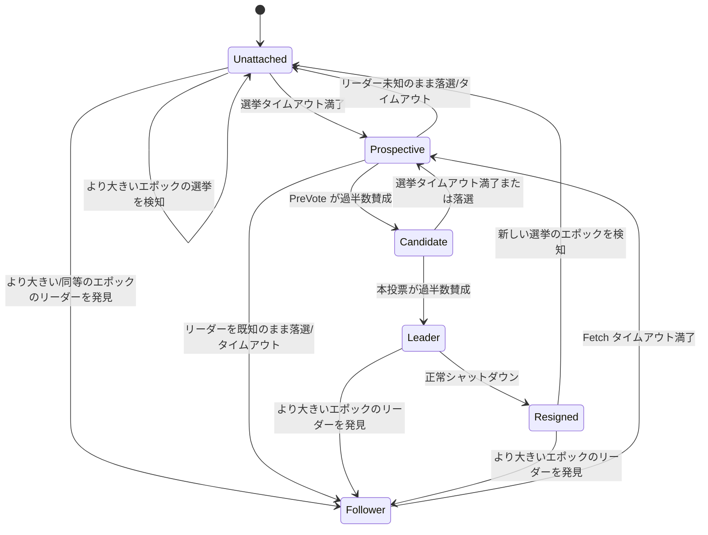

# 第17章 KafkaRaftClient によるリーダー選出とログ複製

> **本章で読むソース**
>
> - [`raft/src/main/java/org/apache/kafka/raft/KafkaRaftClient.java`](https://github.com/apache/kafka/blob/4.3.1/raft/src/main/java/org/apache/kafka/raft/KafkaRaftClient.java)
> - [`raft/src/main/java/org/apache/kafka/raft/QuorumState.java`](https://github.com/apache/kafka/blob/4.3.1/raft/src/main/java/org/apache/kafka/raft/QuorumState.java)
> - [`raft/src/main/java/org/apache/kafka/raft/LeaderState.java`](https://github.com/apache/kafka/blob/4.3.1/raft/src/main/java/org/apache/kafka/raft/LeaderState.java)

## この章の狙い

第1章では、`__cluster_metadata` トピックがブローカーとコントローラー双方に共有される Raft ログであることを見た。
本章では、そのログを実際にレプリケーションし、リーダーを選出する主体である `KafkaRaftClient` を読む。
KRaft のレプリケーションは、パーティションの通常のレプリケーション（第13章、第14章）とは異なり、フォロワーがリーダーへ **Fetch** リクエストを送って自ら引き取る**プル型**の Raft である。
本章はエポックによる投票、フォロワーの Fetch 追跡、High Watermark の前進という3つの仕組みを順に追う。

## 前提

読者は Raft アルゴリズムの基本要素（エポック、投票、ログの複製、コミット）に馴染みがあることを前提とする。
Kafka 固有の用語（パーティション、レプリカ、ISR、High Watermark）は本書の用語集に従って表記する。

## 状態機械としての `QuorumState`

`KafkaRaftClient` の1レプリカは、常にいずれか1つの役割状態を持つ。
`QuorumState` クラスのコメントは、取りうる状態と遷移条件を次のように列挙している。

[`raft/src/main/java/org/apache/kafka/raft/QuorumState.java L40-L69`](https://github.com/apache/kafka/blob/4.3.1/raft/src/main/java/org/apache/kafka/raft/QuorumState.java#L40-L69)

```java
 * Resigned transitions to:
 *    Unattached:  After learning of a new election with a higher epoch, or expiration of the election timeout
 *    Follower:    After discovering a leader with a larger epoch
 *
 * Unattached transitions to:
 *    Unattached:  After learning of a new election with a higher epoch or after giving a binding vote
 *    Prospective: After expiration of the election timeout
 *    Follower:    After discovering a leader with an equal or larger epoch
 *
 * Prospective transitions to:
 *    Unattached:  After learning of an election with a higher epoch, or node did not have last
 *                 known leader and loses/times out election
 *    Candidate:   After receiving a majority of PreVotes granted
 *    Follower:    After discovering a leader with a larger epoch, or node had a last known leader
 *                 and loses/times out election
 *
 * Candidate transitions to:
 *    Unattached:  After learning of a new election with a higher epoch
 *    Prospective: After expiration of the election timeout or loss of election
 *    Leader:      After receiving a majority of votes
 *
 * Leader transitions to:
 *    Unattached:  After learning of a new election with a higher epoch
 *    Resigned:    When shutting down gracefully
 *    Follower:    After discovering a leader with a larger epoch
 *
 * Follower transitions to:
 *    Unattached:  After learning of a new election with a higher epoch
 *    Prospective: After expiration of the fetch timeout
 *    Follower:    After discovering a leader with a larger epoch
```

一般的な Raft の教科書は follower、candidate、leader の3状態で説明することが多い。
4.3.1 の KRaft はこれに **Prospective**（投票権を持つレプリカが、選挙を始める前にまず「予備投票」（PreVote）で当選見込みを確かめる状態）と **Resigned**（リーダーが正常にシャットダウンするときの一時状態）を加えた5状態を持つ。
Prospective の導入によって、フォロワーが一時的にリーダーと切り離されただけで実際には過半数を取れる見込みがない場合に、エポックだけを無駄に進めてしまう事態を避けられる。

## エポックをまたぐ投票の永続化

投票の集計はメモリ上の状態だけでなく、ディスク上のファイルにも記録される。
`QuorumState` は、投票結果を確定させる遷移をすべて `durableTransitionTo` 経由で行う。

[`raft/src/main/java/org/apache/kafka/raft/QuorumState.java L729-L733`](https://github.com/apache/kafka/blob/4.3.1/raft/src/main/java/org/apache/kafka/raft/QuorumState.java#L729-L733)

```java
    private void durableTransitionTo(EpochState newState) {
        log.info("Attempting durable transition to {} from {}", newState, state);
        store.writeElectionState(newState.election(), partitionState.lastKraftVersion());
        memoryTransitionTo(newState);
    }
```

`store` は `QuorumStateStore` インターフェースの実装（`FileQuorumStateStore`）であり、`ElectionState`（エポック番号と投票先）をファイルへ同期的に書き込んでからメモリ上の状態を切り替える。
`transitionToCandidate` と `unattachedAddVotedState` はいずれもこの `durableTransitionTo` を呼ぶため、「あるエポックで誰に投票したか」はプロセス再起動をまたいでも失われない。

[`raft/src/main/java/org/apache/kafka/raft/QuorumState.java L638-L654`](https://github.com/apache/kafka/blob/4.3.1/raft/src/main/java/org/apache/kafka/raft/QuorumState.java#L638-L654)

```java
    public void transitionToCandidate() {
        checkValidTransitionToCandidate();

        int newEpoch = epoch() + 1;
        int electionTimeoutMs = randomElectionTimeoutMs();

        durableTransitionTo(new CandidateState(
            time,
            localIdOrThrow(),
            localDirectoryId,
            newEpoch,
            partitionState.lastVoterSet(),
            state.highWatermark(),
            electionTimeoutMs,
            logContext
        ));
    }
```

この永続化こそが、本章で扱う**最適化の工夫**である。
投票の可否をメモリだけで判断すると、レプリカがクラッシュして再起動した際に「このエポックで既に誰かに投票した」という事実を忘れ、同じエポックで別の候補にも投票してしまう恐れがある。
1エポックにつき投票を1回に制限する Raft の安全性は、この投票記録がディスク上で生き残ることに依存しており、`durableTransitionTo` はメモリ遷移の前に必ずファイル書き込みを完了させることで、この制約をプロセス再起動後も維持する。

Prospective 状態での PreVote は、この永続化の対象外である。

[`raft/src/main/java/org/apache/kafka/raft/QuorumState.java L620-L622`](https://github.com/apache/kafka/blob/4.3.1/raft/src/main/java/org/apache/kafka/raft/QuorumState.java#L620-L622)

```java
        // Durable transition is not necessary since there is no change to the persisted electionState
        memoryTransitionTo(
```

PreVote はエポックを実際には進めず「もし選挙を始めたら過半数を取れそうか」を事前に確かめるだけの通信であるため、投票の法的拘束力を持たない。
そのためディスクへの書き込みを経ずに済み、見込みの薄い選挙でエポックだけが空転して無駄なリーダー交代が起きる事態を、書き込みコストなしに防げる。

## 投票リクエストの処理と PreVote の区別

投票を受け取る側の判定は `handleVoteRequest` にある。
通常の投票（`preVote=false`）でのみ、投票結果が `unattachedAddVotedState` や `prospectiveAddVotedState` を通じて永続化される。

[`raft/src/main/java/org/apache/kafka/raft/KafkaRaftClient.java L919-L931`](https://github.com/apache/kafka/blob/4.3.1/raft/src/main/java/org/apache/kafka/raft/KafkaRaftClient.java#L919-L931)

```java
        boolean voteGranted = quorum.canGrantVote(
            replicaKey,
            lastEpochEndOffsetAndEpoch.compareTo(endOffset()) >= 0,
            preVote
        );

        if (!preVote && voteGranted) {
            if (quorum.isUnattachedNotVoted()) {
                quorum.unattachedAddVotedState(replicaEpoch, replicaKey);
            } else if (quorum.isProspectiveNotVoted()) {
                quorum.prospectiveAddVotedState(replicaEpoch, replicaKey);
            }
        }
```

投票を許可する条件には、依頼元の末尾エポック・末尾オフセットが自分のログ以上であることが含まれる（`lastEpochEndOffsetAndEpoch.compareTo(endOffset()) >= 0`）。
ログが遅れているレプリカに投票してしまうと、当選後にコミット済みレコードを失う恐れがあるため、Raft は「自分より進んでいる候補にしか投票しない」という制約を課している。

Prospective の候補者がまず PreVote を送る流れは `pollProspective` と `maybeSendVoteRequests` にある。

[`raft/src/main/java/org/apache/kafka/raft/KafkaRaftClient.java L3206-L3232`](https://github.com/apache/kafka/blob/4.3.1/raft/src/main/java/org/apache/kafka/raft/KafkaRaftClient.java#L3206-L3232)

```java
    private long maybeSendVoteRequests(
        NomineeState state,
        long currentTimeMs
    ) {
        // Continue sending Vote requests as long as we still have a chance to win the election
        if (!state.epochElection().isVoteRejected()) {
            VoterSet voters = partitionState.lastVoterSet();
            boolean preVote = quorum.isProspective();
            return maybeSendRequests(
                currentTimeMs,
                state.epochElection().unrecordedVoters(),
                voterId -> voters
                    .voterNode(voterId, channel.listenerName())
                    .orElseThrow(() ->
                        new IllegalStateException(
                            String.format(
                                "Unknown endpoint for voter id %d for listener name %s",
                                voterId,
                                channel.listenerName()
                            )
                        )
                    ),
                voterId -> buildVoteRequest(voterId, preVote)
            );
        }
        return Long.MAX_VALUE;
    }
```

`quorum.isProspective()` の値がそのまま `preVote` フラグとして VOTE リクエストに載る。
PreVote で過半数の賛成を得られて初めて `transitionToCandidate` が呼ばれ、実際にエポックを1つ進めた「本投票」の選挙が始まる。

## フォロワーによる Pull 型の Fetch

リーダーが決まった後のログ複製は、パーティションの通常のレプリケーション（第13章、第14章）と対をなす形で実装されている。
通常のレプリケーションでは `ReplicaFetcherThread` がフォロワー側で能動的に Fetch を送り、リーダーはそれに応答するだけである。
KRaft のフォロワーも同じ構造を踏襲し、`buildFetchRequest` は `__cluster_metadata` パーティション向けの `FetchRequestData` を組み立てる。

[`raft/src/main/java/org/apache/kafka/raft/KafkaRaftClient.java L2985-L3002`](https://github.com/apache/kafka/blob/4.3.1/raft/src/main/java/org/apache/kafka/raft/KafkaRaftClient.java#L2985-L3002)

```java
    private FetchRequestData buildFetchRequest() {
        FetchRequestData request = RaftUtil.singletonFetchRequest(
            log.topicPartition(),
            log.topicId(),
            fetchPartition -> fetchPartition
                .setCurrentLeaderEpoch(quorum.epoch())
                .setLastFetchedEpoch(log.lastFetchedEpoch())
                .setFetchOffset(log.endOffset().offset())
                .setReplicaDirectoryId(quorum.localDirectoryId())
                .setHighWatermark(quorum.highWatermark().map(LogOffsetMetadata::offset).orElse(-1L))
        );

        return request
            .setMaxBytes(quorumConfig.fetchMaxBytes())
            .setMaxWaitMs(fetchMaxWaitMs)
            .setClusterId(clusterId)
            .setReplicaState(new FetchRequestData.ReplicaState().setReplicaId(quorum.localIdOrSentinel()));
    }
```

この `FetchRequestData` は、プロデューサーやコンシューマーが使う FETCH API と同じスキーマである。
KRaft はレプリケーション専用の別プロトコルを新設せず、既存の FETCH リクエストとレスポンスの型、そしてそれを処理するリクエストパイプライン（第3章、第4章）をそのまま流用している。
ここが本章で扱うもう一つの機構レベルの効率化であり、新しいバイナリプロトコルやハンドラを実装する必要がなく、Kafka が長年最適化してきたログの読み書きとネットワーク送受信の経路をメタデータのレプリケーションにも再利用できる。

## リーダー側の Fetch 処理と High Watermark の前進

リーダー側で Fetch リクエストを処理するのが `handleFetchRequest` である。
待たせずに返せる条件（エラー、レコードあり、待ち時間指定なし、ログの分岐、スナップショット要求、High Watermark の更新）に当てはまらない場合は、`fetchPurgatory`（第16章で扱った Purgatory と同じ仕組み）で新しいデータが届くまで応答を保留する。

[`raft/src/main/java/org/apache/kafka/raft/KafkaRaftClient.java L1529-L1548`](https://github.com/apache/kafka/blob/4.3.1/raft/src/main/java/org/apache/kafka/raft/KafkaRaftClient.java#L1529-L1548)

```java
        if (partitionResponse.errorCode() != Errors.NONE.code()
            || FetchResponse.recordsSize(partitionResponse) > 0
            || request.maxWaitMs() == 0
            || isPartitionDiverged(partitionResponse)
            || isPartitionSnapshotted(partitionResponse)
            || isHighWatermarkUpdated(partitionResponse, fetchPartition)) {
            // Reply immediately if any of the following is true
            // 1. The response contains an error
            // 2. There are records in the response
            // 3. The fetching replica doesn't want to wait for the partition to contain new data
            // 4. The fetching replica needs to truncate because the log diverged
            // 5. The fetching replica needs to fetch a snapshot
            // 6. The fetching replica should update its high-watermark
            return completedFuture(response);
        }

        CompletableFuture<Long> future = fetchPurgatory.await(
            fetchPartition.fetchOffset(),
            request.maxWaitMs()
        );
```

実際にログを読んで返す `tryCompleteFetchRequest` は、レコードを返す直前に `LeaderState.updateReplicaState` を呼び、そのフォロワーの Fetch オフセットを更新する。

[`raft/src/main/java/org/apache/kafka/raft/KafkaRaftClient.java L1630-L1636`](https://github.com/apache/kafka/blob/4.3.1/raft/src/main/java/org/apache/kafka/raft/KafkaRaftClient.java#L1630-L1636)

```java
                LogFetchInfo info = log.read(fetchOffset, Isolation.UNCOMMITTED, maxSizeBytes);

                if (state.updateReplicaState(replicaKey, currentTimeMs, info.startOffsetMetadata)) {
                    onUpdateLeaderHighWatermark(state, currentTimeMs);
                }

                records = info.records;
```

`updateReplicaState` はフォロワーごとの Fetch オフセットを記録したうえで `maybeUpdateHighWatermark` を呼ぶ。
`maybeUpdateHighWatermark` は、各レプリカの Fetch オフセットを降順に並べ、過半数（`voterStates.size() / 2` 番目、リーダー自身を含む）が到達したオフセットを新しい High Watermark の候補にする。

[`raft/src/main/java/org/apache/kafka/raft/LeaderState.java L727-L747`](https://github.com/apache/kafka/blob/4.3.1/raft/src/main/java/org/apache/kafka/raft/LeaderState.java#L727-L747)

```java
    private boolean maybeUpdateHighWatermark() {
        // Find the largest offset which is replicated to a majority of replicas (the leader counts)
        ArrayList<ReplicaState> followersByDescendingFetchOffset = followersByDescendingFetchOffset()
            .collect(Collectors.toCollection(ArrayList::new));

        int indexOfHw = voterStates.size() / 2;
        Optional<LogOffsetMetadata> highWatermarkUpdateOpt = followersByDescendingFetchOffset.get(indexOfHw).endOffset;

        if (highWatermarkUpdateOpt.isPresent()) {

            // The KRaft protocol requires an extra condition on commitment after a leader
            // election. The leader must commit one record from its own epoch before it is
            // allowed to expose records from any previous epoch. This guarantees that its
            // log will contain the largest record (in terms of epoch/offset) in any log
            // which ensures that any future leader will have replicated this record as well
            // as all records from previous epochs that the current leader has committed.

            LogOffsetMetadata highWatermarkUpdateMetadata = highWatermarkUpdateOpt.get();
            long highWatermarkUpdateOffset = highWatermarkUpdateMetadata.offset();

            if (highWatermarkUpdateOffset > epochStartOffset) {
```

コメントが示すとおり、新リーダーは自分のエポックで書いたレコードを1件以上コミットするまで、それ以前のエポックのレコードを公開できない。
これは、過去のエポックのレコードを安易にコミット済みとして扱うと、リーダー交代の連鎖の中でコミット済みのはずのレコードが失われる可能性があるためであり、新リーダーは `onBecomeLeader` の中で就任直後に制御レコードを書き込むことでこの条件を早期に満たす。

[`raft/src/main/java/org/apache/kafka/raft/KafkaRaftClient.java L660-L667`](https://github.com/apache/kafka/blob/4.3.1/raft/src/main/java/org/apache/kafka/raft/KafkaRaftClient.java#L660-L667)

```java
        LeaderState<T> state = quorum.transitionToLeader(endOffset, accumulator);

        log.initializeLeaderEpoch(quorum.epoch());

        // The high watermark can only be advanced once we have written a record
        // from the new leader's epoch. Hence, we write a control message immediately
        // to ensure there is no delay committing pending data.
        state.appendStartOfEpochControlRecords(currentTimeMs);
```

## poll ループによる駆動

`KafkaRaftClient` はスレッドを1つだけ持ち、`poll()` メソッドの繰り返し呼び出しで全ての状態遷移とメッセージ処理を進める。

[`raft/src/main/java/org/apache/kafka/raft/KafkaRaftClient.java L3663-L3690`](https://github.com/apache/kafka/blob/4.3.1/raft/src/main/java/org/apache/kafka/raft/KafkaRaftClient.java#L3663-L3690)

```java
    public void poll() {
        if (!isInitialized()) {
            throw new IllegalStateException("Replica needs to be initialized before polling");
        }

        long startPollTimeMs = time.milliseconds();
        if (maybeCompleteShutdown(startPollTimeMs)) {
            return;
        }

        long pollStateTimeoutMs = pollCurrentState(startPollTimeMs);
        long cleaningTimeoutMs = snapshotCleaner.maybeClean(startPollTimeMs);
        long pollTimeoutMs = Math.min(pollStateTimeoutMs, cleaningTimeoutMs);

        long startWaitTimeMs = time.milliseconds();
        kafkaRaftMetrics.updatePollStart(startWaitTimeMs);

        RaftMessage message = messageQueue.poll(pollTimeoutMs);

        long endWaitTimeMs = time.milliseconds();
        kafkaRaftMetrics.updatePollEnd(endWaitTimeMs);

        if (message != null) {
            handleInboundMessage(message, endWaitTimeMs);
        }

        pollListeners();
    }
```

`pollCurrentState` は現在の役割状態に応じて `pollLeader`、`pollCandidate`、`pollProspective`、`pollFollower` のいずれかを呼び分け、次にどれだけの時間眠ってよいかを返す。

[`raft/src/main/java/org/apache/kafka/raft/KafkaRaftClient.java L3523-L3532`](https://github.com/apache/kafka/blob/4.3.1/raft/src/main/java/org/apache/kafka/raft/KafkaRaftClient.java#L3523-L3532)

```java
    private long pollCurrentState(long currentTimeMs) {
        if (quorum.isLeader()) {
            return pollLeader(currentTimeMs);
        } else if (quorum.isCandidate()) {
            return pollCandidate(currentTimeMs);
        } else if (quorum.isProspective()) {
            return pollProspective(currentTimeMs);
        } else if (quorum.isFollower()) {
            return pollFollower(currentTimeMs);
        }
```

`pollProspective` と `pollCandidate` は、それぞれの選挙タイムアウトが切れたときの遷移先を明示している。
候補者が過半数の票を得られないまま選挙タイムアウトを迎えると、直接候補者を続けるのではなく一度 Prospective に戻る。

[`raft/src/main/java/org/apache/kafka/raft/KafkaRaftClient.java L3246-L3249`](https://github.com/apache/kafka/blob/4.3.1/raft/src/main/java/org/apache/kafka/raft/KafkaRaftClient.java#L3246-L3249)

```java
        } else if (state.hasElectionTimeoutExpired(currentTimeMs)) {
            logger.info("Election was not granted, transitioning to prospective");
            transitionToProspective(currentTimeMs);
            return 0L;
```

## 状態遷移の可視化



Prospective の PreVote が過半数の賛成を集めない限り Candidate へは進めないため、ネットワーク分断などで一時的に孤立したレプリカが、実際には当選できないにもかかわらずエポックだけを空転させ続ける事態を避けられる。

## まとめ

KRaft は `QuorumState` の状態機械でエポックとリーダー選出を管理し、投票の可否を確定させる遷移だけをファイルへ同期的に永続化することで、プロセス再起動をまたいでも1エポック1票の制約を守る。
Prospective の PreVote はこの永続化を経ないため、見込みの薄い選挙でエポックが空転する事態を書き込みコストなしに防ぐ。
リーダーが選ばれた後のログ複製は、フォロワーが通常のパーティションと同じ FETCH API を使ってリーダーへ Fetch を送るプル型であり、既存のログ読み書きとリクエストパイプラインをそのまま再利用する。
リーダーは各フォロワーの Fetch オフセットから過半数到達点を計算して High Watermark を前進させ、新エポックでの最初のコミットを自ら書き込むことで、リーダー交代をまたいだコミット済みレコードの安全性を保証する。

## 関連する章

- [第1章 Kafka のアーキテクチャと KRaft 時代のブローカー起動](../part00-overview/01-architecture-kraft.md)
- [第18章 QuorumController](18-quorum-controller.md)
- [第13章 Partition と ISR](../part04-replication/13-partition-isr.md)
