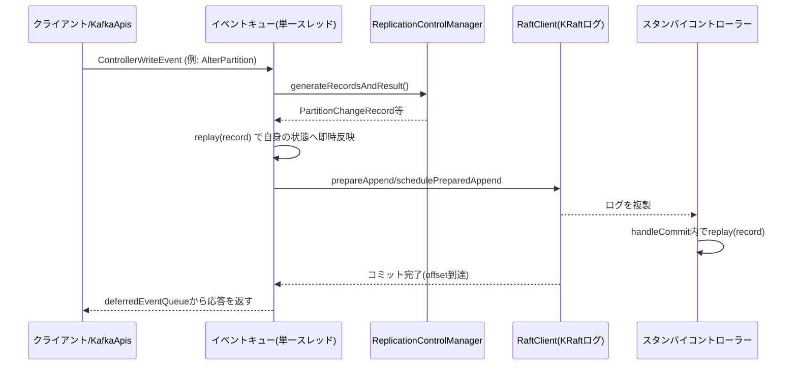

# 第18章 QuorumController とメタデータログ

> **本章で読むソース**
>
> - [`metadata/src/main/java/org/apache/kafka/controller/QuorumController.java`](https://github.com/apache/kafka/blob/4.3.1/metadata/src/main/java/org/apache/kafka/controller/QuorumController.java)
> - [`metadata/src/main/java/org/apache/kafka/controller/ReplicationControlManager.java`](https://github.com/apache/kafka/blob/4.3.1/metadata/src/main/java/org/apache/kafka/controller/ReplicationControlManager.java)

## この章の狙い

KRaft クラスターでは、トピック作成やパーティションのリーダー変更といったクラスター管理操作を、`QuorumController` という単一のコンポーネントが処理する。

本章では、`QuorumController` がリクエストをどのように受け付け、状態変化を KRaft ログのレコードへ変換し、そのレコードを自分自身とスタンバイのコントローラーへどう反映するかを追う。

## 前提

第17章で見たように、KRaft では `RaftClient` が単一のログをクラスター全体で複製し、リーダーだけが新しいレコードを追記できる。

`QuorumController` はそのログの上に載る**状態機械**である。ログに書かれた各レコードは、ブローカー登録やトピック作成、パーティションの ISR 変更など、クラスターメタデータへの1つの変更を表す。

アクティブなコントローラーはこのレコードを生成してログへ追記し、生成した内容を自分の内部状態へもその場で反映する。スタンバイのコントローラーは同じレコードをログから読み、反映するだけである。

## アクティブコントローラーと1本のイベントキュー

クラスター内で KRaft ログのリーダーになったノードが**アクティブコントローラー**になる。それ以外のノードは**スタンバイコントローラー**として、アクティブコントローラーが書いたレコードを再生するだけの受動的な状態にとどまる。

`QuorumController` のクラス javadoc は、この役割分担とスレッドモデルを次のように述べている。

[`metadata/src/main/java/org/apache/kafka/controller/QuorumController.java L155-174`](https://github.com/apache/kafka/blob/4.3.1/metadata/src/main/java/org/apache/kafka/controller/QuorumController.java#L155-L174)

```java
/**
 * QuorumController implements the main logic of the KRaft (Kafka Raft Metadata) mode controller.
 *
 * The node which is the leader of the metadata log becomes the active controller.  All
 * other nodes remain in standby mode.  Standby controllers cannot create new metadata log
 * entries.  They just replay the metadata log entries that the current active controller
 * has created.
 *
 * The QuorumController is single-threaded.  A single event handler thread performs most
 * operations.  This avoids the need for complex locking.
 *
 * The controller exposes an asynchronous, futures-based API to the world.  This reflects
 * the fact that the controller may have several operations in progress at any given
 * point.  The future associated with each operation will not be completed until the
 * results of the operation have been made durable to the metadata log.
 *
 * The QuorumController uses the "metadata.version" feature flag as a mechanism to control
 * the usage of new log record schemas. Starting with 3.3, this version must be set before
 * the controller can fully initialize.
 */
public final class QuorumController implements Controller {
```

管理 API を実装する `KafkaApis`（第4章）は、トピック作成や `AlterPartition` などのリクエストを受けると、`QuorumController` の各メソッドを呼び出す。これらのメソッドは処理を即座に実行するのではなく、`ControllerEvent` を1本の**イベントキュー**へ積んで返す。

キューに積まれたイベントは、単一のイベントハンドラースレッドが順番に取り出して実行する。この構造は次に見るように、ロックなしで決定的な状態機械を実現するための土台になる。

## 書き込みイベントとメタデータレコードの生成

管理操作のうち状態を変更するものは `ControllerWriteEvent` として表現される。このイベントは `ControllerWriteOperation` を保持し、実行時にそのレコード生成メソッドを呼ぶ。

[`metadata/src/main/java/org/apache/kafka/controller/QuorumController.java L732-759`](https://github.com/apache/kafka/blob/4.3.1/metadata/src/main/java/org/apache/kafka/controller/QuorumController.java#L732-L759)

```java
    interface ControllerWriteOperation<T> {
        /**
         * Generate the metadata records needed to implement this controller write
         * operation.  In general, this operation should not modify the "hard state" of
         * the controller.  That modification will happen later on, when we replay the
         * records generated by this function.
         * <p>
         * There are cases where this function modifies the "soft state" of the
         * controller.  Mainly, this happens when we process cluster heartbeats.
         * <p>
         * This function also generates an RPC result.  In general, if the RPC resulted in
         * an error, the RPC result will be an error, and the generated record list will
         * be empty.  This would happen if we tried to create a topic with incorrect
         * parameters, for example.  Of course, partial errors are possible for batch
         * operations.
         *
         * @return A result containing a list of records, and the RPC result.
         */
        ControllerResult<T> generateRecordsAndResult() throws Exception;

        /**
         * Once we've passed the records to the Raft layer, we will invoke this function
         * with the end offset at which those records were placed.  If there were no
         * records to write, we'll just pass the last write offset.
         */
        default void processBatchEndOffset(long offset) {
        }
    }
```

トピック作成であれば `ReplicationControlManager.createTopics` が、パーティションの ISR 変更であれば同クラスの `alterPartition` が、この `generateRecordsAndResult` に相当する処理を担う。

`alterPartition` はブローカーから届いた `AlterPartitionRequest` を検証し、パーティションごとに `PartitionChangeBuilder` を組み立てて `PartitionChangeRecord` を作る。

[`metadata/src/main/java/org/apache/kafka/controller/ReplicationControlManager.java L1131-1149`](https://github.com/apache/kafka/blob/4.3.1/metadata/src/main/java/org/apache/kafka/controller/ReplicationControlManager.java#L1131-L1149)

```java
                PartitionChangeBuilder builder = new PartitionChangeBuilder(
                    partition,
                    topic.id,
                    partitionId,
                    new LeaderAcceptor(clusterControl, partition),
                    featureControl.metadataVersionOrThrow(),
                    getTopicEffectiveMinIsr(topic.name),
                    featureControl.isElrFeatureEnabled()
                );
                if (configurationControl.uncleanLeaderElectionEnabledForTopic(topic.name())) {
                    builder.setElection(PartitionChangeBuilder.Election.UNCLEAN);
                }
                Optional<ApiMessageAndVersion> record = builder
                    .setTargetIsrWithBrokerStates(partitionData.newIsrWithEpochs())
                    .setTargetLeaderRecoveryState(LeaderRecoveryState.of(partitionData.leaderRecoveryState()))
                    .setDefaultDirProvider(clusterDescriber)
                    .build();
                if (record.isPresent()) {
                    records.add(record.get());
```

ここで生成される `records` は、まだクラスターに反映されていない**提案**にすぎない。この提案が実際の状態変更として確定するのは、次に見る `ControllerWriteEvent.run()` の中で、レコードが自分自身に反映（replay）され、かつ Raft ログへ追記されたときである。

## replay とログ追記が1つのイベントで直列化される

`ControllerWriteEvent.run()` はレコードを生成した直後、その場でレコードを `replay` してから `RaftClient` へ渡す。

[`metadata/src/main/java/org/apache/kafka/controller/QuorumController.java L821-856`](https://github.com/apache/kafka/blob/4.3.1/metadata/src/main/java/org/apache/kafka/controller/QuorumController.java#L821-L856)

```java
            } else {
                // Pass the records to the Raft layer. This will start the process of committing
                // them to the log.
                long offset = appendRecords(log, result, maxRecordsPerBatch,
                    records -> {
                        // Start by trying to apply the record to our in-memory state. This should always
                        // succeed; if it does not, that's a fatal error. It is important to do this before
                        // scheduling the record for Raft replication.
                        int recordIndex = 0;
                        long lastOffset = raftClient.prepareAppend(controllerEpoch, records);
                        long baseOffset = lastOffset - records.size() + 1;
                        for (ApiMessageAndVersion message : records) {
                            long recordOffset = baseOffset + recordIndex;
                            try {
                                replay(message.message(), Optional.empty(), recordOffset);
                            } catch (Throwable e) {
                                String failureMessage = String.format("Unable to apply %s " +
                                    "record at offset %d on active controller, from the " +
                                    "batch with baseOffset %d",
                                    message.message().getClass().getSimpleName(),
                                    recordOffset, baseOffset);
                                throw fatalFaultHandler.handleFault(failureMessage, e);
                            }
                            recordIndex++;
                        }
                        raftClient.schedulePreparedAppend();
                        offsetControl.handleScheduleAppend(lastOffset);
                        return lastOffset;
                    }
                );
                op.processBatchEndOffset(offset);
                resultAndOffset = ControllerResultAndOffset.of(offset, result);

                log.debug("Read-write operation {} will be completed when the log " +
                    "reaches offset {}.", this, resultAndOffset.offset());
            }
```

レコードの生成、自分自身への `replay`、`RaftClient` への追記予約は、すべて同じイベントの実行の中で連続して行われる。この3つの間に他のイベントが割り込むことはない。

イベントを処理し終えても、呼び出し元への応答はまだ返らない。`ControllerWriteEvent` は `DeferredEvent` でもあり、`resultAndOffset` を `deferredEventQueue` に積んで、そのオフセットがクォーラムの過半数に複製され**コミット済み**になるまで待つ。

[`metadata/src/main/java/org/apache/kafka/controller/QuorumController.java L858-862`](https://github.com/apache/kafka/blob/4.3.1/metadata/src/main/java/org/apache/kafka/controller/QuorumController.java#L858-L862)

```java
            // Remember the latest offset and future if it is not already completed
            if (!future.isDone()) {
                deferredEventQueue.add(resultAndOffset.offset(), this);
            }
```

これにより、クライアントへ返す応答は必ずコミット済みの状態変化に対応する。書き込み後すぐにクラスターが分断してリーダーが交代しても、コミットされていない変更を確定として応答することはない。

## replay の中身とスタンバイ側の反映

`replay` メソッドはレコードの種類ごとに担当するマネージャーへ処理を振り分ける、単純なディスパッチである。

[`metadata/src/main/java/org/apache/kafka/controller/QuorumController.java L1224-1243`](https://github.com/apache/kafka/blob/4.3.1/metadata/src/main/java/org/apache/kafka/controller/QuorumController.java#L1224-L1243)

```java
        MetadataRecordType type = MetadataRecordType.fromId(message.apiKey());
        switch (type) {
            case REGISTER_BROKER_RECORD:
                clusterControl.replay((RegisterBrokerRecord) message, offset);
                break;
            case UNREGISTER_BROKER_RECORD:
                clusterControl.replay((UnregisterBrokerRecord) message);
                break;
            case TOPIC_RECORD:
                replicationControl.replay((TopicRecord) message);
                break;
            case PARTITION_RECORD:
                replicationControl.replay((PartitionRecord) message);
                break;
            case CONFIG_RECORD:
                configurationControl.replay((ConfigRecord) message);
                break;
            case PARTITION_CHANGE_RECORD:
                replicationControl.replay((PartitionChangeRecord) message);
                break;
```

`ReplicationControlManager.replay(PartitionChangeRecord)` は、直前の `PartitionRegistration` に差分レコードを `merge` して新しい登録情報を作り、`brokersToIsrs` などの索引を更新する。

[`metadata/src/main/java/org/apache/kafka/controller/ReplicationControlManager.java L493-509`](https://github.com/apache/kafka/blob/4.3.1/metadata/src/main/java/org/apache/kafka/controller/ReplicationControlManager.java#L493-L509)

```java
    public void replay(PartitionChangeRecord record) {
        TopicControlInfo topicInfo = topics.get(record.topicId());
        if (topicInfo == null) {
            throw new RuntimeException("Tried to create partition " + record.topicId() +
                ":" + record.partitionId() + ", but no partition with that id was found.");
        }
        PartitionRegistration prevPartitionInfo = topicInfo.parts.get(record.partitionId());
        if (prevPartitionInfo == null) {
            throw new RuntimeException("Tried to create partition " + record.topicId() +
                ":" + record.partitionId() + ", but no partition with that id was found.");
        }
        PartitionRegistration newPartitionInfo = prevPartitionInfo.merge(record);
        updateReassigningTopicsIfNeeded(record.topicId(), record.partitionId(),
                isReassignmentInProgress(prevPartitionInfo), isReassignmentInProgress(newPartitionInfo));
        topicInfo.parts.put(record.partitionId(), newPartitionInfo);
        updatePartitionInfo(record.topicId(), record.partitionId(), prevPartitionInfo, newPartitionInfo);
        updatePartitionDirectories(record.topicId(), record.partitionId(), prevPartitionInfo.directories, newPartitionInfo.directories);
```

この `replay` は、アクティブコントローラー自身が直後に呼ぶときも、スタンバイコントローラーがログから読んで呼ぶときも、まったく同じコードパスを通る。`QuorumMetaLogListener.handleCommit` がその分岐点であり、自分がアクティブなら「すでに反映済みなので待っていた応答を完了させるだけ」、スタンバイなら「ここで初めて `replay` する」という違いだけを吸収する。

[`metadata/src/main/java/org/apache/kafka/controller/QuorumController.java L990-1022`](https://github.com/apache/kafka/blob/4.3.1/metadata/src/main/java/org/apache/kafka/controller/QuorumController.java#L990-L1022)

```java
                        } else if (isActive) {
                            // If the controller is active, the records were already replayed,
                            // so we don't need to do it here.
                            log.debug("Completing purgatory items up to offset {} and epoch {}.", offset, epoch);

                            // Advance the committed and stable offsets then complete any pending purgatory
                            // items that were waiting for these offsets.
                            offsetControl.handleCommitBatch(batch);
                            deferredEventQueue.completeUpTo(offsetControl.lastStableOffset());
                        } else {
                            // If the controller is a standby, replay the records that were
                            // created by the active controller.
                            if (log.isDebugEnabled()) {
                                log.debug("Replaying commits from the active node up to " +
                                    "offset {} and epoch {}.", offset, epoch);
                            }
                            int recordIndex = 0;
                            for (ApiMessageAndVersion message : messages) {
                                long recordOffset = batch.baseOffset() + recordIndex;
                                try {
                                    replay(message.message(), Optional.empty(), recordOffset);
                                } catch (Throwable e) {
                                    String failureMessage = String.format("Unable to apply %s " +
                                        "record at offset %d on standby controller, from the " +
                                        "batch with baseOffset %d",
                                        message.message().getClass().getSimpleName(),
                                        recordOffset, batch.baseOffset());
                                    throw fatalFaultHandler.handleFault(failureMessage, e);
                                }
                                recordIndex++;
                            }
                            offsetControl.handleCommitBatch(batch);
                        }
```

`handleCommit` 自体も `appendControlEvent` を通じて同じイベントキューに積まれる。したがって、書き込みイベントの `replay` と、他ノードからの `handleCommit` による `replay` が同時に走ることはない。単一のイベントキューが、コントローラーの状態を変更しうるすべての経路を1つの実行順序へ直列化している。

## ブローカー障害によるリーダー再選出

アクティブコントローラーは、ブローカーの心拍が途切れて**フェンス**（隔離）されたときにも状態変更を起こす。`handleBrokerFenced` は、そのブローカーがリーダーやフォロワーだったすべてのパーティションについて、リーダーと ISR の更新レコードをまとめて生成する。

[`metadata/src/main/java/org/apache/kafka/controller/ReplicationControlManager.java L1399-1410`](https://github.com/apache/kafka/blob/4.3.1/metadata/src/main/java/org/apache/kafka/controller/ReplicationControlManager.java#L1399-L1410)

```java
    void handleBrokerFenced(int brokerId, List<ApiMessageAndVersion> records) {
        BrokerRegistration brokerRegistration = clusterControl.brokerRegistrations().get(brokerId);
        if (brokerRegistration == null) {
            throw new RuntimeException("Can't find broker registration for broker " + brokerId);
        }
        generateLeaderAndIsrUpdates("handleBrokerFenced", brokerId, NO_LEADER, NO_LEADER, records,
            brokersToIsrs.partitionsWithBrokerInIsr(brokerId));
        records.add(new ApiMessageAndVersion(new BrokerRegistrationChangeRecord().
            setBrokerId(brokerId).setBrokerEpoch(brokerRegistration.epoch()).
            setFenced(BrokerRegistrationFencingChange.FENCE.value()),
            (short) 0));
    }
```

`generateLeaderAndIsrUpdates` は、フェンスされたブローカーをリーダーとしていた各パーティションについて `PartitionChangeBuilder` を使い、残る ISR の中から新しいリーダーを選ぶ `PartitionChangeRecord` を作る（この選出ロジック自体は第13章で扱う ISR の管理と地続きである）。生成された一連のレコードは、通常の管理操作と同じ `ControllerWriteEvent` の経路でログへ追記され、`replay` される。

心拍の監視やハートビート処理も `ControllerWriteEvent` としてイベントキューに積まれるため、ブローカー障害の検出とトピック作成のようなユーザー操作は、常に同じキューの上で順序づけられる。

## リーダー交代時の再構築

アクティブコントローラーが KRaft のリーダーでなくなった場合は `renounce`（リーダー権の放棄）が呼ばれる。

[`metadata/src/main/java/org/apache/kafka/controller/QuorumController.java L1188-1204`](https://github.com/apache/kafka/blob/4.3.1/metadata/src/main/java/org/apache/kafka/controller/QuorumController.java#L1188-L1204)

```java
    void renounce() {
        try {
            if (curClaimEpoch == -1) {
                throw new RuntimeException("Cannot renounce leadership because we are not the " +
                        "current leader.");
            }
            raftClient.resign(curClaimEpoch);
            curClaimEpoch = -1;
            deferredEventQueue.failAll(ControllerExceptions.
                    newWrongControllerException(OptionalInt.empty()));
            offsetControl.deactivate();
            clusterControl.deactivate();
            periodicControl.deactivate();
        } catch (Throwable e) {
            fatalFaultHandler.handleFault("exception while renouncing leadership", e);
        }
    }
```

コミット未確認のまま応答待ちだった書き込みは、`deferredEventQueue.failAll` によって一括で失敗応答に変わる。コミットされていない変更を確定として返さないという冒頭の保証が、リーダー交代時にも崩れないための処理である。

反対に、あるノードが新たにリーダーになったときは `claim` が呼ばれ、`CompleteActivationEvent` をキューの**先頭**に差し込む。

[`metadata/src/main/java/org/apache/kafka/controller/QuorumController.java L1138-1160`](https://github.com/apache/kafka/blob/4.3.1/metadata/src/main/java/org/apache/kafka/controller/QuorumController.java#L1138-L1160)

```java
    private void claim(int epoch, long newNextWriteOffset) {
        try {
            if (curClaimEpoch != -1) {
                throw new RuntimeException("Cannot claim leadership because we are already the " +
                        "active controller.");
            }
            curClaimEpoch = epoch;
            offsetControl.activate(newNextWriteOffset);
            clusterControl.activate();

            // Prepend the activate event. It is important that this event go at the beginning
            // of the queue rather than the end (hence prepend rather than append). It's also
            // important not to use prepend for anything else, to preserve the ordering here.
            ControllerWriteEvent<Void> activationEvent = new ControllerWriteEvent<>(
                "completeActivation[" + epoch + "]",
                new CompleteActivationEvent(),
                EnumSet.of(DOES_NOT_UPDATE_QUEUE_TIME)
            );
            queue.prepend(activationEvent);
        } catch (Throwable e) {
            fatalFaultHandler.handleFault("exception while claiming leadership", e);
        }
    }
```

新しいアクティブコントローラーは、リーダーになる前にスタンバイとしてログを再生し続けていたため、内部状態はすでに直前のコミット済みログと一致している。`claim` はその状態の上に、新しいエポックでの活性化に必要なレコード（NoOp レコードなど）だけを追加で書き込む。ゼロから状態を作り直すのではなく、再生済みの状態を引き継ぐ点が、リーダー切り替えを高速にする。

## Mermaid による全体像



## まとめ

`QuorumController` は、管理操作を1本のイベントキューへ直列化し、単一スレッドで実行することでロックなしの決定的な状態機械を実現している。

書き込みイベントはレコードを生成すると同時にその場で自身の状態へ `replay` し、続けて `RaftClient` へログ追記を予約する。この3ステップが1つのイベント実行の中で連続して起きるため、途中に別の操作が割り込んで状態の整合性を崩すことはない。

応答はレコードがコミットされるまで `deferredEventQueue`（Purgatory）で保留され、リーダー交代時には未コミットの応答をまとめて失敗させることで、コミットされていない状態を確定として返さない一貫性を保っている。

スタンバイコントローラーは同じ `replay` ディスパッチをログのコミット経由で呼ぶだけであり、アクティブコントローラーとまったく同じコードで状態を追随させる。

## 関連する章

- [第17章 KafkaRaftClient とレプリケーテッドログ](17-raft-client.md)
- [第19章 MetadataImage とメタデータの配信](19-metadata-image.md)
- [第13章 Partition と ISR 管理](../part04-replication/13-partition-isr.md)
