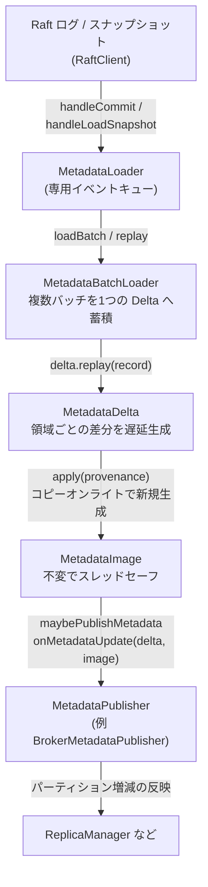

# 第19章 MetadataImage と Delta のブローカー反映

> **本章で読むソース**
>
> - [`metadata/src/main/java/org/apache/kafka/image/MetadataImage.java`](https://github.com/apache/kafka/blob/4.3.1/metadata/src/main/java/org/apache/kafka/image/MetadataImage.java)
> - [`metadata/src/main/java/org/apache/kafka/image/MetadataDelta.java`](https://github.com/apache/kafka/blob/4.3.1/metadata/src/main/java/org/apache/kafka/image/MetadataDelta.java)
> - [`metadata/src/main/java/org/apache/kafka/image/loader/MetadataLoader.java`](https://github.com/apache/kafka/blob/4.3.1/metadata/src/main/java/org/apache/kafka/image/loader/MetadataLoader.java)
> - [`metadata/src/main/java/org/apache/kafka/image/loader/MetadataBatchLoader.java`](https://github.com/apache/kafka/blob/4.3.1/metadata/src/main/java/org/apache/kafka/image/loader/MetadataBatchLoader.java)

## この章の狙い

KRaft では、クラスタメタデータの変更が `__cluster_metadata` という内部トピックのレコードとして表現される。
コントローラーがそのログにレコードを書き込み、ブローカーは自分のログレプリカを読み進めてレコードを1件ずつ適用し、トピック一覧やパーティション割り当て、設定、ACL といった状態を手元に再構築する。
本章では、ブローカーがこのメタデータログ（必要ならスナップショット）を再生し、レコードから不変のメタデータ像を組み立てて、その像を実際の動作へ反映させるまでの流れを追う。

中心となるのは3つの部品である。
第一に、ある時点のメタデータ全体を保持する不変オブジェクトの `MetadataImage` がある。
第二に、レコード列を受け取って差分を蓄積し、新しい `MetadataImage` を生成する `MetadataDelta` がある。
第三に、Raft のログとスナップショットのバッチを受け取り、`MetadataDelta` を組み立てて像を更新し、登録された購読者へ配る `MetadataLoader` がある。

## 前提

読者は、KRaft がクラスタメタデータを内部トピックのログとして管理すること、およびそのログをコントローラーが書きブローカーが読むという第1章の構図を把握しているものとする。
Raft クライアントがログのバッチとスナップショットをどう供給するかは前段の章の範囲であり、本章はブローカー側でそれらのバッチを受け取ってからの処理に絞る。
メタデータを反映する先の代表例は、パーティションのリーダーとフォロワーの割り当てを実際のレプリカ動作へ変換する `ReplicaManager` である。

## 不変オブジェクトとしての `MetadataImage`

**`MetadataImage`** は、ある1つのオフセットまでを再生し終えた時点でのクラスタメタデータ全体を表す。
その正体は Java の `record` であり、サブイメージ群を並べて保持するだけの構造を持つ。

[`metadata/src/main/java/org/apache/kafka/image/MetadataImage.java L31-L45`](https://github.com/apache/kafka/blob/4.3.1/metadata/src/main/java/org/apache/kafka/image/MetadataImage.java#L31-L45)

```java
public record MetadataImage(MetadataProvenance provenance, FeaturesImage features, ClusterImage cluster,
                            TopicsImage topics, ConfigurationsImage configs, ClientQuotasImage clientQuotas,
                            ProducerIdsImage producerIds, AclsImage acls, ScramImage scram,
                            DelegationTokenImage delegationTokens) {
    public static final MetadataImage EMPTY = new MetadataImage(
        MetadataProvenance.EMPTY,
        FeaturesImage.EMPTY,
        ClusterImage.EMPTY,
        TopicsImage.EMPTY,
        ConfigurationsImage.EMPTY,
        ClientQuotasImage.EMPTY,
        ProducerIdsImage.EMPTY,
        AclsImage.EMPTY,
        ScramImage.EMPTY,
        DelegationTokenImage.EMPTY);
```

クラスのコメントには「This class is thread-safe.」と明記されている。
メタデータをフィーチャーフラグ、クラスタ構成、トピック、設定、クライアントクォータ、プロデューサー ID、ACL、SCRAM 資格情報、委任トークンという領域ごとのサブイメージへ分割し、それぞれ専用の不変オブジェクトが担う。
先頭の `provenance` は、この像がどのオフセットとエポックまでを含むかという由来情報を持つ。

像は自分がどこまで再生済みかを外部へ示すメソッドを備える。

[`metadata/src/main/java/org/apache/kafka/image/MetadataImage.java L59-L65`](https://github.com/apache/kafka/blob/4.3.1/metadata/src/main/java/org/apache/kafka/image/MetadataImage.java#L59-L65)

```java
    public OffsetAndEpoch highestOffsetAndEpoch() {
        return new OffsetAndEpoch(provenance.lastContainedOffset(), provenance.lastContainedEpoch());
    }

    public long offset() {
        return provenance.lastContainedOffset();
    }
```

`write` メソッドは、像の全内容をサブイメージの順にライターへ書き出す。
これはスナップショットを生成するときや、新しい購読者へ現在の全状態を渡すときに使われる。

[`metadata/src/main/java/org/apache/kafka/image/MetadataImage.java L67-L80`](https://github.com/apache/kafka/blob/4.3.1/metadata/src/main/java/org/apache/kafka/image/MetadataImage.java#L67-L80)

```java
    public void write(ImageWriter writer, ImageWriterOptions options) {
        // Features should be written out first so we can include the metadata.version at the beginning of the
        // snapshot
        features.write(writer, options);
        cluster.write(writer, options);
        topics.write(writer, options);
        configs.write(writer);
        clientQuotas.write(writer);
        producerIds.write(writer);
        acls.write(writer);
        scram.write(writer, options);
        delegationTokens.write(writer, options);
        writer.close(true);
    }
```

フィーチャーを最初に書くのは、スナップショットの先頭で `metadata.version` を確定させるためだとコメントが述べている。
像そのものには状態を変更するメソッドがない。
一度作った `MetadataImage` の中身は書き換わらず、変更は常に新しい像の生成として表れる。

## 差分を蓄積する `MetadataDelta`

不変の像を直接書き換えられない以上、レコードの適用結果はどこかへ溜める必要がある。
その役割を持つのが **`MetadataDelta`** である。
`MetadataDelta` は基準となる像を1つ抱え、領域ごとの差分オブジェクトを必要になったときだけ生成する。

[`metadata/src/main/java/org/apache/kafka/image/MetadataDelta.java L72-L97`](https://github.com/apache/kafka/blob/4.3.1/metadata/src/main/java/org/apache/kafka/image/MetadataDelta.java#L72-L97)

```java
    private final MetadataImage image;

    private final SupportedConfigChecker supportedConfigChecker;

    private FeaturesDelta featuresDelta = null;

    private ClusterDelta clusterDelta = null;

    private TopicsDelta topicsDelta = null;

    // ... (中略) ...

    private MetadataDelta(MetadataImage image, SupportedConfigChecker supportedConfigChecker) {
        this.image = image;
        this.supportedConfigChecker = supportedConfigChecker;
    }
```

各領域の差分は初期値が `null` であり、その領域のレコードが最初に来たときに `getOrCreate...Delta()` で遅延生成される。

[`metadata/src/main/java/org/apache/kafka/image/MetadataDelta.java L125-L128`](https://github.com/apache/kafka/blob/4.3.1/metadata/src/main/java/org/apache/kafka/image/MetadataDelta.java#L125-L128)

```java
    public TopicsDelta getOrCreateTopicsDelta() {
        if (topicsDelta == null) topicsDelta = new TopicsDelta(image.topics());
        return topicsDelta;
    }
```

この遅延生成が効いてくる。
1つのバッチがトピック関連のレコードしか含まないなら、クラスタや ACL の差分オブジェクトは作られず `null` のまま残る。
後述の `apply` はその領域について基準の像のサブイメージをそのまま流用でき、変わっていない領域のコピーを避けられる。

### レコードを型で振り分ける `replay`

レコードの適用口は `replay(ApiMessage record)` である。
このメソッドはレコードの `apiKey` から種別を判定し、種別ごとの `replay` オーバーロードへ振り分ける。

[`metadata/src/main/java/org/apache/kafka/image/MetadataDelta.java L194-L214`](https://github.com/apache/kafka/blob/4.3.1/metadata/src/main/java/org/apache/kafka/image/MetadataDelta.java#L194-L214)

```java
    public void replay(ApiMessage record) {
        MetadataRecordType type = MetadataRecordType.fromId(record.apiKey());
        switch (type) {
            case REGISTER_BROKER_RECORD:
                replay((RegisterBrokerRecord) record);
                break;
            case UNREGISTER_BROKER_RECORD:
                replay((UnregisterBrokerRecord) record);
                break;
            case TOPIC_RECORD:
                replay((TopicRecord) record);
                break;
            case PARTITION_RECORD:
                replay((PartitionRecord) record);
                break;
            case CONFIG_RECORD:
                replay((ConfigRecord) record);
                break;
            case PARTITION_CHANGE_RECORD:
                replay((PartitionChangeRecord) record);
                break;
```

種別ごとの `replay` は、対応する領域の差分を取り出してそこへレコードを転送するだけの薄い委譲である。
たとえばトピック生成とパーティション生成はどちらもトピック差分へ流し込まれる。

[`metadata/src/main/java/org/apache/kafka/image/MetadataDelta.java L283-L289`](https://github.com/apache/kafka/blob/4.3.1/metadata/src/main/java/org/apache/kafka/image/MetadataDelta.java#L283-L289)

```java
    public void replay(TopicRecord record) {
        getOrCreateTopicsDelta().replay(record);
    }

    public void replay(PartitionRecord record) {
        getOrCreateTopicsDelta().replay(record);
    }
```

フィーチャーレベルの変更だけは扱いが重い。
`metadata.version` が動くと、既存メタデータのうち新バージョンで表現できないものを格下げする必要があるため、全領域の差分に対して格下げ判定を呼び出す。

[`metadata/src/main/java/org/apache/kafka/image/MetadataDelta.java L328-L341`](https://github.com/apache/kafka/blob/4.3.1/metadata/src/main/java/org/apache/kafka/image/MetadataDelta.java#L328-L341)

```java
    public void replay(FeatureLevelRecord record) {
        getOrCreateFeaturesDelta().replay(record);
        featuresDelta.metadataVersionChange().ifPresent(changedMetadataVersion -> {
            // If any feature flags change, need to immediately check if any metadata needs to be downgraded.
            getOrCreateClusterDelta().handleMetadataVersionChange(changedMetadataVersion);
            getOrCreateConfigsDelta().handleMetadataVersionChange(changedMetadataVersion);
            getOrCreateTopicsDelta().handleMetadataVersionChange(changedMetadataVersion);
            getOrCreateClientQuotasDelta().handleMetadataVersionChange(changedMetadataVersion);
            getOrCreateProducerIdsDelta().handleMetadataVersionChange(changedMetadataVersion);
            getOrCreateAclsDelta().handleMetadataVersionChange(changedMetadataVersion);
            getOrCreateScramDelta().handleMetadataVersionChange(changedMetadataVersion);
            getOrCreateDelegationTokenDelta().handleMetadataVersionChange(changedMetadataVersion);
        });
    }
```

### 差分から新しい像を生む `apply`

必要なレコードを溜め終えたら、`apply(MetadataProvenance provenance)` が新しい `MetadataImage` を1つ生成する。
このメソッドは領域ごとに、差分が存在すればそれを適用した新しいサブイメージを作り、差分が `null` なら基準の像のサブイメージをそのまま使い回す。

[`metadata/src/main/java/org/apache/kafka/image/MetadataDelta.java L387-L405`](https://github.com/apache/kafka/blob/4.3.1/metadata/src/main/java/org/apache/kafka/image/MetadataDelta.java#L387-L405)

```java
    public MetadataImage apply(MetadataProvenance provenance) {
        FeaturesImage newFeatures;
        if (featuresDelta == null) {
            newFeatures = image.features();
        } else {
            newFeatures = featuresDelta.apply();
        }
        ClusterImage newCluster;
        if (clusterDelta == null) {
            newCluster = image.cluster();
        } else {
            newCluster = clusterDelta.apply();
        }
        TopicsImage newTopics;
        if (topicsDelta == null) {
            newTopics = image.topics();
        } else {
            newTopics = topicsDelta.apply();
        }
```

全領域について新旧のサブイメージを揃えたら、最後にそれらと新しい由来情報から `MetadataImage` を組み立てて返す。

[`metadata/src/main/java/org/apache/kafka/image/MetadataDelta.java L442-L453`](https://github.com/apache/kafka/blob/4.3.1/metadata/src/main/java/org/apache/kafka/image/MetadataDelta.java#L442-L453)

```java
        return new MetadataImage(
            provenance,
            newFeatures,
            newCluster,
            newTopics,
            newConfigs,
            newClientQuotas,
            newProducerIds,
            newAcls,
            newScram,
            newDelegationTokens
        );
```

ここに本章の最適化の要点がある。
メタデータを「不変の像と差分」で表し、`apply` が既存の像に手を触れず新しい像を返すことで、コピーオンライトが成立する。
`MetadataImage` が `record` で状態を持たないため既存の像を参照するスレッドはその内容が書き換わる心配がなく、`apply` が別オブジェクトを返すため更新と参照が同じ領域を奪い合わない。
その結果、購読者や問い合わせ処理はロックなしで手元の像を読み続けられ、新しい像への差し替えは参照の1つの代入で済む。
変わっていない領域のサブイメージを差分越しに共有できるので、全体を丸ごと複製するより生成コストも小さい。

## バッチをまとめて適用する `MetadataBatchLoader`

Raft から届くコミットは複数のバッチを含む。
バッチごとに購読者へ通知していては通知回数が増えすぎるため、**`MetadataBatchLoader`** が複数バッチを1つの `MetadataDelta` へ溜め、通知の回数を抑える。
クラスのコメントも、レコードのバッチ化により `MetadataPublisher` の更新回数を減らすと述べている。

このクラスは基準の像へ状態を巻き戻す `resetToImage` を持つ。
差分を適用して像を進めた後や、スナップショットを読み込んだ後に、この初期化で新しい差分を作り直す。

[`metadata/src/main/java/org/apache/kafka/image/loader/MetadataBatchLoader.java L105-L119`](https://github.com/apache/kafka/blob/4.3.1/metadata/src/main/java/org/apache/kafka/image/loader/MetadataBatchLoader.java#L105-L119)

```java
    public final void resetToImage(MetadataImage image) {
        this.image = image;
        this.hasSeenRecord = !image.isEmpty();
        this.delta = new MetadataDelta.Builder()
            .setImage(image)
            .setSupportedConfigChecker(supportedConfigChecker)
            .build();
        this.transactionState = TransactionState.NO_TRANSACTION;
        this.lastOffset = image.provenance().lastContainedOffset();
        this.lastEpoch = image.provenance().lastContainedEpoch();
        this.lastContainedLogTimeMs = image.provenance().lastContainedLogTimeMs();
        this.numBytes = 0;
        this.numBatches = 0;
        this.totalBatchElapsedNs = 0;
    }
```

`loadBatch` は1バッチ分のレコードを1件ずつ差分へ再生し、読み込んだバイト数やバッチ数を記録する。
メタデータトランザクション（KIP-866）の途中でなければ、レコードは溜まり続け、通知はまとめて後回しになる。

[`metadata/src/main/java/org/apache/kafka/image/loader/MetadataBatchLoader.java L134-L147`](https://github.com/apache/kafka/blob/4.3.1/metadata/src/main/java/org/apache/kafka/image/loader/MetadataBatchLoader.java#L134-L147)

```java
    public long loadBatch(Batch<ApiMessageAndVersion> batch, LeaderAndEpoch leaderAndEpoch) {
        long startNs = time.nanoseconds();
        int indexWithinBatch = 0;

        lastContainedLogTimeMs = batch.appendTimestamp();
        lastEpoch = batch.epoch();

        for (ApiMessageAndVersion record : batch.records()) {
            try {
                replay(record);
            } catch (Throwable e) {
                faultHandler.handleFault("Error loading metadata log record from offset " +
                    (batch.baseOffset() + indexWithinBatch), e);
            }
```

溜めた差分の掃き出しは `maybeFlushBatches` が担う。
トランザクションの途中なら通知を見送り、トランザクションがなければ差分を適用して更新を配る。

[`metadata/src/main/java/org/apache/kafka/image/loader/MetadataBatchLoader.java L214-L223`](https://github.com/apache/kafka/blob/4.3.1/metadata/src/main/java/org/apache/kafka/image/loader/MetadataBatchLoader.java#L214-L223)

```java
            case ENDED_TRANSACTION:
            case NO_TRANSACTION:
                if (log.isDebugEnabled()) {
                    log.debug("handleCommit: Generated a metadata delta between {} and {} from {} batch(es) in {} us.",
                        image.offset(), manifest.provenance().lastContainedOffset(),
                        manifest.numBatches(), NANOSECONDS.toMicros(manifest.elapsedNs()));
                }
                applyDeltaAndUpdate(delta, manifest);
                break;
```

`applyDeltaAndUpdate` が差分から新しい像を生成し、購読者向けコールバックへ渡してから、自身の状態をその像へ巻き戻す。

[`metadata/src/main/java/org/apache/kafka/image/loader/MetadataBatchLoader.java L274-L287`](https://github.com/apache/kafka/blob/4.3.1/metadata/src/main/java/org/apache/kafka/image/loader/MetadataBatchLoader.java#L274-L287)

```java
    private void applyDeltaAndUpdate(MetadataDelta delta, LogDeltaManifest manifest) {
        try {
            image = delta.apply(manifest.provenance());
        } catch (Throwable e) {
            faultHandler.handleFault("Error generating new metadata image from " +
                "metadata delta between offset " + image.offset() +
                " and " + manifest.provenance().lastContainedOffset(), e);
        }

        // Whether we can apply the delta or not, we need to make sure the batch loader gets reset
        // to the image known to MetadataLoader
        callback.update(delta, image, manifest);
        resetToImage(image);
    }
```

## ログとスナップショットを束ねる `MetadataLoader`

**`MetadataLoader`** は Raft クライアントのリスナーであり、コミットとスナップショットの受け口になる。
クラスのコメントは、このローダーが `RaftClient` の変更を追い、購読者が消費できる差分と像に包むと述べている。
ローダーは専用スレッド（イベントキュー）を1本持ち、購読者へのすべてのコールバックをそのスレッドから直列に行う。

コンストラクタは現在の像を空の像で初期化し、`MetadataBatchLoader` を組み立てる。
バッチローダーへ渡すコールバックが、ローダー自身の `maybePublishMetadata` である。

[`metadata/src/main/java/org/apache/kafka/image/loader/MetadataLoader.java L227-L242`](https://github.com/apache/kafka/blob/4.3.1/metadata/src/main/java/org/apache/kafka/image/loader/MetadataLoader.java#L227-L242)

```java
        this.uninitializedPublishers = new LinkedHashMap<>();
        this.publishers = new LinkedHashMap<>();
        this.image = MetadataImage.EMPTY;
        this.batchLoader = new MetadataBatchLoader(
            logContext,
            time,
            faultHandler,
            this::maybePublishMetadata,
            supportedConfigChecker);
        this.eventQueue = new KafkaEventQueue(
            time,
            logContext,
            threadNamePrefix + "metadata-loader-",
            new ShutdownEvent(),
            metrics::updateIdleTime);
```

### ログのコミットを処理する `handleCommit`

`handleCommit` は、リーダーがコミット済みと確定させたログのバッチ列を受け取る。
処理はイベントキューへ積まれ、キューのスレッド上でバッチを1つずつバッチローダーへ渡す。
すべてのバッチを渡し終えたら `maybeFlushBatches` を呼び、溜めた差分を掃き出す。

[`metadata/src/main/java/org/apache/kafka/image/loader/MetadataLoader.java L396-L413`](https://github.com/apache/kafka/blob/4.3.1/metadata/src/main/java/org/apache/kafka/image/loader/MetadataLoader.java#L396-L413)

```java
    public void handleCommit(BatchReader<ApiMessageAndVersion> reader) {
        eventQueue.append(() -> {
            try (reader) {
                while (reader.hasNext()) {
                    Batch<ApiMessageAndVersion> batch = reader.next();
                    loadControlRecords(batch);
                    long elapsedNs = batchLoader.loadBatch(batch, currentLeaderAndEpoch);
                    metrics.updateBatchSize(batch.records().size());
                    metrics.updateBatchProcessingTimeNs(elapsedNs);
                }
                batchLoader.maybeFlushBatches(currentLeaderAndEpoch, true);
            } catch (Throwable e) {
                // ... (中略) ...
                faultHandler.handleFault("Unhandled fault in MetadataLoader#handleCommit. " +
                        "Last image offset was " + image.offset(), e);
            }
        });
    }
```

### スナップショットを処理する `handleLoadSnapshot`

ブローカーがログの先頭より古い位置から追い付くときや、遅れを取り戻すときには、スナップショットの読み込みが走る。
`handleLoadSnapshot` は現在の像を基準に差分を作り、スナップショットの全レコードを再生してから新しい像を確定させる。

[`metadata/src/main/java/org/apache/kafka/image/loader/MetadataLoader.java L417-L435`](https://github.com/apache/kafka/blob/4.3.1/metadata/src/main/java/org/apache/kafka/image/loader/MetadataLoader.java#L417-L435)

```java
    public void handleLoadSnapshot(SnapshotReader<ApiMessageAndVersion> reader) {
        eventQueue.append(() -> {
            try {
                long numLoaded = metrics.incrementHandleLoadSnapshotCount();
                String snapshotName = Snapshots.filenameFromSnapshotId(reader.snapshotId());
                // ... (中略) ...
                MetadataDelta delta = new MetadataDelta.Builder().
                    setImage(image).
                    setSupportedConfigChecker(supportedConfigChecker).
                    build();
                SnapshotManifest manifest = loadSnapshot(delta, reader);
                // ... (中略) ...
                MetadataImage image = delta.apply(manifest.provenance());
                batchLoader.resetToImage(image);
                maybePublishMetadata(delta, image, manifest);
            } catch (Throwable e) {
```

`loadSnapshot` はスナップショットの各バッチのレコードを差分へ再生し、最後に `finishSnapshot` を呼ぶ。
スナップショットは特定時点の全状態を丸ごと持つため、基準の像にあってスナップショットに現れなかったものは削除として扱う必要がある。
`finishSnapshot` はその削除差分を各領域に作らせる役割を持つ。

[`metadata/src/main/java/org/apache/kafka/image/loader/MetadataLoader.java L468-L483`](https://github.com/apache/kafka/blob/4.3.1/metadata/src/main/java/org/apache/kafka/image/loader/MetadataLoader.java#L468-L483)

```java
        while (reader.hasNext()) {
            Batch<ApiMessageAndVersion> batch = reader.next();
            loadControlRecords(batch);
            for (ApiMessageAndVersion record : batch.records()) {
                try {
                    delta.replay(record.message());
                } catch (Throwable e) {
                    faultHandler.handleFault("Error loading metadata log record " + snapshotIndex +
                            " in snapshot at offset " + reader.lastContainedLogOffset(), e);
                }
                snapshotIndex++;
            }
        }
        delta.finishSnapshot();
```

### 購読者へ配る `maybePublishMetadata`

差分と新しい像がそろうと、`maybePublishMetadata` が現在の像を差し替え、登録済みの各購読者へ `onMetadataUpdate` を呼ぶ。
ただし初期の追い付き中は通知を抑え、High Watermark へ追い付いてから配り始める。

[`metadata/src/main/java/org/apache/kafka/image/loader/MetadataLoader.java L349-L370`](https://github.com/apache/kafka/blob/4.3.1/metadata/src/main/java/org/apache/kafka/image/loader/MetadataLoader.java#L349-L370)

```java
    private void maybePublishMetadata(MetadataDelta delta, MetadataImage image, LoaderManifest manifest) {
        this.image = image;

        if (stillNeedToCatchUp(
            "maybePublishMetadata(" + manifest.type().toString() + ")",
            manifest.provenance().lastContainedOffset())
        ) {
            return;
        }

        // ... (中略) ...
        for (MetadataPublisher publisher : publishers.values()) {
            try {
                publisher.onMetadataUpdate(delta, image, manifest);
            } catch (Throwable e) {
                faultHandler.handleFault("Unhandled error publishing the new metadata " +
                    "image ending at " + manifest.provenance().lastContainedOffset() +
                    " with publisher " + publisher.name(), e);
            }
        }
```

ブローカー側で登録される購読者の代表が、メタデータの変更をレプリカの実動作へ橋渡しする `BrokerMetadataPublisher` である。
この購読者は差分の中身を見て、追加や削除されたパーティションを `ReplicaManager` へ伝え、リーダーとフォロワーの割り当てを実際のログとフェッチャーへ反映させる。

差分と像を両方渡すのには意味がある。
購読者は、変わった部分だけを知りたいときは差分を読めば足り、全体像が必要なときは像を参照できる。
たとえばパーティションの増減という差分は `ReplicaManager` への指示に直結し、像は現在の完全な割り当てを引く参照元になる。

### 新しい購読者への追い付き配布

購読者は運用中に動的に足せる。
`installPublishers` は新しい購読者を未初期化の一覧へ入れ、初期化イベントを予約する。

[`metadata/src/main/java/org/apache/kafka/image/loader/MetadataLoader.java L545-L551`](https://github.com/apache/kafka/blob/4.3.1/metadata/src/main/java/org/apache/kafka/image/loader/MetadataLoader.java#L545-L551)

```java
                // After installation, new publishers must be initialized by sending them a full
                // snapshot of the current state. However, we cannot necessarily do that immediately,
                // because the loader itself might not be ready. Therefore, we schedule a background
                // task.
                newPublishers.forEach(p -> uninitializedPublishers.put(p.name(), p));
                scheduleInitializeNewPublishers(0);
                future.complete(null);
```

初期化では、空の像を基準にした差分に現在の像の全内容を書き出し、追い付き用の差分を作る。
新しい購読者はこの差分と現在の像を1回で受け取り、過去のレコードを再生し直さずに現状へ追い付ける。

[`metadata/src/main/java/org/apache/kafka/image/loader/MetadataLoader.java L311-L332`](https://github.com/apache/kafka/blob/4.3.1/metadata/src/main/java/org/apache/kafka/image/loader/MetadataLoader.java#L311-L332)

```java
        // We base this delta off of the empty image, reflecting the fact that these publishers
        // haven't seen anything previously.
        MetadataDelta delta = new MetadataDelta.Builder().
                setImage(MetadataImage.EMPTY).
                setSupportedConfigChecker(supportedConfigChecker).
                build();
        ImageReWriter writer = new ImageReWriter(delta);
        image.write(writer, new ImageWriterOptions.Builder(image.features().metadataVersionOrThrow()).
                setEligibleLeaderReplicasEnabled(image.features().isElrEnabled()).
                build());
        // ... (中略) ...
        for (Iterator<MetadataPublisher> iter = uninitializedPublishers.values().iterator();
                iter.hasNext(); ) {
            MetadataPublisher publisher = iter.next();
            iter.remove();
            try {
                log.info("InitializeNewPublishers: initializing {} with a snapshot at offset {}",
                        publisher.name(), image.highestOffsetAndEpoch().offset());
                publisher.onMetadataUpdate(delta, image, manifest);
                publisher.onControllerChange(currentLeaderAndEpoch);
                publishers.put(publisher.name(), publisher);
```

## 全体の流れ

ここまでの部品を、レコードが到着してからブローカーの動作へ反映されるまでの流れとしてまとめる。



コントローラーが書いたレコードは Raft のログを通じてブローカーへ届く。
ブローカーの `MetadataLoader` はそれを専用スレッドで受け、`MetadataBatchLoader` が複数バッチを1つの差分へ溜める。
差分は `apply` でコピーオンライトの新しい像を生み、その像が購読者へ配られ、`BrokerMetadataPublisher` を経て `ReplicaManager` などがレプリカの実動作を更新する。

## まとめ

本章では、ブローカーが KRaft メタデータログを再生してクラスタメタデータを手元に再構築する仕組みを追った。
`MetadataImage` は領域ごとのサブイメージを束ねる不変の `record` であり、状態を書き換えるメソッドを持たない。
`MetadataDelta` はレコードを型で振り分けて領域ごとの差分に蓄積し、`apply` で新しい像を生成する。
変わらない領域は基準の像のサブイメージを使い回すため、更新のコストは変更のあった領域に限られる。

この設計の核心は、不変の像と差分によるコピーオンライトである。
像が書き換わらず `apply` が別オブジェクトを返すことで、購読者や問い合わせ処理はロックなしで手元の像を安全に読み続けられ、更新側と参照側が同じ領域を奪い合わない。
`MetadataLoader` はこの像の生成と配布を専用スレッドで直列に行い、`MetadataBatchLoader` が複数バッチを1つの差分へまとめて購読者への通知回数を抑える。
配られた像と差分は `BrokerMetadataPublisher` を通じて `ReplicaManager` などに渡り、クラスタメタデータの変更がレプリカの実動作へ反映される。

## 関連する章

- 第1章 [Kafka のアーキテクチャと KRaft 時代のブローカー起動](../part00-overview/01-architecture-kraft.md)
- 第18章 [QuorumController とメタデータログ](18-quorum-controller.md)（コントローラーがどのようにレコードを書き出すか）
- 第14章 [ReplicaManagerによるproduceとfetch](../part04-replication/14-replicamanager.md)（配られたメタデータがどのようにレプリカ動作へ反映されるか）
