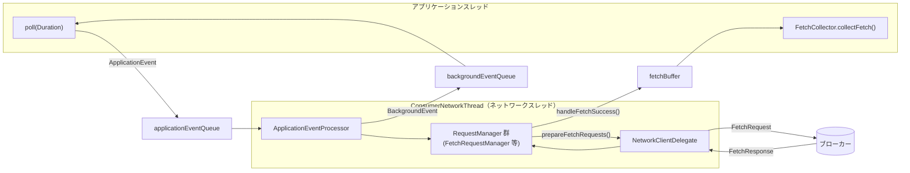

# 第20章 AsyncKafkaConsumer とフェッチパイプライン

> **本章で読むソース**
>
> - [`clients/src/main/java/org/apache/kafka/clients/consumer/internals/AsyncKafkaConsumer.java`](https://github.com/apache/kafka/blob/4.3.1/clients/src/main/java/org/apache/kafka/clients/consumer/internals/AsyncKafkaConsumer.java)
> - [`clients/src/main/java/org/apache/kafka/clients/consumer/internals/ConsumerNetworkThread.java`](https://github.com/apache/kafka/blob/4.3.1/clients/src/main/java/org/apache/kafka/clients/consumer/internals/ConsumerNetworkThread.java)
> - [`clients/src/main/java/org/apache/kafka/clients/consumer/internals/AbstractFetch.java`](https://github.com/apache/kafka/blob/4.3.1/clients/src/main/java/org/apache/kafka/clients/consumer/internals/AbstractFetch.java)
> - [`clients/src/main/java/org/apache/kafka/clients/consumer/internals/FetchRequestManager.java`](https://github.com/apache/kafka/blob/4.3.1/clients/src/main/java/org/apache/kafka/clients/consumer/internals/FetchRequestManager.java)
> - [`clients/src/main/java/org/apache/kafka/clients/consumer/internals/FetchCollector.java`](https://github.com/apache/kafka/blob/4.3.1/clients/src/main/java/org/apache/kafka/clients/consumer/internals/FetchCollector.java)

## この章の狙い

第4章では、ブローカー側で1つのリクエストが `KafkaApis` に届いてから応答するまでの経路を追った。
本章では視点を反転し、コンシューマーがそのフェッチリクエストをどう組み立て、応答をどう記録の集合として使用側へ返すかを追う。

4.3.1 の `KafkaConsumer` は KIP-848 世代の**AsyncKafkaConsumer**を実体として使う。
この実装は、ユーザーが呼び出す `poll()` を実行する**アプリケーションスレッド**と、ブローカーとの通信を担う**ネットワークスレッド**を分離している。
両者は共有のキューとバッファだけを介してやり取りし、直接メソッドを呼び合わない。
この分離がどう実現され、フェッチしたレコードがどうアプリケーションスレッドまで届くかを、コードに沿って追う。

## 前提

第4章（[`../part01-network/04-kafkaapis.md`](../part01-network/04-kafkaapis.md)）で見た `KafkaApis.handleFetchRequest` は、ブローカー側でフェッチリクエストを処理する経路だった。
本章はその対向にあるクライアント側、すなわちフェッチリクエストを生成し応答を受け取るコンシューマー側を扱う。
第21章（[`21-group-coordinator.md`](21-group-coordinator.md)）で扱うグループコーディネーターとのハートビートやリバランスも、本章と同じアプリケーションスレッド/ネットワークスレッドの構図の上に乗っている。

## 2つのスレッドとイベントキュー

`AsyncKafkaConsumer` のコンストラクタは、アプリケーションスレッドとネットワークスレッドの間でやり取りする3つの共有オブジェクトを組み立てる。

[`clients/src/main/java/org/apache/kafka/clients/consumer/internals/AsyncKafkaConsumer.java L508-L516`](https://github.com/apache/kafka/blob/4.3.1/clients/src/main/java/org/apache/kafka/clients/consumer/internals/AsyncKafkaConsumer.java#L508-L516)

```java
            final BlockingQueue<ApplicationEvent> applicationEventQueue = new LinkedBlockingQueue<>();
            this.backgroundEventHandler = new BackgroundEventHandler(
                backgroundEventQueue,
                time,
                asyncConsumerMetrics
            );

            // This FetchBuffer is shared between the application and network threads.
            this.fetchBuffer = new FetchBuffer(logContext);
```

- `applicationEventQueue`：アプリケーションスレッドがネットワークスレッドへ指示を送るキュー。要素は `ApplicationEvent`（購読変更、コミット、フェッチ要求の作成指示など）である。
- `backgroundEventQueue`：ネットワークスレッドがアプリケーションスレッドへ結果やエラーを返すキュー。要素は `BackgroundEvent` である。
- `fetchBuffer`：ネットワークスレッドが受信したフェッチ応答を溜め、アプリケーションスレッドが読み出す**フェッチバッファ**。キューとは異なり、レコードそのものを保持する。

この3つのオブジェクトは、`ApplicationEventHandler`（`applicationEventQueue` をラップしたもの）と `ConsumerNetworkThread` の両方から参照される形でコンストラクタに渡される。
一方のスレッドがもう一方のメソッドを直接呼ぶことはなく、常にこの3つの共有オブジェクトを経由する。

以下は、`poll()` が発行する `ApplicationEvent` がネットワークスレッドで処理され、フェッチ応答が `fetchBuffer` 経由でアプリケーションスレッドに戻る流れである。



## poll() の内側

`poll(Duration)` は、内部的に `do`-`while` ループでフェッチ結果が得られるかタイムアウトするまで繰り返す。

[`clients/src/main/java/org/apache/kafka/clients/consumer/internals/AsyncKafkaConsumer.java L924-L973`](https://github.com/apache/kafka/blob/4.3.1/clients/src/main/java/org/apache/kafka/clients/consumer/internals/AsyncKafkaConsumer.java#L924-L973)

```java
    @Override
    public ConsumerRecords<K, V> poll(final Duration timeout) {
        Timer timer = time.timer(timeout);

        acquireAndEnsureOpen();
        try {
            kafkaConsumerMetrics.recordPollStart(timer.currentTimeMs());

            if (subscriptions.hasNoSubscriptionOrUserAssignment()) {
                throw new IllegalStateException("Consumer is not subscribed to any topics or assigned any partitions");
            }

            // This distinguishes the first pass of the inner do/while loop from subsequent passes for the
            // inflight poll event logic.
            boolean firstPass = true;

            do {
                // We must not allow wake-ups between polling for fetches and returning the records.
                // If the polled fetches are not empty the consumed position has already been updated in the polling
                // of the fetches. A wakeup between returned fetches and returning records would lead to never
                // returning the records in the fetches. Thus, we trigger a possible wake-up before we poll fetches.
                wakeupTrigger.maybeTriggerWakeup();

                checkInflightPoll(timer, firstPass);
                firstPass = false;
                final Fetch<K, V> fetch = pollForFetches(timer);
                if (!fetch.isEmpty()) {
                    // before returning the fetched records, we can send off the next round of fetches
                    // and avoid block waiting for their responses to enable pipelining while the user
                    // is handling the fetched records.
                    //
                    // NOTE: since the consumed position has already been updated, we must not allow
                    // wakeups or any other errors to be triggered prior to returning the fetched records.
                    sendPrefetches(timer);

                    if (fetch.records().isEmpty()) {
                        log.trace("Returning empty records from `poll()` "
                            + "since the consumer's position has advanced for at least one topic partition");
                    }

                    return interceptors.onConsume(new ConsumerRecords<>(fetch.records(), fetch.nextOffsets()));
                }
                // We will wait for retryBackoffMs
            } while (timer.notExpired());

            return ConsumerRecords.empty();
        } finally {
            kafkaConsumerMetrics.recordPollEnd(timer.currentTimeMs());
            release();
        }
    }
```

`checkInflightPoll` は、購読状態のチェックやリバランスの反映など、その回の `poll()` に紐づく非同期処理（`AsyncPollEvent`）を `applicationEventHandler` 経由でネットワークスレッドに投入し、完了を待つ。
その後 `pollForFetches` が実際にレコードの取得を試みる。

## fetchBuffer からレコードを取り出す

`pollForFetches` は、まず既にバッファ済みのデータがないかを確認し、なければ `fetchBuffer` にデータが届くまで待つ。

[`clients/src/main/java/org/apache/kafka/clients/consumer/internals/AsyncKafkaConsumer.java L1964-L2017`](https://github.com/apache/kafka/blob/4.3.1/clients/src/main/java/org/apache/kafka/clients/consumer/internals/AsyncKafkaConsumer.java#L1964-L2017)

```java
    private Fetch<K, V> pollForFetches(Timer timer) {

        // if data is available already, return it immediately
        final Fetch<K, V> fetch = collectFetch();
        if (!fetch.isEmpty()) {
            return fetch;
        }

        long pollTimeout = isCommittedOffsetsManagementEnabled()
                ? Math.min(applicationEventHandler.maximumTimeToWait(), timer.remainingMs())
                : timer.remainingMs();
        // With the non-blocking poll design, it's possible that at this point the background thread is
        // concurrently working to update positions. Therefore, a _copy_ of the current assignment is retrieved
        // and iterated looking for any partitions with invalid positions. This is done to avoid being stuck
        // in poll for an unnecessarily long amount of time if we are missing some positions since the offset
        // lookup may be backing off after a failure.
        if (pollTimeout > retryBackoffMs) {
            Set<TopicPartition> partitions = subscriptions.assignedPartitions();

            if (partitions.isEmpty()) {
                // If there aren't any assigned partitions, this could mean that this consumer's group membership
                // has not been established or assignments have been removed and not yet reassigned. In either case,
                // reduce the poll time for the fetch buffer wait.
                pollTimeout = retryBackoffMs;
            } else {
                for (TopicPartition tp : partitions) {
                    if (!subscriptions.hasValidPosition(tp)) {
                        pollTimeout = retryBackoffMs;
                        break;
                    }
                }
            }
        }

        log.trace("Polling for fetches with timeout {}", pollTimeout);

        Timer pollTimer = time.timer(pollTimeout);
        wakeupTrigger.setFetchAction(fetchBuffer);

        // Wait a bit for some fetched data to arrive, as there may not be anything immediately available. Note the
        // use of a shorter, dedicated "pollTimer" here which updates "timer" so that calling method (poll) will
        // correctly handle the overall timeout.
        try {
            fetchBuffer.awaitWakeup(pollTimer);
        } catch (InterruptException e) {
            log.trace("Interrupt during fetch", e);
            throw e;
        } finally {
            timer.update(pollTimer.currentTimeMs());
            wakeupTrigger.clearTask();
        }

        return collectFetch();
    }
```

`fetchBuffer.awaitWakeup(pollTimer)` は、ネットワークスレッドがフェッチ応答を `fetchBuffer` に追加したときの通知（後述する `fetchBuffer.wakeup()`）を待つ。
アプリケーションスレッドはここでブロックするが、ブロックしている間もネットワークスレッドは独立して動き続けており、他のリクエスト（ハートビートやメタデータ更新など）を並行して処理できる。

データが揃うと `collectFetch()` を呼び、実体の取り出しを `fetchCollector.collectFetch(fetchBuffer)` に委ねる。

[`clients/src/main/java/org/apache/kafka/clients/consumer/internals/AsyncKafkaConsumer.java L2025-L2066`](https://github.com/apache/kafka/blob/4.3.1/clients/src/main/java/org/apache/kafka/clients/consumer/internals/AsyncKafkaConsumer.java#L2025-L2066)

```java
    private Fetch<K, V> collectFetch() {
        // Do not return buffered records if the background hasn't checked for pending reconciliations
        // for the inflight poll event.
        // This is key because partitions may need revocation, so we need to wait for the reconciliation check
        // that triggers commits and marks partitions as pending revocation, before we can
        // safely collect records from the buffer.
        if (hasPendingReconciliation && inflightPoll != null && !inflightPoll.isReconciliationCheckComplete()) {
            // If the background hasn't had the time to check for pending reconciliation,
            // we need to wait for that check before moving on (instead of returning empty right away,
            // which will lead to blocking on buffer data)
            long timeoutMs = inflightPoll.deadlineMs() - time.milliseconds();
            if (timeoutMs > 0) {
                try {
                    wakeupTrigger.setActiveTask(inflightPoll.reconciliationCheckFuture());
                    ConsumerUtils.getResult(inflightPoll.reconciliationCheckFuture(), timeoutMs);
                } catch (TimeoutException e) {
                    return Fetch.empty();
                } finally {
                    wakeupTrigger.clearTask();
                }
            } else {
                // No time to wait and reconciliation check not complete
                return Fetch.empty();
            }
        }

        // With the non-blocking async poll, it's critical that the application thread wait until the background
        // thread has completed the stage of validating positions. This prevents a race condition where both
        // threads may attempt to update the SubscriptionState.position() for a given partition. So if the background
        // thread has not completed that stage for the inflight event, don't attempt to collect data from the fetch
        // buffer. If the inflight event was nulled out by checkInflightPoll(), that implies that it is safe to
        // attempt to collect data from the fetch buffer.
        if (positionsValidator.canSkipUpdateFetchPositions()) {
            return fetchCollector.collectFetch(fetchBuffer);
        }

        if (inflightPoll != null && !inflightPoll.isValidatePositionsComplete()) {
            return Fetch.empty();
        }

        return fetchCollector.collectFetch(fetchBuffer);
    }
```

ここで「リバランスの反映待ち」と「オフセット位置の検証待ち」を先に確認しているのは、`SubscriptionState` の消費位置がアプリケーションスレッドとネットワークスレッドの双方から更新されうるためである。
両者が同じパーティションの位置を同時に書き換える競合を避けるため、ネットワークスレッド側の処理が終わるまでアプリケーションスレッドはバッファの読み出しを控える。

## ネットワークスレッドの1周（runOnce）

`ConsumerNetworkThread` はイベント駆動のループを回す専用スレッドであり、1回のループ（`runOnce`）で次の3段階を実行する。

[`clients/src/main/java/org/apache/kafka/clients/consumer/internals/ConsumerNetworkThread.java L210-L242`](https://github.com/apache/kafka/blob/4.3.1/clients/src/main/java/org/apache/kafka/clients/consumer/internals/ConsumerNetworkThread.java#L210-L242)

```java
    void runOnce() {
        // The following code avoids use of the Java Collections Streams API to reduce overhead in this loop.
        processApplicationEvents();

        final long currentTimeMs = time.milliseconds();
        if (lastPollTimeMs != 0L) {
            asyncConsumerMetrics.recordTimeBetweenNetworkThreadPoll(currentTimeMs - lastPollTimeMs);
        }
        lastPollTimeMs = currentTimeMs;

        long pollWaitTimeMs = MAX_POLL_TIMEOUT_MS;

        for (RequestManager rm : requestManagers.entries()) {
            NetworkClientDelegate.PollResult pollResult = rm.poll(currentTimeMs);
            long timeoutMs = networkClientDelegate.addAll(pollResult);
            pollWaitTimeMs = Math.min(pollWaitTimeMs, timeoutMs);
        }

        networkClientDelegate.poll(pollWaitTimeMs, currentTimeMs);

        long maxTimeToWaitMs = Long.MAX_VALUE;

        for (RequestManager rm : requestManagers.entries()) {
            long waitMs = rm.maximumTimeToWait(currentTimeMs);
            maxTimeToWaitMs = Math.min(maxTimeToWaitMs, waitMs);
        }

        cachedMaximumTimeToWait = maxTimeToWaitMs;

        reapExpiredApplicationEvents(currentTimeMs);
        List<CompletableEvent<?>> uncompletedEvents = applicationEventReaper.uncompletedEvents();
        maybeFailOnMetadataError(uncompletedEvents);
    }
```

1. `processApplicationEvents()` で `applicationEventQueue` から溜まった `ApplicationEvent` をまとめて取り出し、`ApplicationEventProcessor` に処理させる。
2. `RequestManager` の一覧（フェッチ、ハートビート、オフセットコミットなど機能ごとに分かれた管理オブジェクト）を順に `poll` し、送信すべきリクエストを集める。フェッチ用の `RequestManager` が `FetchRequestManager` であり、これが `AbstractFetch` を継承する。
3. 集めたリクエストを `networkClientDelegate.poll` に渡し、実際のソケット I/O（送信・受信）を1回分行う。

`RequestManager` が複数種類存在し、それぞれが独立に「次にいつ起こされたいか」（`maximumTimeToWait`）を返す設計により、1本のネットワークスレッドと1個の `NetworkClient` だけでフェッチ・ハートビート・コミットなど種類の異なるリクエストを多重化できる。
第4章で見たブローカー側の `RequestChannel` が複数の `KafkaRequestHandler` にリクエストを配るのと対になる構図であり、こちらはクライアント側で複数の関心事を1つの I/O ループに集約する。

## フェッチリクエストの組み立て

`FetchRequestManager.poll` は `AbstractFetch.prepareFetchRequests` を呼び、まだフェッチしていないパーティションの一覧からノードごとのフェッチリクエストを組み立てる。

[`clients/src/main/java/org/apache/kafka/clients/consumer/internals/AbstractFetch.java L417-L488`](https://github.com/apache/kafka/blob/4.3.1/clients/src/main/java/org/apache/kafka/clients/consumer/internals/AbstractFetch.java#L417-L488)

```java
    /**
     * Create fetch requests for all nodes for which we have assigned partitions
     * that have no existing requests in flight.
     */
    protected Map<Node, FetchSessionHandler.FetchRequestData> prepareFetchRequests() {
        // Update metrics in case there was an assignment change
        metricsManager.maybeUpdateAssignment(subscriptions);

        Map<Node, FetchSessionHandler.Builder> fetchable = new HashMap<>();
        long currentTimeMs = time.milliseconds();
        Map<String, Uuid> topicIds = metadata.topicIds();

        // This is the set of partitions that have buffered data
        Set<TopicPartition> buffered = Collections.unmodifiableSet(fetchBuffer.bufferedPartitions());

        // This is the list of partitions that are fetchable and have no buffered data
        List<TopicPartition> unbuffered = fetchablePartitions(buffered);

        if (unbuffered.isEmpty()) {
            // If there are no partitions that don't already have data locally buffered, there's no need to issue
            // any fetch requests at the present time.
            return Collections.emptyMap();
        }

        Set<Integer> bufferedNodes = bufferedNodes(buffered, currentTimeMs);

        for (TopicPartition partition : unbuffered) {
            SubscriptionState.FetchPosition position = positionForPartition(partition);
            Optional<Node> nodeOpt = maybeNodeForPosition(partition, position, currentTimeMs);

            if (nodeOpt.isEmpty())
                continue;

            Node node = nodeOpt.get();

            if (isUnavailable(node)) {
                maybeThrowAuthFailure(node);

                // If we try to send during the reconnect backoff window, then the request is just
                // going to be failed anyway before being sent, so skip sending the request for now
                log.trace("Skipping fetch for partition {} because node {} is awaiting reconnect backoff", partition, node);
            } else if (nodesWithPendingFetchRequests.contains(node.id())) {
                // If there's already an inflight request for this node, don't issue another request.
                log.trace("Skipping fetch for partition {} because previous request to {} has not been processed", partition, node);
            } else if (bufferedNodes.contains(node.id())) {
                // While a node has buffered data, don't fetch other partition data from it. Because the buffered
                // partitions are not included in the fetch request, those partitions will be inadvertently dropped
                // from the broker fetch session cache. In some cases, that could lead to the entire fetch session
                // being evicted.
                log.trace("Skipping fetch for partition {} because its leader node {} hosts buffered partitions", partition, node);
            } else {
                // if there is a leader and no in-flight requests, issue a new fetch
                FetchSessionHandler.Builder builder = fetchable.computeIfAbsent(node, k -> {
                    FetchSessionHandler fetchSessionHandler = sessionHandlers.computeIfAbsent(node.id(), n -> new FetchSessionHandler(logContext, n));
                    return fetchSessionHandler.newBuilder();
                });
                Uuid topicId = topicIds.getOrDefault(partition.topic(), Uuid.ZERO_UUID);
                FetchRequest.PartitionData partitionData = new FetchRequest.PartitionData(topicId,
                        position.offset,
                        FetchRequest.INVALID_LOG_START_OFFSET,
                        fetchConfig.fetchSize,
                        position.currentLeader.epoch,
                        Optional.empty());
                builder.add(partition, partitionData);

                log.debug("Added {} fetch request for partition {} at position {} to node {}", fetchConfig.isolationLevel,
                        partition, position, node);
            }
        }

        return convert(fetchable);
    }
```

対象となるパーティションは、`subscriptions.fetchablePartitions` で得られる購読中パーティションから、既に `fetchBuffer` にデータが積まれているものを除いたものに限る（`fetchablePartitions` メソッド。[`AbstractFetch.java L346-L353`](https://github.com/apache/kafka/blob/4.3.1/clients/src/main/java/org/apache/kafka/clients/consumer/internals/AbstractFetch.java#L346-L353)）。
ユーザーがまだ処理していないデータを抱えたまま追加のフェッチを出さないことで、無駄なメモリ使用と、既に埋まっているバッファへ応答を書き込む競合を避ける。

さらに、ノード単位で「フェッチ中のリクエストがある」「そのノードにバッファ済みデータがある」パーティションを丸ごとスキップしている。
1ノードにつき同時に1つのフェッチリクエストしか送らないのは、ブローカー側が管理する**フェッチセッション**（差分のみをやり取りするキャッシュ機構）の整合性を保つためであり、同一ノードへの重複リクエストがセッションキャッシュを壊すのを防ぐ。

実際にブローカーへ送るリクエストは `createFetchRequest` で組み立てられる。

[`clients/src/main/java/org/apache/kafka/clients/consumer/internals/AbstractFetch.java L310-L323`](https://github.com/apache/kafka/blob/4.3.1/clients/src/main/java/org/apache/kafka/clients/consumer/internals/AbstractFetch.java#L310-L323)

```java
    protected FetchRequest.Builder createFetchRequest(final Node fetchTarget,
                                                      final FetchSessionHandler.FetchRequestData requestData) {
        // Version 12 is the maximum version that could be used without topic IDs. See FetchRequest.json for schema
        // changelog.
        final short maxVersion = requestData.canUseTopicIds() ? ApiKeys.FETCH.latestVersion() : (short) 12;

        final FetchRequest.Builder request = FetchRequest.Builder
                .forConsumer(maxVersion, fetchConfig.maxWaitMs, fetchConfig.minBytes, requestData.toSend())
                .isolationLevel(fetchConfig.isolationLevel)
                .setMaxBytes(fetchConfig.maxBytes)
                .metadata(requestData.metadata())
                .removed(requestData.toForget())
                .replaced(requestData.toReplace())
                .rackId(fetchConfig.clientRackId);
```

`fetchConfig.maxWaitMs` と `fetchConfig.minBytes` は、それぞれ設定 `fetch.max.wait.ms` と `fetch.min.bytes` から作られる（[`FetchConfig.java L82-L84`](https://github.com/apache/kafka/blob/4.3.1/clients/src/main/java/org/apache/kafka/clients/consumer/internals/FetchConfig.java#L82-L84)）。
このリクエストを受け取ったブローカーは、バッファに `minBytes` 分のデータが溜まるか `maxWaitMs` が経過するまで応答を遅らせる（**プリフェッチ**の待ち合わせ条件）。
これにより、コンシューマーは小さなレコードが届くたびに往復するのではなく、ある程度まとまった量を1回のリクエストで受け取れる。

## 応答をバッファへ、バッファからレコードへ

ブローカーからの応答は `handleFetchSuccess` で処理され、パーティションごとに `CompletedFetch` として `fetchBuffer` に積まれる。

[`clients/src/main/java/org/apache/kafka/clients/consumer/internals/AbstractFetch.java L217-L232`](https://github.com/apache/kafka/blob/4.3.1/clients/src/main/java/org/apache/kafka/clients/consumer/internals/AbstractFetch.java#L217-L232)

```java
                CompletedFetch completedFetch = new CompletedFetch(
                        completedFetchLog,
                        subscriptions,
                        decompressionBufferSupplier,
                        partition,
                        partitionData,
                        metricAggregator,
                        fetchOffset);
                fetchBuffer.add(completedFetch);
                needsWakeup = false;
            }

            // "Wake" the fetch buffer on any response, even if it's empty, to allow the consumer to not block
            // indefinitely waiting on the fetch buffer to get data.
            if (needsWakeup)
                fetchBuffer.wakeup();
```

この `fetchBuffer.add` と `fetchBuffer.wakeup()` の呼び出しがネットワークスレッド側で行われ、アプリケーションスレッドの `pollForFetches` で待っている `fetchBuffer.awaitWakeup` を解放する。
応答が空であっても `wakeup()` を呼ぶのは、アプリケーションスレッドがいつまでもタイムアウトまでブロックし続けないようにするためである。

`fetchBuffer` に積まれた `CompletedFetch` は生のバイト列に近い形であり、`ConsumerRecord` への変換は行っていない。
この変換をアプリケーションスレッド側で行うのが `FetchCollector.collectFetch` である。

[`clients/src/main/java/org/apache/kafka/clients/consumer/internals/FetchCollector.java L91-L136`](https://github.com/apache/kafka/blob/4.3.1/clients/src/main/java/org/apache/kafka/clients/consumer/internals/FetchCollector.java#L91-L136)

```java
    public Fetch<K, V> collectFetch(final FetchBuffer fetchBuffer) {
        final Fetch<K, V> fetch = Fetch.empty();
        final Queue<CompletedFetch> pausedCompletedFetches = new ArrayDeque<>();
        int recordsRemaining = fetchConfig.maxPollRecords;

        try {
            while (recordsRemaining > 0) {
                final CompletedFetch nextInLineFetch = fetchBuffer.nextInLineFetch();

                if (nextInLineFetch == null || nextInLineFetch.isConsumed()) {
                    final CompletedFetch completedFetch = fetchBuffer.peek();

                    if (completedFetch == null)
                        break;

                    if (!completedFetch.isInitialized()) {
                        try {
                            fetchBuffer.setNextInLineFetch(initialize(completedFetch));
                        } catch (Exception e) {
                            // Remove a completedFetch upon a parse with exception if (1) it contains no completedFetch, and
                            // (2) there are no fetched completedFetch with actual content preceding this exception.
                            // The first condition ensures that the completedFetches is not stuck with the same completedFetch
                            // in cases such as the TopicAuthorizationException, and the second condition ensures that no
                            // potential data loss due to an exception in a following record.
                            if (fetch.isEmpty() && FetchResponse.recordsOrFail(completedFetch.partitionData).sizeInBytes() == 0)
                                fetchBuffer.poll();

                            throw e;
                        }
                    } else {
                        fetchBuffer.setNextInLineFetch(completedFetch);
                    }

                    fetchBuffer.poll();
                } else if (subscriptions.isPaused(nextInLineFetch.partition)) {
                    // when the partition is paused we add the records back to the completedFetches queue instead of draining
                    // them so that they can be returned on a subsequent poll if the partition is resumed at that time
                    log.debug("Skipping fetching records for assigned partition {} because it is paused", nextInLineFetch.partition);
                    pausedCompletedFetches.add(nextInLineFetch);
                    fetchBuffer.setNextInLineFetch(null);
                } else {
                    final Fetch<K, V> nextFetch = fetchRecords(nextInLineFetch, recordsRemaining);
                    recordsRemaining -= nextFetch.numRecords();
                    fetch.add(nextFetch);
                }
            }
        } catch (KafkaException e) {
            if (fetch.isEmpty())
                throw e;
        } finally {
            // add any polled completed fetches for paused partitions back to the completed fetches queue to be
            // re-evaluated in the next poll
            fetchBuffer.addAll(pausedCompletedFetches);
        }

        return fetch;
    }
```

`recordsRemaining` は設定 `max.poll.records` に由来し、1回の `poll()` で返すレコード数の上限を与える。
`fetchBuffer` に複数パーティション分の `CompletedFetch` が溜まっていても、この上限に達すれば残りは次回の `poll()` に持ち越される。
一時停止中（`pause`）のパーティションはバッファから取り除かず、`pausedCompletedFetches` に退避して最後にバッファへ戻すことで、再開後に取りこぼさない。

## 高速化の工夫：先読みフェッチによるレイテンシの隠蔽

`poll()` は、取得したレコードを呼び出し元に返す直前に `sendPrefetches` を呼び、次のフェッチリクエストの作成をネットワークスレッドに指示する。

[`clients/src/main/java/org/apache/kafka/clients/consumer/internals/AsyncKafkaConsumer.java L2112-L2118`](https://github.com/apache/kafka/blob/4.3.1/clients/src/main/java/org/apache/kafka/clients/consumer/internals/AsyncKafkaConsumer.java#L2112-L2118)

```java
    private void sendPrefetches(Timer timer) {
        try {
            applicationEventHandler.add(new CreateFetchRequestsEvent(calculateDeadlineMs(timer)));
        } catch (Throwable t) {
            // Any unexpected errors will be logged for troubleshooting, but not thrown.
            log.warn("An unexpected error occurred while pre-fetching data in Consumer.poll(), but was suppressed", t);
        }
    }
```

`applicationEventHandler.add` は完了を待たずに投げっぱなしのイベント追加であり、`poll()` はこの呼び出しの直後にレコードを返す。
その間、ユーザーコードが `ConsumerRecords` を処理している間も、ネットワークスレッドは独立して次のフェッチリクエストを組み立てて送信できる。

アプリケーションスレッドとネットワークスレッドが分離され、両者が `fetchBuffer` という共有バッファだけでやり取りする設計だからこそ、この先読みが成立する。
仮に単一スレッドで `poll()` の呼び出しごとに同期的にリクエスト送信と応答待ちを行っていたら、ユーザーのレコード処理とネットワーク往復（ブローカーとの RTT）は直列になり、両者の時間がそのまま合算されてしまう。
2スレッド構成では、ユーザーがレコードを処理している時間とブローカーとの往復時間が重なるため、次の `poll()` を呼んだときには既にデータが `fetchBuffer` に届いている可能性が高く、`pollForFetches` の待ち時間が短縮される。

## まとめ

`AsyncKafkaConsumer` は、ユーザーが呼び出すアプリケーションスレッドと、ブローカーとの通信を行うネットワークスレッドを、`ApplicationEvent`・`BackgroundEvent` の2つのキューと `fetchBuffer` という共有バッファで分離している。

`poll()` は `fetchBuffer` に既にデータがあればすぐに返し、なければネットワークスレッドからの通知を待つ。
ネットワークスレッド側では `FetchRequestManager`（`AbstractFetch` を継承）が、バッファされていない購読パーティションだけを対象にノード単位でフェッチリクエストを組み立て、応答を `CompletedFetch` として `fetchBuffer` に積む。
アプリケーションスレッドの `FetchCollector` が、その `CompletedFetch` から `max.poll.records` の上限までレコードを取り出して `ConsumerRecords` に変換する。

レコードを返す直前に次のフェッチリクエストの作成を先読みで指示することで、ユーザーのレコード処理時間とブローカーとの往復時間を重ね合わせ、`poll()` 呼び出しあたりの待ち時間を短縮している。

## 関連する章

- [第4章 KafkaApis とリクエスト処理](../part01-network/04-kafkaapis.md)：本章のフェッチリクエストを受け取るブローカー側の経路。
- [第21章 グループコーディネーターとメンバーシップ](21-group-coordinator.md)：同じアプリケーションスレッド/ネットワークスレッド構成の上で行われるハートビートとリバランス。
