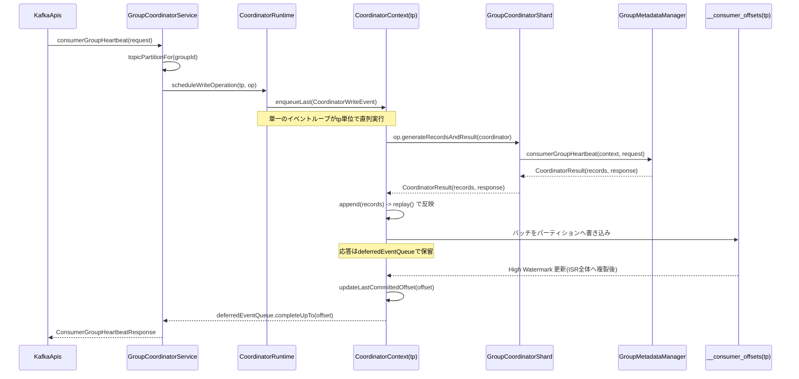

# 第21章 新 Group Coordinator と GroupMetadataManager

> **本章で読むソース**
>
> - [`group-coordinator/src/main/java/org/apache/kafka/coordinator/group/GroupCoordinatorService.java`](https://github.com/apache/kafka/blob/4.3.1/group-coordinator/src/main/java/org/apache/kafka/coordinator/group/GroupCoordinatorService.java)
> - [`group-coordinator/src/main/java/org/apache/kafka/coordinator/group/GroupCoordinatorShard.java`](https://github.com/apache/kafka/blob/4.3.1/group-coordinator/src/main/java/org/apache/kafka/coordinator/group/GroupCoordinatorShard.java)
> - [`group-coordinator/src/main/java/org/apache/kafka/coordinator/group/GroupMetadataManager.java`](https://github.com/apache/kafka/blob/4.3.1/group-coordinator/src/main/java/org/apache/kafka/coordinator/group/GroupMetadataManager.java)
> - [`group-coordinator/src/main/java/org/apache/kafka/coordinator/group/OffsetMetadataManager.java`](https://github.com/apache/kafka/blob/4.3.1/group-coordinator/src/main/java/org/apache/kafka/coordinator/group/OffsetMetadataManager.java)
> - [`coordinator-common/src/main/java/org/apache/kafka/coordinator/common/runtime/CoordinatorRuntime.java`](https://github.com/apache/kafka/blob/4.3.1/coordinator-common/src/main/java/org/apache/kafka/coordinator/common/runtime/CoordinatorRuntime.java)
> - [`coordinator-common/src/main/java/org/apache/kafka/coordinator/common/runtime/SnapshottableCoordinator.java`](https://github.com/apache/kafka/blob/4.3.1/coordinator-common/src/main/java/org/apache/kafka/coordinator/common/runtime/SnapshottableCoordinator.java)

## この章の狙い

KIP-848 で導入された新しい**グループコーディネーター**は、コンシューマーグループの状態を専用のスレッドやロックで守るのではなく、`__consumer_offsets` トピックへのレコード書き込みとレプリケーションの仕組みに乗せて管理する。

本章では、リクエストを受け付ける`GroupCoordinatorService`から、状態遷移を1本のイベントループで処理する`CoordinatorRuntime`、実際の状態機械である`GroupMetadataManager`までの経路を追い、オフセットコミットとハートビートがどのようにレコードとして永続化されるかを見る。

## 前提

第20章では`AsyncKafkaConsumer`が`ConsumerGroupHeartbeatRequest`を組み立てて送信するところまでを扱った。
本章はその要求をブローカー側で受け取る`GroupCoordinatorService`から先を扱う。

コンシューマーグループの状態は、`__consumer_offsets`という内部トピックのレコードとして表現される。
このトピックは他のトピックと同じくパーティションを持ち、パーティションごとにリーダーレプリカが存在する。
**Group Coordinator**は、この`__consumer_offsets`の各パーティションに対応する状態機械の集まりとして実装されている。

## GroupCoordinatorService によるパーティションへのルーティング

`GroupCoordinatorService`は`GroupCoordinator`インタフェースの実装であり、`KafkaApis`から呼び出される窓口である。
最初の仕事は、要求されたグループIDを`__consumer_offsets`のどのパーティションが担当するかを決めることである。

[`group-coordinator/.../GroupCoordinatorService.java L413-428`](https://github.com/apache/kafka/blob/4.3.1/group-coordinator/src/main/java/org/apache/kafka/coordinator/group/GroupCoordinatorService.java#L413-L428)

```java
    /**
     * @return The topic partition for the given group.
     */
    private TopicPartition topicPartitionFor(
        String groupId
    ) {
        return new TopicPartition(Topic.GROUP_METADATA_TOPIC_NAME, partitionFor(groupId));
    }

    /**
     * See {@link GroupCoordinator#partitionFor(String)}
     */
    @Override
    public int partitionFor(
        String groupId
    ) {
        throwIfNotActive();
        return Utils.abs(groupId.hashCode()) % numPartitions;
    }
```

グループIDのハッシュ値を`__consumer_offsets`のパーティション数で割った余りが、そのグループを担当するパーティションになる。
同じグループIDは常に同じパーティションに写像されるため、あるグループのすべてのハートビートとオフセットコミットは、1つのパーティションのリーダーが単独で処理する。
この写像を経由することで、Group Coordinatorはパーティション単位に閉じた状態機械の集合として動作する。

`consumerGroupHeartbeat`はリクエストの妥当性を検証したあと、担当パーティションを求めて`CoordinatorRuntime`に処理を委譲する。

[`group-coordinator/.../GroupCoordinatorService.java L483-514`](https://github.com/apache/kafka/blob/4.3.1/group-coordinator/src/main/java/org/apache/kafka/coordinator/group/GroupCoordinatorService.java#L483-L514)

```java
    public CompletableFuture<ConsumerGroupHeartbeatResponseData> consumerGroupHeartbeat(
        AuthorizableRequestContext context,
        ConsumerGroupHeartbeatRequestData request
    ) {
        if (!isActive.get()) {
            return CompletableFuture.completedFuture(new ConsumerGroupHeartbeatResponseData()
                .setErrorCode(Errors.COORDINATOR_NOT_AVAILABLE.code())
            );
        }

        try {
            throwIfConsumerGroupHeartbeatRequestIsInvalid(request, context.requestVersion());
        } catch (Throwable ex) {
            ApiError apiError = ApiError.fromThrowable(ex);
            return CompletableFuture.completedFuture(new ConsumerGroupHeartbeatResponseData()
                .setErrorCode(apiError.error().code())
                .setErrorMessage(apiError.message())
            );
        }

        return runtime.scheduleWriteOperation(
            "consumer-group-heartbeat",
            topicPartitionFor(request.groupId()),
            coordinator -> coordinator.consumerGroupHeartbeat(context, request)
        ).exceptionally(exception -> handleOperationException(
            "consumer-group-heartbeat",
            request,
            exception,
            (error, message) -> new ConsumerGroupHeartbeatResponseData()
                .setErrorCode(error.code())
                .setErrorMessage(message),
            log
        ));
```

`coordinator -> coordinator.consumerGroupHeartbeat(context, request)`というラムダは、状態機械を直接操作する処理そのものであり、パーティションへの書き込みはまだ行われていない。
このラムダが担当パーティションのコンテキストとともに`CoordinatorRuntime`に渡される。
`commitOffsets`も同じ形で`coordinator.commitOffset(context, request)`を`scheduleWriteOperation`に渡している。

[`group-coordinator/.../GroupCoordinatorService.java L2090-2093`](https://github.com/apache/kafka/blob/4.3.1/group-coordinator/src/main/java/org/apache/kafka/coordinator/group/GroupCoordinatorService.java#L2090-L2093)

```java
        return runtime.scheduleWriteOperation(
            "commit-offset",
            topicPartitionFor(request.groupId()),
            coordinator -> coordinator.commitOffset(context, request)
        ).exceptionally(exception -> handleOperationException(
```

読み取り専用の要求(`consumerGroupDescribe`など)は`scheduleReadOperation`を使う。

[`group-coordinator/.../GroupCoordinatorService.java L1170-1184`](https://github.com/apache/kafka/blob/4.3.1/group-coordinator/src/main/java/org/apache/kafka/coordinator/group/GroupCoordinatorService.java#L1170-L1184)

```java
        groupsByTopicPartition.forEach((topicPartition, groupList) -> {
            CompletableFuture<List<ConsumerGroupDescribeResponseData.DescribedGroup>> future =
                runtime.scheduleReadOperation(
                    "consumer-group-describe",
                    topicPartition,
                    (coordinator, lastCommittedOffset) -> coordinator.consumerGroupDescribe(groupList, lastCommittedOffset)
                ).exceptionally(exception -> handleOperationException(
                    "consumer-group-describe",
                    groupList,
                    exception,
                    (error, __) -> ConsumerGroupDescribeRequest.getErrorDescribedGroupList(groupList, error),
                    log
                ));

            futures.add(future);
        });
```

書き込みと読み取りを別のスケジュール経路として区別している点が、次に見る`CoordinatorRuntime`の設計に直結する。

## CoordinatorRuntime によるイベント駆動の状態管理

`CoordinatorRuntime`は、Group Coordinatorだけでなく Transaction Coordinator や Share Coordinator も共有する汎用の実行基盤である。
クラスのJavadocは、書き込み操作と読み取り操作の非対称性を次のように定義している。

[`coordinator-common/.../CoordinatorRuntime.java L75-95`](https://github.com/apache/kafka/blob/4.3.1/coordinator-common/src/main/java/org/apache/kafka/coordinator/common/runtime/CoordinatorRuntime.java#L75-L95)

```java
/**
 * The CoordinatorRuntime provides a framework to implement coordinators such as the group coordinator
 * or the transaction coordinator.
 *
 * The runtime framework maps each underlying partitions (e.g. __consumer_offsets) that the broker is a
 * leader of to a coordinator replicated state machine. A replicated state machine holds the hard and soft
 * state of all the objects (e.g. groups or offsets) assigned to the partition. The hard state is stored in
 * timeline datastructures backed by a SnapshotRegistry. The runtime supports two type of operations
 * on state machines: (1) Writes and (2) Reads.
 *
 * (1) A write operation, aka a request, can read the full and potentially **uncommitted** state from state
 * machine to handle the operation. A write operation typically generates a response and a list of
 * records. The records are applied to the state machine and persisted to the partition. The response
 * is parked until the records are committed and delivered when they are.
 *
 * (2) A read operation, aka a request, can only read the committed state from the state machine to handle
 * the operation. A read operation typically generates a response that is immediately completed.
 *
 * The runtime framework exposes an asynchronous, future based, API to the world. All the operations
 * are executed by an CoordinatorEventProcessor. The processor guarantees that operations for a
 * single partition or state machine are not processed concurrently.
 */
```

書き込み操作は未コミットの状態まで読める代わりに、レコードを`__consumer_offsets`へ実際に書き込み、コミットされるまで応答を保留する。
読み取り操作はコミット済みの状態しか見ない代わりに、応答をその場で返せる。
この区別は、パーティションごとに1つだけ存在する`CoordinatorContext`が管理する。

[`coordinator-common/.../CoordinatorRuntime.java L2143-2157`](https://github.com/apache/kafka/blob/4.3.1/coordinator-common/src/main/java/org/apache/kafka/coordinator/common/runtime/CoordinatorRuntime.java#L2143-L2157)

```java
    public <T> CompletableFuture<T> scheduleWriteOperation(
        String name,
        TopicPartition tp,
        CoordinatorWriteOperation<S, T, U> op
    ) {
        try {
            throwIfNotRunning();
            log.debug("Scheduled execution of write operation {}.", name);
            CoordinatorWriteEvent<T> event = new CoordinatorWriteEvent<>(name, tp, writeTimeout, op);
            enqueueLast(event);
            return event.future;
        } catch (Throwable t) {
            return CompletableFuture.failedFuture(t);
        }
    }
```

`scheduleWriteOperation`は`CoordinatorWriteEvent`を生成してキューの末尾に積むだけであり、この時点では実際の処理を何も行わない。
処理を実行するのは、キューからイベントを取り出す単一のイベントループである。
このイベントの`key()`は担当パーティション`tp`を返し、`CoordinatorEventProcessor`は同じキーを持つイベントを並行には処理しない。

[`coordinator-common/.../CoordinatorRuntime.java L1307-1346`](https://github.com/apache/kafka/blob/4.3.1/coordinator-common/src/main/java/org/apache/kafka/coordinator/common/runtime/CoordinatorRuntime.java#L1307-L1346)

```java
        @Override
        public TopicPartition key() {
            return tp;
        }

        /**
         * Called by the CoordinatorEventProcessor when the event is executed.
         */
        @Override
        public void run() {
            try {
                // Get the context of the coordinator or fail if the coordinator is not in active state.
                withActiveContextOrThrow(tp, context -> {
                    // Execute the operation.
                    result = op.generateRecordsAndResult(context.coordinator.coordinator());

                    // Append the records and replay them to the state machine.
                    context.append(
                        producerId,
                        producerEpoch,
                        verificationGuard,
                        result.records(),
                        result.replayRecords(),
                        result.isAtomic(),
                        this
                    );

                    // If the operation is not done, create an operation timeout.
                    if (!future.isDone()) {
                        operationTimeout = new OperationTimeout(tp, this, writeTimeout.toMillis());
                        timer.add(operationTimeout);

                        // Only update when this event was appended to the deferred queue.
                        deferredEventQueuedTimestamp = time.milliseconds();
                    }
                });
            } catch (Throwable t) {
                complete(t);
            }
        }
```

`run()`が実行する処理は2段階に分かれる。
まず`op.generateRecordsAndResult`が状態機械(`GroupCoordinatorShard`)を呼び出し、応答と書くべきレコードの列を生成する。
次に`context.append`がそのレコードを実際にバッチへ積み、状態機械へ`replay`して反映する。
応答の`future`は、この時点ではまだ完了しない。
レコードが`__consumer_offsets`パーティションにコミットされる(ISR全体に複製され High Watermark を超える)まで、応答は`deferredEventQueue`で待たされる。

読み取り操作はこれと異なり、コミット済みの`lastCommittedOffset`だけを参照して即座に完了する。

[`coordinator-common/.../CoordinatorRuntime.java L1479-1499`](https://github.com/apache/kafka/blob/4.3.1/coordinator-common/src/main/java/org/apache/kafka/coordinator/common/runtime/CoordinatorRuntime.java#L1479-L1499)

```java
        @Override
        public void run() {
            try {
                // Get the context of the coordinator or fail if the coordinator is not in active state.
                withActiveContextOrThrow(tp, context -> {
                    // Execute the read operation.
                    response = op.generateResponse(
                        context.coordinator.coordinator(),
                        context.coordinator.lastCommittedOffset()
                    );

                    // The response can be completed immediately.
                    complete(null);
                });
            } catch (Throwable t) {
                complete(t);
            }
        }
```

書き込みと読み取りをともに1本のイベントループで処理するため、パーティションの状態機械そのものにロックは要らない。
排他制御は「同じキーを持つイベントを並行実行しない」というイベントプロセッサの保証だけで足りる。

## 状態のタイムライン管理とコミット通知

未コミットの状態まで読める書き込み操作と、コミット済みの状態しか読めない読み取り操作を、両方とも同じ状態機械インスタンスに対して実行できるのはなぜか。
その答えは`SnapshottableCoordinator`が持つ`SnapshotRegistry`にある。

[`coordinator-common/.../SnapshottableCoordinator.java L132-172`](https://github.com/apache/kafka/blob/4.3.1/coordinator-common/src/main/java/org/apache/kafka/coordinator/common/runtime/SnapshottableCoordinator.java#L132-L172)

```java
    /**
     * Updates the last written offset. This also create a new snapshot
     * in the snapshot registry.
     *
     * @param offset The new last written offset.
     */
    @Override
    public synchronized void updateLastWrittenOffset(long offset) {
        if (offset <= lastWrittenOffset) {
            throw new IllegalStateException("New last written offset " + offset + " of " + tp +
                " must be greater than " + lastWrittenOffset + ".");
        }

        lastWrittenOffset = offset;
        snapshotRegistry.idempotentCreateSnapshot(offset);
        log.debug("Updated last written offset of {} to {}.", tp, offset);
    }

    /**
     * Updates the last committed offset. This completes all the deferred
     * events waiting on this offset. This also cleanups all the snapshots
     * prior to this offset.
     *
     * @param offset The new last committed offset.
     */
    @Override
    public synchronized void updateLastCommittedOffset(long offset) {
        if (offset < lastCommittedOffset) {
            throw new IllegalStateException("New committed offset " + offset + " of " + tp +
                " must be greater than or equal to " + lastCommittedOffset + ".");
        }

        if (offset > lastWrittenOffset) {
            throw new IllegalStateException("New committed offset " + offset + " of " + tp +
                " must be less than or equal to " + lastWrittenOffset + ".");
        }

        lastCommittedOffset = offset;
        snapshotRegistry.deleteSnapshotsUpTo(offset);
        log.debug("Updated committed offset of {} to {}.", tp, offset);
    }
```

書き込み操作でバッチにレコードを積むたびに`updateLastWrittenOffset`が呼ばれ、その時点のオフセットに紐づく**スナップショット**が`SnapshotRegistry`に刻まれる。
一方、パーティションの High Watermark が進んだ通知(`onHighWatermarkUpdated`)を受け取ると`updateLastCommittedOffset`が呼ばれ、コミット済みオフセット以前のスナップショットは不要になって破棄される。

[`coordinator-common/.../CoordinatorRuntime.java L1808-1833`](https://github.com/apache/kafka/blob/4.3.1/coordinator-common/src/main/java/org/apache/kafka/coordinator/common/runtime/CoordinatorRuntime.java#L1808-L1833)

```java
        @Override
        public void onHighWatermarkUpdated(
            TopicPartition tp,
            long offset
        ) {
            log.debug("High watermark of {} incremented to {}.", tp, offset);
            if (lastHighWatermark.getAndSet(offset) == NO_OFFSET) {
                // An event to apply the new high watermark is pushed to the front of the
                // queue only if the previous value was -1L. If it was not, it means that
                // there is already an event waiting to process the last value.
                enqueueFirst(new CoordinatorInternalEvent("HighWatermarkUpdate", tp, () -> {
                    long newHighWatermark = lastHighWatermark.getAndSet(NO_OFFSET);

                    CoordinatorContext context = coordinators.get(tp);
                    if (context != null) {
                        context.lock.lock();
                        try {
                            if (context.state == CoordinatorState.ACTIVE) {
                                // The updated high watermark can be applied to the coordinator only if the coordinator
                                // exists and is in the active state.
                                log.debug("Updating high watermark of {} to {}.", tp, newHighWatermark);
                                context.coordinator.updateLastCommittedOffset(newHighWatermark);
                                context.deferredEventQueue.completeUpTo(newHighWatermark);
                                coordinatorMetrics.onUpdateLastCommittedOffset(tp, newHighWatermark);
                            } else {
                                log.debug("Ignored high watermark updated for {} to {} because the coordinator is not active.",
                                    tp, newHighWatermark);
                            }
                        } finally {
                            context.lock.unlock();
                        }
                    } else {
```

`context.deferredEventQueue.completeUpTo(newHighWatermark)`が、書き込み操作が待っていた応答をここでようやく完了させる。
つまり応答は、レコードを状態機械へ`replay`した瞬間ではなく、そのレコードがブローカー間で複製されて確定した瞬間に返る。

読み取り操作が使う`lastCommittedOffset()`は、この確定済みオフセットである。
`SnapshotRegistry`はオフセットをキーにした複数世代の状態を保持しているため、読み取り操作は書き込み操作の途中経過(未コミットの変更)を経由せずに、確定済みオフセット時点の状態だけを取り出せる。
これにより、書き込みイベントと読み取りイベントを同じイベントループが順番に処理しても、読み取り側が中途半端な状態を見ることはない。

## GroupMetadataManager による状態遷移とレコード生成

`CoordinatorWriteEvent`が呼び出す`op.generateRecordsAndResult`の実体は、`GroupCoordinatorShard`を経由して`GroupMetadataManager`に届く。
`GroupCoordinatorShard`は`CoordinatorShard<CoordinatorRecord>`の実装であり、ハートビート系の処理を`GroupMetadataManager`に、オフセットコミット系の処理を`OffsetMetadataManager`に振り分ける。

[`group-coordinator/.../GroupMetadataManager.java L4926-4955`](https://github.com/apache/kafka/blob/4.3.1/group-coordinator/src/main/java/org/apache/kafka/coordinator/group/GroupMetadataManager.java#L4926-L4955)

```java
    public CoordinatorResult<ConsumerGroupHeartbeatResponseData, CoordinatorRecord> consumerGroupHeartbeat(
        AuthorizableRequestContext context,
        ConsumerGroupHeartbeatRequestData request
    ) throws ApiException {
        if (request.memberEpoch() == LEAVE_GROUP_MEMBER_EPOCH || request.memberEpoch() == LEAVE_GROUP_STATIC_MEMBER_EPOCH) {
            // -1 means that the member wants to leave the group.
            // -2 means that a static member wants to leave the group.
            return consumerGroupLeave(
                request.groupId(),
                request.instanceId(),
                request.memberId(),
                request.memberEpoch()
            );
        } else {
            // Otherwise, it is a regular heartbeat.
            return consumerGroupHeartbeat(
                context,
                request.groupId(),
                request.memberId(),
                request.memberEpoch(),
                request.instanceId(),
                request.rackId(),
                request.rebalanceTimeoutMs(),
                request.subscribedTopicNames(),
                request.subscribedTopicRegex(),
                request.serverAssignor(),
                request.topicPartitions()
            );
        }
    }
```

メンバーエポックが離脱を表す特殊値でなければ、実際のハートビート処理に進む。
その本体は、メンバー、購読、割り当ての3種類の状態を順に更新し、変更があった箇所ごとにレコードを積み上げていく。

[`group-coordinator/.../GroupMetadataManager.java L2366-2453`](https://github.com/apache/kafka/blob/4.3.1/group-coordinator/src/main/java/org/apache/kafka/coordinator/group/GroupMetadataManager.java#L2366-L2453)

```java
        // 1. Create or update the member. If the member is new or has changed, a ConsumerGroupMemberMetadataValue
        // record is written to the __consumer_offsets partition to persist the change. If the subscriptions have
        // changed, the subscription metadata is updated and persisted by writing a ConsumerGroupPartitionMetadataValue
        // record to the partition. Finally, the group epoch is bumped if the subscriptions have
        // changed, and persisted by writing a ConsumerGroupMetadataValue record to the partition.
        ConsumerGroupMember updatedMember = new ConsumerGroupMember.Builder(member)
            .maybeUpdateInstanceId(Optional.ofNullable(instanceId))
            .maybeUpdateRackId(Optional.ofNullable(rackId))
            .maybeUpdateRebalanceTimeoutMs(ofSentinel(rebalanceTimeoutMs))
            .maybeUpdateServerAssignorName(Optional.ofNullable(assignorName))
            .maybeUpdateSubscribedTopicNames(Optional.ofNullable(subscribedTopicNames))
            .maybeUpdateSubscribedTopicRegex(Optional.ofNullable(subscribedTopicRegex))
            .setClientId(context.clientId())
            .setClientHost(context.clientAddress().toString())
            .setClassicMemberMetadata(null)
            .build();

        boolean subscribedTopicNamesChanged = hasMemberSubscriptionChanged(
            groupId,
            member,
            updatedMember,
            records
        );
        // ... (中略。購読正規表現の解決、グループエポックの判定が続く) ...

        // 2. Update the target assignment if the group epoch is larger than the target assignment epoch. The delta between
        // the existing and the new target assignment is persisted to the partition.
        UpdateTargetAssignmentResult<Assignment> updateTargetAssignmentResult = maybeUpdateTargetAssignment(
            group,
            groupEpoch,
            member,
            updatedMember,
            subscriptionType,
            records
        );

        // 3. Reconcile the member's assignment with the target assignment if the member is not
        // fully reconciled yet.
        updatedMember = maybeReconcile(
            groupId,
            updatedMember,
            group::currentPartitionEpoch,
            updateTargetAssignmentResult.targetAssignmentEpoch(),
            updateTargetAssignmentResult.targetAssignment(),
            group.resolvedRegularExpressions(),
            // Force consistency with the subscription when the subscription has changed.
            hasSubscriptionChanged,
            ownedTopicPartitions,
            records
        );
```

`records`はメソッド冒頭で宣言された`List<CoordinatorRecord>`であり、状態が変わるたびに各ヘルパーメソッドへ引き渡されて追記されていく。
メンバー情報の更新、購読メタデータの更新、ターゲット割り当ての更新、メンバー自身の割り当ての反映は、それぞれ独立したレコード型として書き込まれる。
オフセットコミットも同様の形をとる。

[`group-coordinator/.../OffsetMetadataManager.java L662-676`](https://github.com/apache/kafka/blob/4.3.1/group-coordinator/src/main/java/org/apache/kafka/coordinator/group/OffsetMetadataManager.java#L662-L676)

```java
                    records.add(GroupCoordinatorRecordHelpers.newOffsetCommitRecord(
                        request.groupId(),
                        topic.name(),
                        partition.partitionIndex(),
                        offsetAndMetadata
                    ));
                }
            });
        });

        if (!records.isEmpty()) {
            metrics.record(GroupCoordinatorMetrics.OFFSET_COMMITS_SENSOR_NAME, records.size());
        }

        return new CoordinatorResult<>(records, response);
```

いずれの処理も、応答と一緒に`CoordinatorResult`としてレコードの列を返すだけであり、レコードを`__consumer_offsets`へ実際に書き込むのは呼び出し元の`CoordinatorWriteEvent.run()`(前節)である。
状態機械の側は、自分がどのパーティションのどのオフセットに書かれるかを一切知らない。

書き込まれたレコードは、`replay`によって状態機械へ反映される。
反映はレコード種別ごとにディスパッチされる。

[`group-coordinator/.../GroupCoordinatorShard.java L1160-1178`](https://github.com/apache/kafka/blob/4.3.1/group-coordinator/src/main/java/org/apache/kafka/coordinator/group/GroupCoordinatorShard.java#L1160-L1178)

```java
        switch (recordType) {
            case LEGACY_OFFSET_COMMIT:
                offsetMetadataManager.replay(
                    offset,
                    producerId,
                    convertLegacyOffsetCommitKey((LegacyOffsetCommitKey) key),
                    convertLegacyOffsetCommitValue((LegacyOffsetCommitValue) Utils.messageOrNull(value))
                );
                break;

            case OFFSET_COMMIT:
                offsetMetadataManager.replay(
                    offset,
                    producerId,
                    (OffsetCommitKey) key,
                    (OffsetCommitValue) Utils.messageOrNull(value)
                );
                break;

            case GROUP_METADATA:
                groupMetadataManager.replay(
                    (GroupMetadataKey) key,
                    (GroupMetadataValue) Utils.messageOrNull(value)
                );
                break;
```

この`replay`は、書き込み操作の直後だけでなく、コーディネーターの起動時に`__consumer_offsets`パーティションを先頭から読み直すときにも呼ばれる。
どちらの経路でも同じ`replay`実装を通すことで、実行中の状態更新とログからの状態復元を同じロジックに統一している。

## 処理の流れ

ここまでの構成要素を、コンシューマーグループのハートビート1件が処理される流れとして整理する。



書き込み操作は状態機械を呼んでレコードを得る段階(同期)と、そのレコードが複製されて確定する段階(非同期)の2段階に分かれる。
応答が返るのは後者が終わったときであり、この間もイベントループは他のパーティションや他のグループの要求を処理し続けられる。

## 最適化: ログへの直列化とタイムラインスナップショットによる並行読み取り

Group Coordinatorが単一のイベントループでパーティションごとの状態を処理しながら、読み取り要求をブロックさせずに捌けているのは、状態変更を`__consumer_offsets`ログへの直列書き込みとして扱い、その各時点を`SnapshotRegistry`上のタイムライン付きスナップショットとして保持しているためである。

書き込み操作は状態機械を直接書き換えるのではなく、変更を表すレコードを生成してからバッチに積み、そのオフセットに対応するスナップショットを作る。
読み取り操作は最新の(場合によっては未コミットの)状態を見る必要がなく、`lastCommittedOffset`が指すスナップショットだけを見れば正しい。
そのため読み取り操作は、書き込み操作の完了(パーティションへの複製確定)を待つことなく、直前に確定した状態にアクセスできる。

もし状態機械を単純な可変オブジェクトとして実装し、読み取りのたびにロックを取って最新状態を読んでいたなら、書き込みの複製待ち時間だけ読み取りも巻き込まれてブロックされていただろう。
タイムラインデータ構造によって、書き込みの「複製が確定するまでの待ち」と読み取りの「今すぐ応答を返す」という異なる要求を、同じ状態機械の上で両立させている。

## まとめ

- `GroupCoordinatorService`はグループIDのハッシュ値から`__consumer_offsets`のパーティションを決め、`CoordinatorRuntime`の`scheduleWriteOperation`または`scheduleReadOperation`に処理を委譲する。
- `CoordinatorRuntime`はパーティションごとに`CoordinatorContext`を持ち、単一のイベントループでイベントを直列実行することで、状態機械へのロックなしのアクセスを実現する。
- 書き込み操作はレコードを`__consumer_offsets`へ書き込み、複製されて High Watermark を超えるまで応答を保留する。
  読み取り操作はコミット済みオフセットの状態を即座に返す。
- `GroupMetadataManager`と`OffsetMetadataManager`は状態機械の実体であり、ハートビートやオフセットコミットのたびに変更を表すレコードを生成する。
  実際の永続化と反映は呼び出し元の`CoordinatorRuntime`が担う。
- `SnapshotRegistry`によるタイムラインスナップショットが、書き込みの複製待ちと読み取りの即時応答を同じ状態機械上で両立させている。

## 関連する章

- 第20章 [`20-consumer-fetch.md`](20-consumer-fetch.md): コンシューマーが`ConsumerGroupHeartbeatRequest`を送るまでの流れ。
- 第22章 [`22-rebalance-assign.md`](22-rebalance-assign.md): 本章で触れたターゲット割り当ての更新とリバランスの詳細。
- 第11章 [`../part03-storage/11-logcleaner.md`](../part03-storage/11-logcleaner.md): `__consumer_offsets`のような鍵付きレコードをコンパクションでどう縮退させるか。
