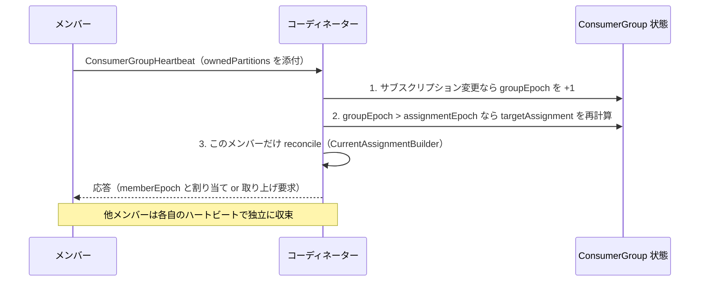
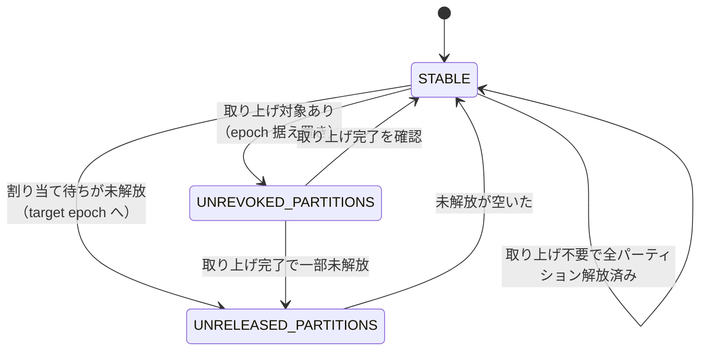

# 第22章 コンシューマーグループのリバランスとアサイン

> **本章で読むソース**
>
> - [`group-coordinator/src/main/java/org/apache/kafka/coordinator/group/modern/consumer/ConsumerGroup.java`](https://github.com/apache/kafka/blob/4.3.1/group-coordinator/src/main/java/org/apache/kafka/coordinator/group/modern/consumer/ConsumerGroup.java)
> - [`group-coordinator/src/main/java/org/apache/kafka/coordinator/group/modern/consumer/ConsumerGroupMember.java`](https://github.com/apache/kafka/blob/4.3.1/group-coordinator/src/main/java/org/apache/kafka/coordinator/group/modern/consumer/ConsumerGroupMember.java)
> - [`group-coordinator/src/main/java/org/apache/kafka/coordinator/group/assignor/UniformAssignor.java`](https://github.com/apache/kafka/blob/4.3.1/group-coordinator/src/main/java/org/apache/kafka/coordinator/group/assignor/UniformAssignor.java)
> - [`group-coordinator/src/main/java/org/apache/kafka/coordinator/group/assignor/RangeAssignor.java`](https://github.com/apache/kafka/blob/4.3.1/group-coordinator/src/main/java/org/apache/kafka/coordinator/group/assignor/RangeAssignor.java)

## この章の狙い

コンシューマーグループのリバランスは、トピックのパーティションをグループ内の各メンバーへ割り当て直す操作である。
KIP-848 で導入された新しいコンシューマーグループプロトコルは、この割り当てをサーバー（グループコーディネーター）側で計算し、メンバーへ段階的に配る方式へ変えた。

この章では、割り当ての目標を表す**ターゲットアサインメント**（`targetAssignment`）をコーディネーターがどう計算し、各メンバーがそこへどう収束していくかを読む。
収束の調停は、グループ全体の版数である**グループエポック**（group epoch）と、メンバーごとの版数である**メンバーエポック**（member epoch）の二つのエポックが担う。
最後に、サーバー側の割り当てアルゴリズムである `UniformAssignor` と `RangeAssignor` の違いを見る。

## 前提

第21章で見たとおり、グループコーディネーターはグループの状態を `__consumer_offsets` トピックのレコードとして永続化し、`ConsumerGroup` はその状態のインメモリ表現である。
メンバーは `ConsumerGroupHeartbeat` API で定期的にハートビートを送り、コーディネーターはその応答でメンバーへ割り当てを伝える。
本章はハートビート処理の内側、すなわち割り当ての計算と適用に絞る。

## 旧来の eager リバランスとの違い

新プロトコルの位置づけを見るために、まず旧来の方式を確認する。
従来のコンシューマーグループプロトコルは、リバランスを**eager リバランス**として行った。
リバランスが必要になると、グループの全メンバーはいったん保有するパーティションをすべて手放し、`SyncGroup` の応答で新しい割り当てを受け取ってから処理を再開した。
割り当ての計算はメンバーのうちの1台（グループリーダー）がクライアント側で行い、全メンバーがそれを待ち合わせるため、この待ち合わせのあいだグループ全体の消費が止まる。
これが**stop-the-world**と呼ばれる停止である。

新プロトコルはこの一斉停止を無くす。
割り当てはサーバー側で計算され、各メンバーは自分に関係するパーティションの差分だけを、他のメンバーと待ち合わせずに順次適用していく。
以降でその仕組みを読む。

## 二つのエポックによる調停

`ConsumerGroup` はグループの状態として次の5つを持つ。

[`group-coordinator/src/main/java/org/apache/kafka/coordinator/group/modern/consumer/ConsumerGroup.java L84-L89`](https://github.com/apache/kafka/blob/4.3.1/group-coordinator/src/main/java/org/apache/kafka/coordinator/group/modern/consumer/ConsumerGroup.java#L84-L89)

```java
public enum ConsumerGroupState {
    EMPTY("Empty"),
    ASSIGNING("Assigning"),
    RECONCILING("Reconciling"),
    STABLE("Stable"),
    DEAD("Dead");
```

この状態は、グループエポックと**アサインメントエポック**（`assignmentEpoch`）、そして各メンバーの収束状況から導出される。

[`group-coordinator/src/main/java/org/apache/kafka/coordinator/group/modern/consumer/ConsumerGroup.java L958-L975`](https://github.com/apache/kafka/blob/4.3.1/group-coordinator/src/main/java/org/apache/kafka/coordinator/group/modern/consumer/ConsumerGroup.java#L958-L975)

```java
@Override
protected void maybeUpdateGroupState() {
    ConsumerGroupState newState = STABLE;
    if (members.isEmpty()) {
        newState = EMPTY;
    } else if (groupEpoch.get() > assignmentEpoch()) {
        newState = ASSIGNING;
    } else {
        for (ModernGroupMember member : members.values()) {
            if (!member.isReconciledTo(assignmentEpoch())) {
                newState = RECONCILING;
                break;
            }
        }
    }

    state.set(newState);
}
```

三つのエポックが登場する。
グループエポックはグループのサブスクリプションやメンバー構成が変わるたびにコーディネーターが1つ増やす、グループ全体の版数である。
アサインメントエポックは、その時点のターゲットアサインメントがどのグループエポックに対して計算されたかを示す、割り当ての版数である。
メンバーエポックは、各メンバーが実際にどの版のターゲットアサインメントまで収束したかを示す、メンバーごとの版数である。

状態はこれらの大小関係で決まる。
グループエポックがアサインメントエポックより大きければ、割り当ての再計算が追いついていないため `ASSIGNING` になる。
両者が一致していても、まだそのアサインメントエポックまで収束していないメンバーがいれば `RECONCILING` になる。
全メンバーが最新のアサインメントエポックまで収束していれば `STABLE` である。

コーディネーターがハートビートを1件処理するたびに、この3ステップが順に走る。
グループエポックを必要に応じて増やし、ターゲットアサインメントを更新し、そのメンバーだけを収束させる。

[`group-coordinator/src/main/java/org/apache/kafka/coordinator/group/GroupMetadataManager.java L2640-L2663`](https://github.com/apache/kafka/blob/4.3.1/group-coordinator/src/main/java/org/apache/kafka/coordinator/group/GroupMetadataManager.java#L2640-L2663)

```java
            // 2. Update the target assignment if the group epoch is larger than the target assignment epoch.
            // The delta between the existing and the new target assignment is persisted to the partition.
            UpdateTargetAssignmentResult<Assignment> updateTargetAssignmentResult = maybeUpdateTargetAssignment(
                group,
                groupEpoch,
                member,
                updatedMember,
                subscriptionType,
                records
            );

            // 3. Reconcile the member's assignment with the target assignment if the member is not fully reconciled yet.
            updatedMember = maybeReconcile(
                groupId,
                updatedMember,
                group::currentPartitionEpoch,
                updateTargetAssignmentResult.targetAssignmentEpoch(),
                updateTargetAssignmentResult.targetAssignment(),
                group.resolvedRegularExpressions(),
                // Force consistency with the subscription when the subscription has changed.
                bumpGroupEpoch,
                toTopicPartitions(subscription.ownedPartitions(), metadataImage),
                records
            );
```

ステップ2の `maybeUpdateTargetAssignment` は、グループエポックがアサインメントエポックより大きいときだけターゲットアサインメントを計算し直し、旧版との差分をレコードとして永続化する。
ステップ3の `maybeReconcile` は、ハートビートを送ってきたそのメンバー1人だけを、最新のターゲットアサインメントへ一歩進める。
再計算は全メンバーぶんまとめて行うが、収束はメンバーが自分のハートビートで個別に進める。
ここに、一斉停止を伴わずにリバランスを進める鍵がある。



## メンバー1人ぶんの収束エンジン

ステップ3の収束を担うのが `CurrentAssignmentBuilder` である。
このクラスは、メンバーの現在状態とターゲットアサインメントを受け取り、両者を近づけるための次の状態を1つ計算する状態機械である。
メンバーの状態は `MemberState` で表され、パーティションの取り上げ待ちを表す `UNREVOKED_PARTITIONS`、まだ空いていないパーティションの解放待ちを表す `UNRELEASED_PARTITIONS`、収束済みの `STABLE` などがある。

`build` は現在の `MemberState` で分岐する。

[`group-coordinator/src/main/java/org/apache/kafka/coordinator/group/modern/consumer/CurrentAssignmentBuilder.java L187-L234`](https://github.com/apache/kafka/blob/4.3.1/group-coordinator/src/main/java/org/apache/kafka/coordinator/group/modern/consumer/CurrentAssignmentBuilder.java#L187-L234)

```java
public ConsumerGroupMember build() {
    switch (member.state()) {
        case STABLE:
            // When the member is in the STABLE state, we verify if a newer
            // epoch (or target assignment) is available. If it is, we can
            // reconcile the member towards it. Otherwise, we ensure the
            // assignment is consistent with the subscribed topics, if changed.
            if (member.memberEpoch() != targetAssignmentEpoch) {
                return computeNextAssignment(
                    member.memberEpoch(),
                    member.assignedPartitions()
                );
            } else if (hasSubscriptionChanged) {
                return updateCurrentAssignment(
                    member.memberEpoch(),
                    member.assignedPartitions()
                );
            } else {
                return member;
            }

        case UNREVOKED_PARTITIONS:
            // ... (中略) ...

            // If the member provides its owned partitions. We verify if it still
            // owns any of the revoked partitions. If it does, we cannot progress.
            if (ownsRevokedPartitions(member.partitionsPendingRevocation())) {
                if (hasSubscriptionChanged) {
                    return updateCurrentAssignment(
                        member.memberEpoch(),
                        member.assignedPartitions()
                    );
                } else {
                    return member;
                }
            }
```

`STABLE` のメンバーは、自分のメンバーエポックがターゲットのアサインメントエポックと一致していれば、すでに収束済みなので何もしない。
一致していなければ新しい版が来ているので、`computeNextAssignment` で次の一歩を計算する。
`UNREVOKED_PARTITIONS` のメンバーは、取り上げ対象のパーティションをまだ手放していないうちは前へ進めない。
手放したかどうかは、メンバーがハートビートで報告する保有パーティション（`ownedTopicPartitions`）に取り上げ対象が含まれるかで判定する。

### 集合演算による差分の計算

`computeNextAssignment` は、メンバーの現在の割り当てとターゲットの差を、トピックごとの集合演算として求める。

[`group-coordinator/src/main/java/org/apache/kafka/coordinator/group/modern/consumer/CurrentAssignmentBuilder.java L393-L410`](https://github.com/apache/kafka/blob/4.3.1/group-coordinator/src/main/java/org/apache/kafka/coordinator/group/modern/consumer/CurrentAssignmentBuilder.java#L393-L410)

```java
            // New Assigned Partitions = Previous Assigned Partitions ∩ Target
            Map<Integer, Integer> assignedPartitions = new HashMap<>(currentAssignedPartitions);
            assignedPartitions.keySet().retainAll(target);

            // Partitions Pending Revocation = Previous Assigned Partitions - New Assigned Partitions
            Map<Integer, Integer> partitionsPendingRevocation = new HashMap<>(currentAssignedPartitions);
            partitionsPendingRevocation.keySet().removeAll(assignedPartitions.keySet());

            // Partitions Pending Assignment = Target - New Assigned Partitions - Unreleased Partitions
            Set<Integer> partitionsPendingAssignment = new HashSet<>(target);
            partitionsPendingAssignment.removeAll(assignedPartitions.keySet());
            hasUnreleasedPartitions = partitionsPendingAssignment.removeIf(partitionId ->
                currentPartitionEpoch.apply(topicId, partitionId) != -1 &&
                // Don't consider a partition unreleased if it is owned by the current member
                // because it is pending revocation. This is safe to do since only a single member
                // can own a partition at a time.
                !member.partitionsPendingRevocation().getOrDefault(topicId, Map.of()).containsKey(partitionId)
            ) || hasUnreleasedPartitions;
```

現在の割り当てとターゲットの積集合が、引き続き保有してよいパーティションである。
現在保有していてターゲットにないぶんは、取り上げ待ち（pending revocation）になる。
ターゲットにあって現在保有していないぶんは、割り当て待ち（pending assignment）になる。

割り当て待ちのうち、他のメンバーがまだ手放していないパーティションは、この場では割り当てられない。
それを判定するのが `currentPartitionEpoch` である。
このコールバックは、そのパーティションが現在どのメンバーに保有されているか、その保有者のメンバーエポックを返す。
値が `-1` なら誰も保有しておらず、すぐに割り当てられる。
値があれば別のメンバーが取り上げ処理中であり、そのメンバーが手放すまで待つ。
このパーティションは `UNRELEASED_PARTITIONS` として保留され、後続のハートビートで再挑戦される。

差分が求まると、状態機械は次のいずれかへ遷移する。
取り上げ待ちがあればメンバーエポックを据え置いたまま `UNREVOKED_PARTITIONS` になり、クライアントへ取り上げを要求する。
取り上げが不要で新規割り当てがあれば、メンバーエポックをターゲットのアサインメントエポックへ進めて割り当てを反映する。

[`group-coordinator/src/main/java/org/apache/kafka/coordinator/group/modern/consumer/CurrentAssignmentBuilder.java L425-L455`](https://github.com/apache/kafka/blob/4.3.1/group-coordinator/src/main/java/org/apache/kafka/coordinator/group/modern/consumer/CurrentAssignmentBuilder.java#L425-L455)

```java
        if (!newPartitionsPendingRevocation.isEmpty() && ownsRevokedPartitions(newPartitionsPendingRevocation)) {
            // If there are partitions to be revoked, the member remains in its current
            // epoch and requests the revocation of those partitions. It transitions to
            // the UNREVOKED_PARTITIONS state to wait until the client acknowledges the
            // revocation of the partitions.
            return new ConsumerGroupMember.Builder(member)
                .setState(MemberState.UNREVOKED_PARTITIONS)
                .updateMemberEpoch(memberEpoch)
                .setAssignedPartitions(newAssignedPartitions)
                .setPartitionsPendingRevocation(newPartitionsPendingRevocation)
                .build();
        } else if (!newPartitionsPendingAssignment.isEmpty()) {
            // If there are partitions to be assigned, the member transitions to the
            // target epoch and requests the assignment of those partitions. Note that
            // the partitions are directly added to the assigned partitions set. The
            // member transitions to the STABLE state or to the UNRELEASED_PARTITIONS
            // state depending on whether there are unreleased partitions or not.
            newPartitionsPendingAssignment.forEach((topicId, partitions) -> {
                Map<Integer, Integer> topicEpochs = newAssignedPartitions
                    .computeIfAbsent(topicId, __ -> new HashMap<>());
                for (Integer partitionId : partitions) {
                    topicEpochs.put(partitionId, targetAssignmentEpoch);
                }
            });
            MemberState newState = hasUnreleasedPartitions ? MemberState.UNRELEASED_PARTITIONS : MemberState.STABLE;
            return new ConsumerGroupMember.Builder(member)
                .setState(newState)
                .updateMemberEpoch(targetAssignmentEpoch)
                .setAssignedPartitions(newAssignedPartitions)
                .setPartitionsPendingRevocation(Map.of())
                .build();
        }
```

取り上げが先で、割り当てが後という順序が保たれている。
あるメンバーが手放すまで、そのパーティションを欲しいメンバーは待つ。
待ち合わせは、そのパーティションに関係する二者のあいだだけで起きる。



### なぜ差分適用が安全か

各メンバーの割り当てをまたいでパーティションが二重に保有されないことを保証するのが、`ConsumerGroup` が持つ**パーティションエポック**（`currentPartitionEpoch`）の表である。
この表は、各トピックパーティションを現在の保有者のメンバーエポックへ対応づける。

[`group-coordinator/src/main/java/org/apache/kafka/coordinator/group/modern/consumer/ConsumerGroup.java L140-L145`](https://github.com/apache/kafka/blob/4.3.1/group-coordinator/src/main/java/org/apache/kafka/coordinator/group/modern/consumer/ConsumerGroup.java#L140-L145)

```java
    /**
     * The current partition epoch maps each topic-partitions to their current epoch where
     * the epoch is the epoch of their owners. When a member revokes a partition, it removes
     * its epochs from this map. When a member gets a partition, it adds its epochs to this map.
     */
    private final TimelineHashMap<Uuid, TimelineHashMap<Integer, Integer>> currentPartitionEpoch;
```

メンバーの割り当てが更新されるたびに、`addPartitionEpochs` がこの表を書き換える。

[`group-coordinator/src/main/java/org/apache/kafka/coordinator/group/modern/consumer/ConsumerGroup.java L1154-L1176`](https://github.com/apache/kafka/blob/4.3.1/group-coordinator/src/main/java/org/apache/kafka/coordinator/group/modern/consumer/ConsumerGroup.java#L1154-L1176)

```java
    void addPartitionEpochs(
        Map<Uuid, Map<Integer, Integer>> assignment,
        int epoch
    ) {
        assignment.forEach((topicId, partitionEpochs) -> {
            currentPartitionEpoch.compute(topicId, (__, partitionsOrNull) -> {
                if (partitionsOrNull == null) {
                    partitionsOrNull = new TimelineHashMap<>(snapshotRegistry, partitionEpochs.size());
                }
                for (Integer partitionId : partitionEpochs.keySet()) {
                    Integer prevValue = partitionsOrNull.get(partitionId);
                    if (prevValue == null || prevValue < epoch) {
                        partitionsOrNull.put(partitionId, epoch);
                    } else {
                        throw new IllegalStateException(
                            String.format("Cannot set the epoch of %s-%s to %d because the partition is " +
                                "still owned at epoch %d", topicId, partitionId, epoch, prevValue));
                    }
                }
                return partitionsOrNull;
            });
        });
    }
```

パーティションを新しく保有できるのは、その時点で誰も保有していないか、より新しいエポックで上書きする場合に限る。
すでに保有者がいるのに割り当てようとすると `IllegalStateException` で拒否される。
先に見た `computeNextAssignment` は、割り当て待ちのパーティションについてこの表を `currentPartitionEpoch` コールバックで参照し、保有者がいるうちは割り当てを保留する。

これが、同期バリアなしに増分適用しても安全な理由である。
グループ全体を一度止めて全パーティションを解放させる代わりに、コーディネーターはパーティション単位の保有権をエポックで追跡する。
あるパーティションの引き渡しは、現在の保有者が取り上げを確認した後にのみ次の保有者へ進む。
この保有権のチェックはパーティションごとに独立しているため、無関係なパーティションを持つメンバーは互いに待たされず、各自のペースでハートビートごとに一歩ずつ収束できる。
一斉停止が消えるのは、待ち合わせの単位がグループ全体からパーティション単位の二者間へ縮んだからである。

なお、メンバーの割り当てが `assignedPartitions` としてエポック付きで保持される点も、この調停を支える。

[`group-coordinator/src/main/java/org/apache/kafka/coordinator/group/modern/consumer/ConsumerGroupMember.java L300-L310`](https://github.com/apache/kafka/blob/4.3.1/group-coordinator/src/main/java/org/apache/kafka/coordinator/group/modern/consumer/ConsumerGroupMember.java#L300-L310)

```java
    /**
     * The partitions assigned to this member and their assignment epochs.
     * A map of topic ids to partitions to assignment epochs.
     */
    private final Map<Uuid, Map<Integer, Integer>> assignedPartitions;

    /**
     * The partitions awaiting revocation from this member and their assignment epochs.
     * A map of topic ids to partitions to assignment epochs.
     */
    private final Map<Uuid, Map<Integer, Integer>> partitionsPendingRevocation;
```

## サーバー側のアサイナ

ターゲットアサインメントそのものを計算するのがアサイナである。
新プロトコルはアサイナをサーバー側に置き、標準で `UniformAssignor` と `RangeAssignor` の2つを備える。
どちらも `ConsumerGroupPartitionAssignor` を実装し、グループの仕様と購読トピックのメタデータを受け取って割り当てを返す。

### UniformAssignor

`UniformAssignor` はパーティションをグループ全体へ均等に分散する。
実装は、全メンバーが同じトピック集合を購読しているか（**HOMOGENEOUS**か）で戦略を切り替える。

[`group-coordinator/src/main/java/org/apache/kafka/coordinator/group/assignor/UniformAssignor.java L70-L89`](https://github.com/apache/kafka/blob/4.3.1/group-coordinator/src/main/java/org/apache/kafka/coordinator/group/assignor/UniformAssignor.java#L70-L89)

```java
    @Override
    public GroupAssignment assign(
        GroupSpec groupSpec,
        SubscribedTopicDescriber subscribedTopicDescriber
    ) throws PartitionAssignorException {
        if (groupSpec.memberIds().isEmpty())
            return new GroupAssignment(Map.of());

        if (groupSpec.subscriptionType().equals(HOMOGENEOUS)) {
            LOG.debug("Detected that all members are subscribed to the same set of topics, invoking the "
                + "homogeneous assignment algorithm");
            return new UniformHomogeneousAssignmentBuilder(groupSpec, subscribedTopicDescriber)
                .build();
        } else {
            LOG.debug("Detected that the members are subscribed to different sets of topics, invoking the "
                + "heterogeneous assignment algorithm");
            return new UniformHeterogeneousAssignmentBuilder(groupSpec, subscribedTopicDescriber)
                .build();
        }
    }
```

全メンバーの購読が同一なら均質版の、異なるなら非均質版のビルダーが割り当てを組む。
このアサイナが目指すのは、メンバー間のパーティション数の偏りを最小にすることであり、ラックを考慮した配置も行える。

### RangeAssignor

`RangeAssignor` は、トピックごとにパーティションを連続した範囲で切り、各メンバーへ順に配る。
狙いは、複数トピックで同じ番号のパーティションを同じメンバーへ寄せることにある（co-partitioning）。
これが成り立つと、同じキーを持つレコードが同じメンバーに集まるため、ストリーム同士の結合が同一メンバー内で完結する。

配分量は、パーティション数をメンバー数で割った商と余りから決まる。

[`group-coordinator/src/main/java/org/apache/kafka/coordinator/group/assignor/RangeAssignor.java L120-L128`](https://github.com/apache/kafka/blob/4.3.1/group-coordinator/src/main/java/org/apache/kafka/coordinator/group/assignor/RangeAssignor.java#L120-L128)

```java
        private void maybeComputeQuota() {
            if (minQuota != -1) return;

            // The minimum number of partitions each member should receive for a balanced assignment.
            minQuota = numPartitions / numMembers;

            // Extra partitions to be distributed one to each member.
            extraPartitions = numPartitions % numMembers;
        }
```

各メンバーには最低 `minQuota` 個を配り、割り切れずに残った `extraPartitions` 個を先頭のメンバーから1個ずつ上乗せする。
配分は連続した範囲として切り出される。

[`group-coordinator/src/main/java/org/apache/kafka/coordinator/group/assignor/RangeAssignor.java L271-L292`](https://github.com/apache/kafka/blob/4.3.1/group-coordinator/src/main/java/org/apache/kafka/coordinator/group/assignor/RangeAssignor.java#L271-L292)

```java
    private void addPartitionsToAssignment(
        TopicMetadata topicMetadata,
        Map<Uuid, Set<Integer>> memberAssignment
    ) {
        int start = topicMetadata.nextRange;
        int quota = topicMetadata.minQuota;

        // Adjust quota to account for extra partitions if available.
        if (topicMetadata.extraPartitions > 0) {
            quota++;
            topicMetadata.extraPartitions--;
        }

        // Calculate the end using the quota.
        int end = Math.min(start + quota, topicMetadata.numPartitions);

        topicMetadata.nextRange = end;

        if (start < end) {
            memberAssignment.put(topicMetadata.topicId, new RangeSet(start, end));
        }
    }
```

`nextRange` を次の開始点として持ち回ることで、各メンバーへ連続した `[start, end)` の範囲を順に切り出す。
すべてのトピックのパーティション数が等しく、全メンバーが同じトピックを購読していれば、各メンバーは全トピックから同じ番号帯を受け取り、co-partitioning が成立する。

二つのアサイナの違いは狙いにある。
`UniformAssignor` はメンバー間の負荷を均すことを優先する。
`RangeAssignor` はトピック間で番号を揃えて結合を局所化することを優先し、そのぶんメンバー間の偏りは残りうる。
どちらを使うかは、メンバーが選んだサーバーアサイナ名から `ConsumerGroup` が集計して決める。

## まとめ

新しいコンシューマーグループプロトコルは、リバランスをサーバー主導の増分アサインへ置き換えた。
コーディネーターはハートビートごとに、グループエポックの更新、ターゲットアサインメントの再計算、そのメンバーだけの収束という3ステップを回す。
収束は `CurrentAssignmentBuilder` の状態機械が担い、現在の割り当てとターゲットの差分を集合演算で求めて、取り上げを先に、割り当てを後にという順序で一歩ずつ適用する。
パーティションの二重保有は `currentPartitionEpoch` の表がエポックで防ぐため、無関係なパーティションを持つメンバーは待ち合わせずに独立して収束できる。
これが、eager リバランスの一斉停止を消した機構である。
割り当てそのものは `UniformAssignor`（均等分散）と `RangeAssignor`（トピックごとの範囲割当）がサーバー側で計算する。

## 関連する章

- [第21章 グループコーディネーター](21-group-coordinator.md)
- [第20章 コンシューマーのフェッチ](20-consumer-fetch.md)
