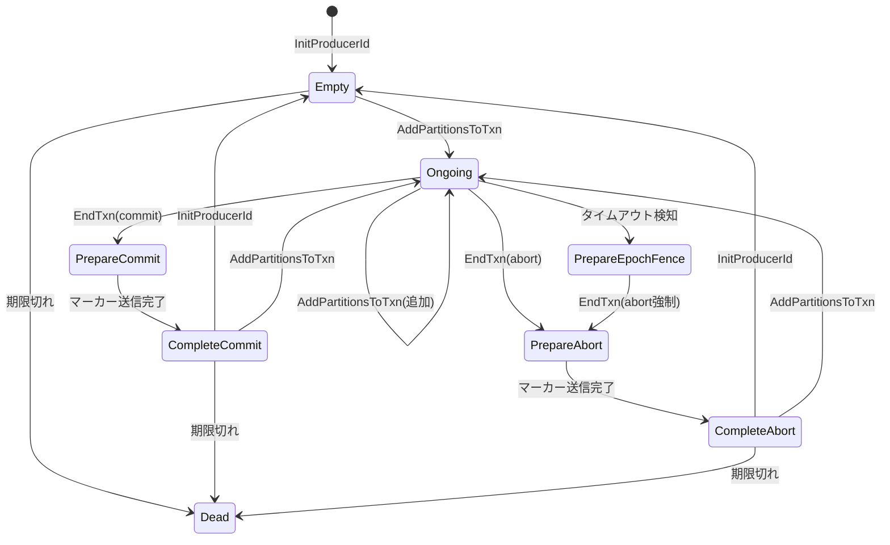
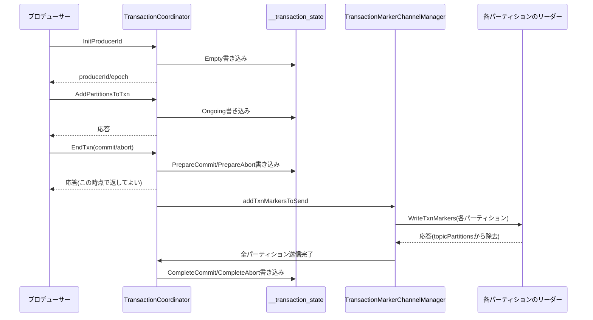

# 第23章 Transaction Coordinator と Exactly-Once Semantics

> **本章で読むソース**
>
> - [`core/src/main/scala/kafka/coordinator/transaction/TransactionCoordinator.scala`](https://github.com/apache/kafka/blob/4.3.1/core/src/main/scala/kafka/coordinator/transaction/TransactionCoordinator.scala)
> - [`core/src/main/scala/kafka/coordinator/transaction/TransactionStateManager.scala`](https://github.com/apache/kafka/blob/4.3.1/core/src/main/scala/kafka/coordinator/transaction/TransactionStateManager.scala)
> - [`core/src/main/scala/kafka/coordinator/transaction/TransactionMarkerChannelManager.scala`](https://github.com/apache/kafka/blob/4.3.1/core/src/main/scala/kafka/coordinator/transaction/TransactionMarkerChannelManager.scala)
> - [`transaction-coordinator/src/main/java/org/apache/kafka/coordinator/transaction/TransactionMetadata.java`](https://github.com/apache/kafka/blob/4.3.1/transaction-coordinator/src/main/java/org/apache/kafka/coordinator/transaction/TransactionMetadata.java)
> - [`transaction-coordinator/src/main/java/org/apache/kafka/coordinator/transaction/TransactionState.java`](https://github.com/apache/kafka/blob/4.3.1/transaction-coordinator/src/main/java/org/apache/kafka/coordinator/transaction/TransactionState.java)

## この章の狙い

第6章では、冪等プロデューサーがproducerId、エポック、シーケンス番号の3つ組で単一パーティションへの重複書き込みを防ぐ仕組みを見た。
第12章では、その3つ組をブローカー側の`ProducerStateManager`がどう検証し、トランザクションの未確定区間をどう`ongoingTxns`と`unreplicatedTxns`で追跡するかを見た。

冪等性が保証するのは1パーティション内の重複排除だけである。

複数パーティションにまたがる書き込みを1つの原子的な単位としてコミットまたはアボートするには、それらのパーティションの状態を横断して調停する主体が別に要る。

その役割を担うのが**Transaction Coordinator**である。

本章では、`TransactionCoordinator`がトランザクションの開始からコミットとアボートまでをどう調停し、その調停結果を`__transaction_state`トピックへどう永続化し、各パーティションへ**トランザクションマーカー**をどう書き込んで結果を確定させるかを読む。

## 前提

トランザクションを使うプロデューサーは、まず`transactional.id`（以下、トランザクショナルID）を設定する。

トランザクショナルIDは、そのプロデューサーのプロセスが再起動しても同一のトランザクションの続きとして扱われるための鍵であり、ブローカーはこのIDをハッシュしてどのTransaction Coordinatorが担当するかを決める。

[`core/src/main/scala/kafka/coordinator/transaction/TransactionStateManager.scala L447`](https://github.com/apache/kafka/blob/4.3.1/core/src/main/scala/kafka/coordinator/transaction/TransactionStateManager.scala#L447)

```scala
  def partitionFor(transactionalId: String): Int = Utils.abs(transactionalId.hashCode) % transactionTopicPartitionCount
```

このパーティション番号が指す先は`__transaction_state`という内部トピックのパーティションである。

このパーティションのリーダーを務めるブローカーが、そのトランザクショナルIDについてのTransaction Coordinatorになる。

すなわち、Group Coordinatorがコンシューマーグループのメタデータを`__consumer_offsets`のパーティションに割り当てるのと同じ構造を、Transaction Coordinatorはトランザクションのメタデータに対して`__transaction_state`で持つ。

各トランザクションのメタデータは`TransactionMetadata`が表し、状態は`TransactionState`という列挙型で管理される。

## トランザクションの状態機械

`TransactionState`は8つの状態を持ち、状態ごとにどの状態から遷移してこられるかを`VALID_PREVIOUS_STATES`で宣言している。

[`transaction-coordinator/src/main/java/org/apache/kafka/coordinator/transaction/TransactionState.java L94-L103`](https://github.com/apache/kafka/blob/4.3.1/transaction-coordinator/src/main/java/org/apache/kafka/coordinator/transaction/TransactionState.java#L94-L103)

```java
    public static final Map<TransactionState, Set<TransactionState>> VALID_PREVIOUS_STATES = Map.of(
        EMPTY, Set.of(EMPTY, COMPLETE_COMMIT, COMPLETE_ABORT),
        ONGOING, Set.of(ONGOING, EMPTY, COMPLETE_COMMIT, COMPLETE_ABORT),
        PREPARE_COMMIT, Set.of(ONGOING),
        PREPARE_ABORT, Set.of(ONGOING, PREPARE_EPOCH_FENCE, EMPTY, COMPLETE_COMMIT, COMPLETE_ABORT),
        COMPLETE_COMMIT, Set.of(PREPARE_COMMIT),
        COMPLETE_ABORT, Set.of(PREPARE_ABORT),
        DEAD, Set.of(EMPTY, COMPLETE_ABORT, COMPLETE_COMMIT),
        PREPARE_EPOCH_FENCE, Set.of(ONGOING)
    );
```

`EMPTY`はトランザクションを開始する前の初期状態であり、`ONGOING`はパーティションへの書き込みが進行中の状態である。

`PREPARE_COMMIT`と`PREPARE_ABORT`は、コミットまたはアボートの決定を`__transaction_state`へ書き込んだ直後の中間状態であり、対応するトランザクションマーカーを各パーティションへ送り終えると`COMPLETE_COMMIT`または`COMPLETE_ABORT`へ進む。

`PREPARE_EPOCH_FENCE`は、タイムアウトしたトランザクションを強制的にアボートするときに一時的に経由する状態である。

`DEAD`はトランザクショナルIDの期限切れによって削除される直前の状態を表す。

以上を状態遷移図にすると次のようになる。



図が示すとおり、`PREPARE_COMMIT`と`PREPARE_ABORT`にはそれ以外の状態から直接入ることができない。

`ONGOING`を経由しなければコミットにもアボートにも至れない構造が、後述する2段階の永続化の起点になる。

`TransactionMetadata`はこの状態そのものに加えて`producerId`と`producerEpoch`、参加パーティションの集合である`topicPartitions`を保持する。

状態遷移は`prepareXxx`系のメソッドが新しい状態を`pendingState`として仮登録した`TxnTransitMetadata`を返し、`__transaction_state`への書き込みが成功して初めて`completeTransitionTo`が呼ばれて実際の状態が確定するという2段構えになっている。

[`transaction-coordinator/src/main/java/org/apache/kafka/coordinator/transaction/TransactionMetadata.java L318-L346`](https://github.com/apache/kafka/blob/4.3.1/transaction-coordinator/src/main/java/org/apache/kafka/coordinator/transaction/TransactionMetadata.java#L318-L346)

```java
    private TxnTransitMetadata prepareTransitionTo(TransitionData data) {
        if (pendingState.isPresent())
            throw new IllegalStateException("Preparing transaction state transition to " + state +
                " while it already a pending state " + pendingState.get());

        if (data.producerId < 0)
            throw new IllegalArgumentException("Illegal new producer id " + data.producerId);

        // The epoch is initialized to NO_PRODUCER_EPOCH when the TransactionMetadata
        // is created for the first time and it could stay like this until transitioning
        // to Dead.
        if (data.state != TransactionState.DEAD && data.producerEpoch < 0)
            throw new IllegalArgumentException("Illegal new producer epoch " + data.producerEpoch);

        // check that the new state transition is valid and update the pending state if necessary
        if (data.state.validPreviousStates().contains(this.state)) {
            TxnTransitMetadata transitMetadata = new TxnTransitMetadata(
                data.producerId, this.producerId, data.nextProducerId, data.producerEpoch, data.lastProducerEpoch,
                data.txnTimeoutMs, data.state, data.topicPartitions,
                data.txnStartTimestamp, data.txnLastUpdateTimestamp, data.clientTransactionVersion
            );

            LOGGER.debug("TransactionalId {} prepare transition from {} to {}", transactionalId, this.state, data.state);
            pendingState = Optional.of(data.state);
            return transitMetadata;
        }
        throw new IllegalStateException("Preparing transaction state transition to " + data.state + " failed since the target state " +
            data.state + " is not a valid previous state of the current state " + this.state);
    }
```

`pendingState`がすでに埋まっているときに新たな`prepareXxx`呼び出しがあれば例外になる。

これは、`TransactionCoordinator`側の各ハンドラが`txnMetadata.pendingTransitionInProgress`を見て、書き込みがまだ完了していないメタデータに対する二重の状態遷移を拒否していることに対応する。

## InitProducerId によるトランザクションの開始

プロデューサーが最初に送るのは`InitProducerId`要求であり、`TransactionCoordinator.handleInitProducerId`がこれを処理する。

[`core/src/main/scala/kafka/coordinator/transaction/TransactionCoordinator.scala L146-L169`](https://github.com/apache/kafka/blob/4.3.1/core/src/main/scala/kafka/coordinator/transaction/TransactionCoordinator.scala#L146-L169)

```scala
      val resolvedTxnTimeoutMs = if (enableTwoPCFlag) Int.MaxValue else transactionTimeoutMs
      val coordinatorEpochAndMetadata = txnManager.getTransactionState(transactionalId).flatMap {
        case None =>
          try {
            val createdMetadata = new TransactionMetadata(transactionalId,
              producerIdManager.generateProducerId(),
              RecordBatch.NO_PRODUCER_ID,
              RecordBatch.NO_PRODUCER_ID,
              RecordBatch.NO_PRODUCER_EPOCH,
              RecordBatch.NO_PRODUCER_EPOCH,
              resolvedTxnTimeoutMs,
              TransactionState.EMPTY,
              util.Set.of(),
              -1,
              time.milliseconds(),
              TransactionVersion.TV_0)
            txnManager.putTransactionStateIfNotExists(createdMetadata)
          } catch {
            case e: Exception => Left(Errors.forException(e))
          }

        case Some(epochAndTxnMetadata) => Right(epochAndTxnMetadata)
      }
```

このトランザクショナルIDを初めて見るときは、`EMPTY`状態で新しい`TransactionMetadata`を生成する。

すでにメタデータが存在すれば、それを使って続きの処理に入る。

続く`prepareInitProducerIdTransit`は、現在の状態に応じてどう振る舞うかを決める中心的な分岐である。

[`core/src/main/scala/kafka/coordinator/transaction/TransactionCoordinator.scala L253-L291`](https://github.com/apache/kafka/blob/4.3.1/core/src/main/scala/kafka/coordinator/transaction/TransactionCoordinator.scala#L253-L291)

```scala
      txnMetadata.state match {
        case TransactionState.PREPARE_ABORT | TransactionState.PREPARE_COMMIT =>
          // reply to client and let it backoff and retry
          Left(Errors.CONCURRENT_TRANSACTIONS)

        case TransactionState.COMPLETE_ABORT | TransactionState.COMPLETE_COMMIT | TransactionState.EMPTY =>
          val transitMetadataResult =
            // If the epoch is exhausted and the expected epoch (if provided) matches it, generate a new producer ID
            try {
              if (txnMetadata.isProducerEpochExhausted &&
                  expectedProducerIdAndEpoch.forall(_.epoch == txnMetadata.producerEpoch))
                Right(txnMetadata.prepareProducerIdRotation(producerIdManager.generateProducerId(), transactionTimeoutMs, time.milliseconds(),
                  expectedProducerIdAndEpoch.isDefined))
              else
                Right(txnMetadata.prepareIncrementProducerEpoch(transactionTimeoutMs, expectedProducerIdAndEpoch.map(e => Short.box(e.epoch)).toJava,
                  time.milliseconds()))
            } catch {
              case e: Exception => Left(Errors.forException(e))
            }

          transitMetadataResult match {
            case Right(transitMetadata) => Right((coordinatorEpoch, transitMetadata))
            case Left(err) => Left(err)
          }

        case TransactionState.ONGOING =>
          // indicate to abort the current ongoing txn first. Note that this epoch is never returned to the
          // user. We will abort the ongoing transaction and return CONCURRENT_TRANSACTIONS to the client.
          // This forces the client to retry, which will ensure that the epoch is bumped a second time. In
          // particular, if fencing the current producer exhausts the available epochs for the current producerId,
          // then when the client retries, we will generate a new producerId.
          Right(coordinatorEpoch, txnMetadata.prepareFenceProducerEpoch())
```

前回のトランザクションが`ONGOING`のまま新たな`InitProducerId`が届くのは、プロデューサーのプロセスがクラッシュし、再起動後に同じトランザクショナルIDで自分を初期化しようとしている場合である。

このときコーディネーターは、古いプロセスが復帰してきても書き込みを続けられないよう、まずエポックだけを繰り上げて古いプロデューサーを締め出す**フェンシング**を行い、続くトランザクションはアボートへ回す。

コメントにあるとおり、この繰り上げたエポックは新しいプロデューサーには返さない。

新しいプロデューサーは`CONCURRENT_TRANSACTIONS`エラーを受けてリトライし、リトライ時に改めてエポックを繰り上げてもらう。

`COMPLETE_ABORT`、`COMPLETE_COMMIT`、`EMPTY`であれば、通常の`InitProducerId`としてエポックを1つ繰り上げる。

エポックが上限（`Short.MAX_VALUE`）に達していれば、producerIdそのものを新規に払い出して0から数え直す。

決定した新しい状態は`txnManager.appendTransactionToLog`によって`__transaction_state`へ書き込まれ、書き込みが成功して初めてプロデューサーへ応答が返る。

## AddPartitionsToTxn による参加パーティションの記録

プロデューサーがトランザクション中のパーティションへ初めて書き込むとき、Produce要求に先立って`AddPartitionsToTxn`要求を送る。

`handleAddPartitionsToTransaction`は、これを受けて`topicPartitions`に新しいパーティションを追加する。

[`core/src/main/scala/kafka/coordinator/transaction/TransactionCoordinator.scala L434-L453`](https://github.com/apache/kafka/blob/4.3.1/core/src/main/scala/kafka/coordinator/transaction/TransactionCoordinator.scala#L434-L453)

```scala
          txnMetadata.inLock(() => {
            if (txnMetadata.pendingTransitionInProgress) {
              // return a retriable exception to let the client backoff and retry
              // This check is performed first so that the pending transition can complete before subsequent checks.
              // With TV2, we may be transitioning over a producer epoch overflow, and the producer may be using the
              // new producer ID that is still only in pending state.
              Left(Errors.CONCURRENT_TRANSACTIONS)
            } else if (txnMetadata.producerId != producerId) {
              Left(Errors.INVALID_PRODUCER_ID_MAPPING)
            } else if (txnMetadata.producerEpoch != producerEpoch) {
              Left(Errors.PRODUCER_FENCED)
            } else if (txnMetadata.state == TransactionState.PREPARE_COMMIT || txnMetadata.state == TransactionState.PREPARE_ABORT) {
              Left(Errors.CONCURRENT_TRANSACTIONS)
            } else if (txnMetadata.state == TransactionState.ONGOING && txnMetadata.topicPartitions.containsAll(partitions)) {
              // this is an optimization: if the partitions are already in the metadata reply OK immediately
              Left(Errors.NONE)
            } else {
              Right(coordinatorEpoch, txnMetadata.prepareAddPartitions(partitions, time.milliseconds(), clientTransactionVersion))
            }
          })
```

`producerId`と`producerEpoch`の一致検査は、この要求を送ってきたプロデューサーが本当に現在有効なプロデューサーであることを確認するものである。

すでにフェンシングされた古いプロデューサーは、ここで`PRODUCER_FENCED`を受け取って処理を止める。

コード中のコメントが明示するとおり、追加しようとしているパーティションがすでに`topicPartitions`に含まれていれば、`__transaction_state`への書き込みを経ずに`Errors.NONE`を即座に返す最適化がある。

同じパーティションへの2バッチ目以降の書き込みでは、この早期リターンによって毎回の`AddPartitionsToTxn`が永続化のコストを払わずに済む。

初参加のパーティションが含まれる場合だけ`prepareAddPartitions`で新しい`topicPartitions`の集合を組み立て、`ONGOING`状態への遷移として`__transaction_state`へ書き込む。

## EndTxn とトランザクションマーカーの送信

プロデューサーがトランザクションを終える`EndTxn`要求を送ると、`handleEndTransaction`が呼ばれる。

4.3.1時点のロジックはトランザクションプロトコルのバージョン（`TransactionVersion`、以下TV）によって2系統に分かれており、`clientTransactionVersion.supportsEpochBump()`が偽であればTV1相当の`endTransactionWithTV1`に委譲する。

[`core/src/main/scala/kafka/coordinator/transaction/TransactionCoordinator.scala L763-L766`](https://github.com/apache/kafka/blob/4.3.1/core/src/main/scala/kafka/coordinator/transaction/TransactionCoordinator.scala#L763-L766)

```scala
    if (!clientTransactionVersion.supportsEpochBump()) {
      endTransactionWithTV1(transactionalId, producerId, producerEpoch, txnMarkerResult, isFromClient, responseCallback, requestLocal)
      return
    }
```

TV2以降で`EndTxn`を受けたときのコミットとアボートの分岐は複雑だが、`ONGOING`状態からの遷移だけを見れば骨格は単純である。

[`core/src/main/scala/kafka/coordinator/transaction/TransactionCoordinator.scala L850-L857`](https://github.com/apache/kafka/blob/4.3.1/core/src/main/scala/kafka/coordinator/transaction/TransactionCoordinator.scala#L850-L857)

```scala
            else txnMetadata.state match {
              case TransactionState.ONGOING =>
                val nextState = if (txnMarkerResult == TransactionResult.COMMIT)
                  TransactionState.PREPARE_COMMIT
                else
                  TransactionState.PREPARE_ABORT

                generateTxnTransitMetadataForTxnCompletion(nextState, false)
```

コミットであれば`PREPARE_COMMIT`、アボートであれば`PREPARE_ABORT`への遷移を`__transaction_state`へ書き込む。

この書き込みが成功して初めて、プロデューサーへの応答とトランザクションマーカーの送信が始まる。

[`core/src/main/scala/kafka/coordinator/transaction/TransactionCoordinator.scala L969-L974`](https://github.com/apache/kafka/blob/4.3.1/core/src/main/scala/kafka/coordinator/transaction/TransactionCoordinator.scala#L969-L974)

```scala
                case Right((txnMetadata, newPreSendMetadata)) =>
                  // we can respond to the client immediately and continue to write the txn markers if
                  // the log append was successful
                  responseCallback(Errors.NONE, newPreSendMetadata.producerId, newPreSendMetadata.producerEpoch)

                  txnMarkerChannelManager.addTxnMarkersToSend(coordinatorEpoch, txnMarkerResult, txnMetadata, newPreSendMetadata)
```

`__transaction_state`への書き込みが完了した時点でプロデューサーへ即座に応答してよいのは、コミットまたはアボートという**決定**そのものはすでに永続化されているからである。

決定が永続化されていれば、この先マーカーの配送がどれだけ遅延しても、あるいはこのコーディネーターがクラッシュして別のブローカーに引き継がれても、`__transaction_state`を読み直した新しいコーディネーターが同じ決定に基づいてマーカー送信をやり直せる。

決定と配送を分離し、決定さえ永続化すれば配送の遅延や再試行がクライアントを待たせずに済むという点が、Transaction Coordinatorの設計の骨格である。

## トランザクションマーカーによるコミットとアボートの表現

`addTxnMarkersToSend`は、参加している各パーティションのリーダーへ向けて`WriteTxnMarkers`要求を組み立てる。

[`core/src/main/scala/kafka/coordinator/transaction/TransactionMarkerChannelManager.scala L315-L333`](https://github.com/apache/kafka/blob/4.3.1/core/src/main/scala/kafka/coordinator/transaction/TransactionMarkerChannelManager.scala#L315-L333)

```scala
  def addTxnMarkersToSend(coordinatorEpoch: Int,
                          txnResult: TransactionResult,
                          txnMetadata: TransactionMetadata,
                          newMetadata: TxnTransitMetadata): Unit = {
    val transactionalId = txnMetadata.transactionalId
    val pendingCompleteTxn = PendingCompleteTxn(
      transactionalId,
      coordinatorEpoch,
      txnMetadata,
      newMetadata)

    val prev = transactionsWithPendingMarkers.put(transactionalId, pendingCompleteTxn)
    if (prev != null) {
      info(s"Replaced an existing pending complete txn $prev with $pendingCompleteTxn while adding markers to send.")
    }

    addTxnMarkersToBrokerQueue(txnMetadata.producerId,
      txnMetadata.producerEpoch, txnResult, pendingCompleteTxn, txnMetadata.topicPartitions.asScala.toSet)
    maybeWriteTxnCompletion(transactionalId)
  }
```

ここで送られる`WriteTxnMarkers`要求の実体は、パーティションのログへ書き込む**制御バッチ**（`EndTransactionMarker`を含むバッチ）である。

トランザクション中に実際に書き込まれたレコードそのものは、コミット時もアボート時も一切書き直されない。

各パーティションのリーダーは、この制御バッチを受け取ると`ProducerStateManager`（第12章）の`appendEndTxnMarker`を通じて`CompletedTxn`を確定させ、`ongoingTxns`から`unreplicatedTxns`へ移す。

つまりコミットとアボートの違いは、実データの有無ではなく、コンシューマーがそのオフセット範囲を読んでよいかどうかという1ビットの情報として、パーティションのログに刻まれるマーカー1件だけで表現される。

マーカーの送信状況は`transactionsWithPendingMarkers`と各ブローカー宛ての送信キューで追跡され、すべてのパーティションへの送信が完了すると`maybeWriteTxnCompletion`が呼ばれる。

[`core/src/main/scala/kafka/coordinator/transaction/TransactionMarkerChannelManager.scala L337-L350`](https://github.com/apache/kafka/blob/4.3.1/core/src/main/scala/kafka/coordinator/transaction/TransactionMarkerChannelManager.scala#L337-L350)

```scala
  private def hasPendingMarkersToWrite(txnMetadata: TransactionMetadata): Boolean = {
    txnMetadata.inLock(() =>
      !txnMetadata.topicPartitions.isEmpty
    )
  }

  def maybeWriteTxnCompletion(transactionalId: String): Unit = {
    Option(transactionsWithPendingMarkers.get(transactionalId)).foreach { pendingCompleteTxn =>
      if (!hasPendingMarkersToWrite(pendingCompleteTxn.txnMetadata) &&
          transactionsWithPendingMarkers.remove(transactionalId, pendingCompleteTxn)) {
        writeTxnCompletion(pendingCompleteTxn)
      }
    }
  }
```

`hasPendingMarkersToWrite`は`txnMetadata.topicPartitions`が空かどうかだけを見る。

マーカーの送信が成功したパーティションは、応答を受け取った経路（`TransactionMarkerRequestCompletionHandler`）が`txnMetadata.topicPartitions`からそのつど取り除いていくため、すべてのパーティションへの送信が終わればこの集合は空になる。

空になった時点で`writeTxnCompletion`が呼ばれ、`PREPARE_COMMIT`または`PREPARE_ABORT`から`COMPLETE_COMMIT`または`COMPLETE_ABORT`への最終遷移が`__transaction_state`へ書き込まれる。

以上の一連の流れを図にすると次のようになる。



## read_committed とLast Stable Offset

コンシューマーが`isolation.level=read_committed`を設定すると、コミットされていない、またはアボートされたトランザクションのレコードは読めなくなる。

この制御を担うのが第12章で見た**Last Stable Offset**（LSO）である。

`ProducerStateManager.firstUnstableOffset`は、`ongoingTxns`（まだ決着していないトランザクション）と`unreplicatedTxns`（決着済みだがマーカーのレプリケーションが未完了のトランザクション）の両方のうち、最も小さい先頭オフセットをLSOとして返す。

コミットかアボートかが確定していない書き込みだけでなく、確定はしたもののマーカーがまだHigh Watermarkの手前まで複製されていない書き込みも、LSOの前進を止める。

read_committedのコンシューマーはLSOより先のオフセットを読み進めない。

これにより、コンシューマーは「まだ結果が確定していない書き込み」も「結果は確定したがまだ十分に複製されていない書き込み」も等しく除外でき、Transaction Coordinatorが`__transaction_state`にコミットとアボートの決定を確定させ、かつそのマーカーが安全に複製されるまでは、そのトランザクションの内容がコンシューマーから見えることはない。

## タイムアウトしたトランザクションの強制終了

プロデューサーが`EndTxn`を送らないままクラッシュした場合に備え、`TransactionCoordinator`は`transaction.max.timeout.ms`を超えて`ONGOING`のままのトランザクションを定期的に検出し、強制的にアボートする。

[`core/src/main/scala/kafka/coordinator/transaction/TransactionCoordinator.scala L1072-L1080`](https://github.com/apache/kafka/blob/4.3.1/core/src/main/scala/kafka/coordinator/transaction/TransactionCoordinator.scala#L1072-L1080)

```scala
  def startup(retrieveTransactionTopicPartitionCount: () => Int, enableTransactionalIdExpiration: Boolean = true): Unit = {
    info("Starting up.")
    scheduler.startup()
    scheduler.schedule("transaction-abort",
      () => abortTimedOutTransactions(onEndTransactionComplete),
      txnConfig.abortTimedOutTransactionsIntervalMs,
      txnConfig.abortTimedOutTransactionsIntervalMs
    )
```

`abortTimedOutTransactions`は`txnManager.timedOutTransactions()`が返すトランザクションについて`prepareFenceProducerEpoch`を呼び、`PREPARE_EPOCH_FENCE`への遷移を介してエポックを繰り上げてからアボートへ進める。

エポックを繰り上げるのは、タイムアウトしたと判断した後にクラッシュしていたプロデューサーが復帰し、コーディネーターの強制アボートと競合して書き込みを続けてしまう事態を防ぐためである。

`InitProducerId`の`ONGOING`分岐で見たフェンシングと同じ考え方が、タイムアウト検知の経路でも使われている。

## まとめ

`TransactionCoordinator`は、トランザクショナルIDをキーに`__transaction_state`の担当パーティションを決め、`TransactionMetadata`の状態機械を通じてトランザクションの開始、参加パーティションの記録、コミットまたはアボートの決定を調停する。

状態遷移は必ず`__transaction_state`への書き込みが成功して初めて確定するため、コーディネーターが引き継がれても決定自体は失われない。

コミットとアボートの結果は、実データを書き直すのではなく、各パーティションへ送るトランザクションマーカーという1件の制御バッチで表現される。

決定の永続化とマーカーの配送を分離し、決定さえ`__transaction_state`に書き終えればプロデューサーへ即座に応答できる設計が、マーカー配送の遅延やコーディネーターの引き継ぎをクライアントの待ち時間から切り離している。

read_committedのコンシューマーは、この決定と配送の両方が完了するまでLSOによって該当区間の読み出しを止められる。

## 関連する章

- 第6章 [Sender と冪等プロデューサー](../part02-producer/06-sender-idempotence.md)（producerId、エポック、シーケンス番号の採番）
- 第12章 [ProducerStateManager と冪等・トランザクション状態](../part03-storage/12-producer-state.md)（トランザクションマーカーの検証とLSOの計算）
- 第24章 [Share Coordinator](24-share-coordinator.md)
