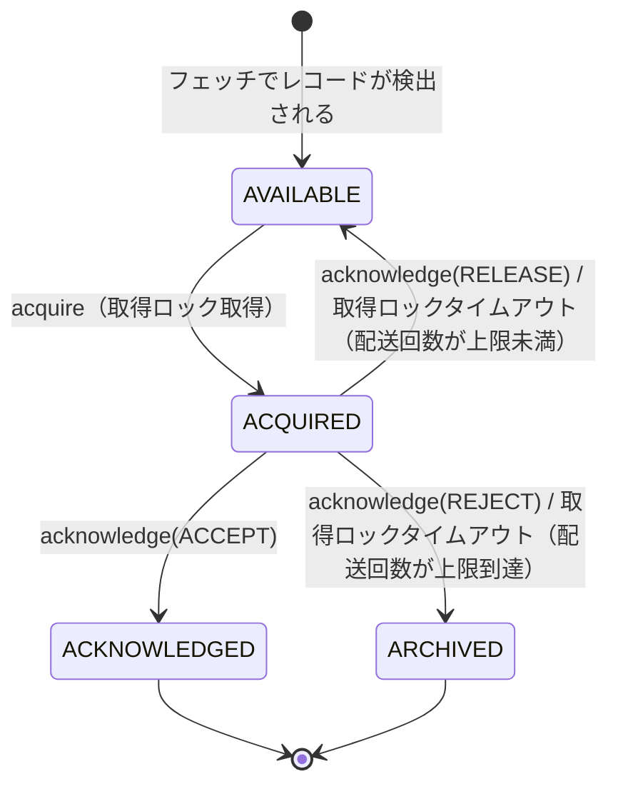

# 第24章 Share Coordinator とキュー型コンシューム（KIP-932）

> **本章で読むソース**
>
> - [`share-coordinator/src/main/java/org/apache/kafka/coordinator/share/ShareCoordinatorShard.java`](https://github.com/apache/kafka/blob/4.3.1/share-coordinator/src/main/java/org/apache/kafka/coordinator/share/ShareCoordinatorShard.java)
> - [`share-coordinator/src/main/java/org/apache/kafka/coordinator/share/ShareCoordinatorService.java`](https://github.com/apache/kafka/blob/4.3.1/share-coordinator/src/main/java/org/apache/kafka/coordinator/share/ShareCoordinatorService.java)
> - [`share-coordinator/src/main/java/org/apache/kafka/coordinator/share/ShareGroupOffset.java`](https://github.com/apache/kafka/blob/4.3.1/share-coordinator/src/main/java/org/apache/kafka/coordinator/share/ShareGroupOffset.java)
> - [`share-coordinator/src/main/java/org/apache/kafka/coordinator/share/PersisterStateBatchCombiner.java`](https://github.com/apache/kafka/blob/4.3.1/share-coordinator/src/main/java/org/apache/kafka/coordinator/share/PersisterStateBatchCombiner.java)
> - [`core/src/main/java/kafka/server/share/SharePartition.java`](https://github.com/apache/kafka/blob/4.3.1/core/src/main/java/kafka/server/share/SharePartition.java)
> - [`core/src/main/java/kafka/server/share/SharePartitionManager.java`](https://github.com/apache/kafka/blob/4.3.1/core/src/main/java/kafka/server/share/SharePartitionManager.java)
> - [`server/src/main/java/org/apache/kafka/server/share/fetch/RecordState.java`](https://github.com/apache/kafka/blob/4.3.1/server/src/main/java/org/apache/kafka/server/share/fetch/RecordState.java)
> - [`server/src/main/java/org/apache/kafka/server/share/fetch/InFlightState.java`](https://github.com/apache/kafka/blob/4.3.1/server/src/main/java/org/apache/kafka/server/share/fetch/InFlightState.java)
> - [`server/src/main/java/org/apache/kafka/server/share/fetch/InFlightBatch.java`](https://github.com/apache/kafka/blob/4.3.1/server/src/main/java/org/apache/kafka/server/share/fetch/InFlightBatch.java)

## この章の狙い

第21章と第22章で見た消費グループの割り当ては、パーティションを1つのコンシューマーに占有させる方式である。
**KIP-932** はこれとは別の消費モデルとして、複数のコンシューマーが同一パーティションから個別にレコードを取得し、レコード単位で確認応答（**acknowledge**）できる**シェアグループ**（share group）を導入した。俗に「Queues for Kafka」と呼ばれる機能である。

本章では、ブローカー側でレコードの取得状態を追跡する `SharePartition` と、その状態を `__share_group_state` トピックへ永続化する **Share Coordinator** の実装を読む。パーティション占有型のリバランスとは異なる設計判断がどこに現れるかに注目する。

## 前提

シェアグループでは、1つのパーティションに複数のコンシューマーがぶら下がり、ブローカーがレコードを配って回収する。
この方式を実現するには、ブローカー側で次の2つの情報を管理する必要がある。

- **どのレコードが誰にどの状態で渡っているか**（取得中か、確認済みか、破棄済みか）
- **その情報をブローカー障害時にも失わないための永続化**

前者を担うのが `SharePartition`（本章で読む2つ目の主役）であり、後者を担うのが Share Coordinator である。
両者の関係は、第21章で扱う Group Coordinator と第16章の Purgatory の関係に似ている。
`SharePartition` はブローカーのメモリ上でレコードごとの状態遷移とロック管理を行い、Share Coordinator はその結果を内部トピックに書き込んで永続化する役割分担である。

## share グループの状態と Share Coordinator

Share Coordinator は Group Coordinator や Transaction Coordinator（第23章）と同じく、`CoordinatorRuntime` の上に構築された**シャード**である。
`ShareCoordinatorShard` はシェアグループの1パーティション分の状態を、次の4つの `TimelineHashMap` で保持する。

[`share-coordinator/src/main/java/org/apache/kafka/coordinator/share/ShareCoordinatorShard.java L80-L86`](https://github.com/apache/kafka/blob/4.3.1/share-coordinator/src/main/java/org/apache/kafka/coordinator/share/ShareCoordinatorShard.java#L80-L86)

```java
    private final TimelineHashMap<SharePartitionKey, ShareGroupOffset> shareStateMap;  // coord key -> ShareGroupOffset
    // leaderEpochMap can be updated by writeState call
    // or if a newer leader makes a readState call.
    private final TimelineHashMap<SharePartitionKey, Integer> leaderEpochMap;
    private final TimelineHashMap<SharePartitionKey, Integer> snapshotUpdateCount;
    private final TimelineHashMap<SharePartitionKey, Integer> stateEpochMap;
```

キーとなる `SharePartitionKey` は「グループID・トピックID・パーティション番号」の組であり、シェアグループが購読する1パーティションを一意に指す。
`shareStateMap` に入る `ShareGroupOffset` が、そのパーティションの状態（開始オフセット、リーダーエポック、確認済みレコード数、未確認のレコード区間の一覧）を表す。

ブローカーの `SharePartitionManager`（後述）が状態を書き込むときは `WriteShareGroupStateRequest` という RPC を発行し、これを `ShareCoordinatorService` が受け取って `CoordinatorRuntime` 経由でシャードに委譲する。

[`share-coordinator/src/main/java/org/apache/kafka/coordinator/share/ShareCoordinatorService.java L444-L462`](https://github.com/apache/kafka/blob/4.3.1/share-coordinator/src/main/java/org/apache/kafka/coordinator/share/ShareCoordinatorService.java#L444-L462)

```java
        request.topics().forEach(topicData -> {
            Map<Integer, CompletableFuture<WriteShareGroupStateResponseData>> partitionFut =
                futureMap.computeIfAbsent(topicData.topicId(), k -> new HashMap<>());
            topicData.partitions().forEach(
                partitionData -> {
                    CompletableFuture<WriteShareGroupStateResponseData> future = runtime.scheduleWriteOperation(
                            "write-share-group-state",
                            topicPartitionFor(SharePartitionKey.getInstance(groupId, topicData.topicId(), partitionData.partition())),
                            coordinator -> coordinator.writeState(new WriteShareGroupStateRequestData()
                                .setGroupId(groupId)
                                .setTopics(List.of(new WriteShareGroupStateRequestData.WriteStateData()
                                    .setTopicId(topicData.topicId())
                                    .setPartitions(List.of(new WriteShareGroupStateRequestData.PartitionData()
                                        .setPartition(partitionData.partition())
                                        .setStartOffset(partitionData.startOffset())
                                        .setDeliveryCompleteCount(partitionData.deliveryCompleteCount())
                                        .setLeaderEpoch(partitionData.leaderEpoch())
                                        .setStateEpoch(partitionData.stateEpoch())
                                        .setStateBatches(partitionData.stateBatches())))))))
                        .exceptionally(exception -> handleOperationException(
```

要求は1リクエストに複数のグループ・トピック・パーティションを含みうるが、`ShareCoordinatorShard` 側の `writeState` は単一キーだけを扱う設計になっているため、サービス層でキーごとに分解してから `runtime.scheduleWriteOperation` に渡している。
`topicPartitionFor` はキーのハッシュから `__share_group_state` トピックのパーティション番号を計算する。以後の書き込みはそのパーティションの `CoordinatorRuntime` イベントループ内で直列化され、Group Coordinator や Transaction Coordinator と同じ仕組みで永続化される。

`ShareCoordinatorShard.replay` はこのトピックから読み戻したレコードを `shareStateMap` に反映するコールバックであり、レコード種別は `SHARE_SNAPSHOT`（完全なスナップショット）と `SHARE_UPDATE`（差分）の2種類である。

[`share-coordinator/src/main/java/org/apache/kafka/coordinator/share/ShareCoordinatorShard.java L245-L270`](https://github.com/apache/kafka/blob/4.3.1/share-coordinator/src/main/java/org/apache/kafka/coordinator/share/ShareCoordinatorShard.java#L245-L270)

```java
    private void handleShareSnapshot(ShareSnapshotKey key, ShareSnapshotValue value, long offset) {
        SharePartitionKey mapKey = SharePartitionKey.getInstance(key.groupId(), key.topicId(), key.partition());
        if (value == null) {
            log.debug("Tombstone records received for share partition key: {}", mapKey);
            // Consider this a tombstone.
            shareStateMap.remove(mapKey);
            leaderEpochMap.remove(mapKey);
            stateEpochMap.remove(mapKey);
            snapshotUpdateCount.remove(mapKey);
        } else {
            maybeUpdateLeaderEpochMap(mapKey, value.leaderEpoch());
            maybeUpdateStateEpochMap(mapKey, value.stateEpoch());

            ShareGroupOffset offsetRecord = ShareGroupOffset.fromRecord(value);
            // This record is the complete snapshot.
            shareStateMap.put(mapKey, offsetRecord);
            // If number of share updates is exceeded, then reset it.
            if (snapshotUpdateCount.containsKey(mapKey)) {
                if (snapshotUpdateCount.get(mapKey) >= config.shareCoordinatorSnapshotUpdateRecordsPerSnapshot()) {
                    snapshotUpdateCount.put(mapKey, 0);
                }
            }
        }

        offsetsManager.updateState(mapKey, offset, value == null);
    }
```

`SHARE_SNAPSHOT` の値が `null` であればトンブストーン、つまりシェアグループの状態削除を意味する。値がある場合はそのまま `shareStateMap` を上書きする。これはスナップショットが「差分ではなく完全な状態」だからである。

## スナップショットと更新レコードの圧縮

シェアグループはコンシューマーが取得・確認するたびに状態が変化する。この変化を毎回スナップショットとして書き込むと、内部トピックへの書き込み量がレコードの入れ替わりに比例して増える。
`ShareCoordinatorShard` はこれを避けるため、更新のたびに完全なスナップショットを書くのではなく、既定の**更新レコード上限**に達するまでは差分だけを表す `SHARE_UPDATE` レコードを書き、上限を超えたときにだけ完全なスナップショットへ折り畳む。

[`share-coordinator/src/main/java/org/apache/kafka/coordinator/share/ShareCoordinatorShard.java L648-L695`](https://github.com/apache/kafka/blob/4.3.1/share-coordinator/src/main/java/org/apache/kafka/coordinator/share/ShareCoordinatorShard.java#L648-L695)

```java
    private CoordinatorRecord generateShareStateRecord(
        WriteShareGroupStateRequestData.PartitionData partitionData,
        SharePartitionKey key,
        boolean updateLeaderEpoch
    ) {
        long timestamp = time.milliseconds();
        int updatesPerSnapshotLimit = config.shareCoordinatorSnapshotUpdateRecordsPerSnapshot();
        ShareGroupOffset currentState = shareStateMap.get(key); // This method assumes containsKey is true.

        int newLeaderEpoch = currentState.leaderEpoch();
        if (updateLeaderEpoch) {
            newLeaderEpoch = partitionData.leaderEpoch() != -1 ? partitionData.leaderEpoch() : newLeaderEpoch;
        }

        if (snapshotUpdateCount.getOrDefault(key, 0) >= updatesPerSnapshotLimit) {
            // shareStateMap will have the entry as containsKey is true
            long newStartOffset = partitionData.startOffset() == -1 ? currentState.startOffset() : partitionData.startOffset();

            // Since the number of update records for this share part key exceeds snapshotUpdateRecordsPerSnapshot
            // or state epoch has incremented, we should be creating a share snapshot record.
            // The incoming partition data could have overlapping state batches, we must merge them.
            return ShareCoordinatorRecordHelpers.newShareSnapshotRecord(
                key.groupId(), key.topicId(), partitionData.partition(),
                new ShareGroupOffset.Builder()
                    .setSnapshotEpoch(currentState.snapshotEpoch() + 1)   // We must increment snapshot epoch as this is new snapshot.
                    .setStartOffset(newStartOffset)
                    .setDeliveryCompleteCount(partitionData.deliveryCompleteCount())
                    .setLeaderEpoch(newLeaderEpoch)
                    .setStateEpoch(currentState.stateEpoch())
                    .setStateBatches(mergeBatches(currentState.stateBatches(), partitionData, newStartOffset))
                    .setCreateTimestamp(timestamp)
                    .setWriteTimestamp(timestamp)
                    .build());
        } else {
            // Share snapshot is present and number of share snapshot update records < snapshotUpdateRecordsPerSnapshot
            // so create a share update record.
            // The incoming partition data could have overlapping state batches, we must merge them.
            return ShareCoordinatorRecordHelpers.newShareUpdateRecord(
                key.groupId(), key.topicId(), partitionData.partition(),
                new ShareGroupOffset.Builder()
                    .setSnapshotEpoch(currentState.snapshotEpoch()) // Use same snapshotEpoch as last share snapshot.
                    .setStartOffset(partitionData.startOffset())
                    .setDeliveryCompleteCount(partitionData.deliveryCompleteCount())
                    .setLeaderEpoch(newLeaderEpoch)
                    .setStateBatches(mergeBatches(List.of(), partitionData))
                    .build());
        }
    }
```

`SHARE_UPDATE` はブローカーが再起動したときに前回のスナップショットへ適用する差分にすぎないため、ログコンパクション（第11章）が効いても直近の少数レコードだけが残ればよい。これはログのアペンド量とコンパクション後のサイズの両方を抑える設計であり、Group Coordinator が定期的にオフセットスナップショットを圧縮するのと同じ発想である。

## 状態バッチの併合

`SHARE_UPDATE` を複数回積み重ねてから最終的にスナップショットへ折り畳む際、レコード区間（**状態バッチ**、state batch）は重なりを持ちうる。
たとえば「10〜20番オフセットは確認済み」という古いバッチと、「15〜18番オフセットは再取得中」という新しいバッチが両方存在する状態である。これを1本の非重複なリストへ統合するのが `PersisterStateBatchCombiner` である。

[`share-coordinator/src/main/java/org/apache/kafka/coordinator/share/PersisterStateBatchCombiner.java L207-L240`](https://github.com/apache/kafka/blob/4.3.1/share-coordinator/src/main/java/org/apache/kafka/coordinator/share/PersisterStateBatchCombiner.java#L207-L240)

```java
    /**
     * Accepts a list of {@link PersisterStateBatch} and checks:
     * - last offset is < start offset => batch is removed
     * - first offset > start offset => batch is preserved
     * - start offset intersects the batch => part of batch before start offset is removed and
     * the part after it is preserved.
     */
    private void pruneBatches() {
        if (startOffset != -1) {
            List<PersisterStateBatch> retainedBatches = new ArrayList<>(combinedBatchList.size());
            combinedBatchList.forEach(batch -> {
                if (batch.lastOffset() < startOffset) {
                    // batch is expired, skip current iteration
                    // -------
                    //         | -> start offset
                    return;
                }

                if (batch.firstOffset() >= startOffset) {
                    // complete batch is valid
                    //    ---------
                    //  | -> start offset
                    retainedBatches.add(batch);
                } else {
                    // start offset intersects batch
                    //   ---------
                    //       |     -> start offset
                    retainedBatches.add(new PersisterStateBatch(startOffset, batch.lastOffset(), batch.deliveryState(), batch.deliveryCount()));
                }
            });
            // update the instance variable
            combinedBatchList = retainedBatches;
        }
    }
```

まず開始オフセットより前のバッチを刈り込み（`pruneBatches`）、次に `TreeSet` へ載せて隣接ペアを順に走査しながら統合する（`mergeBatches`）。
統合の優先順位は削除状態（deliveryState）と配送回数（deliveryCount）の比較で決まる。2つのバッチが重なり合う場合、より進んだ状態（確認済みや破棄済みなど終端に近い状態）が優先されて残る。この優先順位の比較を担うのが次のメソッドである。

[`share-coordinator/src/main/java/org/apache/kafka/coordinator/share/PersisterStateBatchCombiner.java L148-L162`](https://github.com/apache/kafka/blob/4.3.1/share-coordinator/src/main/java/org/apache/kafka/coordinator/share/PersisterStateBatchCombiner.java#L148-L162)

```java
    private int compareBatchDeliveryInfo(PersisterStateBatch b1, PersisterStateBatch b2) {
        int deltaCount = Short.compare(b1.deliveryCount(), b2.deliveryCount());

        // Delivery state could be:
        // 0 - AVAILABLE (non-terminal)
        // 1 - ACQUIRED - should not be persisted yet
        // 2 - ACKNOWLEDGED (terminal)
        // 3 - ARCHIVING - not implemented in KIP-932 - non-terminal - leads only to ARCHIVED
        // 4 - ARCHIVED (terminal)

        if (deltaCount == 0) {   // same delivery count
            return Byte.compare(b1.deliveryState(), b2.deliveryState());
        }
        return deltaCount;
    }
```

この併合処理があるおかげで、Share Coordinator は個々のレコードの状態を1件ずつ持つのではなく、同じ状態が連続する区間をひとまとまりのバッチとして表現できる。数百万件のレコードがあっても、確認状況が均一な区間である限りバッチ数は増えない。これが後述する `SharePartition` 側の設計とも対応する、レコード単位の状態を区間表現に圧縮する仕組みである。

## SharePartition のレコード状態管理

Share Coordinator が扱うのは永続化された状態のスナップショットだが、ブローカーが実際にどのレコードを誰に配ったかをリアルタイムに追跡するのは `SharePartition` である。
状態機械は5値の `RecordState` で定義される。

[`server/src/main/java/org/apache/kafka/server/share/fetch/RecordState.java L26-L31`](https://github.com/apache/kafka/blob/4.3.1/server/src/main/java/org/apache/kafka/server/share/fetch/RecordState.java#L26-L31)

```java
public enum RecordState {
    AVAILABLE((byte) 0),
    ACQUIRED((byte) 1),
    ACKNOWLEDGED((byte) 2),
    ARCHIVING((byte) 3),    // Per KIP-1191
    ARCHIVED((byte) 4);
```

**AVAILABLE**（未取得）はコンシューマーがまだ取得していない、または再配布待ちのレコードを指す。**ACQUIRED**（取得中）は取得ロックを持つコンシューマーに配送済みで確認応答待ちの状態、**ACKNOWLEDGED**（確認済み）と**ARCHIVED**（破棄済み）はどちらも終端状態であり、以後遷移しない。
遷移の可否は `validateTransition` が検査する。

[`server/src/main/java/org/apache/kafka/server/share/fetch/RecordState.java L50-L68`](https://github.com/apache/kafka/blob/4.3.1/server/src/main/java/org/apache/kafka/server/share/fetch/RecordState.java#L50-L68)

```java
    public RecordState validateTransition(RecordState newState) throws IllegalStateException {
        Objects.requireNonNull(newState, "newState cannot be null");
        if (this == newState) {
            throw new IllegalStateException("The state transition is invalid as the new state is "
                + "the same as the current state");
        }

        if (this == ACKNOWLEDGED || this == ARCHIVED) {
            throw new IllegalStateException("The state transition is invalid from the current state: " + this);
        }

        if (this == AVAILABLE && newState != ACQUIRED) {
            throw new IllegalStateException("The state can only be transitioned to ACQUIRED from AVAILABLE");
        }

        // Either the transition is from Available -> Acquired or from Acquired -> Available/
        // Acknowledged/Archived.
        return newState;
    }
```

AVAILABLE から遷移できる先は ACQUIRED のみであり、ACQUIRED からは AVAILABLE（再配布）・ACKNOWLEDGED・ARCHIVED のいずれかへ進める。ACKNOWLEDGED と ARCHIVED からは二度と遷移しない。

各レコード区間の実体は `InFlightBatch` が保持し、その中の `InFlightState` が状態・配送回数（deliveryCount）・保持者（memberId）を管理する。
`SharePartition.cachedState` はオフセットを起点とする `NavigableMap<Long, InFlightBatch>` であり、取得済みのバッチをオフセット順に並べて保持する。

[`core/src/main/java/kafka/server/share/SharePartition.java L180-L180`](https://github.com/apache/kafka/blob/4.3.1/core/src/main/java/kafka/server/share/SharePartition.java#L180-L180)

```java
    private final NavigableMap<Long, InFlightBatch> cachedState;
```

コンシューマーが `acquire` を呼ぶと、取得可能な区間（AVAILABLE かつ状態遷移中でないバッチ）だけが ACQUIRED へ遷移し、取得ロックのタイムアウトが仕込まれる。

[`core/src/main/java/kafka/server/share/SharePartition.java L925-L947`](https://github.com/apache/kafka/blob/4.3.1/core/src/main/java/kafka/server/share/SharePartition.java#L925-L947)

```java
                // The in-flight batch is a full match hence change the state of the complete batch.
                if (inFlightBatch.batchState() != RecordState.AVAILABLE || inFlightBatch.batchHasOngoingStateTransition()) {
                    log.trace("The batch is not available to acquire in share partition: {}-{}, skipping: {}",
                        groupId, topicIdPartition, inFlightBatch);
                    continue;
                }

                InFlightState updateResult = inFlightBatch.tryUpdateBatchState(RecordState.ACQUIRED, DeliveryCountOps.INCREASE, maxDeliveryCount(), memberId);
                if (updateResult == null || updateResult.state() != RecordState.ACQUIRED) {
                    log.info("Unable to acquire records for the batch: {} in share partition: {}-{}",
                        inFlightBatch, groupId, topicIdPartition);
                    continue;
                }
                // Schedule acquisition lock timeout for the batch.
                AcquisitionLockTimerTask acquisitionLockTimeoutTask = scheduleAcquisitionLockTimeout(memberId, inFlightBatch.firstOffset(), inFlightBatch.lastOffset());
                // Set the acquisition lock timeout task for the batch.
                inFlightBatch.updateAcquisitionLockTimeout(acquisitionLockTimeoutTask);

                result.add(new AcquiredRecords()
                    .setFirstOffset(inFlightBatch.firstOffset())
                    .setLastOffset(inFlightBatch.lastOffset())
                    .setDeliveryCount((short) inFlightBatch.batchDeliveryCount()));
                acquiredCount += (int) (inFlightBatch.lastOffset() - inFlightBatch.firstOffset() + 1);
```

ここで注目すべきは、この取得判定がバッチ単位で行われている点である。バッチ全体が同じ状態である限り、`InFlightBatch` は個々のオフセットの状態を持たず、`batchState` という単一の `InFlightState` だけで代表させる。
一方でコンシューマーがバッチの一部だけを確認応答したい場合には、`maybeInitializeOffsetStateUpdate` がオフセットごとの `InFlightState` マップを遅延生成し、以後そのバッチは個別追跡へ切り替わる。

[`server/src/main/java/org/apache/kafka/server/share/fetch/InFlightBatch.java L49-L58`](https://github.com/apache/kafka/blob/4.3.1/server/src/main/java/org/apache/kafka/server/share/fetch/InFlightBatch.java#L49-L58)

```java
    // The batch state of the fetched records. If the offset state map is empty then batchState
    // determines the state of the complete batch else individual offset determines the state of
    // the respective records.
    private InFlightState batchState;

    // The offset state map is used to track the state of the records per offset. However, the
    // offset state map is only required when the state of the offsets within same batch are
    // different. The states can be different when explicit offset acknowledgement is done which
    // is different from the batch state.
    private NavigableMap<Long, InFlightState> offsetState;
```

大半のシェアグループの利用では、コンシューマーは取得したバッチをまとめて確認応答する。バッチ丸ごとの状態が同じである間は1つの `InFlightState` を使い回し、部分確認応答という例外的な操作が発生した時点で初めてオフセット単位の展開を行う。これにより、通常運用時のメモリ使用量とロック管理のコストをレコード数ではなくバッチ数に比例させられる。これが本章の最適化点である。1レコードごとに状態を持つ素朴なキュー実装であれば、大量のレコードを扱うたびにオフセット数に比例するオブジェクトが生成されるところを、状態が揃っている区間はバッチのまま扱うことで避けている。

## 取得ロックとタイムアウトによる再配布

`acquire` されたレコードは、確認応答が来ないまま放置されるとコンシューマーの障害や遅延によって他のコンシューマーに配布されなくなってしまう。これを防ぐのが**取得ロック**（acquisition lock）のタイムアウトである。

[`core/src/main/java/kafka/server/share/SharePartition.java L2866-L2884`](https://github.com/apache/kafka/blob/4.3.1/core/src/main/java/kafka/server/share/SharePartition.java#L2866-L2884)

```java
    private AcquisitionLockTimerTask scheduleAcquisitionLockTimeout(
        String memberId,
        long firstOffset,
        long lastOffset,
        long delayMs
    ) {
        AcquisitionLockTimerTask acquisitionLockTimerTask = acquisitionLockTimerTask(memberId, firstOffset, lastOffset, delayMs);
        timer.add(acquisitionLockTimerTask);
        return acquisitionLockTimerTask;
    }

    private AcquisitionLockTimerTask acquisitionLockTimerTask(
        String memberId,
        long firstOffset,
        long lastOffset,
        long delayMs
    ) {
        return new AcquisitionLockTimerTask(time, delayMs, memberId, firstOffset, lastOffset, releaseAcquisitionLockOnTimeout(), sharePartitionMetrics);
    }
```

タイムアウトの実体は第16章で扱った Purgatory と同種のタイマーであり、期限が来ると `releaseAcquisitionLockOnTimeout` が実行されて ACQUIRED のバッチを AVAILABLE へ戻す。ただし配送回数が上限に達している場合は再配布せず ARCHIVED へ落とす判断を `InFlightState.tryUpdateState` が担う。

[`server/src/main/java/org/apache/kafka/server/share/fetch/InFlightState.java L150-L176`](https://github.com/apache/kafka/blob/4.3.1/server/src/main/java/org/apache/kafka/server/share/fetch/InFlightState.java#L150-L176)

```java
    public InFlightState tryUpdateState(RecordState newState, DeliveryCountOps ops, int maxDeliveryCount, String newMemberId) {
        try {
            // If the state transition is in progress, the state should not be updated.
            if (hasOngoingStateTransition()) {
                // A misbehaving client can send multiple requests to update the same records hence
                // do not proceed if the transition is already in progress. Do not log an error here
                // as it might not be an error rather concurrent update of same state due to multiple
                // requests. This ideally should not happen hence log in info level, if it happens
                // frequently then it might be an issue which needs to be investigated.
                log.info("{} has ongoing state transition, cannot update to: {}", this, newState);
                return null;
            }

            if (newState == RecordState.AVAILABLE && ops != DeliveryCountOps.DECREASE && deliveryCount >= maxDeliveryCount) {
                newState = RecordState.ARCHIVED;
            }
            state = state.validateTransition(newState);
            if (newState != RecordState.ARCHIVED) {
                deliveryCount = updatedDeliveryCount(ops);
            }
            memberId = newMemberId;
            return this;
        } catch (IllegalStateException e) {
            log.error("Failed to update state of the records", e);
            return null;
        }
    }
```

AVAILABLE へ戻そうとした際に配送回数がすでに上限を超えていれば、遷移先を強制的に ARCHIVED へ差し替える。これにより、配送に失敗し続けるレコードが AVAILABLE と ACQUIRED の間を無限に往復することを防ぎ、シェアグループ全体の処理を前進させる。

acknowledge の場合も同様にレコード区間ごとの状態を変更するが、複数の区間にまたがるリクエストの途中でエラーが発生する可能性があるため、まず書き込みロックの中で状態遷移を試み、成功した分だけ Share Coordinator への永続化リクエストへ積み上げる。

[`core/src/main/java/kafka/server/share/SharePartition.java L980-L1043`](https://github.com/apache/kafka/blob/4.3.1/core/src/main/java/kafka/server/share/SharePartition.java#L980-L1043)

```java
    public CompletableFuture<Void> acknowledge(
        String memberId,
        List<ShareAcknowledgementBatch> acknowledgementBatches
    ) {
        log.trace("Acknowledgement batch request for share partition: {}-{}", groupId, topicIdPartition);

        CompletableFuture<Void> future = new CompletableFuture<>();
        Throwable throwable = null;
        List<PersisterBatch> persisterBatches = new ArrayList<>();
        lock.writeLock().lock();
        try {
            // Avoided using enhanced for loop as need to check if the last batch have offsets
            // in the range.
            for (ShareAcknowledgementBatch batch : acknowledgementBatches) {
                // Client can either send a single entry in acknowledgeTypes which represents the state
                // of the complete batch or can send individual offsets state.
                Map<Long, Byte> ackTypeMap;
                try {
                    ackTypeMap = fetchAckTypeMapForBatch(batch);
                } catch (IllegalArgumentException e) {
                    log.debug("Invalid acknowledge type: {} for share partition: {}-{}",
                        batch.acknowledgeTypes(), groupId, topicIdPartition);
                    throwable = new InvalidRequestException("Invalid acknowledge type: " + batch.acknowledgeTypes());
                    break;
                }

                if (batch.lastOffset() < startOffset) {
                    log.trace("All offsets in the acknowledgement batch {} are already archived: {}-{}",
                        batch, groupId, topicIdPartition);
                    continue;
                }

                // Fetch the sub-map from the cached map for the batch to acknowledge. The sub-map can
                // be a full match, subset or spans over multiple fetched batches.
                NavigableMap<Long, InFlightBatch> subMap;
                try {
                    subMap = fetchSubMapForAcknowledgementBatch(batch);
                } catch (InvalidRecordStateException | InvalidRequestException e) {
                    throwable = e;
                    break;
                }

                // Acknowledge the records for the batch.
                Optional<Throwable> ackThrowable = acknowledgeBatchRecords(
                    memberId,
                    batch,
                    ackTypeMap,
                    subMap,
                    persisterBatches
                );

                if (ackThrowable.isPresent()) {
                    throwable = ackThrowable.get();
                    break;
                }
            }
        } finally {
            lock.writeLock().unlock();
        }
        // If the acknowledgement is successful then persist state, complete the state transition
        // and update the cached state for start offset. Else rollback the state transition.
        rollbackOrProcessStateUpdates(future, throwable, persisterBatches);
        return future;
    }
```

途中で無効な確認応答型やオフセット範囲エラーが見つかると `throwable` を設定してループを打ち切り、`rollbackOrProcessStateUpdates` が呼ばれる。ここで初めて、成功していた分だけを Share Coordinator へ書き込むか、それとも状態遷移そのものをロールバックするかが決まる。`InFlightState.startStateTransition` が遷移前の状態を退避しておくのは、このロールバックのためである。

## レコード状態遷移の全体像

ここまでの状態遷移を図にすると次のようになる。



ACKNOWLEDGED と ARCHIVED はどちらも終端状態であり、`RecordState.validateTransition` がここからの遷移を例外で拒否する。取得ロックのタイムアウトは AVAILABLE への復帰と ARCHIVED への追い出しを分岐させる唯一の場所であり、配送回数の上限判定がその分岐条件である。

## まとめ

- Share Coordinator は Group Coordinator や Transaction Coordinator と同じ `CoordinatorRuntime` の仕組みに乗り、シェアグループの状態を `__share_group_state` トピックへ永続化する。
- 状態は完全な `SHARE_SNAPSHOT` と差分の `SHARE_UPDATE` の2種類のレコードで表現され、更新回数が閾値に達すると差分がスナップショットへ折り畳まれる。これによりログの書き込み量とコンパクション後のサイズを抑える。
- 折り畳みの際、レコード区間（状態バッチ）の重なりは `PersisterStateBatchCombiner` が配送状態の優先順位に基づいて非重複なリストへ統合する。
- ブローカー側の `SharePartition` はレコードの取得・確認・破棄を `RecordState` の5値の状態機械として管理し、バッチ全体が同じ状態である間は1つの `InFlightState` で代表させ、部分確認応答が起きたときだけオフセット単位へ遅延展開する。これがレコード単位の状態をバッチ区間として圧縮表現する仕組みであり、キュー型の個別 acknowledge を可能にしながらメモリ使用量をバッチ数に抑える。
- 取得ロックのタイムアウトは、配送回数が上限に達しているかどうかで AVAILABLE への復帰と ARCHIVED への追い出しを分岐させ、配送に失敗し続けるレコードがシェアグループ全体を停滞させないようにする。

## 関連する章

- [第16章 Purgatory](../part04-replication/16-purgatory.md)（取得ロックのタイムアウト管理の基盤となるタイマー機構）
- [第21章 Group Coordinator](../part06-consumer/21-group-coordinator.md)（`CoordinatorRuntime` を用いた状態永続化の基本形）
- [第23章 Transaction Coordinator](23-transaction-coordinator.md)（同じシャード方式に基づく別のコーディネーター）
