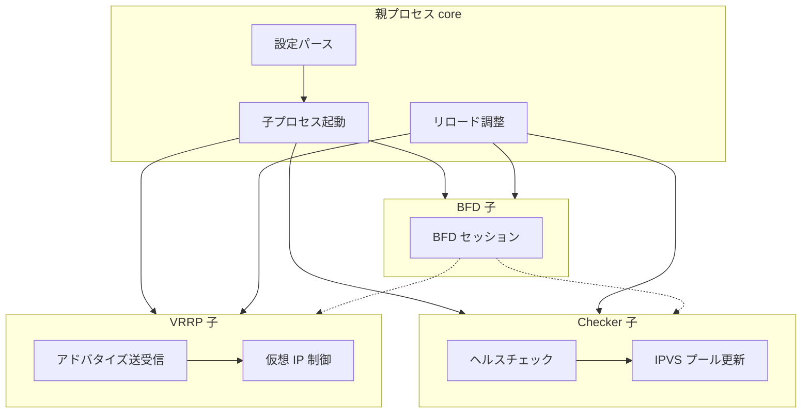

# 第1章 keepalived の全体像

> 本章で読むソース
>
> - [`keepalived/main.c`](https://github.com/acassen/keepalived/blob/v2.4.1/keepalived/main.c)
> - [`keepalived/vrrp/vrrp.c`](https://github.com/acassen/keepalived/blob/v2.4.1/keepalived/vrrp/vrrp.c)
> - [`keepalived/core/main.c`](https://github.com/acassen/keepalived/blob/v2.4.1/keepalived/core/main.c)
> - [`keepalived/check/check_daemon.c`](https://github.com/acassen/keepalived/blob/v2.4.1/keepalived/check/check_daemon.c)
> - [`keepalived/bfd/bfd_daemon.c`](https://github.com/acassen/keepalived/blob/v2.4.1/keepalived/bfd/bfd_daemon.c)
> - [`lib/scheduler.c`](https://github.com/acassen/keepalived/blob/v2.4.1/lib/scheduler.c)

## この章の狙い

keepalived が提供する機能とソースツリーの対応を把握する。
本書全体の地図として、VRRP、ヘルスチェック、IPVS、BFD の4本柱を示す。

## 前提

読者は VRRP が仮想ルータ冗長のプロトコルであること、LVS が Linux のレイヤ4ロードバランサであることを理解していることを前提とする。

## keepalived とは何か

**keepalived** は Linux 上で高可用性とロードバランシングを実現するデーモン群である。
もともと LVS プロジェクト向けに、実サーバの死活監視とプール操作を担う目的で開発された。
現在は VRRP による仮想 IP のフェイルオーバー、多種のヘルスチェック、BFD による高速障害検知を統合する。

ファイル先頭のコメントは、この起源をそのまま残している。

[`keepalived/main.c` L2-L4](https://github.com/acassen/keepalived/blob/v2.4.1/keepalived/main.c#L2-L4)

```c
 * Soft:        Keepalived is a failover program for the LVS project
 *              <www.linuxvirtualserver.org>. It monitor & manipulate
 *              a loadbalanced server pool using multi-layer checks.
```

実行ファイルの `main` は薄いラッパーであり、実処理は `keepalived_main` に委譲される。
この分離により、ユニットテストや `_ONE_PROCESS_DEBUG_` ビルドで core だけを直接呼び出せる。

[`keepalived/main.c` L27-L30](https://github.com/acassen/keepalived/blob/v2.4.1/keepalived/main.c#L27-L30)

```c
int main(int argc, char **argv)
{
	return keepalived_main(argc, argv);
}
```

## ソースツリーの構成

ソースは大きく `keepalived/`（各デーモン本体）、`lib/`（共通基盤）、`doc/`（設定例と文書）に分かれる。
`keepalived/` 配下では次のディレクトリが中核である。

| ディレクトリ | 役割 |
|---|---|
| `core/` | 親プロセス、設定読み込み、子プロセス起動、netlink |
| `vrrp/` | VRRPv2/v3 実装、仮想 IP、ルーティング、同期 |
| `check/` | リアルサーバのヘルスチェック、IPVS 操作 |
| `bfd/` | BFD セッション管理 |
| `trackers/` | ファイル変更など外部イベントの追跡 |

`lib/` は zebra 由来のスケジューラ、設定パーサ、メモリラッパ、シグナル処理を全プロセスで共有する。
各子デーモンは独自の `thread_master_t` を持つが、API は同一である。

[`lib/scheduler.c` L69-L72](https://github.com/acassen/keepalived/blob/v2.4.1/lib/scheduler.c#L69-L72)

```c
/* global vars */
thread_master_t *master = NULL;
#ifndef _ONE_PROCESS_DEBUG_
prog_type_t prog_type;		/* Parent/VRRP/Checker process */
```

## VRRP 実装の位置づけ

`vrrp.c` は RFC 2338 準拠のマスタ選出とフェイルオーバー目的を冒頭で明示する。
広告パケットの送受信、仮想 MAC、トラッキング、ファイアウォール連携は同ディレクトリに分散する。

[`keepalived/vrrp/vrrp.c` L6-L9](https://github.com/acassen/keepalived/blob/v2.4.1/keepalived/vrrp/vrrp.c#L6-L9)

```c
 * Part:        VRRP implementation of VRRPv2 as specified in rfc2338.
 *              VRRP is a protocol which elect a master server on a LAN. If the
 *              master fails, a backup server takes over.
 *              The original implementation has been made by jerome etienne.
```

VRRP 子プロセスの起動と再生成は `vrrp_daemon.c` が担う（第10章）。
状態遷移の本体は `vrrp.c` と `vrrp_scheduler.c` にある（第11章）。

## ヘルスチェックと IPVS

チェッカー子は LVS 向けの死活監視とプール操作を担当する。
TCP、HTTP、UDP、DNS、SMTP など複数プローブを同一スケジューラ上で多重化する。

[`keepalived/check/check_daemon.c` L2-L6](https://github.com/acassen/keepalived/blob/v2.4.1/keepalived/check/check_daemon.c#L2-L6)

```c
 * Soft:        Keepalived is a failover program for the LVS project
 *              <www.linuxvirtualserver.org>. It monitor & manipulate
 *              a loadbalanced server pool using multi-layer checks.
 *
 * Part:        Healthcheckrs child process handling.
```

IPVS への重み変更やメンバ追加削除は `ipwrapper.c` 経由で行う（第19章）。
VRRP と独立した子プロセスなので、重い HTTP チェックが広告タイマを遅らせない。

## BFD 統合

BFD 子はセッション確立と障害検知を担い、VRRP やチェッカーへイベントを通知する。
親プロセスは起動前に BFD 用パイプを開き、子間の連携経路を確保する（第2章）。

[`keepalived/bfd/bfd_daemon.c` L2-L6](https://github.com/acassen/keepalived/blob/v2.4.1/keepalived/bfd/bfd_daemon.c#L2-L6)

```c
 * Soft:        Keepalived is a failover program for the LVS project
 *              <www.linuxvirtualserver.org>. It monitor & manipulate
 *              a loadbalanced server pool using multi-layer checks.
 *
 * Part:        BFD child process handling
```

## ビルド時の機能フラグ

keepalived は `./configure` で VRRP、LVS チェッカー、BFD を個別に有効化できる。
`core/main.c` では `daemon_mode` のビットマスクで、どの子デーモンを起動するか決める。

[`keepalived/core/main.c` L2519-L2528](https://github.com/acassen/keepalived/blob/v2.4.1/keepalived/core/main.c#L2519-L2528)

```c
	/* Initialise daemon_mode */
#ifdef _WITH_VRRP_
	__set_bit(DAEMON_VRRP, &daemon_mode);
#endif
#ifdef _WITH_LVS_
	__set_bit(DAEMON_CHECKERS, &daemon_mode);
#endif
#ifdef _WITH_BFD_
	__set_bit(DAEMON_BFD, &daemon_mode);
#endif
```

典型構成では3つとも有効だが、VRRP のみ、またはチェッカーのみのビルドも可能である。
無効モジュールのキーワード登録もコンパイル時に枝刈りされる（第4章）。

## プロセスモデルの概観

通常ビルドでは親1プロセスと VRRP、Checker、BFD の子プロセスからなる。
親は設定パース、子の起動監視、SIGHUP リロード、PID ファイル管理を行う。
各子は `fork` 後に `prog_type` を切り替え、独立したイベントループを回す。



`_ONE_PROCESS_DEBUG_` ビルドでは全機能を単一プロセスに載せ、gdb での追跡を容易にする。
本番相当の挙動を追うときは通常ビルドを前提に読む。

## 設定ファイルとデータ構造

`keepalived.conf` はブロック指向の宣言的設定である。
`global_defs`、`vrrp_instance`、`virtual_server` などがキーワードツリーにマッピングされる。
パース結果は `global_data`、`vrrp_data`、`check_data` などの構造体に載る（第4章）。

起動時と SIGHUP リロード時にだけパースが走り、ホットパスには載らない。
そのため設定処理は読みやすさと検証を優先した実装になっている。

## カーネルとの境界

仮想 IP、ルート、ルール、リンク状態の反映は `keepalived_netlink.c` に集約される（第7章）。
VRRP 子と親の双方が netlink を使うが、ソケットはプロセスごとに保持する。
network namespace を使う構成では起動時に `setns` で名前空間を固定する（第7章）。

## 高速化・最適化の工夫

イベント処理は zebra 由来のスレッド（コルーチン風タスク）と epoll に統合されたスケジューラで実装される（第3章）。
単一 OS スレッドで多数の FD と timerfd を epoll に集約し、コンテキスト切替コストを排除する。
VRRP はカーネルにマルチキャスト加入し、ユーザ空間でタイマ駆動の広告送受信を行う。
チェッカーは複数種のプローブを同一ループで多重化し、IPVS への反映をバッチ化する。

子プロセス分離は機能面の隔離に加え、スケジューラの待ち行列を分ける効果もある。
HTTP チェックの応答待ちが VRRP の master 選出タイマに干渉しないのは、この分離による。

## 本書の読み方

第0部では起動とプロセスモデルを押さえる。
第1部では `lib/` のスケジューラとパーサを読む。
第2部では親プロセスの core 層を読む。
第3部以降で VRRP、ネットワーク操作、チェッカー、BFD、運用機能へ進む。

## まとめ

keepalived は親1プロセスと VRRP、Checker、BFD 子プロセスからなる。
`lib/` がスケジューラとパーサを提供し、各子が設定に応じた冗長とプール管理を担う。
エントリは `main.c` から `keepalived_main` へ委譲され、実装の中心は `keepalived/core/main.c` にある。

## 関連する章

- [第2章 起動とプロセスモデル](02-startup-and-process-model.md)
- [第3章 スケジューラ](../part01-foundation/03-scheduler.md)
- [第6章 core main とデーモン起動](../part02-core/06-core-main-and-daemon.md)
