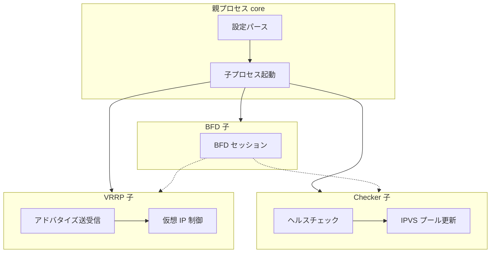

# 第1章 keepalived の全体像

> 本章で読むソース
>
> - [`keepalived/main.c`](https://github.com/acassen/keepalived/blob/v2.4.1/keepalived/main.c)
> - [`keepalived/vrrp/vrrp.c`](https://github.com/acassen/keepalived/blob/v2.4.1/keepalived/vrrp/vrrp.c#L6-L9)
> - [`keepalived/core/main.c`](https://github.com/acassen/keepalived/blob/v2.4.1/keepalived/core/main.c#L2519-L2528)

## この章の狙い

keepalived が提供する機能とソースツリーの対応を把握する。
本書全体の地図として、VRRP、ヘルスチェック、IPVS、BFD の4本柱を示す。

## 前提

読者は VRRP が仮想ルータ冗長のプロトコルであること、LVS が Linux のレイヤ4ロードバランサであることを理解していることを前提とする。

## keepalived とは何か

keepalived は Linux 上で高可用性とロードバランシングを実現するデーモン群である。
もともと LVS プロジェクト向けに、実サーバの死活監視とプール操作を担う目的で開発された。
現在は VRRP による仮想 IP のフェイルオーバー、多種のヘルスチェック、BFD による高速障害検知を統合する。

エントリポイントは薄いラッパーで、実処理は `keepalived_main` に委譲される。

[`keepalived/main.c` L27-L30](https://github.com/acassen/keepalived/blob/v2.4.1/keepalived/main.c#L27-L30)

```c
int main(int argc, char **argv)
{
	return keepalived_main(argc, argv);
}
```

## 主要コンポーネント

ソースは大きく `keepalived/`（各デーモン本体）、`lib/`（共通基盤）、`doc/`（設定例と文書）に分かれる。
`keepalived/` 配下では次のディレクトリが中核である。

| ディレクトリ | 役割 |
|---|---|
| `core/` | 親プロセス、設定読み込み、子プロセス起動、netlink |
| `vrrp/` | VRRPv2/v3 実装、仮想 IP、ルーティング、同期 |
| `check/` | リアルサーバのヘルスチェック、IPVS 操作 |
| `bfd/` | BFD セッション管理 |
| `trackers/` | ファイル変更など外部イベントの追跡 |

VRRP 実装の冒頭コメントは、RFC 2338 準拠のマスタ選出とフェイルオーバー目的を明示する。

[`keepalived/vrrp/vrrp.c` L6-L9](https://github.com/acassen/keepalived/blob/v2.4.1/keepalived/vrrp/vrrp.c#L6-L9)

```c
 * Part:        VRRP implementation of VRRPv2 as specified in rfc2338.
 *              VRRP is a protocol which elect a master server on a LAN. If the
 *              master fails, a backup server takes over.
 *              The original implementation has been made by jerome etienne.
```

## ビルド時の機能フラグ

keepalived は `./configure` で VRRP、LVS チェッカー、BFD を個別に有効化できる。
`core/main.c` では `daemon_mode` のビットマスクで、どの子デーモンを起動するか決める。

[`keepalived/core/main.c` L2519-L2528](https://github.com/acassen/keepalived/blob/v2.4.1/keepalived/core/main.c#L2519-L2528)

```c
	/* Initialise daemon_mode */
#ifdef _WITH_VRRP_
	__set_bit(DAEMON_VRRP, &daemon_mode);
#endif
#ifdef _WITH_LVS_
	__set_bit(DAEMON_CHECKERS, &daemon_mode);
#endif
#ifdef _WITH_BFD_
	__set_bit(DAEMON_BFD, &daemon_mode);
#endif
```

典型構成では3つとも有効だが、VRRP のみ、またはチェッカーのみのビルドも可能である。

## データフローの概観



## 高速化・最適化の工夫

イベント処理は zebra 由来のスレッド（コルーチン風タスク）と epoll に統合されたスケジューラで実装される（第3章）。
VRRP はカーネルにマルチキャスト加入し、ユーザ空間でタイマ駆動の広告送受信を行う。
チェッカーは複数種のプローブを同一スケジューラ上で多重化し、IPVS への反映をバッチ化する。

## まとめ

keepalived は親1プロセスと VRRP/check/BFD 子プロセスからなる。
`lib/` がスケジューラとパーサを提供し、各子が設定に応じた冗長とプール管理を担う。

## 関連する章

- [第2章 起動とプロセスモデル](02-startup-and-process-model.md)
- [第6章 core main とデーモン起動](../part02-core/06-core-main-and-daemon.md)
