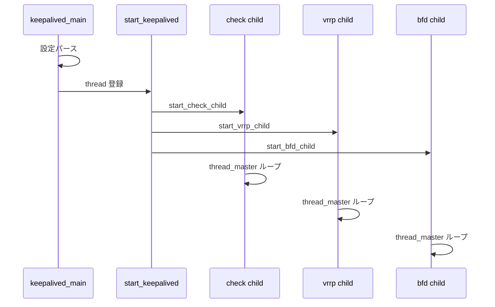

# 第2章 起動とプロセスモデル

> 本章で読むソース
>
> - [`keepalived/core/main.c`](https://github.com/acassen/keepalived/blob/v2.4.1/keepalived/core/main.c#L2437-L2528)
> - [`keepalived/core/main.c`](https://github.com/acassen/keepalived/blob/v2.4.1/keepalived/core/main.c#L514-L575)
> - [`lib/scheduler.c`](https://github.com/acassen/keepalived/blob/v2.4.1/lib/scheduler.c#L69-L73)

## この章の狙い

`keepalived_main` から子プロセスが起動するまでの流れを追う。
親、VRRP、Checker、BFD の役割分担をコード上のシンボルに対応づける。

## 前提

[第1章](01-keepalived-overview.md) のコンポント構成を読んでいること。
`fork`、`waitpid`、PID ファイルの用途を知っていること。

## keepalived_main の入口

`keepalived_main` はシグナル無視、カーネルバージョン取得、ログ初期化、`daemon_mode` 設定までを親プロセスで行う。
`prog_type` は `PROG_TYPE_PARENT` に固定される。

[`keepalived/core/main.c` L2514-L2528](https://github.com/acassen/keepalived/blob/v2.4.1/keepalived/core/main.c#L2514-L2528)

```c
	/* We are the parent process */
#ifndef _ONE_PROCESS_DEBUG_
	prog_type = PROG_TYPE_PARENT;
#endif

	/* Initialise daemon_mode */
#ifdef _WITH_VRRP_
	__set_bit(DAEMON_VRRP, &daemon_mode);
#endif
#ifdef _WITH_LVS_
	__set_bit(DAEMON_CHECKERS, &daemon_mode);
#endif
#ifdef _WITH_BFD_
	__set_bit(DAEMON_BFD, &daemon_mode);
#endif
```

`genhash` ユーティリティとして起動された場合は、ハッシュ生成に分岐して通常のデーモン経路には入らない（第24章）。

## 子プロセスの起動順序

設定読み込み後、`start_keepalived` がスケジューラ上のイベントとして子を起動する。
順序は BFD パイプ準備のあと、Checker、VRRP、BFD である。

[`keepalived/core/main.c` L537-L563](https://github.com/acassen/keepalived/blob/v2.4.1/keepalived/core/main.c#L537-L563)

```c
#ifdef _WITH_LVS_
	/* start healthchecker child */
	if (running_checker()) {
		start_check_child();
		have_child = true;
		num_reloading++;
	} else
		pidfile_rm(&checkers_pidfile);
#endif
#ifdef _WITH_VRRP_
	/* start vrrp child */
	if (running_vrrp()) {
		start_vrrp_child();
		have_child = true;
		num_reloading++;
	} else
		pidfile_rm(&vrrp_pidfile);
#endif
#ifdef _WITH_BFD_
	/* start bfd child */
	if (running_bfd()) {
		start_bfd_child();
		have_child = true;
		num_reloading++;
	} else
		pidfile_rm(&bfd_pidfile);
#endif
```

子が1つもいない場合は警告ログを出してアイドル状態になる。

## プロセスタイプとスケジューラ

各子は独自の `thread_master_t` を持ち、グローバル `prog_type` で自分の種別を識別する。

[`lib/scheduler.c` L69-L73](https://github.com/acassen/keepalived/blob/v2.4.1/lib/scheduler.c#L69-L73)

```c
/* global vars */
thread_master_t *master = NULL;
#ifndef _ONE_PROCESS_DEBUG_
prog_type_t prog_type;		/* Parent/VRRP/Checker process */
```

`_ONE_PROCESS_DEBUG_` ビルドでは全機能を単一プロセスに載せ、開発時の gdb 追跡を容易にする。

## 起動シーケンス



## 高速化・最適化の工夫

子プロセス分離により、VRRP の広告タイマと重い HTTP チェックが同一イベントループで相互にブロックしない。
親は `PR_SET_CHILD_SUBREAPER` で孤児プロセスの回収を担い、子クラッシュ時のゾンビ蓄積を抑える（`start_keepalived` 直前）。

## まとめ

起動の要は `keepalived_main` が親として設定を読み、Checker/VRRP/BFD を順に `fork` することである。
各子は独立したスケジューラループで動作する。

## 関連する章

- [第3章 スケジューラ](../part01-foundation/03-scheduler.md)
- [第6章 core main](../part02-core/06-core-main-and-daemon.md)
