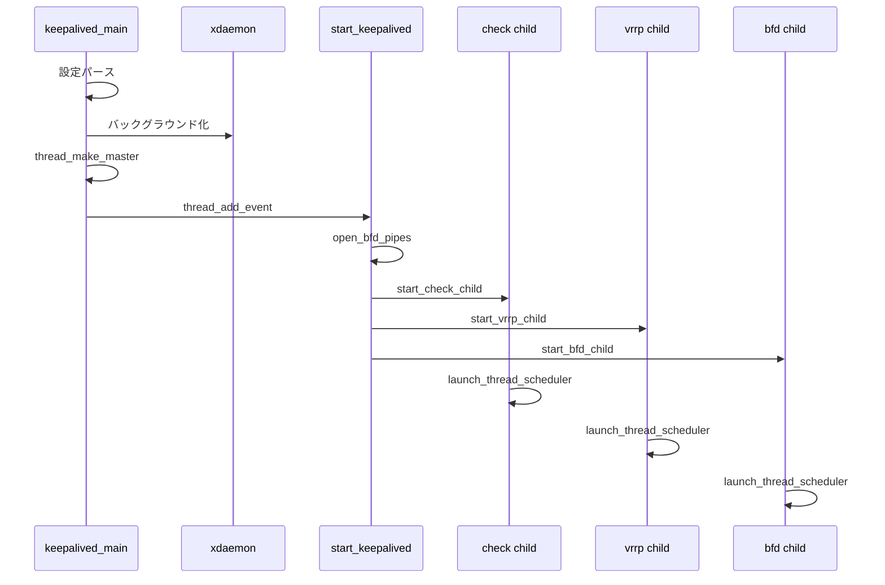

# 第2章 起動とプロセスモデル

> 本章で読むソース
>
> - [`keepalived/core/main.c`](https://github.com/acassen/keepalived/blob/v2.4.1/keepalived/core/main.c)
> - [`keepalived/vrrp/vrrp_daemon.c`](https://github.com/acassen/keepalived/blob/v2.4.1/keepalived/vrrp/vrrp_daemon.c)
> - [`lib/scheduler.c`](https://github.com/acassen/keepalived/blob/v2.4.1/lib/scheduler.c)

## この章の狙い

`keepalived_main` から子プロセスが起動するまでの流れを追う。
親、VRRP、Checker、BFD の役割分担をコード上のシンボルに対応づける。

## 前提

[第1章](01-keepalived-overview.md) のコンポーネント構成を読んでいること。
`fork`、`waitpid`、PID ファイルの用途を知っていること。

## keepalived_main の初期段階

`keepalived_main` はシグナル無視、カーネルバージョン取得、ログ初期化、`daemon_mode` 設定までを親プロセスで行う。
起動直後はリロード系シグナルを無視し、`signal_init` 呼び出しまでハンドラを登録しない。

[`keepalived/core/main.c` L2493-L2517](https://github.com/acassen/keepalived/blob/v2.4.1/keepalived/core/main.c#L2493-L2517)

```c
	/* Ignore reloading signals till signal_init call */
	signals_ignore();

	/* Ensure time_now is set. We then don't have to check anywhere
	 * else if it is set. */
	set_time_now();

	/* Is there a TMPDIR override? */
	set_tmp_dir();

	set_our_uid_gid();

	/* Save command line options in case need to log them later */
	save_cmd_line_options(argc, argv);

#ifdef _USE_SYSTEMD_NOTIFY_
#ifndef _ONE_PROCESS_DEBUG_
	check_parent_systemd();
#endif
#endif

	/* We are the parent process */
#ifndef _ONE_PROCESS_DEBUG_
	prog_type = PROG_TYPE_PARENT;
#endif
```

`prog_type` は `PROG_TYPE_PARENT` に固定される。
子は `fork` 後に `PROG_TYPE_VRRP` などへ切り替える（後述）。

## daemon_mode の初期化

ビルド時に有効化されたモジュールだけが `daemon_mode` に立つ。
設定ファイルに該当ブロックがなくてもビットは立つが、`running_vrrp()` などで実際の起動可否を判定する。

[`keepalived/core/main.c` L2519-L2528](https://github.com/acassen/keepalived/blob/v2.4.1/keepalived/core/main.c#L2519-L2528)

```c
	/* Initialise daemon_mode */
#ifdef _WITH_VRRP_
	__set_bit(DAEMON_VRRP, &daemon_mode);
#endif
#ifdef _WITH_LVS_
	__set_bit(DAEMON_CHECKERS, &daemon_mode);
#endif
#ifdef _WITH_BFD_
	__set_bit(DAEMON_BFD, &daemon_mode);
#endif
```

`genhash` ユーティリティとして起動された場合は、ハッシュ生成に分岐して通常のデーモン経路には入らない（第24章）。

## デーモン化とスケジューラ起動

設定読み込みと二重起動チェックのあと、`xdaemon()` でバックグラウンド化する。
親プロセスはここで終了し、子が `thread_make_master` でイベントループを構築する。

[`keepalived/core/main.c` L2791-L2806](https://github.com/acassen/keepalived/blob/v2.4.1/keepalived/core/main.c#L2791-L2806)

```c
	/* daemonize process */
	if (!__test_bit(DONT_FORK_BIT, &debug)) {
		pid_t old_ppid = our_pid;

#ifdef DO_STACKSIZE
		get_stacksize(true);
#endif

		if (xdaemon() > 0) {
			/* Parent process */
			closelog();
			FREE_CONST_PTR(config_id);
			FREE_PTR(orig_core_dump_pattern);
			close_std_fd();
			exit(0);
		}
```

`signal_init` のあと `open_config_read_fd` で eventfd を開き、子の設定読み込み完了を待てるようにする（第8章）。
`startup_script` がなければ `start_keepalived` をイベントキューに投入する。

[`keepalived/core/main.c` L2859-L2876](https://github.com/acassen/keepalived/blob/v2.4.1/keepalived/core/main.c#L2859-L2876)

```c
	/* Create the master thread */
	master = thread_make_master();

	/* Signal handling initialization  */
	signal_init();

#ifndef _ONE_PROCESS_DEBUG_
	/* Open eventfd for children notifying parent that they have read the configuration file */
	if (!__test_bit(CONFIG_TEST_BIT, &debug))
		open_config_read_fd();
#endif

	/* If we have a startup script, run it first */
	if (global_data->startup_script) {
		thread_add_event(master, run_startup_script, NULL, 0);
	} else {
		/* Init daemon */
		thread_add_event(master, start_keepalived, NULL, 0);
	}
```

## start_keepalived の役割

`start_keepalived` はスケジューラ上のイベントとして子を起動する。
BFD パイプを先に開き、その後 Checker、VRRP、BFD の順で `fork` する。

[`keepalived/core/main.c` L514-L563](https://github.com/acassen/keepalived/blob/v2.4.1/keepalived/core/main.c#L514-L563)

```c
static void
start_keepalived(__attribute__((unused)) thread_ref_t thread)
{
	bool have_child = false;

	/* Although we use prctl to set PDEATHSIG, there are windows when it
	 * is not set, i.e. before it is first executed after a fork, and also
	 * after set(e)[ug]id() calls before PDEATHSIG can be reinstated. */
	main_pid = getpid();
	our_pid = main_pid;

	/* We want to ensure that any children of child process don't miss the
	 * termination of their immediate parent. */
	prctl(PR_SET_CHILD_SUBREAPER, 1);

#ifdef _WITH_BFD_
	/* must be opened before vrrp and bfd start */
	if (!open_bfd_pipes()) {
		thread_add_terminate_event(thread->master);
		return;
	}
#endif

#ifdef _WITH_LVS_
	/* start healthchecker child */
	if (running_checker()) {
		start_check_child();
		have_child = true;
		num_reloading++;
	} else
		pidfile_rm(&checkers_pidfile);
#endif
#ifdef _WITH_VRRP_
	/* start vrrp child */
	if (running_vrrp()) {
		start_vrrp_child();
		have_child = true;
		num_reloading++;
	} else
		pidfile_rm(&vrrp_pidfile);
#endif
#ifdef _WITH_BFD_
	/* start bfd child */
	if (running_bfd()) {
		start_bfd_child();
		have_child = true;
		num_reloading++;
	} else
		pidfile_rm(&bfd_pidfile);
#endif
```

子が1つもいない場合は警告ログを出してアイドル状態になる。
`reload_time_file` が設定されていれば `start_reload_monitor` で inotify 監視を始める（第8章）。

## VRRP 子の fork パターン

`start_vrrp_child` は親子で処理を分岐する典型例である。
親は PID を記録し `thread_add_child` で再生成監視を登録する。
子は `prog_type` を切り替え、不要なパイプと PID ファイルを閉じてから VRRP ループへ入る。

[`keepalived/vrrp/vrrp_daemon.c` L1032-L1082](https://github.com/acassen/keepalived/blob/v2.4.1/keepalived/vrrp/vrrp_daemon.c#L1032-L1082)

```c
int
start_vrrp_child(void)
{
#ifndef _ONE_PROCESS_DEBUG_
	pid_t pid;
	const char *syslog_ident;

	/* Initialize child process */
#ifdef ENABLE_LOG_TO_FILE
	if (log_file_name)
		flush_log_file();
#endif

	pid = fork();

	if (pid < 0) {
		log_message(LOG_INFO, "VRRP child process: fork error(%s)"
			       , strerror(errno));
		return -1;
	} else if (pid) {
		vrrp_child = pid;
		vrrp_start_time = time_now;

		log_message(LOG_INFO, "Starting VRRP child process, pid=%d"
			       , pid);

		/* Start respawning thread */
		thread_add_child(master, vrrp_respawn_thread, NULL,
				 pid, TIMER_NEVER);

		return 0;
	}

	our_pid = getpid();

#ifdef _WITH_PROFILING_
	/* See https://lists.gnu.org/archive/html/bug-gnu-utils/2001-09/msg00047.html for details */
	monstartup ((u_long) &_start, (u_long) &etext);
#endif

	prctl(PR_SET_PDEATHSIG, SIGTERM);

	/* Check our parent hasn't already changed since the fork */
	if (main_pid != getppid())
		kill(our_pid, SIGTERM);

#ifdef _WITH_PERF_
	if (perf_run == PERF_ALL)
		run_perf("vrrp", global_data->network_namespace, global_data->instance_name);
#endif

	prog_type = PROG_TYPE_VRRP;
```

Checker と BFD も同型の `start_*_child` を持つ（第17章、第21章）。
いずれも `prctl(PR_SET_PDEATHSIG, SIGTERM)` で親死亡時に自終了する。

## プロセスタイプとグローバル master

各プロセスはグローバル `master` と `prog_type` で自分の種別を識別する。
ログ識別子、PID ファイル名、シグナル伝播先の分岐に使われる。

[`lib/scheduler.c` L69-L72](https://github.com/acassen/keepalived/blob/v2.4.1/lib/scheduler.c#L69-L72)

```c
/* global vars */
thread_master_t *master = NULL;
#ifndef _ONE_PROCESS_DEBUG_
prog_type_t prog_type;		/* Parent/VRRP/Checker process */
```

`_ONE_PROCESS_DEBUG_` ビルドでは `prog_type` の分岐がコンパイルアウトされ、単一ループに統合される。

## 起動シーケンス



## 子の監視と再起動

親は `thread_add_child` で子の `waitpid` を非ブロッキング化する。
VRRP 子が異常終了した場合、`vrrp_respawn_thread` が遅延再起動をスケジュールする（第10章）。
SIGTERM 受信時は `sigend` が子へシグナルを送り、タイムアウト後に SIGKILL へ段階する（第6章）。

## startup_script との関係

`startup_script` が設定されていると、子起動はスクリプト完了後に遅延する。
完了ハンドラ `startup_script_completed` が `start_keepalived` を再投入する。

[`keepalived/core/main.c` L666-L670](https://github.com/acassen/keepalived/blob/v2.4.1/keepalived/core/main.c#L666-L670)

```c
static void
startup_script_completed(thread_ref_t thread)
{
	if (startup_shutdown_script_completed(thread, true))
		thread_add_event(thread->master, start_keepalived, NULL, 0);
}
```

外部コマンドも `system_call_script` 経由で fork し、終了は `thread_add_child` で回収する（第5章）。

## 高速化・最適化の工夫

子プロセス分離により、VRRP の広告タイマと重い HTTP チェックが同一イベントループで相互にブロックしない。
親は `PR_SET_CHILD_SUBREAPER` で孤児プロセスの回収を担い、子クラッシュ時のゾンビ蓄積を抑える。
各子は fork 直後に不要 FD を閉じ、`close_range` でスクリプト実行時の漏洩も防ぐ（第5章）。

デーモン化は二重 fork ではなく `xdaemon` で実装され、親プロセスは早期に終了する。
これにより端末セッションから切り離したあと、子だけがスケジューラループを継続する。

## まとめ

起動の要は `keepalived_main` が親として設定を読み、スケジューラ起動後に Checker、VRRP、BFD を順に `fork` することである。
各子は独立した `thread_master` ループで動作し、親は PID ファイルと再生成監視で生存を管理する。

## 関連する章

- [第3章 スケジューラ](../part01-foundation/03-scheduler.md)
- [第5章 メモリとシグナル](../part01-foundation/05-memory-signals-process.md)
- [第6章 core main](../part02-core/06-core-main-and-daemon.md)
