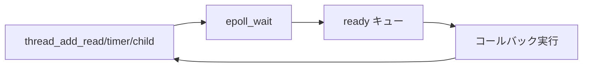

# 第3章 スケジューラとイベントループ

> 本章で読むソース
>
> - [`lib/scheduler.c`](https://github.com/acassen/keepalived/blob/v2.4.1/lib/scheduler.c)
> - [`lib/scheduler.h`](https://github.com/acassen/keepalived/blob/v2.4.1/lib/scheduler.h)

## この章の狙い

keepalived の非同期処理の中心である `thread_master_t` と epoll 統合を理解する。
VRRP タイマ、ソケット読み書き、子プロセス監視がどの API で登録されるかを押さえる。

## 前提

epoll とタイマファイルディスクリプタの基本を知っていること。
POSIX の `fork` とファイルディスクリプタの継承を理解していること。

## thread と master

`lib/scheduler.c` は zebra 由来のスレッド（協調的タスク）モデルを実装する。
ここでの「スレッド」は OS スレッドではなく、イベントループ上のコールバックである。
グローバル `master` が各プロセスのループ本体を指す。

[`lib/scheduler.c` L69-L72](https://github.com/acassen/keepalived/blob/v2.4.1/lib/scheduler.c#L69-L72)

```c
/* global vars */
thread_master_t *master = NULL;
#ifndef _ONE_PROCESS_DEBUG_
prog_type_t prog_type;		/* Parent/VRRP/Checker process */
```

`thread_add_read`、`thread_add_write`、`thread_add_timer`、`thread_add_child` が主要な登録 API である。
VRRP 広告、BFD パケット、signalfd、inotify、netlink 監視はいずれも read スレッドとして登録される。

## thread_make_master の構築

`thread_make_master` は epoll インスタンス、timerfd、signalfd をまとめて初期化する。
タイマと FD 待ちを単一の `epoll_wait` に集約するのが設計の要である。

[`lib/scheduler.c` L780-L820](https://github.com/acassen/keepalived/blob/v2.4.1/lib/scheduler.c#L780-L820)

```c
thread_make_master(void)
{
	thread_master_t *new;

	PMALLOC(new);

	new->epoll_fd = epoll_create1(EPOLL_CLOEXEC);
	if (new->epoll_fd < 0) {
		log_message(LOG_INFO, "scheduler: Error creating EPOLL instance (%m)");
		FREE(new);
		return NULL;
	}

	new->read = RB_ROOT_CACHED;
	new->write = RB_ROOT_CACHED;
	new->timer = RB_ROOT_CACHED;
	new->child = RB_ROOT_CACHED;
	new->io_events = RB_ROOT;
	new->child_pid = RB_ROOT;
	INIT_LIST_HEAD(&new->event);
#ifdef USE_SIGNAL_THREADS
	INIT_LIST_HEAD(&new->signal);
#endif
	INIT_LIST_HEAD(&new->ready);
	INIT_LIST_HEAD(&new->unuse);


	/* Register timerfd thread */
	new->timer_fd = timerfd_create(CLOCK_MONOTONIC, TFD_NONBLOCK | TFD_CLOEXEC);
	if (new->timer_fd < 0) {
		log_message(LOG_ERR, "scheduler: Cant create timerfd (%m)");
		FREE(new);
		return NULL;
	}

	new->signal_fd = signal_handler_init();

	new->timer_thread = thread_add_read(new, thread_timerfd_handler, NULL, new->timer_fd, TIMER_NEVER, 0);

	add_signal_read_thread(new);

	return new;
}
```

赤黒木 `read`、`write`、`timer`、`child` は期限順にスレッドを並べ、次に期限の来るイベントだけを timerfd に反映する。

## タイマの集約

`thread_set_timer` は各木から最も早い期限を集め、`timerfd_settime` で epoll の待ち時間を決める。
期限切れ FD は `thread_timerfd_handler` が read、write、timer、child 木から ready キューへ移す。

[`lib/scheduler.c` L307-L351](https://github.com/acassen/keepalived/blob/v2.4.1/lib/scheduler.c#L307-L351)

```c
static timeval_t
thread_set_timer(thread_master_t *m)
{
	timeval_t timer_wait, timer_wait_time;
	struct itimerspec its;

	/* Prepare timer */
	timerclear(&timer_wait_time);
	thread_update_timer(&m->timer, &timer_wait_time);
	thread_update_timer(&m->write, &timer_wait_time);
	thread_update_timer(&m->read, &timer_wait_time);
	thread_update_timer(&m->child, &timer_wait_time);

	if (timerisset(&timer_wait_time)) {
		/* Re-read the current time to get the maximum accuracy */
		set_time_now();

		/* Take care about monotonic clock */
		timersub(&timer_wait_time, &time_now, &timer_wait);

		if (timer_wait.tv_sec < 0) {
			/* This will disable the timerfd */
			timerclear(&timer_wait);
		}
	} else {
		/* set timer to a VERY long time */
		timer_wait.tv_sec = LONG_MAX;
		timer_wait.tv_usec = 0;
	}

	its.it_value.tv_sec = timer_wait.tv_sec;
	if (!timerisset(&timer_wait)) {
		/* We could try to avoid doing the epoll_wait since
		 * testing shows it takes about 4 microseconds
		 * for the timer to expire. */
		its.it_value.tv_nsec = 1;
	}
	else
		its.it_value.tv_nsec = timer_wait.tv_usec * 1000;

	/* We don't want periodic timer expiry */
	its.it_interval.tv_sec = its.it_interval.tv_nsec = 0;

	if (timerfd_settime(m->timer_fd, 0, &its, NULL))
		log_message(LOG_INFO, "Setting timer_fd returned errno %d - %m", errno);
```

VRRP のアドバタイズ間隔は `thread_add_timer` 系で再スケジュールされる（第11章）。
`timer_thread_update_timeout` は既存タイマの期限だけを更新し、木の再挿入コストを抑える。

## thread_add_timer と read 登録

`thread_add_timer` は相対秒指定の薄いラッパである。
`thread_add_read` は FD とオプションの読み取りタイムアウトを赤黒木 `read` に載せる。

[`lib/scheduler.c` L1371-L1374](https://github.com/acassen/keepalived/blob/v2.4.1/lib/scheduler.c#L1371-L1374)

```c
thread_add_timer(thread_master_t *m, thread_func_t func, void *arg, unsigned long timer)
{
	return thread_add_timer_uval(m, func, arg, 0, timer);
}
```

[`lib/scheduler.c` L1178-L1191](https://github.com/acassen/keepalived/blob/v2.4.1/lib/scheduler.c#L1178-L1191)

```c
thread_add_read(thread_master_t *m, thread_func_t func, void *arg, int fd, unsigned long timer, unsigned flags)
{
	timeval_t sands;

	/* Compute read timeout value */
	if (timer == TIMER_NEVER) {
		sands.tv_sec = TIMER_DISABLED;
		sands.tv_usec = 0;
	} else {
		set_time_now();
		sands = timer_add_long(time_now, timer);
	}

	return thread_add_read_sands(m, func, arg, fd, &sands, flags);
}
```

`TIMER_NEVER` は無期限待ちを表し、BFD ソケットや signalfd で多用される。

## ディスパッチ優先順位

`thread_fetch_next_queue` は、イベントキューと ready キューを先に処理し、それ以外は `epoll_wait` で待つ。
明示的に投入された `thread_add_event` が最優先なので、起動やリロードの制御フローが遅延しにくい。

[`lib/scheduler.c` L1887-L1929](https://github.com/acassen/keepalived/blob/v2.4.1/lib/scheduler.c#L1887-L1929)

```c
static list_head_t *
thread_fetch_next_queue(thread_master_t *m)
{
	int last_epoll_errno = 0;
#ifndef _ONE_PROCESS_DEBUG_
	unsigned last_epoll_errno_count = 0;
#endif
	int ret;
	int i;
	timeval_t earliest_timer;
	unsigned timeout;

	assert(m != NULL);

	/* If there is event process it first. */
	if (!list_empty(&m->event))
		return &m->event;

	/* If there are ready threads process them */
	if (!list_empty(&m->ready))
		return &m->ready;

	do {
		/* Calculate and set wait timer. Take care of timeouted fd.  */
		earliest_timer = thread_set_timer(m);

#ifdef _VRRP_FD_DEBUG_
		if (extra_threads_debug)
			extra_threads_debug();
#endif

#ifdef _EPOLL_THREAD_DUMP_
		if (do_epoll_thread_dump)
			dump_thread_data(m, NULL);
#endif

#ifdef _EPOLL_DEBUG_
		if (do_epoll_debug)
			log_message(LOG_INFO, "calling epoll_wait");
#endif

		/* Call epoll function. */
		ret = epoll_wait(m->epoll_fd, m->epoll_events, m->epoll_count, -1);
```

優先順位は「明示イベント」「準備完了」「タイマと FD」であり、広告期限切れなどの緊急タイマが遅延しにくい。

## 子プロセス監視

`thread_add_child` は `waitpid` をブロッキングせず、子の終了をタイマ木と epoll に載せる。
親の `start_vrrp_child` が返却後も、再生成監視はスケジューラが継続する（第2章）。



## launch_thread_scheduler

メインプロセスは `launch_thread_scheduler(master)` でループに入る。
各イテレーションで `thread_fetch` が次のスレッドを取り出し、コールバックを実行する。
終了時は `thread_add_terminate_event` が `THREAD_TERMINATE` を投入し、ループを抜ける。

VRRP 子、Checker 子、親プロセスはいずれも同じ API でループする。
違いは登録されるコールバックの中身だけである。

## 高速化・最適化の工夫

単一 OS スレッドで多数の FD と timerfd を epoll に集約し、スレッド切替コストを排除する。
タイマは赤黒木で管理され、次の期限だけを timerfd に反映するため、`epoll_wait` の引数に毎回全タイマを渡す必要がない。
`thread_fetch_next_queue` が event と ready を先に捌くことで、制御プレーンの仕事がデータプレーンの待ちより優先される。

`CLOCK_MONOTONIC` ベースの timerfd により、システム時刻の巻き戻しの影響を受けにくい。
VRRP の master 選出は wall clock ではなく、この単調時計ベースの期限で駆動される。

## デバッグ用ビルドフラグ

`_EPOLL_DEBUG_`、`_VRRP_FD_DEBUG_`、`THREAD_DUMP` はスレッド一覧や epoll 呼び出しをログする。
本番コードパスは変えず、観測用の分岐だけを追加している。

## まとめ

keepalived の「スレッド」は OS スレッドではなく、epoll と timerfd に載ったコールバックである。
`thread_make_master` が基盤を作り、`thread_add_*` で VRRP、チェック、BFD、親の各処理が同一ループに登録される。

## 関連する章

- [第2章 起動とプロセスモデル](../part00-overview/02-startup-and-process-model.md)
- [第5章 メモリとシグナル](05-memory-signals-process.md)
- [第11章 VRRP 状態遷移](../part03-vrrp-base/11-vrrp-state-machine.md)
