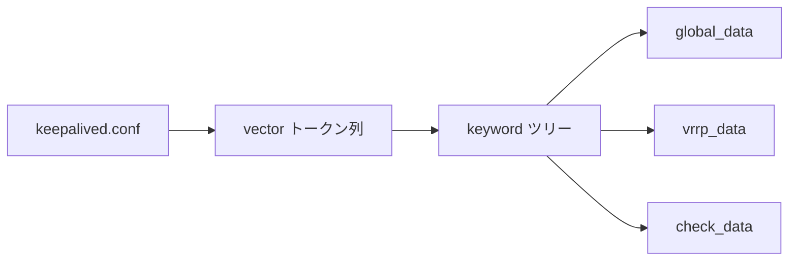

# 第4章 パーサと設定

> 本章で読むソース
>
> - [`lib/parser.c`](https://github.com/acassen/keepalived/blob/v2.4.1/lib/parser.c)
> - [`keepalived/core/global_parser.c`](https://github.com/acassen/keepalived/blob/v2.4.1/keepalived/core/global_parser.c)

## この章の狙い

`keepalived.conf` がキーワードツリーに変換され、各デーモンのデータ構造へ載る流れを理解する。
起動時とリロード時にだけ走る設定経路を、コードの登録点から追う。

## 前提

ブロック指向の設定ファイル（`global_defs`、`vrrp_instance` 等）を触ったことがあること。
C の関数ポインタと木構造の基本を知っていること。

## キーワード登録 API

**パーサ**は `install_keyword_root` でトップレベル、`install_keyword` でネストブロックを登録する。
`install_keyword_quoted` は引用符付き引数を許す特殊ケース用である。
`cur_check_ptr` はパース中のデータ構造へのポインタを指し、ハンドラが値を書き込む先を決める。

[`lib/parser.c` L902-L924](https://github.com/acassen/keepalived/blob/v2.4.1/lib/parser.c#L902-L924)

```c
void
install_keyword_root(const char *string, void (*handler) (const vector_t *), bool active, vpp_t ptr)
{
	/* If the root keyword is inactive, the handler will still be called,
	 * but with a NULL strvec */
	cur_check_ptr = NULL;
	keyword_alloc(keywords, string, handler, active, false);
	cur_check_ptr = ptr;
}

void
install_keyword(const char *string, void (*handler) (const vector_t *))
{
	keyword_alloc_sub(keywords, string, handler, false);
}

void
install_keyword_quoted(const char *string, void (*handler) (const vector_t *))
{
	/* This is a special instance when the second parameter can be a
	 * quoted escaped string. */
	keyword_alloc_sub(keywords, string, handler, true);
}
```

`active` が false のルートキーワードは、ビルドで無効化されたモジュール向けに存在する。
ハンドラは呼ばれるが `strvec` が NULL になり、誤設定を検出しやすくする。

## global_defs の登録例

`init_global_keywords` は `global_defs` ブロックとその子キーワードを登録する。
`VPP &global_data` により、パース結果は `global_data` 構造体に直接書き込まれる。

[`keepalived/core/global_parser.c` L2588-L2616](https://github.com/acassen/keepalived/blob/v2.4.1/keepalived/core/global_parser.c#L2588-L2616)

```c
void
init_global_keywords(bool global_active)
{
	/* global definitions mapping */
#ifdef _WITH_LINKBEAT_
	install_keyword_root("linkbeat_use_polling", use_polling_handler, global_active, NULL);
#endif
	install_keyword_root("net_namespace", &net_namespace_handler, global_active, NULL);
	install_keyword_root("net_namespace_ipvs", &net_namespace_ipvs_handler, global_active, NULL);
	install_keyword_root("namespace_with_ipsets", &namespace_ipsets_handler, global_active, NULL);
	install_keyword_root("use_pid_dir", &use_pid_dir_handler, global_active, NULL);
	install_keyword_root("instance", &instance_handler, global_active, NULL);
	install_keyword_root("child_wait_time", &child_wait_handler, global_active, NULL);
	install_keyword_root("global_defs", NULL, global_active, VPP &global_data);
	install_keyword("process_names", &process_names_handler);
	install_keyword("process_name", &process_name_handler);
#ifdef _WITH_VRRP_
	install_keyword("vrrp_process_name", &vrrp_process_name_handler);
#endif
#ifdef _WITH_LVS_
	install_keyword("checker_process_name", &checker_process_name_handler);
	install_keyword("lvs_process_name", &lvs_process_name_handler);		/* Deprecated since 12/07/20 */
#endif
#ifdef _WITH_BFD_
	install_keyword("bfd_process_name", &bfd_process_name_handler);
#endif
	install_keyword("use_symlink_paths", &use_symlink_path_handler);
	install_keyword("router_id", &routerid_handler);
	install_keyword("notification_email_from", &emailfrom_handler);
```

VRRP 固有のキーワードは `vrrp_parser.c`、チェッカーは `check_parser.c`、BFD は `bfd_parser.c` が登録する（第12章、第17章）。
各モジュールは `init_*_keywords` を `init_keywords` コールバックとして `init_data` に渡す。
`global_parser.c` のファイルヘッダは、パーサが動的データ構造へ設定を載せる役割を明示する。

[`keepalived/core/global_parser.c` L6-L8](https://github.com/acassen/keepalived/blob/v2.4.1/keepalived/core/global_parser.c#L6-L8)

```c
 * Part:        Configuration file parser/reader. Place into the dynamic
 *              data structure representation the conf file representing
 *              the loadbalanced server pool.
```

## init_data による読み込み

`init_data` はキーワード木を初期化し、設定ファイルをストリームとして読む。
リロードのたびに `block_depth` などのパーサ状態をゼロに戻し、前回の残骸を消す。

[`lib/parser.c` L3250-L3283](https://github.com/acassen/keepalived/blob/v2.4.1/lib/parser.c#L3250-L3283)

```c
void
init_data(const char *conf_file, const vector_t * (*init_keywords) (void), bool copy_config)
{
	bool file_opened = false;
	int fd;
#ifndef _ONE_PROCESS_DEBUG_
	static unsigned conf_num = 0;
#endif

	/* A parent process or previous config load may have left these set */
	block_depth = 0;
	kw_level = 0;
	sublevel = 0;
	skip_sublevel = 0;
	multiline_seq_depth = 0;
	random_seed = 0;
	random_seed_configured = false;

	/* Init Keywords structure */
	keywords = vector_alloc();

	(*init_keywords) ();

	/* Add out standard definitions */
	set_std_definitions();

#ifdef _DUMP_KEYWORDS_
	/* Dump configuration */
	if (do_dump_keywords)
		dump_keywords(keywords, 0, NULL);
#endif

	/* Stream handling */
	current_keywords = keywords;
```

`copy_config` が true のときは memfd または一時ファイルに設定を複製し、子プロセスへ渡す。
親が読み終えたあとも同一内容を子が再パースできるようにするためである（第6章）。

[`lib/parser.c` L3285-L3298](https://github.com/acassen/keepalived/blob/v2.4.1/lib/parser.c#L3285-L3298)

```c
	if (copy_config) {
		if (!conf_copy) {
#if defined HAVE_MEMFD_CREATE || defined USE_MEMFD_CREATE_SYSCALL
			fd = memfd_create("/keepalived/consolidated_configuration", MFD_CLOEXEC);

			/* SELinux can allow memfd_create() to succeed, but reads and writes fail.
			 * Perversely the open does not log an SELinux error if keepalived has no
			 * permissions for "tmpfs", but if it has read and write permissions but
			 * not open permission, then the open fails. */
			if (fd != -1) {
				char read_byte;		/* coverity[suspicious_sizeof] is generated if this is an int */

				if (read(fd, &read_byte, 1) == -1) {
```

## 設定の流れ



トークン化は行単位で進み、ブロックの入れ子は `sublevel` で追跡する。
ブロック終了時は `install_level_end_handler` で登録したクローズハンドラが整合性チェックを行う。

[`lib/parser.c` L926-L943](https://github.com/acassen/keepalived/blob/v2.4.1/lib/parser.c#L926-L943)

```c
void
install_level_end_handler(void (*handler) (void))
{
	int i = 0;
	keyword_t *keyword;

	/* fetch last keyword */
	keyword = vector_slot(keywords, vector_size(keywords) - 1);

	if (!keyword->active)
		return;

	/* position to last sub level */
	for (i = 0; i < sublevel; i++)
		keyword = vector_slot(keyword->sub, vector_size(keyword->sub) - 1);

	keyword->sub_close_handler = handler;
	keyword->sub_close_ptr = cur_check_ptr;
}
```

## ブロック深度とエラー報告

`report_config_error` はファイル名、行番号、ブロック階層をログに含める。
設定ミスは起動を止めるか、該当インスタンスだけ無効化するかをエラー種別で分ける。
`CONFIG_TEST_BIT` が立っているときは検証のみでプロセスを終了する（第6章）。

## 機能フラグによる枝刈り

`_WITH_VRRP_` や `_WITH_LVS_` が未定義のビルドでは、該当 `install_keyword` 呼び出し自体がコンパイルされない。
実行時に未知キーワードへ到達する前に、リンク時点でモジュール境界が固定される。
これによりパーサ木のサイズとハンドラ登録コストを抑える。

## 標準定義とマクロ展開

`set_std_definitions` は `@include` 的な展開や共通マクロを注入する。
複数ファイルに分割した設定を1つの論理ストリームとして読める。

## リロード時の再パース

SIGHUP を受けると親が `reload_config` で `init_data` 相当の経路を再度走らせる（第8章）。
子プロセスも同じキーワード木を再構築し、`clear_diff_*` で差分適用する。
全インスタンスの再起動を避けるため、データ構造はインスタンス単位で比較される（第11章、第17章）。

## 高速化・最適化の工夫

パースは起動時と SIGHUP リロード時のみ実行され、ホットパスには載らない。
キーワードツリーはコンパイル時に機能フラグで枝刈りされ、無効モジュールのハンドラ登録を避ける。
`copy_config` で memfd に複製すれば、子への設定配布がディスク再読み込みより安定する。

ハンドラは多くが単一キーワードの代入だけであり、深い抽象化は避けている。
運用時の設定変更がソース追跡しやすいトレードオフである。

## まとめ

設定は宣言的キーワードの木構造として実装され、各子デーモンが自分のパーサ断片を登録する。
`init_data` がファイルを読み、`global_data` や `vrrp_data` へ値を載せ、スケジューラ起動の前提を整える。

## 関連する章

- [第6章 core main](../part02-core/06-core-main-and-daemon.md)
- [第8章 リロード](../part02-core/08-reload-notify-track.md)
- [第12章 VRRP パーサ](../part03-vrrp-base/12-vrrp-parser-data.md)
