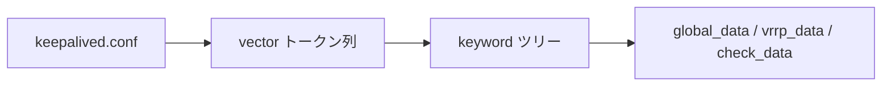

# 第4章 パーサと設定

> 本章で読むソース
>
> - [`lib/parser.c`](https://github.com/acassen/keepalived/blob/v2.4.1/lib/parser.c#L902-L924)
> - [`keepalived/core/global_parser.c`](https://github.com/acassen/keepalived/blob/v2.4.1/keepalived/core/global_parser.c)

## この章の狙い

`keepalived.conf` がキーワードツリーに変換され、各デーモンのデータ構造へ載る流れを理解する。

## 前提

ブロック指向の設定ファイル（`global_defs`、`vrrp_instance` 等）を触ったことがあること。

## キーワード登録

`install_keyword_root` がトップレベル、`install_keyword` がネストブロックを登録する。

[`lib/parser.c` L902-L924](https://github.com/acassen/keepalived/blob/v2.4.1/lib/parser.c#L902-L924)

```c
void
install_keyword_root(const char *string, void (*handler) (const vector_t *), bool active, vpp_t ptr)
{
	/* If the root keyword is inactive, the handler will still be called,
	 * but with a NULL strvec */
	cur_check_ptr = NULL;
	keyword_alloc(keywords, string, handler, active, false);
	cur_check_ptr = ptr;
}

void
install_keyword(const char *string, void (*handler) (const vector_t *))
{
	keyword_alloc_sub(keywords, string, handler, false);
}

void
install_keyword_quoted(const char *string, void (*handler) (const vector_t *))
{
	/* This is a special instance when the second parameter can be a
	 * quoted escaped string. */
	keyword_alloc_sub(keywords, string, handler, true);
}
```

`global_parser.c`、`vrrp_parser.c`、`check_parser.c`、`bfd_parser.c` がそれぞれモジュール固有のキーワードを登録する。

## 設定の流れ



## 高速化・最適化の工夫

パースは起動時と SIGHUP リロード時のみ実行され、ホットパスには載らない。
キーワードツリーはコンパイル時に機能フラグで枝刈りされ、無効モジュールのハンドラ登録を避ける。

## まとめ

設定は宣言的キーワードの木構造として実装され、各子デーモンが自分のパーサ断片を登録する。

## 関連する章

- [第12章 VRRP パーサ](../part03-vrrp-base/12-vrrp-parser-data.md)
- [第8章 リロード](../part02-core/08-reload-notify-track.md)
