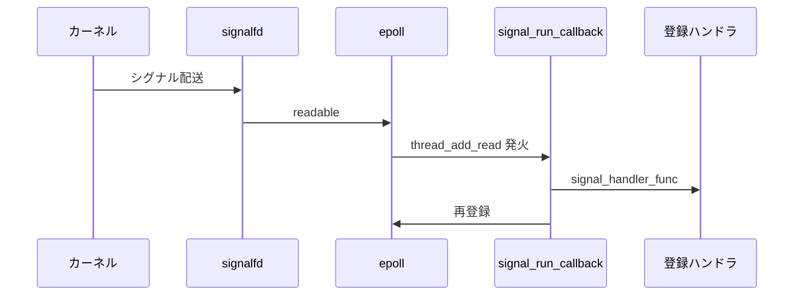

# 第5章 メモリ、シグナル、プロセス

> 本章で読むソース
>
> - [`lib/memory.c`](https://github.com/acassen/keepalived/blob/v2.4.1/lib/memory.c)
> - [`lib/signals.c`](https://github.com/acassen/keepalived/blob/v2.4.1/lib/signals.c)
> - [`lib/process.c`](https://github.com/acassen/keepalived/blob/v2.4.1/lib/process.c)
> - [`lib/notify.c`](https://github.com/acassen/keepalived/blob/v2.4.1/lib/notify.c)

## この章の狙い

共通ライブラリが提供するメモリ追跡、シグナル処理、子プロセス制限、外部スクリプト実行の枠組みを押さえる。
全デーモンが共有する実行環境の土台として、第3章のスケジューラと接続する。

## 前提

`signalfd`、カスタムアロケータのデバッグ用途を知っていること。
`RLIMIT_NOFILE` がプロセスごとに継承されることを理解していること。

## メモリ管理

`lib/memory.c` は `MALLOC`、`FREE`、`STRDUP` マクロで libc をラップする。
`_MEM_CHECK_` ビルドでは割当ブロックをリストで追跡し、終了時にリークを報告する。

[`lib/memory.c` L116-L128](https://github.com/acassen/keepalived/blob/v2.4.1/lib/memory.c#L116-L128)

```c
#if !defined(_MEM_CHECK_) && !defined(_MALLOC_CHECK_)
/* In the default build STRDUP, STRNDUP and REALLOC otherwise map to raw libc
 * and can return NULL, unlike MALLOC. These wrappers abort on exhaustion so the
 * codebase assumption that allocations succeed holds uniformly. */
void * __attribute__ ((malloc))
xrealloc(void *buffer, unsigned long size)
{
	void *mem = realloc(buffer, size);

	if (size && mem == NULL)
		mem_alloc_error("xrealloc()");

	return mem;
}
```

通常ビルドでも `xrealloc` 等は枯渇時に abort し、呼び出し側が NULL チェックを省略できる前提を保つ。
`zalloc` はゼロ初期化付き割当で、構造体の初期状態を一貫させる。

[`lib/memory.c` L157-L163](https://github.com/acassen/keepalived/blob/v2.4.1/lib/memory.c#L157-L163)

```c
void * __attribute__ ((malloc))
zalloc(unsigned long size)
{
	void *mem = xalloc(size);

	if (mem)
		memset(mem, 0, size);
```

`_MEM_CHECK_` 有効時はオーバーラン検出用のガードバイトと呼び出し元ファイル名を記録する（同ファイル L174 以降）。
本番パッケージでは無効なことが多いが、開発時のリーク特定に効く。

## シグナルと signalfd

`signals.c` は SIGHUP（リロード）、SIGTERM（終了）、SIGCHLD（子監視）を signalfd 経由でスケジューラに渡す。
ハンドラ内で非同期安全でない処理を避け、メインループで一括処理する。

[`lib/signals.c` L233-L264](https://github.com/acassen/keepalived/blob/v2.4.1/lib/signals.c#L233-L264)

```c
static void
signal_run_callback(thread_ref_t thread)
{
	uint32_t sig;
	struct signalfd_siginfo siginfo;

	while (read(signal_fd, &siginfo, sizeof(struct signalfd_siginfo)) == sizeof(struct signalfd_siginfo)) {
		sig = siginfo.ssi_signo;

#ifdef _EPOLL_DEBUG_
		if (do_epoll_debug) {
			if (sig >= 1 && sig < sizeof(signal_handler_func) / sizeof(signal_handler_func[0]))
				log_message(LOG_INFO, "Signal %" PRIu32 ", func %s()", sig, get_signal_function_name(signal_handler_func[sig-1]));
			else
				log_message(LOG_INFO, "Signal %" PRIu32 ", unknown function", sig);
		}
#endif

#ifdef USE_SIGNAL_THREADS
		/* This is instead of signal_handler_func[] array if signals are
		 * handled by threads. The thread handling function would have to
		 * do a thread_add_signal() to reinstate itself. */
		list_for_each_entry_safe(t, t_tmp, &m->signal, next) {
			if (t->u.val == sig) {
				list_del_init(&t->next);
				list_add_tail(&t->next, &m->ready);
				t->type = THREAD_READY;
			}
		}
#else
		if (sig >= 1 && sig <= SIG_MAX && signal_handler_func[sig-1])
			signal_handler_func[sig-1](signal_v[sig-1], sig);
#endif
	}
```

`signal_handler_init` は signalfd を開き、`thread_make_master` が read スレッドとして登録する（第3章）。
処理後は `signal_run_callback` を再登録し、連続したシグナルも取りこぼさない。

[`lib/signals.c` L357-L364](https://github.com/acassen/keepalived/blob/v2.4.1/lib/signals.c#L357-L364)

```c
int
signal_handler_init(void)
{
	int fd;

#ifdef _ONE_PROCESS_DEBUG_
	signal_handler_parent_init();
#else
```

親プロセスでは `signal_init` が SIGHUP を `process_reload_signal` に結び付ける（第6章、第8章）。
起動直後の `signals_ignore` は、この登録までリロードを抑止する。

## プロセスリソース制限

`process.c` は子プロセスの `RLIMIT_NOFILE` 等を親から引き継がせず、チェック用ソケットの暴走を抑える。
必要 FD 数を見積もって `set_max_file_limit` を呼ぶ。

[`lib/process.c` L389-L410](https://github.com/acassen/keepalived/blob/v2.4.1/lib/process.c#L389-L410)

```c
void
set_max_file_limit(unsigned fd_required)
{
	struct rlimit limit = { .rlim_cur = 0 };

	if (orig_fd_limit.rlim_cur == 0) {
		if (getrlimit(RLIMIT_NOFILE, &orig_fd_limit))
			log_message(LOG_INFO, "Failed to get original RLIMIT_NOFILE, errno %d", errno);
		else
			limit = orig_fd_limit;
	} else if (getrlimit(RLIMIT_NOFILE, &limit))
		log_message(LOG_INFO, "Failed to get current RLIMIT_NOFILE, errno %d", errno);

	if (fd_required <= orig_fd_limit.rlim_cur &&
	    orig_fd_limit.rlim_cur == limit.rlim_cur)
		return;

	limit.rlim_cur = orig_fd_limit.rlim_cur > fd_required ? orig_fd_limit.rlim_cur : fd_required;
	limit.rlim_max = orig_fd_limit.rlim_max > fd_required ? orig_fd_limit.rlim_max : fd_required;

	if (setrlimit(RLIMIT_NOFILE, &limit) == -1)
		log_message(LOG_INFO, "Failed to set open file limit to %" PRI_rlim_t ":%" PRI_rlim_t " failed - errno %d", limit.rlim_cur, limit.rlim_max, errno);
```

`rlimit_nofile_set` フラグで子へ過大な上限が渡らないようにしている。
スクリプト子はさらに `close_range` で STDERR 以降の FD を閉じる（後述）。

## 外部スクリプト実行

通知スクリプトやヘルスチェックの外部コマンドは `system_call_script` が fork する。
親は `thread_add_child` で終了を待ち、ブロッキング `waitpid` をループ外に閉じ込める。

[`lib/notify.c` L200-L231](https://github.com/acassen/keepalived/blob/v2.4.1/lib/notify.c#L200-L231)

```c
int
system_call_script(thread_master_t *m, thread_func_t func, void * arg, unsigned long timer, const notify_script_t* script)
{
	pid_t pid;
	const char *str;
	int retval;
	union non_const_args args;

	/* Daemonization to not degrade our scheduling timer */
#ifdef ENABLE_LOG_TO_FILE
	if (log_file_name)
		flush_log_file();
#endif

	pid = fork();

	if (pid < 0) {
		/* fork error */
		log_message(LOG_INFO, "Failed fork process");
		return -1;
	}

	if (pid) {
		/* parent process */
		if (func) {
			thread_add_child(m, func, arg, pid, timer);
#ifdef _SCRIPT_DEBUG_
			if (do_script_debug)
				log_message(LOG_INFO, "Running script %s with pid %d, timer %lu.%6.6lu", script->args[0], pid, timer / TIMER_HZ, timer % TIMER_HZ);
#endif
		}

		return 0;
	}
```

子側は `reset_process_priorities` で優先度を下げ、スケジューラのタイマ精度を守る。
`close_range` が使える環境では STDERR より大きい FD を一括で閉じる。

[`lib/notify.c` L234-L252](https://github.com/acassen/keepalived/blob/v2.4.1/lib/notify.c#L234-L252)

```c
	/* Child process */
	reset_process_priorities();

#ifdef _MEM_CHECK_
	skip_mem_dump();
#endif

#ifdef HAVE_CLOSE_RANGE
	 /* We don't want anything past stderr here. This is belt
	  * and braces really, since all file desriptors should
	  * have FD_CLOEXEC set. CLOSE_RANGE_CLOEXEC uses fewer
	  * kernel resources that CLOSE_RANGE_UNSHARE. */
	close_range(STDERR_FILENO + 1, ~0U,
#if HAVE_DECL_CLOSE_RANGE_CLOEXEC
			    CLOSE_RANGE_CLOEXEC
#else
			    CLOSE_RANGE_UNSHARE
#endif
					       );
#endif
```

## シグナル処理の流れ



## 高速化・最適化の工夫

signalfd によりシグナルハンドラ内の非同期安全制約を避け、メインループで一括処理する。
子プロセス終了は `thread_add_child` と組み合わせ、ブロッキング `waitpid` をループ外に閉じ込める。
スクリプト子は優先度を下げ、VRRP 広告の期限処理がスクリプト CPU 使用で遅れないようにする。

メモリ枯渇時の即 abort は可用性より一貫性を選ぶ設計である。
部分的に NULL を返して進むより、早期に落として二重解放を防ぐ。

## まとめ

`lib/` の memory、signals、process、notify が、全デーモンで共有される実行環境の土台である。
スケジューラと組み合わせることで、シグナル、子終了、スクリプト完了が同一イベントループで処理される。

## 関連する章

- [第3章 スケジューラ](03-scheduler.md)
- [第6章 core main](../part02-core/06-core-main-and-daemon.md)
- [第20章 その他チェック](../part05-check/20-check-misc.md)
