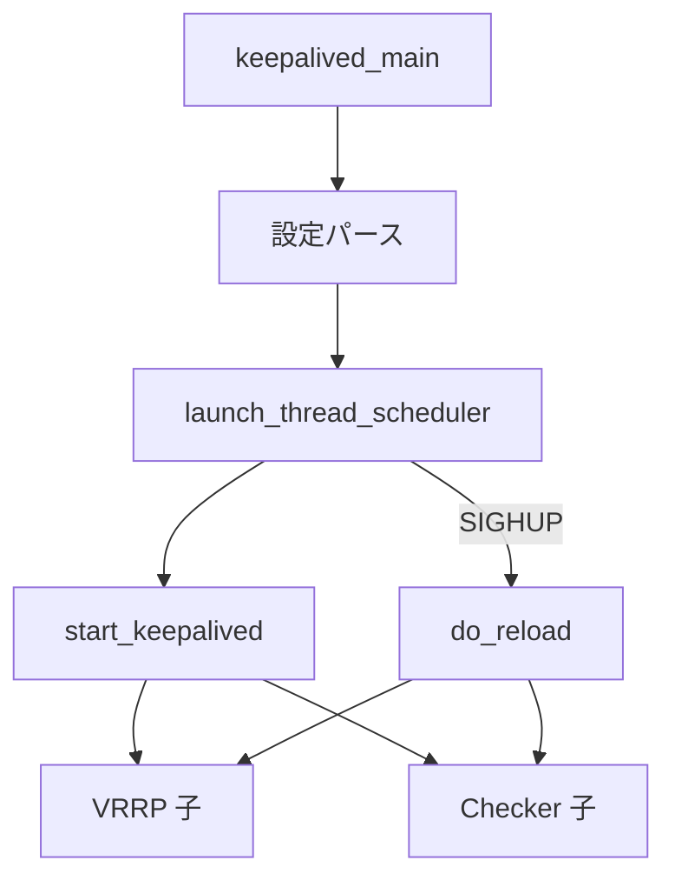

# 第6章 core main とデーモン起動

> 本章で読むソース
>
> - [`keepalived/core/main.c`](https://github.com/acassen/keepalived/blob/v2.4.1/keepalived/core/main.c)
> - [`keepalived/vrrp/vrrp_daemon.c`](https://github.com/acassen/keepalived/blob/v2.4.1/keepalived/vrrp/vrrp_daemon.c)

## この章の狙い

親プロセスにおける `keepalived_main` と `start_keepalived` の責務を分離して理解する。
設定読み込み、デーモン化、シグナル登録、子起動、リロードが core 層でどう接続されるかを追う。

## 前提

[第2章](../part00-overview/02-startup-and-process-model.md) と [第4章](../part01-foundation/04-parser-and-config.md) を読んでいること。

## エントリポイント

`keepalived_main` は keepalived 本体のエントリである。
`main.c` からだけでなく、テストやデバッグビルドからも直接呼ばれる。

[`keepalived/core/main.c` L2436-L2440](https://github.com/acassen/keepalived/blob/v2.4.1/keepalived/core/main.c#L2436-L2440)

```c
/* Entry point */
int
keepalived_main(int argc, char **argv)
{
```

関数冒頭で PID 記録、genhash 分岐、メモリチェックビット設定、シグナル無視を行う。
カーネルバージョンは `uname` から数値化し、機能の可否判定に使う（第7章）。

## 親プロセスとしての初期化

通常ビルドでは `prog_type = PROG_TYPE_PARENT` が設定される。
`daemon_mode` にはビルド時に有効なモジュールのビットが立つ。

[`keepalived/core/main.c` L2514-L2528](https://github.com/acassen/keepalived/blob/v2.4.1/keepalived/core/main.c#L2514-L2528)

```c
	/* We are the parent process */
#ifndef _ONE_PROCESS_DEBUG_
	prog_type = PROG_TYPE_PARENT;
#endif

	/* Initialise daemon_mode */
#ifdef _WITH_VRRP_
	__set_bit(DAEMON_VRRP, &daemon_mode);
#endif
#ifdef _WITH_LVS_
	__set_bit(DAEMON_CHECKERS, &daemon_mode);
#endif
#ifdef _WITH_BFD_
	__set_bit(DAEMON_BFD, &daemon_mode);
#endif
```

コマンドライン解析、権限ドロップ、network namespace 切替、設定ファイル読み込みはこの後に続く。
`reload_config` が失敗した場合は起動を中断する。

## デーモン化と二重起動防止

`keepalived_running` で既存インスタンスを PID ファイルから検出する。
問題がなければ `xdaemon()` で端末から切り離し、祖父プロセスは `exit(0)` する。

[`keepalived/core/main.c` L2791-L2806](https://github.com/acassen/keepalived/blob/v2.4.1/keepalived/core/main.c#L2791-L2806)

```c
	/* daemonize process */
	if (!__test_bit(DONT_FORK_BIT, &debug)) {
		pid_t old_ppid = our_pid;

#ifdef DO_STACKSIZE
		get_stacksize(true);
#endif

		if (xdaemon() > 0) {
			/* Parent process */
			closelog();
			FREE_CONST_PTR(config_id);
			FREE_PTR(orig_core_dump_pattern);
			close_std_fd();
			exit(0);
		}
```

デーモン化後の実プロセスは `main_pidfile` を書き、スケジューラを起動する。
`DONT_FORK_BIT` が立っているとフォアグラウンドのままデバッグできる。

## スケジューラ起動と子の投入

`thread_make_master` のあと `signal_init` で SIGHUP などを登録する。
`startup_script` がなければ `start_keepalived` を event キューに入れる。

[`keepalived/core/main.c` L2859-L2886](https://github.com/acassen/keepalived/blob/v2.4.1/keepalived/core/main.c#L2859-L2886)

```c
	/* Create the master thread */
	master = thread_make_master();

	/* Signal handling initialization  */
	signal_init();

#ifndef _ONE_PROCESS_DEBUG_
	/* Open eventfd for children notifying parent that they have read the configuration file */
	if (!__test_bit(CONFIG_TEST_BIT, &debug))
		open_config_read_fd();
#endif

	/* If we have a startup script, run it first */
	if (global_data->startup_script) {
		thread_add_event(master, run_startup_script, NULL, 0);
	} else {
		/* Init daemon */
		thread_add_event(master, start_keepalived, NULL, 0);
	}

	initialise_debug_options();

#ifdef THREAD_DUMP
	register_parent_thread_addresses();
#endif

	/* Launch the scheduling I/O multiplexer */
	exit_code = launch_thread_scheduler(master);
```

`launch_thread_scheduler` が戻るのは SIGTERM などで終了シーケンスに入ったときである。
その後 `stop_keepalived` が子の停止と PID ファイル削除を行う。

## start_keepalived のオーケストレーション

`start_keepalived` は子プロセス起動のハブである。
BFD パイプ、Checker、VRRP、BFD の順で `fork` し、不要な PID ファイルを掃除する。

[`keepalived/core/main.c` L514-L575](https://github.com/acassen/keepalived/blob/v2.4.1/keepalived/core/main.c#L514-L575)

```c
static void
start_keepalived(__attribute__((unused)) thread_ref_t thread)
{
	bool have_child = false;

	/* Although we use prctl to set PDEATHSIG, there are windows when it
	 * is not set, i.e. before it is first executed after a fork, and also
	 * after set(e)[ug]id() calls before PDEATHSIG can be reinstated. */
	main_pid = getpid();
	our_pid = main_pid;

	/* We want to ensure that any children of child process don't miss the
	 * termination of their immediate parent. */
	prctl(PR_SET_CHILD_SUBREAPER, 1);

#ifdef _WITH_BFD_
	/* must be opened before vrrp and bfd start */
	if (!open_bfd_pipes()) {
		thread_add_terminate_event(thread->master);
		return;
	}
#endif

#ifdef _WITH_LVS_
	/* start healthchecker child */
	if (running_checker()) {
		start_check_child();
		have_child = true;
		num_reloading++;
	} else
		pidfile_rm(&checkers_pidfile);
#endif
#ifdef _WITH_VRRP_
	/* start vrrp child */
	if (running_vrrp()) {
		start_vrrp_child();
		have_child = true;
		num_reloading++;
	} else
		pidfile_rm(&vrrp_pidfile);
#endif
#ifdef _WITH_BFD_
	/* start bfd child */
	if (running_bfd()) {
		start_bfd_child();
		have_child = true;
		num_reloading++;
	} else
		pidfile_rm(&bfd_pidfile);
#endif

	children_started = true;

#ifndef _ONE_PROCESS_DEBUG_
	/* Do we have a reload file to monitor */
	if (global_data->reload_time_file)
		start_reload_monitor();
#endif

	if (!have_child)
		log_message(LOG_INFO, "Warning - keepalived has no configuration to run");
}
```

`num_reloading` は子が設定を読み終えるまで親が待つカウンタである（第8章）。
子は読み終えたら `notify_config_read` で eventfd に書き込む。

## シグナル初期化

`signal_init` は親向けの SIGHUP、SIGUSR1、SIGTERM ハンドラを登録する。
SIGHUP は `process_reload_signal` に接続され、リロード中は `queue_reload` で直列化する。

[`keepalived/core/main.c` L1270-L1285](https://github.com/acassen/keepalived/blob/v2.4.1/keepalived/core/main.c#L1270-L1285)

```c
static void
signal_init(void)
{
#ifndef _ONE_PROCESS_DEBUG_
	signal_set(SIGHUP, process_reload_signal, NULL);
	signal_set(SIGUSR1, propagate_signal, NULL);
	signal_set(SIGUSR2, propagate_signal, NULL);
	signal_set(SIGSTATS_CLEAR, propagate_signal, NULL);
#ifdef _WITH_JSON_
	signal_set(SIGJSON, propagate_signal, NULL);
#endif
	if (ignore_sigint)
		signal_ignore(SIGINT);
	else
		signal_set(SIGINT, sigend, NULL);
	signal_set(SIGTERM, sigend, NULL);
```

`propagate_signal` は生存中の子へ同じシグナルを `kill` する。
子が死んでいれば `running_*()` が true なら再起動する。

## リロードの親側処理

`do_reload` は設定を再読み込みし、各子へ SIGHUP を伝播する。
`num_reloading` を子の数だけ増やし、全子の完了を eventfd で待つ。

[`keepalived/core/main.c` L933-L958](https://github.com/acassen/keepalived/blob/v2.4.1/keepalived/core/main.c#L933-L958)

```c
static void
do_reload(void)
{
	reinitialise_global_vars();

	if (!reload_config())
		return;

#ifdef _USE_SYSTEMD_NOTIFY_
	systemd_notify_reloading();
#endif

	propagate_signal(NULL, SIGHUP);

#ifdef _WITH_VRRP_
	if (vrrp_child > 0)
		num_reloading++;
#endif
#ifdef _WITH_LVS_
	if (checkers_child > 0)
		num_reloading++;
#endif
#ifdef _WITH_BFD_
	if (bfd_child > 0)
		num_reloading++;
#endif
}
```

`reload_check_config` が有効なら、本番リロード前に検証用子プロセスで設定を試す（第8章）。

## 親子の責務分担



親はプロトコル処理を行わず、設定と子の生存管理に専念する。
VRRP 広告や HTTP チェックはすべて子のスケジューラループ内で完結する。

## 高速化・最適化の工夫

親プロセスはネットワーク I/O をほぼ行わず、設定と監視に専念する。
リロードは親が新設定を読み、子へ SIGHUP を送って差分適用させ、全再起動を避ける。
`PR_SET_CHILD_SUBREAPER` により、子が作った孫プロセスのゾンビも親が回収できる。

event キュー最優先のスケジューラにより、`start_keepalived` や `start_reload` が I/O 待ちより先に実行される。
起動直後の制御フローが遅延しにくい。

## まとめ

`core/main.c` はオーケストレータであり、プロトコル処理は子に委譲される。
`keepalived_main` が環境を整え、`start_keepalived` が子を起動し、スケジューラが終了までループを回す。

## 関連する章

- [第2章 起動とプロセスモデル](../part00-overview/02-startup-and-process-model.md)
- [第8章 リロードと通知](08-reload-notify-track.md)
- [第10章 VRRP 子プロセス](../part03-vrrp-base/10-vrrp-daemon.md)
