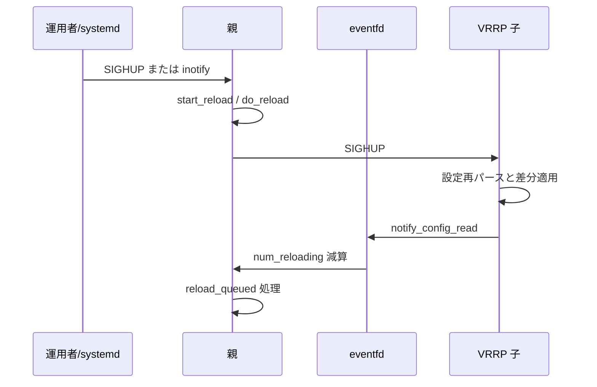

# 第8章 リロード、通知、プロセス追跡

> 本章で読むソース
>
> - [`keepalived/core/reload_monitor.c`](https://github.com/acassen/keepalived/blob/v2.4.1/keepalived/core/reload_monitor.c)
> - [`keepalived/core/config_notify.c`](https://github.com/acassen/keepalived/blob/v2.4.1/keepalived/core/config_notify.c)
> - [`keepalived/core/track_process.c`](https://github.com/acassen/keepalived/blob/v2.4.1/keepalived/core/track_process.c)
> - [`keepalived/core/main.c`](https://github.com/acassen/keepalived/blob/v2.4.1/keepalived/core/main.c)

## この章の狙い

SIGHUP リロード以外の設定更新経路と、親子間の設定読み込み同期を押さえる。
外部プロセス状態の追跡が VRRP のトラッキングへどうつながるかを読む。

## 前提

systemd の `Reload=` や inotify の用途を知っていること。
[第6章](06-core-main-and-daemon.md) の `do_reload` を読んでいること。

## SIGHUP リロードの直列化

親は `process_reload_signal` でリロードを開始する。
別のリロードが進行中なら `queue_reload` が要求を保留する。

[`keepalived/core/main.c` L1096-L1102](https://github.com/acassen/keepalived/blob/v2.4.1/keepalived/core/main.c#L1096-L1102)

```c
static void
process_reload_signal(__attribute__((unused)) void *v, __attribute__((unused)) int sig)
{
	if (!num_reloading)
		start_reload(NULL);
	else
		queue_reload();
}
```

`start_reload` は `reload_check_config` が有効なら検証用子を先に起動する。
検証成功後に `do_reload` が本番の設定再読み込みと子への SIGHUP 伝播を行う。

[`keepalived/core/main.c` L1078-L1093](https://github.com/acassen/keepalived/blob/v2.4.1/keepalived/core/main.c#L1078-L1093)

```c
void
start_reload(thread_ref_t thread)
{
	if (thread && __test_bit(LOG_DETAIL_BIT, &debug))
		log_message(LOG_INFO, "Processing queued reload");

	/* if reload_check_config is configured, validate the new config before reload */
	if (!global_data->reload_check_config) {
		do_reload();
		return;
	}

	if (__test_bit(LOG_DETAIL_BIT, &debug))
		log_message(LOG_INFO, "validate conf before Reload");

	start_validate_reload_conf_child();
}
```

## スケジュールされたリロード監視

`reload_time_file` が設定されていると、親ディレクトリを inotify で監視する。
ファイルの作成や更新を検知すると、指定時刻にリロードするタイマを組み立てる。

[`keepalived/core/reload_monitor.c` L407-L447](https://github.com/acassen/keepalived/blob/v2.4.1/keepalived/core/reload_monitor.c#L407-L447)

```c
void
start_reload_monitor(void)
{
	int inotify_fd;
	char *dir;
#ifdef RELOAD_DEBUG
	char time_buf[20];
#endif

	inotify_fd = inotify_init1(IN_CLOEXEC | IN_NONBLOCK);

	file_name = strrchr(global_data->reload_time_file, '/');
	if (!file_name) {
		dir = MALLOC(2);
		dir[0] = '/';
		dir[1] = '\0';
	} else {
		dir = MALLOC(file_name - global_data->reload_time_file + 1);
		strncpy(dir, global_data->reload_time_file, file_name - global_data->reload_time_file);
	}

	if ((dir_wd = inotify_add_watch(inotify_fd, dir,
		IN_CREATE | IN_DELETE | IN_MOVED_TO | IN_MOVED_FROM | IN_DELETE_SELF | IN_MOVE_SELF)) == -1) {
		log_message(LOG_INFO, "Unable to monitor reload timer file directory %s- ignoring", dir);
		FREE(dir);
		return;
	}
	FREE(dir);

	if (!file_name)
		file_name = global_data->reload_time_file;
	else
		file_name++;

	file_wd = watch_file(inotify_fd);
#ifdef RELOAD_DEBUG
	log_message(LOG_INFO, "dir_wd = %d, file_wd = %d", dir_wd, file_wd);
	if (global_data->reload_time)
		log_message(LOG_INFO, "Reload scheduled for %s", format_time_t(time_buf, sizeof(time_buf), global_data->reload_time));
#endif

	inotify_thread = thread_add_read(master, inotify_event_thread, NULL, inotify_fd, TIMER_NEVER, 0);
}
```

inotify も signalfd と同様に read スレッドとしてスケジューラに載る（第3章）。
SIGHUP 手動リロードと併用できる運用経路である。

## 子の設定読み込み通知

親は `open_config_read_fd` で eventfd を作る。
各子が設定を読み終えると `notify_config_read` が 1 を書き込み、`num_reloading` を減らす。

[`keepalived/core/config_notify.c` L54-L85](https://github.com/acassen/keepalived/blob/v2.4.1/keepalived/core/config_notify.c#L54-L85)

```c
static void
child_reloaded_thread(__attribute__((unused)) thread_ref_t thread)
{
	uint64_t event_count;
	int ret;

	ret = read(thread->u.f.fd, &event_count, sizeof(event_count));

	if (ret != sizeof(event_count)) {
		log_message(LOG_INFO, "read eventfd returned %d, errno %d - %m", ret, errno);
		return;
	}

	if (num_reloading >= event_count) {
		num_reloading -= event_count;

		if (!num_reloading) {
			log_message(LOG_INFO, "%s complete", loaded ? "Reload" : "Startup");
			loaded = true;
#ifdef _USE_SYSTEMD_NOTIFY_
			systemd_notify_running();
#endif

			if (reload_queued) {
				reload_queued = false;
				thread_add_event(master, start_reload, NULL, 0);
			}
		}
	} else
		log_message(LOG_INFO, "read eventfd count %" PRIu64 ", num_reloading %u", event_count, num_reloading);

	thread_add_read(master, child_reloaded_thread, NULL, child_reloaded_event, TIMER_NEVER, 0);
}
```

起動時もリロード時も同じカウンタで「全子の準備完了」を判定する。
保留中の `reload_queued` があれば、完了直後に次の `start_reload` が投入される。

[`keepalived/core/config_notify.c` L88-L102](https://github.com/acassen/keepalived/blob/v2.4.1/keepalived/core/config_notify.c#L88-L102)

```c
void
open_config_read_fd(void)
{
	child_reloaded_event = eventfd(0, EFD_CLOEXEC | EFD_NONBLOCK);
	thread_add_read(master, child_reloaded_thread, NULL, child_reloaded_event, TIMER_NEVER, 0);
}

void
notify_config_read(void)
{
	uint64_t one = 1;

	/* If we are not the parent, tell it we have completed reading the configuration */
	if (write(child_reloaded_event, &one, sizeof(one)) <= 0)
		log_message(LOG_INFO, "Write child_reloaded_event errno %d - %m", errno);
}
```

systemd 連携時は全子完了後に `systemd_notify_running` が呼ばれる。

## プロセス追跡の初期化

`track_process` は Linux の proc connector でプロセス生成と終了を監視する。
`init_track_processes` がソケットを有効化し、`read_process_update` を read スレッドに登録する。

[`keepalived/core/track_process.c` L1191-L1231](https://github.com/acassen/keepalived/blob/v2.4.1/keepalived/core/track_process.c#L1191-L1231)

```c
bool
init_track_processes(list_head_t *processes)
{
	int rc = EXIT_SUCCESS;
	unsigned i;
	long num;

	if (global_data->process_monitor_rcv_bufs)
		set_rcv_buf(global_data->process_monitor_rcv_bufs, global_data->process_monitor_rcv_bufs_force);

	rc = set_proc_ev_listen(nl_sock, true);
	if (rc == -1) {
		close(nl_sock);
		nl_sock = -1;
		return EXIT_FAILURE;
	}

	/* We get a PROC_EVENT_NONE if the proc_events_connector is built
	 * into the kernel. We have to timeout not receiving a message to
	 * know that proc evnets are not available. */
	if (!proc_events_responded)
		thread_add_timer(master, proc_events_ack_timer_thread, NULL, TIMER_HZ / 10);

	if (!cpu_seq) {
		/* should we consider only ONLINE CPU ? */
		num = sysconf(_SC_NPROCESSORS_CONF);
		if (num > 0) {
			num_cpus = num;
			cpu_seq = MALLOC(num_cpus * sizeof(*cpu_seq));
			for (i = 0; i < num_cpus; i++)
				cpu_seq[i] = -1;
		}
		else
			log_message(LOG_INFO, "sysconf returned %ld CPUs"
					      " - ignoring and won't track process event sequence numbers"
					    , num);
	}

	read_procs(processes);

	read_thread = thread_add_read(master, read_process_update, NULL, nl_sock, TIMER_NEVER, 0);

	return rc;
}
```

コネクタが使えないカーネルではタイムアウトで検知し、追跡を無効化する。
使える環境では `/proc` を走査した初期木に対し、リアルタイムイベントで更新する。

## リロード時の追跡木の再構築

`reload_track_processes` は既存の赤黒木を解放し、設定で指定されたプロセスを再スキャンする。
VRRP の `track_process` ブロックがここで解釈される（第16章）。

[`keepalived/core/track_process.c` L1236-L1246](https://github.com/acassen/keepalived/blob/v2.4.1/keepalived/core/track_process.c#L1236-L1246)

```c
void
reload_track_processes(void)
{
	/* Remove the existing process tree */
	free_process_tree();

	/* Re read processes */
	read_procs(&vrrp_data->vrrp_track_processes);

	/* Add read thread */
	read_thread = thread_add_read(master, read_process_update, NULL, nl_sock, TIMER_NEVER, 0);

	return;
}
```

追跡対象の生死は VRRP の優先度や状態遷移に影響する。
アプリケーション障害をネットワーク障害と同様にフェイルオーバー要因へ載せられる。

## リロード全体の流れ



## 高速化・最適化の工夫

リロードは子ごとに差分適用（`clear_diff_*`）を行い、全インスタンス再起動を避ける。
`queue_reload` により並行リロード要求を直列化し、設定の中間状態を表に出さない。
eventfd による完了通知は pipe よりカウンタ単位で集約でき、複数子の完了を1 read で処理できる。

proc connector はポーリング `/proc` よりイベント駆動で CPU を抑える。
初期スキャンは1回だけ行い、以降は netlink イベントで木を更新する。

## まとめ

運用時の動的変更は core 層の監視モジュールが受け、各子が差分処理する。
SIGHUP、inotify、eventfd、proc connector が組み合わさり、設定変更と外部プロセス追跡を支える。

## 関連する章

- [第6章 core main](06-core-main-and-daemon.md)
- [第16章 同期とトラック](../part04-vrrp-net/16-vrrp-sync-track.md)
- [第24章 genhash とトラッカー](../part07-ops/24-reload-genhash-trackers.md)
