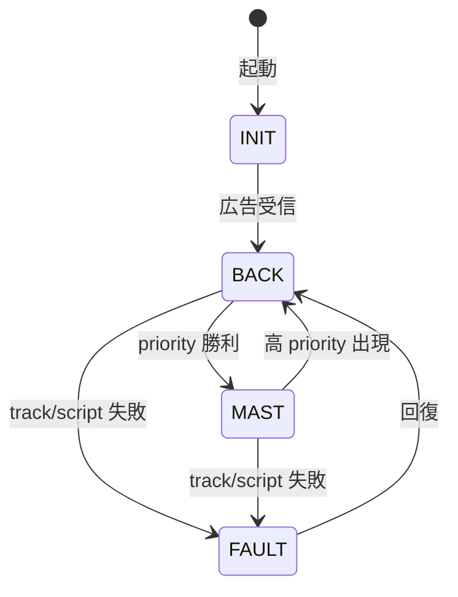
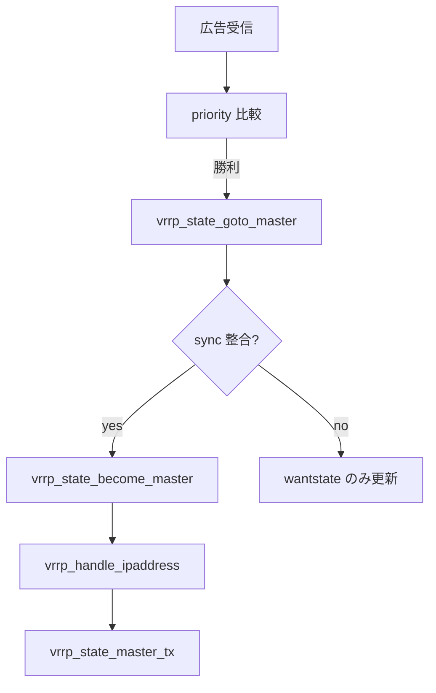

# 第9章 VRRP の概要と vrrp.c

> 本章で読むソース
>
> - [`keepalived/vrrp/vrrp.c`](https://github.com/acassen/keepalived/blob/v2.4.1/keepalived/vrrp/vrrp.c)
> - [`keepalived/vrrp/vrrp_data.c`](https://github.com/acassen/keepalived/blob/v2.4.1/keepalived/vrrp/vrrp_data.c)
> - [`keepalived/vrrp/vrrp_notify.c`](https://github.com/acassen/keepalived/blob/v2.4.1/keepalived/vrrp/vrrp_notify.c)

## この章の狙い

`vrrp.c` が担うプロトコル処理の全体像と、マスタ遷移の入口関数を把握する。
広告パケット処理、仮想 IP 制御、同期グループとの関係を、状態遷移の入口から読む。

## 前提

VRRP の Master/Backup と priority を理解していること。
[第2章](../part00-overview/02-startup-and-process-model.md)で子プロセス起動、[第3章](../part01-foundation/03-scheduler.md)でスケジューラを読んでいること。

## プロトコル目的

ファイル先頭コメントは RFC 2338 準拠のマスタ選出とフェイルオーバー目的を明示する。

[`keepalived/vrrp/vrrp.c` L6-L9](https://github.com/acassen/keepalived/blob/v2.4.1/keepalived/vrrp/vrrp.c#L6-L9)

```c
 * Part:        VRRP implementation of VRRPv2 as specified in rfc2338.
 *              VRRP is a protocol which elect a master server on a LAN. If the
 *              master fails, a backup server takes over.
 *              The original implementation has been made by jerome etienne.
```

keepalived の VRRP は単一ファイルに集約されず、`vrrp_scheduler.c` がタイマ、`vrrp_ipaddress.c` が VIP、`vrrp_notify.c` がスクリプト通知を分担する。
本章は `vrrp.c` の状態遷移とマスタ化処理に焦点を当てる。

## 状態の表現

`vrrp_data.c` は内部状態定数をログ用文字列へ変換する。
運用ログの `Entering BACKUP STATE` はこの対応に基づく。

[`keepalived/vrrp/vrrp_data.c` L63-L66](https://github.com/acassen/keepalived/blob/v2.4.1/keepalived/vrrp/vrrp_data.c#L63-L66)

```c
	if (state == VRRP_STATE_BACK) return "BACKUP";
	if (state == VRRP_STATE_MAST) return "MASTER";
	if (state == VRRP_STATE_FAULT) return "FAULT";
	return "unknown";
```



## マスタ化の二段階

マスタ遷移は `vrrp_state_goto_master` と `vrrp_state_become_master` の二段で進む。
前者は同期グループ整合と状態フラグ更新、後者は VIP 追加と統計更新を担う。

[`keepalived/vrrp/vrrp.c` L1955-L1985](https://github.com/acassen/keepalived/blob/v2.4.1/keepalived/vrrp/vrrp.c#L1955-L1985)

```c
void
vrrp_state_goto_master(vrrp_t * vrrp)
{
	if (vrrp->sync && !vrrp_sync_can_goto_master(vrrp))
	{
		vrrp->wantstate = VRRP_STATE_MAST;
		return;
	}
	// ... (中略) ...
	vrrp->state = VRRP_STATE_MAST;
	vrrp_init_instance_sands(vrrp);

	/* If a delayed start timer has not expired, then we must not transition to master yet */
	if (!vrrp_delayed_start_time.tv_sec)
		vrrp_state_master_tx(vrrp);
}
```

同期グループに属する instance は `vrrp_sync_can_goto_master` が偽の間、`wantstate` だけを `VRRP_STATE_MAST` に据えて実遷移を遅延する。

[`keepalived/vrrp/vrrp.c` L1883-L1916](https://github.com/acassen/keepalived/blob/v2.4.1/keepalived/vrrp/vrrp.c#L1883-L1916)

```c
/* becoming master */
static void
vrrp_state_become_master(vrrp_t * vrrp)
{
	++vrrp->stats->become_master;
	// ... (中略) ...
	if (!list_empty(&vrrp->vip))
		vrrp_handle_ipaddress(vrrp, IPADDRESS_ADD, VRRP_VIP_TYPE, false);
	if (!list_empty(&vrrp->evip))
		vrrp_handle_ipaddress(vrrp, IPADDRESS_ADD, VRRP_EVIP_TYPE, false);
	vrrp->vipset = true;
```

## マスタ離脱と広告

マスタ離脱時は優先度 0 の広告を送り、インタフェース設定を戻す。
`vrrp_restore_interface` は他ルータの収束を早める意図をコメントで述べる。

[`keepalived/vrrp/vrrp.c` L1987-L1993](https://github.com/acassen/keepalived/blob/v2.4.1/keepalived/vrrp/vrrp.c#L1987-L1993)

```c
/* leaving master state */
void
vrrp_restore_interface(vrrp_t * vrrp, bool advF, bool force)
{
	/* if we stop vrrp, warn the other routers to speed up the recovery */
	if (advF) {
		vrrp_send_adv(vrrp, VRRP_PRIO_STOP);
```

## 通知スクリプトとの接続

状態変化時に実行する notify スクリプトは `vrrp_notify.c` が状態ごとに選択する。
MASTER と BACKUP で別スクリプトを走らせられる。

[`keepalived/vrrp/vrrp_notify.c` L49-L58](https://github.com/acassen/keepalived/blob/v2.4.1/keepalived/vrrp/vrrp_notify.c#L49-L58)

```c
	if (vrrp->state == VRRP_STATE_BACK)
		return vrrp->script_backup;
	if (vrrp->state == VRRP_STATE_MAST)
		return vrrp->script_master;
	if (vrrp->state == VRRP_STATE_FAULT)
		return vrrp->script_fault;
	if (vrrp->state == VRRP_STATE_STOP)
		return vrrp->script_stop;
	if (vrrp->state == VRRP_STATE_DELETED)
		return vrrp->script_deleted;
```

## 処理フロー（マスタ選出）



## 高速化・最適化の工夫

同期グループは1つの広告処理で複数 instance の `wantstate` をまとめて更新し、syscall と netlink 操作の回数を抑える。
`vrrp_delayed_start_time` によりバックアップの早すぎるマスタ化を防ぎ、ネットワーク収束中のフラッピングを減らす。

## まとめ

`vrrp.c` は keepalived VRRP の中核で、マスタ化は goto と become の二段、離脱は STOP 広告とインタフェース復元で進む。

## 関連する章

- [第10章 VRRP 子プロセス](10-vrrp-daemon.md)
- [第11章 状態遷移](11-vrrp-state-machine.md)
