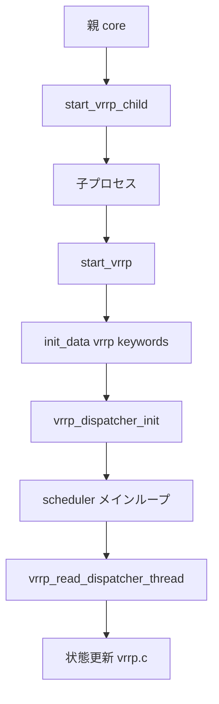

# 第10章 VRRP 子プロセスとスケジューラ

> 本章で読むソース
>
> - [`keepalived/vrrp/vrrp_daemon.c`](https://github.com/acassen/keepalived/blob/v2.4.1/keepalived/vrrp/vrrp_daemon.c)
> - [`keepalived/vrrp/vrrp_scheduler.c`](https://github.com/acassen/keepalived/blob/v2.4.1/keepalived/vrrp/vrrp_scheduler.c)

## この章の狙い

VRRP 子プロセスの fork、設定読み込み、パケットディスパッチャ起動を追う。
親プロセスから見た `start_vrrp_child` と、子内の `start_vrrp` の境界を明確にする。

## 前提

[第2章](../part00-overview/02-startup-and-process-model.md)のプロセスモデル、[第6章](../part02-core/06-core-main-and-daemon.md)の親 main を読んでいること。

## 子プロセスの fork

親は `start_vrrp_child` で fork し、子 PID を `vrrp_child` に記録する。
子が落ちたときの再起動は `vrrp_respawn_thread` が担当する。

[`keepalived/vrrp/vrrp_daemon.c` L1031-L1059](https://github.com/acassen/keepalived/blob/v2.4.1/keepalived/vrrp/vrrp_daemon.c#L1031-L1059)

```c
int
start_vrrp_child(void)
{
#ifndef _ONE_PROCESS_DEBUG_
	pid_t pid;
	// ... (中略) ...
	pid = fork();

	if (pid < 0) {
		log_message(LOG_INFO, "VRRP child process: fork error(%s)"
			       , strerror(errno));
		return -1;
	} else if (pid) {
		vrrp_child = pid;
		vrrp_start_time = time_now;

		log_message(LOG_INFO, "Starting VRRP child process, pid=%d"
			       , pid);

		/* Start respawning thread */
		thread_add_child(master, vrrp_respawn_thread, NULL,
				 pid, TIMER_NEVER);

		return 0;
	}
```

子側は `PR_SET_PDEATHSIG` で親死亡時に SIGTERM を受け取り、ゾンビ化を避ける。

[`keepalived/vrrp/vrrp_daemon.c` L1071-L1074](https://github.com/acassen/keepalived/blob/v2.4.1/keepalived/vrrp/vrrp_daemon.c#L1071-L1074)

```c
	prctl(PR_SET_PDEATHSIG, SIGTERM);

	/* Check our parent hasn't already changed since the fork */
	if (main_pid != getppid())
```

## start_vrrp の初期化

子プロセス内の `start_vrrp` は netlink 初期化、設定パース、インタフェース検証を順に行う。
`init_data` で `vrrp_init_keywords` を登録したパーサが conf を読む。

[`keepalived/vrrp/vrrp_daemon.c` L511-L546](https://github.com/acassen/keepalived/blob/v2.4.1/keepalived/vrrp/vrrp_daemon.c#L511-L546)

```c
static void
start_vrrp(data_t *prev_global_data)
{
	unsigned delay_remaining;

	/* Clear the flags used for optimising performance */
	clear_summary_flags();

	/* Initialize sub-system */
	if (!__test_bit(CONFIG_TEST_BIT, &debug))
		kernel_netlink_init();
	// ... (中略) ...
	init_data(conf_file, vrrp_init_keywords, false);

	/* Update process name if necessary */
	if ((!prev_global_data && 		// startup
	     global_data->vrrp_process_name) ||
```

存在しないインタフェースが設定に含まれると `KEEPALIVED_EXIT_CONFIG` で終了する。

[`keepalived/vrrp/vrrp_daemon.c` L542-L546](https://github.com/acassen/keepalived/blob/v2.4.1/keepalived/vrrp/vrrp_daemon.c#L542-L546)

```c
	if (non_existent_interface_specified) {
		report_config_error(CONFIG_BAD_IF, "Non-existent interface specified in configuration");
		stop_vrrp(KEEPALIVED_EXIT_CONFIG);
		return;
	}
```

## ディスパッチャ起動

本番モードでは `vrrp_dispatcher_init` をイベントとして登録し、パケット受信ループへ入る。
`vrrp_startup_delay` 設定時は `vrrp_delayed_start_time` を立て、マスタ化を遅延する。

[`keepalived/vrrp/vrrp_daemon.c` L614-L624](https://github.com/acassen/keepalived/blob/v2.4.1/keepalived/vrrp/vrrp_daemon.c#L614-L624)

```c
	if (!__test_bit(CONFIG_TEST_BIT, &debug)) {
		/* Init & start the VRRP packet dispatcher */
		thread_add_event(master, vrrp_dispatcher_init, NULL, 0);

		if (!reload) {
			if (global_data->vrrp_startup_delay) {
				vrrp_delayed_start_time = timer_add_long(time_now, global_data->vrrp_startup_delay);
				thread_add_timer(master, delayed_start_clear_thread, NULL, global_data->vrrp_startup_delay);
				log_message(LOG_INFO, "Delaying startup for %g seconds", global_data->vrrp_startup_delay / TIMER_HZ_DOUBLE);
			} else
				vrrp_delayed_start_time.tv_sec = 0;
```

## vrrp_scheduler の役割

`vrrp_scheduler.c` は読み取りスレッド `vrrp_read_dispatcher_thread` と BFD/script 用コールバックを束ねる。
同期グループ単位で `wantstate` と実 `state` を照合し、マスタ候補を決める。

[`keepalived/vrrp/vrrp_scheduler.c` L208-L224](https://github.com/acassen/keepalived/blob/v2.4.1/keepalived/vrrp/vrrp_scheduler.c#L208-L224)

```c
	list_for_each_entry(vrrp, l, e_list) {
		int vrrp_begin_state = vrrp->state;

		/* wantstate is the state we would be in disregarding any sync group */
		if (vrrp->state == VRRP_STATE_FAULT)
			vrrp->wantstate = VRRP_STATE_FAULT;

		new_state = vrrp->sync ? vrrp->sync->state : vrrp->wantstate;

		is_up = VRRP_ISUP(vrrp);

		if (is_up &&
		    new_state == VRRP_STATE_MAST &&
		    !vrrp->num_script_init && (!vrrp->sync || !vrrp->sync->num_member_init) &&
```

読み取りディスパッチャの登録名はデバッグ用に `register_thread_address` へ記録される。

[`keepalived/vrrp/vrrp_scheduler.c` L129-L129](https://github.com/acassen/keepalived/blob/v2.4.1/keepalived/vrrp/vrrp_scheduler.c#L129)

```c
static void vrrp_read_dispatcher_thread(thread_ref_t);
```

## 処理フロー



## 高速化・最適化の工夫

複数 VRRP instance のソケットを epoll にまとめ、1回の `epoll_wait` で複数読み取りを処理する。
`clear_summary_flags` は起動時にサマリフラグをリセットし、リロード後の不要な netlink 操作を省略する。

## まとめ

VRRP 子は `start_vrrp_child` で fork され、子内 `start_vrrp` が設定とディスパッチャを初期化する。
パケット I/O とタイマは `vrrp_scheduler.c`、プロトコル本体は `vrrp.c` が担う。

## 関連する章

- [第9章 VRRP 概要](09-vrrp-overview.md)
- [第11章 状態遷移](11-vrrp-state-machine.md)
