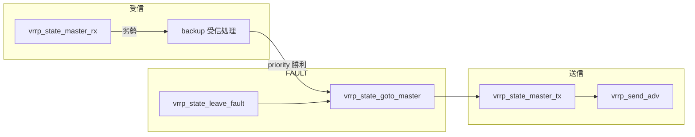

# 第11章 VRRP 状態遷移

> 本章で読むソース
>
> - [`keepalived/vrrp/vrrp.c`](https://github.com/acassen/keepalived/blob/v2.4.1/keepalived/vrrp/vrrp.c)
> - [`keepalived/vrrp/vrrp_scheduler.c`](https://github.com/acassen/keepalived/blob/v2.4.1/keepalived/vrrp/vrrp_scheduler.c)

## この章の狙い

マスタ受信、マスタ送信、FAULT 離脱の3経路を読み、タイマと `wantstate` の関係を把握する。

## 前提

[第9章](09-vrrp-overview.md)の `vrrp_state_goto_master` と [第10章](10-vrrp-daemon.md)のスケジューラを理解していること。

## マスタ送信経路

`vrrp_state_master_tx` は広告を先に送り、その後 VIP を設定する。
旧マスタが VIP を外す時間を確保する意図がコメントに書かれる。

[`keepalived/vrrp/vrrp.c` L2306-L2317](https://github.com/acassen/keepalived/blob/v2.4.1/keepalived/vrrp/vrrp.c#L2306-L2317)

```c
vrrp_state_master_tx(vrrp_t * vrrp)
{
	/* If we are transitioning to master the old master needs to
	 * remove the VIPs before we send the gratuitous ARPs, so send
	 * the advert first.
	 */
	vrrp_send_adv(vrrp, vrrp->effective_priority);

	if (!VRRP_VIP_ISSET(vrrp)) {
		log_message(LOG_INFO, "(%s) Entering MASTER STATE"
				    , vrrp->iname);
		vrrp_state_become_master(vrrp);
```

## マスタ受信経路

マスタ状態で広告を受け取ると `vrrp_state_master_rx` が priority とアドレスを比較する。
`wantstate` が FAULT のときはダウンタイマだけ更新して早期 return する。

[`keepalived/vrrp/vrrp.c` L2365-L2380](https://github.com/acassen/keepalived/blob/v2.4.1/keepalived/vrrp/vrrp.c#L2365-L2380)

```c
vrrp_state_master_rx(vrrp_t * vrrp, const vrrphdr_t *hd, const char *buf, ssize_t buflen)
{
	ssize_t ret;
	// ... (中略) ...
	unsigned master_adver_int;
	int addr_cmp;
	vrrp_t *isync;

// TODO - could we get here with wantstate == FAULT and STATE != FAULT?
	/* return on link failure */
// TODO - not needed???
	if (vrrp->wantstate == VRRP_STATE_FAULT) {
		vrrp->master_adver_int = vrrp->adver_int;
		vrrp->ms_down_timer = VRRP_MS_DOWN_TIMER(vrrp);
```

## マスタ離脱

`vrrp_state_leave_master` は BACKUP または FAULT への遷移前にインタフェースを復元する。
LVS 連携ビルドでは IPVS sync デーモンを backup 側へ切り替える。

[`keepalived/vrrp/vrrp.c` L2037-L2069](https://github.com/acassen/keepalived/blob/v2.4.1/keepalived/vrrp/vrrp.c#L2037-L2069)

```c
void
vrrp_state_leave_master(vrrp_t * vrrp, bool advF)
{
#ifdef _WITH_LVS_
	if (VRRP_VIP_ISSET(vrrp)) {
		/* Check if sync daemon handling is needed */
		if (global_data->lvs_syncd.vrrp == vrrp)
			ipvs_syncd_backup(&global_data->lvs_syncd);
	}
#endif
	// ... (中略) ...
	vrrp_restore_interface(vrrp, advF, false);
	vrrp->state = vrrp->wantstate;

	send_instance_notifies(vrrp);
```

## FAULT 離脱

`vrrp_state_leave_fault` は `wantstate` に応じてマスタ復帰か BACKUP/FAULT 確定を行う。
マスタから FAULT へ落ちるときは STOP 広告とインタフェース復元を先に実行する。

[`keepalived/vrrp/vrrp.c` L2086-L2103](https://github.com/acassen/keepalived/blob/v2.4.1/keepalived/vrrp/vrrp.c#L2086-L2103)

```c
void
vrrp_state_leave_fault(vrrp_t * vrrp)
{
	/* set the new vrrp state */
	if (vrrp->wantstate == VRRP_STATE_MAST)
		vrrp_state_goto_master(vrrp);
	else {
		if (vrrp->state != vrrp->wantstate)
			log_message(LOG_INFO, "(%s) Entering %s STATE", vrrp->iname, vrrp->wantstate == VRRP_STATE_BACK ? "BACKUP" : "FAULT");
		if (vrrp->wantstate == VRRP_STATE_FAULT && vrrp->state == VRRP_STATE_MAST) {
			vrrp_send_adv(vrrp, VRRP_PRIO_STOP);
			vrrp_restore_interface(vrrp, false, false);
		}
		vrrp->state = vrrp->wantstate;
		send_instance_notifies(vrrp);

		if (vrrp->state == VRRP_STATE_BACK)
			vrrp->preempt_time.tv_sec = 0;
	}
```

離脱後は `ms_down_timer` を再計算し、次の広告待ちタイミングを初期化する。

[`keepalived/vrrp/vrrp.c` L2106-L2110](https://github.com/acassen/keepalived/blob/v2.4.1/keepalived/vrrp/vrrp.c#L2106-L2110)

```c
	/* Set the down timer */
	vrrp->master_adver_int = vrrp->adver_int;
	vrrp->ms_down_timer = VRRP_MS_DOWN_TIMER(vrrp);
	vrrp_init_instance_sands(vrrp);
	vrrp->last_transition = timer_now();
```

## スケジューラとの連携

`vrrp_scheduler.c` は各 instance の `wantstate` を同期グループ状態と突き合わせる。
`reload_master` と `base_priority == VRRP_PRIO_OWNER` の組み合わせで即マスタ化のショートカットがある。

[`keepalived/vrrp/vrrp_scheduler.c` L219-L244](https://github.com/acassen/keepalived/blob/v2.4.1/keepalived/vrrp/vrrp_scheduler.c#L219-L244)

```c
		if (is_up &&
		    new_state == VRRP_STATE_MAST &&
		    !vrrp->num_script_init && (!vrrp->sync || !vrrp->sync->num_member_init) &&
		    (vrrp->base_priority == VRRP_PRIO_OWNER ||
		     vrrp->reload_master) &&
		    vrrp->wantstate == VRRP_STATE_MAST) {
			// ... (中略) ...
				vrrp->state = VRRP_STATE_BACK;
				vrrp->ms_down_timer = 1;
			}
```

## 実行経路の整理



## 高速化・最適化の工夫

マスタ遷移時に広告を VIP 設定より先に送ることで、旧マスタとの ARP 競合時間を短縮する。
`ms_down_timer = 1` のショートカットは address owner のリロード時マスタ復帰を1マイクロ秒タイムアウトで実現する。

## まとめ

VRRP 状態遷移は受信・送信・FAULT 離脱の3関数群と、スケジューラの `wantstate` 更新が連動する。

## 関連する章

- [第9章 VRRP 概要](09-vrrp-overview.md)
- [第16章 同期グループ](../part04-vrrp-net/16-vrrp-sync-track.md)
