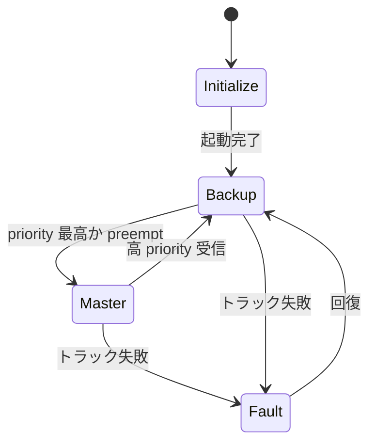

# 第11章 VRRP 状態遷移

> 本章で読むソース
>
> - [`keepalived/vrrp/vrrp.c`](https://github.com/acassen/keepalived/blob/v2.4.1/keepalived/vrrp/vrrp.c#L1956-L1979)
> - [`keepalived/include/vrrp.h`](https://github.com/acassen/keepalived/blob/v2.4.1/keepalived/include/vrrp.h)

## この章の狙い

Master/Backup/Initialize/Fault 遷移の実装をコードレベルで対応づける。

## 前提

VRRP の preempt と `priority` を理解していること。

## MASTER への遷移

[`keepalived/vrrp/vrrp.c` L1956-L1979](https://github.com/acassen/keepalived/blob/v2.4.1/keepalived/vrrp/vrrp.c#L1956-L1979)

```c
vrrp_state_goto_master(vrrp_t * vrrp)
{
	if (vrrp->sync && !vrrp_sync_can_goto_master(vrrp))
	{
		vrrp->wantstate = VRRP_STATE_MAST;
		return;
	}
	// ... (中略) ...
	vrrp->state = VRRP_STATE_MAST;
```

同期グループでは全員が Backup のときだけマスタ化が許可される。

## 状態遷移図



## 高速化・最適化の工夫

マスタダウン検知は広告タイムアウトで行い、追加のポーリングを避ける。
`master_adver_int` を学習し、バックアップのタイマをマスタに合わせる。

## まとめ

状態は `vrrp_t->state` に保持され、受信広告とトラック結果で遷移する。

## 関連する章

- [第9章 VRRP 概要](09-vrrp-overview.md)
- [第16章 同期グループ](../part04-vrrp-net/16-vrrp-sync-track.md)
