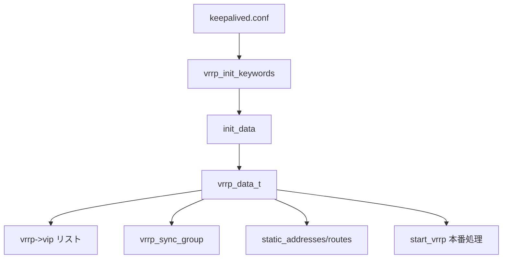

# 第12章 VRRP パーサとデータ構造

> 本章で読むソース
>
> - [`keepalived/vrrp/vrrp_parser.c`](https://github.com/acassen/keepalived/blob/v2.4.1/keepalived/vrrp/vrrp_parser.c)
> - [`keepalived/vrrp/vrrp_data.c`](https://github.com/acassen/keepalived/blob/v2.4.1/keepalived/vrrp/vrrp_data.c)

## この章の狙い

`vrrp_init_keywords` が登録する設定キーワードと、`vrrp_data_t` のリスト構造を読む。
conf から instance オブジェクトがどう組み立てられるかを把握する。

## 前提

[第4章](../part01-foundation/04-parser-and-config.md)の共通パーサ基盤を理解していること。

## キーワード登録

`vrrp_init_keywords` は global、vrrp、check、bfd、track_file の各キーワードセットを登録する。
VRRP 子は `init_data(conf_file, vrrp_init_keywords, false)` でこの vector を使う。

[`keepalived/vrrp/vrrp_parser.c` L2462-L2479](https://github.com/acassen/keepalived/blob/v2.4.1/keepalived/vrrp/vrrp_parser.c#L2462-L2479)

```c
const vector_t *
vrrp_init_keywords(void)
{
	/* global definitions mapping */
	init_global_keywords(reload);

	init_vrrp_keywords(true);
#ifdef _WITH_LVS_
	init_check_keywords(false);
#endif
#ifdef _WITH_BFD_
	init_bfd_keywords(true);
#endif
	add_track_file_keywords(true);

	cur_aggregation_group = 0;

	return keywords;
}
```

`reload` フラグにより global キーワードの再登録方法が切り替わる。
子プロセスのリロード時は既存データを `prev_global_data` と突き合わせる（第10章）。

`init_vrrp_keywords(true)` は vrrp instance ブロック用のキーワードテーブルを構築する。
第4章の `install_keyword` 機構へ callback を登録する形で接続される。

[`keepalived/vrrp/vrrp_parser.c` L2468-L2468](https://github.com/acassen/keepalived/blob/v2.4.1/keepalived/vrrp/vrrp_parser.c#L2468-L2468)

```c
	init_vrrp_keywords(true);
```

## vrrp_data の確保

`alloc_vrrp_data` は static ルート、sync group、vrrp instance 用のリストヘッドを初期化する。

[`keepalived/vrrp/vrrp_data.c` L1344-L1354](https://github.com/acassen/keepalived/blob/v2.4.1/keepalived/vrrp/vrrp_data.c#L1344-L1354)

```c
alloc_vrrp_data(void)
{
	vrrp_data_t *new;

	PMALLOC(new);
	INIT_LIST_HEAD(&new->static_track_groups);
	INIT_LIST_HEAD(&new->static_addresses);
	INIT_LIST_HEAD(&new->static_routes);
	INIT_LIST_HEAD(&new->static_rules);
	INIT_LIST_HEAD(&new->vrrp_sync_group);
	INIT_LIST_HEAD(&new->vrrp);
```

`vrrp_daemon.c` の `start_vrrp` はパース前に `vrrp_data = alloc_vrrp_data()` を呼ぶ。
パース結果はこの構造体の各リストへ蓄積される。

## 状態のダンプ

`vrrp_data.c` はデバッグ用に instance 状態を conf 風に書き出す。
BACKUP 時は master router アドレスと priority を、MASTER かつ address owner 時は rogue カウンタを表示する。

[`keepalived/vrrp/vrrp_data.c` L616-L625](https://github.com/acassen/keepalived/blob/v2.4.1/keepalived/vrrp/vrrp_data.c#L616-L625)

```c
		if (vrrp->state == VRRP_STATE_BACK) {
			conf_write(fp, "   Master router = %s", inet_sockaddrtos(&vrrp->master_saddr));
			conf_write(fp, "   Master priority = %d", vrrp->master_priority);
			if (vrrp->version == VRRP_VERSION_3)
				conf_write(fp, "   Master advert interval = %u milli-sec", vrrp->master_adver_int / (TIMER_HZ / 1000));
		} else if (vrrp->state == VRRP_STATE_MAST && vrrp->base_priority == VRRP_PRIO_OWNER) {
			conf_write(fp, "   Rogue master counter = %u", vrrp->rogue_counter);
			conf_write(fp, "   Roger timer thread = %p", vrrp->rogue_timer_thread);
			if (vrrp->rogue_counter || vrrp->rogue_timer_thread)
				conf_write(fp, "   Roger adver interval = %u ms", vrrp->rogue_adver_int / (TIMER_HZ / 1000));
		}
```

## static track group の解放

パーサが生成した static track group はリスト走査で解放する。
リロードや終了時のメモリリーク防止に使われる。

[`keepalived/vrrp/vrrp_data.c` L70-L77](https://github.com/acassen/keepalived/blob/v2.4.1/keepalived/vrrp/vrrp_data.c#L70-L77)

```c
static void
free_static_track_groups_list(list_head_t *l)
{
	static_track_group_t *tgroup, *tgroup_tmp;

	list_for_each_entry_safe(tgroup, tgroup_tmp, l, e_list)
		free_static_track_group(tgroup);
}
```

## データフロー



## sync group のパース

`vrrp_sync_group` ブロックは名前の重複を拒否し、`alloc_vrrp_sync_group` で構造体を確保する。

[`keepalived/vrrp/vrrp_parser.c` L230-L256](https://github.com/acassen/keepalived/blob/v2.4.1/keepalived/vrrp/vrrp_parser.c#L230-L256)

```c
vrrp_sync_group_handler(const vector_t *strvec)
{
	vrrp_sgroup_t *sgroup;
	const char *gname;
	// ... (中略) ...
	list_for_each_entry(sgroup, &vrrp_data->vrrp_sync_group, e_list) {
		if (!strcmp(gname, sgroup->gname)) {
			report_config_error(CONFIG_GENERAL_ERROR, "vrrp sync group %s already defined", gname);
			skip_block(true);
			return;
		}
	}

	current_vsyncg = alloc_vrrp_sync_group(gname);
}
```

## 高速化・最適化の工夫

キーワード vector は起動時に1回構築し、リロード時は global 部分だけ差し替える。
instance はリストで保持し、スケジューラが `list_for_each_entry` で全件を1ループ処理する。

## まとめ

VRRP 設定は `vrrp_parser.c` のキーワード登録で読み込まれ、`vrrp_data_t` のリスト群としてメモリに展開される。

## 関連する章

- [第4章 パーサ](../part01-foundation/04-parser-and-config.md)
- [第10章 VRRP 子](10-vrrp-daemon.md)
