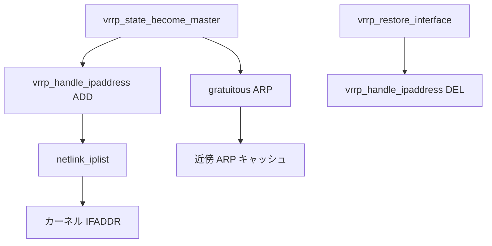

# 第13章 仮想 IP とインタフェース

> 本章で読むソース
>
> - [`keepalived/vrrp/vrrp.c`](https://github.com/acassen/keepalived/blob/v2.4.1/keepalived/vrrp/vrrp.c)
> - [`keepalived/vrrp/vrrp_ipaddress.c`](https://github.com/acassen/keepalived/blob/v2.4.1/keepalived/vrrp/vrrp_ipaddress.c)
> - [`keepalived/vrrp/vrrp_arp.c`](https://github.com/acassen/keepalived/blob/v2.4.1/keepalived/vrrp/vrrp_arp.c)

## この章の狙い

マスタ遷移時に VIP をカーネルへ載せ、GARP で近傍へ通知する経路を読む。
`vrrp_handle_ipaddress` から netlink、`vrrp_arp.c` までの処理を追う。

## 前提

[第9章](../part03-vrrp-base/09-vrrp-overview.md)の `vrrp_state_become_master`、[第7章](../part02-core/07-netlink-and-namespaces.md)の netlink 基盤を理解していること。

## VIP 追加の入口

`vrrp.c` の `vrrp_handle_ipaddress` は VIP と EVIP のリストを `netlink_iplist` へ渡す薄いラッパである。
マスタ化の本体 `vrrp_state_become_master` から VIP 型ごとに呼ばれる。

[`keepalived/vrrp/vrrp.c` L138-L147](https://github.com/acassen/keepalived/blob/v2.4.1/keepalived/vrrp/vrrp.c#L138-L147)

```c
/* add/remove Virtual IP addresses */
static bool
vrrp_handle_ipaddress(vrrp_t *vrrp, int cmd, int type, bool force)
{
	if (__test_bit(LOG_DETAIL_BIT, &debug))
		log_message(LOG_INFO, "(%s) %sing %sVIPs.", vrrp->iname,
		       (cmd == IPADDRESS_ADD) ? "sett" : "remov",
		       (type == VRRP_VIP_TYPE) ? "" : "E-");
	return netlink_iplist((type == VRRP_VIP_TYPE) ? &vrrp->vip : &vrrp->evip, cmd, force);
}
```

[`keepalived/vrrp/vrrp.c` L1912-L1916](https://github.com/acassen/keepalived/blob/v2.4.1/keepalived/vrrp/vrrp.c#L1912-L1916)

```c
	if (!list_empty(&vrrp->vip))
		vrrp_handle_ipaddress(vrrp, IPADDRESS_ADD, VRRP_VIP_TYPE, false);
	if (!list_empty(&vrrp->evip))
		vrrp_handle_ipaddress(vrrp, IPADDRESS_ADD, VRRP_EVIP_TYPE, false);
	vrrp->vipset = true;
```

## netlink_iplist

`vrrp_ipaddress.c` の `netlink_iplist` はアドレスリストを走査し、RTnetlink で追加または削除する。
`--dont-release-vrrp` 設定時は自プロセスが載せていないアドレスも解放対象に含める。

[`keepalived/vrrp/vrrp_ipaddress.c` L243-L251](https://github.com/acassen/keepalived/blob/v2.4.1/keepalived/vrrp/vrrp_ipaddress.c#L243-L251)

```c
netlink_iplist(list_head_t *ip_list, int cmd, bool force)
{
	ip_address_t *ip_addr;
	bool changed_entries = false;

	/*
	 * If "--dont-release-vrrp" is set then try to release addresses
	 * that may be there, even if we didn't set them.
	 */
```

ファイル先頭コメントは IPv4 アドレス操作が netlink 経由であることを示す。

[`keepalived/vrrp/vrrp_ipaddress.c` L6-L7](https://github.com/acassen/keepalived/blob/v2.4.1/keepalived/vrrp/vrrp_ipaddress.c#L6-L7)

```c
 * Part:        NETLINK IPv4 address manipulation.
 *
```

## Gratuitous ARP

VIP 追加後、近傍キャッシュを更新するため `vrrp_arp.c` が GARP を送信する。
`send_arp` は `AF_PACKET` ソケットでインタフェースへ直接書き込む。

[`keepalived/vrrp/vrrp_arp.c` L59-L86](https://github.com/acassen/keepalived/blob/v2.4.1/keepalived/vrrp/vrrp_arp.c#L59-L86)

```c
/* Send the gratuitous ARP message */
static ssize_t send_arp(ip_address_t *ipaddress, ssize_t pack_len)
{
	interface_t *ifp = ipaddress->ifp;
	struct sockaddr_storage ss;
	struct sockaddr_large_ll *sll = PTR_CAST(struct sockaddr_large_ll, &ss);
	ssize_t len;

	/* Build the dst device */
	memset(&ss, 0, sizeof(ss));
	sll->sll_family = AF_PACKET;
	sll->sll_hatype = ifp->hw_type;
	sll->sll_protocol = htons(ETHERTYPE_ARP);
	sll->sll_ifindex = (int) ifp->ifindex;
	// ... (中略) ...
	len = sendto(garp_fd, garp_buffer, pack_len, 0,
		     PTR_CAST(struct sockaddr, sll), sizeof(*sll));
```

InfiniBand 向けに `GARP_BUFFER_SIZE` は Ethernet より大きいリンク層ヘッダを想定する。

[`keepalived/vrrp/vrrp_arp.c` L45-L53](https://github.com/acassen/keepalived/blob/v2.4.1/keepalived/vrrp/vrrp_arp.c#L45-L53)

```c
 * The size of the garp_buffer should be the large enough to hold
 * the largest arp packet to be sent + the size of the link layer header
 * for the corresponding protocol
 * For infiniband the link layer header consists of the destination MAC
 * address(20 bytes) and protocol identifier of the encapsulated
 * datagram(4 bytes). This is larger than the space required for Ethernet
 */
#define GARP_BUFFER_SIZE (sizeof(inf_arphdr_t) + sizeof (ipoib_hdr_t) +\
			  (INFINIBAND_ALEN))
```

## マスタ離脱時の削除

マスタ離脱では VIP リストを逆順で削除する。
`force` 引数によりリロード時の挙動を制御する。

[`keepalived/vrrp/vrrp.c` L2025-L2029](https://github.com/acassen/keepalived/blob/v2.4.1/keepalived/vrrp/vrrp.c#L2025-L2029)

```c
		if (!list_empty(&vrrp->vip))
			vrrp_handle_ipaddress(vrrp, IPADDRESS_DEL, VRRP_VIP_TYPE, force);
		if (!list_empty(&vrrp->evip))
			vrrp_handle_ipaddress(vrrp, IPADDRESS_DEL, VRRP_EVIP_TYPE, force);
```



## 高速化・最適化の工夫

GARP 送信用バッファと fd をプロセス内で再利用し、マスタ化のたびにソケットを開き直さない。
netlink 操作はリスト単位でまとめ、同一 instance の複数 VIP を連続メッセージで反映する。

## まとめ

VIP 制御は `vrrp_handle_ipaddress` が netlink へ委譲し、GARP がレイヤ2の収束を補完する。

## 関連する章

- [第11章 状態遷移](../part03-vrrp-base/11-vrrp-state-machine.md)
- [第15章 ファイアウォール](15-vrrp-firewall-nftables.md)
