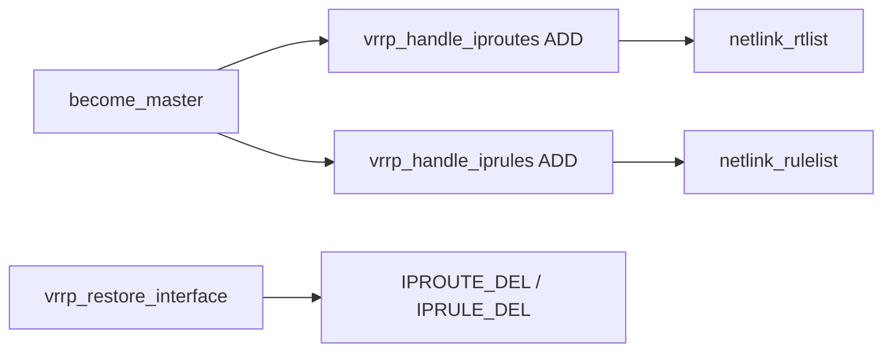

# 第14章 ルートとポリシールーティング

> 本章で読むソース
>
> - [`keepalived/vrrp/vrrp.c`](https://github.com/acassen/keepalived/blob/v2.4.1/keepalived/vrrp/vrrp.c)
> - [`keepalived/vrrp/vrrp_iproute.c`](https://github.com/acassen/keepalived/blob/v2.4.1/keepalived/vrrp/vrrp_iproute.c)
> - [`keepalived/vrrp/vrrp_iprule.c`](https://github.com/acassen/keepalived/blob/v2.4.1/keepalived/vrrp/vrrp_iprule.c)

## この章の狙い

VRRP instance に紐づく仮想ルートとポリシールールが、マスタ遷移時にどう載せられ、離脱時にどう外されるかを読む。

## 前提

[第13章](13-vrrp-ipaddress-if.md)の VIP 制御、[第7章](../part02-core/07-netlink-and-namespaces.md)の netlink を理解していること。

## 仮想ルート

`vrrp_handle_iproutes` は `vrrp->vroutes` リストを `netlink_rtlist` へ渡す。
マスタ化と復元の両方から呼ばれる。

[`keepalived/vrrp/vrrp.c` L149-L158](https://github.com/acassen/keepalived/blob/v2.4.1/keepalived/vrrp/vrrp.c#L149-L158)

```c
/* add/remove Virtual routes */
static void
vrrp_handle_iproutes(vrrp_t * vrrp, int cmd, bool force)
{
	if (__test_bit(LOG_DETAIL_BIT, &debug))
		log_message(LOG_INFO, "(%s) %sing Virtual Routes",
		       vrrp->iname,
		       (cmd == IPROUTE_ADD) ? "sett" : "remov");
	netlink_rtlist(&vrrp->vroutes, cmd, force);
}
```

マスタ化直後にルートを追加する。

[`keepalived/vrrp/vrrp.c` L1918-L1920](https://github.com/acassen/keepalived/blob/v2.4.1/keepalived/vrrp/vrrp.c#L1918-L1920)

```c
	if (!list_empty(&vrrp->vroutes))
		vrrp_handle_iproutes(vrrp, IPROUTE_ADD, false);
```

## 仮想ルール

ポリシールーティングルールは `vrrp_handle_iprules` が `netlink_rulelist` で処理する。
VIP と独立したリスト `vrrp->vrules` を持つ。

[`keepalived/vrrp/vrrp.c` L160-L169](https://github.com/acassen/keepalived/blob/v2.4.1/keepalived/vrrp/vrrp.c#L160-L169)

```c
/* add/remove Virtual rules */
static void
vrrp_handle_iprules(vrrp_t * vrrp, int cmd, bool force)
{
	if (__test_bit(LOG_DETAIL_BIT, &debug))
		log_message(LOG_INFO, "(%s) %sing Virtual Rules",
		       vrrp->iname,
		       (cmd == IPRULE_ADD) ? "sett" : "remov");
	netlink_rulelist(&vrrp->vrules, cmd, force);
}
```

## インタフェース復元時の削除

`vrrp_restore_interface` は VIP 削除に加え、ルートとルールも削除する。
`force` によりリロード中の残留エントリ処理を制御する。

[`keepalived/vrrp/vrrp.c` L1999-L2005](https://github.com/acassen/keepalived/blob/v2.4.1/keepalived/vrrp/vrrp.c#L1999-L2005)

```c
	/* remove virtual rules */
	if (!list_empty(&vrrp->vrules))
		vrrp_handle_iprules(vrrp, IPRULE_DEL, force);

	/* remove virtual routes */
	if (!list_empty(&vrrp->vroutes))
		vrrp_handle_iproutes(vrrp, IPROUTE_DEL, force);
```

## 起動時の static ルート

VRRP 子の `start_vrrp` はリロード時に static ルートを netlink で削除する。
ベース設定と instance 仮想ルートの衝突を避ける。

[`keepalived/vrrp/vrrp_daemon.c` L606-L610](https://github.com/acassen/keepalived/blob/v2.4.1/keepalived/vrrp/vrrp_daemon.c#L606-L610)

```c
			netlink_iplist(&vrrp_data->static_addresses, IPADDRESS_DEL, false);
			netlink_rtlist(&vrrp_data->static_routes, IPROUTE_DEL, false);
			netlink_error_ignore = ENOENT;
			netlink_rulelist(&vrrp_data->static_rules, IPRULE_DEL, true);
			netlink_error_ignore = 0;
```

## ルート監視フラグ

`vrrp.c` は IPv4/IPv6 のルートとルール監視フラグをグローバルに持つ。
netlink イベントで設定外の変更を検知する基盤になる（第8章）。

[`keepalived/vrrp/vrrp.c` L130-L135](https://github.com/acassen/keepalived/blob/v2.4.1/keepalived/vrrp/vrrp.c#L130-L135)

```c
	have_ipv4_instance = false;
	have_ipv6_instance = false;
	monitor_ipv4_routes = false;
	monitor_ipv6_routes = false;
	monitor_ipv4_rules = false;
	monitor_ipv6_rules = false;
```



## マスタ化でのルール追加

`vrrp_state_become_master` は VIP とルートの後に仮想ルールも追加する。

[`keepalived/vrrp/vrrp.c` L1922-L1924](https://github.com/acassen/keepalived/blob/v2.4.1/keepalived/vrrp/vrrp.c#L1922-L1924)

```c
	if (!list_empty(&vrrp->vrules))
		vrrp_handle_iprules(vrrp, IPRULE_ADD, false);
```

## 高速化・最適化の工夫

ルートとルールはリスト単位で netlink バッチ送信し、instance あたりの syscall 回数を抑える。
リロード時は `netlink_error_ignore = ENOENT` で既に無い static ルール削除の失敗を無視する。

## まとめ

仮想ルートとルールは VIP と同様にマスタ遷移で追加し、`vrrp_restore_interface` で一括削除する。
static ルートは `start_vrrp` のリロード経路で先に掃除され、instance 仮想ルートとの二重登録を防ぐ。
運用では VIP とセットでルートとルールの有無を確認すると、フェイルオーバー後の到達性切り分けが速い。
リロード直後は static ルート削除が先に走るため、instance 仮想ルートだけが残っていないかログを確認する。

## 関連する章

- [第13章 仮想 IP](13-vrrp-ipaddress-if.md)
- [第7章 netlink](../part02-core/07-netlink-and-namespaces.md)
- [第8章 リロード](../part02-core/08-reload-notify-track.md)

補足として、ルート削除は `vrrp_restore_interface` 内で VIP 削除と同じ `force` 引数を共有する。
そのためリロード中の残留ルートは `force=true` 経路で掃除される。
