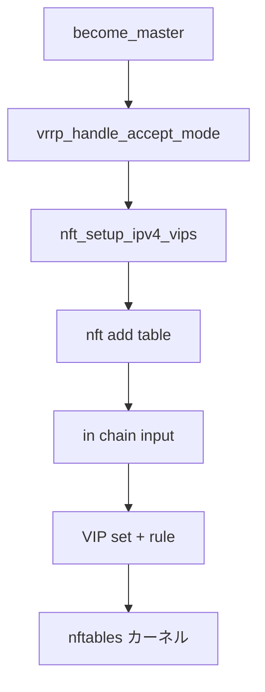

# 第15章 ファイアウォールと nftables

> 本章で読むソース
>
> - [`keepalived/vrrp/vrrp.c`](https://github.com/acassen/keepalived/blob/v2.4.1/keepalived/vrrp/vrrp.c)
> - [`keepalived/vrrp/vrrp_nftables.c`](https://github.com/acassen/keepalived/blob/v2.4.1/keepalived/vrrp/vrrp_nftables.c)
> - [`keepalived/vrrp/vrrp_firewall.c`](https://github.com/acassen/keepalived/blob/v2.4.1/keepalived/vrrp/vrrp_firewall.c)

## この章の狙い

非 address owner が VIP を載せたとき、accept モードでない instance が受信を拒否しないよう nftables ルールを張る仕組みを読む。

## 前提

[第13章](13-vrrp-ipaddress-if.md)の VIP 追加、Linux nftables の基礎を理解していること。

## accept モードと vrrp_handle_accept_mode

`vrrp.c` は address owner または `accept` 設定時はファイアウォール操作をスキップする。
それ以外は VIP 追加時に受信許可ルールを載せる。

[`keepalived/vrrp/vrrp.c` L171-L179](https://github.com/acassen/keepalived/blob/v2.4.1/keepalived/vrrp/vrrp.c#L171-L179)

```c
#ifdef _WITH_FIREWALL_
static void
vrrp_handle_accept_mode(vrrp_t *vrrp, int cmd, bool force)
{
	if (vrrp->base_priority == VRRP_PRIO_OWNER || vrrp->accept)
		return;

	if (__test_bit(LOG_DETAIL_BIT, &debug))
		log_message(LOG_INFO, "(%s) %s%s", vrrp->iname,
```

マスタ化の `vrrp_state_become_master` 冒頭でも呼ばれる。

[`keepalived/vrrp/vrrp.c` L1908-L1911](https://github.com/acassen/keepalived/blob/v2.4.1/keepalived/vrrp/vrrp.c#L1908-L1911)

```c
#ifdef _WITH_FIREWALL_
	vrrp_handle_accept_mode(vrrp, IPADDRESS_ADD, false);
#endif
```

## nftables テーブル構築

`vrrp_nftables.c` は `global_data->vrrp_nf_table_name` テーブルを netlink 経由で作成する。
IPv4 と IPv6 で別セットアップ関数を持つ。

[`keepalived/vrrp/vrrp_nftables.c` L757-L772](https://github.com/acassen/keepalived/blob/v2.4.1/keepalived/vrrp/vrrp_nftables.c#L757-L772)

```c
nft_setup_ipv4(struct mnl_nlmsg_batch *batch)
{
	struct nlmsghdr *nlh;
	struct nftnl_table *ta;
	struct nftnl_chain *t;

	if (!ipv6_table_setup)
		check_and_delete_tables(batch, global_data->vrrp_nf_table_name);

	/* nft add table ip keepalived */
	ta = table_add_parse(NFPROTO_IPV4, global_data->vrrp_nf_table_name);
	nlh = nftnl_table_nlmsg_build_hdr(mnl_nlmsg_batch_current(batch),
					NFT_MSG_NEWTABLE, NFPROTO_IPV4,
					NLM_F_CREATE|NLM_F_ACK, seq++);
	nftnl_table_nlmsg_build_payload(nlh, ta);
	nftnl_table_free(ta);
```

## input チェーンと VIP セット

`nft_setup_ipv4_vips` は input フックの filter チェーンと VIP 用 set を構築する。
コメントは対応する nft コマンドをそのまま示す。

[`keepalived/vrrp/vrrp_nftables.c` L795-L817](https://github.com/acassen/keepalived/blob/v2.4.1/keepalived/vrrp/vrrp_nftables.c#L795-L817)

```c
nft_setup_ipv4_vips(struct mnl_nlmsg_batch *batch)
{
	struct nlmsghdr *nlh;
	struct nftnl_chain *t;
	struct nftnl_set *s;
	struct nftnl_rule *r;

	if (!ipv4_table_setup)
		nft_setup_ipv4(batch);

	/* nft add chain ip keepalived in { type filter hook input priority -1; policy accept; } */
	t = chain_add_parse(global_data->vrrp_nf_table_name, "in");
	// ... (中略) ...
	nftnl_chain_set_u32(t, NFTNL_CHAIN_HOOKNUM, NF_INET_LOCAL_IN);	// input
	nftnl_chain_set_str(t, NFTNL_CHAIN_TYPE, "filter");
	nftnl_chain_set_s32(t, NFTNL_CHAIN_PRIO, global_data->vrrp_nf_chain_priority);
	nftnl_chain_set_u32(t, NFTNL_CHAIN_POLICY, NF_ACCEPT);
```

## IPv6 側

IPv6 も同型のテーブルと VIP セットを構築する。
IPv4 未セットアップ時は古いテーブルを削除してから作り直す。

[`keepalived/vrrp/vrrp_nftables.c` L858-L873](https://github.com/acassen/keepalived/blob/v2.4.1/keepalived/vrrp/vrrp_nftables.c#L858-L873)

```c
nft_setup_ipv6(struct mnl_nlmsg_batch *batch)
{
	struct nlmsghdr *nlh;
	struct nftnl_table *ta;
	struct nftnl_chain *t;
	const char *table = global_data->vrrp_nf_table_name;

	if (!ipv4_table_setup)
		check_and_delete_tables(batch, global_data->vrrp_nf_table_name);

	/* nft add table ip6 keepalived */
	ta = table_add_parse(NFPROTO_IPV6, table);
	nlh = nftnl_table_nlmsg_build_hdr(mnl_nlmsg_batch_current(batch),
					NFT_MSG_NEWTABLE, NFPROTO_IPV6,
					NLM_F_CREATE|NLM_F_ACK, seq++);
```

## netlink バッチ

nftables 更新は `mnl_nlmsg_batch` にメッセージを積み、まとめてカーネルへ送る。
テーブル、チェーン、セット、ルールを1バッチで反映する。



## VIP セットへの反映

マスタ化後、各 VIP は nftables の set 要素として追加される。

[`keepalived/vrrp/vrrp_nftables.c` L1239-L1242](https://github.com/acassen/keepalived/blob/v2.4.1/keepalived/vrrp/vrrp_nftables.c#L1239-L1242)

```c
nft_add_addresses(vrrp_t *vrrp)
{
	nft_update_addresses(vrrp, NFT_MSG_NEWSETELEM);
}
```

マスタ離脱時は `nft_remove_addresses` が set 要素を削除する。

[`keepalived/vrrp/vrrp_nftables.c` L1244-L1247](https://github.com/acassen/keepalived/blob/v2.4.1/keepalived/vrrp/vrrp_nftables.c#L1244-L1247)

```c
void
nft_remove_addresses(vrrp_t *vrrp)
{
	if (!nl) return;	// Should delete tables
```

## 高速化・最適化の工夫

`ipv4_table_setup` と `ipv6_table_setup` フラグでテーブル再作成を避け、同一プロセス内の複数 VIP 更新を1セットアップにまとめる。
netlink バッチ送信により nft ルール追加の往復回数を削減する。

## まとめ

ファイアウォール層は accept モード非対応の backup がマスタ化したとき、nftables で VIP 宛トラフィックを明示的に許可する。

## 関連する章

- [第13章 仮想 IP](13-vrrp-ipaddress-if.md)
- [第16章 同期グループ](16-vrrp-sync-track.md)
