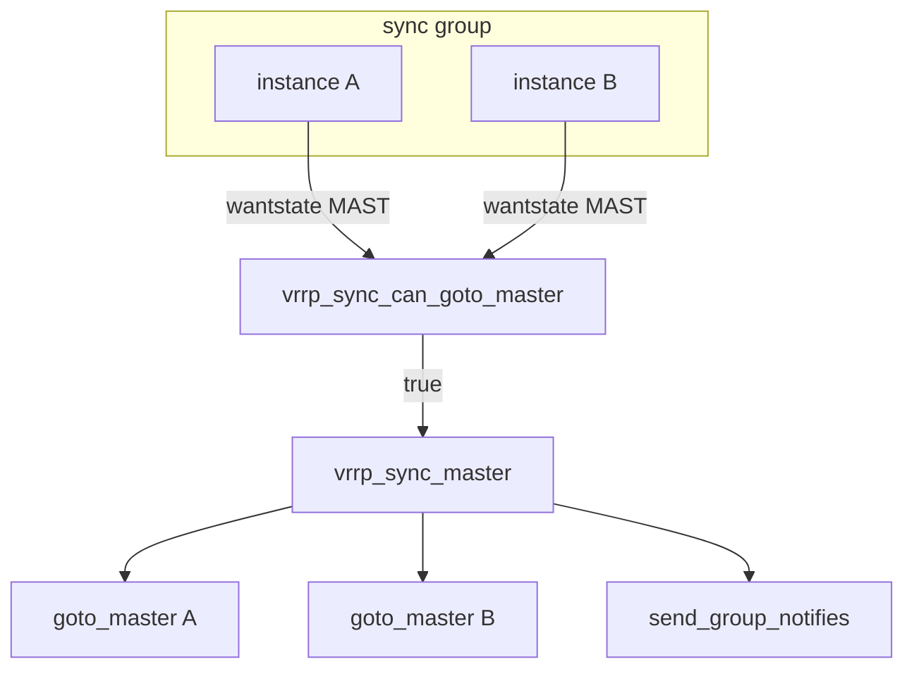

# 第16章 同期グループとトラッキング

> 本章で読むソース
>
> - [`keepalived/vrrp/vrrp_sync.c`](https://github.com/acassen/keepalived/blob/v2.4.1/keepalived/vrrp/vrrp_sync.c)
> - [`keepalived/vrrp/vrrp.c`](https://github.com/acassen/keepalived/blob/v2.4.1/keepalived/vrrp/vrrp.c)
> - [`keepalived/vrrp/vrrp_track.c`](https://github.com/acassen/keepalived/blob/v2.4.1/keepalived/vrrp/vrrp_track.c)

## この章の狙い

複数 VRRP instance を1つのマスタ状態に揃える sync group と、track script による `wantstate` 更新を読む。

## 前提

[第11章](../part03-vrrp-base/11-vrrp-state-machine.md)の `wantstate`、[第12章](../part03-vrrp-base/12-vrrp-parser-data.md)の `vrrp_sync_group` リストを理解していること。

## sync group の検証

`vrrp_sync_group_valid` はメンバー数が2以上あることを推奨し、1件だけのグループは設定エラーとして報告する。

[`keepalived/vrrp/vrrp_sync.c` L104-L110](https://github.com/acassen/keepalived/blob/v2.4.1/keepalived/vrrp/vrrp_sync.c#L104-L110)

```c
	/* For most users a sync group with only one member is a configuration error */
	if (sgroup->vrrp_instances.prev == sgroup->vrrp_instances.next)
		report_config_error(CONFIG_GENERAL_ERROR, "Sync group %s has only 1 virtual router(s) -"
							  " this probably isn't what you want"
							, sgroup->gname);

	return true;
```

## マスタ遷移の合意

`vrrp_sync_can_goto_master` はグループ内の全 instance が `wantstate == MAST` のときだけ真を返す。
1件でも backup を望むメンバーがいればダウンタイマを再設定して待つ。

[`keepalived/vrrp/vrrp_sync.c` L114-L137](https://github.com/acassen/keepalived/blob/v2.4.1/keepalived/vrrp/vrrp_sync.c#L114-L137)

```c
bool
vrrp_sync_can_goto_master(vrrp_t *vrrp)
{
	vrrp_sgroup_t *sgroup = vrrp->sync;
	vrrp_t *isync;

	if (GROUP_STATE(sgroup) == VRRP_STATE_MAST)
		return true;

	/* Only sync to master if everyone wants to
	 * i.e. prefer backup state to avoid thrashing */
	list_for_each_entry(isync, &sgroup->vrrp_instances, s_list) {
		if (isync != vrrp && isync->wantstate != VRRP_STATE_MAST) {
			vrrp->ms_down_timer = VRRP_MS_DOWN_TIMER(vrrp);
			vrrp_init_instance_sands(vrrp);
			return false;
		}
	}

	return true;
}
```

## グループ一括マスタ化

`vrrp_sync_master` は合意後、メンバー全員へ `vrrp_state_goto_master` を呼ぶ。
グループ状態を `VRRP_STATE_MAST` に上げ、notify を送る。

[`keepalived/vrrp/vrrp_sync.c` L173-L208](https://github.com/acassen/keepalived/blob/v2.4.1/keepalived/vrrp/vrrp_sync.c#L173-L208)

```c
void
vrrp_sync_master(vrrp_t *vrrp)
{
	vrrp_sgroup_t *sgroup = vrrp->sync;
	vrrp_t *isync;

	if (GROUP_STATE(sgroup) == VRRP_STATE_MAST)
		return;
	if (!vrrp_sync_can_goto_master(vrrp))
		return;

	log_message(LOG_INFO, "VRRP_Group(%s) Syncing instances to MASTER state"
			    , GROUP_NAME(sgroup));
	// ... (中略) ...
				vrrp_state_goto_master(isync);
				vrrp_thread_requeue_read(isync);
	sgroup->state = VRRP_STATE_MAST;
	send_group_notifies(sgroup);
}
```

## vrrp.c との接続

単体 instance の `vrrp_state_goto_master` も sync チェックを最初に行う。
合意が取れない間は `wantstate` だけを MAST に据える。

[`keepalived/vrrp/vrrp.c` L1955-L1962](https://github.com/acassen/keepalived/blob/v2.4.1/keepalived/vrrp/vrrp.c#L1955-L1962)

```c
void
vrrp_state_goto_master(vrrp_t * vrrp)
{
	if (vrrp->sync && !vrrp_sync_can_goto_master(vrrp))
	{
		vrrp->wantstate = VRRP_STATE_MAST;
		return;
	}
```

## backup への一括遷移

グループが backup に落ちる処理も `vrrp_sync.c` にあり、notify をまとめて送る。

[`keepalived/vrrp/vrrp_sync.c` L168-L170](https://github.com/acassen/keepalived/blob/v2.4.1/keepalived/vrrp/vrrp_sync.c#L168-L170)

```c
	sgroup->state = VRRP_STATE_BACK;
	send_group_notifies(sgroup);
```



## backup への一括同期

`vrrp_sync_backup` はグループを backup 状態へ落とし、各 instance の `vrrp_state_leave_master` を呼ぶ。

[`keepalived/vrrp/vrrp_sync.c` L140-L167](https://github.com/acassen/keepalived/blob/v2.4.1/keepalived/vrrp/vrrp_sync.c#L140-L167)

```c
void
vrrp_sync_backup(vrrp_t *vrrp)
{
	vrrp_sgroup_t *sgroup = vrrp->sync;
	vrrp_t *isync;

	if (GROUP_STATE(sgroup) == VRRP_STATE_BACK)
		return;

	log_message(LOG_INFO, "VRRP_Group(%s) Syncing instances to BACKUP state"
			    , GROUP_NAME(sgroup));

	list_for_each_entry(isync, &sgroup->vrrp_instances, s_list) {
		if (isync->state == VRRP_STATE_MAST)
			vrrp_state_leave_master(isync, false, VRRP_STATE_BACK);
	}
```

## 高速化・最適化の工夫

sync group は全員の `wantstate` が揃うまでマスタ化を遅延し、VIP とルートの付け外しのフラッピングを防ぐ。
1つのトリガ instance から `vrrp_sync_master` が全メンバーへ `vrrp_state_goto_master` を連鎖させ、netlink 操作を短時間に集中させる。

## まとめ

同期グループはマスタ遷移の合意制であり、`vrrp_sync_can_goto_master` と `vrrp_sync_master` がグループ単位の状態を揃える。

## 関連する章

- [第11章 状態遷移](../part03-vrrp-base/11-vrrp-state-machine.md)
- [第20章 チェック連携](../part05-check/20-check-misc.md)
