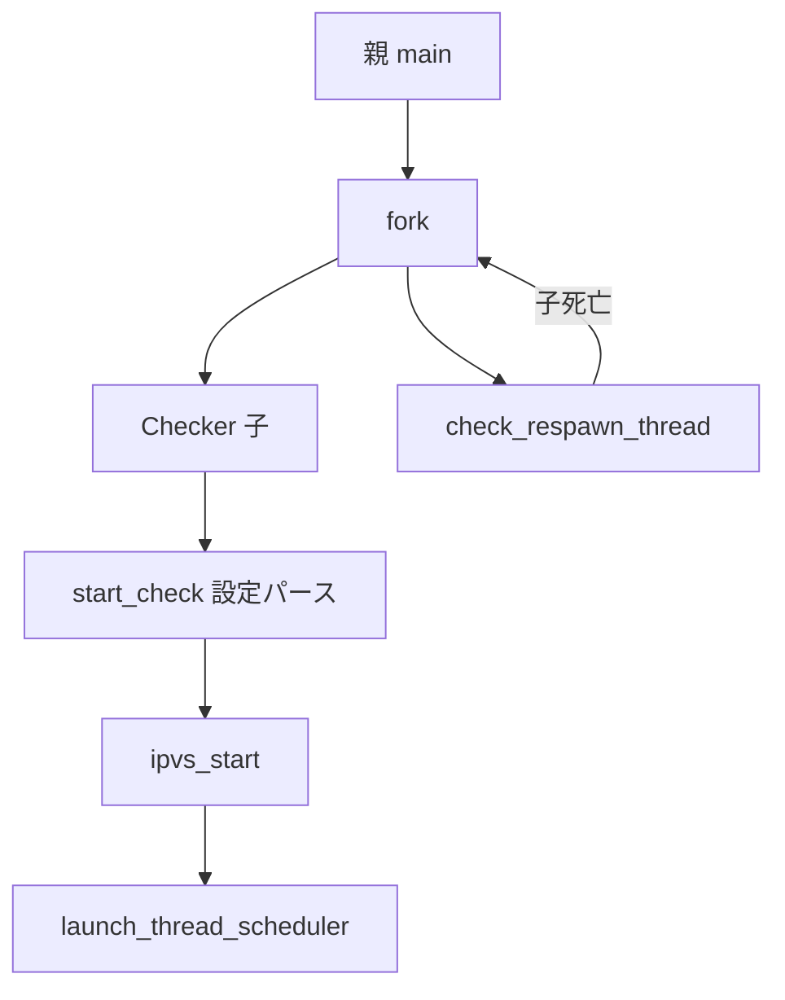

# 第17章 check デーモン

> 本章で読むソース
>
> - [`keepalived/check/check_daemon.c`](https://github.com/acassen/keepalived/blob/v2.4.1/keepalived/check/check_daemon.c)
> - [`keepalived/check/check_parser.c`](https://github.com/acassen/keepalived/blob/v2.4.1/keepalived/check/check_parser.c)

## この章の狙い

LVS 向けヘルスチェックを担う Checker 子プロセスの fork、初期化、再起動を追う。

## 前提

[第2章](../part00-overview/02-startup-and-process-model.md)の多プロセス構成、[第3章](../part01-foundation/03-scheduler.md)のスケジューラを理解していること。

## 子プロセスの役割

`check_daemon.c` 先頭コメントは、Checker が LVS のサーバプールを多層チェックで監視することを示す。

[`keepalived/check/check_daemon.c` L1-L7](https://github.com/acassen/keepalived/blob/v2.4.1/keepalived/check/check_daemon.c#L1-L7)

```c
/*
 * Soft:        Keepalived is a failover program for the LVS project
 *              <www.linuxvirtualserver.org>. It monitor & manipulate
 *              a loadbalanced server pool using multi-layer checks.
 *
 * Part:        Healthcheckrs child process handling.
```

## start_check_child

親プロセスは `fork` 後に子 PID を記録し、`check_respawn_thread` で死活を監視する。

[`keepalived/check/check_daemon.c` L670-L700](https://github.com/acassen/keepalived/blob/v2.4.1/keepalived/check/check_daemon.c#L670-L700)

```c
int
start_check_child(void)
{
#ifndef _ONE_PROCESS_DEBUG_
	pid_t pid;
	const char *syslog_ident;

	pid = fork();

	if (pid < 0) {
		log_message(LOG_INFO, "Healthcheck child process: fork error(%s)"
			       , strerror(errno));
		return -1;
	} else if (pid) {
		checkers_child = pid;
		check_start_time = time_now;

		log_message(LOG_INFO, "Starting Healthcheck child process, pid=%d"
			       , pid);

		thread_add_child(master, check_respawn_thread, NULL,
				 pid, TIMER_NEVER);

		return 0;
	}
```

子側では `PR_SET_PDEATHSIG` で親死亡時に SIGTERM を受け取り、BFD 用 pipe の不要端を閉じる。

[`keepalived/check/check_daemon.c` L710-L734](https://github.com/acassen/keepalived/blob/v2.4.1/keepalived/check/check_daemon.c#L710-L734)

```c
	prctl(PR_SET_PDEATHSIG, SIGTERM);

	if (main_pid != getppid())
		kill(our_pid, SIGTERM);

	prog_type = PROG_TYPE_CHECKER;
	// ... (中略) ...
#ifdef _WITH_BFD_
	close(bfd_checker_event_pipe[1]);

#ifdef _WITH_VRRP_
	close(bfd_vrrp_event_pipe[0]);
	close(bfd_vrrp_event_pipe[1]);
#endif
#endif
```

## 子のメインループ

子は親から継承した `master` を破棄し、専用スケジューラを作って `start_check` を呼ぶ。
最後に `launch_thread_scheduler` で I/O 多重化ループへ入る。

[`keepalived/check/check_daemon.c` L788-L822](https://github.com/acassen/keepalived/blob/v2.4.1/keepalived/check/check_daemon.c#L788-L822)

```c
	thread_destroy_master(master);
	master = thread_make_master();
#endif

	UNSET_RELOAD;

	check_signal_init();
	register_shutdown_function(stop_check);

	start_check(NULL);
	// ... (中略) ...
	launch_thread_scheduler(master);
```

## start_check

設定パース後、`link_vsg_to_vs` で仮想サーバとグループを結び、`ipvs_start` でカーネル IPVS を初期化する。

[`keepalived/check/check_daemon.c` L316-L365](https://github.com/acassen/keepalived/blob/v2.4.1/keepalived/check/check_daemon.c#L316-L365)

```c
start_check(data_t *prev_global_data)
{
	if (reload)
		global_data = alloc_global_data();
	check_data = alloc_check_data();
	// ... (中略) ...
	init_data(conf_file, check_init_keywords, false);
	// ... (中略) ...
	link_vsg_to_vs();

	if (!validate_check_config()
#ifndef _ONE_PROCESS_DEBUG_
	    || (global_data->reload_check_config && get_config_status() != CONFIG_OK)
#endif
				    ) {
		stop_check(KEEPALIVED_EXIT_CONFIG);
		return;
	}

	if ((!list_empty(&check_data->vs) || (reload && !list_empty(&old_check_data->vs))) &&
	    ipvs_start() != IPVS_SUCCESS) {
		stop_check(KEEPALIVED_EXIT_FATAL);
		return;
```

## 子の再起動

`check_respawn_thread` は SIGCHLD 受信後、終了理由を報告し、遅延を挟んで `start_check_child` を再実行する。

[`keepalived/check/check_daemon.c` L598-L613](https://github.com/acassen/keepalived/blob/v2.4.1/keepalived/check/check_daemon.c#L598-L613)

```c
check_respawn_thread(thread_ref_t thread)
{
	unsigned restart_delay;
	int ret;

	checkers_child = 0;

	if ((ret = report_child_status(thread->u.c.status, thread->u.c.pid, NULL)))
		thread_add_parent_terminate_event(thread->master, ret);
	else if (!__test_bit(DONT_RESPAWN_BIT, &debug)) {
		log_child_died("Healthcheck", thread->u.c.pid);

		restart_delay = calc_restart_delay(&check_start_time, &check_next_restart_delay, "Healthcheck");
		if (!restart_delay)
			start_check_child();
```



## 高速化・最適化の工夫

Checker を独立プロセスに分離し、HTTP や SSL など重いプローブが VRRP の広告タイマを遅らせない。
子は親のメモリと fd を整理してからスケジューラを再構築し、継承した不要リソースを排除する。

## まとめ

Checker 子は `start_check_child` で起動し、`start_check` が IPVS と各種チェックを登録する。

## 関連する章

- [第18章 TCP/HTTP/UDP](18-check-tcp-http-udp.md)
- [第19章 IPVS](19-ipvs-wrapper.md)
