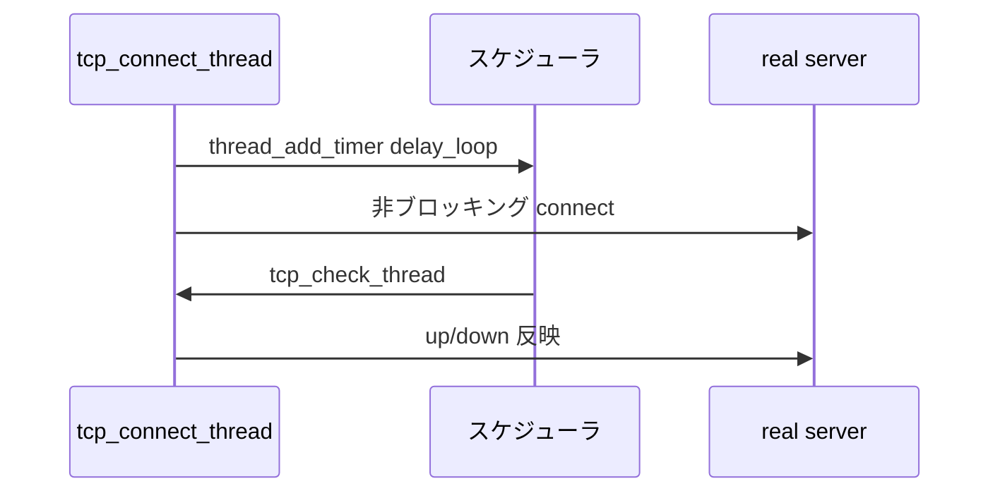

# 第18章 TCP、HTTP、UDP チェック

> 本章で読むソース
>
> - [`keepalived/check/check_tcp.c`](https://github.com/acassen/keepalived/blob/v2.4.1/keepalived/check/check_tcp.c)
> - [`keepalived/check/check_http.c`](https://github.com/acassen/keepalived/blob/v2.4.1/keepalived/check/check_http.c)
> - [`keepalived/check/check_udp.c`](https://github.com/acassen/keepalived/blob/v2.4.1/keepalived/check/check_udp.c)

## この章の狙い

L4/L7 ヘルスチェックが非ブロッキング I/O とスケジューラ上のコールバックでどう実装されているかを読む。

## 前提

[第17章](17-check-daemon.md)の Checker 子、[第3章](../part01-foundation/03-scheduler.md)の `thread_add_read` を理解していること。

## 共通パターン

各チェックは `checker->enabled` が偽のとき `delay_loop` タイマだけ再登録する。
有効時はソケットを開き、接続完了を read/write コールバックへ委譲する。

## TCP チェック

`tcp_connect_thread` は `SOCK_NONBLOCK` の TCP ソケットを作り、`tcp_connection_state` で接続状態を判定する。

[`keepalived/check/check_tcp.c` L184-L214](https://github.com/acassen/keepalived/blob/v2.4.1/keepalived/check/check_tcp.c#L184-L214)

```c
static void
tcp_connect_thread(thread_ref_t thread)
{
	checker_t *checker = THREAD_ARG(thread);
	conn_opts_t *co = checker->co;
	int fd;
	int status;

	if (!checker->enabled) {
		thread_add_timer(thread->master, tcp_connect_thread, checker,
				 checker->delay_loop);
		return;
	}

	if ((fd = socket(co->dst.ss_family, SOCK_STREAM | SOCK_CLOEXEC | SOCK_NONBLOCK, IPPROTO_TCP)) == -1) {
		// ... (中略) ...
	}

	status = tcp_bind_connect(fd, co);

	if(tcp_connection_state(fd, status, thread, tcp_check_thread,
			co->connection_to, 0)) {
```

接続失敗時は `tcp_epilog` で real server の up/down を更新し、次周期をスケジュールする。

[`keepalived/check/check_tcp.c` L175-L180](https://github.com/acassen/keepalived/blob/v2.4.1/keepalived/check/check_tcp.c#L175-L180)

```c
	default:
		if (checker->is_up &&
		    (global_data->checker_log_all_failures || checker->log_all_failures))
			log_message(LOG_INFO, "TCP connection to %s failed."
					, FMT_CHK(checker));
		tcp_epilog(thread, false);
```

## UDP チェック

UDP は `SOCK_DGRAM` で同型の connect パターンを踏む。
プロトコル固有の応答検証は `udp_check_t` に保持する。

[`keepalived/check/check_udp.c` L321-L341](https://github.com/acassen/keepalived/blob/v2.4.1/keepalived/check/check_udp.c#L321-L341)

```c
udp_connect_thread(thread_ref_t thread)
{
	checker_t *checker = THREAD_ARG(thread);
	udp_check_t *udp_check = CHECKER_ARG(checker);
	conn_opts_t *co = checker->co;
	int fd;
	int status;

	if (!checker->enabled) {
		thread_add_timer(thread->master, udp_connect_thread, checker,
				 checker->delay_loop);
		return;
	}

	if ((fd = socket(co->dst.ss_family, SOCK_DGRAM | SOCK_CLOEXEC | SOCK_NONBLOCK, IPPROTO_UDP)) == -1) {
		log_message(LOG_INFO, "UDP connect fail to create socket. Rescheduling.");
```

ファイル先頭は UDP checker 専用モジュールであることを示す。

[`keepalived/check/check_udp.c` L1-L7](https://github.com/acassen/keepalived/blob/v2.4.1/keepalived/check/check_udp.c#L1-L7)

```c
/*
 * Soft:        Keepalived is a failover program for the LVS project
 *              <www.linuxvirtualserver.org>. It monitor & manipulate
 *              a loadbalanced server pool using multi-layer checks.
 *
 * Part:        UDP checker.
```

## HTTP チェック

`http_read_thread` は応答ボディを読み切る。
`EAGAIN` 時は同じ fd で `thread_add_read` を再登録し、他チェックと並行して待つ。

[`keepalived/check/check_http.c` L1546-L1553](https://github.com/acassen/keepalived/blob/v2.4.1/keepalived/check/check_http.c#L1546-L1553)

```c
	if (r == -1 && (check_EAGAIN(errno) || check_EINTR(errno))) {
		log_message(LOG_INFO, "Read error with server %s: %s"
				    , FMT_CHK(checker)
				    , strerror(errno));
		thread_add_read(thread->master, http_read_thread, checker,
				thread->u.f.fd, timeout, THREAD_DESTROY_CLOSE_FD);
		return;
	}
```

digest モードでは OpenSSL の `EVP_DigestFinal_ex` で MD5 を確定し、永続セッション用ハッシュと比較する。

[`keepalived/check/check_http.c` L115-L120](https://github.com/acassen/keepalived/blob/v2.4.1/keepalived/check/check_http.c#L115-L120)

```c
bool do_regex_timers;
// ... (中略) ...
bool do_regex_debug;
```



## 高速化・最適化の工夫

接続プールは使わず、チェックごとに fd を開いて `THREAD_DESTROY_CLOSE_FD` で閉じる。
待ち時間は epoll 統合スケジューラ上で他 instance のチェックと重ね、ブロッキングを避ける。

## まとめ

TCP/UDP/HTTP はファイル分割されているが、タイマ再登録と非ブロッキング I/O の骨格は共通である。

## 関連する章

- [第17章 check デーモン](17-check-daemon.md)
- [第19章 IPVS](19-ipvs-wrapper.md)
