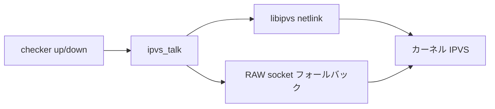

# 第19章 IPVS ラッパー

> 本章で読むソース
>
> - [`keepalived/check/ipvswrapper.c`](https://github.com/acassen/keepalived/blob/v2.4.1/keepalived/check/ipvswrapper.c)
> - [`keepalived/check/libipvs.c`](https://github.com/acassen/keepalived/blob/v2.4.1/keepalived/check/libipvs.c)

## この章の狙い

チェック結果が IPVS の仮想サービスと real server の重みへどう反映されるかを追う。

## 前提

`ipvsadm` とカーネル IPVS の概念、[第17章](17-check-daemon.md)の `ipvs_start` を理解していること。

## ipvs_talk

`ipvswrapper.c` の `ipvs_talk` はコマンド種別に応じて `ipvs_add_service` や `ipvs_add_dest` を呼ぶ。
`no_ipvs` が真のときは何もしない。

[`keepalived/check/ipvswrapper.c` L167-L205](https://github.com/acassen/keepalived/blob/v2.4.1/keepalived/check/ipvswrapper.c#L167-L205)

```c
/* Send user rules to IPVS module */
static int
ipvs_talk(int cmd, ipvs_service_t *srule, ipvs_dest_t *drule, ipvs_daemon_t *daemonrule, bool ignore_error)
{
	int result = -1;

	if (no_ipvs)
		return result;

	switch (cmd) {
		case IP_VS_SO_SET_STARTDAEMON:
			result = ipvs_start_daemon(daemonrule);
			break;
		// ... (中略) ...
		case IP_VS_SO_SET_ADDDEST:
			result = ipvs_add_dest(srule, drule);
			break;
		case IP_VS_SO_SET_DELDEST:
			result = ipvs_del_dest(srule, drule);
			break;
		case IP_VS_SO_SET_EDITDEST:
			if ((result = ipvs_update_dest(srule, drule)) &&
			    (errno == ENOENT)) {
				cmd = IP_VS_SO_SET_ADDDEST;
```

`EDITDEST` が ENOENT のときは ADD へフォールバックし、存在しない dest への更新を吸収する。

## libipvs 初期化

`ipvs_init` は netlink 版 IPVS が使えるとき `ipvs_getinfo` を試す。
失敗時は `IPPROTO_RAW` ソケットへ落とし、IPv6 非対応をログに残す。

[`keepalived/check/libipvs.c` L454-L487](https://github.com/acassen/keepalived/blob/v2.4.1/keepalived/check/libipvs.c#L454-L487)

```c
int ipvs_init(
				      bool retry)
{
	ipvs_func = ipvs_init;

#ifdef LIBIPVS_USE_NL
	if (try_nl)
		return ipvs_getinfo(retry);

	try_nl = false;
#else
	log_message(LOG_INFO, "Note: IPVS with IPv6 will not be supported");
#endif

	sockfd = socket_netns_name(global_data->network_namespace_ipvs, AF_INET, SOCK_RAW | SOCK_CLOEXEC, IPPROTO_RAW);
	if (sockfd == -1)
		return -1;

	if (ipvs_getinfo(false)) {
		close(sockfd);
		sockfd = -1;
		return -1;
	}

	return 0;
}
```

## flush 操作

netlink 経路では `IPVS_CMD_FLUSH` メッセージを送り、全ルールを一括削除できる。

[`keepalived/check/libipvs.c` L490-L496](https://github.com/acassen/keepalived/blob/v2.4.1/keepalived/check/libipvs.c#L490-L496)

```c
int ipvs_flush(void)
{
#ifdef LIBIPVS_USE_NL
	if (try_nl) {
		struct nl_msg *msg = ipvs_nl_message(IPVS_CMD_FLUSH, 0);
		if (msg && (ipvs_nl_send_message(msg, ipvs_nl_noop_cb, NULL) == 0))
			return 0;
```

## 宛先の文字列表現

ログ用に real server のアドレスとポートを1バッファへ整形する。

[`keepalived/check/ipvswrapper.c` L160-L164](https://github.com/acassen/keepalived/blob/v2.4.1/keepalived/check/ipvswrapper.c#L160-L164)

```c
	inet_ntop(drule->af, drule->af == AF_INET ? (const void *)&drule->nf_addr.ip : (const void *)&drule->nf_addr.in6, bufp, INET6_ADDRSTRLEN);
	bufp += strlen(bufp);
	bufp += sprintf(bufp, ":%d", ntohs(drule->user.port));

	return (bufp - buf);
```



## デーモン起動コマンド

`IP_VS_SO_SET_STARTDAEMON` は IPVS カーネルデーモン（master/backup）の起動にも使われる。

[`keepalived/check/ipvswrapper.c` L177-L181](https://github.com/acassen/keepalived/blob/v2.4.1/keepalived/check/ipvswrapper.c#L177-L181)

```c
		case IP_VS_SO_SET_STARTDAEMON:
			result = ipvs_start_daemon(daemonrule);
			break;
		case IP_VS_SO_SET_STOPDAEMON:
			result = ipvs_stop_daemon(daemonrule);
			break;
```

## 名前空間対応

`ipvs_init` の RAW ソケットは `network_namespace_ipvs` を指定して開く。
netlink 経路でも同様に名前空間を意識する。

[`keepalived/check/libipvs.c` L477-L478](https://github.com/acassen/keepalived/blob/v2.4.1/keepalived/check/libipvs.c#L477-L478)

```c
	sockfd = socket_netns_name(global_data->network_namespace_ipvs, AF_INET, SOCK_RAW | SOCK_CLOEXEC, IPPROTO_RAW);
	if (sockfd == -1)
```

## 高速化・最適化の工夫

checker 層は real server の状態が変わったときだけ `ipvs_talk` を呼び、同一状態への重複 netlink 更新を避ける。
netlink が使える環境では IPv6 を含む操作を1 API に統一し、ソケット ioctl 往復を減らす。

## まとめ

LVS 連携は `ipvswrapper` がコマンドを束ね、`libipvs` が netlink とレガシーソケットの差を吸収する。

## 関連する章

- [第17章 check デーモン](17-check-daemon.md)
- [第18章 TCP/HTTP/UDP](18-check-tcp-http-udp.md)
