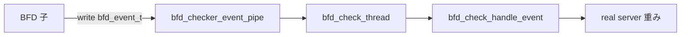

# 第20章 その他チェックと BFD 連携

> 本章で読むソース
>
> - [`keepalived/check/check_misc.c`](https://github.com/acassen/keepalived/blob/v2.4.1/keepalived/check/check_misc.c)
> - [`keepalived/check/check_bfd.c`](https://github.com/acassen/keepalived/blob/v2.4.1/keepalived/check/check_bfd.c)
> - [`keepalived/check/check_file.c`](https://github.com/acassen/keepalived/blob/v2.4.1/keepalived/check/check_file.c)

## この章の狙い

スクリプト、ファイル、BFD ベースのチェックが Checker 子のイベントループにどう載るかを読む。

## 前提

[第5章](../part01-foundation/05-memory-signals-process.md)の `process.c`、[第22章](../part06-bfd/22-bfd-integration.md)の BFD パイプを理解していること。

## misc チェック

`misc_check_thread` は外部スクリプトを `system_call_script` で子プロセス実行する。
親はすぐ戻り、終了コードは `misc_check_child_thread` が回収する。

[`keepalived/check/check_misc.c` L266-L288](https://github.com/acassen/keepalived/blob/v2.4.1/keepalived/check/check_misc.c#L266-L288)

```c
static void
misc_check_thread(thread_ref_t thread)
{
	checker_t *checker = THREAD_ARG(thread);
	misc_checker_t *misck_checker;
	int ret;

	misck_checker = CHECKER_ARG(checker);

	if (!checker->enabled) {
		thread_add_timer(thread->master, misc_check_thread, checker,
				 checker->delay_loop);
		return;
	}

	ret = system_call_script(thread->master, misc_check_child_thread,
				  checker, (misck_checker->timeout) ? misck_checker->timeout : checker->vs->delay_loop,
				  &misck_checker->script);
```

無効時は TCP/HTTP と同様、`delay_loop` タイマだけ再登録する。

## file チェック

`check_file.c` は `track_file` モジュールと連携し、ファイル内容の変化を inotify 経由で監視する。
スレッドアドレス登録は `register_track_file_inotify_addresses` へ委譲する。

[`keepalived/check/check_file.c` L230-L233](https://github.com/acassen/keepalived/blob/v2.4.1/keepalived/check/check_file.c#L230-L233)

```c
register_check_file_addresses(void)
{
	register_track_file_inotify_addresses();
}
```

## BFD チェック

Checker 子は `bfd_checker_event_pipe` の read fd を `thread_add_read` で待つ。
パイプから `bfd_event_t` を読み、`bfd_check_handle_event` へ渡す。

[`keepalived/check/check_bfd.c` L315-L332](https://github.com/acassen/keepalived/blob/v2.4.1/keepalived/check/check_bfd.c#L315-L332)

```c
static void
bfd_check_thread(thread_ref_t thread)
{
	bfd_event_t evt;

	if (thread->type == THREAD_READ_ERROR) {
		thread_close_fd(thread);
		return;
	}

	bfd_thread = thread_add_read(master, bfd_check_thread, NULL,
				     thread->u.f.fd, TIMER_NEVER, 0);

	while (read(thread->u.f.fd, &evt, sizeof(bfd_event_t)) != -1)
		bfd_check_handle_event(&evt);
}
```

BFD 子は状態変化時に pipe へ書き込む。
VRRP と Checker の両方が動いていれば、それぞれの write 端へ送る。

[`keepalived/bfd/bfd_event.c` L38-L84](https://github.com/acassen/keepalived/blob/v2.4.1/keepalived/bfd/bfd_event.c#L38-L84)

```c
void
bfd_event_send(bfd_t *bfd)
{
	bfd_event_t evt;
	// ... (中略) ...
	strcpy(evt.iname, bfd->iname);
	evt.state = bfd->local_state == BFD_STATE_UP ? BFD_STATE_UP : BFD_STATE_DOWN;
	evt.sent_time = timer_now();

#ifdef _WITH_VRRP_
	if (vrrp_running && bfd->vrrp) {
		ret = write(bfd_vrrp_event_pipe[1], &evt, sizeof evt);
```

## Checker 子での pipe 整理

fork 直後、Checker 子は BFD pipe の write 端と VRRP 用 pipe を閉じ、read 端だけを残す。

[`keepalived/check/check_daemon.c` L727-L734](https://github.com/acassen/keepalived/blob/v2.4.1/keepalived/check/check_daemon.c#L727-L734)

```c
#ifdef _WITH_BFD_
	close(bfd_checker_event_pipe[1]);

#ifdef _WITH_VRRP_
	close(bfd_vrrp_event_pipe[0]);
	close(bfd_vrrp_event_pipe[1]);
#endif
#endif
```



## misc チェックの子プロセス回収

`misc_check_child_thread` は子の終了を待ち、終了コードとシグナルを解釈して up/down を更新する。

[`keepalived/check/check_misc.c` L296-L314](https://github.com/acassen/keepalived/blob/v2.4.1/keepalived/check/check_misc.c#L296-L314)

```c
static void
misc_check_child_thread(thread_ref_t thread)
{
	int wait_status;
	pid_t pid;
	checker_t *checker;
	misc_checker_t *misck_checker;
	timeval_t next_time;
	int sig_num;
	unsigned timeout = 0;
	const char *script_exit_type = NULL;
	bool script_success = false;
	const char *reason = NULL;
	int reason_code = 0;
	bool rs_was_alive;
	bool message_only = false;

	checker = THREAD_ARG(thread);
	misck_checker = CHECKER_ARG(checker);
```

## 高速化・最適化の工夫

スクリプト実行は子プロセスに閉じ込め、親の epoll ループは `thread_add_child` で終了を非同期回収する。
BFD 通知はバイナリ構造体の pipe 書き込み1回で済ませ、HTTP プローブより低遅延で down を伝える。

## まとめ

misc/file/bfd は設定の柔軟性を補い、BFD 連携は Checker でも real server の可用性判断に使われる。

## 関連する章

- [第22章 BFD 連携](../part06-bfd/22-bfd-integration.md)
- [第24章 トラッカー](../part07-ops/24-reload-genhash-trackers.md)
