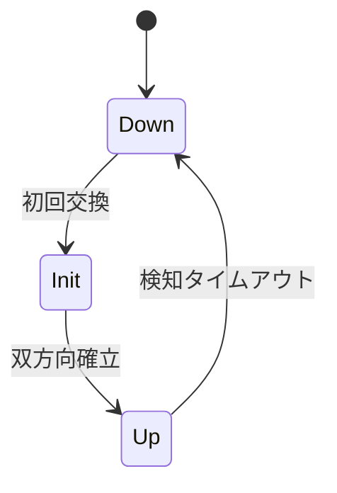

# 第21章 BFD プロトコル実装

> 本章で読むソース
>
> - [`keepalived/bfd/bfd.c`](https://github.com/acassen/keepalived/blob/v2.4.1/keepalived/bfd/bfd.c)
> - [`keepalived/bfd/bfd_scheduler.c`](https://github.com/acassen/keepalived/blob/v2.4.1/keepalived/bfd/bfd_scheduler.c)

## この章の狙い

RFC 5880/5881 に沿った BFD セッション状態と送受信スケジューリングを読む。

## 前提

BFD の Down/Init/Up と Poll/Final ビットを知っていること。

## モジュールの位置づけ

`bfd.c` 先頭コメントは、双方向パス上で定期パケットを交換し、受信途絶を障害とみなすことを説明する。

[`keepalived/bfd/bfd.c` L1-L14](https://github.com/acassen/keepalived/blob/v2.4.1/keepalived/bfd/bfd.c#L1-L14)

```c
/*
 * Part:        BFD implementation as specified by RFC5880, RFC5881
 *              Bidirectional Forwarding Detection (BFD) is a protocol
 *              which can provide failure detection on bidirectional path
 *              between two hosts. A pair of host creates BFD session for
 *              the communications path. During the communication, hosts
 *              transmit BFD packets periodically over the path between
 *              them, and if one host stops receiving BFD packets for
 *              long enough, some component in the path to the correspondent
 *              peer is assumed to have failed
```

## 初期状態

`bfd0` テンプレートは local/remote とも Down、識別子0から始まる。

[`keepalived/bfd/bfd.c` L44-L58](https://github.com/acassen/keepalived/blob/v2.4.1/keepalived/bfd/bfd.c#L44-L58)

```c
/* Initial state */
static const bfd_t bfd0 = {
	.local_state = BFD_STATE_DOWN,
	.remote_state = BFD_STATE_DOWN,
	.local_discr = 0,	/* ! */
	.remote_discr = 0,
	.local_diag = BFD_DIAG_NO_DIAG,
	.remote_diag = BFD_DIAG_NO_DIAG,
	.remote_min_tx_intv = 0,
	.remote_min_rx_intv = 0,
	.local_demand = 0,
	.remote_demand = 0,
	.remote_detect_mult = 0,
	.poll = 0,
	.final = 0,
```

## Poll シーケンス

`bfd_set_poll` は RFC 5880 の Poll 手順に従い、`final` が立っていなければ `poll` を1にする。

[`keepalived/bfd/bfd.c` L88-L103](https://github.com/acassen/keepalived/blob/v2.4.1/keepalived/bfd/bfd.c#L88-L103)

```c
void
bfd_set_poll(bfd_t *bfd)
{
	if (__test_bit(LOG_DETAIL_BIT, &debug))
		log_message(LOG_INFO, "(%s) Starting poll sequence",
			    bfd->iname);
	/*
	 * RFC5880:
	 * ... If the timing is such that a system receiving a Poll Sequence
	 * wishes to change the parameters described in this paragraph, the
	 * new parameter values MAY be carried in packets with the Final (F)
	 * bit set, even if the Poll Sequence has not yet been sent.
	 */
	if (bfd->final != 1)
		bfd->poll = 1;
}
```

## 送信スレッド

`bfd_sender_thread` は1パケットを組み立てて `sendto` し、通常タイマなら次回送信を再スケジュールする。

[`keepalived/bfd/bfd_scheduler.c` L54-L105](https://github.com/acassen/keepalived/blob/v2.4.1/keepalived/bfd/bfd_scheduler.c#L54-L105)

```c
/*
 * Session sender thread
 *
 * Runs every local_tx_intv, or after reception of a packet
 * with Poll bit set
 */
// ... (中略) ...
static void
bfd_sender_thread(thread_ref_t thread)
{
	bfd_t *bfd;
	bfdpkt_t pkt;
	// ... (中略) ...
	bfd_build_packet(&pkt, bfd, bfd_buffer, BFD_BUFFER_SIZE);
	if (bfd_send_packet(bfd->fd_out, &pkt, !bfd->send_error) == -1) {
		if (!bfd->send_error) {
			log_message(LOG_ERR, "(%s) Error sending packet", bfd->iname);
			bfd->send_error = true;
		}
	} else
		bfd->send_error = false;

	bfd->final = 0;

	if (thread->type != THREAD_EVENT)
		bfd_sender_schedule(bfd);
}
```

## 送信実装

`bfd_send_packet` は IPv4/IPv6 宛先長を切り替えて UDP 制御パケットを送る。

[`keepalived/bfd/bfd_scheduler.c` L630-L645](https://github.com/acassen/keepalived/blob/v2.4.1/keepalived/bfd/bfd_scheduler.c#L630-L645)

```c
bfd_send_packet(int fd, bfdpkt_t *pkt, bool log_error)
{
	int ret;
	socklen_t dstlen;

	assert(fd >= 0);
	assert(pkt);

	if (pkt->dst_addr.ss_family == AF_INET)
		dstlen = sizeof (struct sockaddr_in);
	else
		dstlen = sizeof (struct sockaddr_in6);

	ret =
	    sendto(fd, pkt->buf, pkt->len, 0,
		   PTR_CAST(struct sockaddr, &pkt->dst_addr), dstlen);
```

## タイマ精度

`thread_time_to_wakeup` は `sands` が過去に落ちていれば1マイクロ秒で即起床させる。

[`keepalived/bfd/bfd_scheduler.c` L61-L73](https://github.com/acassen/keepalived/blob/v2.4.1/keepalived/bfd/bfd_scheduler.c#L61-L73)

```c
inline static unsigned long
thread_time_to_wakeup(thread_ref_t thread)
{
	struct timeval tmp_time;

	if (thread->sands.tv_sec < time_now.tv_sec ||
	    (thread->sands.tv_sec == time_now.tv_sec &&
	     thread->sands.tv_usec <= time_now.tv_usec))
		return 1;

	timersub(&thread->sands, &time_now, &tmp_time);
	return timer_long(tmp_time);
}
```



## 高速化・最適化の工夫

送信間隔は VRRP と同じ epoll スケジューラ上のタイマで管理し、専用スレッドを増やさない。
Poll 応答は `THREAD_EVENT` 経路で即送信し、パラメータ再交渉の往復を短くする。

## まとめ

BFD 子は `bfd_sender_thread` と受信スレッドでセッションを維持し、状態変化を pipe で他子へ通知する。

## 関連する章

- [第22章 BFD 連携](22-bfd-integration.md)
- [第20章 check 側 BFD](../part05-check/20-check-misc.md)
