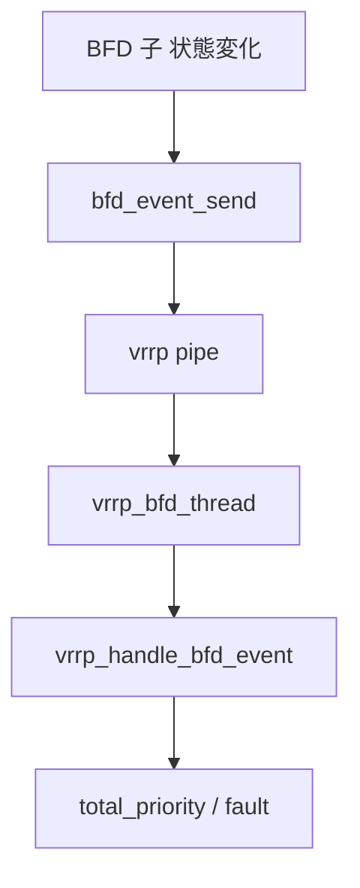

# 第22章 BFD と VRRP/check の連携

> 本章で読むソース
>
> - [`keepalived/bfd/bfd_event.c`](https://github.com/acassen/keepalived/blob/v2.4.1/keepalived/bfd/bfd_event.c)
> - [`keepalived/bfd/bfd_daemon.c`](https://github.com/acassen/keepalived/blob/v2.4.1/keepalived/bfd/bfd_daemon.c)
> - [`keepalived/vrrp/vrrp_scheduler.c`](https://github.com/acassen/keepalived/blob/v2.4.1/keepalived/vrrp/vrrp_scheduler.c)

## この章の狙い

BFD セッションの Up/Down が VRRP の優先度と fault、Checker の real server 判断へ伝播する経路を追う。

## 前提

[第16章](../part04-vrrp-net/16-vrrp-sync-track.md)の track、[第20章](../part05-check/20-check-misc.md)の `bfd_check_thread` を理解していること。

## パイプの作成

`open_bfd_pipes` は fork 前に VRRP 用と Checker 用の pipe を開く。

[`keepalived/bfd/bfd_daemon.c` L119-L138](https://github.com/acassen/keepalived/blob/v2.4.1/keepalived/bfd/bfd_daemon.c#L119-L138)

```c
bool
open_bfd_pipes(void)
{
#ifdef _WITH_VRRP_
	if (open_pipe(bfd_vrrp_event_pipe) == -1) {
		log_message(LOG_ERR, "Unable to create BFD vrrp event pipe: %m");
		return false;
	}
#endif

#ifdef _WITH_LVS_
	if (open_pipe(bfd_checker_event_pipe) == -1) {
		log_message(LOG_ERR, "Unable to create BFD checker event pipe: %m");
		return false;
	}
#endif

	return true;
}
```

## イベント送信

`bfd_event_send` は VRRP/check が動いていなければ書き込まない。
動いていれば `bfd_event_t` を各 pipe の write 端へ送る。

[`keepalived/bfd/bfd_event.c` L38-L84](https://github.com/acassen/keepalived/blob/v2.4.1/keepalived/bfd/bfd_event.c#L38-L84)

```c
void
bfd_event_send(bfd_t *bfd)
{
	bfd_event_t evt;
	// ... (中略) ...
	if (true
#ifdef _WITH_VRRP_
	    && !vrrp_running
#endif
#ifdef _WITH_LVS_
	    && !checker_running
#endif
		)
		return;

	memset(&evt, 0, sizeof evt);
	strcpy(evt.iname, bfd->iname);
	evt.state = bfd->local_state == BFD_STATE_UP ? BFD_STATE_UP : BFD_STATE_DOWN;
	evt.sent_time = timer_now();

#ifdef _WITH_VRRP_
	if (vrrp_running && bfd->vrrp) {
		ret = write(bfd_vrrp_event_pipe[1], &evt, sizeof evt);
```

## VRRP 側の受信

`vrrp_bfd_thread` は read fd を再登録しながら構造体を読み、`vrrp_handle_bfd_event` へ渡す。

[`keepalived/vrrp/vrrp_scheduler.c` L865-L887](https://github.com/acassen/keepalived/blob/v2.4.1/keepalived/vrrp/vrrp_scheduler.c#L865-L887)

```c
static void
vrrp_bfd_thread(thread_ref_t thread)
{
	bfd_event_t evt;
	ssize_t nread;

	if (thread->type == THREAD_READ_ERROR) {
		thread_close_fd(thread);
		return;
	}

	bfd_thread = thread_add_read(master, vrrp_bfd_thread, NULL,
				     thread->u.f.fd, TIMER_NEVER, 0);

	while ((nread = read(thread->u.f.fd, &evt, sizeof(bfd_event_t))) != -1) {
		if ((size_t)nread != sizeof(bfd_event_t)) {
			log_message(LOG_INFO, "(BFD) event pipe short read %zd of %zu bytes", nread, sizeof(bfd_event_t));
			break;
		}
		vrrp_handle_bfd_event(&evt);
	}
}
```

## 優先度と fault への反映

`vrrp_handle_bfd_event` は tracked BFD 名を照合し、weight 指定なら `total_priority` を加減する。
weight が0なら `try_up_instance` または `down_instance` を呼ぶ。

[`keepalived/vrrp/vrrp_scheduler.c` L811-L858](https://github.com/acassen/keepalived/blob/v2.4.1/keepalived/vrrp/vrrp_scheduler.c#L811-L858)

```c
void
vrrp_handle_bfd_event(bfd_event_t * evt)
{
	vrrp_tracked_bfd_t *vbfd;
	tracking_obj_t *tbfd;
	vrrp_t * vrrp;
	// ... (中略) ...
	list_for_each_entry(vbfd, &vrrp_data->vrrp_track_bfds, e_list) {
		if (strcmp(vbfd->bname, evt->iname))
			continue;
		// ... (中略) ...
		list_for_each_entry(tbfd, &vbfd->tracking_vrrp, e_list) {
			vrrp = tbfd->obj.vrrp;
			// ... (中略) ...
			if (tbfd->weight) {
				if (vbfd->bfd_up)
					vrrp->total_priority += abs(tbfd->weight) * tbfd->weight_multiplier;
				else
					vrrp->total_priority -= abs(tbfd->weight) * tbfd->weight_multiplier;
				vrrp_set_effective_priority(vrrp);
				continue;
			}

			if (!!vbfd->bfd_up == (tbfd->weight_multiplier == 1))
				try_up_instance(vrrp, false, VRRP_FAULT_FL_TRACKER);
			else
				down_instance(vrrp, VRRP_FAULT_FL_TRACKER);
		}
```



## Checker 側のイベント処理

`bfd_check_handle_event` は tracked BFD 名を照合し、紐づく checker の up/down を更新する。

[`keepalived/check/check_bfd.c` L264-L283](https://github.com/acassen/keepalived/blob/v2.4.1/keepalived/check/check_bfd.c#L264-L283)

```c
bfd_check_handle_event(bfd_event_t * evt)
{
	struct timeval cur_time;
	struct timeval timer_tmp;
	uint32_t delivery_time;
	checker_tracked_bfd_t *cbfd;
	tracking_obj_t *top;
	checker_t *checker;
	// ... (中略) ...
		log_message(LOG_INFO, "Received BFD event: instance %s is in"
			    " state %s (delivered in %" PRIu32 " usec)",
			    evt->iname, BFD_STATE_STR(evt->state), delivery_time);
```

Checker 子は起動時に pipe の read fd を登録する。

[`keepalived/check/check_bfd.c` L335-L339](https://github.com/acassen/keepalived/blob/v2.4.1/keepalived/check/check_bfd.c#L335-L339)

```c
void
start_bfd_monitoring(thread_master_t *thread_master)
{
	thread_add_read(thread_master, bfd_check_thread, NULL, bfd_checker_event_pipe[0], TIMER_NEVER, 0);
}
```

## 高速化・最適化の工夫

pipe 通知は固定長構造体1回の write で済み、HTTP チェックより短いレイテンシで VRRP へ届く。
read 側は while で溜まったイベントを一括消化し、epoll  wakeup 回数を抑える。

## まとめ

BFD は下位レイヤの経路障害を、VRRP の優先度調整と fault へ橋渡しする。

## 関連する章

- [第21章 BFD プロトコル](21-bfd-protocol.md)
- [第11章 状態遷移](../part03-vrrp-base/11-vrrp-state-machine.md)
