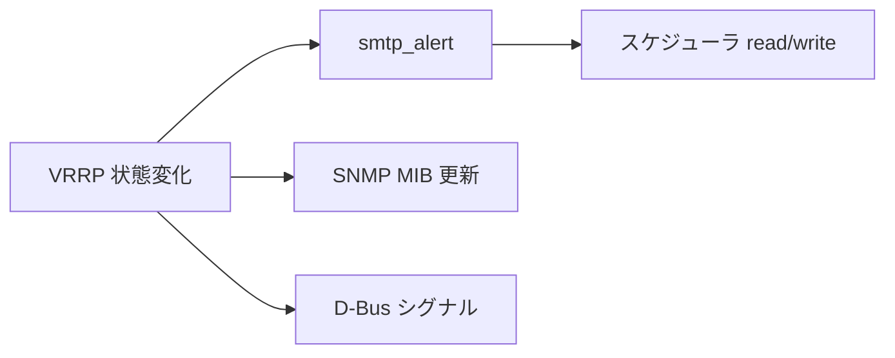

# 第23章 SNMP、SMTP、D-Bus

> 本章で読むソース
>
> - [`keepalived/core/snmp.c`](https://github.com/acassen/keepalived/blob/v2.4.1/keepalived/core/snmp.c)
> - [`keepalived/core/smtp.c`](https://github.com/acassen/keepalived/blob/v2.4.1/keepalived/core/smtp.c)
> - [`keepalived/vrrp/vrrp_dbus.c`](https://github.com/acassen/keepalived/blob/v2.4.1/keepalived/vrrp/vrrp_dbus.c)

## この章の狙い

VRRP 状態変化やチェック失敗を外部へ通知・監視する周辺機能の実装を読む。

## 前提

SNMP AgentX、SMTP アラート、D-Bus の用途を知っていること。

## SNMP サブエージェント

`snmp_agent_init` は AgentX サブエージェントを起動し、コールバックでログを keepalived 側へ流す。

[`keepalived/core/snmp.c` L466-L488](https://github.com/acassen/keepalived/blob/v2.4.1/keepalived/core/snmp.c#L466-L488)

```c
void
snmp_agent_init(const char *snmp_socket_name, bool base_mib)
{
	if (snmp_running)
		return;
	// ... (中略) ...
	log_message(LOG_INFO, "Starting SNMP subagent");
	netsnmp_enable_subagent();
	snmp_disable_log();
	snmp_enable_calllog();
	snmp_register_callback(SNMP_CALLBACK_LIBRARY,
			       SNMP_CALLBACK_LOGGING,
			       snmp_keepalived_log,
			       NULL);
```

MIB 登録は `snmp_register_mib` が `register_mib` と `register_sysORTable` を呼ぶ。

[`keepalived/core/snmp.c` L447-L457](https://github.com/acassen/keepalived/blob/v2.4.1/keepalived/core/snmp.c#L447-L457)

```c
void snmp_register_mib(oid *myoid, size_t len, const char *name,
		       struct variable *variables, size_t varsize, size_t varlen)
{
	char name_buf[80];

	if (register_mib(name, PTR_CAST(struct variable, variables), varsize,
			 varlen, myoid, len) != MIB_REGISTERED_OK)
		log_message(LOG_WARNING, "Unable to register %s MIB", name);

	snprintf(name_buf, sizeof(name_buf), "The MIB module for %s", name);
	register_sysORTable(myoid, len, name_buf);
}
```

## SMTP アラート

`smtp_alert` はメッセージ種別に応じて `smtp_t` を組み立て、非同期 SMTP セッションを開始する。

[`keepalived/core/smtp.c` L590-L601](https://github.com/acassen/keepalived/blob/v2.4.1/keepalived/core/smtp.c#L590-L601)

```c
smtp_alert(smtp_msg_t msg_type, void* data, const char *subject, const char *body)
{
	smtp_t *smtp;
#ifdef _WITH_VRRP_
	vrrp_t *vrrp;
	vrrp_sgroup_t *vgroup;
#endif
#ifdef _WITH_LVS_
	checker_t *checker;
	virtual_server_t *vs;
	smtp_rs *rs_info;
#endif
```

`smtp_connect` は非ブロッキング TCP でサーバへ接続し、進行中なら `thread_add_write` へ委譲する。

[`keepalived/core/smtp.c` L511-L534](https://github.com/acassen/keepalived/blob/v2.4.1/keepalived/core/smtp.c#L511-L534)

```c
static void
smtp_connect(smtp_t *smtp)
{
	enum connect_result status;
	int fd;

	if ((fd = socket(global_data->smtp_server.ss_family, SOCK_STREAM | SOCK_CLOEXEC | SOCK_NONBLOCK, IPPROTO_TCP)) == -1) {
		free_smtp_msg_data(smtp);
		return;
	}

	status = tcp_connect(fd, &global_data->smtp_server);

	if (status == connect_in_progress) {
		thread_add_write(master, connection_in_progress, smtp,
				 fd, global_data->smtp_connection_to, THREAD_DESTROY_CLOSE_FD | THREAD_DESTROY_FREE_ARG);
		return;
	}
```

サーバ応答は `smtp_read_thread` で段階的に処理する。

[`keepalived/core/smtp.c` L154-L156](https://github.com/acassen/keepalived/blob/v2.4.1/keepalived/core/smtp.c#L154-L156)

```c
	thread_add_read(thread->master, smtp_read_thread, smtp,
			thread->u.f.fd, global_data->smtp_connection_to, THREAD_DESTROY_CLOSE_FD | THREAD_DESTROY_FREE_ARG);
```

## D-Bus

`vrrp_dbus.c` は専用 pthread で GLib の D-Bus ループを回す。
起動完了まで親は条件変数で待つ。

[`keepalived/vrrp/vrrp_dbus.c` L975-L1035](https://github.com/acassen/keepalived/blob/v2.4.1/keepalived/vrrp/vrrp_dbus.c#L975-L1035)

```c
	pthread_t dbus_thread;
	sigset_t sigset, cursigset;
	// ... (中略) ...
	if (dbus_running)
		return false;

	if (!(files.interface_file = read_file(DBUS_VRRP_INTERFACE_FILE_PATH)))
		return false;
	// ... (中略) ...
	pthread_create(&dbus_thread, NULL, &dbus_main, &files);

	while (!dbus_startup_completed)
		pthread_cond_wait(&startup_cond, &cond_mutex);
	pthread_mutex_unlock(&cond_mutex);

	if (!dbus_running) {
		log_message(LOG_INFO, "Failed to initialise DBus");
```

グローバル状態は `dbus_running` と introspection データで管理する。

[`keepalived/vrrp/vrrp_dbus.c` L124-L133](https://github.com/acassen/keepalived/blob/v2.4.1/keepalived/vrrp/vrrp_dbus.c#L124-L133)

```c
static bool dbus_running;
static bool dbus_startup_completed;
static pthread_mutex_t cond_mutex = PTHREAD_MUTEX_INITIALIZER;
static pthread_cond_t startup_cond = PTHREAD_COND_INITIALIZER;

static GDBusNodeInfo *vrrp_introspection_data = NULL;
static GDBusNodeInfo *vrrp_instance_introspection_data = NULL;
static GDBusConnection *global_connection;
static GHashTable *objects;
```



## 高速化・最適化の工夫

SMTP は専用スレッドではなくスケジューラ上の非ブロッキング I/O で進め、VRRP 広告ループをブロックしない。
D-Bus は別 pthread に隔離し、GLib のブロッキング処理が VRRP epoll ループへ入らないようにする。

## まとめ

可観測性と通知は core と vrrp に分散実装され、いずれもメインのフェイルオーバーループを止めない設計である。

## 関連する章

- [第11章 状態遷移](../part03-vrrp-base/11-vrrp-state-machine.md)
- [第8章 リロード](../part02-core/08-reload-notify-track.md)
