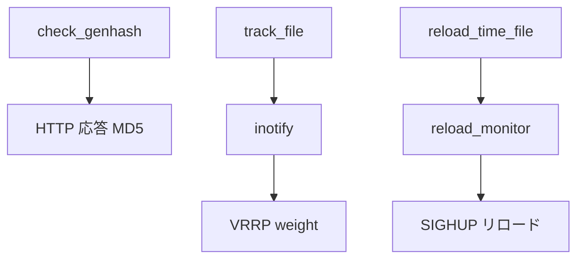

# 第24章 genhash、トラッカー、リロード監視

> 本章で読むソース
>
> - [`keepalived/check/check_genhash.c`](https://github.com/acassen/keepalived/blob/v2.4.1/keepalived/check/check_genhash.c)
> - [`keepalived/trackers/track_file.c`](https://github.com/acassen/keepalived/blob/v2.4.1/keepalived/trackers/track_file.c)
> - [`keepalived/core/reload_monitor.c`](https://github.com/acassen/keepalived/blob/v2.4.1/keepalived/core/reload_monitor.c)

## この章の狙い

LVS 永続セッション用ハッシュ生成、ファイルトラッカー、スケジュールリロード監視を読む。

## 前提

[第8章](../part02-core/08-reload-notify-track.md)のリロード、[第18章](../part05-check/18-check-tcp-http-udp.md)の HTTP digest を理解していること。

## genhash

`check_genhash.c` は `wget`/`curl` パイプ `md5sum` と同じ MD5 を生成するツールである。

[`keepalived/check/check_genhash.c` L24-L29](https://github.com/acassen/keepalived/blob/v2.4.1/keepalived/check/check_genhash.c#L24-L29)

```c
/*
 * The hash generated is the same as the one you can get from
 * wget or curl:
 *  wget http://[url]/[path] -O - | md5sum
 *  curl http://[url]/[path] | md5sum
 */
```

実装はダミー `checker_t` と HTTP checker を組み立て、`GENHASH` フラグで digest だけ計算して終了する。

[`keepalived/check/check_genhash.c` L268-L294](https://github.com/acassen/keepalived/blob/v2.4.1/keepalived/check/check_genhash.c#L268-L294)

```c
void __attribute__ ((noreturn))
check_genhash(bool am_genhash, int argc, char **argv)
{
	checker_t *checker;
	http_checker_t *http_get_check;
	virtual_server_t *vs;
	real_server_t *rs;
	conn_opts_t *co;
	// ... (中略) ...
	PMALLOC(checker);
	PMALLOC(vs);
	PMALLOC(rs);
	checker->vs = vs;
	checker->rs = rs;
	PMALLOC(co);
	co->connection_to = UINT_MAX;
	checker->co = co;
	PMALLOC(http_get_check);
	INIT_LIST_HEAD(&http_get_check->url);
	http_get_check->genhash_flags = GENHASH;
	http_get_check->proto = PROTO_HTTP;
	checker->data = http_get_check;
	checker->enabled = true;
```

## track_file と inotify

`process_inotify` は inotify fd を `thread_add_read` で待ち、イベントごとに tracked file の値を読み直す。

[`keepalived/trackers/track_file.c` L844-L858](https://github.com/acassen/keepalived/blob/v2.4.1/keepalived/trackers/track_file.c#L844-L858)

```c
static void
process_inotify(thread_ref_t thread)
{
	char buf[sizeof(struct inotify_event) + NAME_MAX + 1] __attribute__((aligned(__alignof__(struct inotify_event))));
	char *buf_ptr;
	ssize_t len;
	struct inotify_event* event;
	tracked_file_t *tfile;
	int fd = thread->u.f.fd;
	list_head_t *track_files = thread->arg;

	inotify_thread = thread_add_read(master, process_inotify, track_files, fd, TIMER_NEVER, 0);

	while (true) {
		if ((len = read(fd, buf, sizeof(buf))) < (ssize_t)sizeof(struct inotify_event)) {
```

読み取った数値は `update_track_file_status` で VRRP/check の weight へ伝播する。

[`keepalived/trackers/track_file.c` L833-L841](https://github.com/acassen/keepalived/blob/v2.4.1/keepalived/trackers/track_file.c#L833-L841)

```c
	if (!init)
		update_track_file_status(tfile, new_status);
	// ... (中略) ...
	tfile->last_status = new_status;
```

## reload_monitor

`start_reload_monitor` は `reload_time_file` のディレクトリとファイルを inotify で監視する。

[`keepalived/core/reload_monitor.c` L407-L438](https://github.com/acassen/keepalived/blob/v2.4.1/keepalived/core/reload_monitor.c#L407-L438)

```c
void
start_reload_monitor(void)
{
	int inotify_fd;
	char *dir;

	inotify_fd = inotify_init1(IN_CLOEXEC | IN_NONBLOCK);

	file_name = strrchr(global_data->reload_time_file, '/');
	if (!file_name) {
		dir = MALLOC(2);
		dir[0] = '/';
		dir[1] = '\0';
	} else {
		dir = MALLOC(file_name - global_data->reload_time_file + 1);
		strncpy(dir, global_data->reload_time_file, file_name - global_data->reload_time_file);
	}

	if ((dir_wd = inotify_add_watch(inotify_fd, dir,
		IN_CREATE | IN_DELETE | IN_MOVED_TO | IN_MOVED_FROM | IN_DELETE_SELF | IN_MOVE_SELF)) == -1) {
		log_message(LOG_INFO, "Unable to monitor reload timer file directory %s- ignoring", dir);
		FREE(dir);
		return;
	}
```

イベント処理後は `inotify_event_thread` を read コールバックとして再登録する。

[`keepalived/core/reload_monitor.c` L400-L404](https://github.com/acassen/keepalived/blob/v2.4.1/keepalived/core/reload_monitor.c#L400-L404)

```c
	inotify_thread = thread_add_read(master, inotify_event_thread, NULL, thread->u.f.fd, TIMER_NEVER, 0);
}
```

停止時はスレッドと fd を明示的に片付ける。

[`keepalived/core/reload_monitor.c` L451-L464](https://github.com/acassen/keepalived/blob/v2.4.1/keepalived/core/reload_monitor.c#L451-L464)

```c
void
stop_reload_monitor(void)
{
	int fd;

	if (!inotify_thread)
		return;

	fd = inotify_thread->u.f.fd;

	thread_cancel(inotify_thread);
	inotify_thread = NULL;
	cancel_reload(false);

	close(fd);
```



## 高速化・最適化の工夫

genhash はデーモンを起動せず単発計算で終了し、運用時のオーバーヘッドを最小化する。
inotify はポーリングではなくカーネル通知でファイル変化を検知し、idle 時の CPU 使用を抑える。

## まとめ

genhash、track_file、reload_monitor は本線の VRRP/check を補完し、運用自動化の隙間を埋める。

## 関連する章

- [第8章 リロード](../part02-core/08-reload-notify-track.md)
- [第20章 その他チェック](../part05-check/20-check-misc.md)
