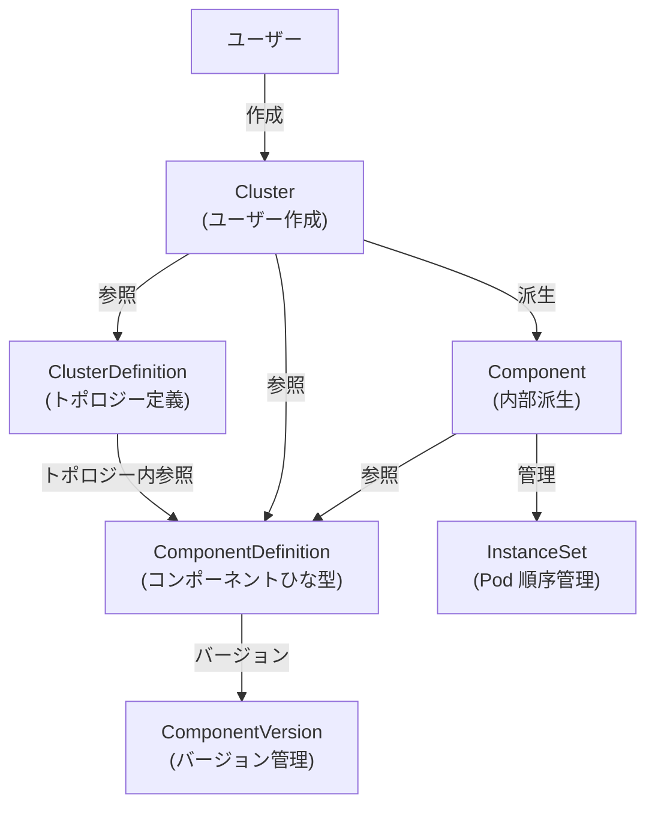
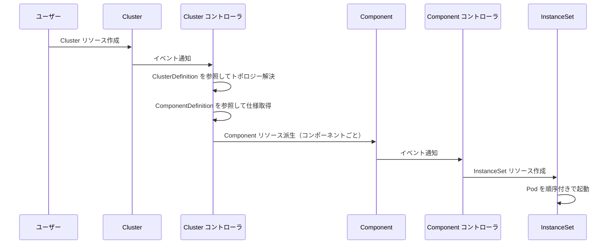

# 第1章 KubeBlocks の全体像と CRD 設計思想

> 本章で読むソース
>
> - [apis/apps/v1/cluster_types.go L41-L71](https://github.com/apecloud/kubeblocks/blob/v1.0.2/apis/apps/v1/cluster_types.go#L41-L71)
> - [apis/apps/v1/cluster_types.go L86-L201](https://github.com/apecloud/kubeblocks/blob/v1.0.2/apis/apps/v1/cluster_types.go#L86-L201)
> - [apis/apps/v1/component_types.go L38-L56](https://github.com/apecloud/kubeblocks/blob/v1.0.2/apis/apps/v1/component_types.go#L38-L56)
> - [apis/apps/v1/componentdefinition_types.go L43-L73](https://github.com/apecloud/kubeblocks/blob/v1.0.2/apis/apps/v1/componentdefinition_types.go#L43-L73)
> - [apis/apps/v1/clusterdefinition_types.go L37-L76](https://github.com/apecloud/kubeblocks/blob/v1.0.2/apis/apps/v1/clusterdefinition_types.go#L37-L76)
> - [apis/apps/v1/clusterdefinition_types.go L100-L238](https://github.com/apecloud/kubeblocks/blob/v1.0.2/apis/apps/v1/clusterdefinition_types.go#L100-L238)
> - [apis/apps/v1/componentversion_types.go L37-L44](https://github.com/apecloud/kubeblocks/blob/v1.0.2/apis/apps/v1/componentversion_types.go#L37-L44)
> - [apis/apps/v1/types.go L24-L50](https://github.com/apecloud/kubeblocks/blob/v1.0.2/apis/apps/v1/types.go#L24-L50)

## この章の狙い

KubeBlocks の API 層は Kubernetes の CRD（Custom Resource Definition）として定義される。
本章では `apis/apps/v1/` ディレクトリに配置される主要 CRD の型定義を読み、KubeBlocks がどのようにデータベースクラスタを抽象化しているかを把握する。
CRD 間の参照関係と責務分担を理解することで、以降の章で読むコントローラの動作を読み解くための土台を得る。

## 前提

Kubernetes の CRD とコントローラパターンの基礎知識を前提とする。
詳細は [第20章 CRD と Aggregation](../../kubernetes/kubernetes/part07-extension/20-crd-and-aggregation.md) および [第9章 kube-controller-manager のアーキテクチャ](../../kubernetes/kubernetes/part03-controller-manager/09-controller-manager-architecture.md) を参照されたい。

## KubeBlocks が扱う CRD の一覧

`apis/` ディレクトリには複数の API グループが存在する。

| API グループ | 代表 CRD | 責務 |
|---|---|---|
| `apps/v1` | `Cluster`, `Component`, `ComponentDefinition`, `ClusterDefinition`, `ComponentVersion` | クラスタの構成とライフサイクル |
| `workloads/v1` | `InstanceSet` | Pod 群の順序付き管理（StatefulSet の代替） |
| `dataprotection/v1alpha1` | `Backup`, `Restore`, `BackupPolicy`, `BackupSchedule`, `BackupRepo`, `ActionSet` | バックアップとリストア |
| `operations/v1alpha1` | `OpsRequest`, `OpsDefinition` | 運用操作（スケール、再起動等） |
| `extensions/v1alpha1` | `Addon` | アドオンの管理 |
| `parameters/v1alpha1` | `ParamDefinition`, `Params` | パラメータの管理 |

本章では `apps/v1` に属する CRD に焦点を当てる。
これらは KubeBlocks の中核をなし、ユーザーが直接作成する `Cluster` から、内部派生オブジェクトである `Component`、そしてテンプレート層の `ComponentDefinition`・`ClusterDefinition`・`ComponentVersion` までを含む。

## 4つの核心 CRD

### Cluster: ユーザーが作成する唯一のエントリポイント

`Cluster` はユーザーが Kubernetes 上に作成する、データベースクラスタ全体を表すリソースである。

[apis/apps/v1/cluster_types.go L65-L71](https://github.com/apecloud/kubeblocks/blob/v1.0.2/apis/apps/v1/cluster_types.go#L65-L71)

```go
type Cluster struct {
	metav1.TypeMeta   `json:",inline"`
	metav1.ObjectMeta `json:"metadata,omitempty"`

	Spec   ClusterSpec   `json:"spec,omitempty"`
	Status ClusterStatus `json:"status,omitempty"`
}
```

コメントには MySQL、PostgreSQL、Redis、Kafka、ElasticSearch など 20 種近いデータベースが列挙されている。
これら多様なシステムを単一の `Cluster` リソースで統一的に管理するのが KubeBlocks の設計目標である。

`ClusterSpec` の主要フィールドを以下に示す。

[apis/apps/v1/cluster_types.go L88-L175](https://github.com/apecloud/kubeblocks/blob/v1.0.2/apis/apps/v1/cluster_types.go#L88-L175)

```go
type ClusterSpec struct {
	// Specifies the name of the ClusterDefinition to use when creating a Cluster.
	// ...
	// +kubebuilder:validation:XValidation:rule="self == oldSelf",message="clusterDef is immutable"
	// +optional
	ClusterDef string `json:"clusterDef,omitempty"`

	// Specifies the name of the ClusterTopology to be used when creating the Cluster.
	// ...
	// +kubebuilder:validation:XValidation:rule="self == oldSelf",message="topology is immutable"
	// +optional
	Topology string `json:"topology,omitempty"`

	// Specifies the behavior when a Cluster is deleted.
	// ...
	// +kubebuilder:validation:Required
	TerminationPolicy TerminationPolicyType `json:"terminationPolicy"`

	// Specifies a list of ClusterComponentSpec objects used to define the individual Components that make up a Cluster.
	// ...
	// +optional
	ComponentSpecs []ClusterComponentSpec `json:"componentSpecs,omitempty" patchStrategy:"merge,retainKeys" patchMergeKey:"name"`

	// Specifies a list of ClusterSharding objects that manage the sharding topology for Cluster Components.
	// ...
	// +optional
	Shardings []ClusterSharding `json:"shardings,omitempty"`

	// ... (残りのフィールドはリポジトリを参照)
}
```

`ClusterDef` は参照する `ClusterDefinition` の名前である。
`Topology` は `ClusterDefinition` 内で利用するトポロジー名を指定する。
`TerminationPolicy` はクラスタ削除時の振る舞いを制御する。
`DoNotTerminate` は削除を禁止し、`Delete` はランタイムリソースを削除し、`WipeOut` はボリュームスナップショットやバックアップも含めて完全に削除する。

`ComponentSpecs` はクラスタを構成する各コンポーネントの仕様リストである。
各エントリは `ClusterComponentSpec` 型であり、レプリカ数、リソース要求、ボリューム claim、TLS 設定等を含む。

[apis/apps/v1/cluster_types.go L260-L342](https://github.com/apecloud/kubeblocks/blob/v1.0.2/apis/apps/v1/cluster_types.go#L260-L342)

```go
type ClusterComponentSpec struct {
	// Specifies the Component's name.
	// ...
	// +optional
	Name string `json:"name"`

	// Specifies the ComponentDefinition custom resource (CR) that defines the Component's characteristics and behavior.
	// ...
	// +optional
	ComponentDef string `json:"componentDef,omitempty"`

	// ServiceVersion specifies the version of the Service expected to be provisioned by this Component.
	// ...
	// +optional
	ServiceVersion string `json:"serviceVersion,omitempty"`

	// ... (ServiceRefs, Labels, Annotations, Env 等のフィールド)

	// Specifies the desired number of replicas in the Component for enhancing availability and durability, or load balancing.
	// ...
	// +kubebuilder:validation:Required
	// +kubebuilder:validation:Minimum=0
	// +kubebuilder:default=1
	Replicas int32 `json:"replicas"`

	// ... (残りのフィールドはリポジトリを参照)
}
```

`Shardings` は Shared-Nothing 構成のためのフィールドである。
各シャードは独立した `Component` として管理され、動的なリシャーディングに対応する。

`ClusterStatus` はクラスタの現在の状態を保持する。

[apis/apps/v1/cluster_types.go L204-L240](https://github.com/apecloud/kubeblocks/blob/v1.0.2/apis/apps/v1/cluster_types.go#L204-L240)

```go
type ClusterStatus struct {
	// The most recent generation number of the Cluster object that has been observed by the controller.
	//
	// +optional
	ObservedGeneration int64 `json:"observedGeneration,omitempty"`

	// The current phase of the Cluster includes:
	// `Creating`, `Running`, `Updating`, `Stopping`, `Stopped`, `Deleting`, `Failed`, `Abnormal`.
	//
	// +optional
	Phase ClusterPhase `json:"phase,omitempty"`

	// Provides additional information about the current phase.
	//
	// +optional
	Message string `json:"message,omitempty"`

	// Records the current status information of all Components within the Cluster.
	//
	// +optional
	Components map[string]ClusterComponentStatus `json:"components,omitempty"`

	// ... (Shardings, Conditions フィールド)
}
```

`Phase` はクラスタのライフサイクル状態を表す。
取りうる値は `Creating`、`Running`、`Updating`、`Stopping`、`Stopped`、`Deleting`、`Failed`、`Abnormal` の 8 種類である。

[apis/apps/v1/cluster_types.go L740-L768](https://github.com/apecloud/kubeblocks/blob/v1.0.2/apis/apps/v1/cluster_types.go#L740-L768)

```go
const (
	// CreatingClusterPhase represents all components are in `Creating` phase.
	CreatingClusterPhase ClusterPhase = "Creating"

	// RunningClusterPhase represents all components are in `Running` phase, indicates that the cluster is functioning properly.
	RunningClusterPhase ClusterPhase = "Running"

	// UpdatingClusterPhase represents all components are in `Creating`, `Running` or `Updating` phase, and at least one
	// component is in `Creating` or `Updating` phase, indicates that the cluster is undergoing an update.
	UpdatingClusterPhase ClusterPhase = "Updating"

	// StoppingClusterPhase represents at least one component is in `Stopping` phase, indicates that the cluster is in
	// the process of stopping.
	StoppingClusterPhase ClusterPhase = "Stopping"

	// StoppedClusterPhase represents all components are in `Stopped` phase, indicates that the cluster has stopped and
	// is not providing any functionality.
	StoppedClusterPhase ClusterPhase = "Stopped"

	// DeletingClusterPhase indicates the cluster is being deleted.
	DeletingClusterPhase ClusterPhase = "Deleting"

	// FailedClusterPhase represents all components are in `Failed` phase, indicates that the cluster is unavailable.
	FailedClusterPhase ClusterPhase = "Failed"

	// AbnormalClusterPhase represents some components are in `Failed` phase, indicates that the cluster is in
	// a fragile state and troubleshooting is required.
	AbnormalClusterPhase ClusterPhase = "Abnormal"
)
```

### Component: Cluster から派生する内部オブジェクト

`Component` は `Cluster` の各コンポーネントに対応する内部リソースである。
ユーザーが直接作成するものではなく、`Cluster` コントローラが `ClusterComponentSpec` から派生させる。

[apis/apps/v1/component_types.go L50-L56](https://github.com/apecloud/kubeblocks/blob/v1.0.2/apis/apps/v1/component_types.go#L50-L56)

```go
type Component struct {
	metav1.TypeMeta   `json:",inline"`
	metav1.ObjectMeta `json:"metadata,omitempty"`

	Spec   ComponentSpec   `json:"spec,omitempty"`
	Status ComponentStatus `json:"status,omitempty"`
}
```

コメントは「Component is an internal sub-object derived from the user-submitted Cluster object」と明記している。
ユーザーは `Component` を直接変更せず、状態の監視に専念すべきとされている。

`ComponentSpec` は `ClusterComponentSpec` の情報を展開したもので、参照する `ComponentDefinition` の名前（`CompDef`）、レプリカ数、リソース、ボリューム、TLS 設定等を含む。

[apis/apps/v1/component_types.go L72-L90](https://github.com/apecloud/kubeblocks/blob/v1.0.2/apis/apps/v1/component_types.go#L72-L90)

```go
type ComponentSpec struct {
	// Specifies the behavior when a Component is deleted.
	//
	// +kubebuilder:default=Delete
	// +optional
	TerminationPolicy TerminationPolicyType `json:"terminationPolicy"`

	// Specifies the name of the referenced ComponentDefinition.
	//
	// +kubebuilder:validation:Required
	// +kubebuilder:validation:MaxLength=64
	CompDef string `json:"compDef"`

	// ServiceVersion specifies the version of the Service expected to be provisioned by this Component.
	// ...
	// +optional
	ServiceVersion string `json:"serviceVersion,omitempty"`

	// ... (残りのフィールドはリポジトリを参照)
}
```

`Component` の `Phase` も `Cluster` と同様にライフサイクル状態を持つ。

[apis/apps/v1/component_types.go L390-L413](https://github.com/apecloud/kubeblocks/blob/v1.0.2/apis/apps/v1/component_types.go#L390-L413)

```go
const (
	// CreatingComponentPhase indicates the component is currently being created.
	CreatingComponentPhase ComponentPhase = "Creating"

	// DeletingComponentPhase indicates the component is currently being deleted.
	DeletingComponentPhase ComponentPhase = "Deleting"

	// UpdatingComponentPhase indicates the component is currently being updated.
	UpdatingComponentPhase ComponentPhase = "Updating"

	// StoppingComponentPhase indicates the component is currently being stopped.
	StoppingComponentPhase ComponentPhase = "Stopping"

	// StartingComponentPhase indicates the component is currently being started.
	StartingComponentPhase ComponentPhase = "Starting"

	// RunningComponentPhase indicates that all pods of the component are up-to-date and in a 'Running' state.
	RunningComponentPhase ComponentPhase = "Running"

	// StoppedComponentPhase indicates the component is stopped.
	StoppedComponentPhase ComponentPhase = "Stopped"

	// FailedComponentPhase indicates that there are some pods of the component not in a 'Running' state.
	FailedComponentPhase ComponentPhase = "Failed"
)
```

`Component` には `Starting` フェーズが存在するが、`Cluster` にはない。
コンポーネントレベルでは起動途中の中間状態を表現し、クラスタレベルでは全コンポーネントの状態を統合して 8 状態に集約する設計である。

### ComponentDefinition: コンポーネントのひな型

`ComponentDefinition` は `Component` のひな型を定義するクラスタスコープリソースである。
Pod テンプレート、設定ファイルテンプレート、スクリプト、ライフサイクルフック、ロール定義等を保持する。

[apis/apps/v1/componentdefinition_types.go L67-L73](https://github.com/apecloud/kubeblocks/blob/v1.0.2/apis/apps/v1/componentdefinition_types.go#L67-L73)

```go
type ComponentDefinition struct {
	metav1.TypeMeta   `json:",inline"`
	metav1.ObjectMeta `json:"metadata,omitempty"`

	Spec   ComponentDefinitionSpec   `json:"spec,omitempty"`
	Status ComponentDefinitionStatus `json:"status,omitempty"`
}
```

`ComponentDefinitionSpec` が保持する情報は多岐にわたる。

`ComponentDefinitionSpec` が保持する情報は多岐にわたる（L88-L534）。主要なフィールドを以下に示す。

[apis/apps/v1/componentdefinition_types.go L88-L534](https://github.com/apecloud/kubeblocks/blob/v1.0.2/apis/apps/v1/componentdefinition_types.go#L88-L534)

```go
type ComponentDefinitionSpec struct {
	// Specifies the name of the Component provider, typically the vendor or developer name.
	// ...
	// +optional
	Provider string `json:"provider,omitempty"`

	// Provides a brief and concise explanation of the Component's purpose, functionality, and any relevant details.
	// ...
	// +optional
	Description string `json:"description,omitempty"`

	// Defines the type of well-known service protocol that the Component provides.
	// ...
	// +optional
	ServiceKind string `json:"serviceKind,omitempty"`

	// Specifies the version of the Service provided by the Component.
	// ...
	// +optional
	ServiceVersion string `json:"serviceVersion,omitempty"`

	// ... (Runtime, Vars, Volumes, Services, Configs, Scripts, Roles, LifecycleActions 等のフィールド)
}
```

`Runtime` フィールドは `corev1.PodSpec` を直接埋め込み、コンテナイメージ、コマンド、環境変数、ボリュームマウント等の静的設定を保持する。
`Vars` はクラスタのインスタンス化後に確定する動的変数を定義する。
`LifecycleActions` は `postProvision`、`preTerminate`、`roleProbe`、`switchover`、`memberJoin`、`memberLeave` 等のライフサイクルフックを定義する。

`ComponentDefinition` のフィールドはほぼ全て immutable である。
これはひな型が一度定義されると不変であり、バージョンアップは `ComponentVersion` で管理するという設計思想に基づく。

### ClusterDefinition: トポロジーの定義

`ClusterDefinition` はクラスタのトポロジーを定義するクラスタスコープリソースである。
どのコンポーネントをどのように組み合わせ、どのような順序で起動・停止・更新するかを規定する。

[apis/apps/v1/clusterdefinition_types.go L47-L53](https://github.com/apecloud/kubeblocks/blob/v1.0.2/apis/apps/v1/clusterdefinition_types.go#L47-L53)

```go
type ClusterDefinition struct {
	metav1.TypeMeta   `json:",inline"`
	metav1.ObjectMeta `json:"metadata,omitempty"`

	Spec   ClusterDefinitionSpec   `json:"spec,omitempty"`
	Status ClusterDefinitionStatus `json:"status,omitempty"`
}
```

`ClusterDefinitionSpec` は `Topologies` のリストを持つ。

[apis/apps/v1/clusterdefinition_types.go L69-L76](https://github.com/apecloud/kubeblocks/blob/v1.0.2/apis/apps/v1/clusterdefinition_types.go#L69-L76)

```go
type ClusterDefinitionSpec struct {
	// Topologies defines all possible topologies within the cluster.
	//
	// +kubebuilder:validation:MinItems=1
	// +kubebuilder:validation:MaxItems=128
	// +optional
	Topologies []ClusterTopology `json:"topologies,omitempty"`
}
```

`ClusterTopology` は名前、コンポーネント一覧、シャーディング一覧、起動順序を持つ。

[apis/apps/v1/clusterdefinition_types.go L101-L133](https://github.com/apecloud/kubeblocks/blob/v1.0.2/apis/apps/v1/clusterdefinition_types.go#L101-L133)

```go
type ClusterTopology struct {
	// Name is the unique identifier for the cluster topology.
	// Cannot be updated.
	//
	// +kubebuilder:validation:Required
	// +kubebuilder:validation:MaxLength=32
	Name string `json:"name"`

	// Components specifies the components in the topology.
	//
	// +kubebuilder:validation:MaxItems=128
	// +optional
	Components []ClusterTopologyComponent `json:"components,omitempty"`

	// Shardings specifies the shardings in the topology.
	//
	// +kubebuilder:validation:MaxItems=128
	// +optional
	Shardings []ClusterTopologySharding `json:"shardings,omitempty"`

	// Specifies the sequence in which components within a cluster topology are
	// started, stopped, and upgraded.
	// ...
	// +optional
	Orders *ClusterTopologyOrders `json:"orders,omitempty"`

	// Default indicates whether this topology serves as the default configuration.
	// ...
	// +optional
	Default bool `json:"default,omitempty"`
}
```

`ClusterTopologyComponent` は名前と `ComponentDefinition` への参照（`CompDef`）を持つ。
`CompDef` は完全一致、名前プレフィックス、正規表現のいずれかで指定でき、システムは一致する最新の `ComponentDefinition` を自動的に選択する。

`ClusterTopologyOrders` はプロビジョニング、終了、更新の順序をステージごとに制御する。

[apis/apps/v1/clusterdefinition_types.go L211-L238](https://github.com/apecloud/kubeblocks/blob/v1.0.2/apis/apps/v1/clusterdefinition_types.go#L211-L238)

```go
type ClusterTopologyOrders struct {
	// Specifies the order for creating and initializing entities.
	// ...
	// +optional
	Provision []string `json:"provision,omitempty"`

	// Outlines the order for stopping and deleting entities.
	// ...
	// +optional
	Terminate []string `json:"terminate,omitempty"`

	// Update determines the order for updating entities' specifications, such as image upgrades or resource scaling.
	// ...
	// +optional
	Update []string `json:"update,omitempty"`
}
```

各フィールドは文字列の配列であり、1 つのステージに複数のコンポーネントをカンマ区切りで記述できる。
ステージは配列の先頭から順に処理される。
依存関係のあるコンポーネントを異なるステージに配置し、独立したコンポーネントを同一ステージに配置することで、並列化と順序制御を両立する。

### ComponentVersion: バージョンと互換性管理

`ComponentVersion` は `ComponentDefinition` の互換性ルールとリリース情報を管理する。

[apis/apps/v1/componentversion_types.go L38-L44](https://github.com/apecloud/kubeblocks/blob/v1.0.2/apis/apps/v1/componentversion_types.go#L38-L44)

```go
type ComponentVersion struct {
	metav1.TypeMeta   `json:",inline"`
	metav1.ObjectMeta `json:"metadata,omitempty"`

	Spec   ComponentVersionSpec   `json:"spec,omitempty"`
	Status ComponentVersionStatus `json:"status,omitempty"`
}
```

`ComponentDefinition` を不変のひな型として保持しつつ、バージョンアップやパッチ適用を `ComponentVersion` で管理する。
この分離により、ひな型の再利用性を保ちながら、バージョンの組み合わせの爆発を抑えられる。

## CRD 間の参照関係



`Cluster` は `ClusterDefinition` を参照してトポロジーを決定し、`ComponentDefinition` を参照して各コンポーネントの仕様を取得する。
コントローラは `Cluster` から `Component` を派生させ、`Component` は `InstanceSet` を介して Pod 群を管理する。

## データフロー: Cluster 作成から Pod 起動まで



`Cluster` の作成イベントを受け取ると、Cluster コントローラは `ClusterDefinition` からトポロジーを解決し、各コンポーネントに対応する `Component` リソースを生成する。
Component コントローラは `Component` を監視し、`InstanceSet` を作成して Pod を起動する。

## 静的設定と動的設定の分離

KubeBlocks の CRD 設計で特徴的なのは、静的設定と動的設定を明確に分離している点である。

`ComponentDefinition` は静的設定を保持する。
Pod テンプレート（`Runtime`）、設定ファイルテンプレート（`Configs`）、ライフサイクルフック（`LifecycleActions`）、ロール定義（`Roles`）等はすべて `ComponentDefinition` で定義され、一度作成すると変更できない。

`ClusterComponentSpec` は動的設定を保持する。
レプリカ数、リソース要求、ボリューム claim の容量等はクラスタごとに異なり、運用中に変更できる。

この分離により、`ComponentDefinition` はアドオン開発者が一度定義すれば再利用でき、クラスタ利用者は動的な設定のみを `Cluster` で指定すればよい。

## 最適化の工夫: トポロジー順序による並列プロビジョニング

`ClusterTopologyOrders` の設計は、コンポーネント間の依存関係をステージ単位で表現する。
同一ステージ内のコンポーネントは並列にプロビジョニングできる。

例えば Redis クラスタで `proxy` が `redis` に依存する場合、`Provision` は `["redis", "proxy"]` ではなく `["redis", "proxy"]` を別ステージに分ける。
逆に依存関係のない `redis` と `sentinel` は同一ステージに配置して並列起動できる。

このステージベースの順序制御により、全コンポーネントを直列に起動する場合と比べて、依存関係が独立した部分の起動時間を短縮できる。
コントローラはステージ単位で同期ポイントを取りながら、並列化の恩恵を最大化する。

## Cluster のイミュータブルフィールド

`ClusterSpec` の `ClusterDef` と `Topology` は一度設定すると変更できない。

```go
// apis/apps/v1/cluster_types.go L109
// +kubebuilder:validation:XValidation:rule="self == oldSelf",message="clusterDef is immutable"
```

[apis/apps/v1/cluster_types.go L109](https://github.com/apecloud/kubeblocks/blob/v1.0.2/apis/apps/v1/cluster_types.go#L109)

```go
// apis/apps/v1/cluster_types.go L126
// +kubebuilder:validation:XValidation:rule="self == oldSelf",message="topology is immutable"
```

[apis/apps/v1/cluster_types.go L126](https://github.com/apecloud/kubeblocks/blob/v1.0.2/apis/apps/v1/cluster_types.go#L126)

CEL（Common Expression Language）によるバリデーションで、Kubernetes API サーバーレベルで不変性を強制する。
これはクラスタの構成が途中で変わることを防ぎ、コントローラの状態管理を単純化する。

## まとめ

KubeBlocks の `apps/v1` API は 5 つの CRD で構成される。

- `Cluster`: ユーザーが作成するクラスタ全体のリソース。`ClusterDefinition` と `ComponentDefinition` を参照し、`Component` を派生させる。
- `Component`: `Cluster` から派生する内部リソース。各コンポーネントのライフサイクルを管理する。
- `ComponentDefinition`: コンポーネントのひな型。静的設定を保持し、不変。
- `ClusterDefinition`: トポロジー定義。コンポーネントの組み合わせと起動順序を規定する。
- `ComponentVersion`: `ComponentDefinition` のバージョンと互換性を管理する。

この階層構造により、アドオン開発者はひな型を定義するだけでよく、利用者は動的設定のみを指定すればよい。
静的設定と動的設定の分離が、再利用性と運用柔軟性の両立を可能にしている。

## 関連する章

- [第8章 Cluster コントローラ](../part02-main-controllers/08-cluster-controller.md): `Cluster` のリコンサイトループを解説する。
- [第9章 Component コントローラ](../part02-main-controllers/09-component-controller.md): `Component` の生成とライフサイクル管理を解説する。
- [第19章 client-go と Informer](../../kubernetes/kubernetes/part07-extension/19-client-go-and-informer.md): コントローラの基盤となる Informer の仕組み。
- [第20章 CRD と Aggregation](../../kubernetes/kubernetes/part07-extension/20-crd-and-aggregation.md): CRD の基礎。
