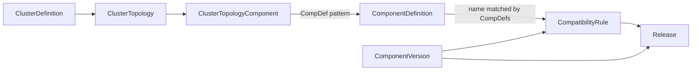

# 第2章 ClusterDefinition と ComponentDefinition

> 本章で読むソース:
>
> - [apis/apps/v1/clusterdefinition_types.go L47-L238](https://github.com/apecloud/kubeblocks/blob/v1.0.2/apis/apps/v1/clusterdefinition_types.go#L47-L238)
> - [apis/apps/v1/componentdefinition_types.go L67-L553](https://github.com/apecloud/kubeblocks/blob/v1.0.2/apis/apps/v1/componentdefinition_types.go#L67-L553)
> - [apis/apps/v1/componentdefinition_types.go L1382-L1706](https://github.com/apecloud/kubeblocks/blob/v1.0.2/apis/apps/v1/componentdefinition_types.go#L1382-L1706)
> - [apis/apps/v1/componentversion_types.go L38-L155](https://github.com/apecloud/kubeblocks/blob/v1.0.2/apis/apps/v1/componentversion_types.go#L38-L155)

## この章の狙い

KubeBlocks の CRD 設計は、クラスタの「トポロジ」とコンポーネントの「定義」を別々のリソースに分離している。
本章では `ClusterDefinition`、`ComponentDefinition`、`ComponentVersion` の3つを読み、この分離がどのように実現されているかを理解する。
これら3つの CRD はデータベースエンジンの青写真であり、実際のインスタンス（`Cluster`、`Component`）はこれらを参照して生成される。

## 前提

Kubernetes の CRD とコントローラパターンの基礎は [kubernetes 第20章 CRD と Aggregation](../../kubernetes/kubernetes/part07-extension/20-crd-and-aggregation.md) を参照すること。
本章では KubeBlocks 固有のデータモデルに紙面を使う。

## ClusterDefinition: クラスタのトポロジ

`ClusterDefinition` はデータベースクラスタのトポロジを定義するクラスタスコープの CRD である。
短縮名は `cd`。
複数のトポロジを保持でき、クラスタ作成時にその中から一つを選択する。

apis/apps/v1/clusterdefinition_types.go L47-L53

```go
type ClusterDefinition struct {
    metav1.TypeMeta   `json:",inline"`
    metav1.ObjectMeta `json:"metadata,omitempty"`

    Spec   ClusterDefinitionSpec   `json:"spec,omitempty"`
    Status ClusterDefinitionStatus `json:"status,omitempty"`
}
```

`Spec` は `Topologies` フィールドを持ち、利用可能なトポロジのリストを保持する。

apis/apps/v1/clusterdefinition_types.go L69-L76

```go
type ClusterDefinitionSpec struct {
    // Topologies defines all possible topologies within the cluster.
    //
    // +kubebuilder:validation:MinItems=1
    // +kubebuilder:validation:MaxItems=128
    // +optional
    Topologies []ClusterTopology `json:"topologies,omitempty"`
}
```

### ClusterTopology: トポロジの構成要素

`ClusterTopology` は一つのトポロジ構成を表す。
名前、コンポーネント一覧、シャーディング一覧、ライフサイクル順序、デフォルトフラグからなる。

apis/apps/v1/clusterdefinition_types.go L101-L133

```go
type ClusterTopology struct {
    Name       string                     `json:"name"`
    Components []ClusterTopologyComponent `json:"components,omitempty"`
    Shardings  []ClusterTopologySharding  `json:"shardings,omitempty"`
    Orders     *ClusterTopologyOrders     `json:"orders,omitempty"`
    Default    bool                       `json:"default,omitempty"`
}
```

`Default` フィールドが `true` のトポロジは、ユーザーが明示的に指定しなかった場合に自動的に選ばれる。
一つの `ClusterDefinition` に複数のトポロジを登録し、用途に応じて使い分けられる。

### ClusterTopologyComponent: コンポーネントの参照

`ClusterTopologyComponent` はトポロジ内の各コンポーネントを定義する。

apis/apps/v1/clusterdefinition_types.go L136-L174

```go
type ClusterTopologyComponent struct {
    Name     string `json:"name"`
    CompDef  string `json:"compDef"`
    Template *bool  `json:"template,omitempty"`
}
```

`Name` はトポロジ内でコンポーネントを識別する。
IANA Service 命名規則に従い、DNS 名の一部としても使われる。
`CompDef` は参照する `ComponentDefinition` の名前を指定する。
ここには正確な名前、名前プレフィックス、正規表現パターンのいずれかを指定できる。
このパターンマッチングの仕組みについては「ComponentVersion による互換性管理」で詳しく扱う。
`Template` は `true` の場合、このコンポーネントが動的インスタンス化のテンプレートとして機能することを示す。

### ClusterTopologyOrders: ライフサイクル順序

`ClusterTopologyOrders` はコンポーネントの起動、停止、更新の順序を制御する。

apis/apps/v1/clusterdefinition_types.go L211-L238

```go
type ClusterTopologyOrders struct {
    Provision []string `json:"provision,omitempty"`
    Terminate []string `json:"terminate,omitempty"`
    Update    []string `json:"update,omitempty"`
}
```

各フィールドはステージの配列である。
同一ステージ内にカンマ区切りで列挙されたコンポーネントは並列に処理され、ステージは順次処理される。
例えば `Provision: ["etcd", "mysql", "proxy"]` と指定すると、etcd → mysql → proxy の順で起動する。
依存関係のないコンポーネントを同一ステージにまとめれば、それらは並列に起動する。

## ComponentDefinition: コンポーネントの定義

`ComponentDefinition` はコンポーネントの静的な設定をカプセル化するクラスタスコープの CRD である。
短縮名は `cmpd`。
Pod テンプレート、設定ファイル、スクリプト、ライフサイクルフックなど、コンポーネントのインスタンス化に必要な情報をすべて保持する。
2267行に及ぶ大型の型定義であり、KubeBlocks の CRD の中でもっとも複雑である。

apis/apps/v1/componentdefinition_types.go L67-L73

```go
type ComponentDefinition struct {
    metav1.TypeMeta   `json:",inline"`
    metav1.ObjectMeta `json:"metadata,omitempty"`

    Spec   ComponentDefinitionSpec   `json:"spec,omitempty"`
    Status ComponentDefinitionStatus `json:"status,omitempty"`
}
```

### ComponentDefinitionSpec の全体像

`ComponentDefinitionSpec` は多数のフィールドからなる。
以下に主要なフィールドを分類して示す。

apis/apps/v1/componentdefinition_types.go L88-L534

```go
type ComponentDefinitionSpec struct {
    Provider       string            `json:"provider,omitempty"`
    Description    string            `json:"description,omitempty"`
    ServiceKind    string            `json:"serviceKind,omitempty"`
    ServiceVersion string            `json:"serviceVersion,omitempty"`
    Labels         map[string]string `json:"labels,omitempty"`
    Annotations    map[string]string `json:"annotations,omitempty"`
    Runtime        corev1.PodSpec    `json:"runtime"`
    Vars           []EnvVar          `json:"vars,omitempty"`
    Volumes        []ComponentVolume `json:"volumes"`
    Services       []ComponentService    `json:"services,omitempty"`
    Configs        []ComponentFileTemplate `json:"configs,omitempty"`
    Scripts        []ComponentFileTemplate `json:"scripts,omitempty"`
    LogConfigs     []LogConfig       `json:"logConfigs,omitempty"`
    SystemAccounts []SystemAccount   `json:"systemAccounts,omitempty"`
    TLS            *TLS              `json:"tls,omitempty"`
    ReplicasLimit  *ReplicasLimit    `json:"replicasLimit,omitempty"`
    Available      *ComponentAvailable `json:"available,omitempty"`
    Roles          []ReplicaRole     `json:"roles,omitempty"`
    MinReadySeconds int32            `json:"minReadySeconds,omitempty"`
    UpdateStrategy *UpdateStrategy   `json:"updateStrategy,omitempty"`
    LifecycleActions *ComponentLifecycleActions `json:"lifecycleActions,omitempty"`
    ServiceRefDeclarations []ServiceRefDeclaration `json:"serviceRefDeclarations,omitempty"`
    Exporter       *Exporter         `json:"exporter,omitempty"`
    // ... (その他のフィールド)
}
```

フィールドを分類すると次のようになる。

- **基本メタデータ**: `Provider`、`Description`、`ServiceKind`、`ServiceVersion`
- **Pod テンプレート**: `Runtime`（`corev1.PodSpec` 型）
- **変数解決**: `Vars`（`EnvVar` のリスト）
- **ストレージ**: `Volumes`（`ComponentVolume` のリスト）
- **ネットワーク**: `Services`、`TLS`、`HostNetwork`
- **設定とスクリプト**: `Configs`、`Scripts`、`LogConfigs`
- **アカウント**: `SystemAccounts`
- **ロールと可用性**: `Roles`、`Available`、`MinReadySeconds`
- **更新戦略**: `UpdateStrategy`、`PodUpdatePolicy`、`PodUpgradePolicy`
- **ライフサイクルフック**: `LifecycleActions`
- **外部依存**: `ServiceRefDeclarations`
- **監視**: `Exporter`

### Runtime: Pod 仕様の定義

`Runtime` フィールドは `corev1.PodSpec` 型であり、コンポーネントの Pod テンプレートを定義する。
コンテナイメージ、コマンド、環境変数、ボリュームマウント、ポート、プローブなど、Pod を構成する静的な設定をここに記述する。
CPU やメモリのリソース制限、スケジューリング設定（アフィニティ、トレレーション、プライオリティ）は動的な設定であり、`ClusterComponentSpec` 側で指定する。

apis/apps/v1/componentdefinition_types.go L218

```go
    Runtime corev1.PodSpec `json:"runtime"`
```

### Roles: レプリカのロール定義

`Roles` はコンポーネント内の各レプリカが取りうるロールを列挙する。

apis/apps/v1/componentdefinition_types.go L1383-L1432

```go
type ReplicaRole struct {
    Name                 string `json:"name"`
    UpdatePriority       int    `json:"updatePriority"`
    ParticipatesInQuorum bool   `json:"participatesInQuorum"`
}
```

`Name` はロールの識別子であり、`apps.kubeblocks.io/role` ラベルの値として Pod に設定される。
典型的な値は `leader`、`follower`、`learner` である。
`UpdatePriority` は更新時の優先度を制御する。
値が大きいロールほど最後に更新される。
例えば leader を priority 2、follower を 1、learner を 0 にすると、learner → follower → leader の順で更新される。
`ParticipatesInQuorum` はそのロールがクォーラム計算に参加するかどうかを示す。
この値は `BestEffortParallel` 更新戦略で並列度を決定する際に参照される。

### LifecycleActions: ライフサイクルフック

`LifecycleActions` はコンポーネントのライフサイクル各段階で実行されるフックを定義する。

apis/apps/v1/componentdefinition_types.go L1469-L1706

```go
type ComponentLifecycleActions struct {
    PostProvision    *Action `json:"postProvision,omitempty"`
    PreTerminate     *Action `json:"preTerminate,omitempty"`
    RoleProbe        *Probe  `json:"roleProbe,omitempty"`
    AvailableProbe   *Probe  `json:"availableProbe,omitempty"`
    Switchover       *Action `json:"switchover,omitempty"`
    MemberJoin       *Action `json:"memberJoin,omitempty"`
    MemberLeave      *Action `json:"memberLeave,omitempty"`
    Readonly         *Action `json:"readonly,omitempty"`
    Readwrite        *Action `json:"readwrite,omitempty"`
    DataDump         *Action `json:"dataDump,omitempty"`
    DataLoad         *Action `json:"dataLoad,omitempty"`
    Reconfigure      *Action `json:"reconfigure,omitempty"`
    AccountProvision *Action `json:"accountProvision,omitempty"`
}
```

各フックの役割を以下に示す。

- **`PostProvision`**: コンポーネント作成後に実行される。`PreCondition` で `Immediately`、`RuntimeReady`、`ComponentReady`、`ClusterReady` のいずれの段階で実行するかを指定できる。
- **`PreTerminate`**: コンポーネント削除前に実行される。スケールダウン時にも呼び出され、これが完了するまで実際のリソース削除は進まない。
- **`RoleProbe`**: 定期的に各レプリカのロールを検出する。検出結果は前回結果と比較され、変化があればイベントが発行される。
- **`Switchover`**: リーダーを別のレプリカに移行する。計画メンテナンス前に使用される。
- **`MemberJoin`** / **`MemberLeave`**: レプリケーショングループへの参加、脱退を処理する。
- **`Readonly`** / **`Readwrite`**: ボリュームのディスク使用量が閾値を超えた際の読み取り専用モードへの切り替えと、その復帰を処理する。
- **`DataDump`** / **`DataLoad`**: 新レプリカの初期化に必要なデータのエクスポート、インポートを処理する。
- **`AccountProvision`**: 監視やバックアップ用のシステムアカウントを作成する。

### Action: フックの実装

`Action` はフックの具体的な実装を定義する。

apis/apps/v1/componentdefinition_types.go L1751-L1839

```go
type Action struct {
    Exec              *ExecAction       `json:"exec,omitempty"`
    HTTP              *HTTPAction       `json:"http,omitempty"`
    GRPC              *GRPCAction       `json:"grpc,omitempty"`
    TargetPodSelector TargetPodSelector `json:"targetPodSelector,omitempty"`
    MatchingKey       string            `json:"matchingKey,omitempty"`
    TimeoutSeconds    int32             `json:"timeoutSeconds,omitempty"`
    RetryPolicy       *RetryPolicy      `json:"retryPolicy,omitempty"`
    PreCondition      *PreConditionType `json:"preCondition,omitempty"`
}
```

アクションは3種類の実行方法のいずれかで定義される。

- **`Exec`**: コンテナ内でコマンドを実行する。
- **`HTTP`**: HTTP リクエストを送信する。
- **`GRPC`**: gRPC の unary コールを発行する。

`PreCondition` は `PostProvision` アクションにおいて、どのライフサイクル段階で実行するかを指定する。
利用可能な値は `Immediately`、`RuntimeReady`、`ComponentReady`、`ClusterReady` の4つである。

### Probe: 定期検出

`Probe` は `RoleProbe` と `AvailableProbe` で使用される型である。

apis/apps/v1/componentdefinition_types.go L2107-L2133

```go
type Probe struct {
    Action             `json:",inline"`
    InitialDelaySeconds int32 `json:"initialDelaySeconds,omitempty"`
    PeriodSeconds       int32 `json:"periodSeconds,omitempty"`
    SuccessThreshold    int32 `json:"successThreshold,omitempty"`
    FailureThreshold    int32 `json:"failureThreshold,omitempty"`
}
```

`Action` をインラインで埋め込み、検出の周期やしきい値を追加する。
`PeriodSeconds` のデフォルトは60秒である。

## ComponentVersion: 定義とリリースの対応

`ComponentVersion` は `ComponentDefinition` とリリースの互換性を管理する CRD である。
短縮名は `cmpv`。
`ComponentDefinition` がコンポーネントの構造を定義するのに対し、`ComponentVersion` はその構造のどのバージョンがどのリリースに対応するかを記録する。

apis/apps/v1/componentversion_types.go L38-L44

```go
type ComponentVersion struct {
    metav1.TypeMeta   `json:",inline"`
    metav1.ObjectMeta `json:"metadata,omitempty"`

    Spec   ComponentVersionSpec   `json:"spec,omitempty"`
    Status ComponentVersionStatus `json:"status,omitempty"`
}
```

### CompatibilityRules: 互換性ルール

`ComponentVersionSpec` の核心は `CompatibilityRules` である。

apis/apps/v1/componentversion_types.go L60-L74

```go
type ComponentVersionSpec struct {
    CompatibilityRules []ComponentVersionCompatibilityRule `json:"compatibilityRules"`
    Releases           []ComponentVersionRelease           `json:"releases"`
}
```

`CompatibilityRules` は `ComponentDefinition` の集合とリリースの集合の対応を定義する。

apis/apps/v1/componentversion_types.go L97-L118

```go
type ComponentVersionCompatibilityRule struct {
    CompDefs []string `json:"compDefs"`
    Releases []string `json:"releases"`
}
```

`CompDefs` の各要素は `ComponentDefinition` の名前とマッチングするルールである。
次の3つの形式がサポートされる。

- 正確な名前: `mysql-8.0.30-v1alpha1`
- 名前プレフィックス: `mysql-8.0.30`
- 正規表現: `^mysql-8.0.\d{1,2}$`

このパターンマッチングにより、`ClusterDefinition` は特定の `ComponentDefinition` にハード結合しない。
`ComponentDefinition` の新版を作っても、`ClusterDefinition` 側は変更不要である。

### Release: リリースの定義

`ComponentVersionRelease` は一つのリリースを表す。

apis/apps/v1/componentversion_types.go L121-L155

```go
type ComponentVersionRelease struct {
    Name           string            `json:"name"`
    Changes        string            `json:"changes,omitempty"`
    ServiceVersion string            `json:"serviceVersion"`
    Images         map[string]string `json:"images"`
}
```

`ServiceVersion` はセマンティックバージョニングに従う。
`Images` はコンテナ名、アクション名、外部アプリケーション名をキーとし、対応するイメージタグを値とするマップである。
各リリースで更新するイメージだけを指定すればよい。

### Status: 対応バージョンの公開

`ComponentVersionStatus` は `ServiceVersions` フィールドに、この `ComponentVersion` が対応するサービスバージョンのリストを保持する。

apis/apps/v1/componentversion_types.go L77-L94

```go
type ComponentVersionStatus struct {
    ObservedGeneration int64  `json:"observedGeneration,omitempty"`
    Phase              Phase  `json:"phase,omitempty"`
    Message            string `json:"message,omitempty"`
    ServiceVersions    string `json:"serviceVersions,omitempty"`
}
```

## 3つの CRD の連携

`ClusterDefinition`、`ComponentDefinition`、`ComponentVersion` の3つは、以下のように連携する。



`ClusterDefinition` はトポロジの青写真を持つ。
`ClusterTopologyComponent.CompDef` はパターンで `ComponentDefinition` を参照する。
`ComponentVersion` は `CompatibilityRules.CompDefs` で同じパターン空間を共有し、`ComponentDefinition` と `Release` を結びつける。
`Cluster` 作成時に KubeBlocks は次の処理を行う。

1. `ClusterDefinition` からトポロジを選ぶ（`Default: true` のもの、またはユーザー指定）。
2. 各 `ClusterTopologyComponent` について、`CompDef` パターンに一致する最新の `ComponentDefinition` を解決する。
3. `ComponentVersion` の `CompatibilityRules` を参照し、一致する `Release` から `ServiceVersion` とイメージを決定する。

### 名前パターンの緩結合

3つの CRD 間の結合が名前パターンで緩やかに保たれている点が設計上重要である。
`ClusterTopologyComponent.CompDef` は正規表現で `ComponentDefinition` を指定できる。
`ComponentVersionCompatibilityRule.CompDefs` も同じくパターンで `ComponentDefinition` をマッチングする。

この仕組みにより、新しいバージョンの `ComponentDefinition` を作成しても `ClusterDefinition` を変更する必要がない。
`ComponentVersion` に新しい `Release` を追加するだけで、既存の `ComponentDefinition` の新リリースを登録できる。
データベースエンジンのバージョンアップが「青写真」と「定義」の分離された関心事として扱われ、互いに独立して進化できる。

## 最適化: BestEffortParallel による可用性維持型の並列更新

`ComponentDefinition` の `UpdateStrategy` フィールドは、コンポーネントの更新戦略を制御する。

apis/apps/v1/componentdefinition_types.go L1434-L1466

```go
type UpdateStrategy string

const (
    SerialStrategy             UpdateStrategy = "Serial"
    ParallelStrategy           UpdateStrategy = "Parallel"
    BestEffortParallelStrategy UpdateStrategy = "BestEffortParallel"
)
```

`BestEffortParallel` はクォーラムを維持したまま並列に更新する戦略である。
例えば5レプリカのコンポーネントで、うち3レプリカがクォーラム参加（`ParticipatesInQuorum: true`）の場合、同時に更新できるのは2レプリカまでとなる。
残りの3レプリカが稼働を維持するため、クォーラムが保たれる。

`ReplicaRole.ParticipatesInQuorum` の値が並列度の計算に使われる。
クォーラムに参加しないロール（例: learner）は更新の並列度を上げても可用性に影響しない。
この計算は `ComponentDefinition` の宣言だけで導出されるため、コントローラはデータベースエンジンごとの更新ロジックをハードコードする必要がない。
宣言されたロールの属性から並列度を自動計算する機構により、KubeBlocks は多様なデータベースエンジンを統一された更新パスで処理できる。

## 最適化: Vars による宣言的な環境変数解決

`ComponentDefinition` の `Vars` 機構は、クラスタのインスタンス化後に初めて確定する値を環境変数として解決する。

apis/apps/v1/componentdefinition_types.go L602-L642

```go
type VarSource struct {
    ConfigMapKeyRef  *corev1.ConfigMapKeySelector `json:"configMapKeyRef,omitempty"`
    SecretKeyRef     *corev1.SecretKeySelector    `json:"secretKeyRef,omitempty"`
    HostNetworkVarRef *HostNetworkVarSelector     `json:"hostNetworkVarRef,omitempty"`
    ServiceVarRef    *ServiceVarSelector          `json:"serviceVarRef,omitempty"`
    CredentialVarRef *CredentialVarSelector       `json:"credentialVarRef,omitempty"`
    TLSVarRef        *TLSVarSelector              `json:"tlsVarRef,omitempty"`
    ServiceRefVarRef *ServiceRefVarSelector       `json:"serviceRefVarRef,omitempty"`
    ResourceVarRef   *ResourceVarSelector         `json:"resourceVarRef,omitempty"`
    ComponentVarRef  *ComponentVarSelector        `json:"componentVarRef,omitempty"`
    ClusterVarRef    *ClusterVarSelector          `json:"clusterVarRef,omitempty"`
}
```

`VarSource` は ConfigMap、Secret、Service、Credential、ServiceRef、Component、Cluster など多様なソースからの値解決に対応する。
これにより、同クラスタ内の他コンポーネントのアドレスや、システムアカウントの認証情報を、`ComponentDefinition` 内で宣言的に参照できる。
`EnvVar.Expression` フィールドでは Go テンプレート式による後処理も可能である。
解決済みの変数を参照して値を変換できるため、単純な参照では表現できない複雑な環境変数も一つの宣言で記述できる。
これらの解決ロジックはすべて `ComponentDefinition` の中に閉じている。
コントローラ側はデータベースエンジンに固有の解決ロジックを持つ必要がなく、任意のエンジンに統一された機構で対応できる。

## まとめ

`ClusterDefinition` はクラスタのトポロジを定義し、コンポーネントの起動、停止、更新の順序を制御する。
`ComponentDefinition` は Pod テンプレート、ライフサイクルフック、ロール定義など、コンポーネントの静的な設定をカプセル化する。
`ComponentVersion` は `ComponentDefinition` とリリースを対応付け、バージョン管理を可能にする。
3つの CRD は名前パターンによって緩やかに結合されており、新しいデータベースエンジンやバージョンの追加が既存の定義を変更せずに行える。
次章では、これらの Definition CRD を参照する `Cluster` と `Component` のデータモデルを読む。

## 関連する章

- [第1章 KubeBlocks の全体像と CRD 設計思想](01-overview.md)
- [第3章 Cluster と Component の仕様](03-cluster-and-component.md)
- [第8章 Cluster コントローラ: コンポーネントの編成](../part02-main-controllers/08-cluster-controller.md)
- [第17章 Component 合成: Definition から実行時コンポーネントへ](../part04-operations/17-component-synthesis.md)
