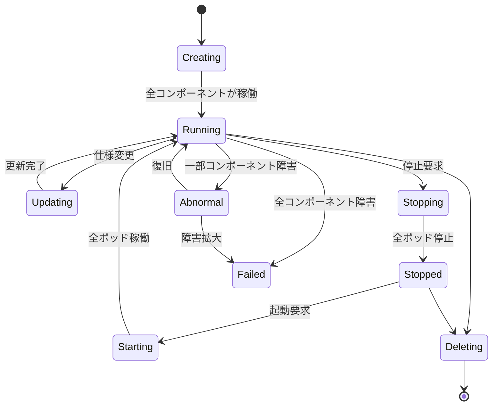
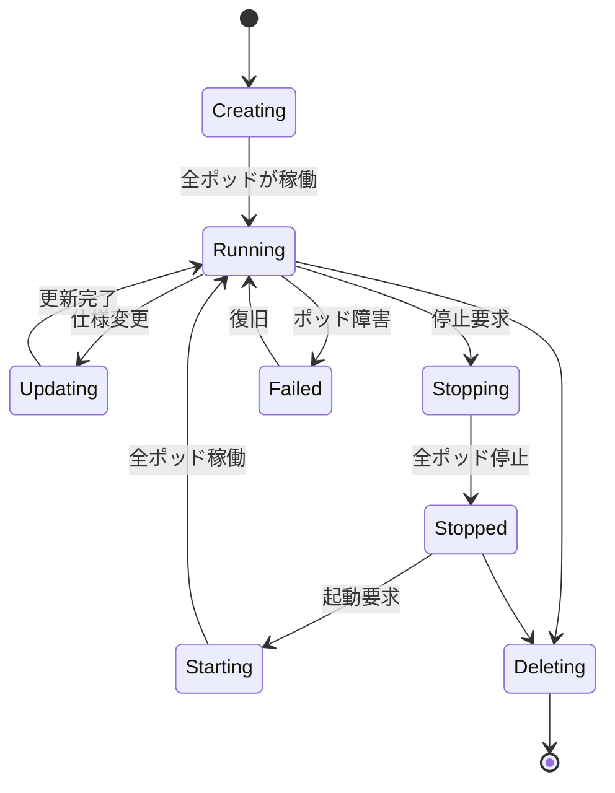
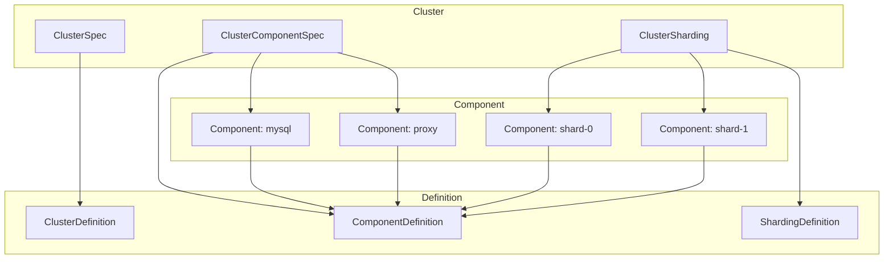

# 第3章 Cluster と Component の仕様

> 本章で読むソース:
>
> - [apis/apps/v1/cluster_types.go L65-L791](https://github.com/apecloud/kubeblocks/blob/v1.0.2/apis/apps/v1/cluster_types.go#L65-L791)
> - [apis/apps/v1/component_types.go L50-L414](https://github.com/apecloud/kubeblocks/blob/v1.0.2/apis/apps/v1/component_types.go#L50-L414)
> - [apis/apps/v1/shardingdefinition_types.go L37-L223](https://github.com/apecloud/kubeblocks/blob/v1.0.2/apis/apps/v1/shardingdefinition_types.go#L37-L223)

## この章の狙い

`Cluster` と `Component` は KubeBlocks が提供する CRD の中核であり、データベースクラスタの構成とライフサイクルを管理する。
本章では両者の型定義を読み、仕様フィールド・状態遷移・シャード構成の仕組みを整理する。

## 前提

- 第2章で `ClusterDefinition` と `ComponentDefinition` の構造を確認した。
- `Cluster` はユーザーが作成する名前空間Scoped オブジェクトであり、`Component` は `Cluster` から派生する内部オブジェクトである。

## Cluster の構造

### ClusterSpec の主要フィールド

`ClusterSpec` はクラスタ全体の設定を保持する。

[apis/apps/v1/cluster_types.go L88-L90](https://github.com/apecloud/kubeblocks/blob/v1.0.2/apis/apps/v1/cluster_types.go#L88-L90)

```go
// ClusterSpec defines the desired state of Cluster.
// +kubebuilder:validation:XValidation:rule="!has(oldSelf.topology) || has(self.topology)", message="topology is required once set"
type ClusterSpec struct {
```

主要なフィールドを以下に示す。

[apis/apps/v1/cluster_types.go L111-L111](https://github.com/apecloud/kubeblocks/blob/v1.0.2/apis/apps/v1/cluster_types.go#L111-L111)

```go
    ClusterDef string `json:"clusterDef,omitempty"`
```

`ClusterDef` は参照する `ClusterDefinition` の名前を指定する。
このフィールドは一度設定すると変更できない（immutable）。

[apis/apps/v1/cluster_types.go L128-L128](https://github.com/apecloud/kubeblocks/blob/v1.0.2/apis/apps/v1/cluster_types.go#L128-L128)

```go
    Topology string `json:"topology,omitempty"`
```

`Topology` は `ClusterDefinition` 内で定義された複数のトポロジーから一つを選択する。

[apis/apps/v1/cluster_types.go L145-L145](https://github.com/apecloud/kubeblocks/blob/v1.0.2/apis/apps/v1/cluster_types.go#L145-L145)

```go
    TerminationPolicy TerminationPolicyType `json:"terminationPolicy"`
```

`TerminationPolicy` はクラスタ削除時の挙動を制御する。

[apis/apps/v1/cluster_types.go L157-L157](https://github.com/apecloud/kubeblocks/blob/v1.0.2/apis/apps/v1/cluster_types.go#L157-L157)

```go
    ComponentSpecs []ClusterComponentSpec `json:"componentSpecs,omitempty" patchStrategy:"merge,retainKeys" patchMergeKey:"name"`
```

`ComponentSpecs` はクラスタを構成するコンポーネントの仕様のリストである。

[apis/apps/v1/cluster_types.go L175-L175](https://github.com/apecloud/kubeblocks/blob/v1.0.2/apis/apps/v1/cluster_types.go#L175-L175)

```go
    Shardings []ClusterSharding `json:"shardings,omitempty"`
```

`Shardings` はシャード構成を管理する。

### TerminationPolicy

`TerminationPolicy` はクラスタ削除時の挙動を制御する。

[apis/apps/v1/cluster_types.go L248-L257](https://github.com/apecloud/kubeblocks/blob/v1.0.2/apis/apps/v1/cluster_types.go#L248-L257)

```go
const (
    // DoNotTerminate will block delete operation.
    DoNotTerminate TerminationPolicyType = "DoNotTerminate"

    // Delete will delete all runtime resources belong to the cluster.
    Delete TerminationPolicyType = "Delete"

    // WipeOut is based on Delete and wipe out all volume snapshots and snapshot data from backup storage location.
    WipeOut TerminationPolicyType = "WipeOut"
)
```

`DoNotTerminate` は削除を禁止する。
`Delete` はランタイムリソースをすべて削除する。
`WipeOut` はボリュームスナップショットやバックアップストレージのデータも含めて完全に消去する。

### ClusterComponentSpec: コンポーネントのテンプレート

`ClusterComponentSpec` は `Cluster` 内に含まれる各コンポーネントの仕様を定義する。

[apis/apps/v1/cluster_types.go L259-L260](https://github.com/apecloud/kubeblocks/blob/v1.0.2/apis/apps/v1/cluster_types.go#L259-L260)

```go
// ClusterComponentSpec defines the specification of a Component within a Cluster.
type ClusterComponentSpec struct {
```

主要なフィールドを以下に示す。

[apis/apps/v1/cluster_types.go L269-L269](https://github.com/apecloud/kubeblocks/blob/v1.0.2/apis/apps/v1/cluster_types.go#L269-L269)

```go
    Name string `json:"name"`
```

`Name` はコンポーネントの識別子であり、Service の DNS 名の一部になる。

[apis/apps/v1/cluster_types.go L282-L282](https://github.com/apecloud/kubeblocks/blob/v1.0.2/apis/apps/v1/cluster_types.go#L282-L282)

```go
    ComponentDef string `json:"componentDef,omitempty"`
```

`ComponentDef` は参照する `ComponentDefinition` の名前を指定する。

[apis/apps/v1/cluster_types.go L342-L342](https://github.com/apecloud/kubeblocks/blob/v1.0.2/apis/apps/v1/cluster_types.go#L342-L342)

```go
    Replicas int32 `json:"replicas"`
```

`Replicas` はレプリカ数を指定する。

### PodUpdatePolicy

`PodUpdatePolicy` はポッドの更新方法を制御する。

[apis/apps/v1/cluster_types.go L451-L462](https://github.com/apecloud/kubeblocks/blob/v1.0.2/apis/apps/v1/cluster_types.go#L451-L462)

```go
    // PodUpdatePolicy indicates how pods should be updated
    //
    // - `StrictInPlace` indicates that only allows in-place upgrades.
    // Any attempt to modify other fields will be rejected.
    // - `PreferInPlace` indicates that we will first attempt an in-place upgrade of the Pod.
    // If that fails, it will fall back to the ReCreate, where pod will be recreated.
    // Default value is "PreferInPlace"
    //
    // +kubebuilder:validation:Enum={StrictInPlace,PreferInPlace}
    // +kubebuilder:default=PreferInPlace
    // +optional
    PodUpdatePolicy *PodUpdatePolicyType `json:"podUpdatePolicy,omitempty"`
```

`StrictInPlace` はその場での更新のみを許可する。
`PreferInPlace` はまずその場での更新を試み、失敗するとポッドを再作成する。

### InstanceTemplate: 個別レプリカの設定

`InstanceTemplate` を使うと、個別のレプリカごとに異なる設定を適用できる。

[apis/apps/v1/cluster_types.go L501-L501](https://github.com/apecloud/kubeblocks/blob/v1.0.2/apis/apps/v1/cluster_types.go#L501-L501)

```go
    Instances []InstanceTemplate `json:"instances,omitempty" patchStrategy:"merge,retainKeys" patchMergeKey:"name"`
```

これにより、プライマリとセカンダリで異なるリソース割り当てを指定する、といった柔軟な構成が可能になる。

### ClusterStatus と状態遷移

`ClusterStatus` はクラスタの現在状態を記録する。

[apis/apps/v1/cluster_types.go L203-L204](https://github.com/apecloud/kubeblocks/blob/v1.0.2/apis/apps/v1/cluster_types.go#L203-L204)

```go
// ClusterStatus defines the observed state of the Cluster.
type ClusterStatus struct {
```

[apis/apps/v1/cluster_types.go L214-L214](https://github.com/apecloud/kubeblocks/blob/v1.0.2/apis/apps/v1/cluster_types.go#L214-L214)

```go
    Phase ClusterPhase `json:"phase,omitempty"`
```

`Phase` はクラスタのライフサイクル状態を表す。

[apis/apps/v1/cluster_types.go L740-L768](https://github.com/apecloud/kubeblocks/blob/v1.0.2/apis/apps/v1/cluster_types.go#L740-L768)

```go
const (
    // CreatingClusterPhase represents all components are in `Creating` phase.
    CreatingClusterPhase ClusterPhase = "Creating"

    // RunningClusterPhase represents all components are in `Running` phase, indicates that the cluster is functioning properly.
    RunningClusterPhase ClusterPhase = "Running"

    // UpdatingClusterPhase represents all components are in `Creating`, `Running` or `Updating` phase, and at least one
    // component is in `Creating` or `Updating` phase, indicates that the cluster is undergoing an update.
    UpdatingClusterPhase ClusterPhase = "Updating"

    // StoppingClusterPhase represents at least one component is in `Stopping` phase, indicates that the cluster is in
    // the process of stopping.
    StoppingClusterPhase ClusterPhase = "Stopping"

    // StoppedClusterPhase represents all components are in `Stopped` phase, indicates that the cluster has stopped and
    // is not providing any functionality.
    StoppedClusterPhase ClusterPhase = "Stopped"

    // DeletingClusterPhase indicates the cluster is being deleted.
    DeletingClusterPhase ClusterPhase = "Deleting"

    // FailedClusterPhase represents all components are in `Failed` phase, indicates that the cluster is unavailable.
    FailedClusterPhase ClusterPhase = "Failed"

    // AbnormalClusterPhase represents some components are in `Failed` phase, indicates that the cluster is in
    // a fragile state and troubleshooting is required.
    AbnormalClusterPhase ClusterPhase = "Abnormal"
)
```

クラスタは `Creating` から始まり、全コンポーネントが稼働すると `Running` になる。
更新中は `Updating`、停止処理中は `Stopping`、完全停止後は `Stopped` になる。
一部のコンポーネントが障害状態になると `Abnormal`、すべてが障害になると `Failed` になる。



## Component の構造

### ComponentSpec の主要フィールド

`Component` は `Cluster` から派生する内部オブジェクトであり、実際のワークロードを管理する。

[apis/apps/v1/component_types.go L50-L56](https://github.com/apecloud/kubeblocks/blob/v1.0.2/apis/apps/v1/component_types.go#L50-L56)

```go
type Component struct {
    metav1.TypeMeta   `json:",inline"`
    metav1.ObjectMeta `json:"metadata,omitempty"`

    Spec   ComponentSpec   `json:"spec,omitempty"`
    Status ComponentStatus `json:"status,omitempty"`
}
```

`ComponentSpec` の構造は `ClusterComponentSpec` と類似している。

[apis/apps/v1/component_types.go L71-L72](https://github.com/apecloud/kubeblocks/blob/v1.0.2/apis/apps/v1/component_types.go#L71-L72)

```go
// ComponentSpec defines the desired state of Component
type ComponentSpec struct {
```

[apis/apps/v1/component_types.go L83-L83](https://github.com/apecloud/kubeblocks/blob/v1.0.2/apis/apps/v1/component_types.go#L83-L83)

```go
    CompDef string `json:"compDef"`
```

`CompDef` は参照する `ComponentDefinition` の完全名を保持する。

[apis/apps/v1/component_types.go L321-L321](https://github.com/apecloud/kubeblocks/blob/v1.0.2/apis/apps/v1/component_types.go#L321-L321)

```go
    Sidecars []Sidecar `json:"sidecars,omitempty"`
```

`Sidecars` はコンポーネントに注入するサイドカーコンテナを指定する。

### ComponentStatus と状態遷移

`ComponentStatus` はコンポーネントの現在状態を記録する。

[apis/apps/v1/component_types.go L324-L325](https://github.com/apecloud/kubeblocks/blob/v1.0.2/apis/apps/v1/component_types.go#L324-L325)

```go
// ComponentStatus represents the observed state of a Component within the Cluster.
type ComponentStatus struct {
```

[apis/apps/v1/component_types.go L351-L351](https://github.com/apecloud/kubeblocks/blob/v1.0.2/apis/apps/v1/component_types.go#L351-L351)

```go
    Phase ComponentPhase `json:"phase,omitempty"`
```

`Phase` はコンポーネントのライフサイクル状態を表す。

[apis/apps/v1/component_types.go L390-L414](https://github.com/apecloud/kubeblocks/blob/v1.0.2/apis/apps/v1/component_types.go#L390-L414)

```go
const (
    // CreatingComponentPhase indicates the component is currently being created.
    CreatingComponentPhase ComponentPhase = "Creating"

    // DeletingComponentPhase indicates the component is currently being deleted.
    DeletingComponentPhase ComponentPhase = "Deleting"

    // UpdatingComponentPhase indicates the component is currently being updated.
    UpdatingComponentPhase ComponentPhase = "Updating"

    // StoppingComponentPhase indicates the component is currently being stopped.
    StoppingComponentPhase ComponentPhase = "Stopping"

    // StartingComponentPhase indicates the component is currently being started.
    StartingComponentPhase ComponentPhase = "Starting"

    // RunningComponentPhase indicates that all pods of the component are up-to-date and in a 'Running' state.
    RunningComponentPhase ComponentPhase = "Running"

    // StoppedComponentPhase indicates the component is stopped.
    StoppedComponentPhase ComponentPhase = "Stopped"

    // FailedComponentPhase indicates that there are some pods of the component not in a 'Running' state.
    FailedComponentPhase ComponentPhase = "Failed"
)
```

コンポーネントの状態遷移はクラスタと類似しているが、`Starting` が明示的に定義されている点が異なる。



## シャード構成

### ClusterSharding

分散データベースでは、データを複数のシャードに分散する構成が必要になる。
`ClusterSharding` は動的なシャード管理を実現する。

[apis/apps/v1/cluster_types.go L579-L585](https://github.com/apecloud/kubeblocks/blob/v1.0.2/apis/apps/v1/cluster_types.go#L579-L585)

```go
// ClusterSharding defines how KubeBlocks manage dynamic provisioned shards.
// A typical design pattern for distributed databases is to distribute data across multiple shards,
// with each shard consisting of multiple replicas.
// Therefore, KubeBlocks supports representing a shard with a Component and dynamically instantiating Components
// using a template when shards are added.
// When shards are removed, the corresponding Components are also deleted.
type ClusterSharding struct {
```

[apis/apps/v1/cluster_types.go L601-L601](https://github.com/apecloud/kubeblocks/blob/v1.0.2/apis/apps/v1/cluster_types.go#L601-L601)

```go
    Name string `json:"name"`
```

`Name` はシャードグループの共通接頭辞になる。

[apis/apps/v1/cluster_types.go L622-L622](https://github.com/apecloud/kubeblocks/blob/v1.0.2/apis/apps/v1/cluster_types.go#L622-L622)

```go
    Template ClusterComponentSpec `json:"template"`
```

`Template` は各シャードを構成するコンポーネントのテンプレートである。

[apis/apps/v1/cluster_types.go L640-L640](https://github.com/apecloud/kubeblocks/blob/v1.0.2/apis/apps/v1/cluster_types.go#L640-L640)

```go
    Shards int32 `json:"shards"`
```

`Shards` は期待するシャード数を指定する。

シャード数の増減に応じて、KubeBlocks はコンポーネントを動的に作成・削除する。

### ShardingDefinition

`ShardingDefinition` はシャードの動作を定義する。

[apis/apps/v1/shardingdefinition_types.go L58-L59](https://github.com/apecloud/kubeblocks/blob/v1.0.2/apis/apps/v1/shardingdefinition_types.go#L58-L59)

```go
// ShardingDefinitionSpec defines the desired state of ShardingDefinition
type ShardingDefinitionSpec struct {
```

[apis/apps/v1/shardingdefinition_types.go L63-L63](https://github.com/apecloud/kubeblocks/blob/v1.0.2/apis/apps/v1/shardingdefinition_types.go#L63-L63)

```go
    Template ShardingTemplate `json:"template"`
```

[apis/apps/v1/shardingdefinition_types.go L70-L70](https://github.com/apecloud/kubeblocks/blob/v1.0.2/apis/apps/v1/shardingdefinition_types.go#L70-L70)

```go
    ShardsLimit *ShardsLimit `json:"shardsLimit,omitempty"`
```

`ShardsLimit` はシャード数の上限・下限を制約する。

[apis/apps/v1/shardingdefinition_types.go L147-L157](https://github.com/apecloud/kubeblocks/blob/v1.0.2/apis/apps/v1/shardingdefinition_types.go#L147-L157)

```go
type ShardsLimit struct {
    // The minimum limit of shards.
    //
    // +kubebuilder:validation:Required
    MinShards int32 `json:"minShards"`

    // The maximum limit of shards.
    //
    // +kubebuilder:validation:Required
    MaxShards int32 `json:"maxShards"`
}
```

[apis/apps/v1/shardingdefinition_types.go L93-L93](https://github.com/apecloud/kubeblocks/blob/v1.0.2/apis/apps/v1/shardingdefinition_types.go#L93-L93)

```go
    LifecycleActions *ShardingLifecycleActions `json:"lifecycleActions,omitempty"`
```

`LifecycleActions` はシャードのライフサイクルイベントに対応するフックを定義する。

[apis/apps/v1/shardingdefinition_types.go L159-L160](https://github.com/apecloud/kubeblocks/blob/v1.0.2/apis/apps/v1/shardingdefinition_types.go#L159-L160)

```go
// ShardingLifecycleActions defines a collection of Actions for customizing the behavior of a sharding.
type ShardingLifecycleActions struct {
```

[apis/apps/v1/shardingdefinition_types.go L194-L194](https://github.com/apecloud/kubeblocks/blob/v1.0.2/apis/apps/v1/shardingdefinition_types.go#L194-L194)

```go
	ShardAdd *Action `json:"shardAdd,omitempty"`
```

[apis/apps/v1/shardingdefinition_types.go L201-L201](https://github.com/apecloud/kubeblocks/blob/v1.0.2/apis/apps/v1/shardingdefinition_types.go#L201-L201)

```go
	ShardRemove *Action `json:"shardRemove,omitempty"`
```

`ShardAdd` はシャード追加後に実行されるアクション。
`ShardRemove` はシャード削除前に実行されるアクション。

## Cluster と Component の関係

`Cluster` と `Component` の関係を整理する。



`Cluster` は `ClusterDefinition` を参照し、`ClusterComponentSpec` のリストを通じて各コンポーネントの仕様を定義する。
`ClusterSharding` は `ShardingDefinition` を参照し、テンプレートから複数のコンポーネントを生成する。

`Component` は `Cluster` から生成される内部オブジェクトであり、`ComponentDefinition` を参照して実際のワークロードを管理する。

## 高速化の工夫: CEL による API レベルでの検証

KubeBlocks は Kubernetes の CEL（Common Expression Language）バリデーションを活用して、API レベルで制約を検証する。

[apis/apps/v1/cluster_types.go L154-L155](https://github.com/apecloud/kubeblocks/blob/v1.0.2/apis/apps/v1/cluster_types.go#L154-L155)

```go
    // +kubebuilder:validation:XValidation:rule="self.all(x, size(self.filter(c, c.name == x.name)) == 1)",message="duplicated component"
    // +kubebuilder:validation:XValidation:rule="self.all(x, size(self.filter(c, has(c.componentDef))) == 0) || self.all(x, size(self.filter(c, has(c.componentDef))) == size(self))",message="two kinds of definition API can not be used simultaneously"
```

これらのバリデーションルールは、`ComponentSpecs` 内の名前が重複していないこと、および `componentDef` フィールドの指定方法が統一されていることを保証する。

CEL バリデーションの利点は、Admission Webhook を経由せずに API サーバー内で検証が完了することである。
これにより、ネットワーク往復を省略でき、リクエストのレイテンシを削減できる。

## まとめ

本章では `Cluster` と `Component` の型定義を読んだ。

- `Cluster` は `ClusterDefinition` を参照し、複数の `ClusterComponentSpec` から構成される
- `Component` は `Cluster` から派生する内部オブジェクトであり、実際のワークロードを管理する
- `ClusterSharding` と `ShardingDefinition` により、分散データベースのシャード構成を動的に管理できる
- CEL バリデーションにより、API レベルで制約を検証し、Webhook のオーバーヘッドを回避している

## 関連する章

- 第2章: [ClusterDefinition と ComponentDefinition](02-definitions.md)
- 第4章: [InstanceSet: ポッド集合のワークロード抽象](04-instanceset.md)
- 第8章: [Cluster コントローラ: コンポーネントの編成](../part02-main-controllers/08-cluster-controller.md)
- 第9章: [Component コントローラ: ワークロードの生成](../part02-main-controllers/09-component-controller.md)
